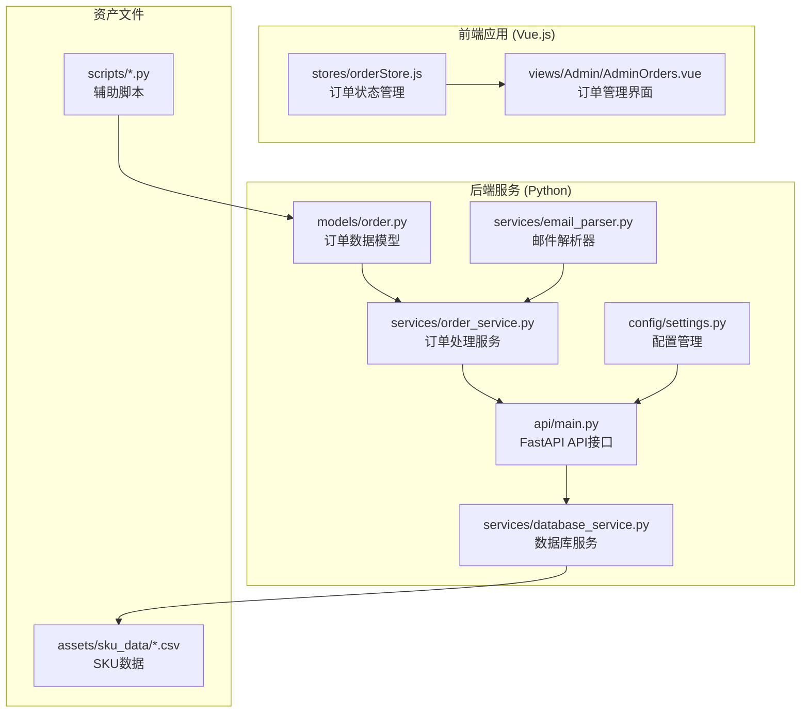
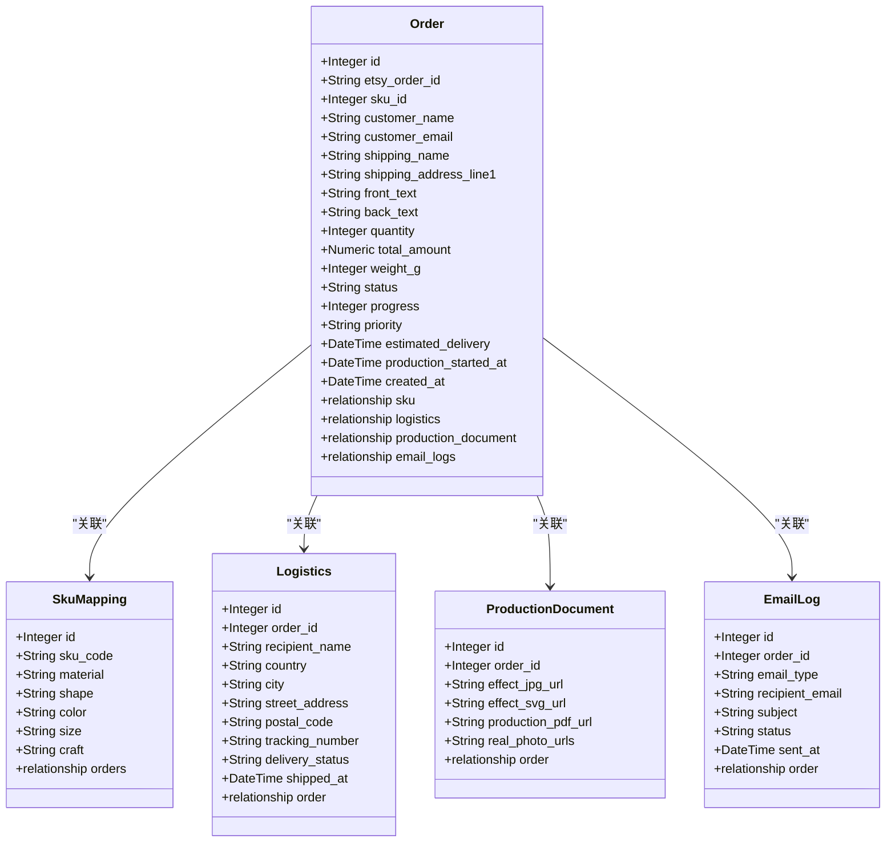
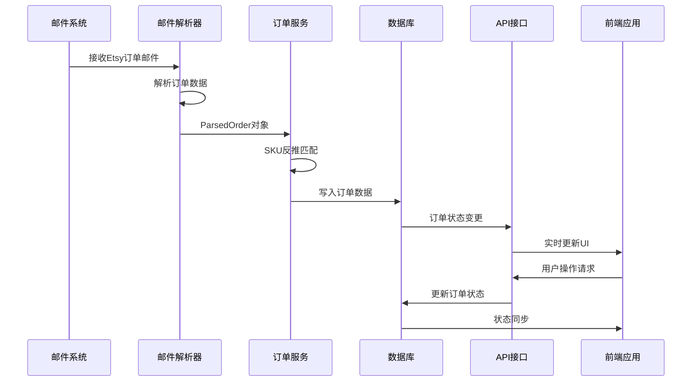
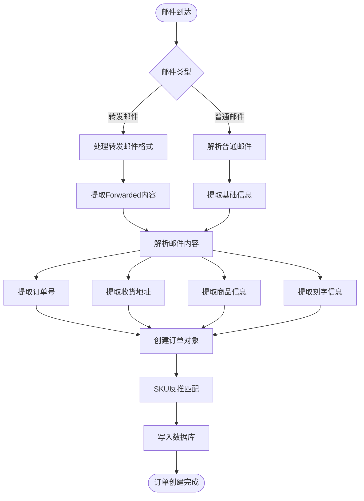
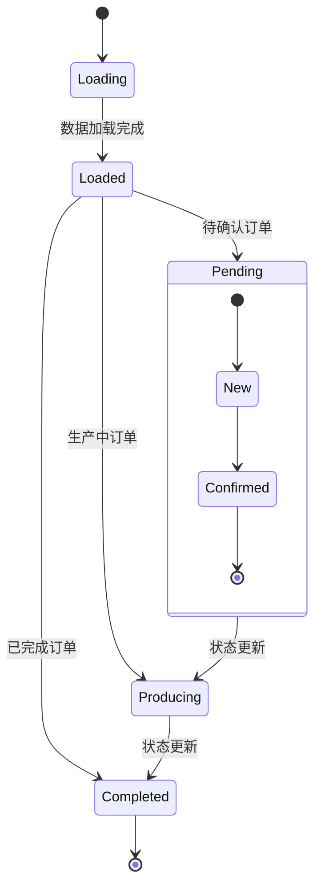
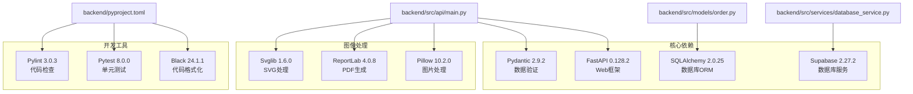
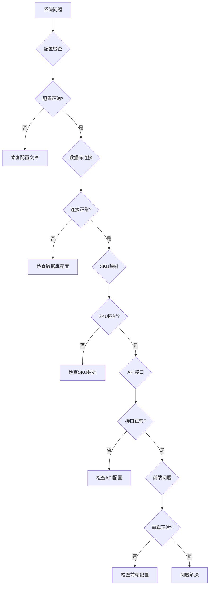

# 订单模型扩展

<cite>
**本文档引用的文件**
- [backend/src/models/order.py](file://backend/src/models/order.py)
- [backend/src/services/order_service.py](file://backend/src/services/order_service.py)
- [backend/src/api/main.py](file://backend/src/api/main.py)
- [backend/src/services/database_service.py](file://backend/src/services/database_service.py)
- [backend/src/services/email_parser.py](file://backend/src/services/email_parser.py)
- [backend/src/config/settings.py](file://backend/src/config/settings.py)
- [backend/pyproject.toml](file://backend/pyproject.toml)
- [backend/assets/sku_data/不锈钢牌-带路径信息_表格.csv](file://backend/assets/sku_data/不锈钢牌-带路径信息_表格.csv)
- [backend/scripts/check_orders_sku.py](file://backend/scripts/check_orders_sku.py)
- [backend/scripts/create_tables_sql.md](file://backend/scripts/create_tables_sql.md)
- [frontend/src/stores/orderStore.js](file://frontend/src/stores/orderStore.js)
- [frontend/src/views/Admin/AdminOrders.vue](file://frontend/src/views/Admin/AdminOrders.vue)
</cite>

## 目录
1. [简介](#简介)
2. [项目结构](#项目结构)
3. [核心组件](#核心组件)
4. [架构概览](#架构概览)
5. [详细组件分析](#详细组件分析)
6. [依赖关系分析](#依赖关系分析)
7. [性能考虑](#性能考虑)
8. [故障排除指南](#故障排除指南)
9. [结论](#结论)

## 简介

这是一个基于Python和Vue.js的Etsy订单自动化处理系统。该系统实现了从邮件解析到订单管理、从效果图生成到物流处理的完整业务流程。本文档重点分析订单模型扩展功能，包括多租户支持、SKU映射机制、订单状态管理和前后端集成。

## 项目结构

**图表来源**
- [backend/src/models/order.py:1-356](file://backend/src/models/order.py#L1-L356)
- [backend/src/api/main.py:1-949](file://backend/src/api/main.py#L1-L949)

**章节来源**
- [backend/src/models/order.py:1-356](file://backend/src/models/order.py#L1-L356)
- [backend/src/api/main.py:1-949](file://backend/src/api/main.py#L1-L949)

## 核心组件

### 订单数据模型

系统采用SQLAlchemy ORM定义了完整的订单数据模型，支持多租户扩展和丰富的业务功能：

**图表来源**
- [backend/src/models/order.py:23-244](file://backend/src/models/order.py#L23-L244)

### 多租户扩展

系统支持多租户架构，通过扩展orders表实现：

| 扩展字段 | 数据类型 | 约束 | 描述 |
|---------|---------|------|------|
| shop_id | UUID | REFERENCES shops(id) | 关联到店铺表 |
| shop_order_id | VARCHAR(50) |  | 店铺内部订单号 |

**章节来源**
- [backend/scripts/create_tables_sql.md:47-56](file://backend/scripts/create_tables_sql.md#L47-L56)
- [backend/scripts/init_multitenant.sql:45-54](file://backend/scripts/init_multitenant.sql#L45-L54)

## 架构概览

**图表来源**
- [backend/src/services/email_parser.py:61-294](file://backend/src/services/email_parser.py#L61-L294)
- [backend/src/services/order_service.py:95-142](file://backend/src/services/order_service.py#L95-L142)

## 详细组件分析

### 邮件解析与订单创建

系统实现了强大的Etsy邮件解析功能，支持多种邮件格式：

**图表来源**
- [backend/src/services/email_parser.py:61-294](file://backend/src/services/email_parser.py#L61-L294)
- [backend/src/services/order_service.py:95-142](file://backend/src/services/order_service.py#L95-L142)

### SKU映射与产品管理

系统提供了灵活的SKU映射机制，支持多维度的产品属性匹配：

| 产品属性 | 支持值 | 映射规则 |
|---------|--------|----------|
| 外观形状 | heart, round, bone | 英文到中文映射 |
| 产品颜色 | gold, silver, rose gold, black | 统一颜色标准 |
| 产品尺寸 | large, small, medium | L/S标准化处理 |

**章节来源**
- [backend/src/services/order_service.py:23-88](file://backend/src/services/order_service.py#L23-L88)
- [backend/assets/sku_data/不锈钢牌-带路径信息_表格.csv:1-26](file://backend/assets/sku_data/不锈钢牌-带路径信息_表格.csv#L1-L26)

### API接口设计

系统提供RESTful API接口，支持完整的订单生命周期管理：

| 接口 | 方法 | 功能描述 |
|------|------|----------|
| `/api/effect-image/generate` | POST | 生成效果图SVG |
| `/api/order/update-status` | POST | 更新订单状态 |
| `/api/pdf/generate-and-upload` | POST | 生成并上传PDF |
| `/api/shipping/create-order` | POST | 创建物流订单 |
| `/api/shipping/get-label` | POST | 获取物流面单 |

**章节来源**
- [backend/src/api/main.py:204-446](file://backend/src/api/main.py#L204-L446)

### 前端状态管理

Vue.js Pinia状态管理实现了完整的订单状态同步：

**图表来源**
- [frontend/src/stores/orderStore.js:23-42](file://frontend/src/stores/orderStore.js#L23-L42)

**章节来源**
- [frontend/src/stores/orderStore.js:44-143](file://frontend/src/stores/orderStore.js#L44-L143)

## 依赖关系分析

**图表来源**
- [backend/pyproject.toml:8-35](file://backend/pyproject.toml#L8-L35)

**章节来源**
- [backend/pyproject.toml:1-69](file://backend/pyproject.toml#L1-L69)

## 性能考虑

### 数据库优化

1. **索引策略**：为常用查询字段建立索引，包括 `etsy_order_id`、`status`、`shop_id`
2. **连接池管理**：使用SQLAlchemy连接池减少数据库连接开销
3. **批量操作**：支持批量查询和更新操作

### 缓存机制

1. **SKU映射缓存**：缓存SKU映射数据减少数据库查询
2. **订单状态缓存**：前端Pinia状态管理实现本地缓存
3. **图片资源缓存**：Supabase Storage提供CDN加速

### 异步处理

1. **PDF生成异步化**：物流下单后异步生成生产文档PDF
2. **邮件发送队列**：支持批量邮件发送
3. **图像处理队列**：后台处理复杂的图像生成任务

## 故障排除指南

### 常见问题诊断

### 调试工具

1. **订单SKU检查**：使用 `check_orders_sku.py` 脚本检查订单SKU关联
2. **订单流程检查**：使用 `check_order_flow.py` 验证订单数据完整性
3. **环境配置验证**：使用 `settings.py` 的验证方法检查配置

**章节来源**
- [backend/scripts/check_orders_sku.py:1-42](file://backend/scripts/check_orders_sku.py#L1-L42)
- [backend/src/config/settings.py:38-62](file://backend/src/config/settings.py#L38-L62)

## 结论

该订单模型扩展系统实现了完整的电商订单自动化处理流程，具有以下特点：

1. **模块化设计**：清晰的分层架构，便于维护和扩展
2. **多租户支持**：灵活的多店铺管理能力
3. **数据一致性**：严格的约束和验证机制
4. **前后端分离**：现代化的技术栈组合
5. **可扩展性**：良好的抽象设计支持功能扩展

系统通过邮件解析、SKU映射、状态管理和API接口实现了从订单接收到生产执行的全流程自动化，为电商运营提供了强有力的技术支撑。