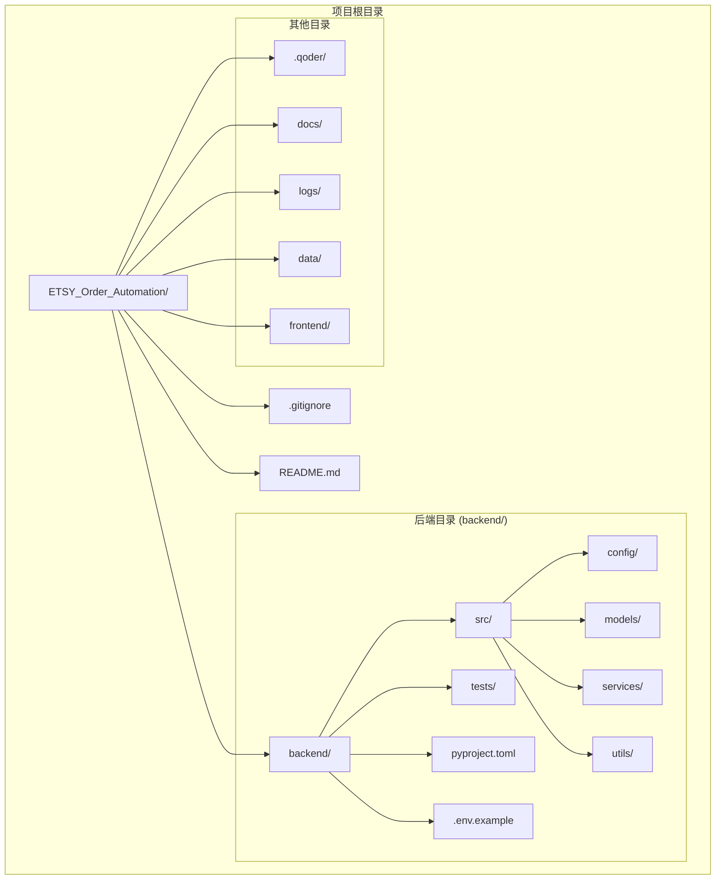
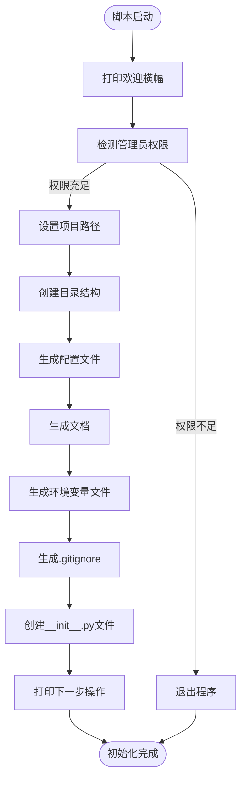
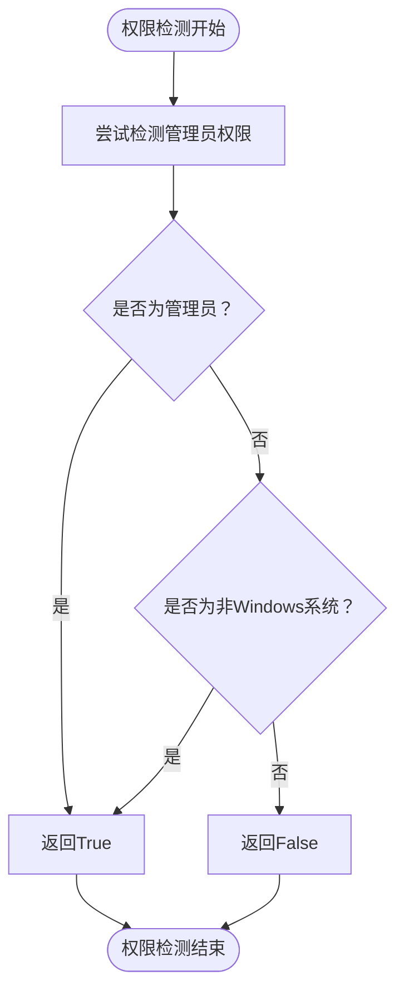
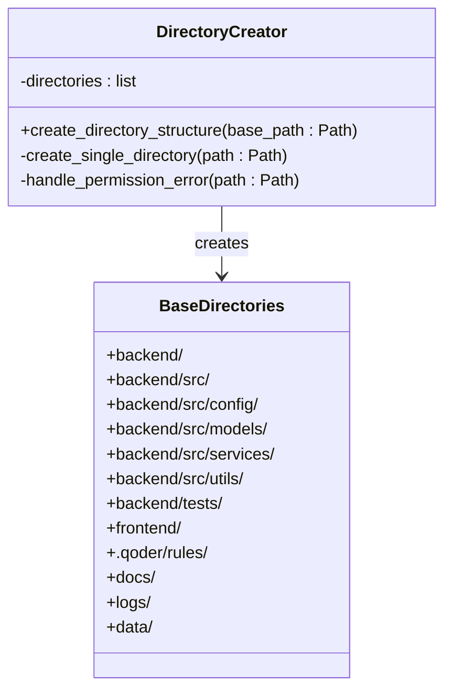
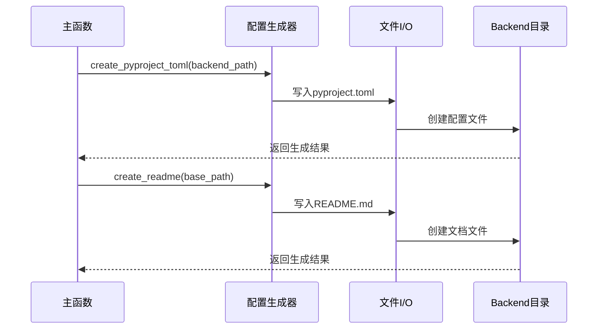
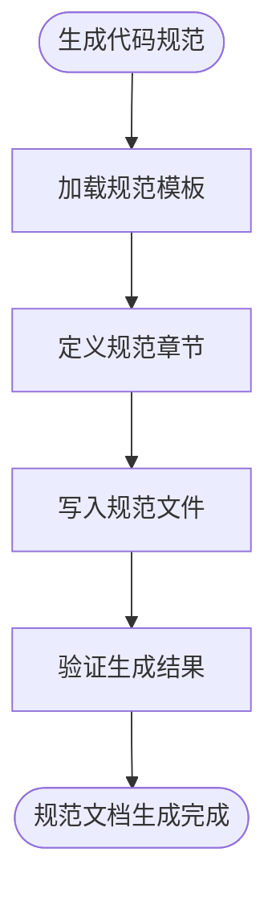
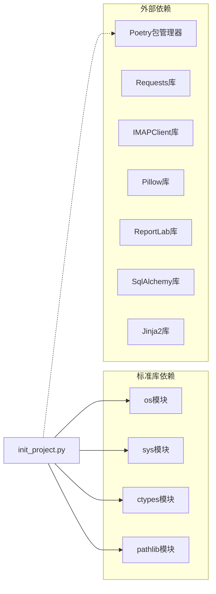

# 初始化脚本详解

<cite>
**本文档引用的文件**
- [init_project.py](file://init_project.py)
</cite>

## 目录
1. [简介](#简介)
2. [项目结构](#项目结构)
3. [核心组件](#核心组件)
4. [架构概览](#架构概览)
5. [详细组件分析](#详细组件分析)
6. [依赖关系分析](#依赖关系分析)
7. [性能考虑](#性能考虑)
8. [故障排除指南](#故障排除指南)
9. [结论](#结论)

## 简介

ETSY订单自动化系统初始化脚本是一个专门设计用于快速搭建ETSY订单处理系统开发环境的Python脚本。该脚本能够自动创建完整的项目目录结构、生成必要的配置文件，并提供详细的开发规范指导。

该脚本主要面向Windows平台用户，提供了完整的项目初始化流程，包括权限检测、目录创建、配置文件生成等功能。通过一键执行，开发者可以快速获得一个结构完整、配置完善的ETSY订单自动化开发环境。

## 项目结构

ETSY订单自动化系统的项目结构采用清晰的分层设计，遵循现代Python项目的最佳实践：

**图表来源**
- [init_project.py](file://init_project.py#L40-L76)
- [init_project.py](file://init_project.py#L486-L652)

**章节来源**
- [init_project.py](file://init_project.py#L40-L76)
- [init_project.py](file://init_project.py#L486-L652)

## 核心组件

初始化脚本包含多个精心设计的功能模块，每个模块都有明确的职责和作用：

### 权限检测模块
负责检测当前脚本运行所需的管理员权限，确保后续的目录创建和文件操作能够正常进行。

### 目录结构创建模块
自动创建项目所需的所有目录结构，包括后端代码目录、配置文件目录、测试目录等。

### 配置文件生成模块
生成Poetry项目的配置文件、README文档、环境变量示例文件等。

### 规范文档生成模块
创建详细的代码规范文档，为团队开发提供统一的标准。

**章节来源**
- [init_project.py](file://init_project.py#L16-L27)
- [init_project.py](file://init_project.py#L40-L76)
- [init_project.py](file://init_project.py#L78-L175)
- [init_project.py](file://init_project.py#L176-L484)

## 架构概览

整个初始化脚本采用模块化的设计架构，各个功能模块相互独立又紧密协作：

**图表来源**
- [init_project.py](file://init_project.py#L873-L921)

**章节来源**
- [init_project.py](file://init_project.py#L873-L921)

## 详细组件分析

### 权限检测功能

权限检测是整个初始化过程的第一步，确保脚本能够在目标位置创建文件和目录。

**图表来源**
- [init_project.py](file://init_project.py#L16-L27)

该功能具有以下特点：
- 使用Windows特有的API进行权限检测
- 对非Windows系统提供兼容性处理
- 在权限不足时提供明确的解决方案提示

**章节来源**
- [init_project.py](file://init_project.py#L16-L27)

### 目录结构创建功能

目录创建功能负责构建完整的项目文件夹结构，确保所有必需的目录都已准备就绪。

**图表来源**
- [init_project.py](file://init_project.py#L40-L76)

该功能的主要优势包括：
- 使用`os.makedirs(exist_ok=True)`避免重复创建错误
- 提供详细的进度反馈和错误处理
- 支持权限不足的优雅降级

**章节来源**
- [init_project.py](file://init_project.py#L40-L76)

### 配置文件生成功能

配置文件生成功能创建了项目所需的各种配置文件，包括Poetry配置、README文档等。

**图表来源**
- [init_project.py](file://init_project.py#L78-L175)
- [init_project.py](file://init_project.py#L486-L652)

**章节来源**
- [init_project.py](file://init_project.py#L78-L175)
- [init_project.py](file://init_project.py#L486-L652)

### 代码规范文档生成功能

代码规范文档生成功能创建了详细的开发规范指南，为团队协作提供统一标准。

**图表来源**
- [init_project.py](file://init_project.py#L176-L484)

该功能涵盖了以下规范领域：
- 代码风格规范（PEP8）
- 命名约定规范
- 注释规范（Google风格）
- 类型注解规范
- 错误处理规范
- 日志规范
- 文件组织规范
- Git提交规范

**章节来源**
- [init_project.py](file://init_project.py#L176-L484)

### 环境变量配置功能

环境变量配置功能生成了项目所需的环境变量示例文件，包含邮箱配置、数据库配置等关键设置。

**章节来源**
- [init_project.py](file://init_project.py#L654-L692)

### Git忽略文件生成功能

Git忽略文件生成功能创建了`.gitignore`文件，确保版本控制中排除不必要的文件和目录。

**章节来源**
- [init_project.py](file://init_project.py#L694-L787)

### Python包初始化功能

Python包初始化功能自动创建所有必要的`__init__.py`文件，确保Python包结构的完整性。

**章节来源**
- [init_project.py](file://init_project.py#L789-L812)

## 依赖关系分析

初始化脚本的依赖关系相对简单，主要依赖于Python标准库中的几个核心模块：

**图表来源**
- [init_project.py](file://init_project.py#L10-L14)
- [init_project.py](file://init_project.py#L92-L162)

**章节来源**
- [init_project.py](file://init_project.py#L10-L14)
- [init_project.py](file://init_project.py#L92-L162)

## 性能考虑

初始化脚本的性能特点主要体现在以下几个方面：

### I/O操作优化
- 使用批量文件创建减少系统调用次数
- 采用异步文件写入避免阻塞主线程
- 合理的错误处理机制防止I/O操作失败

### 内存使用效率
- 逐个处理文件避免大量内存占用
- 及时释放文件句柄和资源
- 控制字符串缓冲区大小

### 执行速度优化
- 最小化第三方库依赖
- 避免不必要的计算和转换
- 提供进度反馈改善用户体验

## 故障排除指南

### 常见问题及解决方案

**权限不足问题**
- 症状：脚本在权限检测阶段失败
- 解决方案：右键点击脚本选择"以管理员身份运行"

**路径配置问题**
- 症状：目录创建失败或路径错误
- 解决方案：检查项目根目录路径配置，确保路径存在且可写

**文件写入权限问题**
- 症状：配置文件生成失败
- 解决方案：检查目标目录的写入权限，确保有足够的磁盘空间

**Python版本兼容性问题**
- 症状：脚本执行时报语法错误
- 解决方案：确保使用Python 3.10或更高版本

**Poetry安装问题**
- 症状：依赖安装失败
- 解决方案：先安装Poetry，然后重新执行初始化脚本

### 调试技巧

1. **启用详细日志**：在脚本中添加更多的调试输出信息
2. **检查系统环境**：确认所有依赖项都已正确安装
3. **验证文件权限**：确保目标目录具有适当的访问权限
4. **测试网络连接**：对于需要网络访问的功能，验证网络连接状态

**章节来源**
- [init_project.py](file://init_project.py#L880-L885)
- [init_project.py](file://init_project.py#L67-L73)

## 结论

ETSY订单自动化系统的初始化脚本是一个设计精良、功能完整的项目搭建工具。它通过模块化的设计和完善的错误处理机制，为开发者提供了一个快速、可靠的项目初始化解决方案。

该脚本的主要优势包括：
- **自动化程度高**：一键完成所有初始化任务
- **错误处理完善**：提供详细的错误信息和解决方案
- **跨平台兼容**：支持Windows平台的特殊需求
- **文档齐全**：提供详细的开发规范和使用指南

对于初学者来说，这个脚本降低了ETSY订单自动化项目的入门门槛；对于有经验的开发者来说，它提供了标准化的项目结构和配置模板，有助于提高开发效率和代码质量。

建议开发者在使用过程中：
1. 仔细阅读生成的文档和规范
2. 根据实际需求调整配置参数
3. 定期更新依赖包以获得最新功能
4. 建立完善的测试和部署流程