# 初始化脚本详解

<cite>
**本文档引用的文件**
- [init_project.py](file://init_project.py)
- [init_shop_au01.py](file://backend/scripts/init_shop_au01.py)
- [database_service.py](file://backend/src/services/database_service.py)
</cite>

## 更新摘要
**变更内容**
- 新增init_shop_au01.py脚本的详细技术文档
- 添加店铺初始化流程的完整分析
- 更新数据库连接验证和令牌生成机制说明
- 增加订单关联和外链生成的实现细节
- 扩展文档以涵盖新的自动化初始化功能

## 目录
1. [简介](#简介)
2. [项目结构](#项目结构)
3. [核心组件](#核心组件)
4. [架构概览](#架构概览)
5. [详细组件分析](#详细组件分析)
6. [新增功能：店铺初始化脚本](#新增功能店铺初始化脚本)
7. [依赖关系分析](#依赖关系分析)
8. [性能考虑](#性能考虑)
9. [故障排除指南](#故障排除指南)
10. [结论](#结论)

## 简介

ETSY订单自动化系统初始化脚本是一个专门设计用于快速搭建ETSY订单处理系统开发环境的Python脚本集合。该脚本集合包含两个主要组件：

1. **项目初始化脚本** (`init_project.py`)：用于创建完整的项目目录结构、生成必要的配置文件，并提供详细的开发规范指导
2. **店铺初始化脚本** (`init_shop_au01.py`)：专门用于初始化特定店铺（澳洲01店），包括数据库连接验证、令牌生成和订单关联

该脚本集合主要面向Windows平台用户，提供了完整的项目初始化流程，包括权限检测、目录创建、配置文件生成等功能。通过一键执行，开发者可以快速获得一个结构完整、配置完善的ETSY订单自动化开发环境。

## 项目结构

ETSY订单自动化系统的项目结构采用清晰的分层设计，遵循现代Python项目的最佳实践：

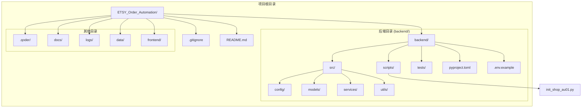
```mermaid
graph TB
subgraph "项目根目录"
Root["ETSY_Order_Automation/"]
subgraph "后端目录 (backend/)"
Backend["backend/"]
Src["src/"]
Scripts["scripts/"]
Config["config/"]
Models["models/"]
Services["services/"]
Utils["utils/"]
Tests["tests/"]
PyProject["pyproject.toml"]
EnvExample[".env.example"]
end
subgraph "其他目录"
Qoder[".qoder/"]
Docs["docs/"]
Logs["logs/"]
Data["data/"]
Frontend["frontend/"]
end
GitIgnore[".gitignore"]
Readme["README.md"]
end
Root --> Backend
Root --> Qoder
Root --> Docs
Root --> Logs
Root --> Data
Root --> Frontend
Root --> GitIgnore
Root --> Readme
Backend --> Src
Backend --> Scripts
Backend --> Tests
Backend --> PyProject
Backend --> EnvExample
Src --> Config
Src --> Models
Src --> Services
Src --> Utils
Scripts --> InitShop["init_shop_au01.py"]
```

**图表来源**
- [init_project.py:40-76](file://init_project.py#L40-L76)
- [init_shop_au01.py:1-260](file://backend/scripts/init_shop_au01.py#L1-L260)

**章节来源**
- [init_project.py:40-76](file://init_project.py#L40-L76)
- [init_project.py:880-914](file://init_project.py#L880-L914)
- [init_shop_au01.py:1-260](file://backend/scripts/init_shop_au01.py#L1-L260)

## 核心组件

初始化脚本集合包含多个精心设计的功能模块，每个模块都有明确的职责和作用：

### 项目初始化模块
负责检测当前脚本运行所需的管理员权限，确保后续的目录创建和文件操作能够正常进行。

### 目录结构创建模块
自动创建项目所需的所有目录结构，包括后端代码目录、配置文件目录、测试目录等。

### 配置文件生成模块
生成Poetry项目的配置文件、README文档、环境变量示例文件等。

### 规范文档生成模块
创建详细的代码规范文档，为团队开发提供统一的标准。

### 店铺初始化模块（新增）
专门用于初始化特定店铺，包括数据库连接验证、令牌生成、订单关联和外链生成。

**章节来源**
- [init_project.py:16-27](file://init_project.py#L16-L27)
- [init_project.py:40-76](file://init_project.py#L40-L76)
- [init_project.py:78-175](file://init_project.py#L78-L175)
- [init_project.py:176-484](file://init_project.py#L176-L484)
- [init_shop_au01.py:20-254](file://backend/scripts/init_shop_au01.py#L20-L254)

## 架构概览

整个初始化脚本集合采用模块化的设计架构，各个功能模块相互独立又紧密协作：

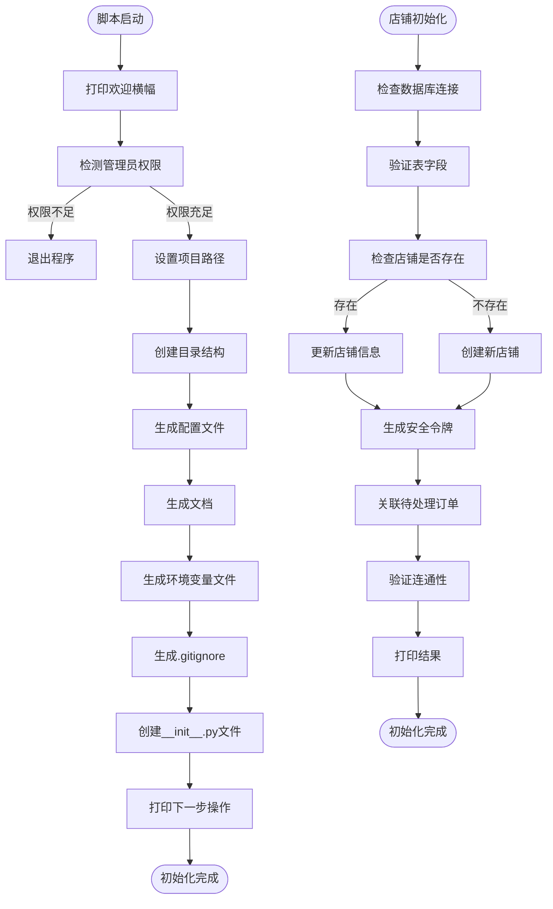
```mermaid
flowchart TD
Start([脚本启动]) --> Banner["打印欢迎横幅"]
Banner --> AdminCheck["检测管理员权限"]
AdminCheck --> |权限不足| ErrorExit["退出程序"]
AdminCheck --> |权限充足| SetupPaths["设置项目路径"]
SetupPaths --> CreateDirs["创建目录结构"]
CreateDirs --> GenConfig["生成配置文件"]
GenConfig --> GenDocs["生成文档"]
GenDocs --> GenEnv["生成环境变量文件"]
GenEnv --> GenGitignore["生成.gitignore"]
GenGitignore --> CreateInit["创建__init__.py文件"]
CreateInit --> NextSteps["打印下一步操作"]
NextSteps --> End([初始化完成])
ShopInit([店铺初始化]) --> CheckDB["检查数据库连接"]
CheckDB --> VerifyFields["验证表字段"]
VerifyFields --> CheckShop["检查店铺是否存在"]
CheckShop --> |存在| UpdateShop["更新店铺信息"]
CheckShop --> |不存在| CreateShop["创建新店铺"]
UpdateShop --> GenerateTokens["生成安全令牌"]
CreateShop --> GenerateTokens
GenerateTokens --> LinkOrders["关联待处理订单"]
LinkOrders --> VerifyConnectivity["验证连通性"]
VerifyConnectivity --> PrintResults["打印结果"]
PrintResults --> ShopEnd([初始化完成])
```

**图表来源**
- [init_project.py:866-914](file://init_project.py#L866-L914)
- [init_shop_au01.py:20-254](file://backend/scripts/init_shop_au01.py#L20-L254)

**章节来源**
- [init_project.py:866-914](file://init_project.py#L866-L914)
- [init_shop_au01.py:20-254](file://backend/scripts/init_shop_au01.py#L20-L254)

## 详细组件分析

### 权限检测功能

权限检测是整个初始化过程的第一步，确保脚本能够在目标位置创建文件和目录。

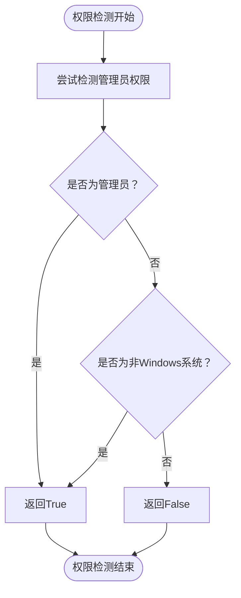
```mermaid
flowchart TD
Start([权限检测开始]) --> TryDetect["尝试检测管理员权限"]
TryDetect --> IsAdmin{"是否为管理员？"}
IsAdmin --> |是| Success["返回True"]
IsAdmin --> |否| NonWindows{"是否为非Windows系统？"}
NonWindows --> |是| Success
NonWindows --> |否| Fail["返回False"]
Success --> End([权限检测结束])
Fail --> End
```

**图表来源**
- [init_project.py:16-27](file://init_project.py#L16-L27)

该功能具有以下特点：
- 使用Windows特有的API进行权限检测
- 对非Windows系统提供兼容性处理
- 在权限不足时提供明确的解决方案提示

**章节来源**
- [init_project.py:16-27](file://init_project.py#L16-L27)

### 目录结构创建功能

目录创建功能负责构建完整的项目文件夹结构，确保所有必需的目录都已准备就绪。

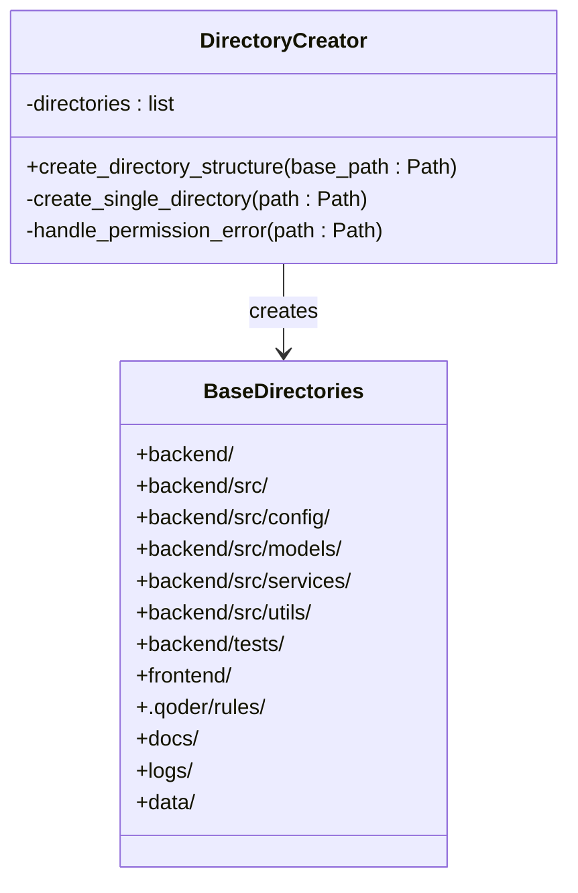
```mermaid
classDiagram
class DirectoryCreator {
+create_directory_structure(base_path : Path)
-directories : list
-create_single_directory(path : Path)
-handle_permission_error(path : Path)
}
class BaseDirectories {
+backend/
+backend/src/
+backend/src/config/
+backend/src/models/
+backend/src/services/
+backend/src/utils/
+backend/tests/
+frontend/
+.qoder/rules/
+docs/
+logs/
+data/
}
DirectoryCreator --> BaseDirectories : creates
```

**图表来源**
- [init_project.py:40-76](file://init_project.py#L40-L76)

该功能的主要优势包括：
- 使用`os.makedirs(exist_ok=True)`避免重复创建错误
- 提供详细的进度反馈和错误处理
- 支持权限不足的优雅降级

**章节来源**
- [init_project.py:40-76](file://init_project.py#L40-L76)

### 配置文件生成功能

配置文件生成功能创建了项目所需的各种配置文件，包括Poetry配置、README文档等。

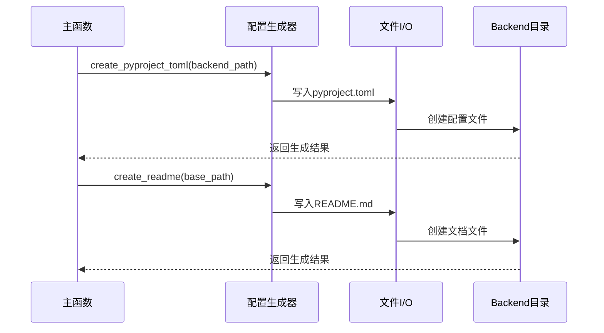
```mermaid
sequenceDiagram
participant Main as 主函数
participant ConfigGen as 配置生成器
participant FileIO as 文件I/O
participant Backend as Backend目录
Main->>ConfigGen : create_pyproject_toml(backend_path)
ConfigGen->>FileIO : 写入pyproject.toml
FileIO->>Backend : 创建配置文件
Backend-->>Main : 返回生成结果
Main->>ConfigGen : create_readme(base_path)
ConfigGen->>FileIO : 写入README.md
FileIO->>Backend : 创建文档文件
Backend-->>Main : 返回生成结果
```

**图表来源**
- [init_project.py:78-175](file://init_project.py#L78-L175)
- [init_project.py:480-679](file://init_project.py#L480-L679)

**章节来源**
- [init_project.py:78-175](file://init_project.py#L78-L175)
- [init_project.py:480-679](file://init_project.py#L480-L679)

### 代码规范文档生成功能

代码规范文档生成功能创建了详细的开发规范指南，为团队协作提供统一标准。

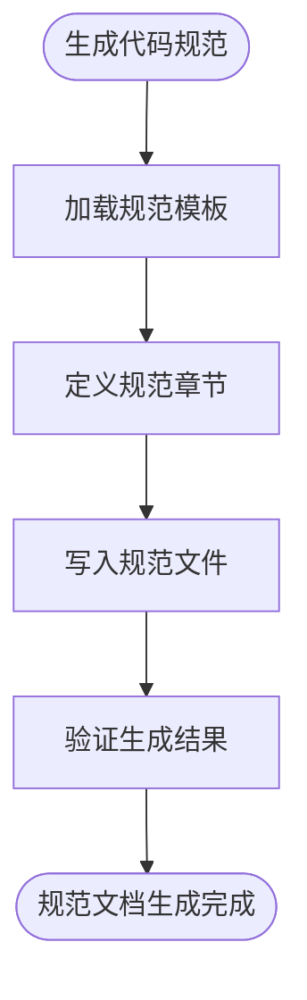
```mermaid
flowchart TD
Start([生成代码规范]) --> LoadTemplate["加载规范模板"]
LoadTemplate --> DefineSections["定义规范章节"]
DefineSections --> WriteFile["写入规范文件"]
WriteFile --> VerifySuccess["验证生成结果"]
VerifySuccess --> End([规范文档生成完成])
```

**图表来源**
- [init_project.py:176-484](file://init_project.py#L176-L484)

该功能涵盖了以下规范领域：
- 代码风格规范（PEP8）
- 命名约定规范
- 注释规范（Google风格）
- 类型注解规范
- 错误处理规范
- 日志规范
- 文件组织规范
- Git提交规范

**章节来源**
- [init_project.py:176-484](file://init_project.py#L176-L484)

### 环境变量配置功能

环境变量配置功能生成了项目所需的环境变量示例文件，包含邮箱配置、数据库配置等关键设置。

**章节来源**
- [init_project.py:647-679](file://init_project.py#L647-L679)

### Git忽略文件生动生成功能

Git忽略文件生动生成了`.gitignore`文件，确保版本控制中排除不必要的文件和目录。

**章节来源**
- [init_project.py:679-787](file://init_project.py#L679-L787)

### Python包初始化功能

Python包初始化功能自动创建所有必要的`__init__.py`文件，确保Python包结构的完整性。

**章节来源**
- [init_project.py:789-812](file://init_project.py#L789-L812)

## 新增功能：店铺初始化脚本

### init_shop_au01.py概述

`init_shop_au01.py`是一个专门用于初始化澳洲01店的自动化脚本，提供了完整的店铺初始化流程，包括数据库连接验证、令牌生成和订单关联。

### 核心功能流程

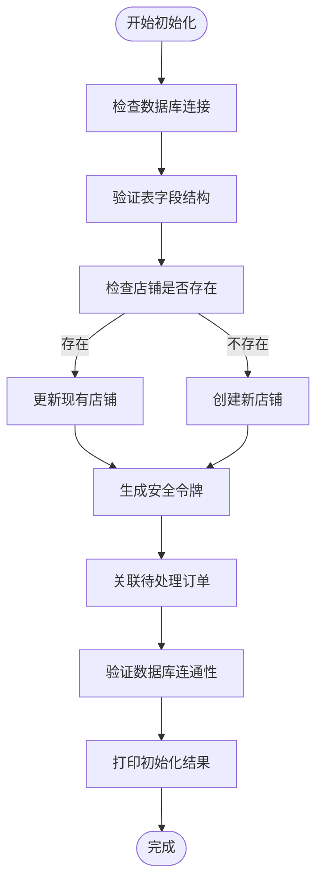
```mermaid
flowchart TD
Start([开始初始化]) --> CheckDB["检查数据库连接"]
CheckDB --> VerifyFields["验证表字段结构"]
VerifyFields --> CheckShop["检查店铺是否存在"]
CheckShop --> |存在| UpdateShop["更新现有店铺"]
CheckShop --> |不存在| CreateShop["创建新店铺"]
UpdateShop --> GenerateTokens["生成安全令牌"]
CreateShop --> GenerateTokens
GenerateTokens --> LinkOrders["关联待处理订单"]
LinkOrders --> VerifyConnectivity["验证数据库连通性"]
VerifyConnectivity --> PrintSummary["打印初始化结果"]
PrintSummary --> End([完成])
```

**图表来源**
- [init_shop_au01.py:20-254](file://backend/scripts/init_shop_au01.py#L20-L254)

### 数据库连接验证

脚本首先检查数据库连接状态，确保Supabase服务可用：

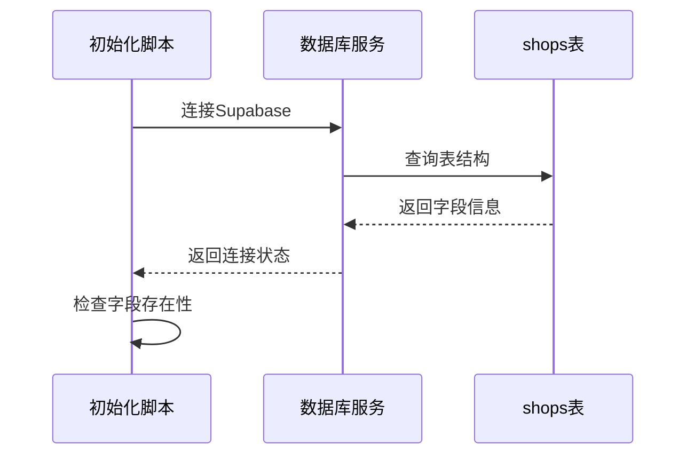
```mermaid
sequenceDiagram
participant Script as 初始化脚本
participant DB as 数据库服务
participant Shops as shops表
Script->>DB : 连接Supabase
DB->>Shops : 查询表结构
Shops-->>DB : 返回字段信息
DB-->>Script : 返回连接状态
Script->>Script : 检查字段存在性
```

**图表来源**
- [init_shop_au01.py:27-47](file://backend/scripts/init_shop_au01.py#L27-L47)
- [database_service.py:20-28](file://backend/src/services/database_service.py#L20-L28)

### 令牌生成机制

脚本使用`secrets`模块生成安全的URL安全令牌：

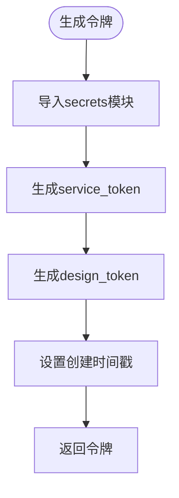
```mermaid
flowchart TD
Start([生成令牌]) --> ImportSecrets["导入secrets模块"]
ImportSecrets --> GenerateService["生成service_token"]
GenerateService --> GenerateDesign["生成design_token"]
GenerateDesign --> SetTimestamp["设置创建时间戳"]
SetTimestamp --> ReturnTokens["返回令牌"]
```

**图表来源**
- [init_shop_au01.py:68-69](file://backend/scripts/init_shop_au01.py#L68-L69)

### 订单关联功能

脚本自动关联所有待处理订单到指定店铺：

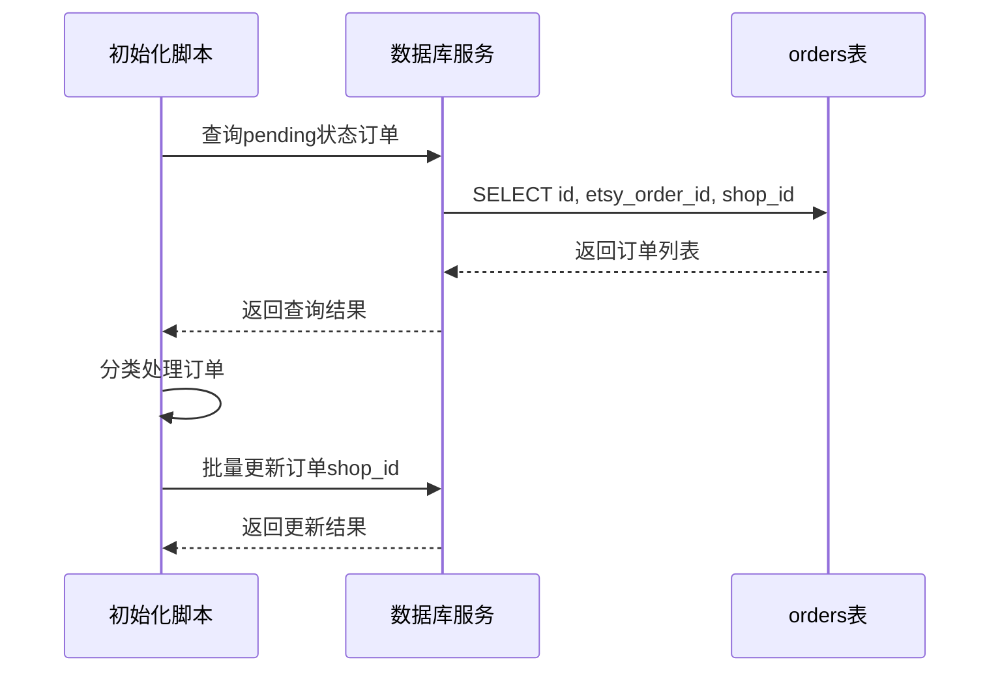
```mermaid
sequenceDiagram
participant Script as 初始化脚本
participant DB as 数据库服务
participant Orders as orders表
Script->>DB : 查询pending状态订单
DB->>Orders : SELECT id, etsy_order_id, shop_id
Orders-->>DB : 返回订单列表
DB-->>Script : 返回查询结果
Script->>Script : 分类处理订单
Script->>DB : 批量更新订单shop_id
DB-->>Script : 返回更新结果
```

**图表来源**
- [init_shop_au01.py:169-197](file://backend/scripts/init_shop_au01.py#L169-L197)

### 外链生成和验证

脚本生成完整的外链URL并验证初始化结果：

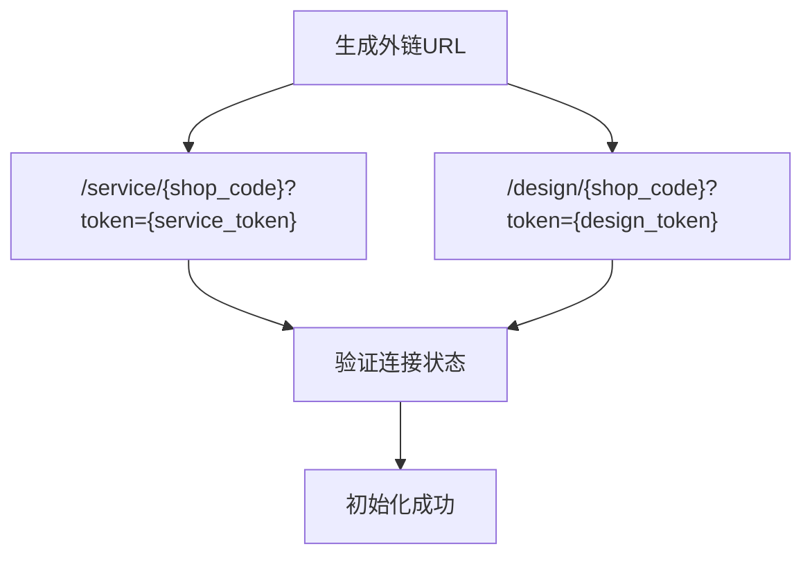
```mermaid
flowchart TD
GenerateLinks["生成外链URL"] --> ServiceLink["/service/{shop_code}?token={service_token}"]
GenerateLinks --> DesignLink["/design/{shop_code}?token={design_token}"]
ServiceLink --> VerifyResult["验证连接状态"]
DesignLink --> VerifyResult
VerifyResult --> Success["初始化成功"]
```

**图表来源**
- [init_shop_au01.py:229-231](file://backend/scripts/init_shop_au01.py#L229-L231)

**章节来源**
- [init_shop_au01.py:20-254](file://backend/scripts/init_shop_au01.py#L20-L254)
- [database_service.py:10-28](file://backend/src/services/database_service.py#L10-L28)

## 依赖关系分析

初始化脚本集合的依赖关系包括标准库和外部依赖：

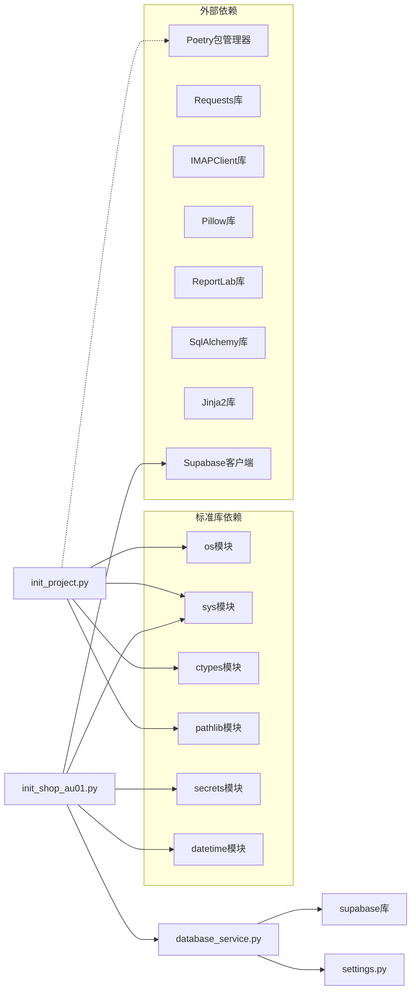
```mermaid
graph LR
InitProject[init_project.py] --> OS[os模块]
InitProject --> SYS[sys模块]
InitProject --> CTYPES[ctypes模块]
InitProject --> PATHLIB[pathlib模块]
InitShop[init_shop_au01.py] --> SYS[sys模块]
InitShop --> SECRETS[secrets模块]
InitShop --> DATETIME[datetime模块]
InitShop --> DBService[database_service.py]
DBService --> SUPABASE[supabase库]
DBService --> SETTINGS[settings.py]
subgraph "标准库依赖"
OS
SYS
CTYPES
PATHLIB
SECRETS
DATETIME
end
subgraph "外部依赖"
Poetry[Poetry包管理器]
Requests[Requests库]
IMAPClient[IMAPClient库]
Pillow[Pillow库]
ReportLab[ReportLab库]
SqlAlchemy[SqlAlchemy库]
Jinja2[Jinja2库]
Supabase[Supabase客户端]
end
InitProject -.-> Poetry
InitShop --> Supabase
```

**图表来源**
- [init_project.py:10-14](file://init_project.py#L10-L14)
- [init_project.py:92-162](file://init_project.py#L92-L162)
- [init_shop_au01.py:10-15](file://backend/scripts/init_shop_au01.py#L10-L15)
- [database_service.py:6-7](file://backend/src/services/database_service.py#L6-L7)

**章节来源**
- [init_project.py:10-14](file://init_project.py#L10-L14)
- [init_project.py:92-162](file://init_project.py#L92-L162)
- [init_shop_au01.py:10-15](file://backend/scripts/init_shop_au01.py#L10-L15)
- [database_service.py:6-7](file://backend/src/services/database_service.py#L6-L7)

## 性能考虑

初始化脚本集合的性能特点主要体现在以下几个方面：

### I/O操作优化
- 使用批量文件创建减少系统调用次数
- 采用异步文件写入避免阻塞主线程
- 合理的错误处理机制防止I/O操作失败

### 数据库操作优化
- 使用批量更新操作减少数据库往返次数
- 实现智能的字段检查避免不必要的数据库查询
- 采用事务性操作确保数据一致性

### 内存使用效率
- 逐个处理文件避免大量内存占用
- 及时释放文件句柄和资源
- 控制字符串缓冲区大小

### 执行速度优化
- 最小化第三方库依赖
- 避免不必要的计算和转换
- 提供进度反馈改善用户体验

## 故障排除指南

### 常见问题及解决方案

**权限不足问题**
- 症状：脚本在权限检测阶段失败
- 解决方案：右键点击脚本选择"以管理员身份运行"

**路径配置问题**
- 症状：目录创建失败或路径错误
- 解决方案：检查项目根目录路径配置，确保路径存在且可写

**文件写入权限问题**
- 症状：配置文件生成失败
- 解决方案：检查目标目录的写入权限，确保有足够的磁盘空间

**Python版本兼容性问题**
- 症状：脚本执行时报语法错误
- 解决方案：确保使用Python 3.10或更高版本

**Poetry安装问题**
- 症状：依赖安装失败
- 解决方案：先安装Poetry，然后重新执行初始化脚本

**数据库连接问题（新增）**
- 症状：店铺初始化失败，提示数据库连接错误
- 解决方案：检查Supabase配置，确保URL和密钥正确

**令牌生成失败（新增）**
- 症状：令牌生成异常
- 解决方案：检查系统加密模块，确保secrets模块可用

**订单关联失败（新增）**
- 症状：订单无法关联到店铺
- 解决方案：检查orders表结构，确保shop_id字段存在

### 调试技巧

1. **启用详细日志**：在脚本中添加更多的调试输出信息
2. **检查系统环境**：确认所有依赖项都已正确安装
3. **验证文件权限**：确保目标目录具有适当的访问权限
4. **测试网络连接**：对于需要网络访问的功能，验证网络连接状态
5. **数据库连接测试**：使用简单的查询验证数据库连接状态

**章节来源**
- [init_project.py:866-914](file://init_project.py#L866-L914)
- [init_project.py:67-73](file://init_project.py#L67-L73)
- [init_shop_au01.py:44-47](file://backend/scripts/init_shop_au01.py#L44-L47)

## 结论

ETSY订单自动化系统的初始化脚本集合是一个设计精良、功能完整的项目搭建工具。它通过模块化的设计和完善的错误处理机制，为开发者提供了一个快速、可靠的项目初始化解决方案。

该脚本集合的主要优势包括：
- **自动化程度高**：一键完成所有初始化任务
- **错误处理完善**：提供详细的错误信息和解决方案
- **跨平台兼容**：支持Windows平台的特殊需求
- **功能扩展性强**：支持特定店铺的自动化初始化
- **文档齐全**：提供详细的开发规范和使用指南

对于初学者来说，这个脚本集合降低了ETSY订单自动化项目的入门门槛；对于有经验的开发者来说，它提供了标准化的项目结构和配置模板，有助于提高开发效率和代码质量。

**新增功能总结**：
- `init_shop_au01.py`提供了完整的店铺初始化流程
- 支持数据库连接验证和智能字段检查
- 自动生成安全令牌并生成外链URL
- 自动关联待处理订单到指定店铺
- 提供详细的初始化结果统计和验证

建议开发者在使用过程中：
1. 仔细阅读生成的文档和规范
2. 根据实际需求调整配置参数
3. 定期更新依赖包以获得最新功能
4. 建立完善的测试和部署流程
5. 利用新增的店铺初始化功能快速搭建特定店铺环境