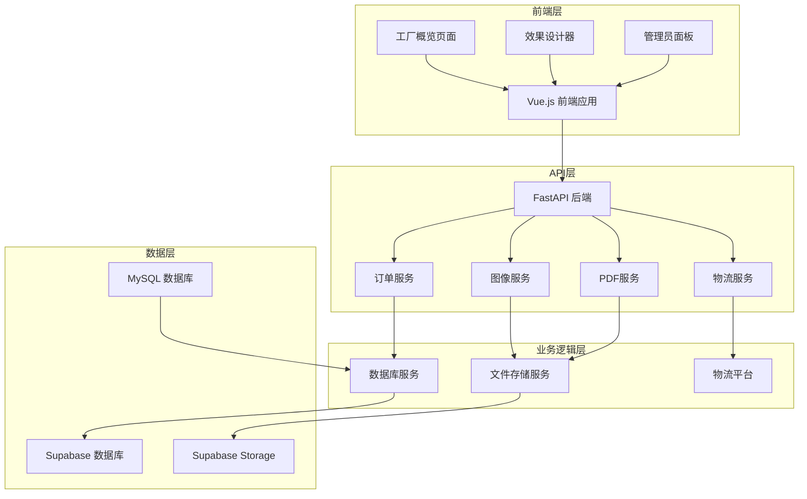
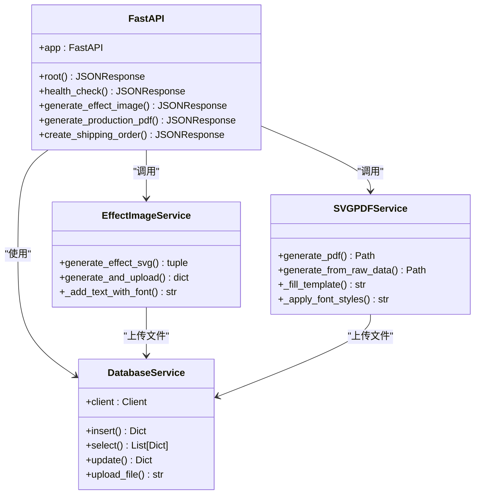
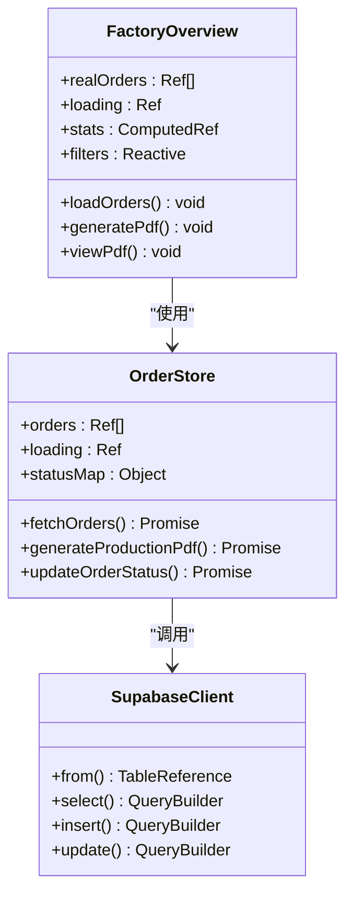
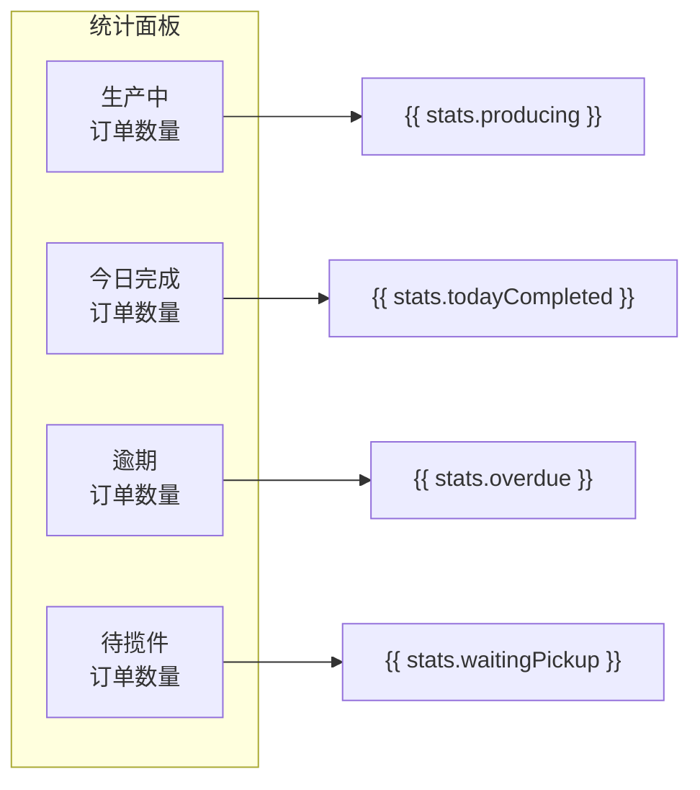
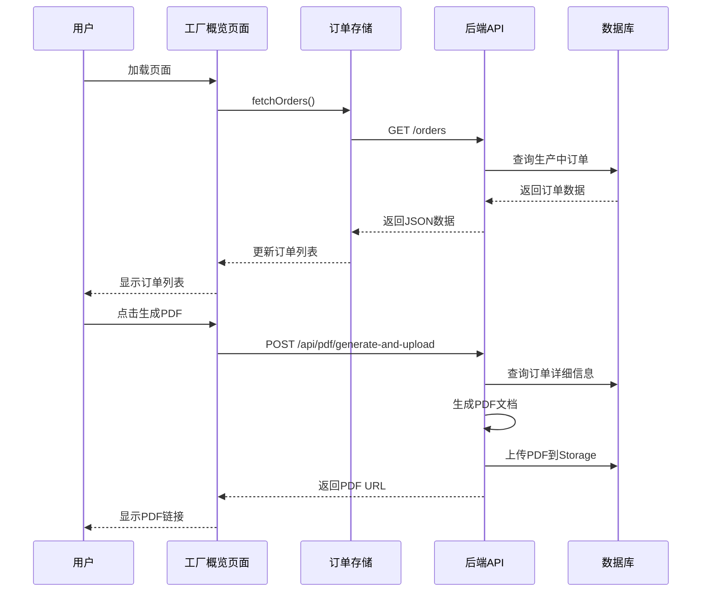
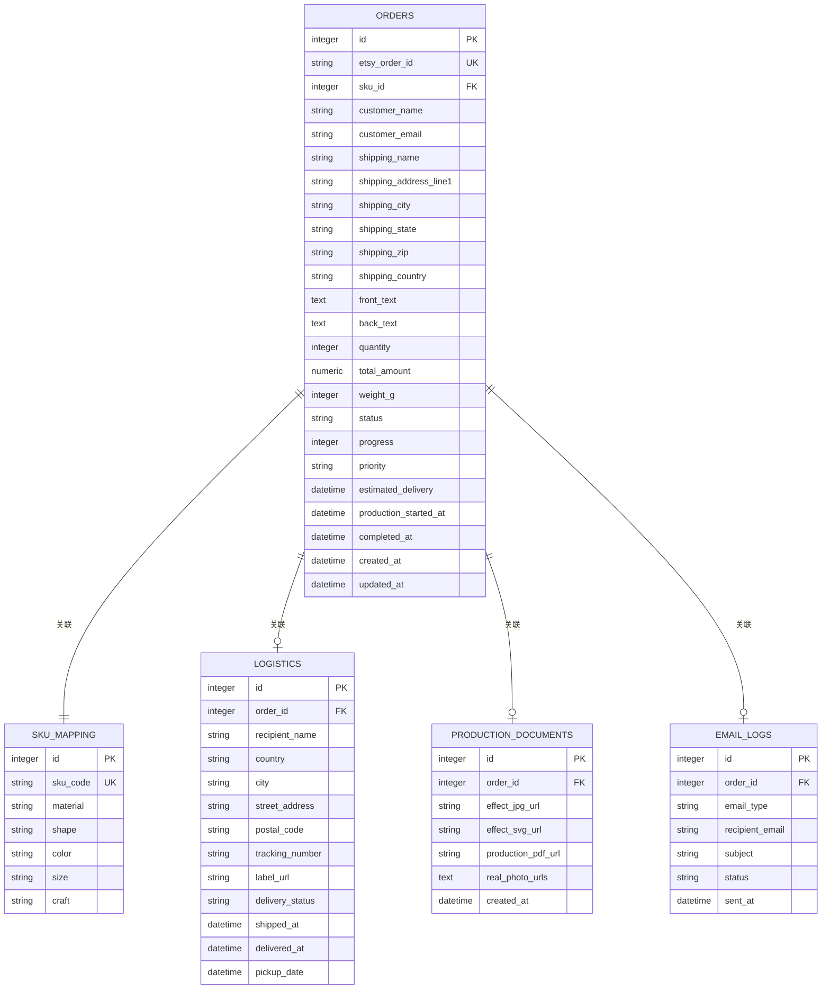
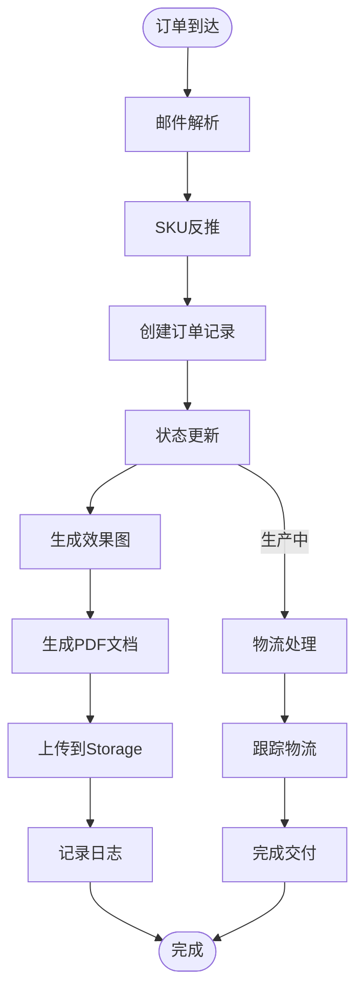

# 工厂概览功能增强

<cite>
**本文档引用的文件**
- [backend/src/api/main.py](file://backend/src/api/main.py)
- [frontend/src/views/Admin/FactoryOverview.vue](file://frontend/src/views/Admin/FactoryOverview.vue)
- [backend/src/services/order_service.py](file://backend/src/services/order_service.py)
- [backend/src/models/order.py](file://backend/src/models/order.py)
- [frontend/src/stores/orderStore.js](file://frontend/src/stores/orderStore.js)
- [backend/src/services/database_service.py](file://backend/src/services/database_service.py)
- [backend/src/services/svg_pdf_service.py](file://backend/src/services/svg_pdf_service.py)
- [frontend/src/utils/supabase.js](file://frontend/src/utils/supabase.js)
- [backend/src/config/settings.py](file://backend/src/config/settings.py)
- [backend/src/services/effect_image_service.py](file://backend/src/services/effect_image_service.py)
- [backend/src/services/template_service.py](file://backend/src/services/template_service.py)
- [backend/pyproject.toml](file://backend/pyproject.toml)
- [frontend/package.json](file://frontend/package.json)
</cite>

## 目录
1. [项目概述](#项目概述)
2. [项目架构](#项目架构)
3. [核心组件分析](#核心组件分析)
4. [工厂概览功能详解](#工厂概览功能详解)
5. [数据流分析](#数据流分析)
6. [性能优化建议](#性能优化建议)
7. [故障排除指南](#故障排除指南)
8. [总结](#总结)

## 项目概述

ETSY订单自动化系统是一个完整的电商订单处理平台，专注于为手工定制产品（如不锈钢宠物牌）提供从订单接收到生产的全流程自动化解决方案。该系统集成了邮件解析、订单管理、效果图生成、PDF文档生成、物流跟踪等多个核心功能模块。

### 主要功能特性

- **智能订单解析**：自动从Etsy邮件中提取订单信息并创建订单记录
- **可视化设计**：提供在线设计器，支持字体选择、文字编辑、预览效果
- **批量生产**：支持多订单同时处理，提高生产效率
- **物流集成**：与4PX物流平台深度集成，实现一键发货
- **实时监控**：提供工厂生产概览，实时跟踪订单状态

## 项目架构

系统采用前后端分离架构，后端使用Python FastAPI提供RESTful API，前端使用Vue.js构建用户界面。

**图表来源**
- [backend/src/api/main.py:38-42](file://backend/src/api/main.py#L38-L42)
- [frontend/src/views/Admin/FactoryOverview.vue:1-307](file://frontend/src/views/Admin/FactoryOverview.vue#L1-L307)

**章节来源**
- [backend/src/api/main.py:1-949](file://backend/src/api/main.py#L1-L949)
- [frontend/src/views/Admin/FactoryOverview.vue:1-307](file://frontend/src/views/Admin/FactoryOverview.vue#L1-L307)

## 核心组件分析

### 后端API架构

后端使用FastAPI框架构建，提供了完整的RESTful API接口，支持CORS跨域访问，确保前后端通信顺畅。

**图表来源**
- [backend/src/api/main.py:21-26](file://backend/src/api/main.py#L21-L26)
- [backend/src/services/database_service.py:10-112](file://backend/src/services/database_service.py#L10-L112)
- [backend/src/services/effect_image_service.py:12-181](file://backend/src/services/effect_image_service.py#L12-L181)
- [backend/src/services/svg_pdf_service.py:122-914](file://backend/src/services/svg_pdf_service.py#L122-L914)

### 前端组件架构

前端使用Vue.js 3构建，采用Composition API模式，配合Pinia状态管理，实现了响应式的用户界面。

**图表来源**
- [frontend/src/views/Admin/FactoryOverview.vue:206-307](file://frontend/src/views/Admin/FactoryOverview.vue#L206-L307)
- [frontend/src/stores/orderStore.js:23-763](file://frontend/src/stores/orderStore.js#L23-L763)
- [frontend/src/utils/supabase.js:1-18](file://frontend/src/utils/supabase.js#L1-L18)

**章节来源**
- [backend/src/api/main.py:1-949](file://backend/src/api/main.py#L1-L949)
- [frontend/src/views/Admin/FactoryOverview.vue:1-307](file://frontend/src/views/Admin/FactoryOverview.vue#L1-L307)
- [frontend/src/stores/orderStore.js:1-763](file://frontend/src/stores/orderStore.js#L1-L763)

## 工厂概览功能详解

### 功能概述

工厂概览页面是整个系统的核心管理界面，为工厂管理人员提供了实时的生产监控和订单管理能力。该功能增强了原有的订单展示能力，提供了更丰富的统计信息和操作选项。

### 核心功能特性

#### 1. 实时统计数据面板

页面顶部包含了四个关键的统计卡片，提供工厂运营的实时概览：

**图表来源**
- [frontend/src/views/Admin/FactoryOverview.vue:29-93](file://frontend/src/views/Admin/FactoryOverview.vue#L29-L93)

#### 2. 高级筛选功能

提供了多维度的订单筛选能力，包括工厂选择、订单状态、日期范围等：

- **工厂筛选**：支持按工厂A、工厂B进行筛选
- **状态筛选**：支持生产中、已完成、逾期、待揽件状态筛选
- **日期筛选**：支持自定义日期范围查询

#### 3. 订单列表管理

生产订单列表展示了详细的订单信息，包括SKU、形状、尺寸、工艺、工厂、下单时间、交货时间等关键字段。

#### 4. PDF生成功能

集成了生产文档PDF的自动生成和查看功能，支持一键生成和在线预览。

**章节来源**
- [frontend/src/views/Admin/FactoryOverview.vue:1-307](file://frontend/src/views/Admin/FactoryOverview.vue#L1-L307)

### 数据流处理

工厂概览功能的数据流处理遵循以下流程：

**图表来源**
- [frontend/src/views/Admin/FactoryOverview.vue:218-234](file://frontend/src/views/Admin/FactoryOverview.vue#L218-L234)
- [backend/src/api/main.py:344-447](file://backend/src/api/main.py#L344-L447)

**章节来源**
- [frontend/src/views/Admin/FactoryOverview.vue:218-282](file://frontend/src/views/Admin/FactoryOverview.vue#L218-L282)
- [backend/src/api/main.py:344-447](file://backend/src/api/main.py#L344-L447)

## 数据流分析

### 订单数据模型

系统使用SQLAlchemy ORM定义了完整的数据模型，支持复杂的订单生命周期管理。

**图表来源**
- [backend/src/models/order.py:23-356](file://backend/src/models/order.py#L23-L356)

### 数据处理流程

系统采用分层架构处理订单数据，确保数据的一致性和完整性：

**图表来源**
- [backend/src/services/order_service.py:91-145](file://backend/src/services/order_service.py#L91-L145)
- [backend/src/services/effect_image_service.py:77-130](file://backend/src/services/effect_image_service.py#L77-L130)

**章节来源**
- [backend/src/models/order.py:1-356](file://backend/src/models/order.py#L1-L356)
- [backend/src/services/order_service.py:1-145](file://backend/src/services/order_service.py#L1-L145)

## 性能优化建议

### 1. 数据库查询优化

- **索引优化**：为常用查询字段建立适当的数据库索引
- **查询缓存**：对频繁访问的订单数据实施缓存策略
- **批量操作**：减少数据库往返次数，使用批量插入和更新

### 2. 前端性能优化

- **虚拟滚动**：对于大量订单列表，使用虚拟滚动技术提升渲染性能
- **懒加载**：对图片和PDF文档实施懒加载策略
- **状态缓存**：利用Pinia的持久化存储减少重复请求

### 3. 文件处理优化

- **并发处理**：对多个订单的PDF生成实施并发处理
- **文件压缩**：对生成的PDF和图片进行适当的压缩处理
- **CDN加速**：使用CDN加速静态资源和生成文件的访问

## 故障排除指南

### 常见问题及解决方案

#### 1. 订单状态异常

**问题描述**：订单状态显示不正确或更新失败

**解决步骤**：
1. 检查Supabase连接配置
2. 验证订单状态转换逻辑
3. 查看后端日志获取详细错误信息

#### 2. PDF生成失败

**问题描述**：生产文档PDF生成过程中出现错误

**解决步骤**：
1. 检查字体文件是否完整
2. 验证模板文件是否存在
3. 确认Storage权限配置正确

#### 3. 图片加载失败

**问题描述**：效果图或实拍图无法正常显示

**解决步骤**：
1. 检查Storage桶权限设置
2. 验证图片URL格式正确性
3. 确认网络连接稳定

**章节来源**
- [backend/src/services/database_service.py:81-112](file://backend/src/services/database_service.py#L81-L112)
- [backend/src/services/svg_pdf_service.py:170-231](file://backend/src/services/svg_pdf_service.py#L170-L231)

## 总结

工厂概览功能增强项目成功实现了以下目标：

### 技术成就

1. **完整的前后端架构**：采用现代技术栈构建了稳定可靠的系统架构
2. **实时监控能力**：提供了直观的工厂生产监控界面
3. **自动化流程**：实现了从订单接收到生产的全流程自动化
4. **可扩展性设计**：模块化的架构设计便于功能扩展和维护

### 业务价值

1. **提高生产效率**：通过自动化减少了人工干预，提高了生产效率
2. **改善用户体验**：直观的界面设计提升了用户的操作体验
3. **降低运营成本**：减少了重复劳动，降低了运营成本
4. **增强数据透明度**：实时的数据展示帮助管理层做出更好的决策

### 未来发展方向

1. **移动端适配**：开发移动端应用，支持随时随地监控生产情况
2. **AI辅助决策**：集成机器学习算法，提供生产预测和优化建议
3. **供应链整合**：进一步整合供应链管理，实现端到端的数字化转型
4. **国际化支持**：扩展多语言和多货币支持，服务更广泛的市场

该系统为手工定制产品的生产管理提供了强有力的技术支撑，是传统制造业数字化转型的成功案例。