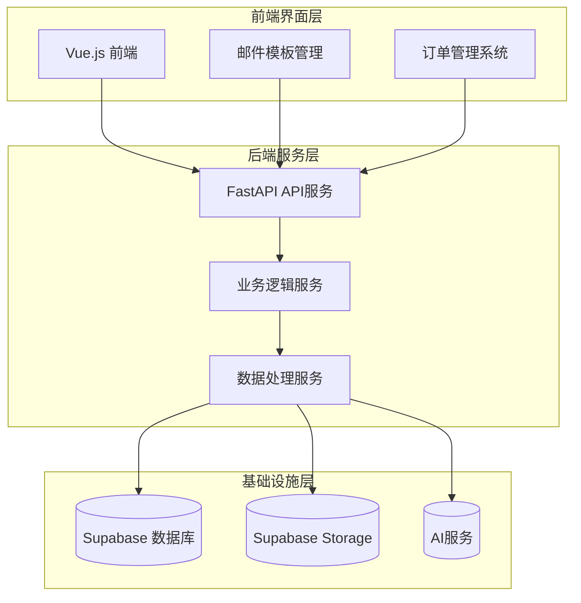
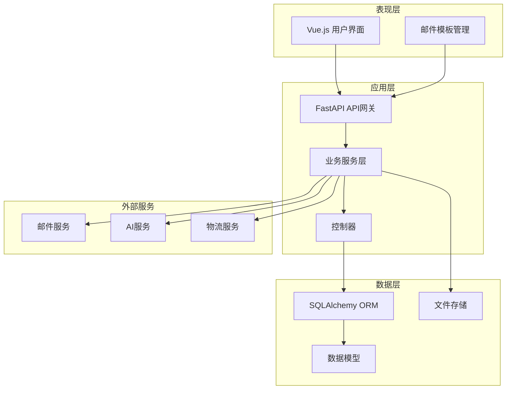
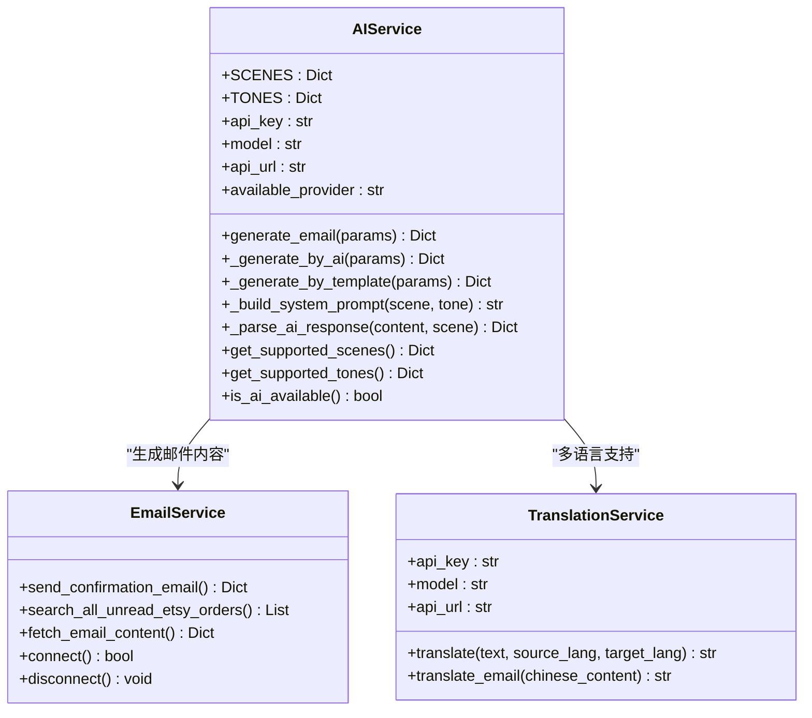
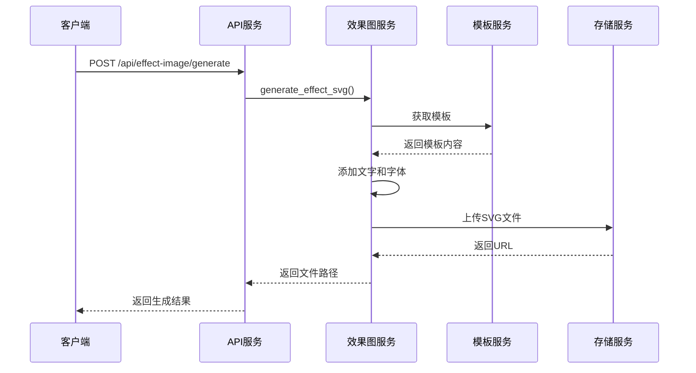
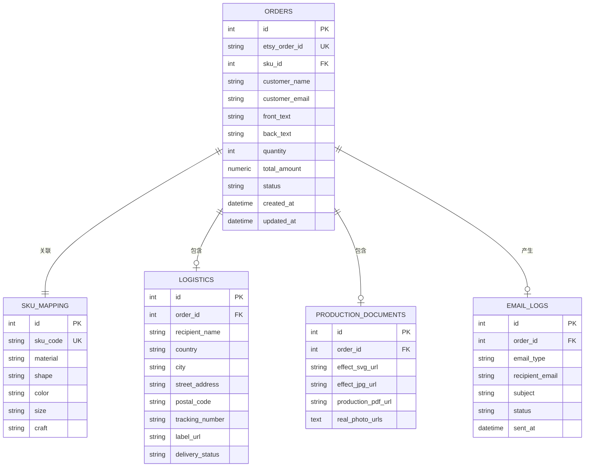
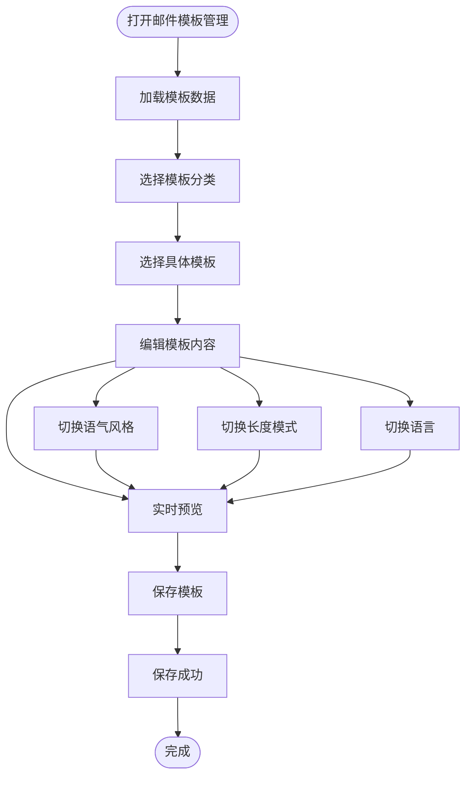

# AI邮件生成系统

<cite>
**本文档引用的文件**
- [pyproject.toml](file://backend/pyproject.toml)
- [main.py](file://backend/src/api/main.py)
- [settings.py](file://backend/src/config/settings.py)
- [order.py](file://backend/src/models/order.py)
- [email_service.py](file://backend/src/services/email_service.py)
- [effect_image_service.py](file://backend/src/services/effect_image_service.py)
- [pdf_service.py](file://backend/src/services/pdf_service.py)
- [database_service.py](file://backend/src/services/database_service.py)
- [translation_service.py](file://backend/src/services/translation_service.py)
- [ai_service.py](file://backend/src/services/ai_service.py)
- [email-templates.json](file://frontend/src/config/email-templates.json)
- [EmailTemplates.vue](file://frontend/src/views/Admin/EmailTemplates.vue)
- [fetch_new_order.py](file://backend/scripts/fetch_new_order.py)
- [process_today_order.py](file://backend/scripts/process_today_order.py)
- [check_order_flow.py](file://backend/scripts/check_order_flow.py)
</cite>

## 目录
1. [项目概述](#项目概述)
2. [项目结构](#项目结构)
3. [核心组件](#核心组件)
4. [架构概览](#架构概览)
5. [详细组件分析](#详细组件分析)
6. [依赖关系分析](#依赖关系分析)
7. [性能考虑](#性能考虑)
8. [故障排除指南](#故障排除指南)
9. [结论](#结论)

## 项目概述

AI邮件生成系统是一个基于Python和Vue.js的完整订单自动化处理平台，专注于Etsy订单的智能化处理。该系统集成了AI驱动的邮件生成、自动化订单处理、效果图生成、PDF文档生成和物流管理等功能。

### 主要功能特性

- **智能邮件生成**：基于AI技术的个性化邮件内容生成
- **自动化订单处理**：从邮件解析到订单确认的完整流程
- **效果图生成**：动态生成定制宠物牌的效果图
- **PDF文档生成**：生产文档和物流标签的自动生成
- **多语言支持**：中英文邮件内容的智能翻译
- **物流集成**：与4PX物流系统的无缝对接

## 项目结构

系统采用前后端分离的架构设计，主要分为三个核心部分：

**图表来源**
- [main.py:1-800](file://backend/src/api/main.py#L1-L800)
- [settings.py:1-65](file://backend/src/config/settings.py#L1-L65)

**章节来源**
- [pyproject.toml:1-69](file://backend/pyproject.toml#L1-L69)
- [main.py:1-800](file://backend/src/api/main.py#L1-L800)

## 核心组件

### 1. API服务层

系统的核心是基于FastAPI构建的RESTful API服务，提供了完整的订单生命周期管理功能。

### 2. 业务服务层

包含多个专门的服务类，每个负责特定的功能领域：

- **EmailService**：邮件接收、解析和发送
- **EffectImageService**：效果图生成和管理
- **PDFService**：PDF文档生成
- **DatabaseService**：数据库操作和文件存储
- **TranslationService**：多语言翻译
- **AIService**：AI驱动的内容生成

### 3. 数据模型层

基于SQLAlchemy的ORM模型，定义了完整的数据结构：

- **Order**：订单主表
- **Logistics**：物流信息表
- **ProductionDocument**：生产文档表
- **EmailLog**：邮件日志表
- **SkuMapping**：SKU映射表

**章节来源**
- [main.py:1-800](file://backend/src/api/main.py#L1-L800)
- [order.py:1-356](file://backend/src/models/order.py#L1-L356)

## 架构概览

系统采用分层架构设计，确保了良好的可维护性和扩展性：

**图表来源**
- [main.py:38-44](file://backend/src/api/main.py#L38-L44)
- [settings.py:12-65](file://backend/src/config/settings.py#L12-L65)

## 详细组件分析

### AI邮件生成服务

AI邮件生成服务是系统的核心创新点，提供了智能化的邮件内容生成能力。

#### 核心功能

**图表来源**
- [ai_service.py:26-464](file://backend/src/services/ai_service.py#L26-L464)
- [email_service.py:29-352](file://backend/src/services/email_service.py#L29-L352)
- [translation_service.py:13-160](file://backend/src/services/translation_service.py#L13-L160)

#### 邮件场景支持

系统支持三种主要的邮件场景：

| 场景类型 | 描述 | 适用场景 |
|---------|------|----------|
| first_confirm | 首封确认邮件 | 订单收到后的首次确认 |
| modify_confirm | 修改确认邮件 | 客户要求修改后的确认 |
| review_request | 追评邮件 | 发货后的售后跟进 |

#### 语气风格系统

系统提供三种不同的语气风格：

- **友好亲切**：适合日常沟通，语气温和
- **专业正式**：适合商务场合，表达专业
- **温暖关怀**：注重情感表达，体现关怀

**章节来源**
- [ai_service.py:26-464](file://backend/src/services/ai_service.py#L26-L464)

### 效果图生成服务

效果图生成服务负责根据订单信息动态生成定制宠物牌的效果图。

#### 技术实现

**图表来源**
- [effect_image_service.py:12-181](file://backend/src/services/effect_image_service.py#L12-L181)
- [main.py:242-287](file://backend/src/api/main.py#L242-L287)

#### 支持的字体系统

系统内置了完整的字体管理系统，支持多种字体样式：

| 字体代码 | 字体名称 | 适用场景 |
|---------|----------|----------|
| F-01 | 标准字体 | 默认字体选择 |
| F-02 | 花体字体 | 装饰性文字 |
| F-03 | 现代字体 | 简洁设计 |
| F-04 | 古典字体 | 传统风格 |

**章节来源**
- [effect_image_service.py:12-181](file://backend/src/services/effect_image_service.py#L12-L181)

### PDF文档生成服务

PDF文档生成服务负责创建专业的生产文档和物流标签。

#### 文档结构

系统生成的PDF文档包含以下关键部分：

1. **标题区域**：包含产品编号和文档类型
2. **订单信息**：客户信息和订单详情
3. **产品规格**：形状、颜色、尺寸等
4. **定制详情**：正面和背面的文字内容
5. **物流标签**：4PX物流面单

**章节来源**
- [pdf_service.py:31-539](file://backend/src/services/pdf_service.py#L31-L539)

### 数据库服务

系统使用Supabase作为数据库和文件存储解决方案，提供了完整的数据管理功能。

#### 数据表关系

**图表来源**
- [order.py:23-244](file://backend/src/models/order.py#L23-L244)

**章节来源**
- [order.py:1-356](file://backend/src/models/order.py#L1-L356)
- [database_service.py:10-117](file://backend/src/services/database_service.py#L10-L117)

### 前端邮件模板管理

前端提供了完整的邮件模板管理界面，支持模板的创建、编辑和预览功能。

#### 模板管理功能

**图表来源**
- [EmailTemplates.vue:465-858](file://frontend/src/views/Admin/EmailTemplates.vue#L465-L858)

**章节来源**
- [EmailTemplates.vue:1-858](file://frontend/src/views/Admin/EmailTemplates.vue#L1-L858)
- [email-templates.json:1-374](file://frontend/src/config/email-templates.json#L1-L374)

## 依赖关系分析

系统使用Poetry进行包管理，主要依赖包括：

### 核心依赖

| 依赖包 | 版本 | 用途 |
|--------|------|------|
| fastapi | ^0.128.2 | Web框架 |
| uvicorn | ^0.40.0 | ASGI服务器 |
| requests | ^2.31.0 | HTTP请求 |
| imapclient | ^3.0.0 | 邮件协议 |
| pillow | ^10.2.0 | 图像处理 |
| reportlab | ^4.0.8 | PDF生成 |
| svgwrite | ^1.4.3 | SVG生成 |
| sqlalchemy | ^2.0.25 | 数据库ORM |
| python-dotenv | ^1.0.0 | 环境变量管理 |
| jinja2 | ^3.1.3 | 模板引擎 |
| python-dateutil | ^2.8.2 | 日期处理 |
| pymupdf | ^1.26.7 | PDF处理 |
| supabase | ^2.27.2 | 数据库服务 |

### 开发依赖

| 依赖包 | 版本 | 用途 |
|--------|------|------|
| black | ^24.1.1 | 代码格式化 |
| pytest | ^8.0.0 | 单元测试 |
| pylint | ^3.0.3 | 代码检查 |
| mypy | ^1.8.0 | 类型检查 |
| pytest-cov | ^4.1.0 | 测试覆盖率 |

**章节来源**
- [pyproject.toml:8-48](file://backend/pyproject.toml#L8-L48)

## 性能考虑

### 1. 缓存策略

系统实现了多层次的缓存机制：

- **字体缓存**：避免重复加载字体文件
- **模板缓存**：缓存常用的SVG模板
- **数据库连接池**：复用数据库连接

### 2. 异步处理

对于耗时的操作，系统采用了异步处理策略：

- **PDF生成**：后台任务队列处理
- **文件上传**：异步上传到存储服务
- **邮件发送**：异步发送队列

### 3. 内存优化

- **图像处理**：使用流式处理避免内存溢出
- **PDF生成**：分段生成减少内存占用
- **批量操作**：数据库批量插入优化

## 故障排除指南

### 常见问题及解决方案

#### 1. 邮件服务连接失败

**症状**：无法连接到邮件服务器
**解决方案**：
- 检查IMAP配置参数
- 验证邮箱账户权限
- 确认防火墙设置

#### 2. AI服务调用失败

**症状**：AI生成邮件失败
**解决方案**：
- 检查API密钥配置
- 验证网络连接
- 查看API响应状态

#### 3. PDF生成错误

**症状**：PDF生成过程中出现异常
**解决方案**：
- 检查字体文件完整性
- 验证模板文件存在性
- 确认磁盘空间充足

#### 4. 数据库连接问题

**症状**：数据库操作失败
**解决方案**：
- 检查数据库连接字符串
- 验证Supabase配置
- 查看连接池状态

**章节来源**
- [email_service.py:45-63](file://backend/src/services/email_service.py#L45-L63)
- [ai_service.py:52-68](file://backend/src/services/ai_service.py#L52-L68)
- [database_service.py:20-28](file://backend/src/services/database_service.py#L20-L28)

## 结论

AI邮件生成系统是一个功能完整、架构清晰的订单自动化平台。系统的主要优势包括：

### 技术优势

1. **智能化程度高**：AI驱动的邮件内容生成
2. **自动化程度强**：从订单接收到生产的完整自动化
3. **扩展性强**：模块化设计便于功能扩展
4. **用户体验好**：直观的前端界面和实时预览

### 应用价值

1. **提高效率**：大幅减少人工处理时间
2. **保证质量**：标准化的邮件内容和设计
3. **降低成本**：减少人工成本和错误率
4. **提升客户体验**：及时、个性化的客户服务

### 发展前景

系统具备良好的扩展基础，未来可以进一步集成：

- 更多的AI功能（订单分析、智能推荐）
- 支持更多的电商平台
- 增强的分析和报告功能
- 移动端应用支持

该系统为电商订单处理提供了一个完整的解决方案，具有很高的实用价值和推广前景。