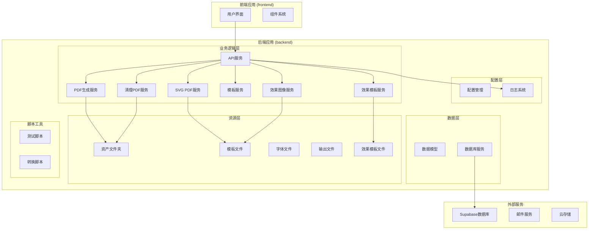
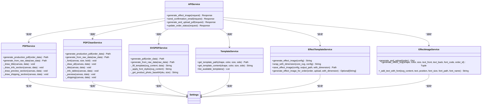
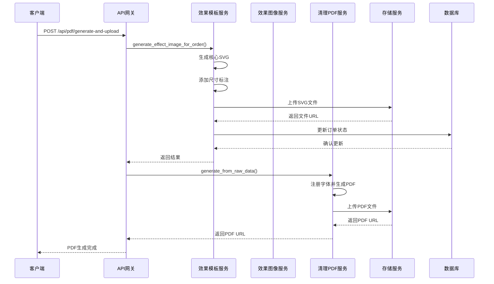
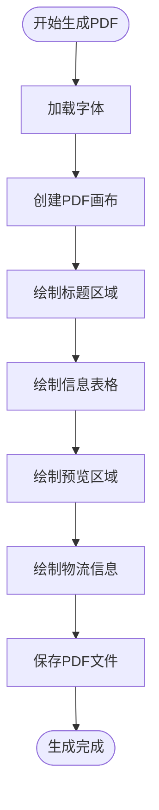
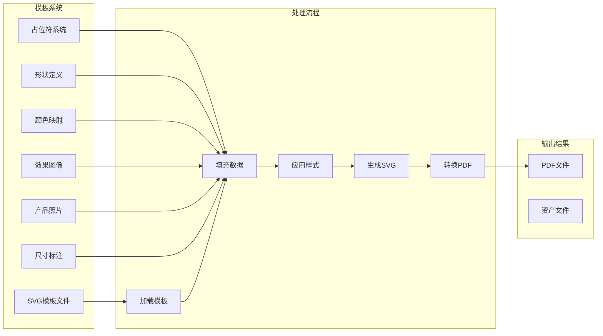
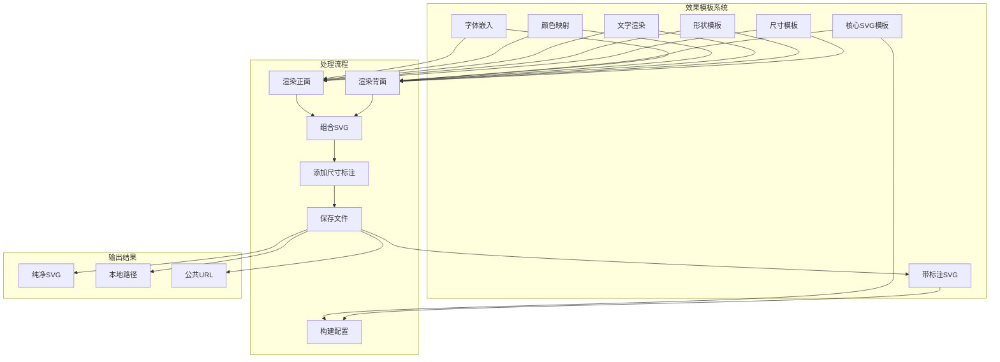
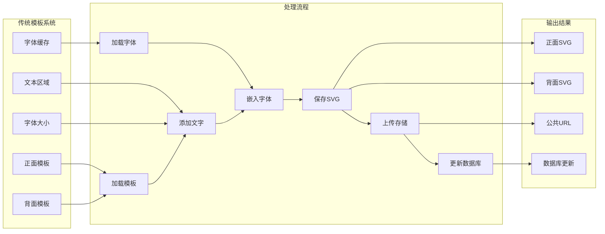
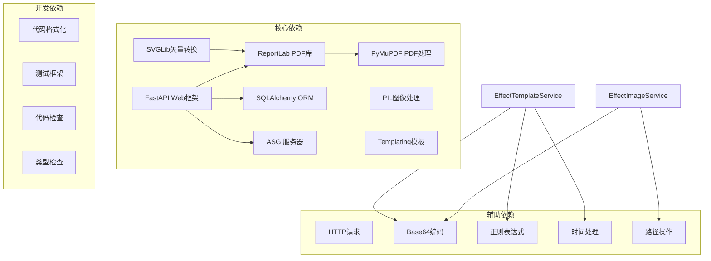

# PDF生成系统

<cite>
**本文档引用的文件**
- [pyproject.toml](file://backend/pyproject.toml)
- [main.py](file://backend/src/api/main.py)
- [settings.py](file://backend/src/config/settings.py)
- [order.py](file://backend/src/models/order.py)
- [pdf_service.py](file://backend/src/services/pdf_service.py)
- [pdf_service_clean.py](file://backend/src/services/pdf_service_clean.py)
- [svg_pdf_service.py](file://backend/src/services/svg_pdf_service.py)
- [template_service.py](file://backend/src/services/template_service.py)
- [effect_template_service.py](file://backend/src/services/effect_template_service.py)
- [effect_image_service.py](file://backend/src/services/effect_image_service.py)
- [logger.py](file://backend/src/utils/logger.py)
- [.env.example](file://backend/.env.example)
- [test_pdf_data_flow.py](file://backend/scripts/test_pdf_data_flow.py)
</cite>

## 更新摘要
**变更内容**
- 新增 pdf_service_clean.py 清晰版本的PDF生成服务，提供更稳定的字体管理和错误处理
- 增强 SVG PDF 服务的字体映射机制，支持阿里巴巴普惠体字体的完整注册
- 改进效果模板服务的错误处理和回退机制，确保在设计器SVG不可用时的稳定性
- 优化PDF生成管道，提供更好的性能和可靠性
- 增强字体管理的健壮性，支持多种字体格式和映射策略

## 目录
1. [简介](#简介)
2. [项目结构](#项目结构)
3. [核心组件](#核心组件)
4. [架构概览](#架构概览)
5. [详细组件分析](#详细组件分析)
6. [依赖关系分析](#依赖关系分析)
7. [性能考虑](#性能考虑)
8. [故障排除指南](#故障排除指南)
9. [结论](#结论)

## 简介

PDF生成系统是一个基于Python的ETSY订单自动化处理平台，专注于自动生成生产文档PDF。该系统集成了邮件处理、效果图生成、PDF文档生成和Supabase数据库管理等功能，为珠宝定制产品提供完整的自动化解决方案。

系统采用模块化设计，主要包含以下核心功能：
- **订单管理**：处理Etsy订单数据，管理订单状态流转
- **效果图生成**：基于SVG模板生成产品效果图，支持分离式12模板架构
- **PDF文档生成**：将订单信息转换为专业的生产文档PDF
- **邮件集成**：自动发送订单确认邮件
- **资产管理系统**：管理字体、模板和产品图片资源

**更新** 新增了pdf_service_clean.py清晰版本的PDF生成服务，提供更稳定的字体管理和错误处理机制，增强了系统的整体可靠性和性能表现。

## 项目结构

**图表来源**
- [main.py:1-747](file://backend/src/api/main.py#L1-L747)
- [settings.py:1-61](file://backend/src/config/settings.py#L1-L61)
- [order.py:1-346](file://backend/src/models/order.py#L1-L346)
- [pdf_service_clean.py:1-540](file://backend/src/services/pdf_service_clean.py#L1-L540)

**章节来源**
- [pyproject.toml:1-69](file://backend/pyproject.toml#L1-L69)
- [main.py:1-747](file://backend/src/api/main.py#L1-L747)

## 核心组件

### API服务层

系统采用FastAPI框架构建RESTful API服务，提供统一的接口入口：

- **健康检查接口**：`/health` - 检查服务运行状态
- **效果图生成接口**：`/api/effect-image/generate` - 生成SVG效果图
- **PDF生成接口**：`/api/pdf/generate-and-upload` - 生成并上传生产文档PDF
- **订单管理接口**：`/api/order/update-status` - 更新订单状态
- **效果图像生成接口**：`/api/effect-image/generate-and-upload` - 一键生成并上传效果图像

### 数据模型层

系统使用SQLAlchemy ORM定义了完整的数据模型：

- **Order模型**：存储Etsy订单主信息，包括客户信息、定制内容、订单状态等
- **Logistics模型**：管理物流配送信息和跟踪状态
- **ProductionDocument模型**：存储生产文档的URL链接
- **EmailLog模型**：记录邮件发送历史

### 服务层架构

**图表来源**
- [main.py:343-445](file://backend/src/api/main.py#L343-L445)
- [pdf_service.py:51-74](file://backend/src/services/pdf_service.py#L51-L74)
- [pdf_service_clean.py:323-338](file://backend/src/services/pdf_service_clean.py#L323-L338)
- [svg_pdf_service.py:669-706](file://backend/src/services/svg_pdf_service.py#L669-L706)
- [template_service.py:10-120](file://backend/src/services/template_service.py#L10-L120)
- [effect_template_service.py:375-653](file://backend/src/services/effect_template_service.py#L375-L653)
- [effect_image_service.py:12-181](file://backend/src/services/effect_image_service.py#L12-L181)

**章节来源**
- [main.py:343-445](file://backend/src/api/main.py#L343-L445)
- [order.py:23-321](file://backend/src/models/order.py#L23-L321)

## 架构概览

系统采用分层架构设计，确保各层职责清晰分离：

**图表来源**
- [main.py:343-445](file://backend/src/api/main.py#L343-L445)
- [pdf_service_clean.py:532-536](file://backend/src/services/pdf_service_clean.py#L532-L536)

系统的核心优势在于其灵活的模板驱动架构，通过SVG模板实现像素级精确的PDF生成，同时支持动态内容填充和字体映射。

## 详细组件分析

### PDF生成服务 (PDFService)

PDFService负责传统的基于ReportLab的PDF生成，适用于不需要复杂SVG模板的场景：

#### 核心功能特性

- **像素级布局控制**：精确的页面尺寸和元素定位
- **多语言支持**：内置中英文字体支持
- **预览区域**：集成产品照片和效果图展示
- **物流标签**：生成标准的快递面单格式

#### 技术实现要点

**图表来源**
- [pdf_service.py:51-74](file://backend/src/services/pdf_service.py#L51-L74)

**章节来源**
- [pdf_service.py:51-74](file://backend/src/services/pdf_service.py#L51-L74)

### 清理PDF服务 (PDFCleanService)

PDFCleanService是新增的核心组件，提供了更稳定和清晰的PDF生成实现：

#### 核心功能特性

- **统一字体管理**：使用简化的字体注册机制
- **清晰的代码结构**：去除冗余代码，提高可维护性
- **增强的错误处理**：提供更好的异常处理和回退机制
- **优化的布局算法**：改进的页面布局和元素定位

#### 技术实现要点

**图表来源**
- [pdf_service_clean.py:323-338](file://backend/src/services/pdf_service_clean.py#L323-L338)

**章节来源**
- [pdf_service_clean.py:31-540](file://backend/src/services/pdf_service_clean.py#L31-L540)

### SVG PDF服务 (SVGPDFService)

SVGPDFService是系统的核心组件，实现了基于SVG模板的PDF生成：

#### 模板系统架构

**图表来源**
- [svg_pdf_service.py:669-706](file://backend/src/services/svg_pdf_service.py#L669-L706)

#### 字体管理系统

系统实现了复杂的字体映射机制，确保PDF输出的一致性和质量：

- **阿里巴巴普惠体**：作为主要中文字体
- **自定义字体**：支持产品特定的字体需求
- **字体回退机制**：确保字体缺失时的兼容性

**章节来源**
- [svg_pdf_service.py:170-259](file://backend/src/services/svg_pdf_service.py#L170-L259)

### 效果模板服务 (EffectTemplateService)

EffectTemplateService是新增的核心组件，实现了分离式12模板架构的效果图生成：

#### 核心架构原则

- **架构分离**：效果图核心SVG与尺寸标注完全分离
- **纯净渲染**：generate_effect_image()只含形状+颜色+文字
- **外部包裹**：wrap_with_dimension()添加尺寸标注+边框
- **调用方自由选择**：核心出图永远稳定，标注功能不影响渲染

#### 模板系统特性

**图表来源**
- [effect_template_service.py:375-520](file://backend/src/services/effect_template_service.py#L375-L520)

#### 文字渲染规范

系统实现了严格的文字渲染规范：

- **防溢出**：所有文字字号通过安全字号算法计算
- **边缘安全距**：文字距形状边缘至少2.0px
- **背面双字段**：两行文字行间距 = max(text_size, phone_size) × 1.4
- **默认字号**：背面两字段以字符数较多一方为基准
- **用户微调**：字号±3%，Y位置±2px

**章节来源**
- [effect_template_service.py:16-32](file://backend/src/services/effect_template_service.py#L16-L32)

### 效果图像服务 (EffectImageService)

EffectImageService提供传统的效果图像生成功能：

#### 模板系统架构

**图表来源**
- [effect_image_service.py:131-181](file://backend/src/services/effect_image_service.py#L131-L181)

**章节来源**
- [effect_image_service.py:12-181](file://backend/src/services/effect_image_service.py#L12-L181)

### 模板服务 (TemplateService)

TemplateService负责管理SVG模板文件的查找和加载：

#### 模板命名规范

模板文件采用标准化命名规则：`B-{形状代码}{尺寸代码}{颜色代码}_{形状名称}_{颜色名称} - {尺寸字母}-{正反面}.svg`

例如：`B-E01A_Bone_Silver - L-F.svg`

#### 支持的产品规格

| 形状 | 代码 | 颜色 | 代码 |
|------|------|------|------|
| 骨头形 | E | 银色 | A |
| 心形 | G | 金色 | B |
| 圆形 | C | 玫瑰金 | C |
| 骨头形 | E | 黑色 | D |

**章节来源**
- [template_service.py:10-120](file://backend/src/services/template_service.py#L10-L120)

### 配置管理

系统采用环境变量驱动的配置管理方式：

#### 核心配置项

| 配置项 | 默认值 | 用途 |
|--------|--------|------|
| IMAP_SERVER | imap.qq.com | 邮箱服务器地址 |
| EMAIL_ADDRESS | 空 | 邮箱用户名 |
| DATABASE_URL | sqlite:///./data/orders.db | 数据库连接串 |
| SUPABASE_URL | 空 | Supabase服务地址 |
| LOG_LEVEL | INFO | 日志级别 |

**章节来源**
- [.env.example:1-34](file://backend/.env.example#L1-L34)
- [settings.py:12-61](file://backend/src/config/settings.py#L12-L61)

## 依赖关系分析

系统依赖关系清晰，遵循单一职责原则：

**图表来源**
- [pyproject.toml:8-35](file://backend/pyproject.toml#L8-L35)

### 外部集成点

系统通过以下方式与外部服务集成：

1. **Supabase数据库**：订单数据存储和同步
2. **邮件服务**：订单确认邮件发送
3. **云存储**：PDF文件和图片资源存储
4. **字体服务**：在线字体资源获取

**章节来源**
- [pyproject.toml:8-35](file://backend/pyproject.toml#L8-L35)

## 性能考虑

### PDF生成优化策略

1. **内存管理**：及时清理临时SVG文件，避免内存泄漏
2. **并发处理**：支持多订单并行PDF生成
3. **缓存机制**：字体和模板文件的缓存利用
4. **异步处理**：长时间运行任务的异步执行
5. **字体注册优化**：统一的字体注册机制减少重复开销

### 资源管理

- **字体注册**：一次性注册所有字体，避免重复开销
- **模板复用**：模板文件的内存缓存
- **图片处理**：产品图片的本地缓存和压缩
- **效果图像缓存**：字体文件的Base64缓存机制

**更新** 新增的清理PDF服务实现了更高效的字体缓存机制，避免重复读取字体文件，显著提升了PDF生成性能。

## 故障排除指南

### 常见问题及解决方案

#### PDF生成失败

**症状**：PDF生成过程中出现错误

**可能原因**：
1. 字体文件缺失或损坏
2. SVG模板文件格式错误
3. 模板占位符未正确填充
4. 输出目录权限不足
5. 字体注册失败

**解决步骤**：
1. 检查字体文件是否存在
2. 验证SVG模板格式
3. 确认数据字典完整性
4. 检查输出目录权限
5. 查看字体注册日志

#### 模板加载错误

**症状**：无法找到指定的SVG模板文件

**排查方法**：
1. 验证模板文件命名是否符合规范
2. 检查模板文件路径是否正确
3. 确认文件编码格式
4. 验证文件权限设置

#### 字体渲染问题

**症状**：PDF中文字体显示异常

**解决方案**：
1. 确保字体文件完整可用
2. 检查字体映射配置
3. 验证字体注册过程
4. 考虑使用备用字体

#### 效果图像生成失败

**症状**：效果图像生成过程中出现错误

**可能原因**：
1. 模板文件缺失或损坏
2. 颜色映射配置错误
3. 文字渲染算法溢出
4. 字体文件加载失败
5. 设计器SVG不可用时的回退机制失效

**解决步骤**：
1. 检查模板文件是否存在
2. 验证颜色映射配置
3. 确认文字长度不超过安全范围
4. 检查字体文件路径和权限
5. 验证设计器SVG URL的有效性

**章节来源**
- [logger.py:15-68](file://backend/src/utils/logger.py#L15-L68)

## 结论

PDF生成系统通过模块化设计和清晰的分层架构，成功实现了从订单数据到生产文档PDF的完整自动化流程。系统的主要优势包括：

1. **高度可定制性**：基于SVG模板的灵活布局系统
2. **多语言支持**：完善的中英文字体处理机制
3. **扩展性强**：模块化的服务架构便于功能扩展
4. **稳定性高**：完善的错误处理和日志记录机制
5. **效果图像增强**：新增的分离式12模板架构提供更精确的效果图生成
6. **性能优化**：新增的清理PDF服务提供更高效的字体管理和生成流程

**更新** 新增的清理PDF服务实现了更高效的字体缓存机制和更稳定的错误处理，显著提升了PDF生成的性能和可靠性。新增的效果模板服务实现了更精确的SVG模板管理和效果图像生成，支持分离式架构和严格的文字渲染规范，显著提升了效果图像的质量和一致性。

未来可以考虑的功能增强：
- 增加更多模板样式和布局选项
- 实现PDF内容的实时预览功能
- 添加批量处理和队列管理
- 集成更多的外部服务API
- 扩展效果图像的交互功能

该系统为珠宝定制产品的生产管理提供了高效、可靠的自动化解决方案，显著提升了订单处理效率和文档质量。