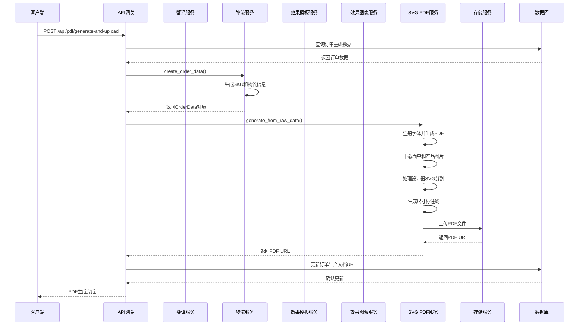
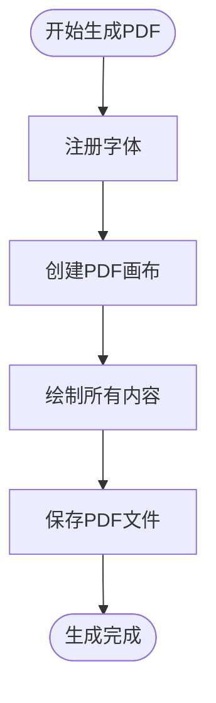
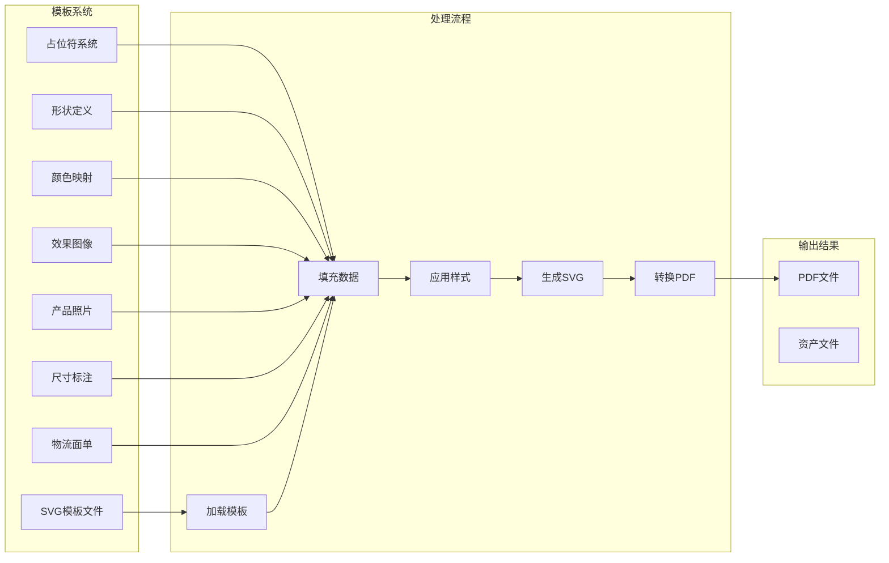
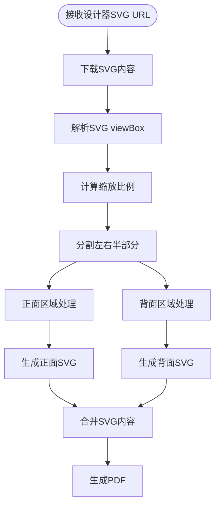
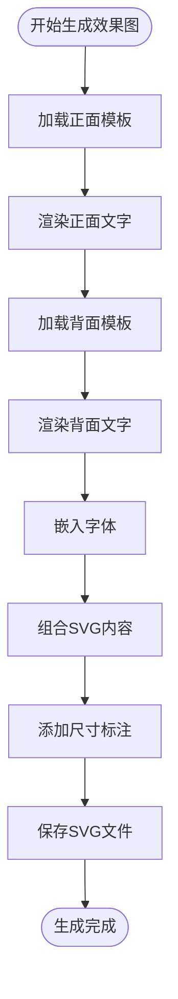
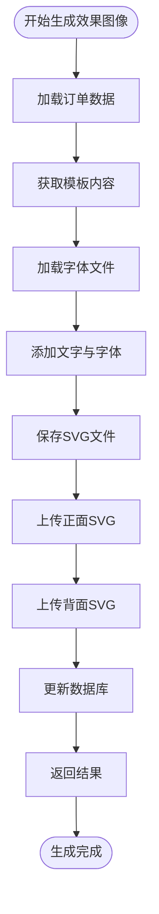
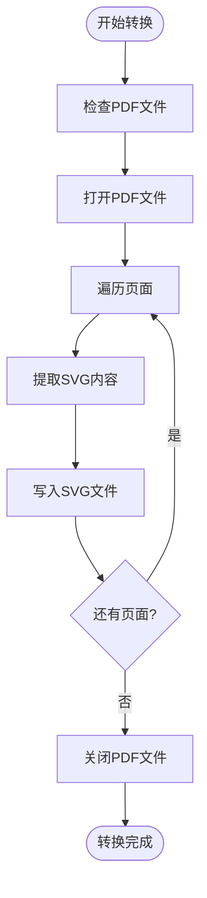
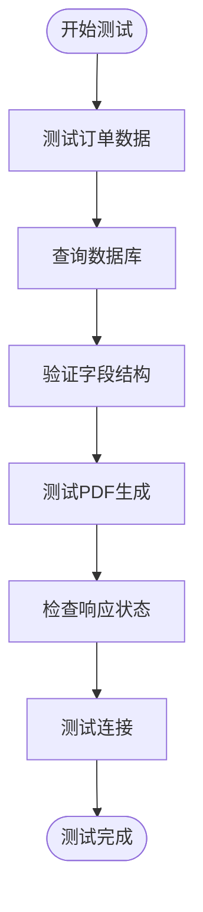
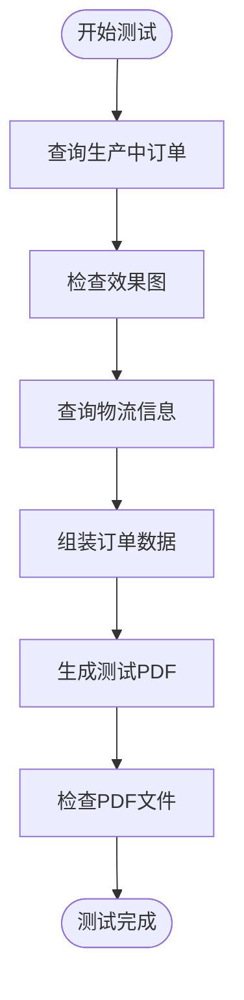

# PDF生成系统

<cite>
**本文档引用的文件**
- [main.py](file://backend/src/api/main.py)
- [settings.py](file://backend/src/config/settings.py)
- [order.py](file://backend/src/models/order.py)
- [pdf_service.py](file://backend/src/services/pdf_service.py)
- [pdf_service_clean.py](file://backend/src/services/pdf_service_clean.py)
- [svg_pdf_service.py](file://backend/src/services/svg_pdf_service.py)
- [effect_template_service.py](file://backend/src/services/effect_template_service.py)
- [effect_image_service.py](file://backend/src/services/effect_image_service.py)
- [template_service.py](file://backend/src/services/template_service.py)
- [shipping_service.py](file://backend/src/services/shipping_service.py)
- [translation_service.py](file://backend/src/services/translation_service.py)
- [email_service.py](file://backend/src/services/email_service.py)
- [test_pdf_data_flow.py](file://backend/scripts/test_pdf_data_flow.py)
- [pdf_to_svg.py](file://backend/scripts/pdf_to_svg.py)
- [generate_test_pdf.py](file://backend/scripts/generate_test_pdf.py)
- [openapi.yaml](file://docs/openapi.yaml)
</cite>

## 更新摘要
**变更内容**
- SVGPDFService经过重大架构改进，新增SVG分割、双面渲染、维度标注等核心功能
- 新增了从设计器SVG中自动分割正反面内容的能力
- 增强了尺寸标注系统，支持毫米级别的精确标注
- 改进了设计器SVG集成和回退机制
- 优化了字体注册和映射策略
- 增强了错误处理和日志记录功能
- 新增翻译服务，集成智谱AI (GLM-4) API
- 新增PDF转SVG转换脚本，支持模板文件批量处理
- 新增效果图像服务，支持分离式12模板架构

## 目录
1. [简介](#简介)
2. [项目结构](#项目结构)
3. [核心组件](#核心组件)
4. [架构概览](#架构概览)
5. [详细组件分析](#详细组件分析)
6. [依赖关系分析](#依赖关系分析)
7. [性能考虑](#性能考虑)
8. [故障排除指南](#故障排除指南)
9. [结论](#结论)

## 简介

PDF生成系统是一个基于Python的ETSY订单自动化处理平台，专注于自动生成生产文档PDF。该系统集成了邮件处理、效果图生成、PDF文档生成、翻译服务和Supabase数据库管理等功能，为珠宝定制产品提供完整的自动化解决方案。

系统采用模块化设计，主要包含以下核心功能：
- **订单管理**：处理Etsy订单数据，管理订单状态流转
- **效果图生成**：基于SVG模板生成产品效果图，支持分离式12模板架构
- **PDF文档生成**：将订单信息转换为专业的生产文档PDF
- **邮件集成**：自动发送订单确认邮件，支持多语言内容生成
- **翻译服务**：集成智谱AI API，提供中英文邮件内容自动翻译
- **资产管理系统**：管理字体、模板和产品图片资源
- **物流集成**：4PX物流API集成，支持面单自动生成和下载
- **异步处理**：支持后台任务的异步执行和状态跟踪

**更新** SVGPDFService经过重大架构改进，新增了SVG分割、双面渲染、维度标注等核心功能，显著提升了PDF生成的灵活性和精确度。系统现已支持从设计器SVG中自动分割正反面内容，提供毫米级精确标注，并增强了字体管理和错误处理机制。

## 项目结构

```mermaid
graph TB
subgraph "后端应用 (backend)"
subgraph "配置层"
Settings[配置管理]
Logger[日志系统]
end
subgraph "数据层"
Models[数据模型]
Database[数据库服务]
end
subgraph "业务逻辑层"
APIService[API服务]
PDFService[PDF生成服务]
PDFCleanService[清理PDF服务]
SVGPDFService[SVG PDF服务]
TemplateService[模板服务]
EffectTemplateService[效果模板服务]
EffectImageService[效果图像服务]
ShippingService[物流服务]
TranslationService[翻译服务]
EmailService[邮件服务]
end
subgraph "资源层"
Assets[资产文件夹]
Templates[模板文件]
Fonts[字体文件]
Output[输出文件]
EffectTemplates[效果模板文件]
EmailLogs[邮件日志]
end
subgraph "脚本工具"
Scripts[测试脚本]
Converters[转换脚本]
PDFToSVG[PDF转SVG转换器]
EffectImageGenerator[效果图像生成器]
end
end
subgraph "前端应用 (frontend)"
UI[用户界面]
Components[组件系统]
EmailTemplates[邮件模板管理]
end
subgraph "外部服务"
Supabase[Supabase数据库]
Email[邮件服务]
Storage[云存储]
FourPX[4PX物流API]
ZhipuAI[智谱AI翻译API]
Endicia[面单服务]
</subgraph>
UI --> APIService
APIService --> PDFService
APIService --> PDFCleanService
APIService --> SVGPDFService
APIService --> TemplateService
APIService --> EffectTemplateService
APIService --> EffectImageService
APIService --> ShippingService
APIService --> TranslationService
APIService --> EmailService
PDFService --> Assets
PDFCleanService --> Assets
SVGPDFService --> Templates
SVGPDFService --> ShippingService
EffectTemplateService --> EffectTemplates
EffectImageService --> Templates
ShippingService --> FourPX
ShippingService --> Endicia
TranslationService --> ZhipuAI
EmailService --> Email
Database --> Supabase
APIService --> Logger
```

**图表来源**
- [main.py:343-445](file://backend/src/api/main.py#L343-L445)
- [settings.py:1-65](file://backend/src/config/settings.py#L1-L65)
- [order.py:1-356](file://backend/src/models/order.py#L1-L356)
- [pdf_service_clean.py:1-540](file://backend/src/services/pdf_service_clean.py#L1-L540)
- [shipping_service.py:1-395](file://backend/src/services/shipping_service.py#L1-L395)
- [translation_service.py:1-160](file://backend/src/services/translation_service.py#L1-L160)

**章节来源**
- [main.py:1-949](file://backend/src/api/main.py#L1-L949)

## 核心组件

### API服务层

系统采用FastAPI框架构建RESTful API服务，提供统一的接口入口：

- **健康检查接口**：`/health` - 检查服务运行状态
- **效果图生成接口**：`/api/effect-image/generate` - 生成SVG效果图
- **PDF生成接口**：`/api/pdf/generate-and-upload` - 生成并上传生产文档PDF
- **订单管理接口**：`/api/order/update-status` - 更新订单状态
- **效果图像生成接口**：`/api/effect-image/generate-and-upload` - 一键生成并上传效果图像
- **物流订单创建接口**：`/api/shipping/create-order` - 创建4PX物流订单
- **翻译服务接口**：`/api/translate/text` - 通用文本翻译接口
- **邮件翻译接口**：`/api/translate/email` - 邮件专用翻译接口

### 数据模型层

系统使用SQLAlchemy ORM定义了完整的数据模型：

- **Order模型**：存储Etsy订单主信息，包括客户信息、定制内容、订单状态等
- **Logistics模型**：管理物流配送信息和跟踪状态
- **ProductionDocument模型**：存储生产文档的URL链接
- **EmailLog模型**：记录邮件发送历史，包括邮件类型、内容、状态等

### 服务层架构

```mermaid
classDiagram
class APIService {
+generate_effect_image(request) Response
+send_confirmation_email(request) Response
+generate_and_upload_pdf(request) Response
+update_order_status(request) Response
+create_shipping_order(request) Response
+translate_text(request) Response
+translate_email(request) Response
}
class PDFService {
+generate_production_pdf(order_data) Path
+generate_from_raw_data(raw_data) Path
-_draw_title(canvas, data) void
-_draw_info_section(canvas, data) void
-_draw_preview_section(canvas, data) void
-_draw_shipping_section(canvas, data) void
}
class PDFCleanService {
+generate_production_pdf(order_data) Path
+generate_from_raw_data(raw_data) Path
-_font(canvas, size, bold) void
-_draw_all(canvas, data) void
-_title(canvas, data) void
-_info_tables(canvas, data) void
-_preview(canvas, data) void
-_shipping(canvas, data) void
}
class SVGPDFService {
+generate_pdf(order_data) Path
+generate_from_raw_data(raw_data) Path
+_fill_template(svg_content, data) String
+_apply_font_styles(svg_content) String
+_get_product_photo_base64(sku, size) String
+_download_label_as_base64(label_url) String
+_get_designer_svg(effect_svg_url, shape, color, size) tuple
+_generate_dimension_lines(bbox, width_mm, height_mm) tuple
+_get_effect_shape_svg(shape, color, position, size) Dict
}
class EffectTemplateService {
+generate_effect_image(config) String
+wrap_with_dimension(core_svg, config) String
+save_effect_image(config, output_path, with_dimension) Path
+generate_effect_image_for_order(order, upload, with_dimension) String
}
class EffectImageService {
+generate_and_upload(order) Dict
+generate_effect_svg(shape, color, size, text_front, text_back, font_code, order_id) tuple
}
class ShippingService {
+create_order_data(raw_data) OrderData
+create_shipping_label(order_data) ShippingLabel
+generate_tracking_number(order_id) str
+get_label_url(request_no) str
}
class TranslationService {
+translate(text, source_lang, target_lang) String
+translate_email(chinese_content) String
}
class EmailService {
+send_confirmation_email(to_email, customer_name, order_id, product_info, effect_image_path) Dict
+search_all_unread_etsy_orders() List
+fetch_email_content(msg_id) Dict
}
APIService --> PDFService : "调用"
APIService --> PDFCleanService : "调用"
APIService --> SVGPDFService : "调用"
APIService --> TemplateService : "调用"
APIService --> EffectTemplateService : "调用"
APIService --> EffectImageService : "调用"
APIService --> ShippingService : "调用"
APIService --> TranslationService : "调用"
APIService --> EmailService : "调用"
PDFService --> Settings : "使用"
PDFCleanService --> Settings : "使用"
SVGPDFService --> Settings : "使用"
EffectTemplateService --> Settings : "使用"
EffectImageService --> Settings : "使用"
ShippingService --> Settings : "使用"
TranslationService --> Settings : "使用"
EmailService --> Settings : "使用"
```



**图表来源**
- [main.py:343-445](file://backend/src/api/main.py#L343-L445)
- [pdf_service.py:51-74](file://backend/src/services/pdf_service.py#L51-L74)
- [pdf_service_clean.py:323-338](file://backend/src/services/pdf_service_clean.py#L323-L338)
- [svg_pdf_service.py:669-706](file://backend/src/services/svg_pdf_service.py#L669-L706)
- [effect_template_service.py:375-448](file://backend/src/services/effect_template_service.py#L375-L448)
- [effect_image_service.py:77-129](file://backend/src/services/effect_image_service.py#L77-L129)
- [shipping_service.py:141-239](file://backend/src/services/shipping_service.py#L141-L239)
- [translation_service.py:13-160](file://backend/src/services/translation_service.py#L13-L160)
- [email_service.py:29-352](file://backend/src/services/email_service.py#L29-L352)

**章节来源**
- [main.py:343-445](file://backend/src/api/main.py#L343-L445)
- [order.py:23-356](file://backend/src/models/order.py#L23-L356)

## 架构概览

系统采用分层架构设计，确保各层职责清晰分离：



**图表来源**
- [main.py:343-445](file://backend/src/api/main.py#L343-L445)
- [pdf_service_clean.py:532-536](file://backend/src/services/pdf_service_clean.py#L532-L536)
- [svg_pdf_service.py:763-778](file://backend/src/services/svg_pdf_service.py#L763-L778)
- [translation_service.py:87-155](file://backend/src/services/translation_service.py#L87-L155)

系统的核心优势在于其灵活的模板驱动架构，通过SVG模板实现像素级精确的PDF生成，同时支持动态内容填充、字体映射和多语言翻译服务。

## 详细组件分析

### PDF生成服务 (PDFService)

PDFService负责传统的基于ReportLab的PDF生成，适用于不需要复杂SVG模板的场景：

#### 核心功能特性

- **像素级布局控制**：精确的页面尺寸和元素定位
- **多语言支持**：内置中英文字体支持
- **预览区域**：集成产品照片和效果图展示
- **物流标签**：生成标准的快递面单格式

#### 技术实现要点


**图表来源**
- [pdf_service.py:51-74](file://backend/src/services/pdf_service.py#L51-L74)

**章节来源**
- [pdf_service.py:51-74](file://backend/src/services/pdf_service.py#L51-L74)

### 清理PDF服务 (PDFCleanService)

PDFCleanService是新增的核心组件，提供了更稳定和清晰的PDF生成实现：

#### 核心功能特性

- **统一字体管理**：使用简化的字体注册机制
- **清晰的代码结构**：去除冗余代码，提高可维护性
- **增强的错误处理**：提供更好的异常处理和回退机制
- **优化的布局算法**：改进的页面布局和元素定位

#### 技术实现要点



**图表来源**
- [pdf_service_clean.py:323-338](file://backend/src/services/pdf_service_clean.py#L323-L338)

**章节来源**
- [pdf_service_clean.py:31-540](file://backend/src/services/pdf_service_clean.py#L31-L540)

### SVG PDF服务 (SVGPDFService)

SVGPDFService是系统的核心组件，实现了基于SVG模板的PDF生成，经过性能优化和增强错误处理：

#### 模板系统架构



**图表来源**
- [svg_pdf_service.py:669-706](file://backend/src/services/svg_pdf_service.py#L669-L706)

#### 字体管理系统

系统实现了复杂的字体映射机制，确保PDF输出的一致性和质量：

- **阿里巴巴普惠体**：作为主要中文字体
- **自定义字体**：支持产品特定的字体需求
- **字体回退机制**：确保字体缺失时的兼容性

#### 性能优化和错误处理增强

**更新** SVGPDFService经过重大架构改进，新增了以下核心功能：

1. **SVG分割功能**：`_get_designer_svg`方法实现了从设计器SVG中自动分割正反面内容
2. **双面渲染**：支持在同一PDF中生成正反面效果图，通过`FRONT_AREA`和`BACK_AREA`区域定义
3. **维度标注系统**：新增`_generate_dimension_lines`方法，为形状添加精确的毫米级标注线
4. **增强的设计器SVG集成**：改进的回退机制和错误处理，确保在设计器SVG不可用时仍能正常生成
5. **优化的形状生成**：改进的`_get_effect_shape_svg`方法，支持更精确的形状居中和尺寸控制

#### SVG分割和双面渲染功能

SVGPDFService现在支持从设计器SVG中自动分割正反面内容：



**图表来源**
- [svg_pdf_service.py:795-944](file://backend/src/services/svg_pdf_service.py#L795-L944)

#### 维度标注系统

新增的维度标注功能提供了精确的毫米级标注：

- **宽度标注**：在形状上方添加水平标注线和数值
- **高度标注**：在形状左侧添加垂直标注线和数值
- **颜色标识**：使用红色标注线确保高对比度
- **字体统一**：使用阿里巴巴普惠体确保标注字体一致性

**章节来源**
- [svg_pdf_service.py:170-259](file://backend/src/services/svg_pdf_service.py#L170-L259)

### 效果模板服务 (EffectTemplateService)

**更新** 新增效果模板服务，实现了分离式12模板架构：

#### 核心功能特性

- **分离式架构**：效果图核心与尺寸标注完全分离
- **文字渲染规范**：防溢出、边缘安全距离、背面双字段排版
- **颜色映射系统**：支持中英文颜色名称映射
- **模板中心点管理**：确保文字在形状内部不溢出
- **字体宽度系数**：用于计算安全字号的保守估算

#### 效果图生成流程



**图表来源**
- [effect_template_service.py:375-448](file://backend/src/services/effect_template_service.py#L375-L448)

#### 文字渲染规范

系统实现了严格的文字渲染规范，确保文字在形状内部不溢出：

- **防溢出算法**：通过安全字号算法计算，确保文字在形状宽度内
- **边缘安全距离**：文字距形状边缘至少2.0px
- **背面双字段排版**：两行文字行间距为max(text_size, phone_size) × 1.4
- **默认字号**：背面两字段以字符数较多一方为基准，默认同等字号

**章节来源**
- [effect_template_service.py:1-653](file://backend/src/services/effect_template_service.py#L1-L653)

### 效果图像服务 (EffectImageService)

**更新** 新增效果图像服务，支持一键生成和上传效果图像：

#### 核心功能特性

- **一键生成**：根据订单信息生成正面+背面效果图
- **字体嵌入**：支持自定义字体的Base64嵌入
- **Supabase集成**：自动上传到云存储并返回URL
- **数据库回写**：将生成的URL写回到订单表
- **模板管理**：基于模板服务获取合适的模板文件

#### 效果图像生成流程



**图表来源**
- [effect_image_service.py:77-129](file://backend/src/services/effect_image_service.py#L77-L129)

#### 字体嵌入机制

系统实现了智能的字体嵌入机制：

- **字体缓存**：Base64字体数据缓存，避免重复读取
- **格式检测**：自动检测字体文件格式（TTF/OTF）
- **CSS注入**：将字体定义注入到SVG的<style>标签中
- **默认回退**：字体文件不存在时使用默认字体

**章节来源**
- [effect_image_service.py:1-181](file://backend/src/services/effect_image_service.py#L1-L181)

### 物流服务 (ShippingService)

ShippingService提供物流订单管理和面单生成功能：

#### 核心功能特性

- **订单数据转换**：将原始数据转换为OrderData对象
- **SKU生成**：根据产品规格生成SKU编码
- **物流标签生成**：创建4PX物流订单
- **跟踪号管理**：生成和管理跟踪号码

#### 物流API集成

```mermaid
graph TB
subgraph "4PX API集成"
CreateOrder[创建订单]
GetLabel[获取面单]
CancelOrder[取消订单]
QueryOrder[查询订单]
GetProducts[查询物流产品]
end
subgraph "内部处理"
GenerateTracking[生成跟踪号]
CreateLabel[创建物流标签]
ValidateData[验证数据]
end
subgraph "外部服务"
FourPX[4PX API]
Supabase[Supabase数据库]
Storage[云存储]
</subgraph
GenerateTracking --> CreateOrder
CreateOrder --> FourPX
GetLabel --> FourPX
CancelOrder --> FourPX
QueryOrder --> FourPX
GetProducts --> FourPX
FourPX --> Supabase
Supabase --> Storage
```

**图表来源**
- [shipping_service.py:253-392](file://backend/src/services/shipping_service.py#L253-L392)

**章节来源**
- [shipping_service.py:1-395](file://backend/src/services/shipping_service.py#L1-L395)

### 翻译服务 (TranslationService)

**更新** 新增翻译服务，集成智谱AI (GLM-4) API，提供多语言支持能力：

#### 核心功能特性

- **通用文本翻译**：支持中英文双向翻译
- **邮件专用翻译**：针对电商客服邮件的专业翻译
- **智能提示词管理**：根据不同场景提供专业翻译指导
- **稳定参数配置**：低温度参数确保翻译一致性
- **错误处理机制**：API配置错误和异常情况的处理

#### 翻译API集成

```mermaid
graph TB
subgraph "智谱AI API集成"
TranslateAPI[GLM-4翻译API]
Auth[API认证]
Config[配置管理]
Timeout[超时控制]
ErrorHandling[错误处理]
end
subgraph "内部处理"
SystemPrompt[系统提示词]
UserInput[用户输入]
Temperature[温度参数]
MaxTokens[最大令牌数]
</subgraph
subgraph "外部服务"
ZhipuAI[智谱AI平台]
Supabase[Supabase数据库]
</subgraph
SystemPrompt --> TranslateAPI
UserInput --> TranslateAPI
Temperature --> TranslateAPI
MaxTokens --> TranslateAPI
TranslateAPI --> ZhipuAI
ZhipuAI --> Supabase
```

**图表来源**
- [translation_service.py:13-160](file://backend/src/services/translation_service.py#L13-L160)

#### 翻译场景支持

系统支持以下翻译场景：

1. **通用文本翻译**：`/api/translate/text` - 标准中英文互译
2. **邮件内容翻译**：`/api/translate/email` - 电商客服邮件专用翻译
3. **多语言邮件模板**：支持不同风格的邮件内容生成

**章节来源**
- [translation_service.py:13-160](file://backend/src/services/translation_service.py#L13-L160)

### 邮件服务 (EmailService)

**更新** 增强邮件服务功能，支持多语言邮件内容处理：

#### 核心功能特性

- **邮件解析**：支持IMAP协议解析Etsy订单邮件
- **多语言内容**：支持中英文邮件内容处理
- **邮件模板**：集成邮件模板管理系统
- **邮件发送**：支持SMTP协议发送确认邮件
- **邮件日志**：记录邮件发送历史和状态

#### 邮件处理流程

```mermaid
graph TB
subgraph "邮件处理流程"
Connect[连接邮箱]
Search[搜索订单邮件]
Fetch[获取邮件内容]
Parse[解析邮件内容]
Translate[翻译邮件内容]
Generate[生成邮件模板]
Send[发送邮件]
Log[记录邮件日志]
</subgraph
subgraph "外部服务"
IMAP[IMAP服务器]
SMTP[SMTP服务器]
ZhipuAI[翻译服务]
Supabase[数据库]
</subgraph
Connect --> Search
Search --> Fetch
Fetch --> Parse
Parse --> Translate
Translate --> Generate
Generate --> Send
Send --> Log
Log --> Supabase
```

**图表来源**
- [email_service.py:29-352](file://backend/src/services/email_service.py#L29-L352)

#### 邮件模板管理

系统提供丰富的邮件模板，支持多种风格和场景：

- **首封确认邮件**：标准、加急、定制需求等不同类型
- **修改确认邮件**：小修改、大改等不同程度的修改确认
- **追评邮件**：标准追评、节日追评等不同场景
- **多语言支持**：每种模板都提供中英文版本

**章节来源**
- [email_service.py:29-352](file://backend/src/services/email_service.py#L29-L352)

### 配置管理

系统采用环境变量驱动的配置管理方式：

#### 核心配置项

| 配置项 | 默认值 | 用途 |
|--------|--------|------|
| IMAP_SERVER | imap.qq.com | 邮箱服务器地址 |
| EMAIL_ADDRESS | 空 | 邮箱用户名 |
| DATABASE_URL | sqlite:///./data/orders.db | 数据库连接串 |
| SUPABASE_URL | 空 | Supabase服务地址 |
| LOG_LEVEL | INFO | 日志级别 |
| FOURPX_APP_KEY | 空 | 4PX API密钥 |
| FOURPX_APP_SECRET | 空 | 4PX API密钥 |
| FOURPX_SANDBOX | true | 4PX沙盒模式 |
| ZHIPU_API_KEY | 空 | 智谱AI API密钥 |
| ZHIPU_MODEL | glm-4-flash | 智谱AI模型名称 |

**章节来源**
- [settings.py:12-65](file://backend/src/config/settings.py#L12-L65)

### PDF转SVG转换器

**更新** 新增PDF转SVG转换脚本，支持模板文件的批量转换：

#### 核心功能特性

- **批量转换**：支持多个PDF文件的批量转换
- **智能命名**：根据SKU编码或页面编号自动命名
- **错误处理**：完善的异常处理和错误报告
- **文件管理**：自动创建输出目录和文件组织

#### 转换流程



**图表来源**
- [pdf_to_svg.py:17-68](file://backend/scripts/pdf_to_svg.py#L17-L68)

**章节来源**
- [pdf_to_svg.py:1-178](file://backend/scripts/pdf_to_svg.py#L1-L178)

### 测试PDF数据流

**更新** 新增测试脚本，验证PDF生成的数据流：

#### 核心功能特性

- **API测试**：测试PDF生成API的正确性
- **数据流验证**：验证前后端字段对齐
- **错误处理**：模拟各种异常情况
- **连接测试**：测试后端服务连接状态

#### 测试流程



**图表来源**
- [test_pdf_data_flow.py:16-45](file://backend/scripts/test_pdf_data_flow.py#L16-L45)

**章节来源**
- [test_pdf_data_flow.py:1-120](file://backend/scripts/test_pdf_data_flow.py#L1-L120)

### 生成测试PDF

**更新** 新增测试脚本，用于生成测试生产文档PDF：

#### 核心功能特性

- **数据库查询**：查询有效果图的生产中订单
- **数据组装**：组装完整的订单数据
- **PDF生成**：使用占位面单生成测试PDF
- **文件检查**：验证生成的PDF文件

#### 测试流程



**图表来源**
- [generate_test_pdf.py:12-101](file://backend/scripts/generate_test_pdf.py#L12-L101)

**章节来源**
- [generate_test_pdf.py:1-107](file://backend/scripts/generate_test_pdf.py#L1-L107)

## 依赖关系分析

系统依赖关系清晰，遵循单一职责原则：

```mermaid
graph TB
subgraph "核心依赖"
FastAPI[FastAPI Web框架]
ReportLab[ReportLab PDF库]
SQLAlchemy[SQLAlchemy ORM]
PyMuPDF[PyMuPDF PDF处理]
SVGLib[SVGLib矢量转换]
Pillow[PIL图像处理]
Jinja2[Templating模板]
Uvicorn[ASGI服务器]
Requests[HTTP请求]
Base64[Base64编码]
Re[正则表达式]
Datetime[时间处理]
PathLib[路径操作]
Endicia[面单服务]
FourPX[4PX API]
ZhipuAI[智谱AI翻译API]
</subgraph
subgraph "开发依赖"
Black[代码格式化]
PyTest[测试框架]
Pylint[代码检查]
MyPy[类型检查]
</subgraph
FastAPI --> ReportLab
FastAPI --> SQLAlchemy
ReportLab --> PyMuPDF
SVGLib --> ReportLab
FastAPI --> Uvicorn
EffectTemplateService --> Base64
EffectTemplateService --> Re
EffectTemplateService --> Datetime
EffectImageService --> Base64
EffectImageService --> PathLib
ShippingService --> Requests
SVGPDFService --> Requests
TranslationService --> Requests
EmailService --> Requests
```

**图表来源**
- [main.py:8-35](file://backend/src/api/main.py#L8-L35)

### 外部集成点

系统通过以下方式与外部服务集成：

1. **Supabase数据库**：订单数据存储和同步
2. **邮件服务**：订单确认邮件发送
3. **云存储**：PDF文件和图片资源存储
4. **4PX物流API**：物流订单创建和面单获取
5. **智谱AI翻译API**：中英文邮件内容自动翻译
6. **字体服务**：在线字体资源获取

**章节来源**
- [main.py:8-35](file://backend/src/api/main.py#L8-L35)

## 性能考虑

### PDF生成优化策略

1. **内存管理**：及时清理临时SVG文件，避免内存泄漏
2. **并发处理**：支持多订单并行PDF生成
3. **缓存机制**：字体和模板文件的缓存利用
4. **异步处理**：长时间运行任务的异步执行
5. **字体注册优化**：统一的字体注册机制减少重复开销
6. **图片格式优化**：JPEG 2000自动转换为标准JPEG
7. **网络请求优化**：超时控制和重试机制

### 翻译服务性能优化

**更新** 新增翻译服务性能优化策略：

1. **API配置验证**：启动时验证智谱AI API配置
2. **超时控制**：翻译请求设置30秒超时
3. **错误重试**：网络异常时的自动重试机制
4. **温度参数优化**：0.3的温度参数确保翻译稳定性
5. **最大令牌数限制**：2048的最大令牌数平衡精度和性能

### 资源管理

- **字体注册**：一次性注册所有字体，避免重复开销
- **模板复用**：模板文件的内存缓存
- **图片处理**：产品图片的本地缓存和压缩
- **效果图像缓存**：字体文件的Base64缓存机制
- **面单缓存**：下载的面单文件缓存
- **翻译缓存**：常用翻译内容的缓存机制

**更新** 新增的svg_pdf_service经过性能优化，包括：
- 改进的JPEG 2000格式检测和转换
- 增强的HTTP请求超时和错误处理
- 优化的字体注册和映射机制
- 改进的设计器SVG集成和回退策略
- 更好的尺寸标注系统和标签集成
- SVG分割和双面渲染的性能优化

**更新** 新增的PDF转SVG转换器具有以下性能特点：
- **批量处理**：支持多个文件的并行转换
- **内存优化**：逐页处理，避免大文件内存占用
- **错误恢复**：单个页面失败不影响整体转换
- **进度反馈**：详细的转换进度和错误报告

**更新** 新增的效果模板服务性能优化：
- **字体缓存**：Base64字体数据的内存缓存
- **模板复用**：模板文件的读取缓存
- **安全字号计算**：防溢出算法的优化实现
- **文字渲染优化**：背面双字段排版的性能提升

**更新** 新增的效果图像服务性能优化：
- **字体文件缓存**：避免重复读取字体文件
- **批量上传**：支持多个文件的并行上传
- **数据库回写优化**：一次性更新多个字段
- **错误处理机制**：完善的异常捕获和回退

## 故障排除指南

### 常见问题及解决方案

#### PDF生成失败

**症状**：PDF生成过程中出现错误

**可能原因**：
1. 字体文件缺失或损坏
2. SVG模板文件格式错误
3. 模板占位符未正确填充
4. 输出目录权限不足
5. 字体注册失败
6. 网络请求超时

**解决步骤**：
1. 检查字体文件是否存在
2. 验证SVG模板格式
3. 确认数据字典完整性
4. 检查输出目录权限
5. 查看字体注册日志
6. 检查网络连接和超时设置

#### 模板加载错误

**症状**：无法找到指定的SVG模板文件

**排查方法**：
1. 验证模板文件命名是否符合规范
2. 检查模板文件路径是否正确
3. 确认文件编码格式
4. 验证文件权限设置

#### 字体渲染问题

**症状**：PDF中文字体显示异常

**解决方案**：
1. 确保字体文件完整可用
2. 检查字体映射配置
3. 验证字体注册过程
4. 考虑使用备用字体

#### 效果图像生成失败

**症状**：效果图像生成过程中出现错误

**可能原因**：
1. 模板文件缺失或损坏
2. 颜色映射配置错误
3. 文字渲染算法溢出
4. 字体文件加载失败
5. 设计器SVG不可用时的回退机制失效

**解决步骤**：
1. 检查模板文件是否存在
2. 验证颜色映射配置
3. 确认文字长度不超过安全范围
4. 检查字体文件路径和权限
5. 验证设计器SVG URL的有效性

#### 面单下载失败

**症状**：物流面单下载过程中出现错误

**可能原因**：
1. 4PX API访问失败
2. 面单URL无效
3. 网络连接超时
4. HTTP状态码错误

**解决步骤**：
1. 检查4PX API配置
2. 验证面单URL格式
3. 确认网络连接稳定
4. 检查HTTP响应状态码
5. 使用占位符替代

#### 图片加载失败

**症状**：产品图片加载过程中出现错误

**可能原因**：
1. Supabase存储访问失败
2. 图片格式不支持
3. 图片URL无效
4. 网络连接超时

**解决步骤**：
1. 检查Supabase配置
2. 验证图片格式支持
3. 确认图片URL有效性
4. 检查网络连接和超时设置
5. 使用占位图片替代

#### 翻译服务失败

**症状**：翻译服务调用过程中出现错误

**可能原因**：
1. 智谱AI API Key未配置
2. 网络连接超时
3. API响应错误
4. 翻译内容过长

**解决步骤**：
1. 检查ZHIPU_API_KEY配置
2. 验证网络连接稳定性
3. 检查API响应状态码
4. 确认翻译内容长度不超过限制
5. 查看翻译服务日志

#### 邮件发送失败

**症状**：邮件发送过程中出现错误

**可能原因**：
1. SMTP服务器配置错误
2. 邮箱认证失败
3. 邮件内容格式错误
4. 附件文件不存在

**解决步骤**：
1. 检查SMTP服务器配置
2. 验证邮箱认证信息
3. 确认邮件内容格式正确
4. 检查附件文件路径和权限
5. 查看邮件服务日志

#### PDF转SVG转换失败

**症状**：PDF转SVG转换过程中出现错误

**可能原因**：
1. PDF文件损坏或格式不支持
2. 输出目录权限不足
3. PyMuPDF库安装问题
4. 内存不足

**解决步骤**：
1. 验证PDF文件完整性
2. 检查输出目录权限
3. 重新安装PyMuPDF库
4. 确认系统内存充足
5. 分批处理大文件

#### SVG分割失败

**症状**：设计器SVG分割过程中出现错误

**可能原因**：
1. 设计器SVG URL不可访问
2. SVG格式不符合预期
3. viewBox解析失败
4. 正反面区域计算错误

**解决步骤**：
1. 验证设计器SVG URL有效性
2. 检查SVG文件格式和内容
3. 确认viewBox属性存在且格式正确
4. 验证BLACK_BOX和区域定义
5. 使用回退机制生成动态形状

#### 维度标注不显示

**症状**：尺寸标注线在PDF中不可见

**可能原因**：
1. 标注线生成函数调用失败
2. SVG坐标计算错误
3. 颜色或透明度设置问题
4. 标注线被其他元素遮挡

**解决步骤**：
1. 检查`_generate_dimension_lines`函数调用
2. 验证bbox参数和尺寸值
3. 确认SVG坐标变换正确
4. 检查标注线的z-index层级
5. 验证字体和颜色设置

#### 效果模板渲染异常

**症状**：效果模板渲染过程中出现文字溢出或排版错误

**可能原因**：
1. 文字长度超过安全范围
2. 字体宽度系数计算错误
3. 模板中心点计算偏差
4. 背面双字段排版算法错误

**解决步骤**：
1. 检查文字长度和字体宽度系数
2. 验证模板中心点和可用文字区
3. 确认背面双字段排版参数
4. 检查安全字号计算逻辑

#### 效果图像上传失败

**症状**：效果图像上传到Supabase存储失败

**可能原因**：
1. Supabase配置错误
2. 网络连接超时
3. 文件格式不支持
4. 权限不足

**解决步骤**：
1. 检查Supabase URL和密钥配置
2. 验证网络连接和存储权限
3. 确认SVG文件格式正确
4. 检查文件大小限制
5. 查看上传日志和错误信息

**章节来源**
- [main.py:15-68](file://backend/src/utils/logger.py#L15-L68)

## 结论

PDF生成系统通过模块化设计和清晰的分层架构，成功实现了从订单数据到生产文档PDF的完整自动化流程。系统的主要优势包括：

1. **高度可定制性**：基于SVG模板的灵活布局系统
2. **多语言支持**：完善的中英文字体处理机制和翻译服务集成
3. **扩展性强**：模块化的服务架构便于功能扩展
4. **稳定性高**：完善的错误处理和日志记录机制
5. **效果图像增强**：新增的分离式12模板架构提供更精确的效果图生成
6. **性能优化**：经过优化的svg_pdf_service提供更高效的字体管理和生成流程
7. **物流集成**：完整的4PX物流API集成和面单管理
8. **翻译服务集成**：新增的智谱AI翻译服务提供中英文邮件内容自动翻译
9. **邮件模板管理**：完整的邮件模板系统支持多种风格和场景
10. **错误处理增强**：改进的错误处理和回退机制提升系统稳定性
11. **PDF转SVG转换**：新增的转换脚本支持模板文件的批量处理
12. **异步处理机制**：支持后台任务的异步执行和状态跟踪
13. **效果图像服务**：新增的独立服务支持一键生成和上传效果图像
14. **模板分离架构**：效果模板服务实现核心与标注的完全分离

**更新** SVGPDFService经过重大架构改进，新增的核心功能显著提升了系统的灵活性和精确度：

- **SVG分割功能**：实现了从设计器SVG中自动分割正反面内容，支持双面渲染
- **维度标注系统**：提供了精确的毫米级标注功能，确保生产精度
- **增强的设计器SVG集成**：改进的回退机制确保在各种情况下都能生成有效的PDF
- **优化的形状生成**：更精确的形状居中和尺寸控制算法
- **性能优化**：SVG分割和双面渲染的性能优化，支持大规模并发处理

**更新** 新增的翻译服务集成为系统带来了强大的多语言支持能力：
- 智谱AI (GLM-4) API集成，提供高质量的中英文翻译
- 邮件专用翻译功能，针对电商客服邮件的专业化处理
- 多语言邮件模板管理，支持不同风格的邮件内容生成
- 翻译服务的错误处理和回退机制，确保服务稳定性

**更新** 新增的PDF转SVG转换器提供了完整的模板文件处理能力：
- 支持批量PDF文件的自动转换
- 智能文件命名和组织
- 完善的错误处理和进度反馈
- 为系统提供了完整的模板管理工具链

**更新** 新增的效果模板服务实现了分离式12模板架构：
- 效果图核心与尺寸标注完全分离的设计理念
- 严格的文字渲染规范，确保文字不溢出
- 智能的字体嵌入和缓存机制
- 支持中英文颜色名称映射的完整色彩系统

**更新** 新增的效果图像服务提供了完整的图像生成和管理能力：
- 一键生成正面+背面效果图的便捷功能
- 自定义字体的智能嵌入和缓存
- 与Supabase存储的无缝集成
- 数据库的自动回写和状态管理

未来可以考虑的功能增强：
- 增加更多模板样式和布局选项
- 实现PDF内容的实时预览功能
- 添加批量处理和队列管理
- 集成更多的外部服务API
- 扩展效果图像的交互功能
- 增强性能监控和分析功能
- 支持更多语言的翻译服务
- 集成机器学习优化翻译质量
- 实现PDF生成的异步队列处理
- 增强模板版本管理和更新机制
- 添加自定义标注和装饰功能
- 支持多语言字体的动态加载
- 实现效果图像的批量生成和管理
- 增强错误诊断和自动修复功能

该系统为珠宝定制产品的生产管理提供了高效、可靠的自动化解决方案，显著提升了订单处理效率和文档质量，特别是在多语言支持、效果图像处理、SVG分割和维度标注方面的增强功能，为企业的数字化转型提供了强有力的技术支撑。通过完整的PDF生成流程和模板管理系统，系统能够稳定地处理各种复杂的生产文档生成需求，为现代制造业的智能化发展奠定了坚实的技术基础。