# Supabase集成指南

<cite>
**本文档引用的文件**
- [backend/src/utils/logger.py](file://backend/src/utils/logger.py)
- [frontend/src/utils/supabase.js](file://frontend/src/utils/supabase.js)
- [backend/src/config/settings.py](file://backend/src/config/settings.py)
- [backend/.env](file://backend/.env)
- [frontend/.env](file://frontend/.env)
- [backend/scripts/check_supabase_resources.py](file://backend/scripts/check_supabase_resources.py)
- [backend/scripts/test_supabase_connection.py](file://backend/scripts/test_supabase_connection.py)
- [backend/scripts/upload_assets_to_supabase.py](file://backend/scripts/upload_assets_to_supabase.py)
- [backend/scripts/verify_storage.py](file://backend/scripts/verify_storage.py)
- [backend/src/services/database_service.py](file://backend/src/services/database_service.py)
- [backend/pyproject.toml](file://backend/pyproject.toml)
- [frontend/package.json](file://frontend/package.json)
- [backend/scripts/keep_supabase_alive.py](file://backend/scripts/keep_supabase_alive.py)
- [backend/scripts/list_storage_files.py](file://backend/scripts/list_storage_files.py)
- [backend/scripts/init_multitenant.py](file://backend/scripts/init_multitenant.py)
- [backend/scripts/create_tables_sql.md](file://backend/scripts/create_tables_sql.md)
- [backend/scripts/init_subaccount.sql](file://backend/scripts/init_subaccount.sql)
- [backend/scripts/init_multitenant.sql](file://backend/scripts/init_multitenant.sql)
- [frontend/src/stores/shopStore.js](file://frontend/src/stores/shopStore.js)
- [frontend/src/stores/adminStore.js](file://frontend/src/stores/adminStore.js)
- [frontend/src/views/StorePortal/StoreLogin.vue](file://frontend/src/views/StorePortal/StoreLogin.vue)
- [frontend/src/views/StorePortal/StoreOrders.vue](file://frontend/src/views/StorePortal/StoreOrders.vue)
- [frontend/src/views/Admin/AdminUsers.vue](file://frontend/src/views/Admin/AdminUsers.vue)
- [frontend/src/views/Admin/AdminShops.vue](file://frontend/src/views/Admin/AdminShops.vue)
- [frontend/src/views/Admin/AdminDashboard.vue](file://frontend/src/views/Admin/AdminDashboard.vue)
</cite>

## 更新摘要
**变更内容**
- 新增多租户架构章节，包含多店铺数据隔离和权限控制
- 增强权限管理和用户管理功能，支持主账号-子账号体系
- 更新数据库架构图，反映新的表结构和关系
- 新增子账号权限管理功能说明
- 更新前端多租户界面实现

## 目录
1. [简介](#简介)
2. [项目结构概览](#项目结构概览)
3. [核心组件分析](#核心组件分析)
4. [多租户架构设计](#多租户架构设计)
5. [权限管理体系](#权限管理体系)
6. [架构概览](#架构概览)
7. [详细组件分析](#详细组件分析)
8. [依赖关系分析](#依赖关系分析)
9. [性能考虑](#性能考虑)
10. [故障排除指南](#故障排除指南)
11. [结论](#结论)

## 简介

Supabase集成指南旨在为ETSY订单自动化系统提供完整的Supabase数据库和存储服务集成方案。该系统通过Supabase实现了订单数据管理、资源存储、以及前后端数据同步功能。

**更新** 系统现已引入多租户架构，支持多个商店的独立数据隔离和权限控制，增强了权限管理和用户管理功能。

Supabase是一个开源的Firebase替代方案，提供了PostgreSQL数据库、认证、存储等功能。在本项目中，Supabase被用来：

- 存储订单数据和业务逻辑
- 提供实时数据同步
- 管理静态资源文件
- 支持多租户和权限控制
- 实现主账号-子账号权限体系

## 项目结构概览

项目采用前后端分离架构，Supabase作为后端数据层的核心组件：

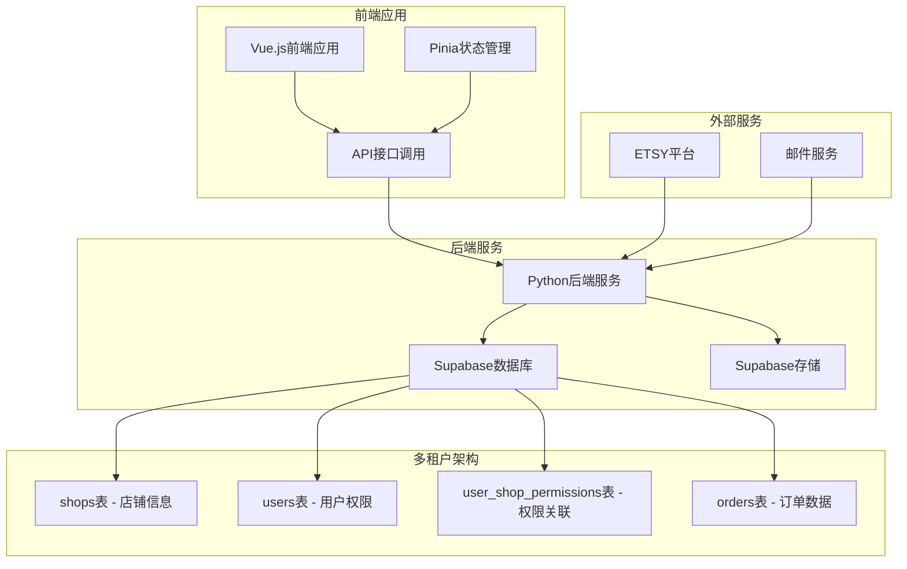

**图表来源**
- [frontend/src/stores/shopStore.js](file://frontend/src/stores/shopStore.js#L1-L190)
- [frontend/src/stores/adminStore.js](file://frontend/src/stores/adminStore.js#L1-L321)
- [backend/src/services/database_service.py](file://backend/src/services/database_service.py#L1-L112)

**章节来源**
- [backend/src/config/settings.py](file://backend/src/config/settings.py#L1-L61)
- [backend/.env](file://backend/.env#L1-L8)
- [frontend/.env](file://frontend/.env#L1-L4)

## 核心组件分析

### 配置管理系统

配置管理模块负责统一管理Supabase连接参数和环境变量：

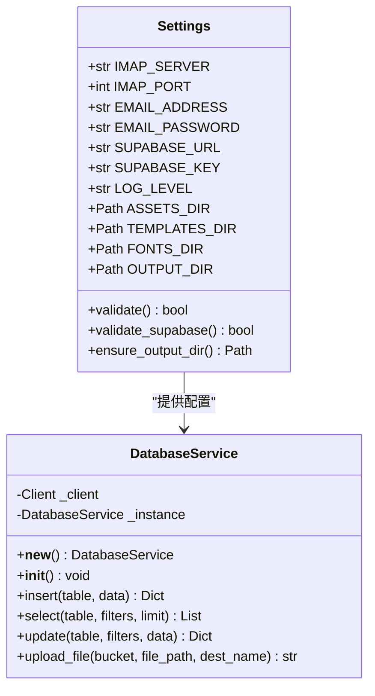

**图表来源**
- [backend/src/config/settings.py](file://backend/src/config/settings.py#L12-L61)
- [backend/src/services/database_service.py](file://backend/src/services/database_service.py#L10-L112)

### 前端Supabase客户端

前端通过专门的客户端模块管理Supabase连接：

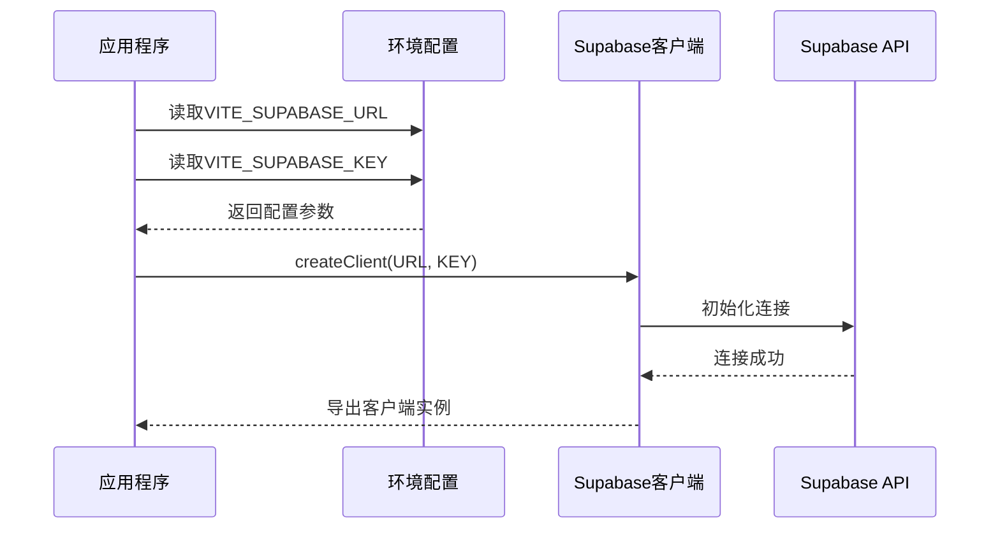

**图表来源**
- [frontend/src/utils/supabase.js](file://frontend/src/utils/supabase.js#L1-L18)

**章节来源**
- [backend/src/config/settings.py](file://backend/src/config/settings.py#L18-L19)
- [frontend/src/utils/supabase.js](file://frontend/src/utils/supabase.js#L4-L13)

## 多租户架构设计

### 数据库架构

系统采用多租户架构，通过独立的表结构实现数据隔离：

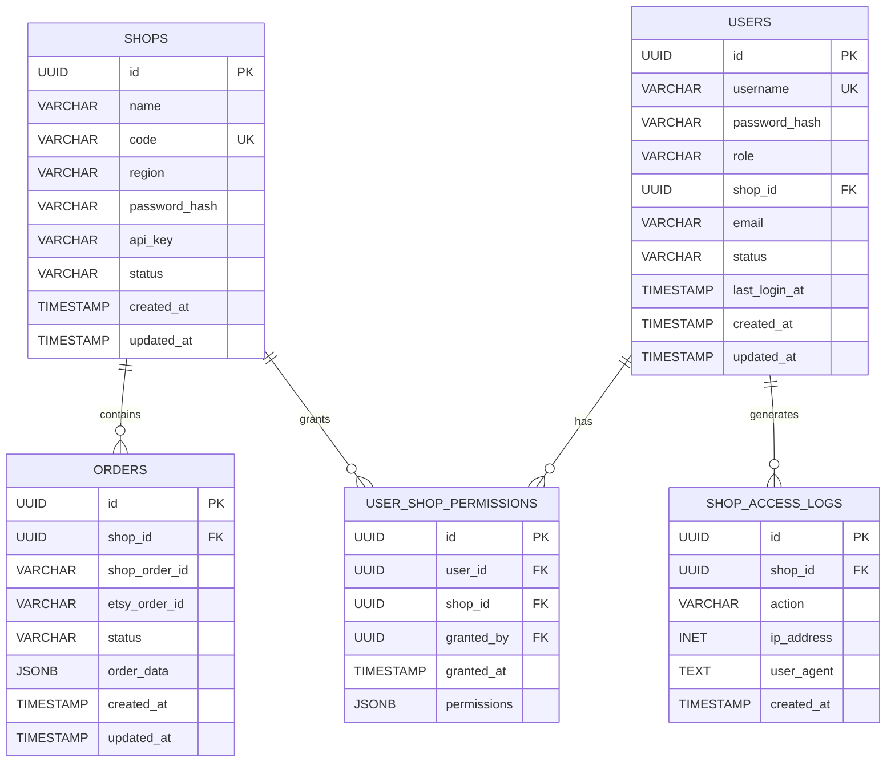

**图表来源**
- [backend/scripts/create_tables_sql.md](file://backend/scripts/create_tables_sql.md#L1-L114)
- [backend/scripts/init_subaccount.sql](file://backend/scripts/init_subaccount.sql#L28-L38)

### 多租户数据隔离

多租户架构通过以下机制实现数据隔离：

1. **店铺维度隔离**: 所有数据都与特定店铺关联
2. **权限控制**: 通过用户角色和权限表控制访问范围
3. **订单关联**: 订单数据通过shop_id字段与店铺绑定
4. **访问日志**: 记录每个店铺的操作历史

**章节来源**
- [backend/scripts/create_tables_sql.md](file://backend/scripts/create_tables_sql.md#L1-L114)
- [backend/scripts/init_multitenant.py](file://backend/scripts/init_multitenant.py#L29-L102)

## 权限管理体系

### 角色定义

系统支持以下角色类型：

| 角色 | 描述 | 权限范围 |
|------|------|----------|
| admin | 系统管理员 | 全部店铺，全部功能 |
| store_operator | 店铺运营人员 | 自身店铺，订单管理 |
| factory | 工厂操作员 | 工厂相关功能 |
| main | 主账号 | 管理子账号，分配权限 |
| sub | 子账号 | 分配的店铺权限 |

### 权限控制机制

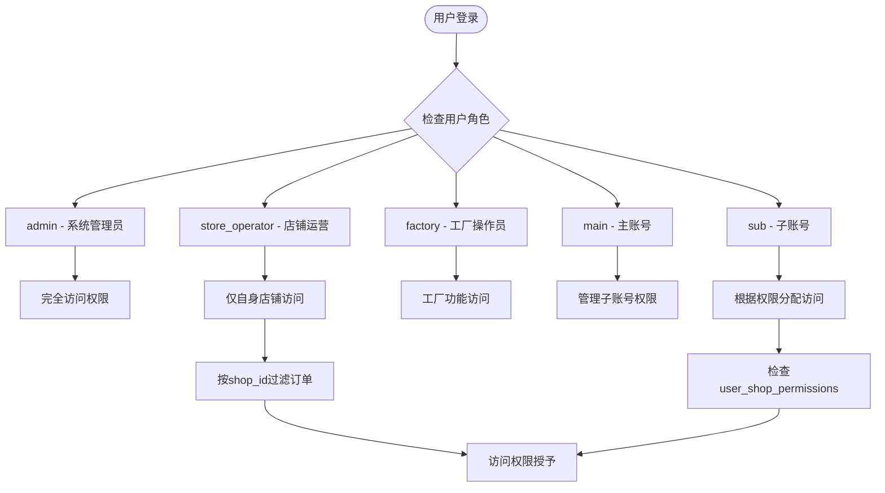

**图表来源**
- [backend/scripts/init_subaccount.sql](file://backend/scripts/init_subaccount.sql#L20-L21)

### 子账号权限管理

系统支持主账号-子账号的层级权限体系：

1. **主账号**: 拥有最高权限，可以管理子账号
2. **子账号**: 通过主账号授权，获得特定店铺的访问权限
3. **权限继承**: 子账号继承主账号的部分管理能力
4. **权限审计**: 记录所有权限变更和操作日志

**章节来源**
- [backend/scripts/init_subaccount.sql](file://backend/scripts/init_subaccount.sql#L1-L90)
- [frontend/src/views/Admin/AdminUsers.vue](file://frontend/src/views/Admin/AdminUsers.vue#L146-L359)

## 架构概览

系统采用分层架构设计，Supabase作为数据基础设施层：

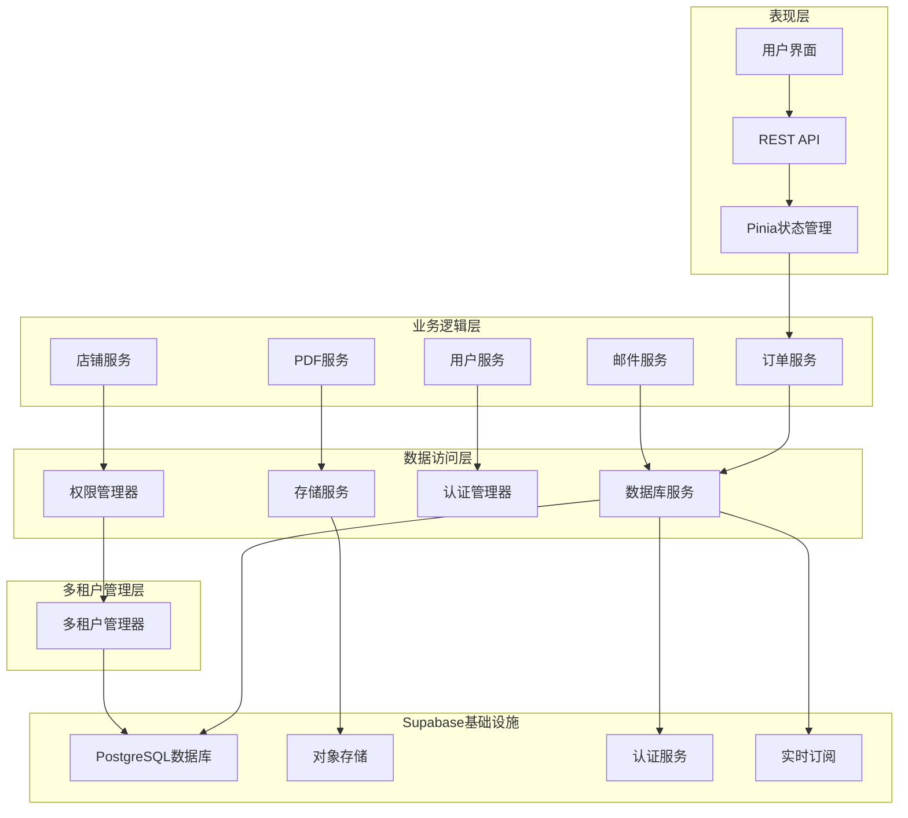

**图表来源**
- [backend/src/services/database_service.py](file://backend/src/services/database_service.py#L1-L112)
- [frontend/src/stores/shopStore.js](file://frontend/src/stores/shopStore.js#L1-L190)
- [frontend/src/stores/adminStore.js](file://frontend/src/stores/adminStore.js#L1-L321)

## 详细组件分析

### 数据库服务组件

数据库服务组件提供了统一的Supabase访问接口：

#### 核心功能

1. **连接管理**: 单例模式确保只有一个数据库连接实例
2. **CRUD操作**: 提供标准的数据增删改查方法
3. **文件上传**: 集成Supabase Storage进行文件管理
4. **订单管理**: 特化的订单数据操作方法
5. **多租户支持**: 自动处理店铺数据隔离

#### 数据库操作流程

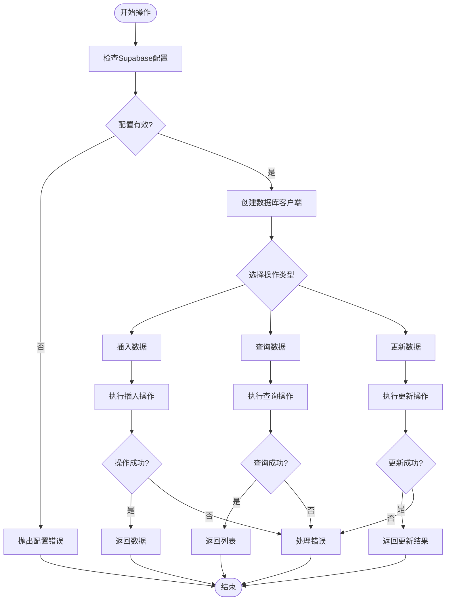

**图表来源**
- [backend/src/services/database_service.py](file://backend/src/services/database_service.py#L27-L62)

**章节来源**
- [backend/src/services/database_service.py](file://backend/src/services/database_service.py#L1-L112)

### 资源上传组件

资源上传组件负责将本地资源文件上传到Supabase Storage：

#### 上传流程

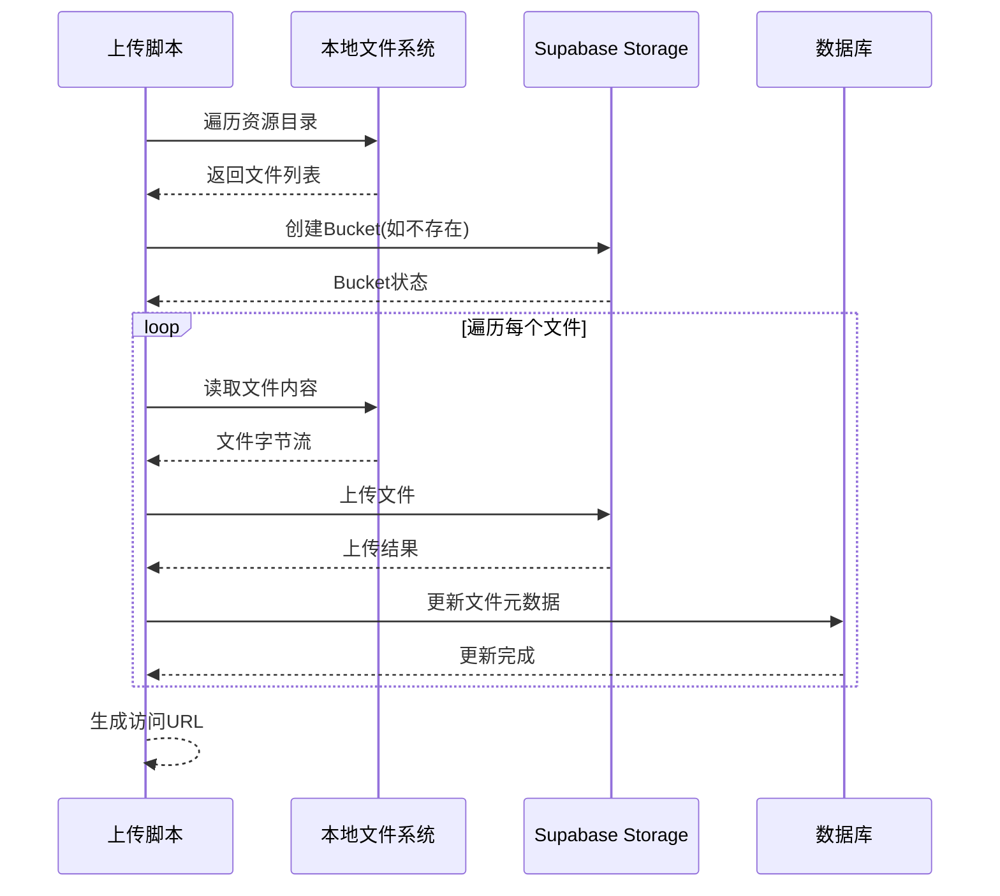

**图表来源**
- [backend/scripts/upload_assets_to_supabase.py](file://backend/scripts/upload_assets_to_supabase.py#L39-L66)

#### 支持的资源类型

| 资源类型 | 目录结构 | 文件扩展名 | MIME类型 |
|---------|----------|------------|----------|
| 模板文件 | templates/ | .svg | image/svg+xml |
| 实拍图片 | photos/ | .jpg, .jpeg, .png | image/jpeg, image/png |
| 字体文件 | fonts/ | .ttf, .otf | font/ttf, font/otf |
| PDF文件 | output/ | .pdf | application/pdf |

**章节来源**
- [backend/scripts/upload_assets_to_supabase.py](file://backend/scripts/upload_assets_to_supabase.py#L46-L55)

### 连接测试组件

连接测试组件用于验证Supabase连接的可用性：

#### 测试流程

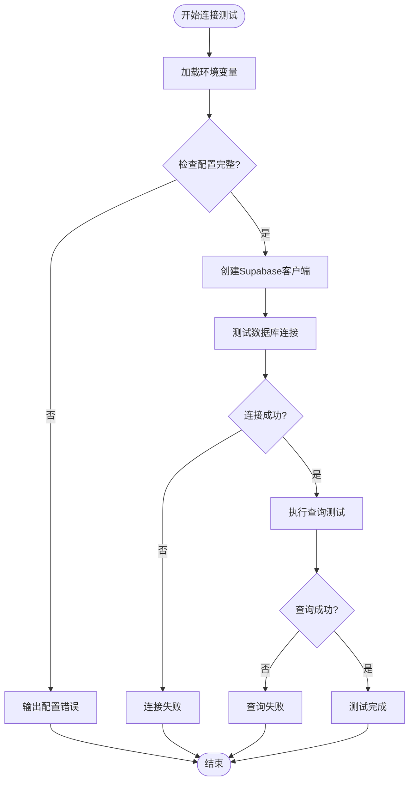

**图表来源**
- [backend/scripts/test_supabase_connection.py](file://backend/scripts/test_supabase_connection.py#L19-L64)

**章节来源**
- [backend/scripts/test_supabase_connection.py](file://backend/scripts/test_supabase_connection.py#L1-L67)

### 资源检查组件

资源检查组件用于验证Supabase中的数据完整性：

#### 检查流程

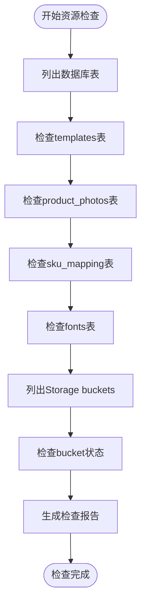

**图表来源**
- [backend/scripts/check_supabase_resources.py](file://backend/scripts/check_supabase_resources.py#L14-L58)

**章节来源**
- [backend/scripts/check_supabase_resources.py](file://backend/scripts/check_supabase_resources.py#L1-L62)

### 多租户初始化组件

多租户初始化组件负责设置数据库结构和默认数据：

#### 初始化流程

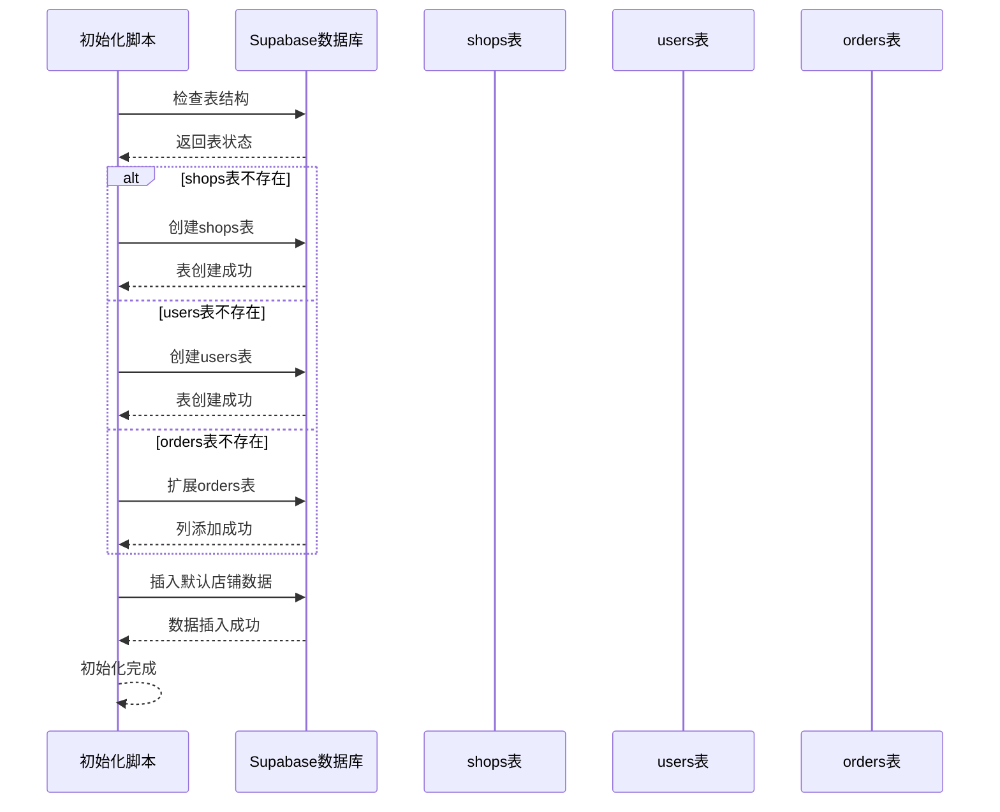

**图表来源**
- [backend/scripts/init_multitenant.py](file://backend/scripts/init_multitenant.py#L15-L112)

**章节来源**
- [backend/scripts/init_multitenant.py](file://backend/scripts/init_multitenant.py#L1-L112)

## 依赖关系分析

### 后端依赖

后端项目使用Poetry管理依赖，Supabase相关依赖如下：

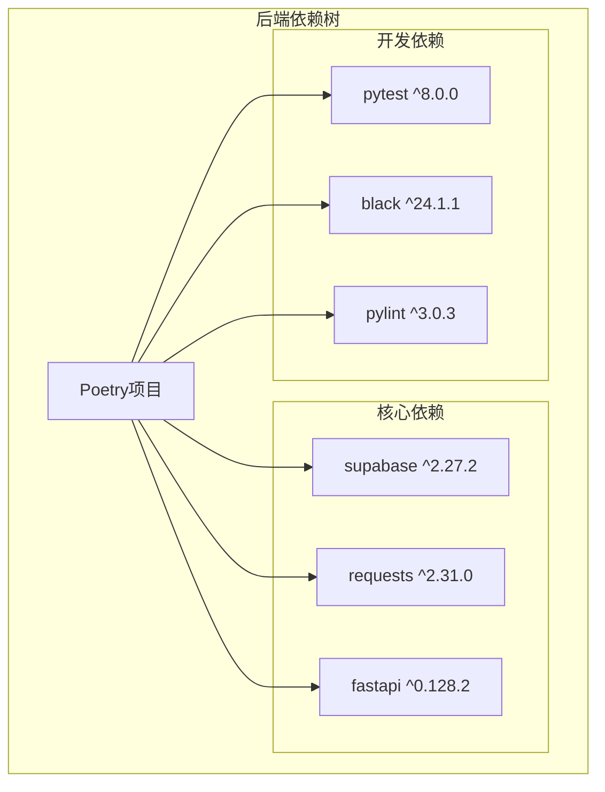

**图表来源**
- [backend/pyproject.toml](file://backend/pyproject.toml#L32-L35)

### 前端依赖

前端项目使用npm管理依赖，Supabase相关依赖：

```mermaid
graph TB
subgraph "前端依赖树"
NPM[npm项目]
subgraph "核心依赖"
SupabaseJS[@supabase/supabase-js ^2.93.3]
Vue[vue ^3.5.24]
ElementPlus[element-plus ^2.13.2]
Pinia[Pinia ^2.3.0]
end
subgraph "开发依赖"
Vite[vite ^7.2.4]
TailwindCSS[tailwindcss ^4.2.1]
end
end
NPM --> SupabaseJS
NPM --> Vue
NPM --> ElementPlus
NPM --> Pinia
NPM --> Vite
NPM --> TailwindCSS
```

**图表来源**
- [frontend/package.json](file://frontend/package.json#L13-L20)

**章节来源**
- [backend/pyproject.toml](file://backend/pyproject.toml#L1-L69)
- [frontend/package.json](file://frontend/package.json#L1-L31)

## 性能考虑

### 连接优化

1. **连接池管理**: 使用单例模式避免重复创建数据库连接
2. **超时设置**: 合理设置数据库操作超时时间
3. **批量操作**: 对于大量数据操作使用批量处理

### 存储优化

1. **文件压缩**: 上传前对图片进行适当压缩
2. **缓存策略**: 利用CDN缓存静态资源
3. **分块上传**: 对于大文件使用分块上传机制

### 查询优化

1. **索引设计**: 为常用查询字段建立索引
2. **分页查询**: 对大数据集使用分页机制
3. **条件过滤**: 使用WHERE条件减少数据传输
4. **多租户查询**: 通过shop_id字段实现高效过滤

### 多租户性能优化

1. **权限缓存**: 缓存用户权限信息减少数据库查询
2. **数据分区**: 按店铺ID分区存储订单数据
3. **并发控制**: 实现租户间的并发访问控制
4. **监控指标**: 监控各店铺的资源使用情况

## 故障排除指南

### 常见问题及解决方案

#### 连接问题

| 问题症状 | 可能原因 | 解决方案 |
|---------|----------|----------|
| 连接超时 | 网络不稳定 | 检查网络连接，增加重试机制 |
| 认证失败 | 密钥错误 | 验证SUPABASE_URL和SUPABASE_KEY配置 |
| 数据库不可用 | 服务暂停 | 运行保活脚本或检查服务状态 |

#### 多租户问题

| 问题症状 | 可能原因 | 解决方案 |
|---------|----------|----------|
| 数据隔离失效 | shop_id字段缺失 | 检查orders表结构，添加shop_id列 |
| 权限错误 | 用户权限配置错误 | 验证user_shop_permissions表数据 |
| 店铺访问失败 | 店铺状态异常 | 检查shops表status字段 |
| 子账号权限不生效 | 权限缓存问题 | 清除权限缓存，重新登录 |

#### 存储问题

| 问题症状 | 可能原因 | 解决方案 |
|---------|----------|----------|
| 上传失败 | 权限不足 | 检查bucket权限设置 |
| 文件丢失 | 存储空间不足 | 清理不需要的文件 |
| 访问被拒绝 | CORS配置 | 配置正确的CORS规则 |

#### 数据完整性问题

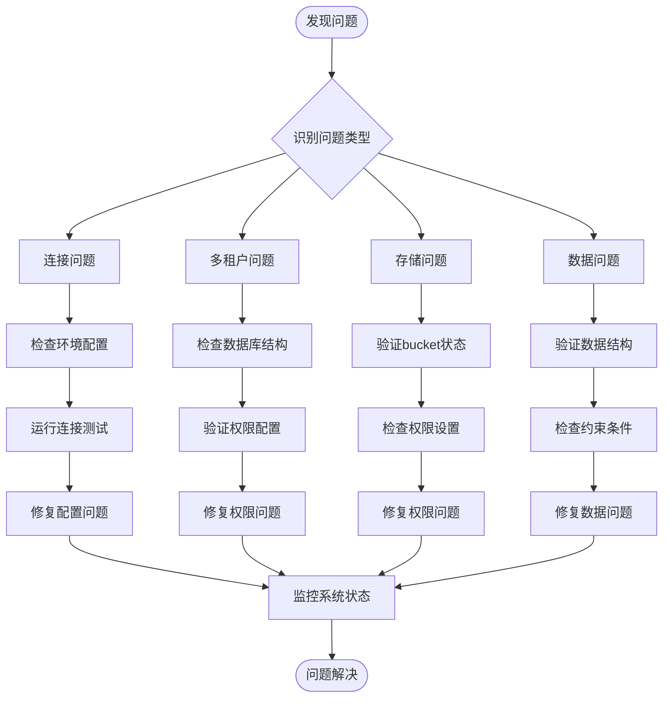

**图表来源**
- [backend/scripts/test_supabase_connection.py](file://backend/scripts/test_supabase_connection.py#L29-L31)
- [backend/scripts/verify_storage.py](file://backend/scripts/verify_storage.py#L14-L35)

**章节来源**
- [backend/scripts/keep_supabase_alive.py](file://backend/scripts/keep_supabase_alive.py#L18-L48)
- [backend/scripts/list_storage_files.py](file://backend/scripts/list_storage_files.py#L14-L52)

### 调试工具

系统提供了多种调试工具来帮助诊断问题：

1. **连接测试**: 验证Supabase连接的可用性
2. **资源检查**: 检查数据库表和存储桶的状态
3. **文件验证**: 验证存储中的文件完整性
4. **保活脚本**: 确保数据库服务保持活跃状态
5. **多租户检查**: 验证数据库结构和权限配置

**章节来源**
- [backend/scripts/check_supabase_resources.py](file://backend/scripts/check_supabase_resources.py#L14-L58)
- [backend/scripts/verify_storage.py](file://backend/scripts/verify_storage.py#L14-L56)

## 结论

Supabase集成为ETSY订单自动化系统提供了强大的数据基础设施。通过引入多租户架构，系统现在能够支持多个商店的独立数据隔离和权限控制，增强了系统的可扩展性和安全性。

### 关键优势

1. **可靠性**: 使用单例模式和连接池管理确保连接稳定性
2. **可扩展性**: 支持水平扩展和分布式部署
3. **安全性**: 内置认证和授权机制，实现严格的多租户隔离
4. **易用性**: 提供直观的API和丰富的工具链
5. **灵活性**: 支持主账号-子账号的灵活权限管理

### 多租户架构优势

1. **数据隔离**: 每个店铺的数据完全独立，互不影响
2. **权限控制**: 精细的权限粒度，支持复杂的权限组合
3. **审计跟踪**: 完整的操作日志，便于合规审计
4. **性能优化**: 针对多租户场景的查询优化
5. **扩展性**: 支持动态添加新店铺和用户

### 最佳实践建议

1. **配置管理**: 使用环境变量管理敏感信息
2. **错误处理**: 实现完善的异常处理和日志记录
3. **性能监控**: 建立性能指标监控体系
4. **备份策略**: 制定定期备份和恢复计划
5. **权限管理**: 定期审查和更新用户权限
6. **安全审计**: 建立完善的安全审计机制

通过遵循这些指导原则，可以确保Supabase集成在生产环境中稳定可靠地运行，为多租户订单自动化系统提供坚实的技术基础。