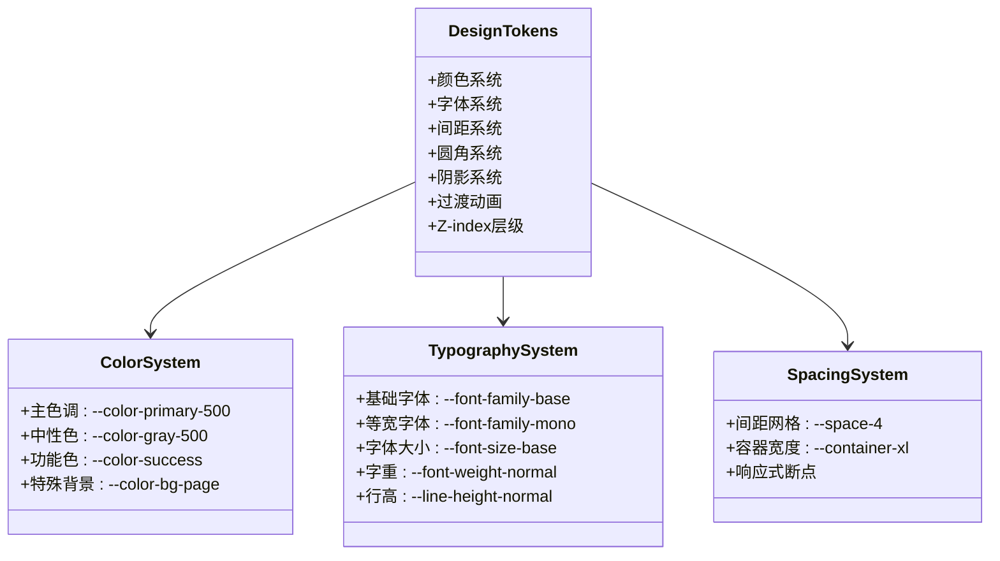
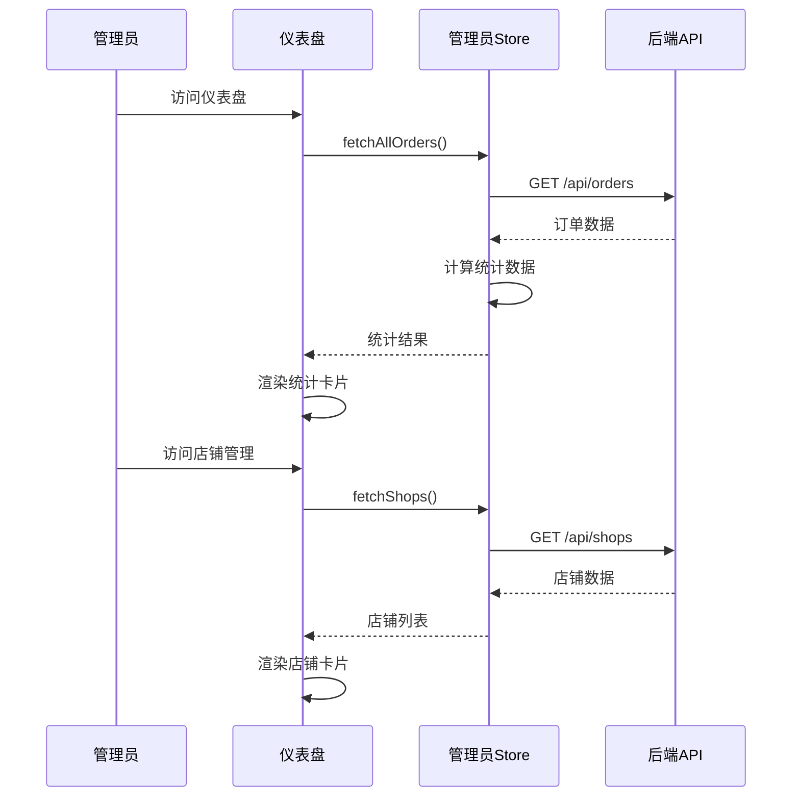
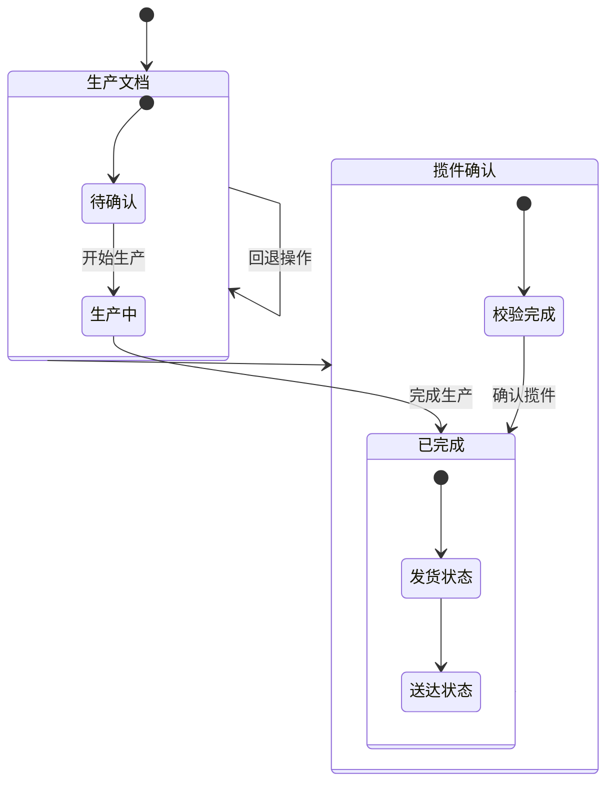
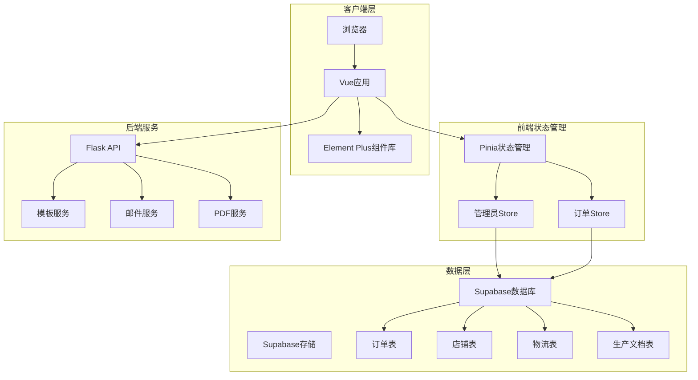
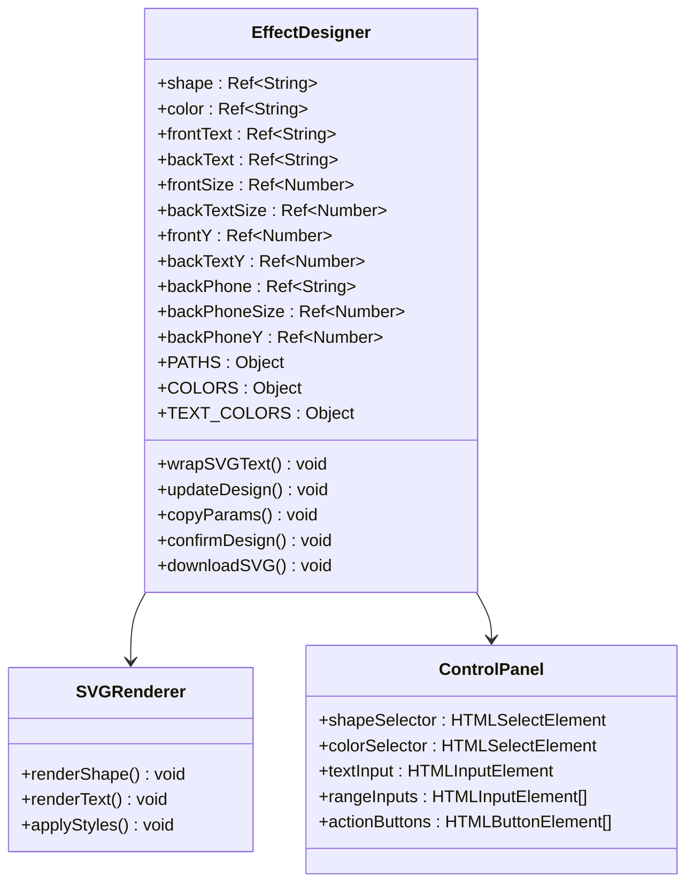
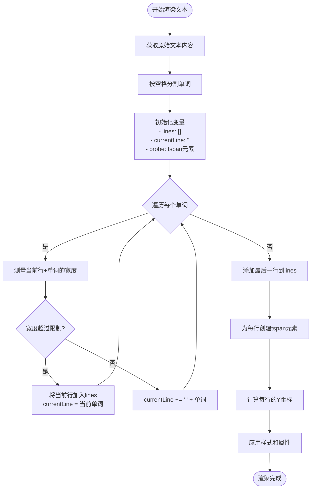
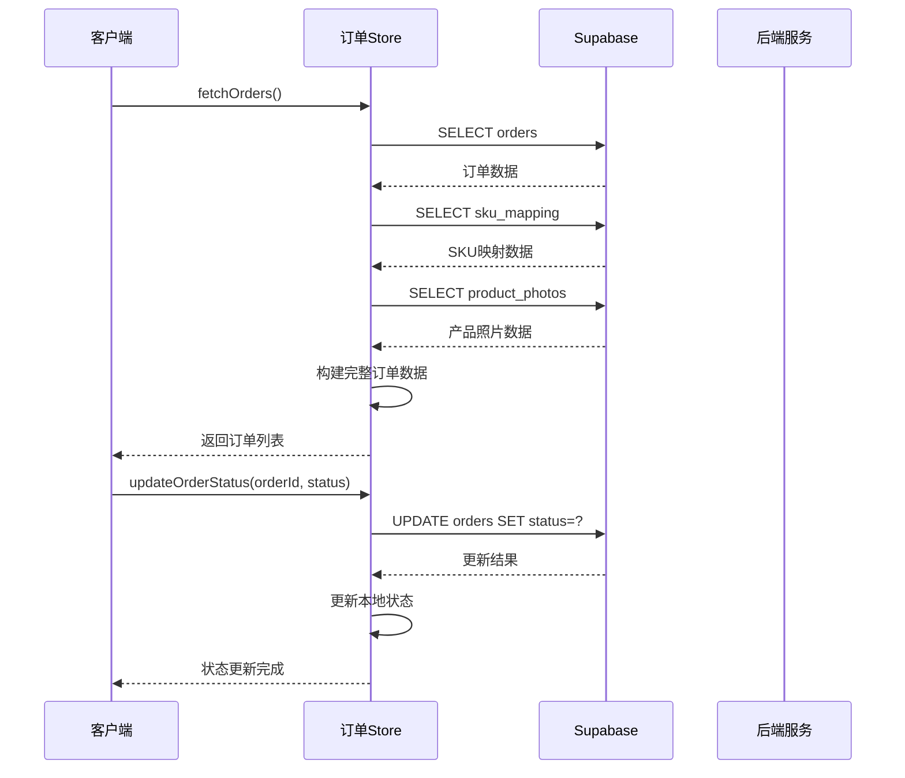
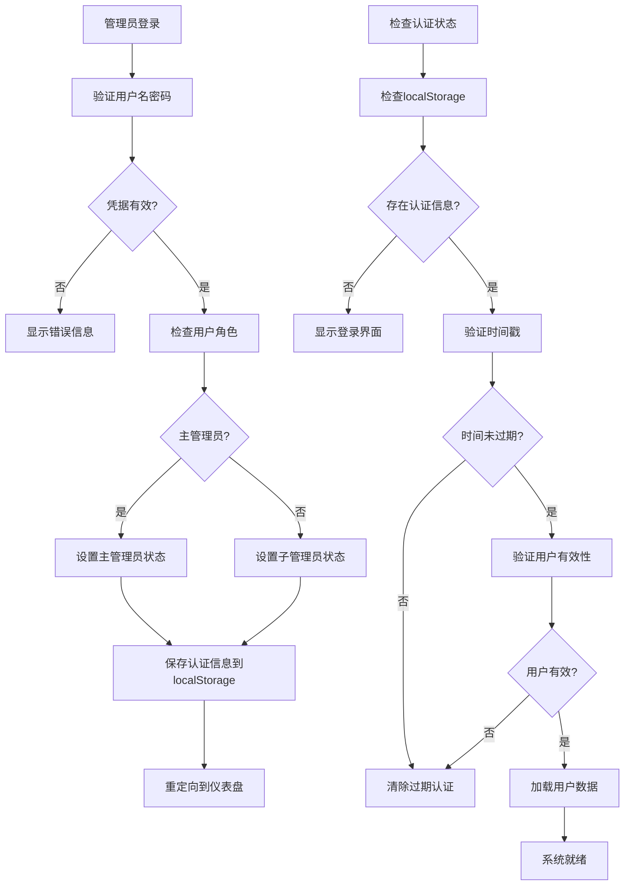
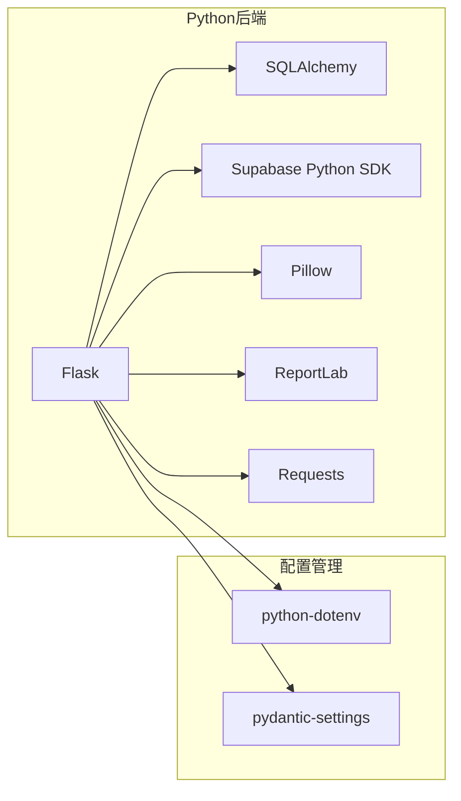

# UI网格设计系统

<cite>
**本文档引用的文件**
- [EffectDesigner.vue](file://frontend/src/components/EffectDesigner.vue)
- [AdminDashboard.vue](file://frontend/src/views/Admin/AdminDashboard.vue)
- [FactoryWorkshop.vue](file://frontend/src/views/FactoryWorkshop/FactoryWorkshop.vue)
- [adminStore.js](file://frontend/src/stores/adminStore.js)
- [orderStore.js](file://frontend/src/stores/orderStore.js)
- [design-tokens.css](file://frontend/src/styles/design-tokens.css)
- [supabase.js](file://frontend/src/utils/supabase.js)
- [order.py](file://backend/src/models/order.py)
- [template_service.py](file://backend/src/services/template_service.py)
- [main.js](file://frontend/src/main.js)
- [package.json](file://frontend/package.json)
- [SKILL.md](file://docs/ui-grid-design-extracted/SKILL.md)
- [MASTER.md](file://frontend/design-system/etsy-order-automation/MASTER.md)
- [order-management.md](file://frontend/design-system/etsy-order-automation/pages/order-management.md)
</cite>

## 目录
1. [简介](#简介)
2. [项目结构](#项目结构)
3. [核心组件](#核心组件)
4. [架构概览](#架构概览)
5. [详细组件分析](#详细组件分析)
6. [依赖分析](#依赖分析)
7. [性能考虑](#性能考虑)
8. [故障排除指南](#故障排除指南)
9. [结论](#结论)

## 简介

UI网格设计系统是一个基于Vue 3和Element Plus构建的企业级订单自动化管理系统。该系统采用统一的设计令牌体系，实现了响应式的网格布局和专业的视觉设计规范。系统主要服务于Etsy订单的全生命周期管理，包括订单处理、效果图生成、生产文档制作和工厂协作等功能。

系统的核心特色包括：
- **统一设计令牌系统**：基于CSS自定义属性的完整设计系统
- **响应式网格布局**：灵活的CSS Grid和Flexbox布局方案
- **组件化设计**：可复用的UI组件和样式规范
- **前后端分离架构**：Vue前端 + Python后端的现代化技术栈
- **数据驱动设计**：基于Supabase的云端数据管理

## 项目结构

```mermaid
graph TB
subgraph "前端应用 (Vue 3)"
FE[frontend/]
FE --> SRC[src/]
FE --> PUBLIC[public/]
FE --> DIST[dist/]
SRC --> COMPONENTS[components/]
SRC --> VIEWS[views/]
SRC --> STORES[stores/]
SRC --> STYLES[styles/]
SRC --> UTILS[utils/]
SRC --> ROUTER[router/]
COMPONENTS --> EFFECT_DESIGNER[EffectDesigner.vue]
VIEWS --> ADMIN_DASHBOARD[AdminDashboard.vue]
VIEWS --> FACTORY_WORKSHOP[FactoryWorkshop.vue]
STORES --> ADMIN_STORE[adminStore.js]
STORES --> ORDER_STORE[orderStore.js]
STYLES --> DESIGN_TOKENS[design-tokens.css]
UTILS --> SUPABASE[supabase.js]
end
subgraph "后端服务 (Python)"
BE[backend/]
BE --> SRC[src/]
BE --> ASSETS[assets/]
BE --> SCRIPTS[scripts/]
SRC --> MODELS[models/]
SRC --> SERVICES[services/]
SRC --> CONFIG[config/]
SRC --> API[api/]
MODELS --> ORDER_PY[order.py]
SERVICES --> TEMPLATE_SERVICE[template_service.py]
CONFIG --> SETTINGS[settings.py]
end
subgraph "文档系统"
DOCS[docs/]
DOCS --> UI_GRID_DOC[ui-grid-design-extracted/]
DOCS --> FRONTEND_BACKEND_API[frontend-backend-api.md]
end
FE < --> BE
FE --> DOCS
```

**图表来源**
- [main.js:1-24](file://frontend/src/main.js#L1-L24)
- [package.json:1-31](file://frontend/package.json#L1-L31)

**章节来源**
- [main.js:1-24](file://frontend/src/main.js#L1-L24)
- [package.json:1-31](file://frontend/package.json#L1-L31)

## 核心组件

### 设计令牌系统

UI网格设计系统的核心是其完整的设计令牌体系，该体系定义了颜色、字体、间距、圆角、阴影等所有视觉属性。



**图表来源**
- [design-tokens.css:13-224](file://frontend/src/styles/design-tokens.css#L13-L224)

### 管理员仪表盘

管理员仪表盘提供了系统的概览和统计数据展示，采用网格布局实现响应式设计。



**图表来源**
- [AdminDashboard.vue:161-177](file://frontend/src/views/Admin/AdminDashboard.vue#L161-L177)
- [adminStore.js:204-230](file://frontend/src/stores/adminStore.js#L204-L230)

### 工厂协作平台

工厂协作平台是系统的核心功能模块，提供了订单处理、生产文档管理和物流协作的完整工作流程。



**图表来源**
- [FactoryWorkshop.vue:569-645](file://frontend/src/views/FactoryWorkshop/FactoryWorkshop.vue#L569-L645)

**章节来源**
- [design-tokens.css:1-499](file://frontend/src/styles/design-tokens.css#L1-L499)
- [AdminDashboard.vue:1-178](file://frontend/src/views/Admin/AdminDashboard.vue#L1-L178)
- [FactoryWorkshop.vue:1-818](file://frontend/src/views/FactoryWorkshop/FactoryWorkshop.vue#L1-L818)

## 架构概览

系统采用前后端分离的微服务架构，前端使用Vue 3 + Pinia + Element Plus，后端使用Python + SQLAlchemy。



**图表来源**
- [main.js:19-21](file://frontend/src/main.js#L19-L21)
- [supabase.js:1-18](file://frontend/src/utils/supabase.js#L1-L18)
- [order.py:23-106](file://backend/src/models/order.py#L23-L106)

## 详细组件分析

### 效果图设计器组件

EffectDesigner组件是系统中最复杂的UI组件之一，实现了SVG图形的实时编辑和预览功能。



**图表来源**
- [EffectDesigner.vue:170-181](file://frontend/src/components/EffectDesigner.vue#L170-L181)
- [EffectDesigner.vue:226-255](file://frontend/src/components/EffectDesigner.vue#L226-L255)

#### SVG文本自动换行算法

组件实现了智能的SVG文本换行功能，能够根据最大宽度自动计算文本行数和位置。



**图表来源**
- [EffectDesigner.vue:183-224](file://frontend/src/components/EffectDesigner.vue#L183-L224)

### 订单状态管理系统

订单状态管理是系统的核心业务逻辑，实现了完整的订单生命周期管理。



**图表来源**
- [orderStore.js:45-113](file://frontend/src/stores/orderStore.js#L45-L113)
- [orderStore.js:234-270](file://frontend/src/stores/orderStore.js#L234-L270)

### 管理员权限控制系统

管理员系统实现了完整的用户认证和权限管理功能。



**图表来源**
- [adminStore.js:17-78](file://frontend/src/stores/adminStore.js#L17-L78)
- [adminStore.js:81-145](file://frontend/src/stores/adminStore.js#L81-L145)

**章节来源**
- [EffectDesigner.vue:1-406](file://frontend/src/components/EffectDesigner.vue#L1-L406)
- [orderStore.js:1-763](file://frontend/src/stores/orderStore.js#L1-L763)
- [adminStore.js:1-359](file://frontend/src/stores/adminStore.js#L1-L359)

## 依赖分析

系统采用了现代化的前端技术栈，具有清晰的依赖关系和模块化结构。

```mermaid
graph TB
subgraph "Vue生态系统"
Vue[Vue 3.5.24]
VueRouter[Vue Router 4.6.4]
Pinia[Pinia 3.0.4]
ElementPlus[Element Plus 2.13.2]
LucideVue[Lucide Vue 0.563.0]
end
subgraph "工具库"
Axios[Axios 1.13.4]
Dayjs[Dayjs 1.11.19]
ElementIcons[@element-plus/icons-vue 2.3.2]
end
subgraph "构建工具"
Vite[Vite 7.2.4]
TailwindCSS[Tailwind CSS 4.2.1]
PostCSS[PostCSS 8.5.8]
Autoprefixer[Autoprefixer 10.4.27]
end
subgraph "数据库集成"
SupabaseJS[@supabase/supabase-js 2.93.3]
end
Vue --> VueRouter
Vue --> Pinia
Vue --> ElementPlus
ElementPlus --> ElementIcons
Vue --> LucideVue
Vue --> Axios
Vue --> Dayjs
Vue --> SupabaseJS
Vite --> Vue
TailwindCSS --> Vue
PostCSS --> TailwindCSS
Autoprefixer --> PostCSS
```

**图表来源**
- [package.json:11-30](file://frontend/package.json#L11-L30)

### 后端依赖关系



**图表来源**
- [settings.py:12-65](file://backend/src/config/settings.py#L12-L65)

**章节来源**
- [package.json:1-31](file://frontend/package.json#L1-L31)
- [settings.py:1-65](file://backend/src/config/settings.py#L1-L65)

## 性能考虑

系统在设计时充分考虑了性能优化，采用了多种策略来提升用户体验：

### 前端性能优化

1. **懒加载和代码分割**：使用Vue Router的异步组件实现路由级别的代码分割
2. **状态缓存**：Pinia Store提供持久化的状态管理，减少重复请求
3. **虚拟滚动**：对于大量订单数据使用虚拟滚动技术
4. **图片优化**：使用WebP格式和适当的尺寸适配
5. **CSS优化**：使用CSS自定义属性减少样式计算开销

### 后端性能优化

1. **数据库查询优化**：使用批量查询和适当的索引
2. **缓存策略**：Redis缓存常用数据
3. **异步处理**：长耗时任务使用Celery异步执行
4. **CDN加速**：静态资源通过CDN分发
5. **连接池管理**：数据库连接池优化

## 故障排除指南

### 常见问题及解决方案

#### Supabase连接问题

**症状**：应用无法连接到数据库
**原因**：环境变量配置错误或网络问题
**解决方案**：
1. 检查`.env`文件中的`SUPABASE_URL`和`SUPABASE_KEY`
2. 确认网络连接正常
3. 验证Supabase项目状态

#### 订单数据加载失败

**症状**：订单列表显示为空或加载缓慢
**原因**：数据库查询超时或权限问题
**解决方案**：
1. 检查数据库连接状态
2. 验证用户权限设置
3. 优化查询条件和索引

#### SVG渲染异常

**症状**：效果图设计器无法正确渲染SVG
**原因**：字体文件加载失败或SVG语法错误
**解决方案**：
1. 检查字体文件路径和可用性
2. 验证SVG代码的语法正确性
3. 确认浏览器兼容性

**章节来源**
- [supabase.js:8-10](file://frontend/src/utils/supabase.js#L8-L10)
- [orderStore.js:106-112](file://frontend/src/stores/orderStore.js#L106-L112)

## 结论

UI网格设计系统是一个功能完整、架构清晰的企业级应用系统。通过统一的设计令牌体系和响应式网格布局，系统实现了专业级的视觉设计和良好的用户体验。

系统的主要优势包括：
- **设计一致性**：完整的Design Token体系确保了视觉风格的一致性
- **模块化架构**：清晰的组件划分和状态管理便于维护和扩展
- **性能优化**：多种性能优化策略提升了用户体验
- **可扩展性**：模块化的架构设计便于功能扩展和业务发展

未来可以考虑的改进方向：
- 增加更多的动画效果和交互反馈
- 实现更完善的权限管理和审计功能
- 优化移动端的用户体验
- 增加更多的报表和数据分析功能