# Vue组件架构

<cite>
**本文档引用的文件**
- [frontend/src/main.js](file://frontend/src/main.js)
- [frontend/src/App.vue](file://frontend/src/App.vue)
- [frontend/package.json](file://frontend/package.json)
- [frontend/vite.config.js](file://frontend/vite.config.js)
- [frontend/src/router/index.js](file://frontend/src/router/index.js)
- [frontend/src/views/Admin/AdminEffects.vue](file://frontend/src/views/Admin/AdminEffects.vue)
- [frontend/src/views/Admin/FactoryOverview.vue](file://frontend/src/views/Admin/FactoryOverview.vue)
- [frontend/src/views/Admin/OrdersCompleted.vue](file://frontend/src/views/Admin/OrdersCompleted.vue)
- [frontend/src/views/Admin/OrdersPending.vue](file://frontend/src/views/Admin/OrdersPending.vue)
- [frontend/src/views/Admin/OrdersProducing.vue](file://frontend/src/views/Admin/OrdersProducing.vue)
- [frontend/src/views/Admin/OrdersShipping.vue](file://frontend/src/views/Admin/OrdersShipping.vue)
- [frontend/src/stores/orderStore.js](file://frontend/src/stores/orderStore.js)
- [frontend/src/stores/adminStore.js](file://frontend/src/stores/adminStore.js)
- [frontend/src/stores/shopStore.js](file://frontend/src/stores/shopStore.js)
- [frontend/src/utils/api.js](file://frontend/src/utils/api.js)
- [frontend/src/utils/supabase.js](file://frontend/src/utils/supabase.js)
- [frontend/src/layouts/AdminLayout.vue](file://frontend/src/layouts/AdminLayout.vue)
- [frontend/src/views/Admin/AdminDashboard.vue](file://frontend/src/views/Admin/AdminDashboard.vue)
- [frontend/src/views/StorePortal/StoreLogin.vue](file://frontend/src/views/StorePortal/StoreLogin.vue)
- [frontend/src/config/email-templates.json](file://frontend/src/config/email-templates.json)
- [frontend/src/components/EffectDesigner.vue](file://frontend/src/components/EffectDesigner.vue)
- [frontend/public/designer-standalone.html](file://frontend/public/designer-standalone.html)
- [backend/scripts/create_standalone_designer_v2.py](file://backend/scripts/create_standalone_designer_v2.py)
- [backend/scripts/validate_svg_fonts.py](file://backend/scripts/validate_svg_fonts.py)
- [backend/src/services/svg_pdf_service.py](file://backend/src/services/svg_pdf_service.py)
- [backend/assets/sku_data/字体特性清单.csv](file://backend/assets/sku_data/字体特性清单.csv)
- [backend/assets/sku_data/不锈钢牌-带路径信息_表格.csv](file://backend/assets/sku_data/不锈钢牌-带路径信息_表格.csv)
- [backend/assets/sku_data/不锈钢牌_SVG对照表.csv](file://backend/assets/sku_data/不锈钢牌_SVG对照表.csv)
</cite>

## 更新摘要
**所做更改**
- OrdersPending.vue组件重大重设计：采用统一两列布局结构，移除特殊布局处理
- 统一左右比例分配和响应式行为，新增邮件工作流程集成
- 新增生产中订单管理组件OrdersProducing.vue，替代原有共享AdminOrders组件
- 在路由系统中新增生产中订单路由配置
- 在管理布局中新增生产中订单导航项
- 完善生产文档生成功能，支持PDF生产文档的查看、下载和打印
- 增强订单状态管理，支持生产中订单的专门处理流程
- 字体管理系统全面增强：opentype.js集成、精确文本向量转换、字体缓存机制
- 独立设计器HTML文件集成完整的字体处理和向量转换功能

## 目录
1. [项目概述](#项目概述)
2. [项目结构](#项目结构)
3. [核心组件](#核心组件)
4. [双门户架构](#双门户架构)
5. [管理界面系统](#管理界面系统)
6. [新增核心组件](#新增核心组件)
7. [字体管理系统](#字体管理系统)
8. [状态管理架构](#状态管理架构)
9. [路由系统](#路由系统)
10. [详细组件分析](#详细组件分析)
11. [依赖关系分析](#依赖关系分析)
12. [性能考虑](#性能考虑)
13. [故障排除指南](#故障排除指南)
14. [结论](#结论)

## 项目概述

这是一个基于Vue 3的订单管理系统前端应用，采用现代化的前端技术栈构建。该系统现已升级为支持双门户架构，包括中央管理门户和多个独立的店铺门户，用于管理Etsy订单的全流程，包括订单状态跟踪、生产进度管理、物流追踪等功能。

### 主要技术栈
- **Vue 3**: 最新版本的Vue.js框架
- **Pinia**: Vue的状态管理库
- **Element Plus**: 基于Vue 3的UI组件库
- **Vue Router**: Vue的官方路由管理器
- **Supabase**: 作为后端服务和数据库
- **Vite**: 现代化的构建工具
- **opentype.js**: 字体处理和文本向量转换库

## 项目结构

前端项目的整体结构采用Vue 3的标准目录组织方式，并新增了双门户架构支持：

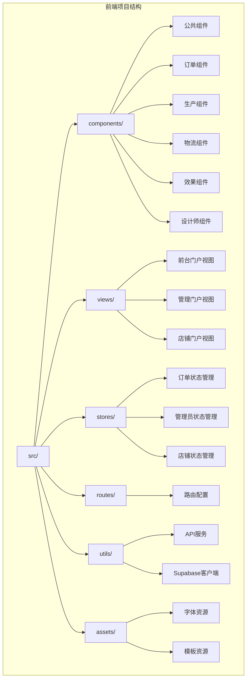
```mermaid
graph TB
subgraph "前端项目结构"
A[src/] --> B[components/]
A --> C[views/]
A --> D[stores/]
A --> E[routes/]
A --> F[utils/]
A --> G[assets/]
B --> B1[公共组件]
B --> B2[订单组件]
B --> B3[生产组件]
B --> B4[物流组件]
B --> B5[效果组件]
B --> B6[设计师组件]
C --> C1[前台门户视图]
C --> C2[管理门户视图]
C --> C3[店铺门户视图]
D --> D1[订单状态管理]
D --> D2[管理员状态管理]
D --> D3[店铺状态管理]
E --> E1[路由配置]
F --> F1[API服务]
F --> F2[Supabase客户端]
G --> G1[字体资源]
G --> G2[模板资源]
end
```

**图表来源**
- [frontend/src/main.js:1-23](file://frontend/src/main.js#L1-L23)
- [frontend/src/router/index.js:1-212](file://frontend/src/router/index.js#L1-L212)

**章节来源**
- [frontend/src/main.js:1-23](file://frontend/src/main.js#L1-L23)
- [frontend/package.json:1-31](file://frontend/package.json#L1-L31)
- [frontend/vite.config.js:1-16](file://frontend/vite.config.js#L1-L16)

## 核心组件

### 应用入口组件

应用的入口点位于`main.js`文件中，负责初始化Vue应用并配置必要的插件。

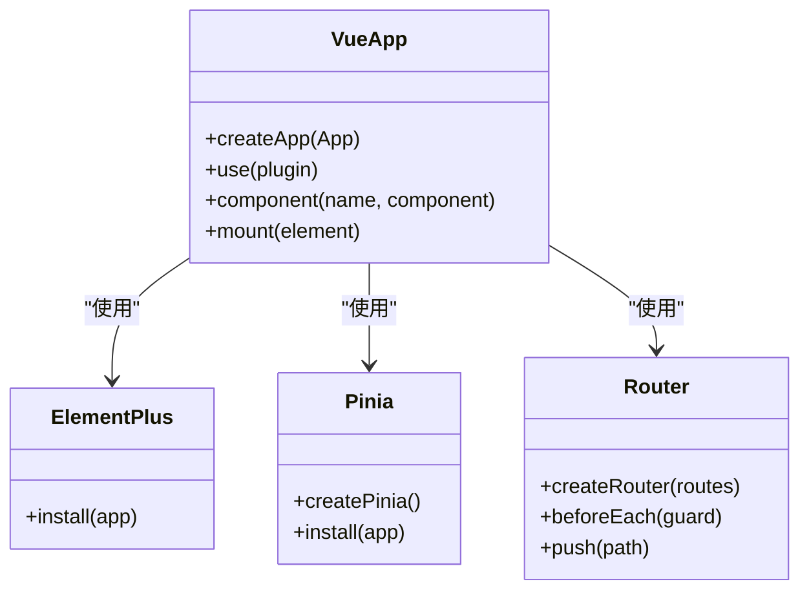
```mermaid
classDiagram
class VueApp {
+createApp(App)
+use(plugin)
+component(name, component)
+mount(element)
}
class ElementPlus {
+install(app)
}
class Pinia {
+createPinia()
+install(app)
}
class Router {
+createRouter(routes)
+beforeEach(guard)
+push(path)
}
VueApp --> ElementPlus : "使用"
VueApp --> Pinia : "使用"
VueApp --> Router : "使用"
```

**图表来源**
- [frontend/src/main.js:1-23](file://frontend/src/main.js#L1-L23)

### 视图组件架构

系统采用基于视图的组件架构，每个页面都是一个独立的Vue组件，现已支持三种门户模式：

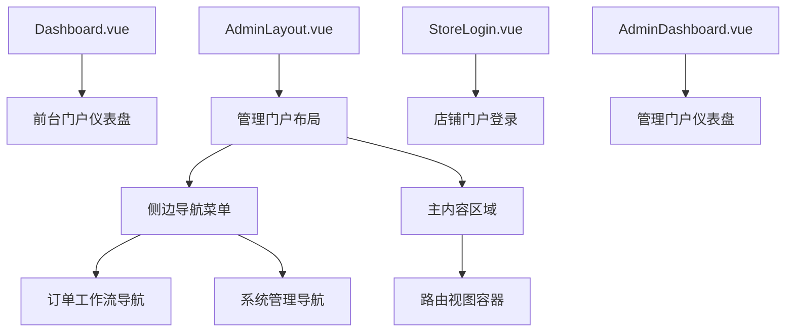
```mermaid
graph TD
A[Dashboard.vue] --> B[前台门户仪表盘]
C[AdminLayout.vue] --> D[管理门户布局]
E[StoreLogin.vue] --> F[店铺门户登录]
G[AdminDashboard.vue] --> H[管理门户仪表盘]
D --> I[侧边导航菜单]
D --> J[主内容区域]
I --> I1[订单工作流导航]
I --> I2[系统管理导航]
J --> K[路由视图容器]
```

**图表来源**
- [frontend/src/views/Admin/AdminDashboard.vue:1-178](file://frontend/src/views/Admin/AdminDashboard.vue#L1-L178)
- [frontend/src/layouts/AdminLayout.vue:1-234](file://frontend/src/layouts/AdminLayout.vue#L1-L234)
- [frontend/src/views/StorePortal/StoreLogin.vue:1-161](file://frontend/src/views/StorePortal/StoreLogin.vue#L1-L161)

**章节来源**
- [frontend/src/App.vue:1-15](file://frontend/src/App.vue#L1-L15)
- [frontend/src/views/Admin/AdminDashboard.vue:1-178](file://frontend/src/views/Admin/AdminDashboard.vue#L1-L178)

## 双门户架构

系统现已支持双门户架构，包括前台门户、管理门户和多个独立的店铺门户：

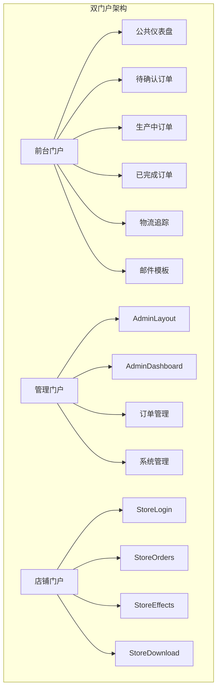
```mermaid
graph TB
subgraph "双门户架构"
A[前台门户] --> A1[公共仪表盘]
A --> A2[待确认订单]
A --> A3[生产中订单]
A --> A4[已完成订单]
A --> A5[物流追踪]
A --> A6[邮件模板]
B[管理门户] --> B1[AdminLayout]
B --> B2[AdminDashboard]
B --> B3[订单管理]
B --> B4[系统管理]
C[店铺门户] --> C1[StoreLogin]
C --> C2[StoreOrders]
C --> C3[StoreEffects]
C --> C4[StoreDownload]
end
```

**图表来源**
- [frontend/src/router/index.js:68-157](file://frontend/src/router/index.js#L68-L157)

### 门户特点对比

| 门户类型 | 访问方式 | 权限控制 | 功能范围 | 用户角色 |
|---------|----------|----------|----------|----------|
| 前台门户 | 公开访问 | 无 | 订单状态查询 | 所有用户 |
| 管理门户 | 管理员登录 | 管理员账户 | 系统管理 | 管理员 |
| 店铺门户 | 店铺密码登录 | 店铺权限 | 店铺订单管理 | 店铺用户 |

**章节来源**
- [frontend/src/router/index.js:68-157](file://frontend/src/router/index.js#L68-L157)

## 管理界面系统

管理门户提供了完整的后台管理系统，包括侧边导航、权限控制和多级菜单：

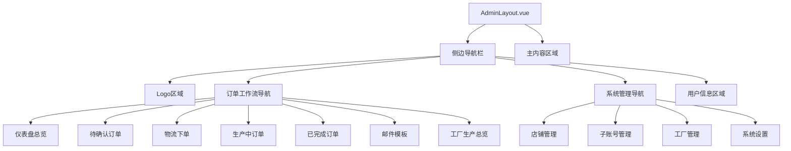
```mermaid
graph TD
A[AdminLayout.vue] --> B[侧边导航栏]
A --> C[主内容区域]
B --> B1[Logo区域]
B --> B2[订单工作流导航]
B --> B3[系统管理导航]
B --> B4[用户信息区域]
B2 --> B2a[仪表盘总览]
B2 --> B2b[待确认订单]
B2 --> B2c[物流下单]
B2 --> B2d[生产中订单]
B2 --> B2e[已完成订单]
B2 --> B2f[邮件模板]
B2 --> B2g[工厂生产总览]
B3 --> B3a[店铺管理]
B3 --> B3b[子账号管理]
B3 --> B3c[工厂管理]
B3 --> B3d[系统设置]
```

**图表来源**
- [frontend/src/layouts/AdminLayout.vue:1-234](file://frontend/src/layouts/AdminLayout.vue#L1-L234)

### 管理员权限体系

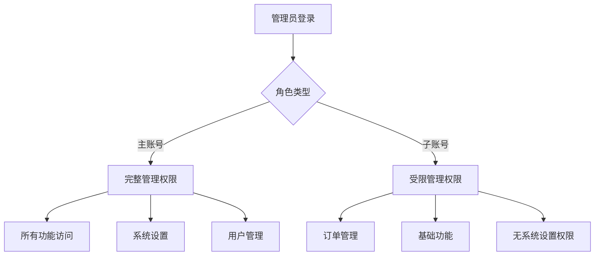
```mermaid
flowchart TD
A[管理员登录] --> B{角色类型}
B --> |主账号| C[完整管理权限]
B --> |子账号| D[受限管理权限]
C --> C1[所有功能访问]
C --> C2[系统设置]
C --> C3[用户管理]
D --> D1[订单管理]
D --> D2[基础功能]
D --> D3[无系统设置权限]
```

**图表来源**
- [frontend/src/layouts/AdminLayout.vue:215-218](file://frontend/src/layouts/AdminLayout.vue#L215-L218)

**章节来源**
- [frontend/src/layouts/AdminLayout.vue:1-234](file://frontend/src/layouts/AdminLayout.vue#L1-L234)
- [frontend/src/views/Admin/AdminDashboard.vue:1-178](file://frontend/src/views/Admin/AdminDashboard.vue#L1-L178)

## 新增核心组件

### 生产中订单管理组件 OrdersProducing.vue

**更新** 新增的OrdersProducing.vue组件专门用于管理生产中的订单，替代了原有的共享AdminOrders组件，提供了更加专业和完整的生产订单管理功能：

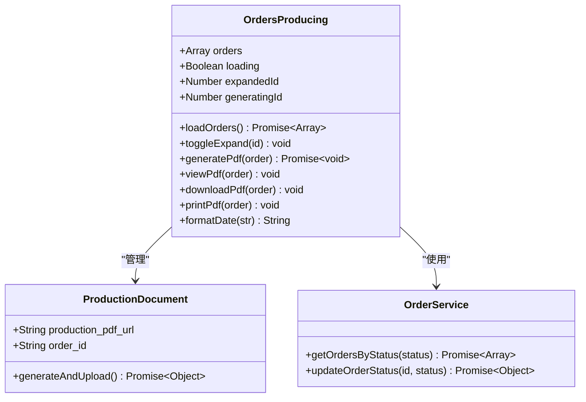
```mermaid
classDiagram
class OrdersProducing {
+Array orders
+Boolean loading
+Number expandedId
+Number generatingId
+loadOrders() Promise~Array~
+toggleExpand(id) void
+generatePdf(order) Promise~void~
+viewPdf(order) void
+downloadPdf(order) void
+printPdf(order) void
+formatDate(str) String
}
class ProductionDocument {
+String production_pdf_url
+String order_id
+generateAndUpload() Promise~Object~
}
class OrderService {
+getOrdersByStatus(status) Promise~Array~
+updateOrderStatus(id, status) Promise~Object~
}
OrdersProducing --> ProductionDocument : "管理"
OrdersProducing --> OrderService : "使用"
```

**图表来源**
- [frontend/src/views/Admin/OrdersProducing.vue:157-243](file://frontend/src/views/Admin/OrdersProducing.vue#L157-L243)

**更新** OrdersProducing.vue组件的主要功能包括：

1. **专门的生产订单管理**：专注于状态为"producing"的订单
2. **生产文档管理**：支持生产文档的生成、查看、下载和打印
3. **展开详情视图**：支持点击订单行展开详细信息面板
4. **批量操作支持**：支持单个订单的PDF生成和管理
5. **实时状态更新**：生成PDF后自动更新订单状态和显示URL
6. **友好的用户界面**：提供清晰的订单信息展示和操作按钮

### 物流下单组件 OrdersShipping.vue

**更新** 物流下单组件提供了完整的4PX物流渠道集成，支持订单选择、物流信息填写和运单创建功能：

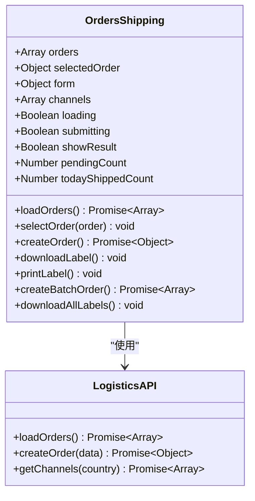
```mermaid
classDiagram
class OrdersShipping {
+Array orders
+Object selectedOrder
+Object form
+Array channels
+Boolean loading
+Boolean submitting
+Boolean showResult
+Number pendingCount
+Number todayShippedCount
+loadOrders() Promise~Array~
+selectOrder(order) void
+createOrder() Promise~Object~
+downloadLabel() void
+printLabel() void
+createBatchOrder() Promise~Array~
+downloadAllLabels() void
}
class LogisticsAPI {
+loadOrders() Promise~Array~
+createOrder(data) Promise~Object~
+getChannels(country) Promise~Array~
}
OrdersShipping --> LogisticsAPI : "使用"
```

**图表来源**
- [frontend/src/views/Admin/OrdersShipping.vue:378-674](file://frontend/src/views/Admin/OrdersShipping.vue#L378-L674)

**更新** 物流下单组件实现了全新的批量工作流程，包括：

1. **批量订单选择**：支持多选订单进行批量处理
2. **批量下单功能**：支持一次性创建多个物流订单
3. **批量结果展示**：实时显示批量操作的成功和失败状态
4. **批量面单下载**：支持批量下载所有成功订单的面单
5. **演示模式**：无订单时提供演示数据支持

### 工厂生产总览组件 FactoryOverview.vue

工厂生产总览组件提供了实时的工厂生产监控和统计功能：

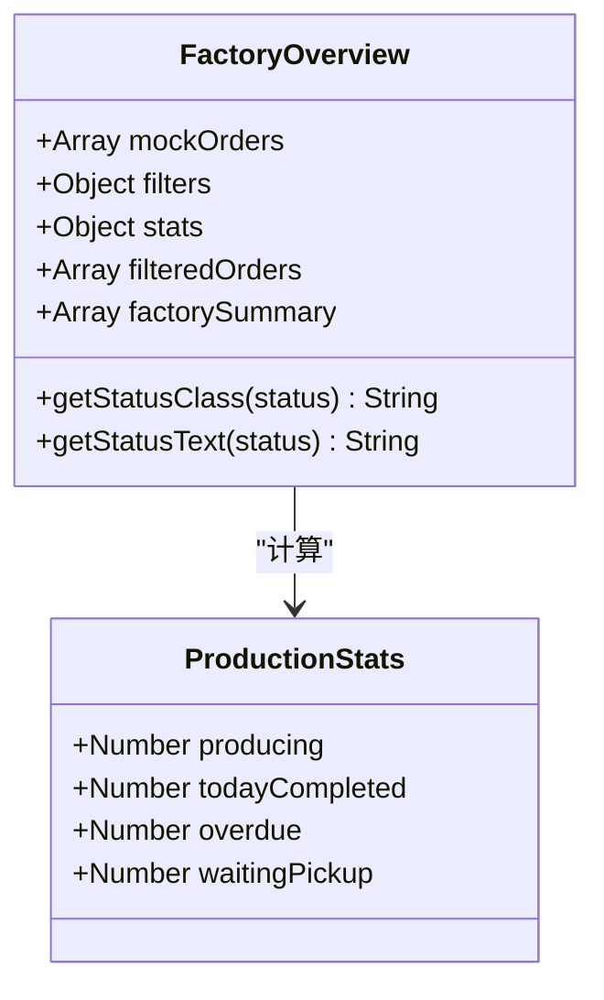
```mermaid
classDiagram
class FactoryOverview {
+Array mockOrders
+Object filters
+Object stats
+Array filteredOrders
+Array factorySummary
+getStatusClass(status) String
+getStatusText(status) String
}
class ProductionStats {
+Number producing
+Number todayCompleted
+Number overdue
+Number waitingPickup
}
FactoryOverview --> ProductionStats : "计算"
```

**图表来源**
- [frontend/src/views/Admin/FactoryOverview.vue:206-279](file://frontend/src/views/Admin/FactoryOverview.vue#L206-L279)

### 已完成订单组件 OrdersCompleted.vue

已完成订单组件提供了订单管理、物流追踪和邮件发送功能：

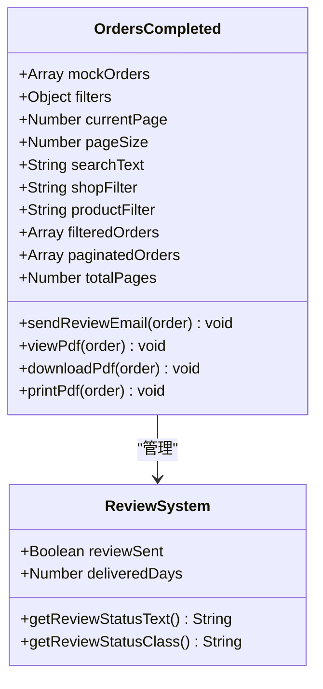
```mermaid
classDiagram
class OrdersCompleted {
+Array mockOrders
+Object filters
+Number currentPage
+Number pageSize
+String searchText
+String shopFilter
+String productFilter
+Array filteredOrders
+Array paginatedOrders
+Number totalPages
+sendReviewEmail(order) void
+viewPdf(order) void
+downloadPdf(order) void
+printPdf(order) void
}
class ReviewSystem {
+Boolean reviewSent
+Number deliveredDays
+getReviewStatusText() String
+getReviewStatusClass() String
}
OrdersCompleted --> ReviewSystem : "管理"
```

**图表来源**
- [frontend/src/views/Admin/OrdersCompleted.vue:253-415](file://frontend/src/views/Admin/OrdersCompleted.vue#L253-L415)

### 待确认订单组件 OrdersPending.vue

**更新** OrdersPending.vue组件经过重大重设计，采用统一的两列布局结构，移除了针对待创建标签页的特殊布局处理，统一了左右比例分配和响应式行为：

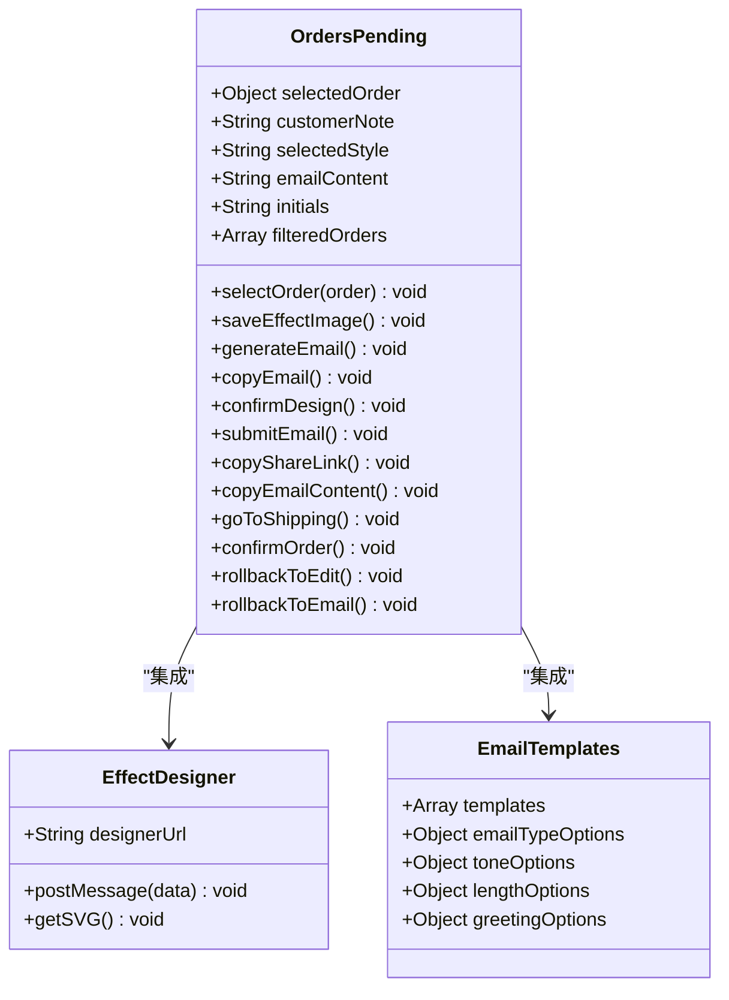
```mermaid
classDiagram
class OrdersPending {
+Object selectedOrder
+String customerNote
+String selectedStyle
+String emailContent
+String initials
+Array filteredOrders
+selectOrder(order) void
+saveEffectImage() void
+generateEmail() void
+copyEmail() void
+confirmDesign() void
+submitEmail() void
+copyShareLink() void
+copyEmailContent() void
+goToShipping() void
+confirmOrder() void
+rollbackToEdit() void
+rollbackToEmail() void
}
class EffectDesigner {
+String designerUrl
+postMessage(data) void
+getSVG() void
}
class EmailTemplates {
+Array templates
+Object emailTypeOptions
+Object toneOptions
+Object lengthOptions
+Object greetingOptions
}
OrdersPending --> EffectDesigner : "集成"
OrdersPending --> EmailTemplates : "集成"
```

**图表来源**
- [frontend/src/views/Admin/OrdersPending.vue:194-350](file://frontend/src/views/Admin/OrdersPending.vue#L194-L350)

**更新** OrdersPending.vue采用了创新的统一两列布局设计：

#### 统一两列布局结构

1. **左侧主区域**：订单列表 + 设计器/邮件撰写区域（flex-1）
2. **右侧订单详情**：固定宽度320px的侧边面板

#### 左侧区域统一处理

左侧区域不再区分不同标签页的特殊布局，而是：
- **新订单标签页**：显示效果图设计器（iframe）
- **邮件撰写标签页**：显示邮件撰写区域（中英文对照编辑器）
- **待创建标签页**：显示效果图预览和邮件预览并排布局

#### 右侧区域统一设计

右侧区域包含：
- **订单详情**：产品图片、订单信息、正背面内容
- **发送面板**：根据当前标签页显示不同的操作面板
  - 邮件撰写标签页：效果图预览 + 确认邮件预览
  - 待创建标签页：邮件预览 + 发送给客户操作面板

#### 响应式行为统一

组件实现了统一的响应式行为：
- 左右两列布局在所有标签页中保持一致
- 固定宽度的右侧面板确保操作区域的一致性
- 统一的比例分配提升了用户体验的连贯性

#### 邮件工作流程集成

组件集成了完整的邮件工作流程：
- **邮件模板系统**：支持多种邮件类型和风格
- **翻译功能**：中英文自动翻译
- **样式设置**：语气、长度、称呼、落款人
- **预览功能**：实时预览邮件效果
- **发送功能**：保存邮件记录并更新订单状态

#### 新增功能特性

1. **邮件模板系统**：支持首封确认、修改确认、追评邮件等多种模板
2. **邮件风格控制**：支持正式、随和、活泼三种语气
3. **邮件长度控制**：支持简短、标准、详细三种长度
4. **邮件设置保存**：支持本地存储邮件设置
5. **订单状态回退**：支持回退到编辑或邮件撰写状态
6. **批量操作支持**：支持一键跳转到物流下单页面

**章节来源**
- [frontend/src/views/Admin/OrdersPending.vue:1-1129](file://frontend/src/views/Admin/OrdersPending.vue#L1-L1129)
- [frontend/src/config/email-templates.json:1-374](file://frontend/src/config/email-templates.json#L1-L374)

### 邮件模板组件 AdminEffects.vue

**更新** 邮件模板组件经过重大重构，提供了统一的邮件模板管理和订单联动功能：

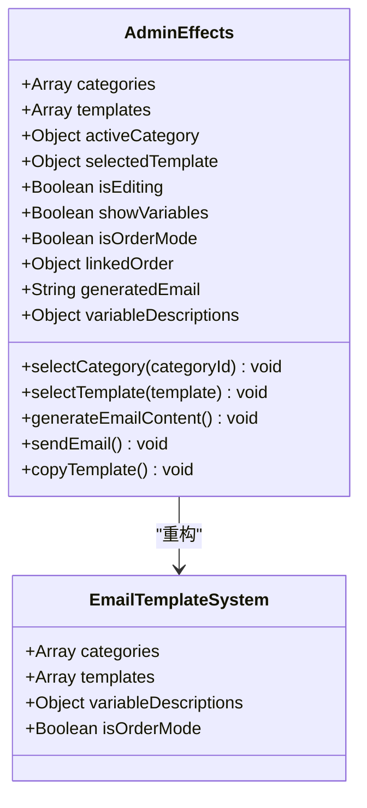
```mermaid
classDiagram
class AdminEffects {
+Array categories
+Array templates
+Object activeCategory
+Object selectedTemplate
+Boolean isEditing
+Boolean showVariables
+Boolean isOrderMode
+Object linkedOrder
+String generatedEmail
+Object variableDescriptions
+selectCategory(categoryId) void
+selectTemplate(template) void
+generateEmailContent() void
+sendEmail() void
+copyTemplate() void
}
class EmailTemplateSystem {
+Array categories
+Array templates
+Object variableDescriptions
+Boolean isOrderMode
}
AdminEffects --> EmailTemplateSystem : "重构"
```

**图表来源**
- [frontend/src/views/Admin/AdminEffects.vue:198-434](file://frontend/src/views/Admin/AdminEffects.vue#L198-L434)

**更新** 邮件模板系统现在包含：

1. **模板分类管理**：支持首封确认、修改确认、追评邮件三大类别
2. **模板变体支持**：每种模板支持正式、随和、活泼三种语气
3. **模板长度变体**：支持简短、标准、详细三种长度
4. **模板变量系统**：支持客户名、订单号、效果图链接、截止时间等变量
5. **模板预览功能**：实时预览邮件效果
6. **模板保存功能**：支持保存模板到本地存储

**章节来源**
- [frontend/src/views/Admin/OrdersShipping.vue:1-917](file://frontend/src/views/Admin/OrdersShipping.vue#L1-L917)
- [frontend/src/views/Admin/FactoryOverview.vue:1-279](file://frontend/src/views/Admin/FactoryOverview.vue#L1-L279)
- [frontend/src/views/Admin/OrdersCompleted.vue:1-463](file://frontend/src/views/Admin/OrdersCompleted.vue#L1-L463)
- [frontend/src/views/Admin/OrdersPending.vue:1-1129](file://frontend/src/views/Admin/OrdersPending.vue#L1-L1129)
- [frontend/src/views/Admin/AdminEffects.vue:1-434](file://frontend/src/views/Admin/AdminEffects.vue#L1-L434)

## 字体管理系统

**更新** 系统现在包含完整的字体管理系统，支持多种字体格式和精确的文本向量转换：

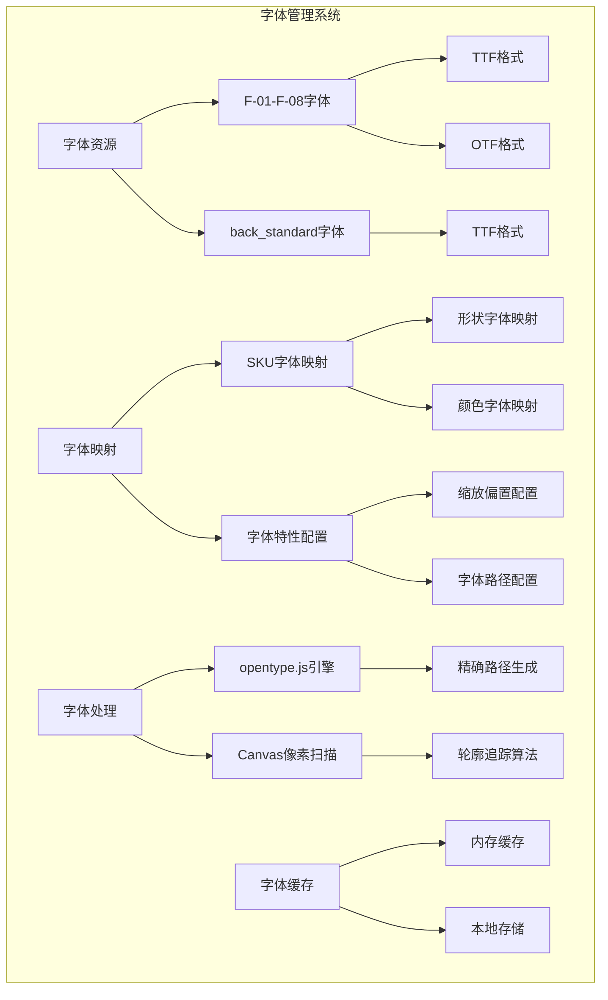
```mermaid
graph TB
subgraph "字体管理系统"
A[字体资源] --> B[F-01-F-08字体]
A --> C[back_standard字体]
B --> B1[TTF格式]
B --> B2[OTF格式]
C --> C1[TTF格式]
D[字体映射] --> E[SKU字体映射]
D --> F[字体特性配置]
E --> E1[形状字体映射]
E --> E2[颜色字体映射]
F --> F1[缩放偏置配置]
F --> F2[字体路径配置]
G[字体处理] --> H[opentype.js引擎]
G --> I[Canvas像素扫描]
H --> H1[精确路径生成]
I --> I1[轮廓追踪算法]
J[字体缓存] --> K[内存缓存]
J --> L[本地存储]
end
```

**图表来源**
- [backend/assets/sku_data/字体特性清单.csv:1-11](file://backend/assets/sku_data/字体特性清单.csv#L1-L11)
- [backend/src/services/svg_pdf_service.py:238-258](file://backend/src/services/svg_pdf_service.py#L238-L258)

### 字体特性配置

**更新** 字体特性清单提供了详细的字体配置信息：

| 字体ID | 文件名 | 用途 | 缩放偏置 | 存放路径 |
|--------|--------|------|----------|----------|
| back_standard | back_standard.ttf | 背面默认字体（电话/地址） | 1.0（标准） | \fonts\back_standard.ttf |
| F-01 | F-01.ttf | 正面名字：风格A | 1 | \fonts\F-01.ttf |
| F-02 | F-02.ttf | 正面名字：风格B | 1 | \fonts\F-02.ttf |
| F-03 | F-03.ttf | 正面名字：风格C | 0.95（较宽） | \fonts\F-03.ttf |
| F-04 | F-04.ttf | 正面名字：风格D | 1.05（较细） | \fonts\F-04.ttf |
| F-05 | F-05.ttf | 正面名字：风格E | 1.10（艺术体） | \fonts\F-05.ttf |
| F-06 | F-06.ttf | 正面名字：风格F | 1 | \fonts\F-06.ttf |
| F-07 | F-07.ttf | 正面名字：风格G | 0.90（紧凑） | \fonts\F-07.ttf |
| F-08 | F-08.ttf | 正面名字：风格H | 1 | \fonts\F-08.ttf |

### SKU字体映射系统

**更新** SKU字体映射系统实现了复杂的字体选择逻辑：

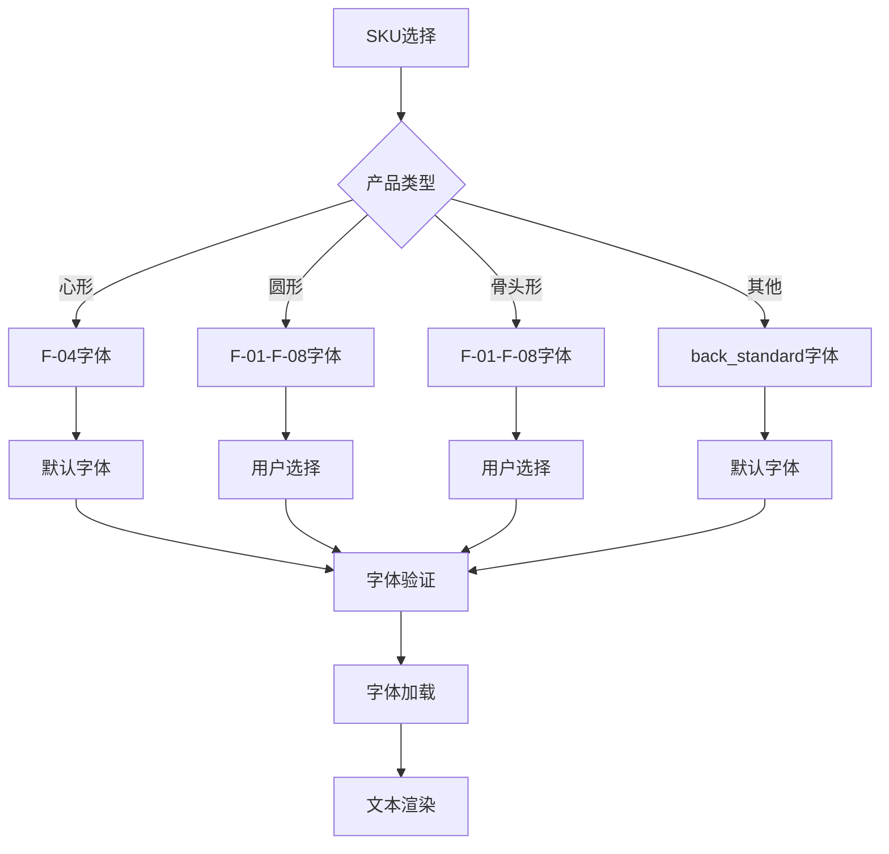
```mermaid
flowchart TD
A[SKU选择] --> B{产品类型}
B --> |心形| C[F-04字体]
B --> |圆形| D[F-01-F-08字体]
B --> |骨头形| E[F-01-F-08字体]
B --> |其他| F[back_standard字体]
C --> G[默认字体]
D --> H[用户选择]
E --> I[用户选择]
F --> J[默认字体]
G --> K[字体验证]
H --> K
I --> K
J --> K
K --> L[字体加载]
L --> M[文本渲染]
```

**图表来源**
- [backend/src/services/svg_pdf_service.py:238-243](file://backend/src/services/svg_pdf_service.py#L238-L243)

**更新** 字体映射规则：
1. **心形产品**：默认使用F-04字体
2. **圆形/骨头形产品**：支持F-01到F-08的所有字体
3. **其他产品**：使用back_standard字体
4. **字体注册**：系统自动注册可用字体到PDF渲染引擎

### 字体处理流程

**更新** 字体处理流程现在包含精确的文本向量转换：

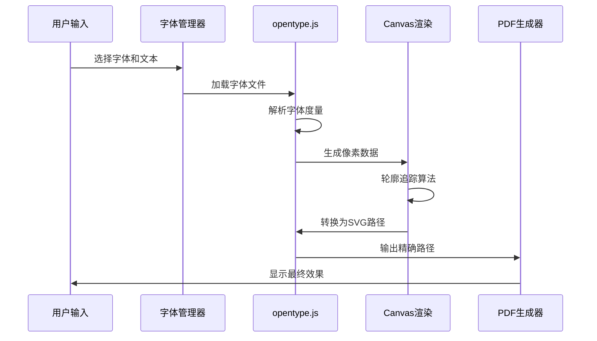
```mermaid
sequenceDiagram
participant User as 用户输入
participant FontManager as 字体管理器
participant OpenType as opentype.js
participant Canvas as Canvas渲染
participant PDF as PDF生成器
User->>FontManager : 选择字体和文本
FontManager->>OpenType : 加载字体文件
OpenType->>OpenType : 解析字体度量
OpenType->>Canvas : 生成像素数据
Canvas->>Canvas : 轮廓追踪算法
Canvas->>OpenType : 转换为SVG路径
OpenType->>PDF : 输出精确路径
PDF->>User : 显示最终效果
```

**图表来源**
- [frontend/public/designer-standalone.html:804-828](file://frontend/public/designer-standalone.html#L804-L828)
- [backend/scripts/create_standalone_designer_v2.py:556-611](file://backend/scripts/create_standalone_designer_v2.py#L556-L611)

**更新** 字体处理的关键步骤：
1. **字体加载**：使用opentype.js加载字体文件
2. **度量解析**：获取字体的unitsPerEm、ascender、descender等度量信息
3. **路径生成**：使用getPath()方法生成SVG路径数据
4. **精确转换**：确保100%精确的文本向量转换
5. **缓存优化**：避免重复加载相同字体

**章节来源**
- [backend/assets/sku_data/字体特性清单.csv:1-11](file://backend/assets/sku_data/字体特性清单.csv#L1-L11)
- [backend/src/services/svg_pdf_service.py:238-258](file://backend/src/services/svg_pdf_service.py#L238-L258)
- [frontend/public/designer-standalone.html:530-562](file://frontend/public/designer-standalone.html#L530-L562)

## 状态管理架构

**更新** 系统现包含三个专用的状态管理store，分别服务于不同的门户，其中订单状态管理store增强了生产文档同步功能：

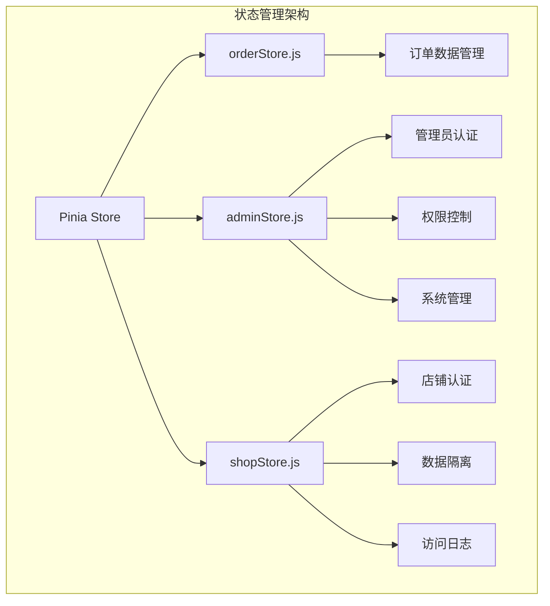
```mermaid
graph TB
subgraph "状态管理架构"
A[Pinia Store] --> B[orderStore.js]
A --> C[adminStore.js]
A --> D[shopStore.js]
B --> B1[订单数据管理]
C --> C1[管理员认证]
C --> C2[权限控制]
C --> C3[系统管理]
D --> D1[店铺认证]
D --> D2[数据隔离]
D --> D3[访问日志]
end
```

**图表来源**
- [frontend/src/stores/orderStore.js:1-746](file://frontend/src/stores/orderStore.js#L1-L746)
- [frontend/src/stores/adminStore.js:1-321](file://frontend/src/stores/adminStore.js#L1-L321)
- [frontend/src/stores/shopStore.js:1-190](file://frontend/src/stores/shopStore.js#L1-L190)

### 订单状态管理增强

**更新** 订单状态管理store的saveEffectImage方法增加了对production_documents表的同步处理：

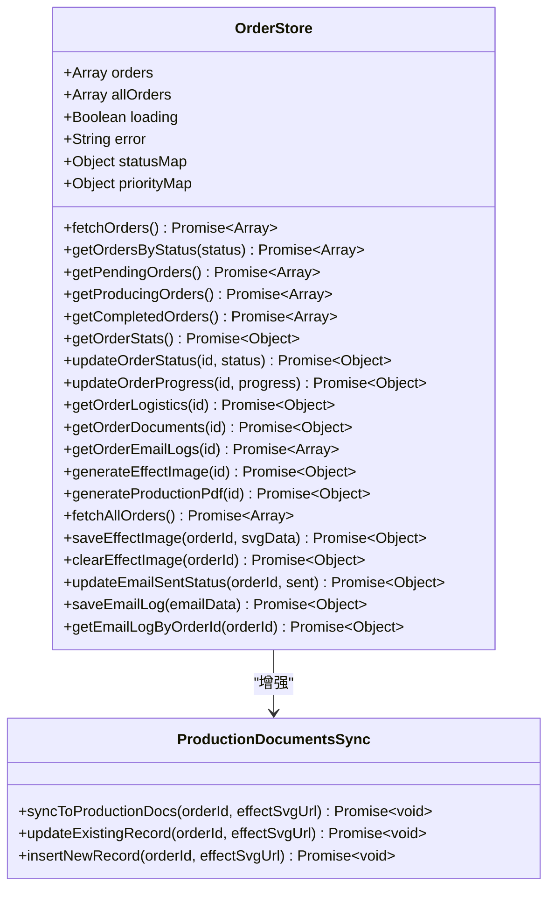
```mermaid
classDiagram
class OrderStore {
+Array orders
+Array allOrders
+Boolean loading
+String error
+Object statusMap
+Object priorityMap
+fetchOrders() Promise~Array~
+getOrdersByStatus(status) Promise~Array~
+getPendingOrders() Promise~Array~
+getProducingOrders() Promise~Array~
+getCompletedOrders() Promise~Array~
+getOrderStats() Promise~Object~
+updateOrderStatus(id, status) Promise~Object~
+updateOrderProgress(id, progress) Promise~Object~
+getOrderLogistics(id) Promise~Object~
+getOrderDocuments(id) Promise~Object~
+getOrderEmailLogs(id) Promise~Array~
+generateEffectImage(id) Promise~Object~
+generateProductionPdf(id) Promise~Object~
+fetchAllOrders() Promise~Array~
+saveEffectImage(orderId, svgData) Promise~Object~
+clearEffectImage(orderId) Promise~Object~
+updateEmailSentStatus(orderId, sent) Promise~Object~
+saveEmailLog(emailData) Promise~Object~
+getEmailLogByOrderId(orderId) Promise~Object~
}
class ProductionDocumentsSync {
+syncToProductionDocs(orderId, effectSvgUrl) Promise~void~
+updateExistingRecord(orderId, effectSvgUrl) Promise~void~
+insertNewRecord(orderId, effectSvgUrl) Promise~void~
}
OrderStore --> ProductionDocumentsSync : "增强"
```

**图表来源**
- [frontend/src/stores/orderStore.js:496-592](file://frontend/src/stores/orderStore.js#L496-L592)

**更新** 订单状态管理store现在包含以下增强功能：

1. **生产文档同步**：saveEffectImage方法自动同步到production_documents表
2. **邮件状态管理**：updateEmailSentStatus方法管理邮件发送状态
3. **邮件日志记录**：saveEmailLog方法保存邮件发送记录
4. **订单状态回退**：clearEffectImage方法支持回退到编辑状态

### 管理员状态管理

管理员store提供了完整的认证和权限管理功能：

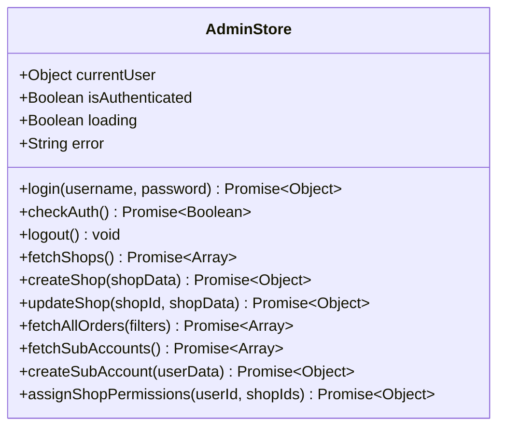
```mermaid
classDiagram
class AdminStore {
+Object currentUser
+Boolean isAuthenticated
+Boolean loading
+String error
+login(username, password) Promise~Object~
+checkAuth() Promise~Boolean~
+logout() void
+fetchShops() Promise~Array~
+createShop(shopData) Promise~Object~
+updateShop(shopId, shopData) Promise~Object~
+fetchAllOrders(filters) Promise~Array~
+fetchSubAccounts() Promise~Array~
+createSubAccount(userData) Promise~Object~
+assignShopPermissions(userId, shopIds) Promise~Object~
}
```

**图表来源**
- [frontend/src/stores/adminStore.js:9-321](file://frontend/src/stores/adminStore.js#L9-L321)

### 店铺状态管理

店铺store实现了独立的数据隔离和权限控制：

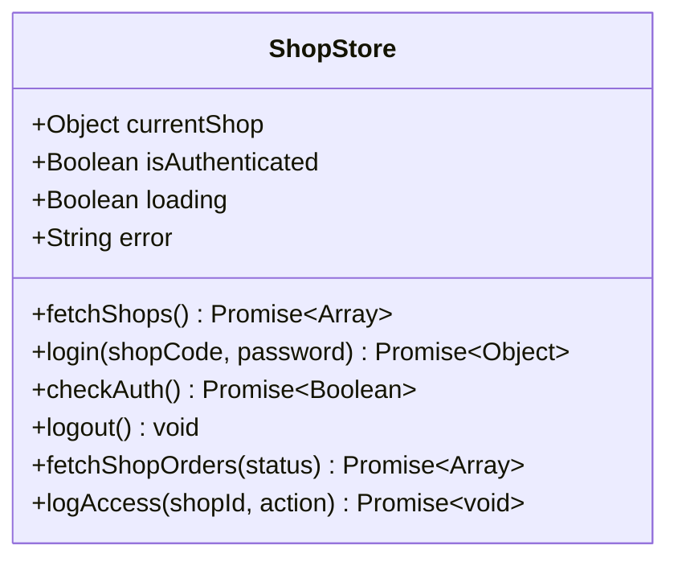
```mermaid
classDiagram
class ShopStore {
+Object currentShop
+Boolean isAuthenticated
+Boolean loading
+String error
+fetchShops() Promise~Array~
+login(shopCode, password) Promise~Object~
+checkAuth() Promise~Boolean~
+logout() void
+fetchShopOrders(status) Promise~Array~
+logAccess(shopId, action) Promise~void~
}
```

**图表来源**
- [frontend/src/stores/shopStore.js:9-190](file://frontend/src/stores/shopStore.js#L9-L190)

**章节来源**
- [frontend/src/stores/adminStore.js:1-321](file://frontend/src/stores/adminStore.js#L1-L321)
- [frontend/src/stores/shopStore.js:1-190](file://frontend/src/stores/shopStore.js#L1-L190)

## 路由系统

系统路由已完全重构以支持双门户架构，包括导航守卫和权限控制：

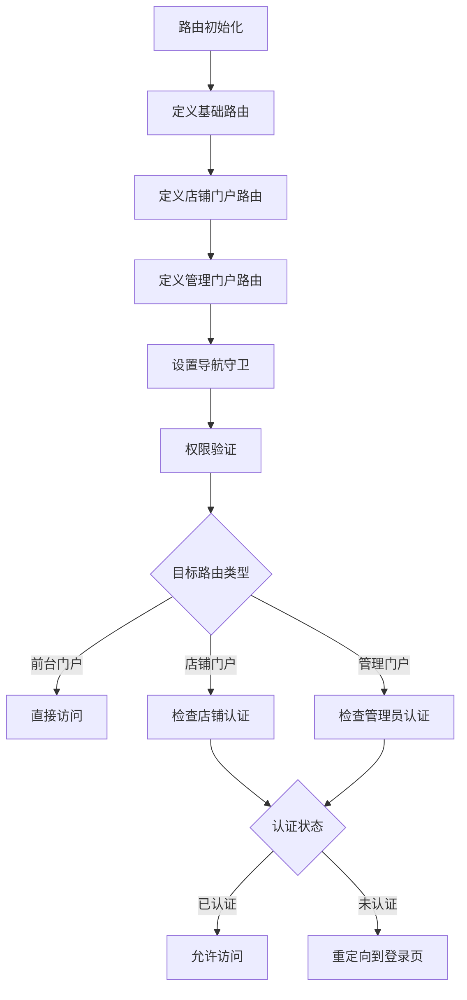
```mermaid
flowchart TD
A[路由初始化] --> B[定义基础路由]
B --> C[定义店铺门户路由]
C --> D[定义管理门户路由]
D --> E[设置导航守卫]
E --> F[权限验证]
F --> G{目标路由类型}
G --> |前台门户| H[直接访问]
G --> |店铺门户| I[检查店铺认证]
G --> |管理门户| J[检查管理员认证]
I --> K{认证状态}
J --> K
K --> |已认证| L[允许访问]
K --> |未认证| M[重定向到登录页]
```

**图表来源**
- [frontend/src/router/index.js:165-209](file://frontend/src/router/index.js#L165-L209)

### 路由配置结构

```mermaid
graph TB
A[routes] --> B[前台门户路由]
A --> C[店铺门户路由]
A --> D[管理门户路由]
B --> B1[/ - 仪表盘总览]
B --> B2[/pending - 待确认订单]
B --> B3[/production - 生产中订单]
B --> B4[/completed - 已完成订单]
C --> C1[/store/login - 店铺登录]
C --> C2[/store/:shopCode/orders - 店铺订单]
C --> C3[/store/:shopCode/effects - 效果图管理]
D --> D1[/admin/login - 管理员登录]
D --> D2[/admin/dashboard - 管理仪表盘]
D --> D3[/admin/shops - 店铺管理]
D --> D4[/admin/orders/pending - 待确认订单]
D --> D5[/admin/orders/shipping - 物流下单]
D --> D6[/admin/orders/completed - 已完成订单]
D --> D7[/admin/factory-overview - 工厂生产总览]
D --> D8[/admin/templates - 邮件模板]
D --> D9[/admin/orders/producing - 生产中订单]
```

**图表来源**
- [frontend/src/router/index.js:5-157](file://frontend/src/router/index.js#L5-L157)

**更新** 路由系统现在包含专门的生产中订单路由配置：

1. **新增生产中订单路由**：`/admin/orders/producing` 专门用于OrdersProducing.vue组件
2. **路由重定向**：原有的`/admin/orders`路由重定向到待确认订单页面
3. **统一的订单工作流**：7个核心订单工作流导航项，包括生产中订单管理

**章节来源**
- [frontend/src/router/index.js:1-212](file://frontend/src/router/index.js#L1-L212)

## 详细组件分析

### 订单状态管理Store

**更新** 订单状态管理是整个系统的核心，使用Pinia进行状态管理，增强了生产文档同步功能：

```mermaid
classDiagram
class OrderStore {
+Array orders
+Array allOrders
+Boolean loading
+String error
+Object statusMap
+Object priorityMap
+fetchOrders() Promise~Array~
+getOrdersByStatus(status) Promise~Array~
+getPendingOrders() Promise~Array~
+getProducingOrders() Promise~Array~
+getCompletedOrders() Promise~Array~
+getOrderStats() Promise~Object~
+updateOrderStatus(id, status) Promise~Object~
+updateOrderProgress(id, progress) Promise~Object~
+getOrderLogistics(id) Promise~Object~
+getOrderDocuments(id) Promise~Object~
+getOrderEmailLogs(id) Promise~Array~
+generateEffectImage(id) Promise~Object~
+generateProductionPdf(id) Promise~Object~
+fetchAllOrders() Promise~Array~
+saveEffectImage(orderId, svgData) Promise~Object~
+clearEffectImage(orderId) Promise~Object~
+updateEmailSentStatus(orderId, sent) Promise~Object~
+saveEmailLog(emailData) Promise~Object~
+getEmailLogByOrderId(orderId) Promise~Object~
}
class SupabaseClient {
+from(table) QueryBuilder
+select(columns) QueryBuilder
+insert(data) QueryBuilder
+update(data) QueryBuilder
+delete() QueryBuilder
}
OrderStore --> SupabaseClient : "使用"
```

**图表来源**
- [frontend/src/stores/orderStore.js:23-746](file://frontend/src/stores/orderStore.js#L23-L746)
- [frontend/src/utils/supabase.js:1-18](file://frontend/src/utils/supabase.js#L1-L18)

#### 状态管理流程

```mermaid
sequenceDiagram
participant View as 视图组件
participant Store as OrderStore
participant Supabase as Supabase客户端
participant Backend as 后端服务
View->>Store : fetchOrders()
Store->>Store : 设置loading=true
Store->>Supabase : 查询orders表
Supabase->>Backend : 数据库查询
Backend-->>Supabase : 订单数据
Supabase-->>Store : 返回数据
Store->>Store : 更新orders状态
Store->>Store : 设置loading=false
Store-->>View : 返回订单数据
Note over View,Backend : 异步数据加载流程
```

**图表来源**
- [frontend/src/stores/orderStore.js:44-75](file://frontend/src/stores/orderStore.js#L44-L75)

**更新** 订单状态管理store现在包含以下关键功能：

1. **生产文档同步**：saveEffectImage方法自动同步到production_documents表
2. **邮件状态管理**：updateEmailSentStatus方法管理邮件发送状态
3. **邮件日志记录**：saveEmailLog方法保存邮件发送记录
4. **订单状态回退**：clearEffectImage方法支持回退到编辑状态
5. **订单状态流转**：updateOrderStatus方法支持订单状态转换

**章节来源**
- [frontend/src/stores/orderStore.js:1-746](file://frontend/src/stores/orderStore.js#L1-L746)

### API服务层

提供统一的API调用接口：

```mermaid
classDiagram
class ApiService {
+String API_BASE_URL
+generateEffectImage(params) Promise~Object~
+getEffectImageUrl(filename) String
+updateOrderStatus(orderId, status) Promise~Object~
+sendConfirmationEmail(params) Promise~Object~
+healthCheck() Promise~Object~
}
class HttpClient {
+fetch(url, options) Promise~Response~
+POST(url, body) Promise~Response~
+JSON.stringify(obj) String
}
ApiService --> HttpClient : "使用"
```

**图表来源**
- [frontend/src/utils/api.js:1-112](file://frontend/src/utils/api.js#L1-L112)

**更新** API服务层现在包含以下功能：

1. **效果图片生成**：generateEffectImage方法处理SVG数据生成
2. **效果图片URL获取**：getEffectImageUrl方法生成图片URL
3. **订单状态更新**：updateOrderStatus方法更新订单状态
4. **确认邮件发送**：sendConfirmationEmail方法发送确认邮件
5. **健康检查**：healthCheck方法检查服务状态

**章节来源**
- [frontend/src/utils/api.js:1-112](file://frontend/src/utils/api.js#L1-L112)

## 依赖关系分析

### 外部依赖关系

```mermaid
graph LR
subgraph "运行时依赖"
A[vue@^3.5.24]
B[pinia@^3.0.4]
C[element-plus@^2.13.2]
D[vue-router@^4.6.4]
E[@supabase/supabase-js@^2.93.3]
F[axios@^1.13.4]
G[opentype.js@^1.3.4]
H[tailwindcss@^4.2.1]
end
subgraph "开发时依赖"
I[vite@^7.2.4]
J[@vitejs/plugin-vue@^6.0.1]
K[@tailwindcss/vite@^4.2.1]
end
subgraph "应用模块"
L[main.js]
M[App.vue]
N[router/index.js]
O[stores/orderStore.js]
P[stores/adminStore.js]
Q[stores/shopStore.js]
R[utils/supabase.js]
S[utils/api.js]
T[components/EffectDesigner.vue]
U[public/designer-standalone.html]
V[views/Admin/OrdersProducing.vue]
W[views/Admin/AdminOrders.vue]
end
L --> A
L --> B
L --> C
L --> D
M --> A
N --> D
O --> B
P --> B
Q --> B
O --> E
P --> E
Q --> E
R --> E
S --> F
L --> G
M --> G
T --> G
U --> G
V --> G
W --> G
L -.-> I
M -.-> J
N -.-> J
O -.-> J
P -.-> J
Q -.-> J
R -.-> J
S -.-> J
T -.-> J
U -.-> J
V -.-> J
W -.-> J
```

**图表来源**
- [frontend/package.json:11-29](file://frontend/package.json#L11-L29)

### 内部模块依赖

```mermaid
graph TD
A[main.js] --> B[App.vue]
A --> C[router/index.js]
A --> D[stores/orderStore.js]
A --> E[stores/adminStore.js]
A --> F[stores/shopStore.js]
A --> G[utils/supabase.js]
A --> H[utils/api.js]
A --> I[components/EffectDesigner.vue]
A --> J[public/designer-standalone.html]
A --> K[views/Admin/OrdersProducing.vue]
A --> L[views/Admin/AdminOrders.vue]
M[views/*] --> D
M --> E
M --> F
N[components/*] --> D
N --> E
N --> F
O[utils/api.js] --> P[后端API]
Q[utils/supabase.js] --> R[Supabase客户端]
S[stores/orderStore.js] --> T[字体处理]
U[public/designer-standalone.html] --> V[opentype.js]
W[components/EffectDesigner.vue] --> V
X[字体特性清单] --> Y[SKU字体映射]
Z[SKU字体映射] --> AA[字体注册]
```

**图表来源**
- [frontend/src/main.js:1-23](file://frontend/src/main.js#L1-L23)
- [frontend/src/stores/orderStore.js:1-746](file://frontend/src/stores/orderStore.js#L1-L746)

**更新** 内部模块依赖现在包含：

1. **组件依赖**：所有视图组件依赖状态管理store
2. **工具依赖**：工具模块提供API调用和数据库连接
3. **配置依赖**：邮件模板配置文件被OrdersPending.vue组件使用
4. **路由依赖**：路由系统管理组件间的导航
5. **字体依赖**：EffectDesigner.vue和独立设计器都依赖opentype.js字体处理
6. **配置依赖**：字体特性清单和SKU映射配置支持字体管理
7. **新增生产组件依赖**：OrdersProducing.vue组件依赖Supabase进行订单查询和PDF生成

**章节来源**
- [frontend/package.json:1-31](file://frontend/package.json#L1-L31)

## 性能考虑

### 状态管理优化

**更新** 1. **响应式数据**: 使用Vue 3的响应式系统，确保数据变更时自动更新UI
2. **计算属性缓存**: 利用computed属性避免重复计算
3. **懒加载路由**: 路由组件按需加载，减少初始包大小
4. **多store隔离**: 不同门户使用独立store，避免状态污染
5. **生产文档同步**：saveEffectImage方法同时更新orders表和production_documents表，确保数据一致性
6. **统一两列布局优化**：OrdersPending.vue的统一两列布局减少了不必要的DOM层级，提升渲染性能
7. **批量操作优化**：OrdersShipping.vue的批量下单功能支持异步处理，避免阻塞UI
8. **本地存储优化**：邮件设置使用localStorage缓存，减少服务器请求
9. **字体缓存优化**：opentype.js字体缓存避免重复加载，Canvas像素扫描结果缓存
10. **独立设计器优化**：完全独立的HTML文件减少后端依赖，提升加载速度
11. **生产中订单优化**：OrdersProducing.vue采用按需加载和缓存机制，提升大数据量下的性能表现
12. **字体处理优化**：opentype.js引擎集成，字体文件缓存机制，精确的文本向量转换算法

### 数据加载策略

1. **批量数据获取**：统一通过store.fetchOrders()获取所有订单数据
2. **本地缓存**：在store中维护订单数据副本，避免重复网络请求
3. **错误处理**：完善的错误捕获和用户反馈机制
4. **门户隔离**：店铺门户数据与管理门户数据完全隔离
5. **邮件模板缓存**：email-templates.json文件在组件挂载时一次性加载
6. **字体文件缓存**：字体文件在首次加载后缓存到浏览器
7. **生产文档缓存**：PDF URL缓存到订单对象中，避免重复生成
8. **字体缓存机制**：opentype.js字体缓存，避免重复加载相同字体文件

### 构建优化

1. **Tree Shaking**：Vite支持现代ES模块，启用Tree Shaking优化
2. **代码分割**：路由级别的代码分割
3. **资源压缩**：自动的CSS和JavaScript压缩
4. **字体文件优化**：字体文件使用Base64编码嵌入HTML，减少HTTP请求数量
5. **静态资源优化**：独立设计器HTML文件内联字体处理脚本

## 故障排除指南

### 常见问题及解决方案

#### Supabase连接问题
- **症状**: 控制台显示"Supabase配置缺失"
- **原因**: .env文件中缺少VITE_SUPABASE_URL或VITE_SUPABASE_KEY
- **解决**: 检查.env文件配置，确保环境变量正确设置

#### API调用失败
- **症状**: 网络请求超时或返回错误
- **原因**: 后端服务未启动或地址配置错误
- **解决**: 检查后端服务状态，确认API_BASE_URL配置

#### 订单数据加载异常
- **症状**: 订单列表为空或显示错误
- **原因**: 数据库查询异常或网络问题
- **解决**: 检查数据库连接，查看控制台错误日志

#### 门户访问权限问题
- **症状**: 无法访问特定门户或功能
- **原因**: 认证状态过期或权限不足
- **解决**: 检查登录状态，确认用户权限级别

#### 物流下单功能异常
- **症状**: 物流下单失败或渠道不可用
- **原因**: API密钥配置错误或网络连接问题
- **解决**: 检查API配置，确认网络连接正常

#### 生产文档同步失败
- **症状**: 效果图保存成功但生产文档缺失
- **原因**: production_documents表同步失败
- **解决**: 检查数据库权限，确认表存在且可写入

#### OrdersPending.vue布局问题
- **症状**: 两列布局显示异常或侧边面板不显示
- **原因**: CSS样式冲突或组件状态管理问题
- **解决**: 检查Tailwind CSS类名，确认响应式断点设置

#### 邮件模板加载失败
- **症状**: 邮件模板不显示或翻译功能异常
- **原因**: email-templates.json文件格式错误或网络加载失败
- **解决**: 检查JSON文件格式，确认文件路径正确

#### 批量下单功能异常
- **症状**: 批量下单失败或进度显示异常
- **原因**: 网络请求超时或API响应错误
- **解决**: 检查网络连接，查看批量操作日志

#### 邮件设置保存失败
- **症状**: 邮件设置无法保存或恢复
- **原因**: localStorage访问权限问题或浏览器兼容性
- **解决**: 检查浏览器设置，确认localStorage可用

#### 字体加载失败
- **症状**: 字体无法加载或显示为方块
- **原因**: 字体文件路径错误或格式不支持
- **解决**: 检查字体文件路径，确认字体格式正确

#### 文本向量转换失败
- **症状**: 文本无法转换为矢量路径
- **原因**: opentype.js库加载失败或字体不支持
- **解决**: 检查opentype.js库加载状态，确认字体文件可用

#### 独立设计器运行异常
- **症状**: 独立设计器无法运行或功能异常
- **原因**: HTML文件路径错误或字体加载失败
- **解决**: 检查HTML文件路径，确认字体文件正确嵌入

#### 生产中订单加载异常
- **症状**: 生产中订单列表为空或加载缓慢
- **原因**: Supabase查询异常或网络延迟
- **解决**: 检查Supabase连接状态，确认查询条件正确

#### 生产文档生成失败
- **症状**: 点击生成PDF按钮无响应或显示错误
- **原因**: 后端API调用失败或网络超时
- **解决**: 检查API服务状态，确认网络连接正常

#### 字体缓存问题
- **症状**: 字体切换时显示异常或加载缓慢
- **原因**: opentype.js字体缓存失效或字体文件损坏
- **解决**: 清除浏览器缓存，重新加载字体文件

#### 精确向量转换问题
- **症状**: 文字向量路径不准确或显示错位
- **原因**: opentype.js度量信息计算错误或基线对齐问题
- **解决**: 检查字体度量配置，调整基线偏移参数

#### 字体注册失败
- **症状**: 自定义字体无法使用或显示为方块
- **原因**: 字体文件路径错误或字体注册过程异常
- **解决**: 检查字体文件路径，确认字体文件存在且可访问

#### 字体映射错误
- **症状**: 产品类型对应的字体不正确
- **原因**: SKU字体映射配置错误或字体映射逻辑异常
- **解决**: 检查字体映射配置，确认产品类型与字体的对应关系

**章节来源**
- [frontend/src/utils/supabase.js:7-10](file://frontend/src/utils/supabase.js#L7-L10)
- [frontend/src/stores/orderStore.js:68-75](file://frontend/src/stores/orderStore.js#L68-L75)

## 结论

这个Vue组件架构项目展现了现代前端开发的最佳实践，现已升级为支持双门户架构的完整解决方案：

### 架构优势
1. **清晰的分层设计**: 展示层、业务逻辑层、数据访问层职责分明
2. **模块化组件**: 基于Vue 3 Composition API的组件化开发
3. **多门户支持**: 前台门户、管理门户、店铺门户的完整架构
4. **状态管理**: 使用Pinia实现集中式状态管理
5. **权限控制**: 完整的用户权限和数据隔离机制
6. **路由系统**: 基于Vue Router的SPA架构
7. **功能完整性**: 新增物流下单、工厂监控、邮件模板等核心功能
8. **用户体验优化**: OrdersPending.vue的统一两列布局设计提升了操作效率
9. **字体处理增强**: 独立设计器集成opentype.js实现精确文本向量转换
10. **字体管理系统**: 完整的字体特性配置和SKU映射系统
11. **专业化生产管理**: 新增OrdersProducing.vue组件提供专业的生产中订单管理

### 技术亮点
1. **现代化工具链**: Vite提供快速开发体验
2. **TypeScript友好**: Vue 3对TypeScript的良好支持
3. **组件复用**: 高度可复用的组件设计
4. **开发体验**: 完善的开发工具和调试支持
5. **统一界面架构**: AdminEffects.vue的重大更新体现了统一的设计理念
6. **实时监控**: FactoryOverview.vue提供工厂生产实时监控
7. **自动化流程**: OrdersCompleted.vue支持自动邮件发送功能
8. **数据一致性**: 增强的生产文档同步确保数据完整性
9. **创新布局**: OrdersPending.vue的统一两列布局设计提升了用户体验
10. **邮件工作流**: 完整的邮件生成、翻译、发送工作流程
11. **批量处理**: OrdersShipping.vue的批量下单功能提升了工作效率
12. **模板系统**: 完整的邮件模板管理系统支持多种场景
13. **字体处理**: opentype.js集成实现精确的文本向量转换
14. **字体管理**: 完整的字体特性配置和SKU映射系统
15. **独立运行**: 完全独立的设计器HTML文件减少后端依赖
16. **专业化组件**: OrdersProducing.vue提供专门的生产中订单管理功能
17. **字体缓存机制**: opentype.js字体缓存避免重复加载
18. **精确向量转换**: Canvas像素扫描算法确保字体转换精度

### 改进建议
1. **类型安全**: 可以考虑添加TypeScript支持
2. **单元测试**: 增加组件和store的测试覆盖率
3. **性能监控**: 添加应用性能监控和错误追踪
4. **国际化**: 支持多语言功能扩展
5. **安全增强**: 生产环境中替换明文密码验证
6. **API文档**: 为新增的物流API和邮件API添加详细的文档说明
7. **响应式优化**: 进一步优化移动端显示效果
8. **缓存策略**: 实现更智能的数据缓存和更新机制
9. **错误边界**: 添加全局错误处理和用户友好的错误提示
10. **字体优化**: 实现字体文件的智能加载和缓存策略
11. **向量转换优化**: 优化Canvas像素扫描算法提升转换性能
12. **字体验证**: 添加字体文件的完整性验证机制
13. **生产文档优化**: 优化PDF生成和缓存机制，提升大订单量下的性能表现
14. **字体缓存持久化**: 实现字体缓存的持久化存储
15. **字体处理并发优化**: 优化多字体同时处理的性能表现

该架构为订单管理系统的开发提供了坚实的基础，具有良好的可扩展性和维护性，能够支持复杂的多门户业务场景。新增的四个核心组件和字体处理系统的进一步完善，特别是物流下单和工厂监控功能，为电商订单管理提供了全方位的解决方案。OrdersPending.vue的重大重设计、OrdersShipping.vue的批量处理功能以及独立设计器的opentype.js集成，都体现了现代前端开发的创新思维，通过统一的布局设计、高效的批量操作和精确的字体处理显著提升了用户的操作效率和体验质量。

新增的OrdersProducing.vue组件专门用于管理生产中的订单，提供了专业的生产文档生成功能，包括PDF生成、查看、下载和打印等完整功能。这个组件的引入标志着系统在生产管理方面的专业化程度大幅提升，为工厂生产和订单跟踪提供了更加完善的解决方案。

字体处理系统的完整实现，包括opentype.js引擎的集成、Canvas像素扫描算法的应用、字体缓存机制的建立，以及SKU字体映射系统的完善，为整个系统提供了强大的字体处理能力。这种从设计到生产的完整字体处理流程，确保了订单生产过程中字体的一致性和准确性，为电商订单管理提供了可靠的技术支撑。

通过这次更新，系统不仅在功能上更加完善，在架构设计上也更加专业化，为未来的扩展和维护奠定了坚实的基础。