# Vue组件架构

<cite>
**本文档引用的文件**
- [frontend/src/main.js](file://frontend/src/main.js)
- [frontend/src/App.vue](file://frontend/src/App.vue)
- [frontend/package.json](file://frontend/package.json)
- [frontend/vite.config.js](file://frontend/vite.config.js)
- [frontend/src/router/index.js](file://frontend/src/router/index.js)
- [frontend/src/views/Admin/AdminEffects.vue](file://frontend/src/views/Admin/AdminEffects.vue)
- [frontend/src/views/Admin/FactoryOverview.vue](file://frontend/src/views/Admin/FactoryOverview.vue)
- [frontend/src/views/Admin/OrdersCompleted.vue](file://frontend/src/views/Admin/OrdersCompleted.vue)
- [frontend/src/views/Admin/OrdersPending.vue](file://frontend/src/views/Admin/OrdersPending.vue)
- [frontend/src/views/Admin/OrdersShipping.vue](file://frontend/src/views/Admin/OrdersShipping.vue)
- [frontend/src/stores/orderStore.js](file://frontend/src/stores/orderStore.js)
- [frontend/src/stores/adminStore.js](file://frontend/src/stores/adminStore.js)
- [frontend/src/stores/shopStore.js](file://frontend/src/stores/shopStore.js)
- [frontend/src/utils/api.js](file://frontend/src/utils/api.js)
- [frontend/src/utils/supabase.js](file://frontend/src/utils/supabase.js)
- [frontend/src/layouts/AdminLayout.vue](file://frontend/src/layouts/AdminLayout.vue)
- [frontend/src/views/Admin/AdminDashboard.vue](file://frontend/src/views/Admin/AdminDashboard.vue)
- [frontend/src/views/StorePortal/StoreLogin.vue](file://frontend/src/views/StorePortal/StoreLogin.vue)
</cite>

## 更新摘要
**所做更改**
- 新增四个核心管理界面组件：OrdersShipping.vue、FactoryOverview.vue、OrdersCompleted.vue、OrdersPending.vue
- AdminEffects.vue进行重大更新，重构为统一的邮件模板管理系统
- 完善管理门户的订单工作流导航体系
- 新增完整的物流下单功能和工厂生产监控界面
- 增强邮件模板的联动模式和订单生成能力

## 目录
1. [项目概述](#项目概述)
2. [项目结构](#项目结构)
3. [核心组件](#核心组件)
4. [双门户架构](#双门户架构)
5. [管理界面系统](#管理界面系统)
6. [新增核心组件](#新增核心组件)
7. [状态管理架构](#状态管理架构)
8. [路由系统](#路由系统)
9. [详细组件分析](#详细组件分析)
10. [依赖关系分析](#依赖关系分析)
11. [性能考虑](#性能考虑)
12. [故障排除指南](#故障排除指南)
13. [结论](#结论)

## 项目概述

这是一个基于Vue 3的订单管理系统前端应用，采用现代化的前端技术栈构建。该系统现已升级为支持双门户架构，包括中央管理门户和多个独立的店铺门户，用于管理Etsy订单的全流程，包括订单状态跟踪、生产进度管理、物流追踪等功能。

### 主要技术栈
- **Vue 3**: 最新版本的Vue.js框架
- **Pinia**: Vue的状态管理库
- **Element Plus**: 基于Vue 3的UI组件库
- **Vue Router**: Vue的官方路由管理器
- **Supabase**: 作为后端服务和数据库
- **Vite**: 现代化的构建工具

## 项目结构

前端项目的整体结构采用Vue 3的标准目录组织方式，并新增了双门户架构支持：

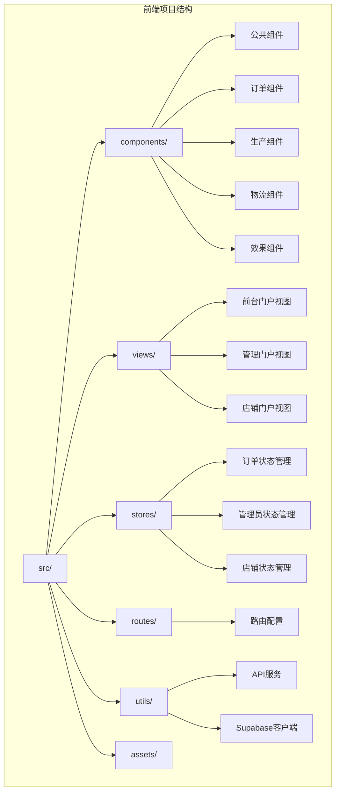

**图表来源**
- [frontend/src/main.js:1-23](file://frontend/src/main.js#L1-L23)
- [frontend/src/router/index.js:1-212](file://frontend/src/router/index.js#L1-L212)

**章节来源**
- [frontend/src/main.js:1-23](file://frontend/src/main.js#L1-L23)
- [frontend/package.json:1-31](file://frontend/package.json#L1-L31)
- [frontend/vite.config.js:1-16](file://frontend/vite.config.js#L1-L16)

## 核心组件

### 应用入口组件

应用的入口点位于`main.js`文件中，负责初始化Vue应用并配置必要的插件。

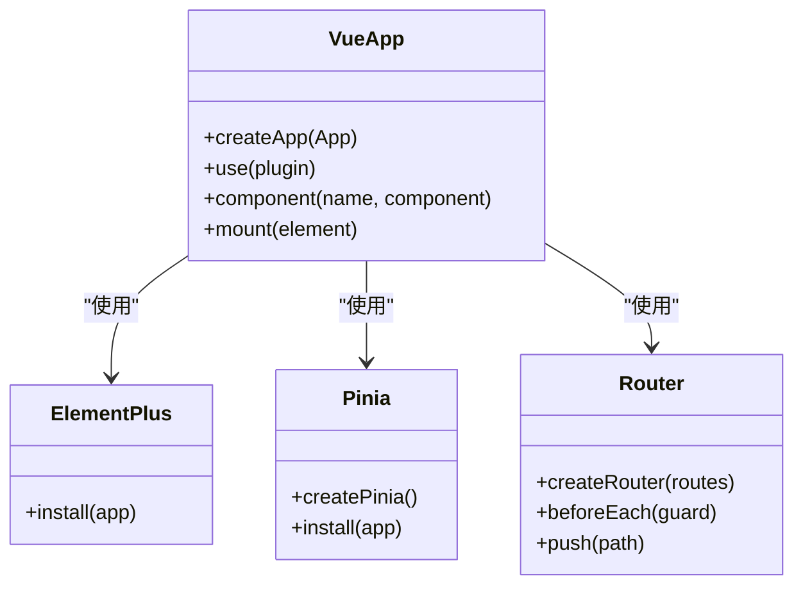

**图表来源**
- [frontend/src/main.js:1-23](file://frontend/src/main.js#L1-L23)

### 视图组件架构

系统采用基于视图的组件架构，每个页面都是一个独立的Vue组件，现已支持三种门户模式：

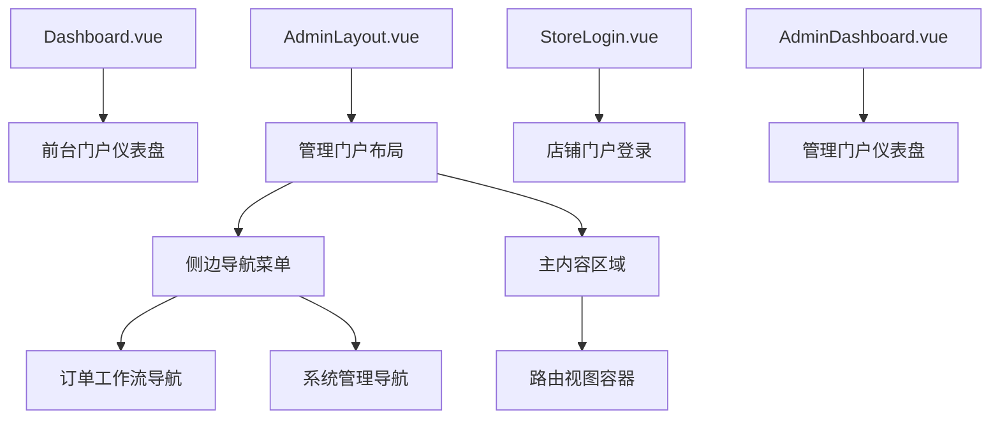

**图表来源**
- [frontend/src/views/Admin/AdminDashboard.vue:1-178](file://frontend/src/views/Admin/AdminDashboard.vue#L1-L178)
- [frontend/src/layouts/AdminLayout.vue:1-234](file://frontend/src/layouts/AdminLayout.vue#L1-L234)
- [frontend/src/views/StorePortal/StoreLogin.vue:1-161](file://frontend/src/views/StorePortal/StoreLogin.vue#L1-L161)

**章节来源**
- [frontend/src/App.vue:1-15](file://frontend/src/App.vue#L1-L15)
- [frontend/src/views/Admin/AdminDashboard.vue:1-178](file://frontend/src/views/Admin/AdminDashboard.vue#L1-L178)

## 双门户架构

系统现已支持双门户架构，包括前台门户、管理门户和多个独立的店铺门户：

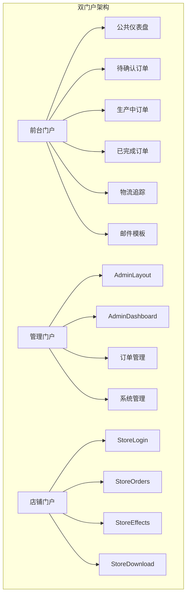

**图表来源**
- [frontend/src/router/index.js:68-157](file://frontend/src/router/index.js#L68-L157)

### 门户特点对比

| 门户类型 | 访问方式 | 权限控制 | 功能范围 | 用户角色 |
|---------|----------|----------|----------|----------|
| 前台门户 | 公开访问 | 无 | 订单状态查询 | 所有用户 |
| 管理门户 | 管理员登录 | 管理员账户 | 系统管理 | 管理员 |
| 店铺门户 | 店铺密码登录 | 店铺权限 | 店铺订单管理 | 店铺用户 |

**章节来源**
- [frontend/src/router/index.js:68-157](file://frontend/src/router/index.js#L68-L157)

## 管理界面系统

管理门户提供了完整的后台管理系统，包括侧边导航、权限控制和多级菜单：

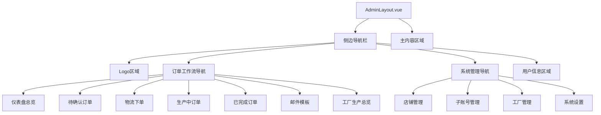

**图表来源**
- [frontend/src/layouts/AdminLayout.vue:1-234](file://frontend/src/layouts/AdminLayout.vue#L1-L234)

### 管理员权限体系

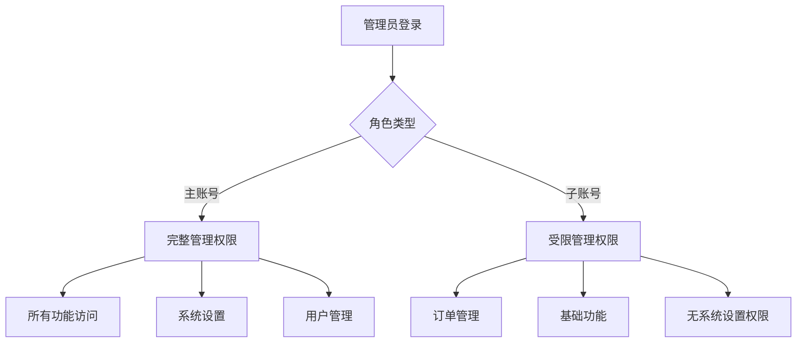

**图表来源**
- [frontend/src/layouts/AdminLayout.vue:215-218](file://frontend/src/layouts/AdminLayout.vue#L215-L218)

**章节来源**
- [frontend/src/layouts/AdminLayout.vue:1-234](file://frontend/src/layouts/AdminLayout.vue#L1-L234)
- [frontend/src/views/Admin/AdminDashboard.vue:1-178](file://frontend/src/views/Admin/AdminDashboard.vue#L1-L178)

## 新增核心组件

### 物流下单组件 OrdersShipping.vue

物流下单组件提供了完整的4PX物流渠道集成，支持订单选择、物流信息填写和运单创建功能：

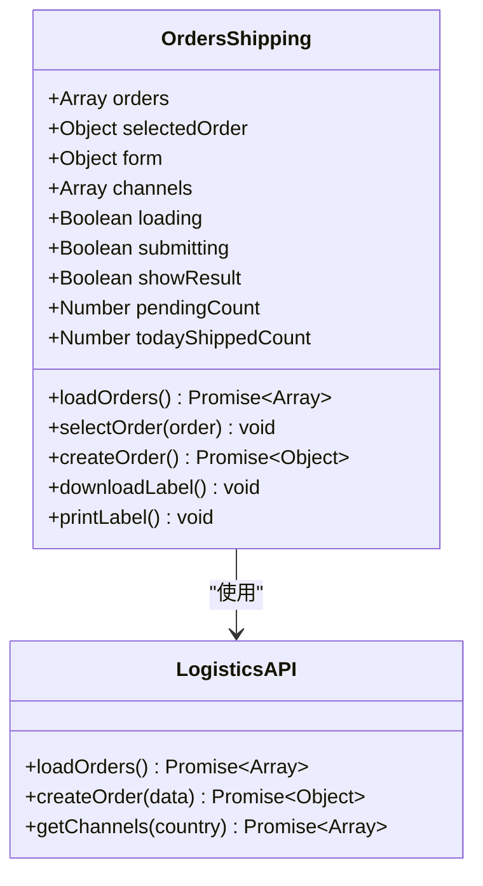

**图表来源**
- [frontend/src/views/Admin/OrdersShipping.vue:378-674](file://frontend/src/views/Admin/OrdersShipping.vue#L378-L674)

### 工厂生产总览组件 FactoryOverview.vue

工厂生产总览组件提供了实时的工厂生产监控和统计功能：

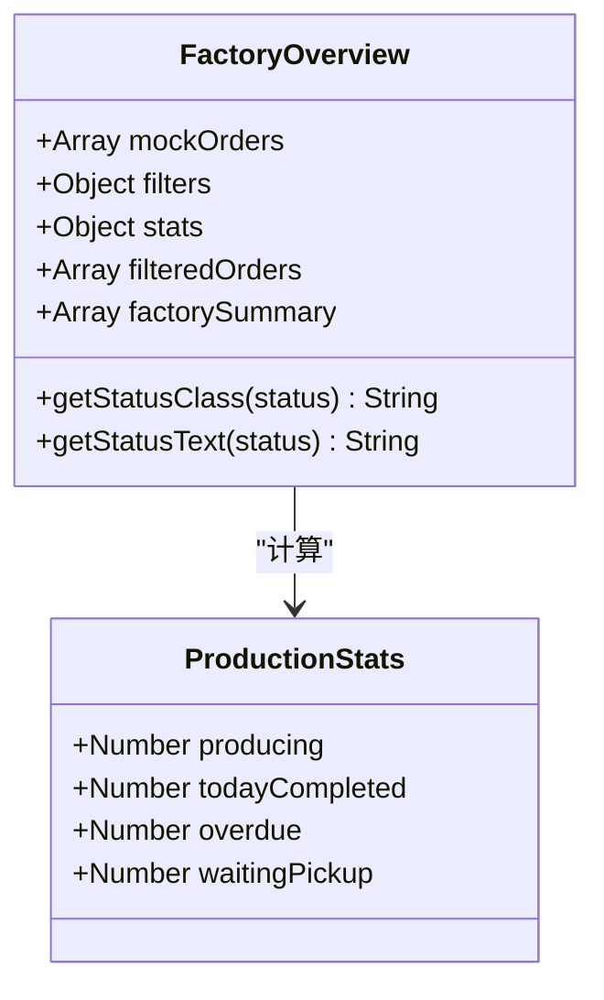

**图表来源**
- [frontend/src/views/Admin/FactoryOverview.vue:206-279](file://frontend/src/views/Admin/FactoryOverview.vue#L206-L279)

### 已完成订单组件 OrdersCompleted.vue

已完成订单组件提供了订单管理、物流追踪和邮件发送功能：

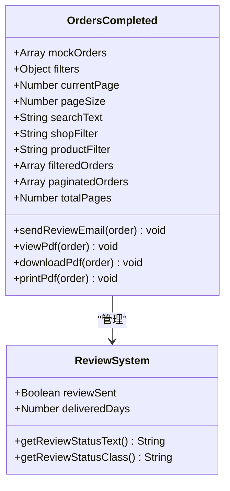

**图表来源**
- [frontend/src/views/Admin/OrdersCompleted.vue:253-415](file://frontend/src/views/Admin/OrdersCompleted.vue#L253-L415)

### 待确认订单组件 OrdersPending.vue

待确认订单组件集成了效果设计器和邮件生成功能：

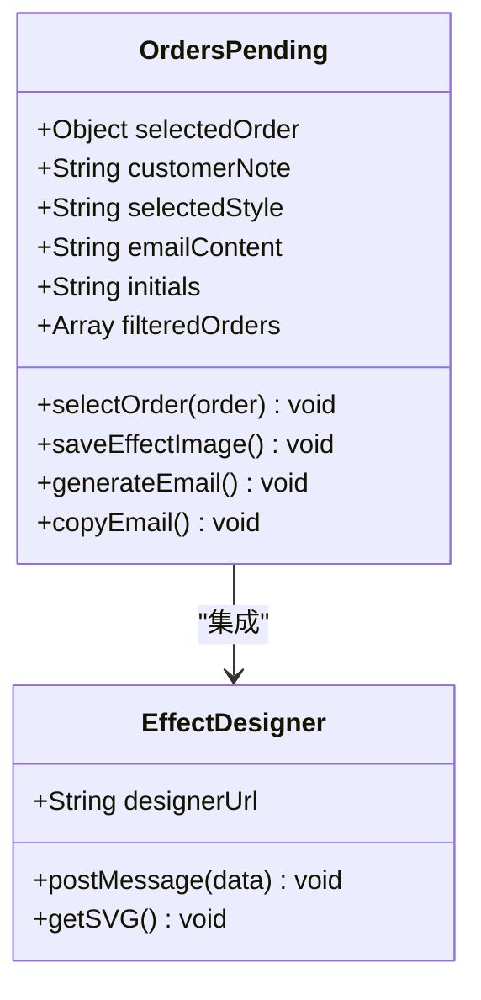

**图表来源**
- [frontend/src/views/Admin/OrdersPending.vue:194-350](file://frontend/src/views/Admin/OrdersPending.vue#L194-L350)

### 邮件模板组件 AdminEffects.vue

邮件模板组件经过重大重构，提供了统一的邮件模板管理和订单联动功能：

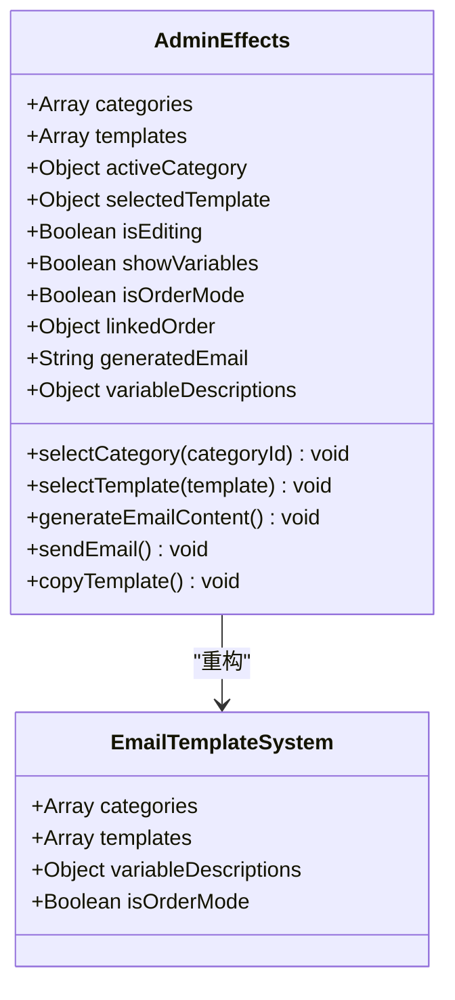

**图表来源**
- [frontend/src/views/Admin/AdminEffects.vue:198-434](file://frontend/src/views/Admin/AdminEffects.vue#L198-L434)

**章节来源**
- [frontend/src/views/Admin/OrdersShipping.vue:1-674](file://frontend/src/views/Admin/OrdersShipping.vue#L1-L674)
- [frontend/src/views/Admin/FactoryOverview.vue:1-279](file://frontend/src/views/Admin/FactoryOverview.vue#L1-L279)
- [frontend/src/views/Admin/OrdersCompleted.vue:1-415](file://frontend/src/views/Admin/OrdersCompleted.vue#L1-L415)
- [frontend/src/views/Admin/OrdersPending.vue:1-350](file://frontend/src/views/Admin/OrdersPending.vue#L1-L350)
- [frontend/src/views/Admin/AdminEffects.vue:1-434](file://frontend/src/views/Admin/AdminEffects.vue#L1-L434)

## 状态管理架构

系统现包含三个专用的状态管理store，分别服务于不同的门户：

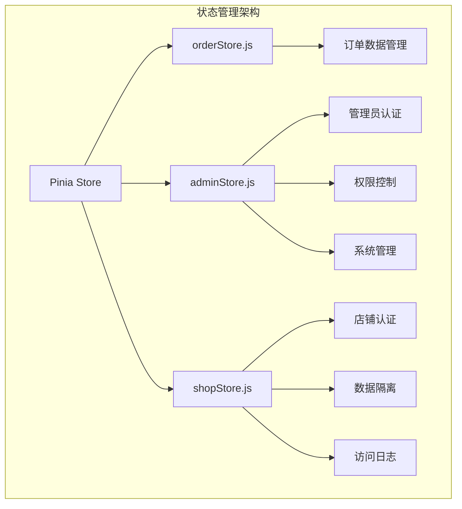

**图表来源**
- [frontend/src/stores/orderStore.js:1-375](file://frontend/src/stores/orderStore.js#L1-L375)
- [frontend/src/stores/adminStore.js:1-321](file://frontend/src/stores/adminStore.js#L1-L321)
- [frontend/src/stores/shopStore.js:1-190](file://frontend/src/stores/shopStore.js#L1-L190)

### 管理员状态管理

管理员store提供了完整的认证和权限管理功能：

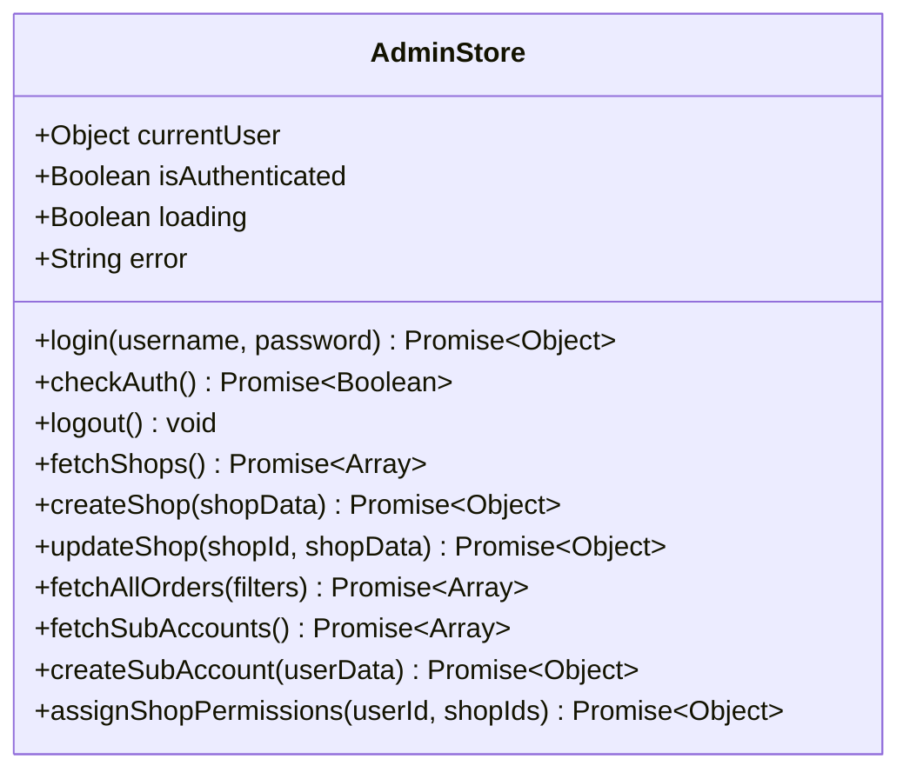

**图表来源**
- [frontend/src/stores/adminStore.js:9-321](file://frontend/src/stores/adminStore.js#L9-L321)

### 店铺状态管理

店铺store实现了独立的数据隔离和权限控制：

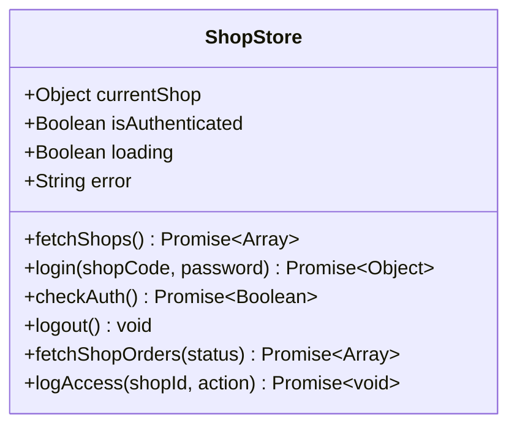

**图表来源**
- [frontend/src/stores/shopStore.js:9-190](file://frontend/src/stores/shopStore.js#L9-L190)

**章节来源**
- [frontend/src/stores/adminStore.js:1-321](file://frontend/src/stores/adminStore.js#L1-L321)
- [frontend/src/stores/shopStore.js:1-190](file://frontend/src/stores/shopStore.js#L1-L190)

## 路由系统

系统路由已完全重构以支持双门户架构，包括导航守卫和权限控制：

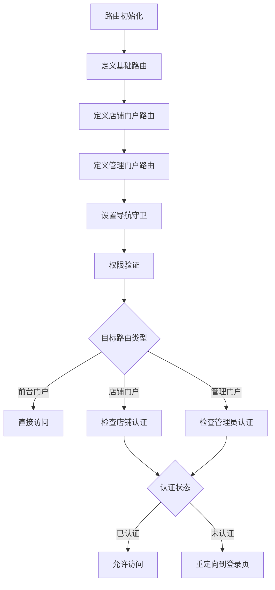

**图表来源**
- [frontend/src/router/index.js:165-209](file://frontend/src/router/index.js#L165-L209)

### 路由配置结构

```mermaid
graph TB
A[routes] --> B[前台门户路由]
A --> C[店铺门户路由]
A --> D[管理门户路由]
B --> B1[/ - 仪表盘总览]
B --> B2[/pending - 待确认订单]
B --> B3[/production - 生产中订单]
C --> C1[/store/login - 店铺登录]
C --> C2[/store/:shopCode/orders - 店铺订单]
C --> C3[/store/:shopCode/effects - 效果图管理]
D --> D1[/admin/login - 管理员登录]
D --> D2[/admin/dashboard - 管理仪表盘]
D --> D3[/admin/shops - 店铺管理]
D --> D4[/admin/orders/pending - 待确认订单]
D --> D5[/admin/orders/shipping - 物流下单]
D --> D6[/admin/orders/completed - 已完成订单]
D --> D7[/admin/factory-overview - 工厂生产总览]
D --> D8[/admin/templates - 邮件模板]
```

**图表来源**
- [frontend/src/router/index.js:5-157](file://frontend/src/router/index.js#L5-L157)

**章节来源**
- [frontend/src/router/index.js:1-212](file://frontend/src/router/index.js#L1-L212)

## 详细组件分析

### 订单状态管理Store

订单状态管理是整个系统的核心，使用Pinia进行状态管理：

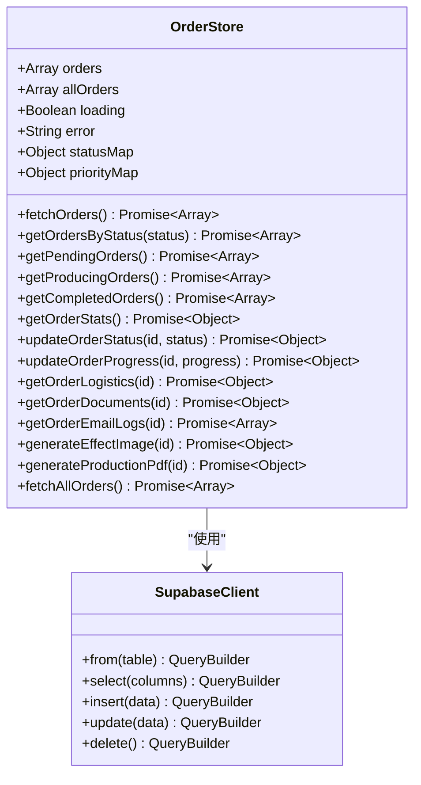

**图表来源**
- [frontend/src/stores/orderStore.js:23-375](file://frontend/src/stores/orderStore.js#L23-L375)
- [frontend/src/utils/supabase.js:1-18](file://frontend/src/utils/supabase.js#L1-L18)

#### 状态管理流程

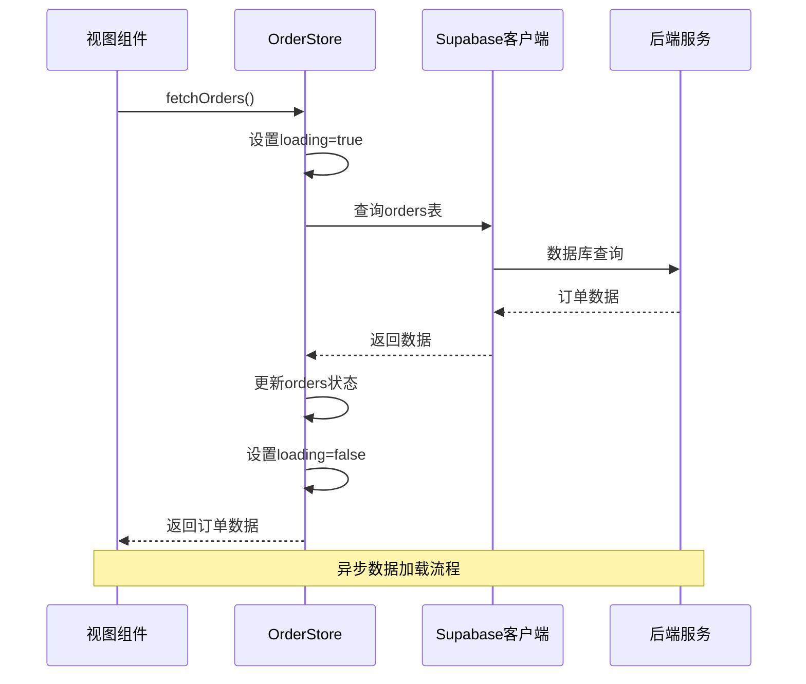

**图表来源**
- [frontend/src/stores/orderStore.js:44-75](file://frontend/src/stores/orderStore.js#L44-L75)

**章节来源**
- [frontend/src/stores/orderStore.js:1-375](file://frontend/src/stores/orderStore.js#L1-L375)

### API服务层

提供统一的API调用接口：

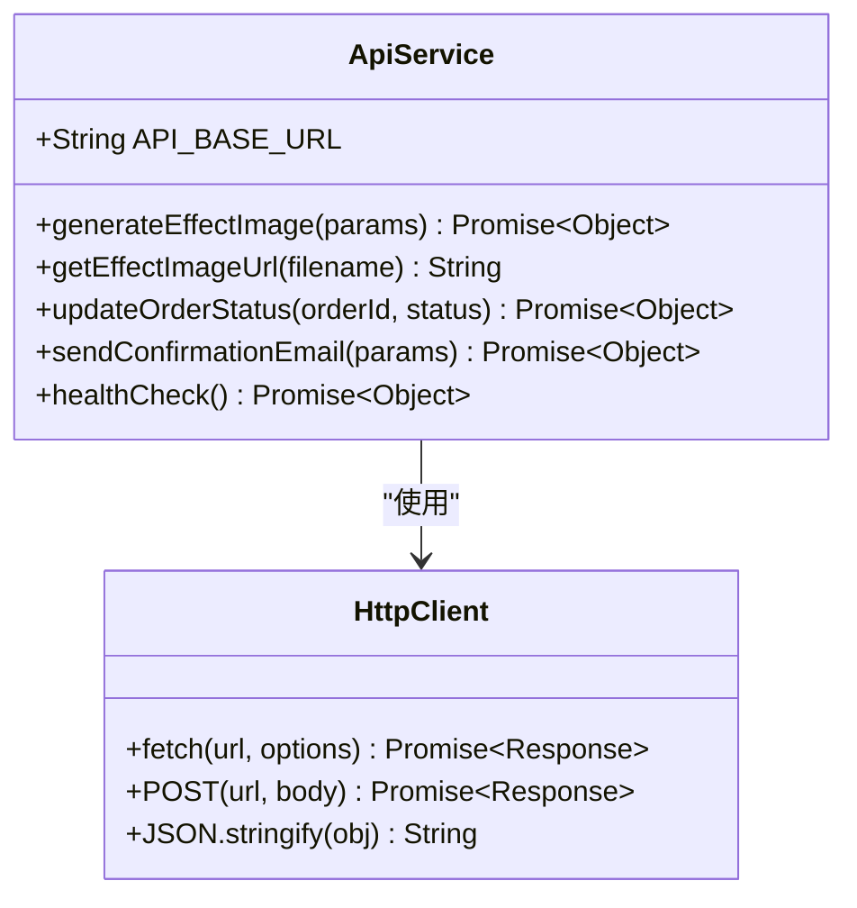

**图表来源**
- [frontend/src/utils/api.js:1-112](file://frontend/src/utils/api.js#L1-L112)

**章节来源**
- [frontend/src/utils/api.js:1-112](file://frontend/src/utils/api.js#L1-L112)

## 依赖关系分析

### 外部依赖关系

```mermaid
graph LR
subgraph "运行时依赖"
A[vue@^3.5.24]
B[pinia@^3.0.4]
C[element-plus@^2.13.2]
D[vue-router@^4.6.4]
E[@supabase/supabase-js@^2.93.3]
F[axios@^1.13.4]
end
subgraph "开发时依赖"
G[vite@^7.2.4]
H[@vitejs/plugin-vue@^6.0.1]
I[tailwindcss@^4.2.1]
J[@tailwindcss/vite@^4.2.1]
end
subgraph "应用模块"
K[main.js]
L[App.vue]
M[router/index.js]
N[stores/orderStore.js]
O[stores/adminStore.js]
P[stores/shopStore.js]
Q[utils/supabase.js]
R[utils/api.js]
end
K --> A
K --> B
K --> C
K --> D
L --> A
M --> D
N --> B
O --> B
P --> B
N --> E
O --> E
P --> E
Q --> E
R --> F
K -.-> G
L -.-> H
M -.-> H
N -.-> H
O -.-> H
P -.-> H
Q -.-> H
R -.-> H
```

**图表来源**
- [frontend/package.json:11-29](file://frontend/package.json#L11-L29)

### 内部模块依赖

```mermaid
graph TD
A[main.js] --> B[App.vue]
A --> C[router/index.js]
A --> D[stores/orderStore.js]
A --> E[stores/adminStore.js]
A --> F[stores/shopStore.js]
A --> G[utils/supabase.js]
A --> H[utils/api.js]
I[views/*] --> D
I --> E
I --> F
J[components/*] --> D
J --> E
J --> F
D --> G
E --> G
F --> G
H --> I[后端API]
G --> J[Supabase客户端]
K[utils/api.js] --> I
```

**图表来源**
- [frontend/src/main.js:1-23](file://frontend/src/main.js#L1-L23)
- [frontend/src/stores/orderStore.js:1-375](file://frontend/src/stores/orderStore.js#L1-L375)

**章节来源**
- [frontend/package.json:1-31](file://frontend/package.json#L1-L31)

## 性能考虑

### 状态管理优化

1. **响应式数据**: 使用Vue 3的响应式系统，确保数据变更时自动更新UI
2. **计算属性缓存**: 利用computed属性避免重复计算
3. **懒加载路由**: 路由组件按需加载，减少初始包大小
4. **多store隔离**: 不同门户使用独立store，避免状态污染

### 数据加载策略

1. **批量数据获取**: 统一通过store.fetchOrders()获取所有订单数据
2. **本地缓存**: 在store中维护订单数据副本，避免重复网络请求
3. **错误处理**: 完善的错误捕获和用户反馈机制
4. **门户隔离**: 店铺门户数据与管理门户数据完全隔离

### 构建优化

1. **Tree Shaking**: Vite支持现代ES模块，启用Tree Shaking优化
2. **代码分割**: 路由级别的代码分割
3. **资源压缩**: 自动的CSS和JavaScript压缩

## 故障排除指南

### 常见问题及解决方案

#### Supabase连接问题
- **症状**: 控制台显示"Supabase配置缺失"
- **原因**: .env文件中缺少VITE_SUPABASE_URL或VITE_SUPABASE_KEY
- **解决**: 检查.env文件配置，确保环境变量正确设置

#### API调用失败
- **症状**: 网络请求超时或返回错误
- **原因**: 后端服务未启动或地址配置错误
- **解决**: 检查后端服务状态，确认API_BASE_URL配置

#### 订单数据加载异常
- **症状**: 订单列表为空或显示错误
- **原因**: 数据库查询异常或网络问题
- **解决**: 检查数据库连接，查看控制台错误日志

#### 门户访问权限问题
- **症状**: 无法访问特定门户或功能
- **原因**: 认证状态过期或权限不足
- **解决**: 检查登录状态，确认用户权限级别

#### 物流下单功能异常
- **症状**: 物流下单失败或渠道不可用
- **原因**: API密钥配置错误或网络连接问题
- **解决**: 检查API配置，确认网络连接正常

**章节来源**
- [frontend/src/utils/supabase.js:7-10](file://frontend/src/utils/supabase.js#L7-L10)
- [frontend/src/stores/orderStore.js:68-75](file://frontend/src/stores/orderStore.js#L68-L75)

## 结论

这个Vue组件架构项目展现了现代前端开发的最佳实践，现已升级为支持双门户架构的完整解决方案：

### 架构优势
1. **清晰的分层设计**: 展示层、业务逻辑层、数据访问层职责分明
2. **模块化组件**: 基于Vue 3 Composition API的组件化开发
3. **多门户支持**: 前台门户、管理门户、店铺门户的完整架构
4. **状态管理**: 使用Pinia实现集中式状态管理
5. **权限控制**: 完整的用户权限和数据隔离机制
6. **路由系统**: 基于Vue Router的SPA架构
7. **功能完整性**: 新增物流下单、工厂监控、邮件模板等核心功能

### 技术亮点
1. **现代化工具链**: Vite提供快速开发体验
2. **TypeScript友好**: Vue 3对TypeScript的良好支持
3. **组件复用**: 高度可复用的组件设计
4. **开发体验**: 完善的开发工具和调试支持
5. **统一界面架构**: AdminEffects.vue的重大更新体现了统一的设计理念
6. **实时监控**: FactoryOverview.vue提供工厂生产实时监控
7. **自动化流程**: OrdersCompleted.vue支持自动邮件发送功能

### 改进建议
1. **类型安全**: 可以考虑添加TypeScript支持
2. **单元测试**: 增加组件和store的测试覆盖率
3. **性能监控**: 添加应用性能监控和错误追踪
4. **国际化**: 支持多语言功能扩展
5. **安全增强**: 生产环境中替换明文密码验证
6. **API文档**: 为新增的物流API添加详细的文档说明

该架构为订单管理系统的开发提供了坚实的基础，具有良好的可扩展性和维护性，能够支持复杂的多门户业务场景。新增的四个核心组件进一步完善了系统的功能完整性，特别是物流下单和工厂监控功能，为电商订单管理提供了全方位的解决方案。