# 前后端API对接文档

<cite>
**本文档引用的文件**
- [docs/frontend-backend-api.md](file://docs/frontend-backend-api.md)
- [backend/src/api/main.py](file://backend/src/api/main.py)
- [backend/src/services/effect_image_service.py](file://backend/src/services/effect_image_service.py)
- [backend/src/services/pdf_service.py](file://backend/src/services/pdf_service.py)
- [backend/src/services/svg_pdf_service.py](file://backend/src/services/svg_pdf_service.py)
- [backend/src/services/email_service.py](file://backend/src/services/email_service.py)
- [backend/src/services/template_service.py](file://backend/src/services/template_service.py)
- [backend/src/services/database_service.py](file://backend/src/services/database_service.py)
- [backend/src/services/shipping_service.py](file://backend/src/services/shipping_service.py)
- [backend/src/config/settings.py](file://backend/src/config/settings.py)
- [backend/src/models/order.py](file://backend/src/models/order.py)
- [backend/pyproject.toml](file://backend/pyproject.toml)
- [backend/.env.example](file://backend/.env.example)
- [backend/scripts/upload_assets_to_supabase.py](file://backend/scripts/upload_assets_to_supabase.py)
- [backend/scripts/test_storage_upload.py](file://backend/scripts/test_storage_upload.py)
- [backend/scripts/convert_pdf_final.py](file://backend/scripts/convert_pdf_final.py)
- [frontend/src/utils/api.js](file://frontend/src/utils/api.js)
- [frontend/src/stores/orderStore.js](file://frontend/src/stores/orderStore.js)
- [frontend/src/utils/supabase.js](file://frontend/src/utils/supabase.js)
- [frontend/package.json](file://frontend/package.json)
- [frontend/.env.example](file://frontend/.env.example)
- [frontend/src/router/index.js](file://frontend/src/router/index.js)
- [frontend/src/stores/shopStore.js](file://frontend/src/stores/shopStore.js)
- [frontend/src/views/StorePortal/StoreLogin.vue](file://frontend/src/views/StorePortal/StoreLogin.vue)
- [frontend/src/views/StorePortal/StoreOrders.vue](file://frontend/src/views/StorePortal/StoreOrders.vue)
- [frontend/public/designer-standalone.html](file://frontend/public/designer-standalone.html)
- [backend/scripts/init_multitenant.py](file://backend/scripts/init_multitenant.py)
- [backend/scripts/init_multitenant.sql](file://backend/scripts/init_multitenant.sql)
- [backend/scripts/init_subaccount.sql](file://backend/scripts/init_subaccount.sql)
- [backend/assets/sku_data/字体特性清单.csv](file://backend/assets/sku_data/字体特性清单.csv)
</cite>

## 更新摘要
**变更内容**
- 新增物流API端点：/api/shipping/create-order、/api/shipping/get-label、/api/shipping/get-products、/api/shipping/cancel-order、/api/shipping/query-order
- 新增字体管理API：/fonts/{font_filename} 和 /api/fonts/list
- 新增4PX物流集成和面单生成功能
- 更新字体加载机制，支持动态字体文件获取
- 新增物流服务和4PX客户端实现

## 目录
1. [项目概述](#项目概述)
2. [系统架构](#系统架构)
3. [双门户架构设计](#双门户架构设计)
4. [API接口规范](#api接口规范)
5. [权限控制与多租户](#权限控制与多租户)
6. [数据模型对接](#数据模型对接)
7. [前端状态管理](#前端状态管理)
8. [文件传输流程](#文件传输流程)
9. [物流服务集成](#物流服务集成)
10. [字体管理服务](#字体管理服务)
11. [错误处理机制](#错误处理机制)
12. [部署配置](#部署配置)
13. [开发指南](#开发指南)
14. [故障排除](#故障排除)

## 项目概述

ETSY订单自动化管理系统是一个集成了前后端的完整订单处理解决方案。该系统通过FastAPI提供后端服务，Vue.js构建前端界面，实现从订单接收、处理到生产的全流程自动化管理。**最新更新**增加了完整的物流API集成和字体管理功能。

### 核心功能模块

- **订单管理**: 完整的订单生命周期管理，包括状态流转和进度跟踪
- **效果图生成**: 基于模板的个性化产品效果图生成，支持一键上传到Supabase Storage
- **PDF生成**: 基于SVG模板的生产文档PDF生成，支持一键上传
- **邮件服务**: 自动化的订单确认和物流通知邮件发送
- **文件管理**: SVG/PDF等文件的生成、存储和传输
- **实时监控**: 前端实时显示订单状态和处理进度
- **Supabase集成**: 完整的数据库操作和文件存储服务
- **双门户架构**: 支持商店门户和工厂工作坊门户的独立访问
- **权限控制**: 多租户支持和子账号权限管理
- **物流集成**: 完整的4PX物流API集成，支持订单创建、面单获取、物流查询
- **字体管理**: 动态字体文件管理和服务，支持设计师工具

**章节来源**
- [docs/frontend-backend-api.md:1-312](file://docs/frontend-backend-api.md#L1-L312)

## 系统架构

系统采用前后端分离架构，后端提供RESTful API接口，前端通过Supabase进行数据库操作，同时调用后端API处理特殊功能。新增双门户架构支持商店和工厂的独立访问，并集成了完整的物流服务和字体管理功能。

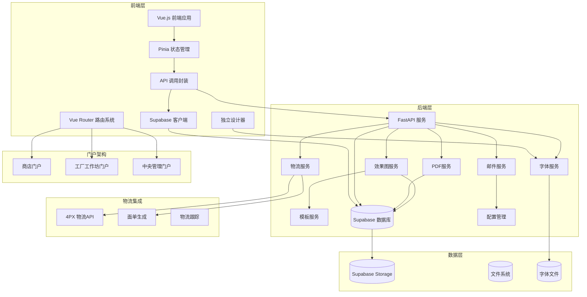

**图表来源**
- [backend/src/api/main.py:22-36](file://backend/src/api/main.py#L22-L36)
- [backend/src/services/shipping_service.py:253-395](file://backend/src/services/shipping_service.py#L253-L395)
- [frontend/src/utils/api.js:6-6](file://frontend/src/utils/api.js#L6-L6)
- [frontend/src/stores/orderStore.js:23-23](file://frontend/src/stores/orderStore.js#L23-L23)
- [backend/src/services/database_service.py:10-24](file://backend/src/services/database_service.py#L10-L24)
- [frontend/src/router/index.js:1-237](file://frontend/src/router/index.js#L1-L237)

### 技术栈对比

| 层级 | 技术 | 版本 | 用途 |
|------|------|------|------|
| 前端 | Vue.js | 3.5.24 | 用户界面 |
| 前端 | Pinia | 3.0.4 | 状态管理 |
| 前端 | Element Plus | 2.13.2 | UI组件库 |
| 前端 | Vue Router | 4.4.5 | 路由管理 |
| 后端 | FastAPI | 0.128.2 | Web框架 |
| 后端 | SQLAlchemy | 2.0.25 | ORM框架 |
| 数据库 | Supabase | 2.27.2 | 云数据库 |
| 存储 | Supabase Storage | 2.27.2 | 文件存储 |
| PDF生成 | ReportLab | 4.0.4 | PDF文档生成 |
| 图像处理 | svglib | 1.0.0 | SVG到PDF转换 |
| 物流集成 | 4PX API | v1.1.0 | 物流服务 |
| 字体管理 | OpenType.js | - | 字体渲染 |

**章节来源**
- [backend/pyproject.toml:8-35](file://backend/pyproject.toml#L8-L35)
- [frontend/package.json:11-21](file://frontend/package.json#L11-L21)

## 双门户架构设计

系统支持三种独立门户，每种门户都有特定的功能和权限控制：

### 门户类型与功能

#### 商店门户 (Store Portal)
- **目标用户**: 各地区店铺运营人员
- **核心功能**: 订单管理、效果图下载、基本操作
- **访问方式**: 通过 `/store/:shopCode` 路由访问
- **权限控制**: 店铺密码验证，数据隔离

#### 工厂工作坊门户 (Factory Workshop Portal)
- **目标用户**: 生产工厂操作员
- **核心功能**: 生产订单处理、物流跟踪、生产进度管理
- **访问方式**: 通过 `/factory-workshop` 路由访问
- **权限控制**: 工厂专用功能，数据隔离

#### 中央管理门户 (Admin Portal)
- **目标用户**: 系统管理员和超级用户
- **核心功能**: 用户管理、店铺管理、系统配置、报表统计
- **访问方式**: 通过 `/admin` 路由访问
- **权限控制**: 最高权限，支持主账号和子账号

### 门户路由配置

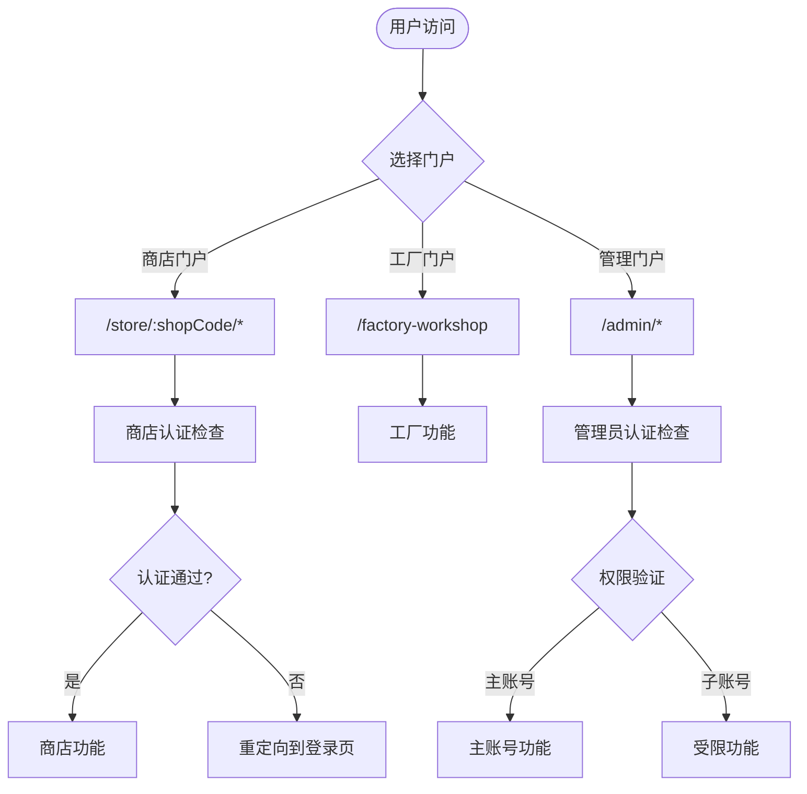

**图表来源**
- [frontend/src/router/index.js:190-234](file://frontend/src/router/index.js#L190-L234)

**章节来源**
- [frontend/src/router/index.js:60-91](file://frontend/src/router/index.js#L60-L91)
- [frontend/src/router/index.js:92-182](file://frontend/src/router/index.js#L92-L182)

## API接口规范

系统提供以下核心API接口，支持双门户架构、权限控制和新增的物流服务：

### 健康检查接口
- **方法**: GET
- **路径**: `/`
- **用途**: API根路径检查
- **响应**: `{"message": "ETSY订单自动化 API", "status": "running"}`

- **方法**: GET
- **路径**: `/health`
- **用途**: 服务健康状态检查
- **响应**: `{"status": "ok"}`

### 一键生成和上传功能

#### 一键生成效果图并上传
- **方法**: POST
- **路径**: `/api/effect-image/generate-and-upload`
- **请求参数**:
  - `order_id`: Supabase UUID (字符串)

- **响应**: 包含生成的SVG文件URL和数据库更新状态

#### 一键生成PDF并上传
- **方法**: POST
- **路径**: `/api/pdf/generate-and-upload`
- **请求参数**:
  - `order_id`: Supabase UUID (字符串)

- **响应**: 包含生成的PDF文件URL和数据库更新状态

### 效果图生成功能

#### 生成效果图
- **方法**: POST
- **路径**: `/api/effect-image/generate`
- **请求参数**:
  - `order_id`: 订单ID (字符串)
  - `shape`: 形状 (bone/heart/circle)
  - `color`: 颜色 (G/S/B)
  - `size`: 尺寸 (large/small)
  - `text_front`: 正面文字
  - `text_back`: 背面文字 (可选)
  - `font_code`: 字体代码

- **响应**: 包含生成的SVG文件路径

#### 查看效果图
- **方法**: GET
- **路径**: `/api/effect-image/view/{filename}`
- **用途**: 直接查看生成的效果图文件

### 订单状态管理

#### 更新订单状态
- **方法**: POST
- **路径**: `/api/order/update-status`
- **请求参数**:
  - `order_id`: 订单ID
  - `status`: 新状态

- **状态流转**: pending → effect_sent → producing → delivered

### 邮件发送功能

#### 发送确认邮件
- **方法**: POST
- **路径**: `/api/email/send-confirmation`
- **请求参数**:
  - `order_id`: 订单ID
  - `to_email`: 客户邮箱
  - `customer_name`: 客户名称
  - `product_info`: 产品信息
  - `effect_image_path`: 效果图路径 (可选)

### 商店门户专用接口

#### 获取商店列表
- **方法**: GET
- **路径**: `/api/shops`
- **用途**: 获取所有活跃商店列表
- **响应**: 商店信息数组

#### 商店登录验证
- **方法**: POST
- **路径**: `/api/shops/login`
- **请求参数**:
  - `shop_code`: 商店代码
  - `password`: 访问密码

- **响应**: 登录结果和商店信息

#### 获取商店订单
- **方法**: GET
- **路径**: `/api/shops/{shopCode}/orders`
- **用途**: 获取指定商店的所有订单
- **响应**: 订单列表

### 物流服务API

#### 创建物流订单
- **方法**: POST
- **路径**: `/api/shipping/create-order`
- **请求参数**:
  - `order_id`: 订单ID (字符串)
  - `logistics_product_code`: 物流产品代码 (字符串)
  - `recipient_name`: 收件人姓名 (字符串)
  - `recipient_phone`: 收件人电话 (字符串)
  - `recipient_email`: 收件人邮箱 (可选)
  - `recipient_street`: 收件人街道地址 (字符串)
  - `recipient_city`: 收件人城市 (字符串)
  - `recipient_state`: 收件人州/省 (字符串)
  - `recipient_postcode`: 收件人邮编 (字符串)
  - `recipient_country`: 收件人国家 (默认: US)
  - `weight_kg`: 包裹重量 (kg，默认: 0.03)
  - `declare_value`: 申报价值 (默认: 10.0)
  - `declare_currency`: 申报货币 (默认: USD)

- **响应**: 包含订单号、跟踪号、面单URL和4PX响应数据

#### 获取物流面单
- **方法**: POST
- **路径**: `/api/shipping/get-label`
- **请求参数**:
  - `tracking_number`: 跟踪号 (可选)
  - `order_no`: 订单号 (可选)

- **响应**: 包含面单PDF URL和原始响应数据

#### 查询物流产品
- **方法**: POST
- **路径**: `/api/shipping/get-products`
- **请求参数**:
  - `country_code`: 国家代码 (必填)
  - `postcode`: 邮政编码 (可选)

- **响应**: 包含最多10个可用物流渠道的信息

#### 取消物流订单
- **方法**: POST
- **路径**: `/api/shipping/cancel-order`
- **请求参数**:
  - `order_no`: 4PX订单号 (字符串)
  - `reason`: 取消原因 (可选)

- **响应**: 取消结果和数据

#### 查询物流订单状态
- **方法**: POST
- **路径**: `/api/shipping/query-order`
- **请求参数**:
  - `order_no`: 4PX订单号 (字符串)

- **响应**: 订单状态和详细信息

### 字体管理API

#### 获取字体文件
- **方法**: GET
- **路径**: `/fonts/{font_filename}`
- **请求参数**:
  - `font_filename`: 字体文件名 (支持 .ttf 或 .otf)

- **响应**: 字体文件内容，支持TTF和OTF格式

#### 列出可用字体
- **方法**: GET
- **路径**: `/api/fonts/list`
- **用途**: 获取所有可用字体列表
- **响应**: 字体文件名数组

**章节来源**
- [backend/src/api/main.py:69-272](file://backend/src/api/main.py#L69-L272)
- [backend/src/api/main.py:447-742](file://backend/src/api/main.py#L447-L742)
- [backend/src/api/main.py:157-201](file://backend/src/api/main.py#L157-L201)

## 权限控制与多租户

系统实现了完整的多租户权限控制机制，支持主账号-子账号的层级权限管理。

### 多租户架构

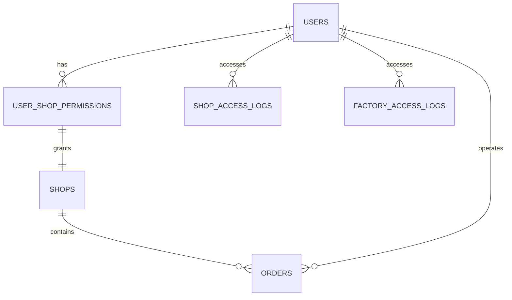

**图表来源**
- [backend/scripts/init_multitenant.sql:95-116](file://backend/scripts/init_multitenant.sql#L95-L116)

### 角色权限体系

| 角色类型 | 权限描述 | 访问范围 | 管理功能 |
|----------|----------|----------|----------|
| **主账号** | 系统最高权限 | 全部商店和功能 | 创建子账号、管理商店、系统配置 |
| **子账号** | 受限权限 | 指定商店权限 | 订单管理、基本操作 |
| **商店运营员** | 商店专属权限 | 单个商店 | 订单查看、基本操作 |
| **工厂操作员** | 生产权限 | 工厂专用 | 生产订单处理、物流跟踪 |

### 权限验证流程

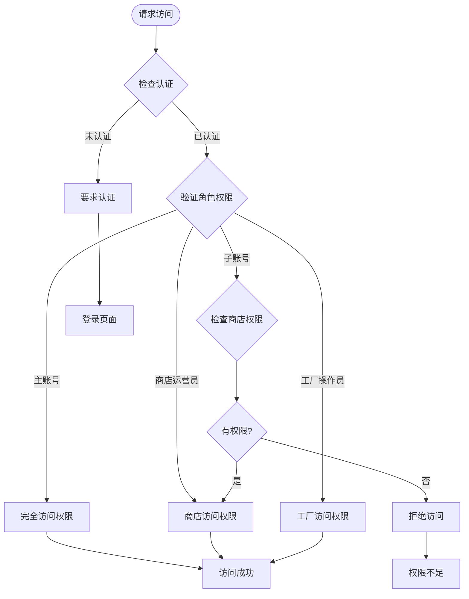

**图表来源**
- [frontend/src/router/index.js:190-234](file://frontend/src/router/index.js#L190-L234)

### 数据隔离机制

系统通过以下机制确保数据隔离：

1. **商店维度隔离**: 每个商店的数据独立存储
2. **用户权限控制**: 子账号只能访问分配的商店数据
3. **访问日志记录**: 记录所有用户的访问行为
4. **会话管理**: 24小时会话有效期

**章节来源**
- [backend/scripts/init_multitenant.py:15-112](file://backend/scripts/init_multitenant.py#L15-L112)
- [backend/scripts/init_multitenant.sql:27-116](file://backend/scripts/init_multitenant.sql#L27-L116)
- [backend/scripts/init_subaccount.sql:1-31](file://backend/scripts/init_subaccount.sql#L1-L31)
- [frontend/src/stores/shopStore.js:9-190](file://frontend/src/stores/shopStore.js#L9-L190)

## 数据模型对接

系统基于Supabase数据库，包含以下核心数据表，支持多租户架构：

### 订单主表 (orders)
| 字段名 | 类型 | 必填 | 默认值 | 说明 |
|--------|------|------|--------|------|
| id | Integer | 是 | 自增 | 主键 |
| etsy_order_id | String(50) | 是 | - | Etsy订单号（唯一） |
| shop_id | UUID | 是 | - | 关联 shops.id（新增） |
| sku_id | Integer | 否 | NULL | 关联 sku_mapping.id |
| customer_name | String(100) | 否 | NULL | 客户名称 |
| customer_email | String(100) | 否 | NULL | 客户邮箱 |
| front_text | Text | 否 | NULL | 正面刻字 |
| back_text | Text | 否 | NULL | 背面刻字 |
| quantity | Integer | 否 | 1 | 数量 |
| total_amount | Decimal(10,2) | 否 | 0 | 订单金额 |
| status | String(20) | 否 | 'new' | 订单状态 |
| progress | Integer | 否 | 0 | 进度 (0-100) |
| priority | String(10) | 否 | 'normal' | 优先级 |
| estimated_delivery | DateTime | 否 | NULL | 预计交付日期 |
| production_started_at | DateTime | 否 | NULL | 生产开始时间 |
| completed_at | DateTime | 否 | NULL | 完成时间 |
| effect_image_url | String(500) | 否 | NULL | 效果图URL |
| effect_image_back_url | String(500) | 否 | NULL | 背面效果图URL |
| production_pdf_url | String(500) | 否 | NULL | 生产PDF URL |
| created_at | DateTime | 否 | NOW() | 创建时间 |
| updated_at | DateTime | 否 | NOW() | 更新时间 |

### 商店表 (shops)
| 字段名 | 类型 | 必填 | 默认值 | 说明 |
|--------|------|------|--------|------|
| id | UUID | 是 | 自动生成 | 主键 |
| name | String(100) | 是 | - | 商店名称 |
| code | String(20) | 是 | - | 商店代码（唯一） |
| region | String(50) | 否 | NULL | 地区 |
| password_hash | String(255) | 否 | NULL | 密码哈希 |
| api_key | String(255) | 否 | NULL | API密钥 |
| status | String(20) | 否 | 'active' | 状态 |
| created_at | DateTime | 否 | NOW() | 创建时间 |
| updated_at | DateTime | 否 | NOW() | 更新时间 |

### 用户表 (users) 扩展
| 字段名 | 类型 | 必填 | 默认值 | 说明 |
|--------|------|------|--------|------|
| id | UUID | 是 | 自动生成 | 主键 |
| username | String(50) | 是 | - | 用户名 |
| email | String(100) | 是 | - | 邮箱 |
| role_type | String(20) | 否 | 'sub' | 角色类型 |
| parent_id | UUID | 否 | NULL | 父账号ID |
| display_name | String(100) | 否 | NULL | 显示名称 |
| phone | String(20) | 否 | NULL | 联系电话 |
| created_at | DateTime | 否 | NOW() | 创建时间 |
| updated_at | DateTime | 否 | NOW() | 更新时间 |

### 用户-商店权限关联表 (user_shop_permissions)
| 字段名 | 类型 | 必填 | 默认值 | 说明 |
|--------|------|------|--------|------|
| id | UUID | 是 | 自动生成 | 主键 |
| user_id | UUID | 是 | - | 关联 users.id |
| shop_id | UUID | 是 | - | 关联 shops.id |
| created_at | DateTime | 否 | NOW() | 创建时间 |

### 访问日志表
#### 商店访问日志 (shop_access_logs)
| 字段名 | 类型 | 必填 | 默认值 | 说明 |
|--------|------|------|--------|------|
| id | UUID | 是 | 自动生成 | 主键 |
| shop_id | UUID | 是 | - | 关联 shops.id |
| action | String(50) | 是 | - | 操作类型 |
| ip_address | INET | 否 | NULL | IP地址 |
| user_agent | TEXT | 否 | NULL | 用户代理 |
| created_at | TIMESTAMP | 否 | NOW() | 创建时间 |

#### 工厂访问日志 (factory_access_logs)
| 字段名 | 类型 | 必填 | 默认值 | 说明 |
|--------|------|------|--------|------|
| id | UUID | 是 | 自动生成 | 主键 |
| action | String(50) | 是 | - | 操作类型 |
| ip_address | INET | 否 | NULL | IP地址 |
| user_agent | TEXT | 否 | NULL | 用户代理 |
| created_at | TIMESTAMP | 否 | NOW() | 创建时间 |

### 物流表 (logistics)
**新增** 物流相关信息表，支持4PX物流集成

| 字段名 | 类型 | 必填 | 默认值 | 说明 |
|--------|------|------|--------|------|
| id | UUID | 是 | 自动生成 | 主键 |
| order_id | Integer | 是 | - | 关联 orders.id |
| recipient_name | String(100) | 否 | NULL | 收件人姓名 |
| street_address | String(200) | 否 | NULL | 收件人街道地址 |
| city | String(100) | 否 | NULL | 收件人城市 |
| state_code | String(50) | 否 | NULL | 收件人州/省代码 |
| postal_code | String(20) | 否 | NULL | 收件人邮编 |
| country | String(100) | 否 | NULL | 收件人国家 |
| tracking_number | String(100) | 否 | NULL | 4PX跟踪号 |
| label_url | String(500) | 否 | NULL | 面单PDF URL |
| delivery_status | String(50) | 否 | 'pending' | 物流状态 |
| shipped_at | DateTime | 否 | NULL | 发货时间 |
| created_at | DateTime | 否 | NOW() | 创建时间 |
| updated_at | DateTime | 否 | NOW() | 更新时间 |

**章节来源**
- [docs/frontend-backend-api.md:29-148](file://docs/frontend-backend-api.md#L29-L148)
- [backend/scripts/init_multitenant.sql:27-116](file://backend/scripts/init_multitenant.sql#L27-L116)
- [backend/scripts/init_subaccount.sql:6-31](file://backend/scripts/init_subaccount.sql#L6-L31)

## 前端状态管理

前端使用Pinia进行状态管理，提供完整的订单生命周期管理，支持双门户架构：

### 订单状态映射
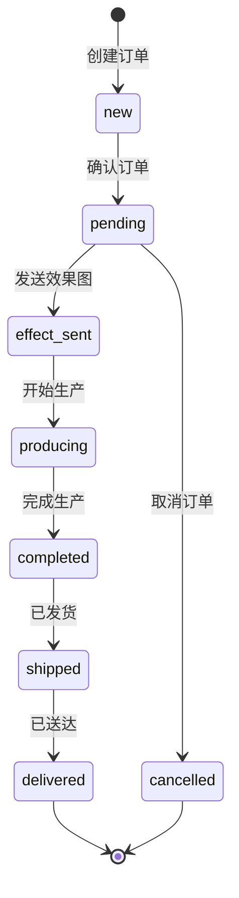

**图表来源**
- [frontend/src/stores/orderStore.js:31-42](file://frontend/src/stores/orderStore.js#L31-L42)

### 核心状态管理功能

#### 订单数据获取
- `fetchOrders()`: 获取所有订单（关联查询）
- `getPendingOrders()`: 获取待确认订单
- `getProducingOrders()`: 获取生产中订单
- `getCompletedOrders()`: 获取已完成订单

#### 订单状态更新
- `updateOrderStatus(orderId, newStatus)`: 更新订单状态
- `updateOrderProgress(orderId, progress)`: 更新订单进度

#### 数据关联查询
- `getOrderLogistics(orderId)`: 获取物流信息
- `getOrderDocuments(orderId)`: 获取生产文档
- `getOrderEmailLogs(orderId)`: 获取邮件记录

### 商店门户状态管理

#### 商店状态管理
- `currentShop`: 当前登录商店信息
- `isAuthenticated`: 认证状态
- `loading`: 加载状态
- `error`: 错误信息

#### 商店相关功能
- `fetchShops()`: 获取所有活跃商店列表
- `login(shopCode, password)`: 商店登录验证
- `checkAuth()`: 检查登录状态
- `logout()`: 退出登录
- `fetchShopOrders(status)`: 获取商店订单

### 物流状态管理
**新增** 物流相关状态管理功能

#### 物流数据获取
- `fetchOrderLogistics(orderId)`: 获取订单物流信息
- `getAvailableShippingProducts(countryCode, postcode)`: 获取可用物流产品
- `generateShippingLabel(trackingNumber)`: 生成物流面单

#### 物流操作
- `createShippingOrder(orderData)`: 创建物流订单
- `cancelShippingOrder(orderNo, reason)`: 取消物流订单
- `queryShippingOrder(orderNo)`: 查询物流订单状态

**章节来源**
- [frontend/src/stores/orderStore.js:44-361](file://frontend/src/stores/orderStore.js#L44-L361)
- [frontend/src/stores/shopStore.js:9-190](file://frontend/src/stores/shopStore.js#L9-L190)

## 文件传输流程

系统实现了完整的文件生成和传输机制，支持双门户架构和新增的物流服务：

### 一键生成和上传流程
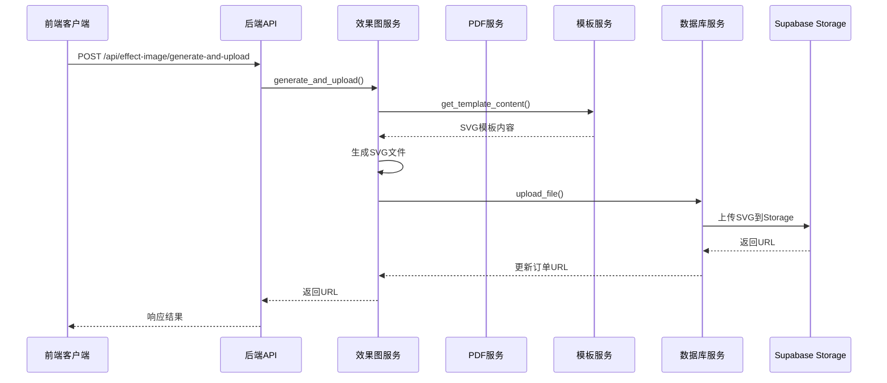

**图表来源**
- [backend/src/api/main.py:200-223](file://backend/src/api/main.py#L200-L223)
- [backend/src/services/effect_image_service.py:77-129](file://backend/src/services/effect_image_service.py#L77-L129)
- [backend/src/services/database_service.py:81-108](file://backend/src/services/database_service.py#L81-L108)

### PDF生成和上传流程
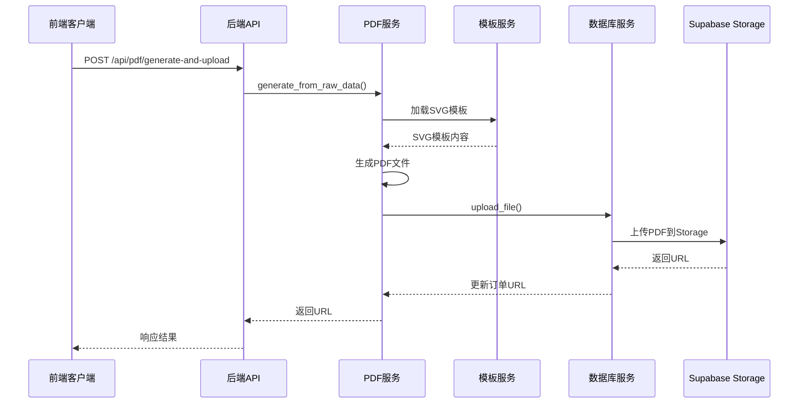

**图表来源**
- [backend/src/api/main.py:225-272](file://backend/src/api/main.py#L225-L272)
- [backend/src/services/svg_pdf_service.py:522-527](file://backend/src/services/svg_pdf_service.py#L522-L527)
- [backend/src/services/database_service.py:81-108](file://backend/src/services/database_service.py#L81-L108)

### 物流订单创建流程
**新增** 物流订单创建和面单生成流程

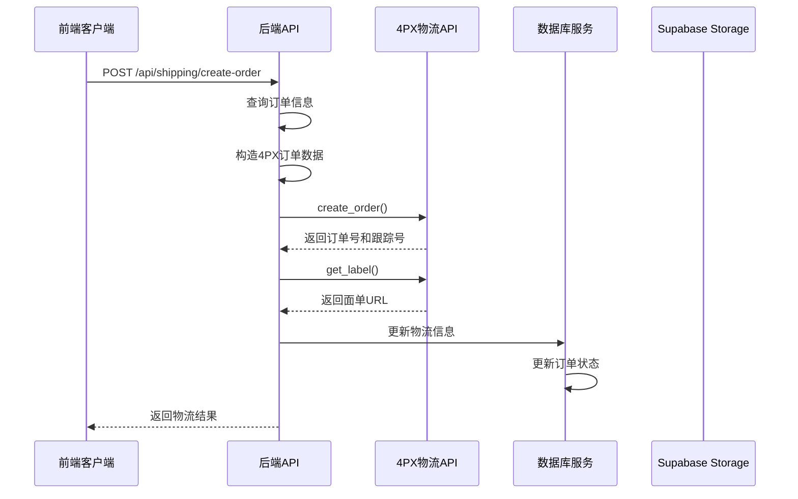

**图表来源**
- [backend/src/api/main.py:449-593](file://backend/src/api/main.py#L449-L593)
- [backend/src/services/shipping_service.py:305-312](file://backend/src/services/shipping_service.py#L305-L312)

### 邮件发送流程
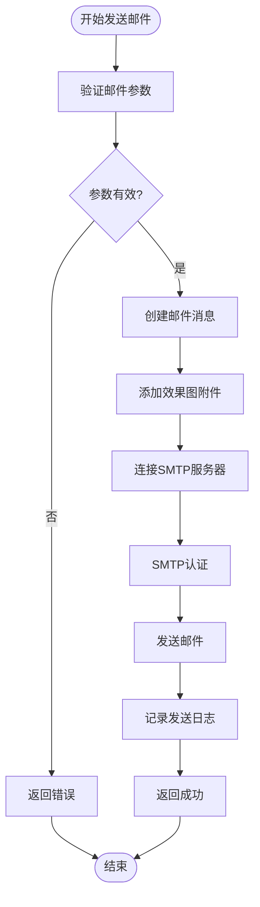

**图表来源**
- [backend/src/services/email_service.py:174-247](file://backend/src/services/email_service.py#L174-L247)

**章节来源**
- [backend/src/services/effect_image_service.py:77-181](file://backend/src/services/effect_image_service.py#L77-L181)
- [backend/src/services/pdf_service.py:51-75](file://backend/src/services/pdf_service.py#L51-L75)
- [backend/src/services/svg_pdf_service.py:447-484](file://backend/src/services/svg_pdf_service.py#L447-L484)
- [backend/src/services/email_service.py:174-247](file://backend/src/services/email_service.py#L174-L247)
- [backend/src/services/shipping_service.py:305-395](file://backend/src/services/shipping_service.py#L305-L395)

## 物流服务集成

系统集成了完整的4PX物流API服务，支持订单创建、面单生成、物流查询和取消操作。

### 4PX物流API客户端

#### API接口支持
- **订单创建**: `ds.xms.order.create` v1.1.0
- **面单获取**: `ds.xms.label.get` v1.1.0
- **物流产品查询**: `ds.xms.logistics_product.getlist` v1.0.0
- **订单取消**: `ds.xms.order.cancel` v1.0.0
- **订单查询**: `ds.xms.order.get` v1.1.0

#### 签名机制
4PX API采用MD5签名机制，签名规则：
```
sign = md5(app_key{AppKey}formatjsonmethod{method}timestamp{timestamp}v{v}{body}{AppSecret})
```

### 物流订单数据结构

#### 订单数据映射
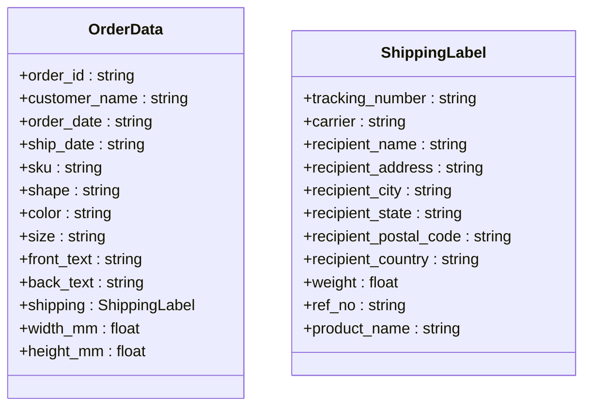

**图表来源**
- [backend/src/services/shipping_service.py:40-69](file://backend/src/services/shipping_service.py#L40-L69)

### 物流服务流程

#### 订单创建流程
1. **数据准备**: 从Supabase查询订单信息，构造4PX API参数
2. **隐私保护**: 对收件人电话进行混淆处理
3. **API调用**: 调用4PX创建订单接口
4. **面单生成**: 自动获取并保存物流面单
5. **状态更新**: 更新数据库中的物流信息和订单状态

#### 面单生成流程
1. **参数提取**: 从4PX响应中提取跟踪号
2. **API调用**: 调用面单获取接口
3. **URL解析**: 从响应中提取面单PDF URL
4. **存储更新**: 将面单URL保存到数据库

**章节来源**
- [backend/src/services/shipping_service.py:253-395](file://backend/src/services/shipping_service.py#L253-L395)
- [backend/src/api/main.py:449-593](file://backend/src/api/main.py#L449-L593)

## 字体管理服务

系统提供了完整的字体管理服务，支持动态字体文件获取和独立设计器工具。

### 字体文件管理

#### 支持的字体文件
系统支持以下字体文件：
- **正面字体**: F-01.ttf ~ F-08.ttf
- **背面字体**: back_standard.ttf

#### 字体特性配置
根据字体特性清单，各字体具有不同的缩放偏置和用途：

| 字体ID | 文件名 | 用途 | 缩放偏置 | 路径 |
|--------|--------|------|----------|------|
| F-01 | F-01.ttf | 正面名字：风格 A | 1.0 | \fonts\F-01.ttf |
| F-02 | F-02.ttf | 正面名字：风格 B | 1.0 | \fonts\F-02.ttf |
| F-03 | F-03.ttf | 正面名字：风格 C | 0.95 | \fonts\F-03.ttf |
| F-04 | F-04.ttf | 正面名字：风格 D | 1.05 | \fonts\F-04.ttf |
| F-05 | F-05.ttf | 正面名字：风格 E | 1.10 | \fonts\F-05.ttf |
| F-06 | F-06.ttf | 正面名字：风格 F | 1.0 | \fonts\F-06.ttf |
| F-07 | F-07.ttf | 正面名字：风格 G | 0.90 | \fonts\F-07.ttf |
| F-08 | F-08.ttf | 正面名字：风格 H | 1.0 | \fonts\F-08.ttf |
| back_standard | back_standard.ttf | 背面默认字体 | 1.0 | \fonts\back_standard.ttf |

### 字体API服务

#### 字体文件获取
- **路径**: `/fonts/{font_filename}`
- **支持格式**: `.ttf` 和 `.otf`
- **安全检查**: 仅允许字体文件访问
- **媒体类型**: 根据文件扩展名自动设置

#### 字体列表查询
- **路径**: `/api/fonts/list`
- **用途**: 获取所有可用字体文件名
- **响应**: 字体文件名数组

### 独立设计器集成

#### 动态字体加载
独立设计器支持动态字体加载机制：

```javascript
// 动态加载字体（支持 .ttf 和 .otf 格式）
async function loadFont(fontName) {
  if (loadedFonts.has(fontName)) return;
  
  // 尝试 .ttf 格式，如果不存在则尝试 .otf
  const formats = ['ttf', 'otf'];
  let loaded = false;
  
  for (const ext of formats) {
    try {
      const fontUrl = `http://localhost:8000/fonts/${fontName}.${ext}`;
      const style = document.createElement('style');
      const formatType = ext === 'ttf' ? 'truetype' : 'opentype';
      style.textContent = `
        @font-face {
          font-family: '${fontName}';
          src: url('${fontUrl}') format('${formatType}');
          font-weight: normal;
          font-style: normal;
        }
      `;
      document.head.appendChild(style);
      loadedFonts.add(fontName);
      loaded = true;
      break;
    } catch (e) {
      console.log(`Font ${fontName}.${ext} not found`);
    }
  }
}
```

#### 字体缓存机制
- **缓存策略**: 已加载字体自动缓存，避免重复加载
- **格式兼容**: 自动检测字体格式（TTF/OTF）
- **错误处理**: 字体加载失败时提供降级方案

**章节来源**
- [backend/src/api/main.py:157-201](file://backend/src/api/main.py#L157-L201)
- [backend/src/services/effect_image_service.py:40-78](file://backend/src/services/effect_image_service.py#L40-L78)
- [frontend/public/designer-standalone.html:384-496](file://frontend/public/designer-standalone.html#L384-L496)
- [backend/assets/sku_data/字体特性清单.csv:1-11](file://backend/assets/sku_data/字体特性清单.csv#L1-L11)

## 错误处理机制

系统实现了多层次的错误处理机制，支持双门户架构和新增的物流服务：

### 后端错误处理
- **HTTP异常**: 使用FastAPI的HTTPException处理业务逻辑错误
- **文件不存在**: 404错误处理，提示用户文件不存在
- **生成失败**: 500错误，包含详细的错误信息
- **数据库操作**: 事务回滚和异常捕获
- **Supabase连接**: 配置验证和连接失败处理
- **物流API错误**: 4PX API错误处理和重试机制
- **字体文件错误**: 字体文件不存在和格式错误处理

### 前端错误处理
- **网络请求错误**: 捕获HTTP状态码，显示友好错误信息
- **API调用错误**: 解析后端返回的错误详情
- **状态管理错误**: 统一的错误状态管理和用户提示
- **门户权限错误**: 根据门户类型显示相应的错误信息
- **物流操作错误**: 物流API调用失败的错误处理
- **字体加载错误**: 字体文件加载失败的降级处理

### 配置验证
- **环境变量检查**: 启动时验证必需的配置项
- **Supabase连接**: 验证Supabase连接配置
- **文件权限**: 确保输出目录可写
- **Storage桶验证**: 确保Storage桶存在且可访问
- **4PX配置验证**: 验证物流API密钥和沙盒配置
- **字体目录验证**: 确保字体文件存在且可访问

### 门户特定错误处理

#### 商店门户错误
- **密码错误**: 显示"密码错误，请重试"
- **店铺不存在**: 显示"店铺不存在"
- **权限不足**: 显示"您没有访问该商店的权限"

#### 工厂门户错误
- **访问限制**: 显示"工厂门户仅限工厂操作员访问"
- **会话过期**: 自动重定向到工厂登录页

#### 管理门户错误
- **主账号权限**: 子账号访问受限功能时显示"需要主账号权限"
- **系统维护**: 显示"系统正在维护中"

### 物流服务错误处理

#### 4PX API错误
- **签名失败**: 显示"4PX API签名验证失败"
- **请求超时**: 显示"物流API请求超时"
- **参数错误**: 显示"物流API参数验证失败"
- **配额限制**: 显示"4PX API调用配额已用完"

#### 物流操作错误
- **订单不存在**: 显示"订单信息不存在"
- **面单生成失败**: 显示"物流面单生成失败"
- **跟踪号无效**: 显示"无效的物流跟踪号"
- **取消失败**: 显示"物流订单取消失败"

**章节来源**
- [backend/src/api/main.py:124-125](file://backend/src/api/main.py#L124-L125)
- [frontend/src/utils/api.js:29-32](file://frontend/src/utils/api.js#L29-L32)
- [backend/src/config/settings.py:28-44](file://backend/src/config/settings.py#L28-L44)
- [backend/src/services/database_service.py:19-24](file://backend/src/services/database_service.py#L19-L24)
- [frontend/src/views/StorePortal/StoreLogin.vue:148-153](file://frontend/src/views/StorePortal/StoreLogin.vue#L148-L153)
- [backend/src/services/shipping_service.py:287-304](file://backend/src/services/shipping_service.py#L287-L304)

## 部署配置

### 环境变量配置

#### 后端配置 (backend/.env)
| 变量名 | 示例值 | 说明 |
|--------|--------|------|
| IMAP_SERVER | imap.qq.com | 邮箱IMAP服务器 |
| IMAP_PORT | 993 | 邮箱端口 |
| EMAIL_ADDRESS | user@163.com | 发送邮箱地址 |
| EMAIL_PASSWORD | your_password | 邮箱密码或授权码 |
| SUPABASE_URL | https://your-project.supabase.co | Supabase项目URL |
| SUPABASE_KEY | your-anon-key | Supabase访问密钥 |
| SUPABASE_SERVICE_KEY | your-service-key | Supabase服务密钥 |
| LOG_LEVEL | INFO | 日志级别 |
| FOURPX_APP_KEY | your_4px_app_key | 4PX应用密钥 |
| FOURPX_APP_SECRET | your_4px_app_secret | 4PX应用密钥 |
| FOURPX_SANDBOX | True | 4PX沙盒模式开关 |

#### 前端配置 (frontend/.env)
| 变量名 | 示例值 | 说明 |
|--------|--------|------|
| VITE_SUPABASE_URL | https://your-project.supabase.co | Supabase项目URL |
| VITE_SUPABASE_KEY | your-anon-public-key | Supabase公共密钥 |
| VITE_API_BASE_URL | http://localhost:8000 | 后端API基础URL |

### 依赖安装

#### 后端依赖
```bash
# 使用Poetry管理Python依赖
poetry install

# 或使用pip
pip install -r requirements.txt
```

#### 前端依赖
```bash
# 安装Node.js依赖
npm install

# 开发模式启动
npm run dev

# 生产构建
npm run build
```

### Supabase资源初始化

#### 多租户数据库初始化
```bash
# 初始化多租户数据库结构
python backend/scripts/init_multitenant.py

# 执行SQL脚本创建表结构
# 参考 backend/scripts/init_multitenant.sql
```

#### 子账号功能初始化
```sql
-- 执行子账号功能SQL脚本
-- 参考 backend/scripts/init_subaccount.sql
```

#### 创建Storage桶
```bash
# 上传本地资源到Supabase Storage
python backend/scripts/upload_assets_to_supabase.py
```

#### 数据库表结构更新
```sql
-- 在Supabase控制台执行
-- 参考 backend/scripts/supabase_schema_update.sql
```

### 物流服务配置

#### 4PX API配置
- **应用密钥**: 在`.env`文件中配置`FOURPX_APP_KEY`和`FOURPX_APP_SECRET`
- **沙盒模式**: 通过`FOURPX_SANDBOX`控制是否启用沙盒环境
- **API超时**: 默认30秒超时设置

#### 字体文件配置
- **字体目录**: `backend/assets/fonts/` 目录下放置字体文件
- **文件命名**: 遵循`F-01.ttf`到`F-08.ttf`和`back_standard.ttf`格式
- **权限设置**: 确保Web服务器可读取字体文件

**章节来源**
- [backend/.env.example:6-30](file://backend/.env.example#L6-L30)
- [frontend/.env.example:6-10](file://frontend/.env.example#L6-L10)
- [backend/pyproject.toml:8-35](file://backend/pyproject.toml#L8-L35)
- [frontend/package.json:6-10](file://frontend/package.json#L6-L10)
- [backend/scripts/upload_assets_to_supabase.py:171-207](file://backend/scripts/upload_assets_to_supabase.py#L171-L207)
- [backend/scripts/init_multitenant.py:15-112](file://backend/scripts/init_multitenant.py#L15-L112)

## 开发指南

### API开发规范

#### 请求模型定义
```python
class EffectImageRequest(BaseModel):
    order_id: str
    shape: str = "bone"
    color: str = "G"
    size: str = "large"
    text_front: str
    text_back: Optional[str] = ""
    font_code: str = "F-01"

class GenerateAllRequest(BaseModel):
    order_id: str  # Supabase UUID

class ShopLoginRequest(BaseModel):
    shop_code: str
    password: str

# 物流相关请求模型
class ShippingCreateOrderRequest(BaseModel):
    order_id: str
    logistics_product_code: str
    recipient_name: str
    recipient_phone: str
    recipient_email: Optional[str] = ""
    recipient_street: str
    recipient_city: str
    recipient_state: str
    recipient_postcode: str
    recipient_country: str = "US"
    weight_kg: float = 0.03
    declare_value: float = 10.0
    declare_currency: str = "USD"

class ShippingGetLabelRequest(BaseModel):
    tracking_number: Optional[str] = None
    order_no: Optional[str] = None

class ShippingGetProductsRequest(BaseModel):
    country_code: str
    postcode: Optional[str] = ""

class ShippingCancelOrderRequest(BaseModel):
    order_no: str
    reason: Optional[str] = ""

class ShippingQueryOrderRequest(BaseModel):
    order_no: str
```

#### 响应格式标准化
- 成功响应: `{"success": True, "data": {...}}`
- 错误响应: `{"success": False, "error": "错误信息"}`

### 前端开发规范

#### API调用封装
```javascript
export async function generateEffectImage(params) {
  const response = await fetch(`${API_BASE_URL}/api/effect-image/generate`, {
    method: 'POST',
    headers: {'Content-Type': 'application/json'},
    body: JSON.stringify(params),
  })
  
  if (!response.ok) {
    const error = await response.json()
    throw new Error(error.detail || '生成效果图失败')
  }
  
  return response.json()
}

export async function generateAndUploadEffect(orderId) {
  const response = await fetch(`${API_BASE_URL}/api/effect-image/generate-and-upload`, {
    method: 'POST',
    headers: {'Content-Type': 'application/json'},
    body: JSON.stringify({ order_id: orderId }),
  })
  
  if (!response.ok) {
    const error = await response.json()
    throw new Error(error.detail || '一键生成失败')
  }
  
  return response.json()
}

// 商店门户专用API
export async function shopLogin(shopCode, password) {
  const response = await fetch(`${API_BASE_URL}/api/shops/login`, {
    method: 'POST',
    headers: {'Content-Type': 'application/json'},
    body: JSON.stringify({ shop_code: shopCode, password }),
  })
  
  if (!response.ok) {
    const error = await response.json()
    throw new Error(error.detail || '登录失败')
  }
  
  return response.json()
}

// 物流服务API
export async function createShippingOrder(orderData) {
  const response = await fetch(`${API_BASE_URL}/api/shipping/create-order`, {
    method: 'POST',
    headers: {'Content-Type': 'application/json'},
    body: JSON.stringify(orderData),
  })
  
  if (!response.ok) {
    const error = await response.json()
    throw new Error(error.message || '创建物流订单失败')
  }
  
  return response.json()
}

export async function getShippingLabel(params) {
  const response = await fetch(`${API_BASE_URL}/api/shipping/get-label`, {
    method: 'POST',
    headers: {'Content-Type': 'application/json'},
    body: JSON.stringify(params),
  })
  
  if (!response.ok) {
    const error = await response.json()
    throw new Error(error.message || '获取面单失败')
  }
  
  return response.json()
}

// 字体管理API
export async function listFonts() {
  const response = await fetch(`${API_BASE_URL}/api/fonts/list`)
  
  if (!response.ok) {
    throw new Error('获取字体列表失败')
  }
  
  return response.json()
}

export function getFontUrl(fontName) {
  return `${API_BASE_URL}/fonts/${fontName}.ttf`
}
```

#### 状态管理最佳实践
- 使用Pinia进行全局状态管理
- 实现数据缓存和更新策略
- 提供错误边界和重试机制
- 支持多门户状态隔离
- 实现物流状态的实时更新

### 测试策略

#### 单元测试
- API接口测试
- 服务层功能测试
- 数据模型验证测试
- Supabase存储测试
- 门户权限测试
- 物流API集成测试
- 字体文件服务测试

#### 集成测试
- 端到端流程测试
- 数据库操作测试
- 文件生成和传输测试
- 一键生成和上传测试
- 多租户数据隔离测试
- 物流订单创建和跟踪测试
- 字体动态加载测试

### Supabase集成开发

#### 数据库服务使用
```javascript
// 获取订单列表
const { data } = await supabase
  .from('orders')
  .select('*')
  .eq('status', 'pending')

// 更新订单状态
await supabase
  .from('orders')
  .update({ status: 'producing' })
  .eq('id', orderId)

// 商店门户数据查询
const { data } = await supabase
  .from('orders')
  .select('*')
  .eq('shop_id', currentShop.id)

// 物流信息查询
const { data } = await supabase
  .from('logistics')
  .select('*')
  .eq('order_id', orderId)
```

#### 文件上传测试
```python
# 测试一键生成和上传
python backend/scripts/test_storage_upload.py

# 测试物流API
python backend/tests/API-sign 物流公司API测试工具/test_4px_api.py
```

### 物流服务开发

#### 4PX API测试
```python
# 测试物流API客户端
from backend.src.services.shipping_service import FourPXClient

client = FourPXClient(
    app_key="your_app_key",
    app_secret="your_app_secret",
    sandbox=True
)

# 测试订单创建
order_data = {
    "ref_no": "TEST001",
    "logistics_product_code": "U0107600",
    "recipient_info": {
        "recipient_name": "Test Customer",
        "recipient_phone": "+1234567890",
        "recipient_country": "US",
        "recipient_state": "CA",
        "recipient_city": "Los Angeles",
        "recipient_street": "123 Main St",
        "recipient_post_code": "90001"
    }
}

result = client.create_order(order_data)
print(result)
```

#### 字体管理测试
```python
# 测试字体文件服务
import requests

# 获取字体列表
response = requests.get("http://localhost:8000/api/fonts/list")
fonts = response.json()

# 获取特定字体
for font in fonts['fonts']:
    font_name = font['name']
    response = requests.get(f"http://localhost:8000/fonts/{font_name}.ttf")
    if response.status_code == 200:
        print(f"✓ Font {font_name} available")
    else:
        print(f"✗ Font {font_name} not found")
```

**章节来源**
- [backend/src/api/main.py:41-65](file://backend/src/api/main.py#L41-L65)
- [frontend/src/utils/api.js:20-35](file://frontend/src/utils/api.js#L20-L35)
- [frontend/src/stores/orderStore.js:201-240](file://frontend/src/stores/orderStore.js#L201-L240)
- [frontend/src/stores/shopStore.js:138-161](file://frontend/src/stores/shopStore.js#L138-L161)
- [backend/scripts/test_storage_upload.py:26-33](file://backend/scripts/test_storage_upload.py#L26-L33)
- [backend/src/services/shipping_service.py:287-304](file://backend/src/services/shipping_service.py#L287-L304)

## 故障排除

### 常见问题及解决方案

#### 1. CORS跨域问题
**症状**: 前端无法访问后端API
**解决方案**: 
- 检查CORS配置中的允许域名
- 确保前端开发服务器端口正确
- 验证后端CORS中间件配置

#### 2. Supabase连接失败
**症状**: Supabase连接错误
**解决方案**:
- 验证Supabase URL和密钥配置
- 检查网络连接和防火墙设置
- 确认数据库服务正常运行
- 验证Storage桶权限

#### 3. 文件生成失败
**症状**: 效果图生成异常
**解决方案**:
- 检查字体文件是否存在
- 验证模板文件完整性
- 确认输出目录权限
- 检查PDF生成依赖

#### 4. 邮件发送失败
**症状**: 邮件无法发送
**解决方案**:
- 验证邮箱账户配置
- 检查SMTP服务器设置
- 确认网络连接和防火墙规则

#### 5. 一键生成失败
**症状**: 效果图或PDF生成上传失败
**解决方案**:
- 检查Supabase Storage桶是否存在
- 验证文件权限和MIME类型
- 确认订单数据完整性
- 检查模板文件可用性

#### 6. 门户访问问题
**症状**: 无法访问特定门户
**解决方案**:
- 检查路由配置是否正确
- 验证用户权限是否足够
- 确认会话状态是否有效
- 检查门户特定的认证要求

#### 7. 多租户数据隔离问题
**症状**: 用户可以看到其他商店的数据
**解决方案**:
- 验证用户权限配置
- 检查数据查询过滤条件
- 确认商店ID关联正确
- 验证访问日志记录

#### 8. 物流API集成问题
**症状**: 4PX API调用失败
**解决方案**:
- 验证4PX应用密钥配置
- 检查网络连接和API可达性
- 确认签名算法实现正确
- 验证请求参数格式

#### 9. 字体文件加载失败
**症状**: 设计器无法加载字体
**解决方案**:
- 检查字体文件是否存在
- 验证文件权限设置
- 确认文件扩展名格式
- 检查浏览器字体支持

#### 10. 面单生成失败
**症状**: 物流面单无法生成
**解决方案**:
- 验证跟踪号有效性
- 检查4PX API响应状态
- 确认面单格式支持
- 验证存储权限设置

### 调试工具

#### 后端调试
- 使用Uvicorn开发服务器
- 启用详细日志记录
- 使用Postman测试API接口
- 检查Supabase连接状态
- 测试4PX API集成

#### 前端调试
- 浏览器开发者工具
- Vue DevTools扩展
- Supabase调试面板
- 网络请求监控
- 字体加载调试

### 性能优化建议

#### 后端优化
- 实现异步任务处理
- 优化数据库查询
- 添加缓存机制
- 使用连接池管理数据库连接
- 实现物流API请求缓存

#### 前端优化
- 实现数据懒加载
- 优化图片资源
- 使用虚拟滚动处理大量数据
- 实现文件预加载策略
- 优化字体加载性能

### Supabase资源管理

#### 存储桶管理
- `templates`: SVG模板存储
- `photos`: 产品实拍图存储
- `fonts`: 字体文件存储
- `effect-images`: 效果图存储
- `production-docs`: 生产文档存储
- `logistics-labels`: 物流面单存储

#### 数据库表关系
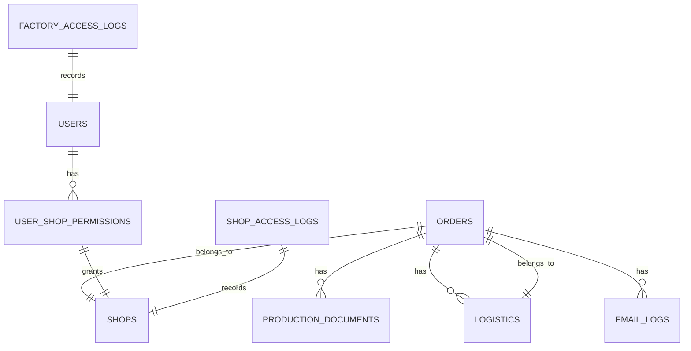

**图表来源**
- [docs/frontend-backend-api.md:10-24](file://docs/frontend-backend-api.md#L10-L24)
- [backend/scripts/init_multitenant.sql:95-116](file://backend/scripts/init_multitenant.sql#L95-L116)

**章节来源**
- [backend/src/api/main.py:29-36](file://backend/src/api/main.py#L29-L36)
- [backend/src/config/settings.py:28-44](file://backend/src/config/settings.py#L28-L44)
- [frontend/src/utils/supabase.js:8-10](file://frontend/src/utils/supabase.js#L8-L10)
- [backend/scripts/upload_assets_to_supabase.py:21-37](file://backend/scripts/upload_assets_to_supabase.py#L21-L37)
- [backend/scripts/init_multitenant.sql:27-116](file://backend/scripts/init_multitenant.sql#L27-L116)