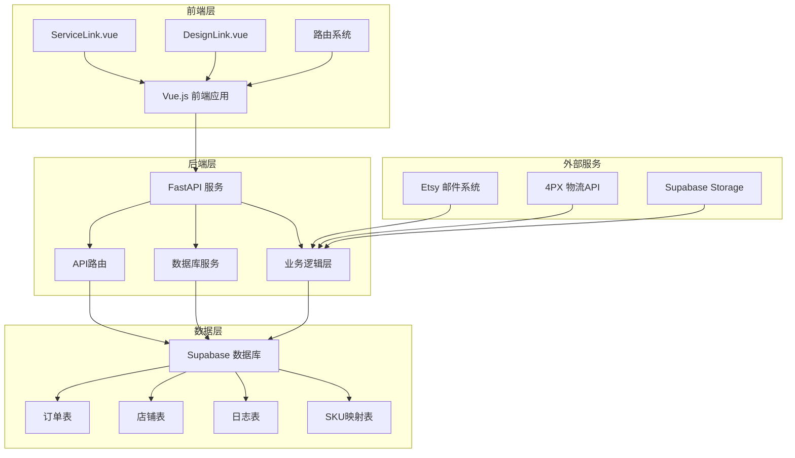
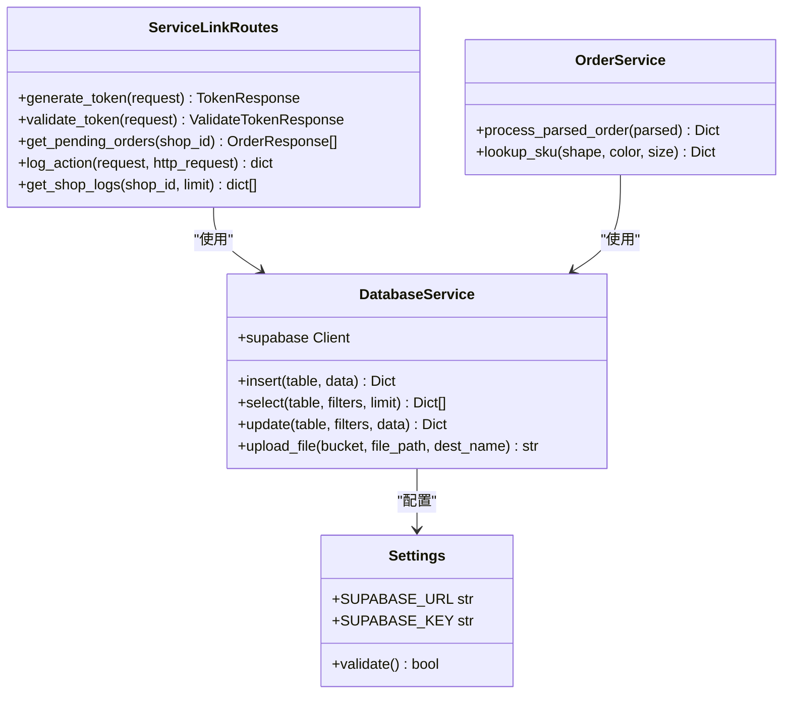
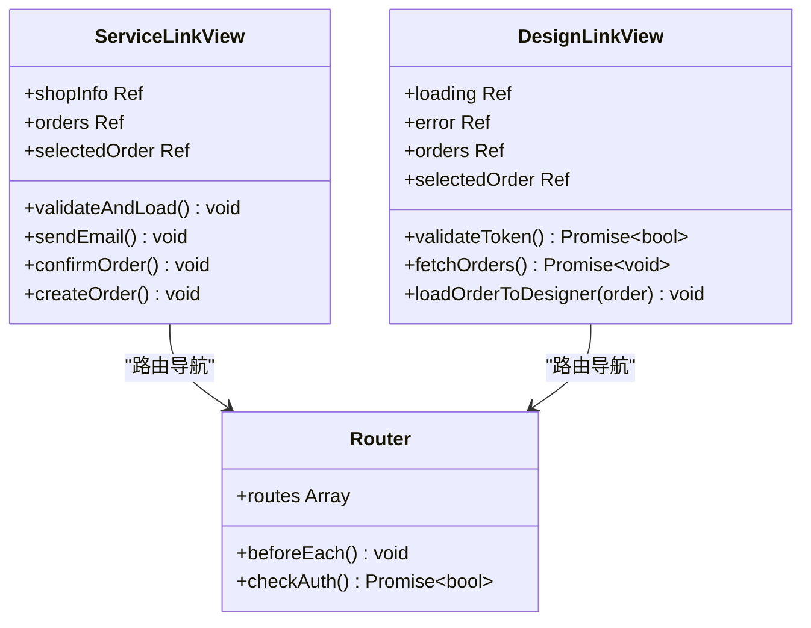
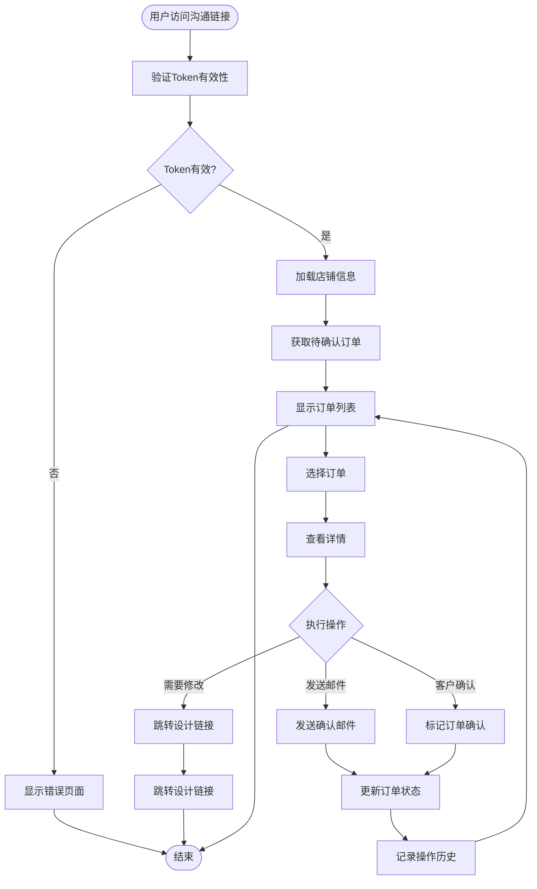
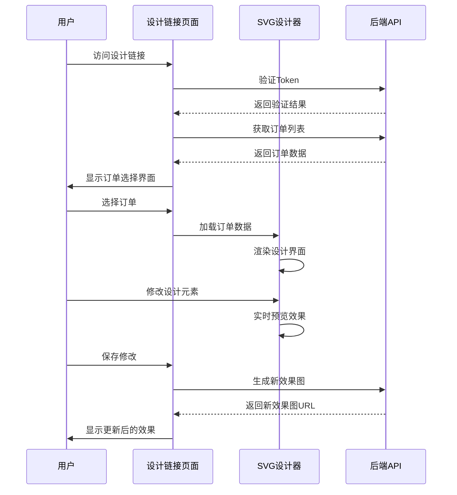
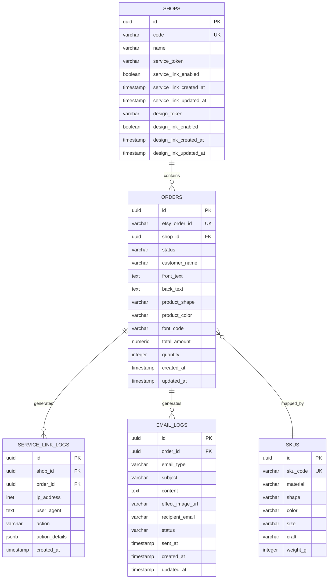
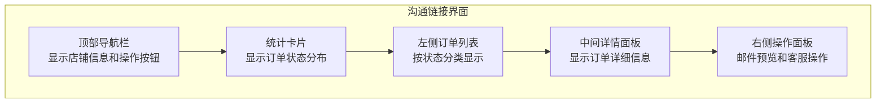
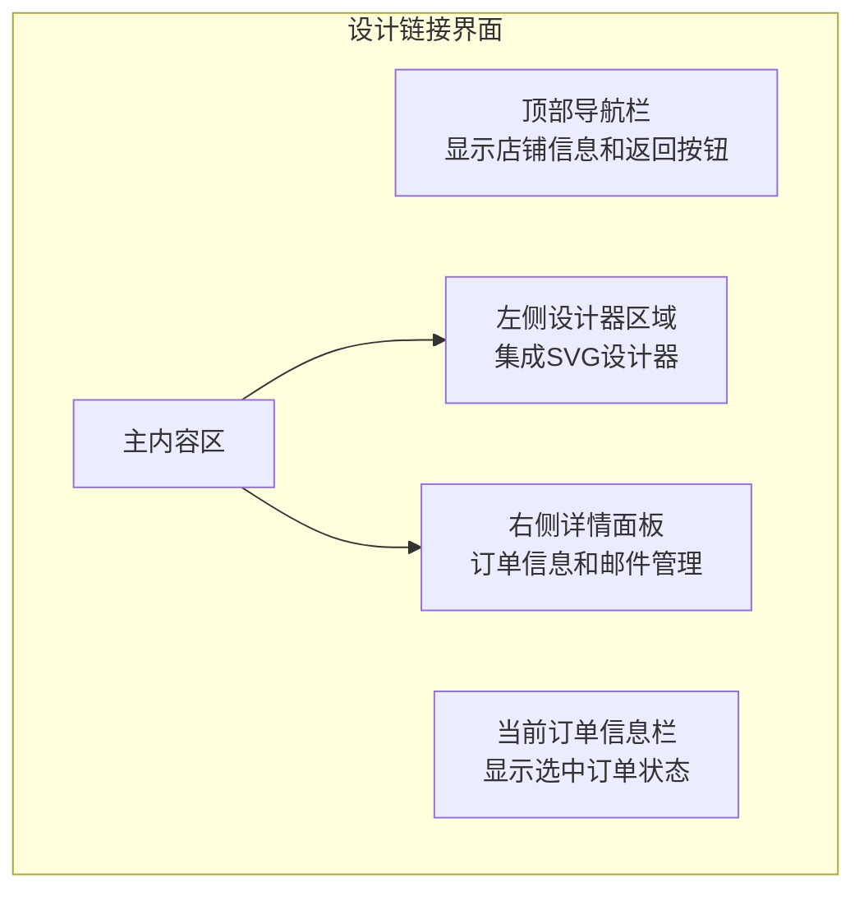
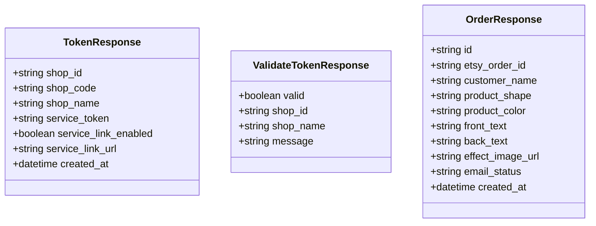
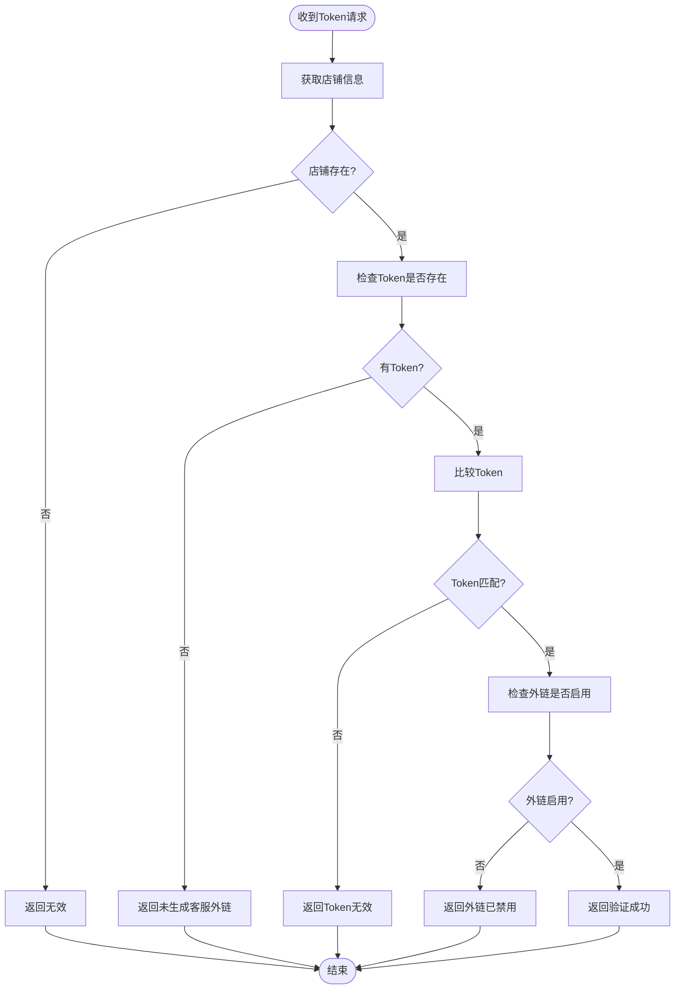

# 客服外链双链接系统

<cite>
**本文档引用的文件**
- [service_link_routes.py](file://backend/src/api/service_link_routes.py)
- [order.py](file://backend/src/models/order.py)
- [order_service.py](file://backend/src/services/order_service.py)
- [ServiceLink.vue](file://frontend/src/views/ServiceLink/ServiceLink.vue)
- [DesignLink.vue](file://frontend/src/views/DesignLink/DesignLink.vue)
- [database_service.py](file://backend/src/services/database_service.py)
- [pyproject.toml](file://backend/pyproject.toml)
- [package.json](file://frontend/package.json)
- [add_service_link_fields.sql](file://backend/scripts/add_service_link_fields.sql)
- [create_service_link_logs_table.sql](file://backend/scripts/create_service_link_logs_table.sql)
- [add_design_link_fields.sql](file://backend/scripts/add_design_link_fields.sql)
- [create_email_logs_table.sql](file://backend/scripts/create_email_logs_table.sql)
- [settings.py](file://backend/src/config/settings.py)
- [main.py](file://backend/src/api/main.py)
- [index.js](file://frontend/src/router/index.js)
</cite>

## 目录
1. [项目概述](#项目概述)
2. [系统架构](#系统架构)
3. [核心组件](#核心组件)
4. [双链接系统详解](#双链接系统详解)
5. [数据库设计](#数据库设计)
6. [前端界面设计](#前端界面设计)
7. [API接口规范](#api接口规范)
8. [安全机制](#安全机制)
9. [部署配置](#部署配置)
10. [故障排除指南](#故障排除指南)
11. [总结](#总结)

## 项目概述

客服外链双链接系统是一个专为Etsy订单管理设计的双通道客服外链解决方案。该系统提供了两种独立的客服访问入口：沟通链接（Service Link）和设计链接（Design Link），实现了订单处理流程的分离和专业化分工。

### 系统特色

- **双链接架构**：提供两个独立的客服访问入口，分别专注于不同的业务场景
- **安全令牌机制**：基于随机生成的安全令牌，确保链接访问的安全性
- **实时订单处理**：支持实时订单状态管理和操作记录
- **前后端分离**：采用现代化的前后端分离架构，提升用户体验
- **多店铺支持**：支持多店铺管理，每个店铺拥有独立的配置和权限

## 系统架构

**图表来源**
- [main.py:37-58](file://backend/src/api/main.py#L37-L58)
- [database_service.py:10-28](file://backend/src/services/database_service.py#L10-L28)

### 技术栈

**后端技术栈**
- Python 3.10+
- FastAPI 0.128.2
- Supabase 2.27.2
- SQLAlchemy 2.0.25
- Uvicorn 0.40.0

**前端技术栈**
- Vue.js 3.5.24
- Element Plus 2.13.2
- Vue Router 4.6.4
- Pinia 3.0.4
- Vite 7.2.4

**Section sources**
- [pyproject.toml:8-35](file://backend/pyproject.toml#L8-L35)
- [package.json:11-20](file://frontend/package.json#L11-L20)

## 核心组件

### 后端核心组件

**图表来源**
- [service_link_routes.py:17-335](file://backend/src/api/service_link_routes.py#L17-L335)
- [database_service.py:10-117](file://backend/src/services/database_service.py#L10-L117)
- [order_service.py:91-145](file://backend/src/services/order_service.py#L91-L145)

### 前端核心组件

**图表来源**
- [ServiceLink.vue:227-420](file://frontend/src/views/ServiceLink/ServiceLink.vue#L227-L420)
- [DesignLink.vue:238-493](file://frontend/src/views/DesignLink/DesignLink.vue#L238-L493)
- [index.js:1-226](file://frontend/src/router/index.js#L1-L226)

**Section sources**
- [service_link_routes.py:17-516](file://backend/src/api/service_link_routes.py#L17-L516)
- [ServiceLink.vue:227-818](file://frontend/src/views/ServiceLink/ServiceLink.vue#L227-L818)
- [DesignLink.vue:238-925](file://frontend/src/views/DesignLink/DesignLink.vue#L238-L925)

## 双链接系统详解

### 沟通链接（Service Link）

沟通链接专注于订单的沟通和确认流程，提供以下核心功能：

#### 功能特性
- **订单状态管理**：查看待确认订单，跟踪邮件发送状态
- **实时沟通**：支持客服与客户之间的沟通协调
- **操作记录**：完整记录客服的所有操作历史
- **批量处理**：支持多个订单的批量处理和状态更新

#### 用户界面设计

**图表来源**
- [ServiceLink.vue:254-385](file://frontend/src/views/ServiceLink/ServiceLink.vue#L254-L385)

### 设计链接（Design Link）

设计链接专注于订单的设计修改和效果预览，提供以下核心功能：

#### 功能特性
- **实时设计器**：集成独立的SVG设计器，支持实时效果预览
- **设计修改**：允许客服直接修改订单设计元素
- **效果生成**：自动生成和上传效果图
- **历史追踪**：完整记录设计修改的历史过程

#### 设计器集成

**图表来源**
- [DesignLink.vue:269-448](file://frontend/src/views/DesignLink/DesignLink.vue#L269-L448)
- [service_link_routes.py:359-516](file://backend/src/api/service_link_routes.py#L359-L516)

**Section sources**
- [ServiceLink.vue:1-818](file://frontend/src/views/ServiceLink/ServiceLink.vue#L1-L818)
- [DesignLink.vue:1-925](file://frontend/src/views/DesignLink/DesignLink.vue#L1-L925)

## 数据库设计

### 数据库表结构

**图表来源**
- [add_service_link_fields.sql:4-18](file://backend/scripts/add_service_link_fields.sql#L4-L18)
- [create_service_link_logs_table.sql:4-21](file://backend/scripts/create_service_link_logs_table.sql#L4-L21)
- [create_email_logs_table.sql:2-15](file://backend/scripts/create_email_logs_table.sql#L2-L15)

### 数据库迁移脚本

系统包含完整的数据库迁移脚本，确保数据库结构的一致性和完整性：

#### 店铺表扩展
- 添加 `service_token` 字段用于沟通链接验证
- 添加 `service_link_enabled` 字段控制链接启用状态
- 添加 `design_token` 字段用于设计链接验证
- 添加 `design_link_enabled` 字段控制设计链接启用状态

#### 日志表创建
- `service_link_logs`：记录客服外链访问和操作历史
- `email_logs`：记录邮件发送状态和内容

**Section sources**
- [add_service_link_fields.sql:1-30](file://backend/scripts/add_service_link_fields.sql#L1-L30)
- [add_design_link_fields.sql:1-30](file://backend/scripts/add_design_link_fields.sql#L1-L30)
- [create_service_link_logs_table.sql:1-38](file://backend/scripts/create_service_link_logs_table.sql#L1-L38)
- [create_email_logs_table.sql:1-32](file://backend/scripts/create_email_logs_table.sql#L1-L32)

## 前端界面设计

### 沟通链接界面

沟通链接界面采用简洁直观的设计风格，专注于订单处理的核心功能：

#### 界面布局

**图表来源**
- [ServiceLink.vue:1-225](file://frontend/src/views/ServiceLink/ServiceLink.vue#L1-L225)

#### 核心功能区域

1. **顶部导航**：显示店铺基本信息和设计链接跳转按钮
2. **统计面板**：实时显示各类订单状态的数量统计
3. **订单列表**：左侧显示所有待处理订单，支持快速筛选
4. **订单详情**：中间区域显示选中订单的详细信息和效果预览
5. **操作面板**：右侧提供邮件发送、订单确认等核心操作

### 设计链接界面

设计链接界面提供专业的设计修改环境：

#### 界面布局

**图表来源**
- [DesignLink.vue:1-236](file://frontend/src/views/DesignLink/DesignLink.vue#L1-L236)

#### 设计器集成特点

1. **独立设计器**：通过iframe集成独立的SVG设计器
2. **实时预览**：设计修改实时反映在设计器中
3. **订单数据同步**：自动加载订单数据到设计器
4. **历史记录**：完整记录设计修改的历史过程

**Section sources**
- [ServiceLink.vue:1-818](file://frontend/src/views/ServiceLink/ServiceLink.vue#L1-L818)
- [DesignLink.vue:1-925](file://frontend/src/views/DesignLink/DesignLink.vue#L1-L925)

## API接口规范

### 沟通链接API

#### 认证相关接口

| 接口 | 方法 | 路径 | 功能描述 |
|------|------|------|----------|
| 生成Token | POST | `/service-link/generate-token` | 生成或刷新店铺的客服外链Token |
| 获取Token | GET | `/service-link/shops/{shop_id}/token` | 获取店铺的客服外链信息 |
| 切换状态 | POST | `/service-link/shops/{shop_id}/toggle` | 启用或禁用店铺的客服外链 |
| 验证Token | POST | `/service-link/validate` | 验证客服外链Token是否有效 |

#### 订单相关接口

| 接口 | 方法 | 路径 | 功能描述 |
|------|------|------|----------|
| 获取待处理订单 | GET | `/service-link/shops/{shop_id}/pending-orders` | 获取店铺的待确认订单 |
| 记录操作日志 | POST | `/service-link/log-action` | 记录客服操作日志 |
| 获取店铺日志 | GET | `/service-link/shops/{shop_id}/logs` | 获取店铺的操作日志 |

### 设计链接API

#### 设计链接专用接口

| 接口 | 方法 | 路径 | 功能描述 |
|------|------|------|----------|
| 生成设计链接Token | POST | `/service-link/design-link/generate-token` | 生成或刷新店铺的设计链接Token |
| 获取设计链接Token | GET | `/service-link/design-link/shops/{shop_id}/token` | 获取店铺的设计链接信息 |
| 切换设计链接状态 | POST | `/service-link/design-link/shops/{shop_id}/toggle` | 启用或禁用店铺的设计链接 |
| 验证设计链接Token | POST | `/service-link/design-link/validate` | 验证设计链接Token是否有效 |

### 数据模型定义

#### Token响应模型

**图表来源**
- [service_link_routes.py:28-65](file://backend/src/api/service_link_routes.py#L28-L65)

**Section sources**
- [service_link_routes.py:90-330](file://backend/src/api/service_link_routes.py#L90-L330)

## 安全机制

### Token安全设计

系统采用高强度的安全令牌机制，确保外链访问的安全性：

#### Token生成策略
- 使用 `secrets.token_hex(32)` 生成32字节随机数据
- 生成64位十六进制字符串作为安全令牌
- 每次生成都会覆盖之前的令牌，确保安全性

#### Token验证流程

**图表来源**
- [service_link_routes.py:208-246](file://backend/src/api/service_link_routes.py#L208-L246)

### 访问控制机制

#### IP地址和User-Agent记录
- 自动记录每次操作的IP地址
- 记录User-Agent信息用于设备识别
- 便于审计和安全监控

#### 日志记录策略
- 记录所有客服操作行为
- 包含操作类型、时间、详情等信息
- 支持历史追溯和责任认定

**Section sources**
- [service_link_routes.py:280-329](file://backend/src/api/service_link_routes.py#L280-L329)

## 部署配置

### 环境变量配置

系统需要以下关键环境变量：

| 环境变量 | 必需 | 默认值 | 说明 |
|----------|------|--------|------|
| SUPABASE_URL | 是 | 空 | Supabase数据库URL |
| SUPABASE_KEY | 是 | 空 | Supabase访问密钥 |
| IMAP_SERVER | 否 | imap.qq.com | 邮件服务器地址 |
| IMAP_PORT | 否 | 993 | 邮件服务器端口 |
| EMAIL_ADDRESS | 否 | 空 | 邮箱用户名 |
| EMAIL_PASSWORD | 否 | 空 | 邮箱密码 |
| FOURPX_APP_KEY | 否 | 空 | 4PX物流API密钥 |
| FOURPX_APP_SECRET | 否 | 空 | 4PX物流API密钥 |
| ZHIPU_API_KEY | 否 | 空 | 智谱AI翻译API密钥 |

### 依赖包管理

#### 后端依赖
- FastAPI：主要Web框架
- Supabase：数据库和存储服务
- SQLAlchemy：数据库ORM
- Pillow：图像处理
- ReportLab：PDF生成
- Svgwrite：SVG生成

#### 前端依赖
- Vue.js：前端框架
- Element Plus：UI组件库
- Vue Router：路由管理
- Axios：HTTP客户端
- Pinia：状态管理

**Section sources**
- [settings.py:12-65](file://backend/src/config/settings.py#L12-L65)
- [pyproject.toml:8-35](file://backend/pyproject.toml#L8-L35)
- [package.json:11-20](file://frontend/package.json#L11-L20)

## 故障排除指南

### 常见问题及解决方案

#### Token验证失败
**问题描述**：客服无法访问外链页面
**可能原因**：
- Token已过期或被覆盖
- 店铺外链功能被禁用
- 店铺信息不存在

**解决步骤**：
1. 检查店铺是否已生成Token
2. 确认外链功能是否启用
3. 重新生成新的Token

#### 订单数据加载失败
**问题描述**：页面显示空白或加载超时
**可能原因**：
- 数据库连接异常
- 网络连接问题
- 订单数据格式错误

**解决步骤**：
1. 检查数据库连接状态
2. 验证网络连接稳定性
3. 检查订单数据完整性

#### 设计器无法加载
**问题描述**：设计链接页面显示空白
**可能原因**：
- iframe加载失败
- 跨域问题
- 设计器资源缺失

**解决步骤**：
1. 检查iframe源地址
2. 验证跨域配置
3. 确认设计器资源可用性

### 性能优化建议

#### 数据库优化
- 为常用查询字段建立索引
- 优化复杂查询语句
- 定期清理历史日志数据

#### 前端性能优化
- 实现懒加载和分页
- 优化图片和SVG资源
- 减少不必要的DOM操作

#### 缓存策略
- 启用浏览器缓存
- 实现API响应缓存
- 使用CDN加速静态资源

## 总结

客服外链双链接系统通过创新的双通道设计，为Etsy订单管理提供了高效、安全、易用的解决方案。系统的主要优势包括：

### 核心优势

1. **专业化分工**：沟通链接和设计链接分离，各司其职
2. **安全保障**：基于Token的安全验证机制
3. **用户体验**：直观的界面设计和流畅的操作体验
4. **扩展性强**：模块化的架构设计，易于功能扩展
5. **维护友好**：清晰的代码结构和完善的文档

### 技术亮点

- **前后端分离**：现代化的技术栈组合
- **实时交互**：支持实时的数据更新和效果预览
- **多店铺支持**：灵活的多租户架构
- **完整日志**：全面的操作记录和审计功能

### 应用价值

该系统显著提升了客服工作效率，减少了人工干预需求，为电商运营提供了强有力的技术支撑。通过持续的功能优化和性能提升，系统将继续为企业创造更大的价值。