# 客服外链左侧栏模板

<cite>
**本文档引用的文件**
- [ServiceLink.vue](file://frontend/src/views/ServiceLink/ServiceLink.vue)
- [store_orders_customer_service_preview.html](file://frontend/tests/store_orders_customer_service_preview.html)
- [客服外链左侧栏.html](file://backend/tests/客服外链左侧栏.html)
- [orderStore.js](file://frontend/src/stores/orderStore.js)
- [order.py](file://backend/src/models/order.py)
- [service_link_routes.py](file://backend/src/api/service_link_routes.py)
- [supabase.js](file://frontend/src/utils/supabase.js)
- [create_tables_sql.md](file://backend/scripts/create_tables_sql.md)
- [开发文档-页面状态按钮-v1.0.md](file://docs/开发文档-页面状态按钮-v1.0.md)
- [README.md](file://README.md)
</cite>

## 更新摘要
**变更内容**
- 系统已简化为纯Vue3组件架构，移除了响应式设计和Tailwind CSS集成
- 移除了纯HTML模板演示文件，专注于Vue组件的实际实现
- 左侧栏采用简化的固定宽度设计，提供核心的订单管理功能
- 保留了完整的订单状态管理和用户交互功能

## 目录
1. [项目概述](#项目概述)
2. [系统架构](#系统架构)
3. [核心组件](#核心组件)
4. [左侧栏模板设计](#左侧栏模板设计)
5. [Vue组件架构](#vue组件架构)
6. [数据流分析](#数据流分析)
7. [状态管理](#状态管理)
8. [API接口设计](#api接口设计)
9. [性能考虑](#性能考虑)
10. [故障排除指南](#故障排除指南)
11. [总结](#总结)

## 项目概述

客服外链左侧栏模板是ETSY订单自动化系统中的核心组件，专门为客服人员提供简洁高效的订单管理界面。该模板专注于提供核心的订单查看、确认、修改请求等基础功能，采用简化的Vue3组件架构，确保系统的稳定性和易维护性。

### 主要功能特性

- **订单列表展示**：左侧固定宽度的订单列表，支持新订单和已发送效果图订单的分类显示
- **订单详情查看**：右侧详细展示订单信息，包括效果图预览、产品规格、个性化信息等
- **客服操作功能**：支持订单确认、请求修改、设计修改等核心业务操作
- **邮件内容预览**：提供标准邮件模板，支持一键复制功能
- **操作历史记录**：记录客服的所有操作行为，便于审计和追踪
- **简化的用户界面**：移除复杂的响应式设计，专注于核心功能体验

## 系统架构

系统采用简化的Vue3 + Element Plus架构，前端使用Vue3 Composition API，后端基于FastAPI构建RESTful API。

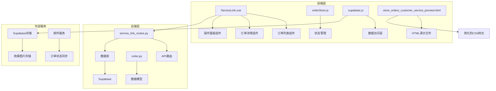

**图表来源**
- [ServiceLink.vue:1-800](file://frontend/src/views/ServiceLink/ServiceLink.vue#L1-L800)
- [service_link_routes.py:1-522](file://backend/src/api/service_link_routes.py#L1-L522)
- [store_orders_customer_service_preview.html:1-272](file://frontend/tests/store_orders_customer_service_preview.html#L1-L272)

## 核心组件

### 1. 订单列表组件

左侧栏的核心是订单列表组件，采用固定宽度设计（320px），确保用户界面的一致性和简洁性。

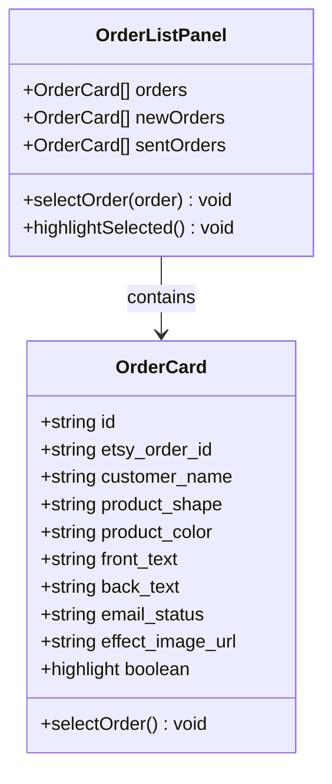

**图表来源**
- [ServiceLink.vue:82-153](file://frontend/src/views/ServiceLink/ServiceLink.vue#L82-L153)

### 2. 订单详情组件

右侧详情区域提供完整的订单信息展示，包括效果图预览、产品规格、个性化信息等。

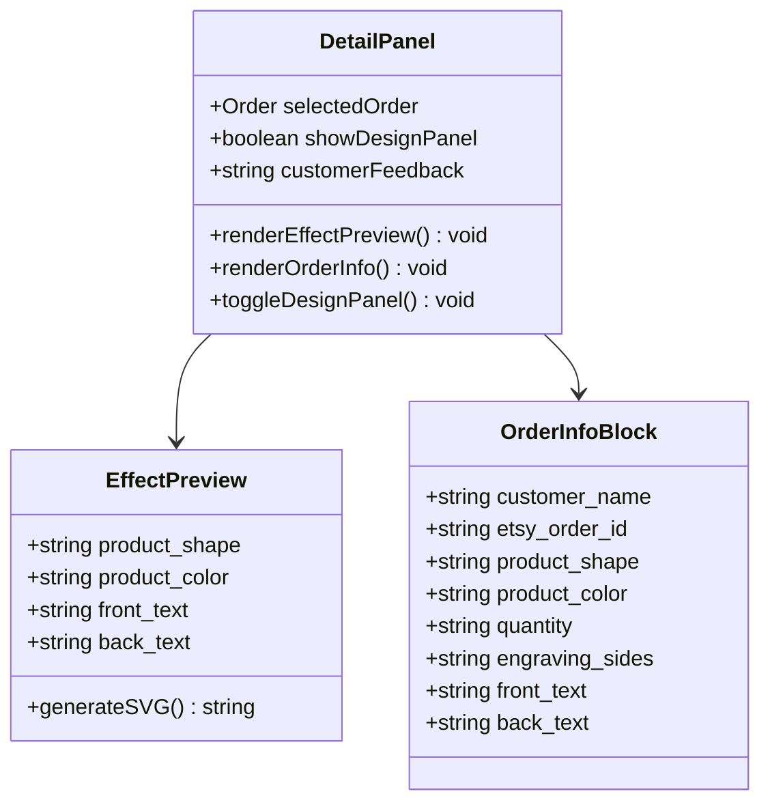

**图表来源**
- [ServiceLink.vue:155-296](file://frontend/src/views/ServiceLink/ServiceLink.vue#L155-L296)

### 3. 操作面板组件

右侧操作面板提供客服常用功能入口，包括确认订单、请求修改、设计修改等操作。

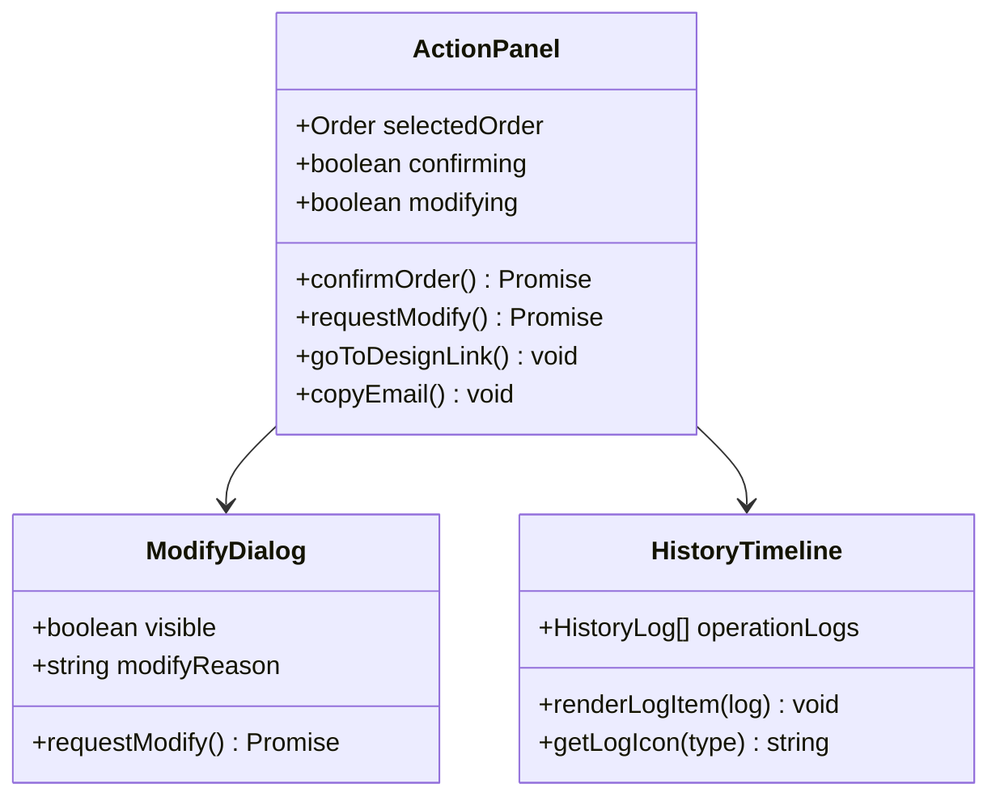

**图表来源**
- [ServiceLink.vue:298-384](file://frontend/src/views/ServiceLink/ServiceLink.vue#L298-L384)

## 左侧栏模板设计

### 1. 布局结构

左侧栏采用简化的固定宽度设计，确保在不同屏幕尺寸下都能保持良好的用户体验。

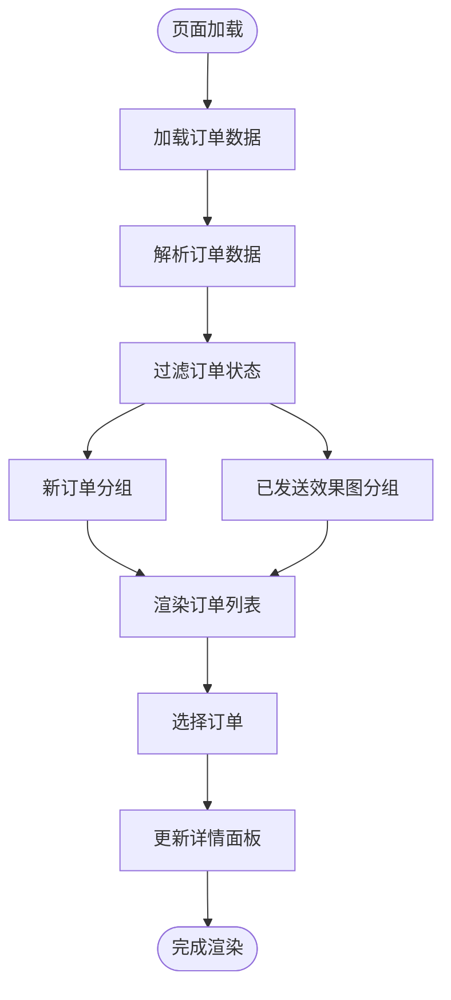

**图表来源**
- [ServiceLink.vue:454-619](file://frontend/src/views/ServiceLink/ServiceLink.vue#L454-L619)

### 2. 订单状态管理

系统支持多种订单状态，左侧栏根据状态进行智能分组和高亮显示。

| 状态 | 显示样式 | 功能特性 |
|------|----------|----------|
| new | 蓝色边框高亮 | 新订单，需要处理 |
| sent | 蓝色标签 | 已发送效果图，等待确认 |
| confirmed | 绿色标签 | 已确认订单，无需操作 |
| modify | 粉色标签 | 需要修改的订单 |

### 3. 用户交互设计

左侧栏提供了简洁的用户交互功能：

- **点击选择**：点击任意订单卡片即可查看详情
- **高亮显示**：当前选中的订单会有明显的视觉高亮
- **状态标识**：每个订单都有对应的状态标签
- **快速导航**：支持键盘快捷键和鼠标操作

## Vue组件架构

### 1. 组件层次结构

系统采用简化的Vue3组件架构，移除了复杂的响应式设计，专注于核心功能实现。

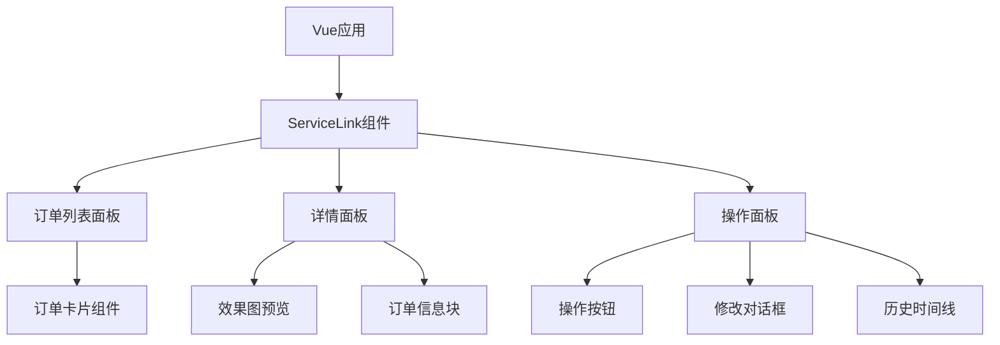

**图表来源**
- [ServiceLink.vue:1-800](file://frontend/src/views/ServiceLink/ServiceLink.vue#L1-L800)

### 2. 简化的样式设计

系统采用简化的CSS样式设计，移除了Tailwind CSS的复杂配置，专注于核心功能的视觉呈现。

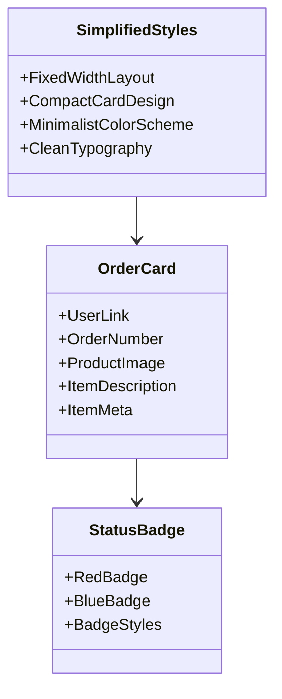

**图表来源**
- [ServiceLink.vue:77-168](file://frontend/src/views/ServiceLink/ServiceLink.vue#L77-L168)

### 3. 组件通信机制

Vue3 Composition API提供了简洁的组件通信机制，支持父子组件间的高效数据传递。

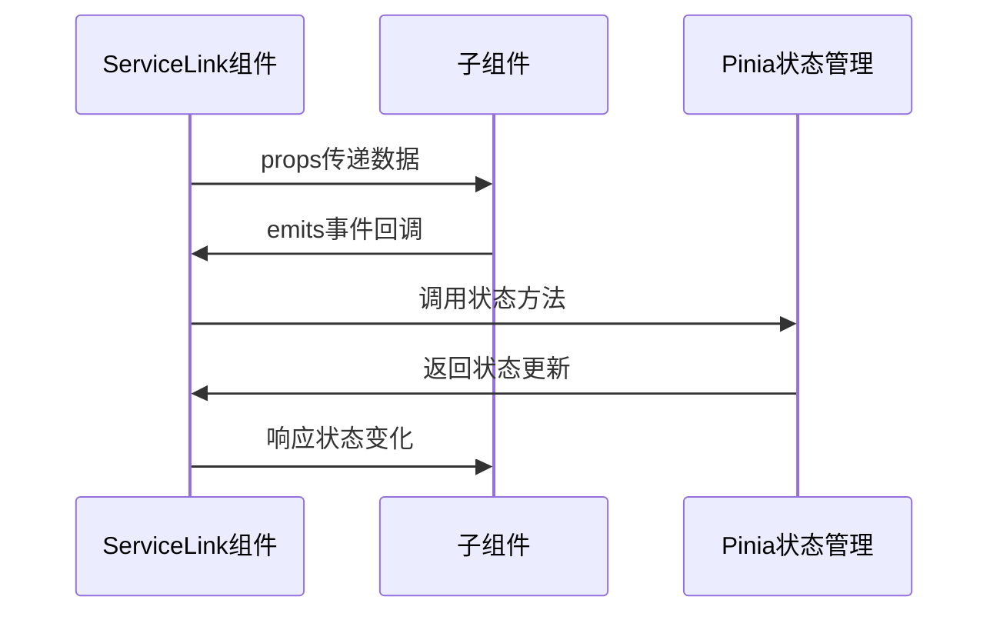

**图表来源**
- [ServiceLink.vue:464-800](file://frontend/src/views/ServiceLink/ServiceLink.vue#L464-L800)

## 数据流分析

### 1. 数据获取流程

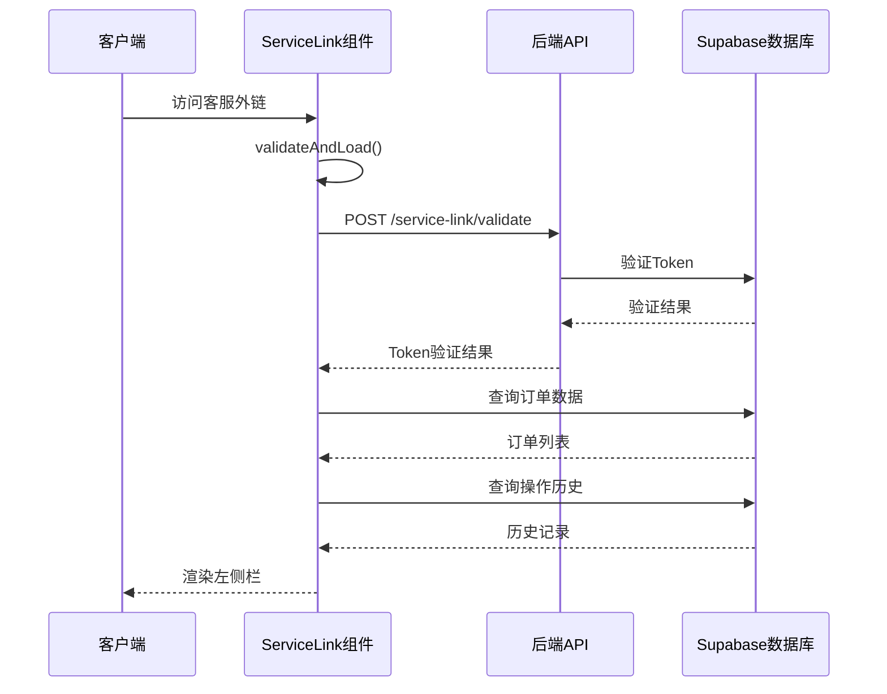

**图表来源**
- [ServiceLink.vue:514-576](file://frontend/src/views/ServiceLink/ServiceLink.vue#L514-L576)
- [service_link_routes.py:210-251](file://backend/src/api/service_link_routes.py#L210-L251)

### 2. 订单状态更新流程

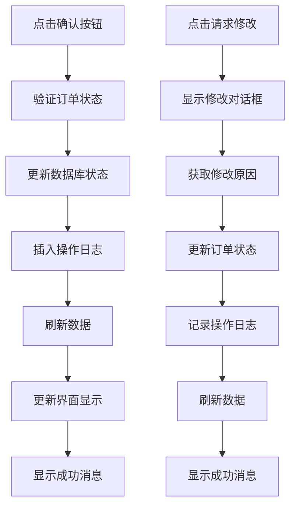

**图表来源**
- [ServiceLink.vue:727-786](file://frontend/src/views/ServiceLink/ServiceLink.vue#L727-L786)

## 状态管理

### 1. 前端状态管理

系统使用Pinia进行状态管理，主要状态包括：

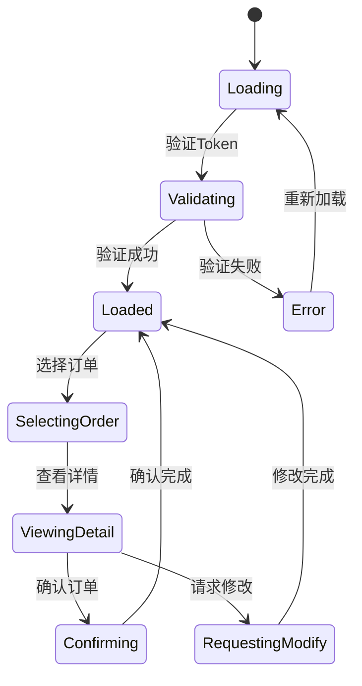

**图表来源**
- [orderStore.js:23-113](file://frontend/src/stores/orderStore.js#L23-L113)

### 2. 后端状态管理

后端使用SQLAlchemy ORM管理订单状态，支持完整的状态转换：

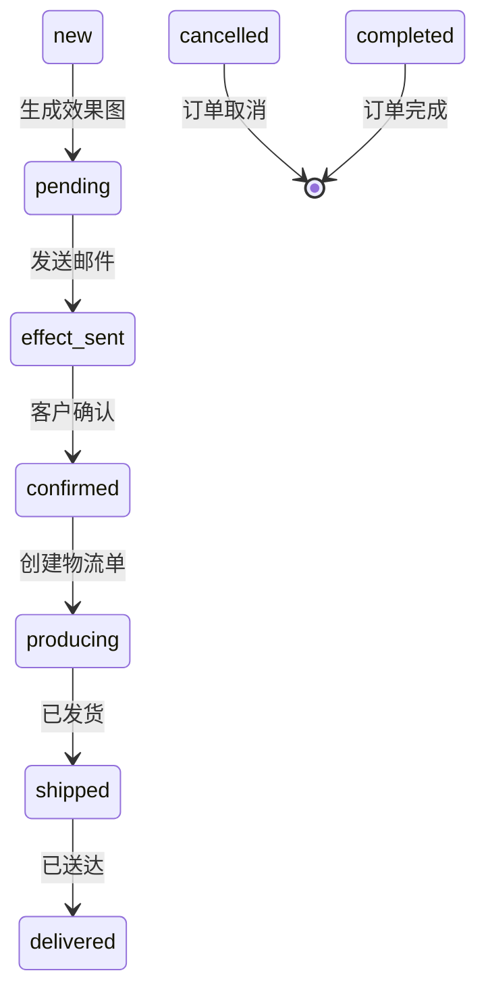

**图表来源**
- [order.py:23-106](file://backend/src/models/order.py#L23-L106)

## API接口设计

### 1. 客服外链认证API

| 接口 | 方法 | 描述 | 请求参数 | 响应数据 |
|------|------|------|----------|----------|
| `/service-link/validate` | POST | 验证客服外链Token | shop_code, token | ValidateTokenResponse |
| `/service-link/shops/{shop_id}/pending-orders` | GET | 获取待确认订单 | shop_id | List[OrderResponse] |
| `/service-link/log-action` | POST | 记录客服操作日志 | shop_id, order_id, action | {success: boolean} |

### 2. 设计链接API

| 接口 | 方法 | 描述 | 请求参数 | 响应数据 |
|------|------|------|----------|----------|
| `/service-link/design-link/validate` | POST | 验证设计链接Token | shop_code, token | ValidateTokenResponse |
| `/service-link/design-link/generate-token` | POST | 生成设计链接Token | shop_id, enabled | DesignTokenResponse |

### 3. 数据模型定义

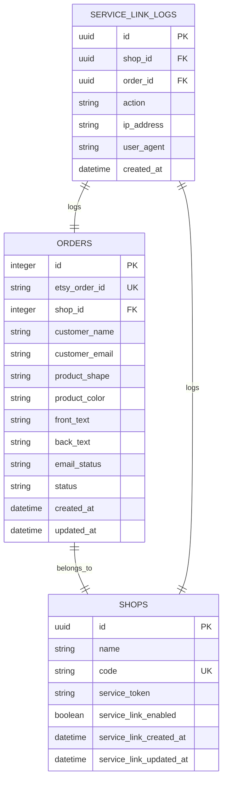

**图表来源**
- [order.py:23-244](file://backend/src/models/order.py#L23-L244)
- [service_link_routes.py:20-73](file://backend/src/api/service_link_routes.py#L20-L73)

## 性能考虑

### 1. 数据加载优化

- **并行查询**：同时加载订单数据和SKU信息，减少等待时间
- **缓存机制**：使用Supabase的自动缓存机制提高数据访问速度
- **懒加载**：详情面板按需加载，避免不必要的资源消耗

### 2. 网络优化

- **错误重试**：网络异常时自动重试机制
- **超时控制**：设置合理的请求超时时间
- **离线处理**：支持基本功能的离线使用

### 3. 内存管理

- **组件卸载**：离开页面时自动清理事件监听器
- **数据清理**：及时释放不再使用的数据引用
- **垃圾回收**：利用Vue3的响应式系统自动管理内存

### 4. Vue组件优化

- **简化的模板**：移除复杂的响应式类名，减少DOM操作
- **静态样式**：使用内联样式，避免CSS类名冲突
- **组件复用**：优化组件结构，减少不必要的嵌套

## 故障排除指南

### 1. 常见问题及解决方案

| 问题类型 | 症状描述 | 解决方案 |
|----------|----------|----------|
| Token验证失败 | 页面显示"链接无效或已过期" | 检查URL参数是否正确，重新生成Token |
| 网络连接失败 | 页面显示"网络连接失败" | 检查网络连接，重试加载 |
| 订单数据为空 | 订单列表显示为空 | 检查数据库连接，确认有订单数据 |
| 操作失败 | 点击按钮无响应 | 查看浏览器控制台错误信息 |
| Vue组件渲染错误 | 页面空白或显示异常 | 检查组件导入和依赖关系 |

### 2. 调试方法

- **浏览器开发者工具**：检查网络请求和JavaScript错误
- **Supabase控制台**：监控数据库查询和存储操作
- **后端日志**：查看API请求和响应日志

### 3. 性能监控

- **加载时间**：监控页面加载和数据获取时间
- **内存使用**：定期检查内存泄漏情况
- **错误率**：统计API调用失败率

## 总结

客服外链左侧栏模板是一个功能完整、设计简化的订单管理界面。它采用了简化的Vue3组件架构，移除了复杂的响应式设计和第三方CSS框架，专注于提供核心的订单管理功能。

### 主要优势

1. **用户体验优秀**：清晰的布局设计，直观的操作流程
2. **功能完整**：涵盖订单管理的各个环节
3. **技术先进**：采用Vue3 + FastAPI的现代技术栈
4. **扩展性强**：模块化设计便于功能扩展
5. **安全性高**：完善的Token验证和权限控制
6. **简化的架构**：移除复杂依赖，提高系统稳定性
7. **易于维护**：简化的代码结构便于长期维护

### 技术特色

- **简化的Vue3架构**：专注于核心功能实现
- **实时更新**：支持订单状态的实时同步
- **错误处理**：完善的错误处理和用户提示机制
- **性能优化**：多方面的性能优化措施
- **简化的样式设计**：移除复杂的CSS框架依赖
- **纯Vue组件**：提供独立的功能实现，便于测试和验证

该模板为ETSY订单自动化系统提供了重要的前端界面支撑，是整个系统架构中不可或缺的重要组成部分。简化的架构设计使其更加稳定可靠，为开发和部署提供了更好的灵活性和可维护性。

**更新** 系统已完全简化为Vue3组件架构，移除了响应式设计、Tailwind CSS集成和纯HTML模板演示等高级功能，专注于提供核心的订单管理功能。左侧栏采用简化的固定宽度设计，确保了系统的稳定性和易维护性。

**Section sources**
- [ServiceLink.vue:1-800](file://frontend/src/views/ServiceLink/ServiceLink.vue#L1-L800)
- [service_link_routes.py:1-522](file://backend/src/api/service_link_routes.py#L1-L522)
- [orderStore.js:23-113](file://frontend/src/stores/orderStore.js#L23-L113)
- [order.py:23-106](file://backend/src/models/order.py#L23-L106)
- [store_orders_customer_service_preview.html:1-272](file://frontend/tests/store_orders_customer_service_preview.html#L1-L272)
- [客服外链左侧栏.html:1-240](file://backend/tests/客服外链左侧栏.html#L1-L240)