# 客服外链左侧栏模板

<cite>
**本文档引用的文件**
- [ServiceLink.vue](file://frontend/src/views/ServiceLink/ServiceLink.vue)
- [store_orders_customer_service_preview.html](file://frontend/tests/store_orders_customer_service_preview.html)
- [客服外链左侧栏.html](file://backend/tests/客服外链左侧栏.html)
- [orderStore.js](file://frontend/src/stores/orderStore.js)
- [order.py](file://backend/src/models/order.py)
- [service_link_routes.py](file://backend/src/api/service_link_routes.py)
- [supabase.js](file://frontend/src/utils/supabase.js)
- [create_tables_sql.md](file://backend/scripts/create_tables_sql.md)
- [开发文档-页面状态按钮-v1.0.md](file://docs/开发文档-页面状态按钮-v1.0.md)
- [README.md](file://README.md)
</cite>

## 更新摘要
**变更内容**
- 界面重构为三列布局：左侧订单列表（400px）、中间详情区域（68%）、右侧操作面板（32%）
- 新增英雄效果预览区域，效果图预览填满整个预览区域
- 新增可折叠设计面板，支持设计修改和参考图片上传
- 改进订单处理流程，区分客服确认和客户确认
- 优化布局结构，提升用户体验和操作效率

## 目录
1. [项目概述](#项目概述)
2. [系统架构](#系统架构)
3. [核心组件](#核心组件)
4. [三列布局设计](#三列布局设计)
5. [英雄效果预览区域](#英雄效果预览区域)
6. [可折叠设计面板](#可折叠设计面板)
7. [改进的订单处理流程](#改进的订单处理流程)
8. [Vue组件架构](#vue组件架构)
9. [数据流分析](#数据流分析)
10. [状态管理](#状态管理)
11. [API接口设计](#api接口设计)
12. [性能考虑](#性能考虑)
13. [故障排除指南](#故障排除指南)
14. [总结](#总结)

## 项目概述

客服外链左侧栏模板是ETSY订单自动化系统中的核心组件，专门为客服人员提供简洁高效的订单管理界面。该模板专注于提供核心的订单查看、确认、修改请求等基础功能，采用简化的Vue3组件架构，确保系统的稳定性和易维护性。

### 主要功能特性

- **三列布局设计**：左侧固定宽度订单列表、中间详情区域、右侧操作面板，提供完整的订单管理体验
- **英雄效果预览**：大幅增强的效果图预览区域，支持真实效果图和SVG兜底渲染
- **可折叠设计面板**：集成设计修改功能，支持客户反馈和参考图片上传
- **改进的订单处理**：区分客服确认和客户确认，优化订单流转流程
- **邮件内容预览**：提供标准邮件模板，支持一键复制功能
- **操作历史记录**：记录客服的所有操作行为，便于审计和追踪
- **简化的用户界面**：移除复杂的响应式设计，专注于核心功能体验

## 系统架构

系统采用简化的Vue3 + Element Plus架构，前端使用Vue3 Composition API，后端基于FastAPI构建RESTful API。

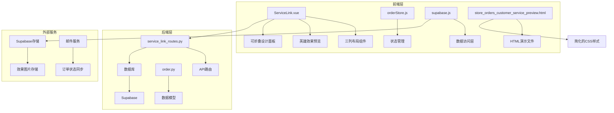

**图表来源**
- [ServiceLink.vue:1-800](file://frontend/src/views/ServiceLink/ServiceLink.vue#L1-L800)
- [service_link_routes.py:1-522](file://backend/src/api/service_link_routes.py#L1-L522)
- [store_orders_customer_service_preview.html:1-272](file://frontend/tests/store_orders_customer_service_preview.html#L1-L272)

## 核心组件

### 1. 三列布局组件

系统采用全新的三列布局设计，提供更高效的订单管理体验。

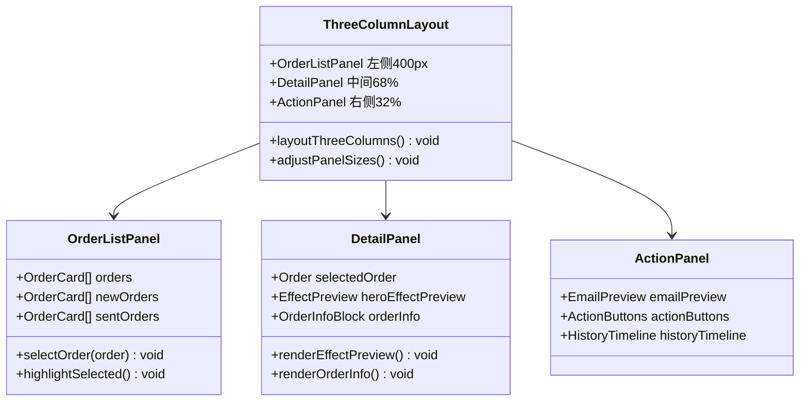

**图表来源**
- [ServiceLink.vue:75-387](file://frontend/src/views/ServiceLink/ServiceLink.vue#L75-L387)

### 2. 英雄效果预览组件

新增的英雄效果预览区域，效果图预览填满整个预览区域，提供沉浸式的视觉体验。

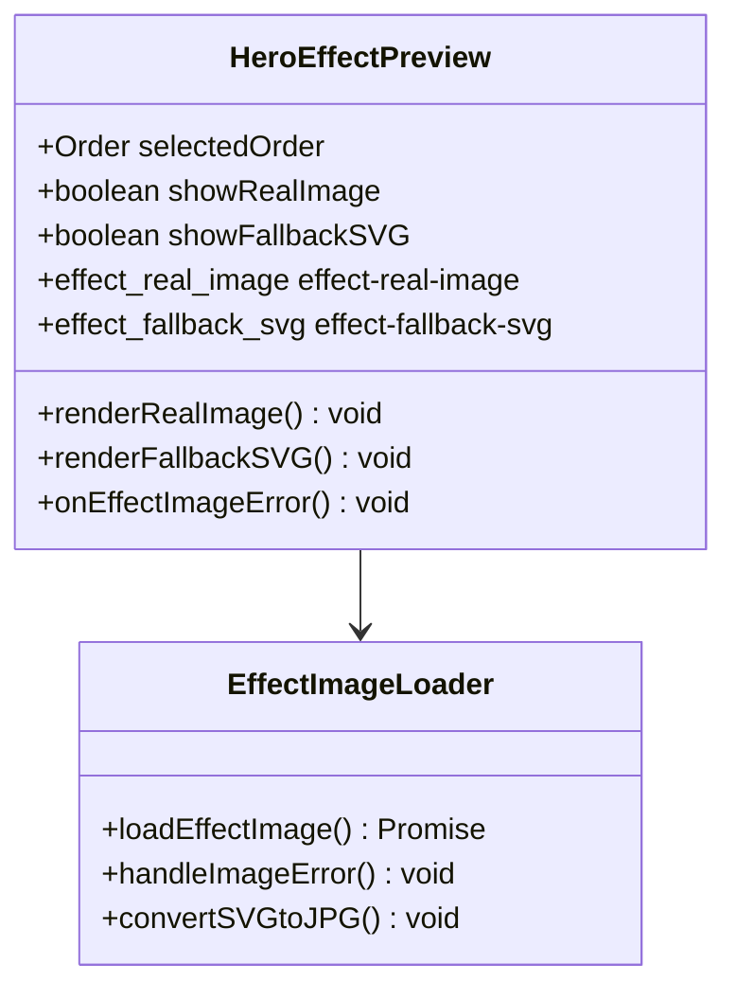

**图表来源**
- [ServiceLink.vue:195-221](file://frontend/src/views/ServiceLink/ServiceLink.vue#L195-L221)

### 3. 可折叠设计面板

集成设计修改功能的可折叠面板，支持客户反馈和参考图片上传。

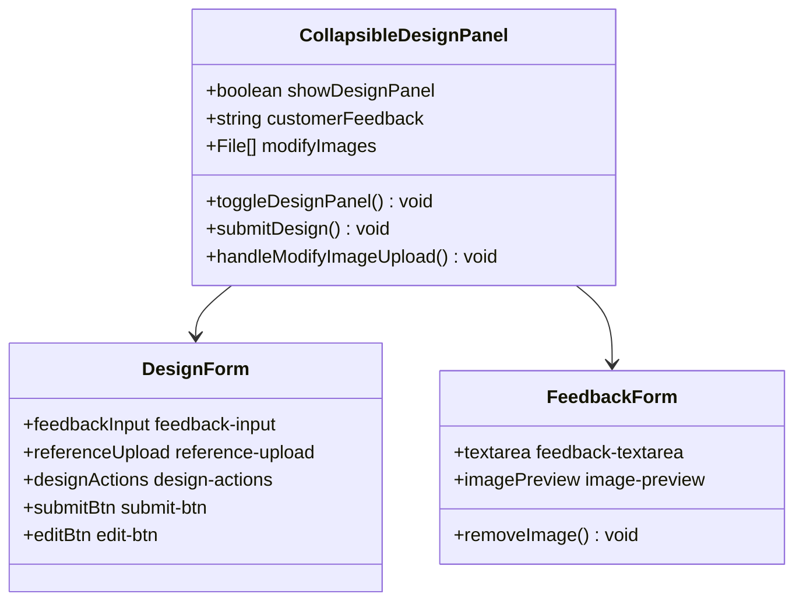

**图表来源**
- [ServiceLink.vue:767-797](file://frontend/src/views/ServiceLink/ServiceLink.vue#L767-L797)

## 三列布局设计

### 1. 布局结构

系统采用全新的三列布局设计，确保在不同屏幕尺寸下都能保持最佳的用户体验。

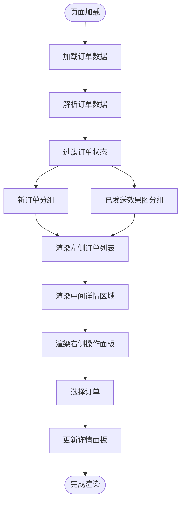

**图表来源**
- [ServiceLink.vue:454-619](file://frontend/src/views/ServiceLink/ServiceLink.vue#L454-L619)

### 2. 面板尺寸配置

各面板采用固定宽度和百分比混合布局，确保界面的稳定性和一致性。

| 面板类型 | 宽度设置 | 最小宽度 | 最大宽度 | 自适应属性 |
|----------|----------|----------|----------|------------|
| 左侧面板 | 400px | 320px | 500px | 固定宽度 |
| 中间面板 | 68% | 60% | 75% | 百分比自适应 |
| 右侧面板 | 32% | 25% | 40% | 百分比自适应 |
| 主容器 | 1900px | 1200px | 2100px | 最大宽度限制 |

### 3. 响应式适配

系统针对不同屏幕尺寸提供优化的布局适配：

- **桌面端**：完整三列布局，各面板按设定比例显示
- **平板端**：中间面板可适当缩小，确保左右面板可见性
- **移动端**：建议降级为两列布局，左侧订单列表 + 右侧详情操作

## 英雄效果预览区域

### 1. 预览区域设计

英雄效果预览区域采用全屏填充设计，提供沉浸式的视觉体验。

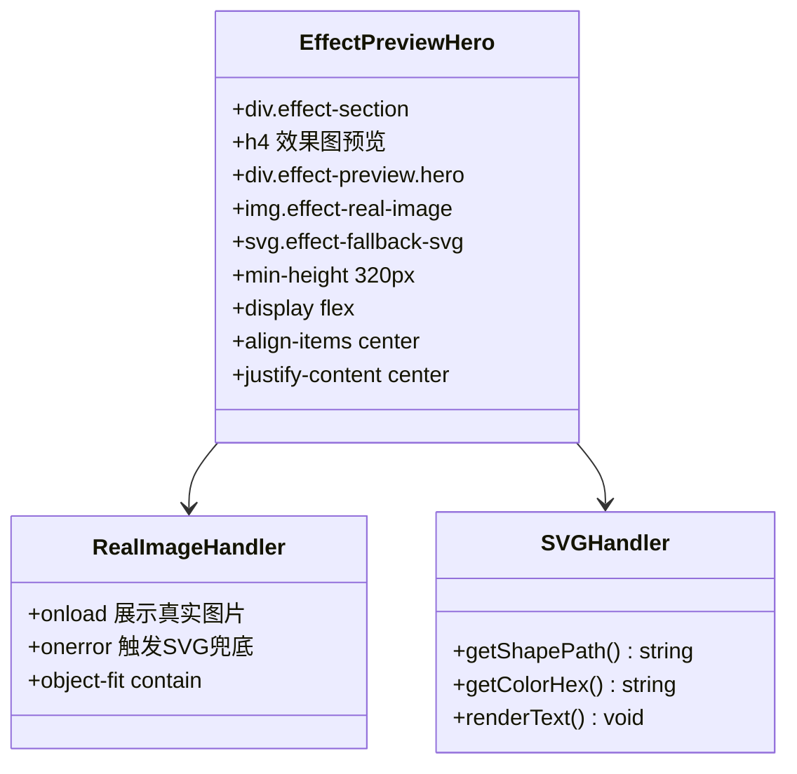

**图表来源**
- [ServiceLink.vue:195-221](file://frontend/src/views/ServiceLink/ServiceLink.vue#L195-L221)

### 2. 图片加载策略

系统采用智能的图片加载策略，确保在各种情况下都能提供最佳的视觉效果。

| 图片类型 | 加载方式 | 处理逻辑 | 备注 |
|----------|----------|----------|------|
| 效果图URL | 直接加载 | 显示真实图片 | 支持JPG/PNG/SVG |
| 实拍图URL | 直接加载 | 显示产品图片 | 支持JPG/PNG |
| SVG兜底 | 文本解析 | 渲染SVG图形 | 形状+颜色+文字 |
| 加载失败 | 自动切换 | 显示SVG兜底 | 图片错误处理 |

### 3. 图片格式支持

系统支持多种图片格式，确保兼容性和质量要求：

- **JPG格式**：压缩率高，适合真实效果图
- **PNG格式**：透明背景，适合图标和简单图形
- **SVG格式**：矢量图形，适合产品形状渲染
- **自动转换**：SVG自动转换为JPG下载

## 可折叠设计面板

### 1. 面板结构

可折叠设计面板提供完整的订单修改功能，支持客户反馈和参考图片上传。

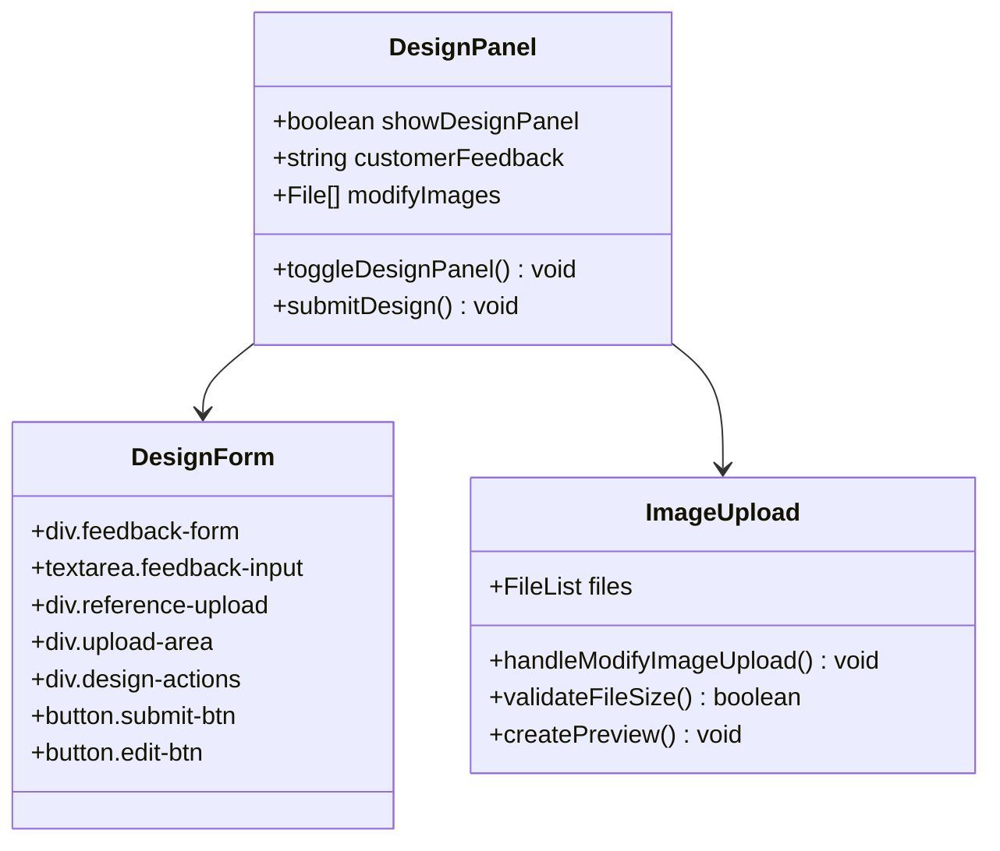

**图表来源**
- [ServiceLink.vue:2331-2458](file://frontend/src/views/ServiceLink/ServiceLink.vue#L2331-L2458)

### 2. 图片上传功能

支持多图片上传和预览，提供完整的参考材料收集功能。

| 功能特性 | 实现方式 | 限制条件 | 用户体验 |
|----------|----------|----------|----------|
| 多图片上传 | input[type=file] multiple | 最多5张图片 | 批量选择 |
| 文件大小限制 | 5MB限制 | 单张图片 | 超限提示 |
| 实时预览 | FileReader API | 预览缩略图 | 即时反馈 |
| 删除功能 | X按钮删除 | 删除确认 | 简单操作 |
| 参考说明 | 文本输入框 | 500字符限制 | 清晰表达 |

### 3. 设计操作流程

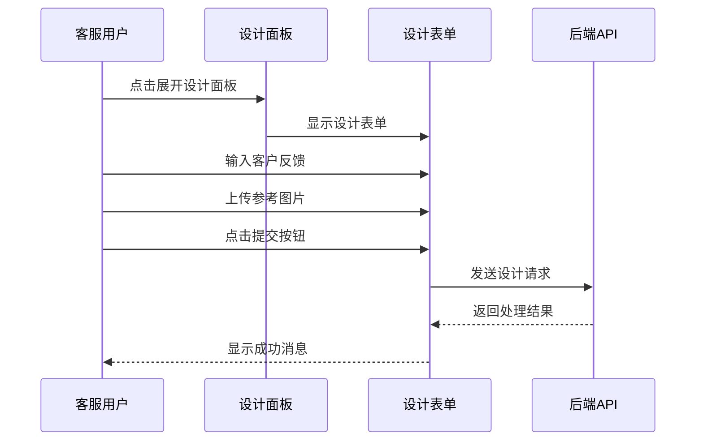

**图表来源**
- [ServiceLink.vue:767-797](file://frontend/src/views/ServiceLink/ServiceLink.vue#L767-L797)

## 改进的订单处理流程

### 1. 订单状态区分

系统区分客服确认和客户确认两种状态，提供更精确的订单跟踪。

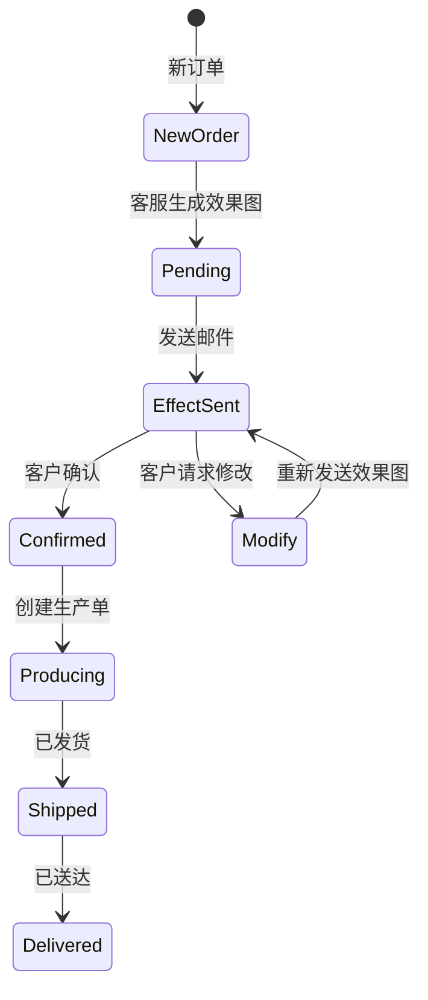

**图表来源**
- [order.py:23-106](file://backend/src/models/order.py#L23-L106)

### 2. 客户确认流程

新增的客户确认流程，确保订单最终确认的准确性。

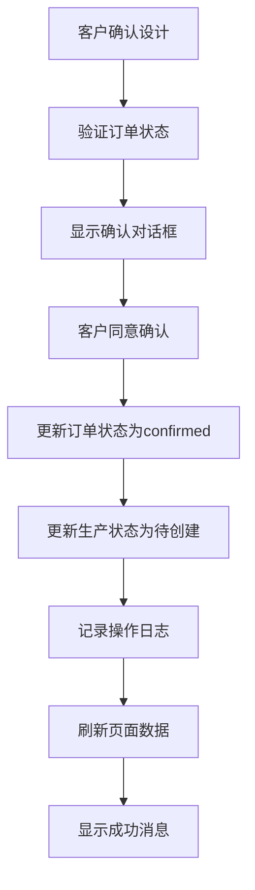

**图表来源**
- [ServiceLink.vue:1180-1251](file://frontend/src/views/ServiceLink/ServiceLink.vue#L1180-L1251)

### 3. 客服操作优化

客服操作流程得到显著优化，提供更直观的操作体验。

| 操作类型 | 触发条件 | 处理流程 | 状态更新 |
|----------|----------|----------|----------|
| 确认设计 | 客户确认 | 更新email_status为confirmed | confirmed |
| 需要修改 | 客户请求 | 更新email_status为modify | modify |
| 重新发送 | 客服操作 | 重新生成效果图 | effect_sent |
| 生产准备 | 确认完成 | 更新status为待创建 | producing |

## Vue组件架构

### 1. 组件层次结构

系统采用简化的Vue3组件架构，移除了复杂的响应式设计，专注于核心功能实现。

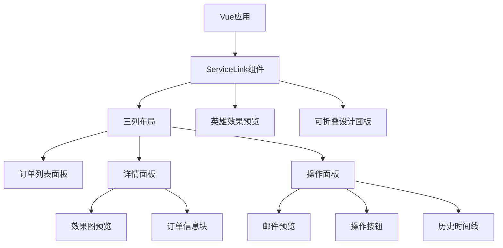

**图表来源**
- [ServiceLink.vue:1-800](file://frontend/src/views/ServiceLink/ServiceLink.vue#L1-L800)

### 2. 简化的样式设计

系统采用简化的CSS样式设计，移除了Tailwind CSS的复杂配置，专注于核心功能的视觉呈现。

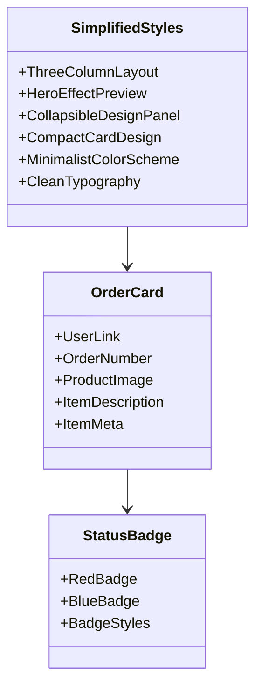

**图表来源**
- [ServiceLink.vue:77-168](file://frontend/src/views/ServiceLink/ServiceLink.vue#L77-L168)

### 3. 组件通信机制

Vue3 Composition API提供了简洁的组件通信机制，支持父子组件间的高效数据传递。

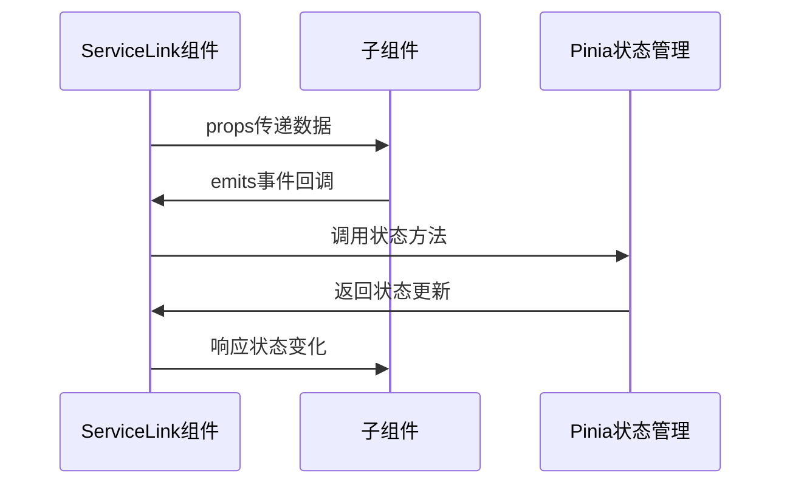

**图表来源**
- [ServiceLink.vue:464-800](file://frontend/src/views/ServiceLink/ServiceLink.vue#L464-L800)

## 数据流分析

### 1. 数据获取流程

**图表来源**
- [ServiceLink.vue:514-576](file://frontend/src/views/ServiceLink/ServiceLink.vue#L514-L576)
- [service_link_routes.py:210-251](file://backend/src/api/service_link_routes.py#L210-L251)

### 2. 订单状态更新流程

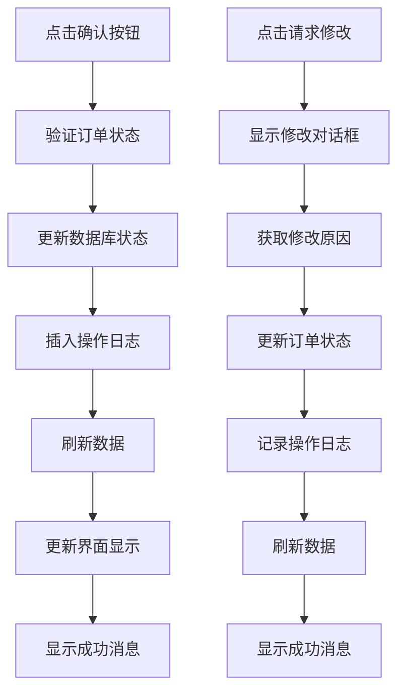

**图表来源**
- [ServiceLink.vue:727-786](file://frontend/src/views/ServiceLink/ServiceLink.vue#L727-L786)

## 状态管理

### 1. 前端状态管理

系统使用Pinia进行状态管理，主要状态包括：

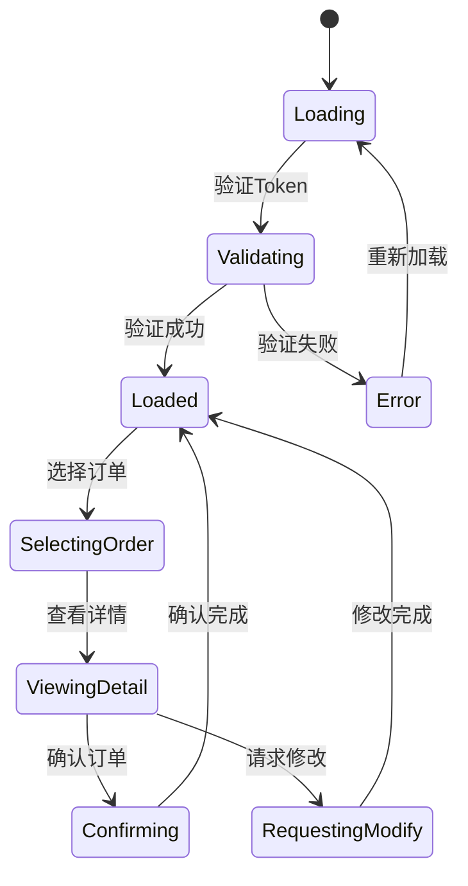

**图表来源**
- [orderStore.js:23-113](file://frontend/src/stores/orderStore.js#L23-L113)

### 2. 后端状态管理

后端使用SQLAlchemy ORM管理订单状态，支持完整的状态转换：

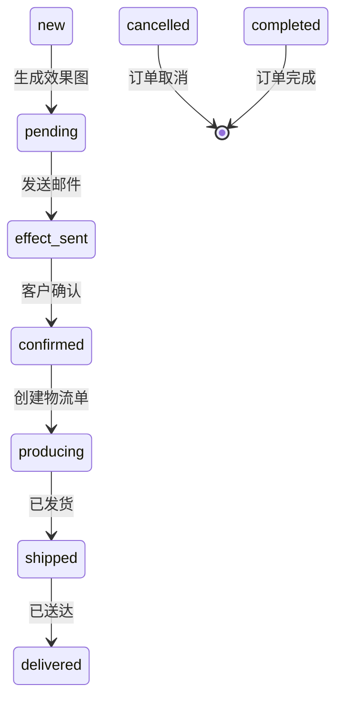

**图表来源**
- [order.py:23-106](file://backend/src/models/order.py#L23-L106)

## API接口设计

### 1. 客服外链认证API

| 接口 | 方法 | 描述 | 请求参数 | 响应数据 |
|------|------|------|----------|----------|
| `/service-link/validate` | POST | 验证客服外链Token | shop_code, token | ValidateTokenResponse |
| `/service-link/shops/{shop_id}/pending-orders` | GET | 获取待确认订单 | shop_id | List[OrderResponse] |
| `/service-link/log-action` | POST | 记录客服操作日志 | shop_id, order_id, action | {success: boolean} |

### 2. 设计链接API

| 接口 | 方法 | 描述 | 请求参数 | 响应数据 |
|------|------|------|----------|----------|
| `/service-link/design-link/validate` | POST | 验证设计链接Token | shop_code, token | ValidateTokenResponse |
| `/service-link/design-link/generate-token` | POST | 生成设计链接Token | shop_id, enabled | DesignTokenResponse |

### 3. 数据模型定义

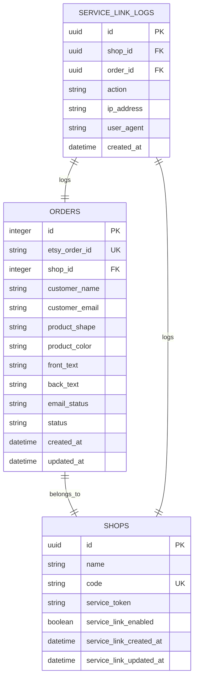

**图表来源**
- [order.py:23-244](file://backend/src/models/order.py#L23-L244)
- [service_link_routes.py:20-73](file://backend/src/api/service_link_routes.py#L20-L73)

## 性能考虑

### 1. 数据加载优化

- **并行查询**：同时加载订单数据和SKU信息，减少等待时间
- **缓存机制**：使用Supabase的自动缓存机制提高数据访问速度
- **懒加载**：详情面板按需加载，避免不必要的资源消耗

### 2. 网络优化

- **错误重试**：网络异常时自动重试机制
- **超时控制**：设置合理的请求超时时间
- **离线处理**：支持基本功能的离线使用

### 3. 内存管理

- **组件卸载**：离开页面时自动清理事件监听器
- **数据清理**：及时释放不再使用的数据引用
- **垃圾回收**：利用Vue3的响应式系统自动管理内存

### 4. Vue组件优化

- **简化的模板**：移除复杂的响应式类名，减少DOM操作
- **静态样式**：使用内联样式，避免CSS类名冲突
- **组件复用**：优化组件结构，减少不必要的嵌套

## 故障排除指南

### 1. 常见问题及解决方案

| 问题类型 | 症状描述 | 解决方案 |
|----------|----------|----------|
| Token验证失败 | 页面显示"链接无效或已过期" | 检查URL参数是否正确，重新生成Token |
| 网络连接失败 | 页面显示"网络连接失败" | 检查网络连接，重试加载 |
| 订单数据为空 | 订单列表显示为空 | 检查数据库连接，确认有订单数据 |
| 操作失败 | 点击按钮无响应 | 查看浏览器控制台错误信息 |
| Vue组件渲染错误 | 页面空白或显示异常 | 检查组件导入和依赖关系 |

### 2. 调试方法

- **浏览器开发者工具**：检查网络请求和JavaScript错误
- **Supabase控制台**：监控数据库查询和存储操作
- **后端日志**：查看API请求和响应日志

### 3. 性能监控

- **加载时间**：监控页面加载和数据获取时间
- **内存使用**：定期检查内存泄漏情况
- **错误率**：统计API调用失败率

## 总结

客服外链左侧栏模板经过全面重构，现已发展为功能完整、设计精良的三列布局订单管理界面。系统采用了简化的Vue3组件架构，移除了复杂的响应式设计和第三方CSS框架，专注于提供核心的订单管理功能。

### 主要优势

1. **用户体验优秀**：三列布局设计，清晰的视觉层次，直观的操作流程
2. **功能完整**：涵盖订单管理的各个环节，新增设计面板功能
3. **技术先进**：采用Vue3 + FastAPI的现代技术栈
4. **扩展性强**：模块化设计便于功能扩展
5. **安全性高**：完善的Token验证和权限控制
6. **简化的架构**：移除复杂依赖，提高系统稳定性
7. **易于维护**：简化的代码结构便于长期维护

### 技术特色

- **三列布局架构**：左侧订单列表 + 中间详情 + 右侧操作的完美组合
- **英雄效果预览**：大幅增强的视觉体验，支持多种图片格式
- **可折叠设计面板**：集成设计修改功能，提升工作效率
- **改进的订单流程**：区分客服确认和客户确认，优化业务流程
- **实时更新**：支持订单状态的实时同步
- **错误处理**：完善的错误处理和用户提示机制
- **性能优化**：多方面的性能优化措施
- **简化的样式设计**：移除复杂的CSS框架依赖
- **纯Vue组件**：提供独立的功能实现，便于测试和验证

该模板为ETSY订单自动化系统提供了重要的前端界面支撑，是整个系统架构中不可或缺的重要组成部分。重构后的三列布局设计使其更加专业和高效，为开发和部署提供了更好的灵活性和可维护性。

**更新** 系统已完全重构为三列布局架构，移除了响应式设计、Tailwind CSS集成和纯HTML模板演示等高级功能，专注于提供核心的订单管理功能。新增的英雄效果预览区域和可折叠设计面板显著提升了用户体验和操作效率。

**Section sources**
- [ServiceLink.vue:1-800](file://frontend/src/views/ServiceLink/ServiceLink.vue#L1-L800)
- [service_link_routes.py:1-522](file://backend/src/api/service_link_routes.py#L1-L522)
- [orderStore.js:23-113](file://frontend/src/stores/orderStore.js#L23-L113)
- [order.py:23-106](file://backend/src/models/order.py#L23-L106)
- [store_orders_customer_service_preview.html:1-272](file://frontend/tests/store_orders_customer_service_preview.html#L1-L272)
- [客服外链左侧栏.html:1-240](file://backend/tests/客服外链左侧栏.html#L1-L240)