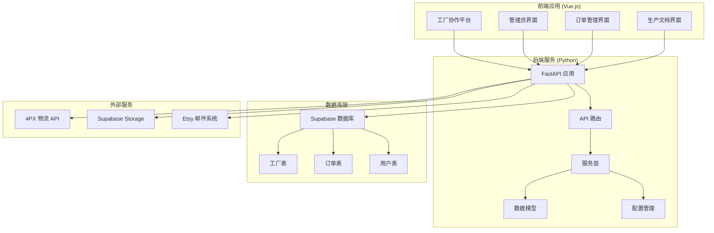
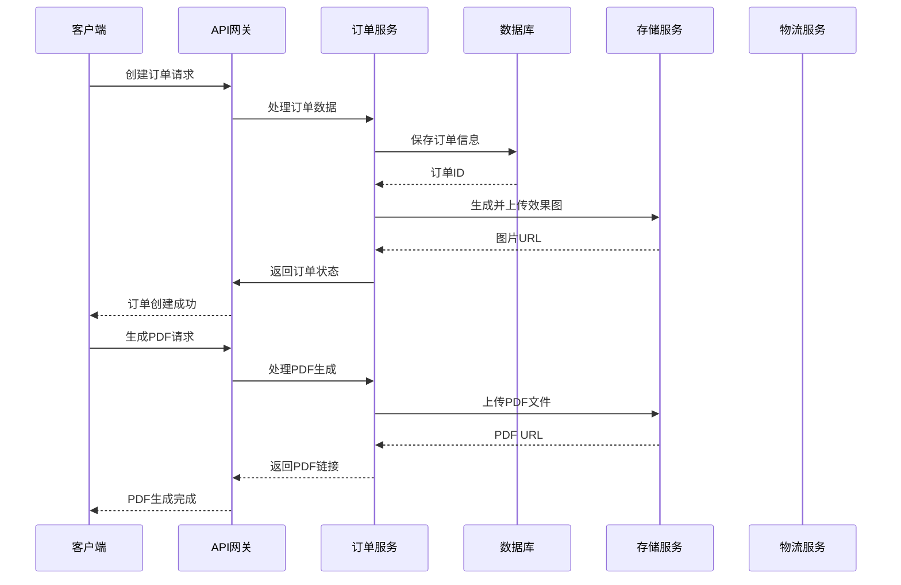
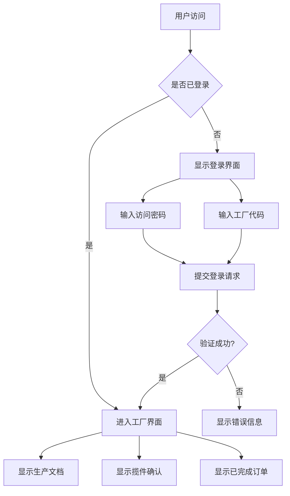
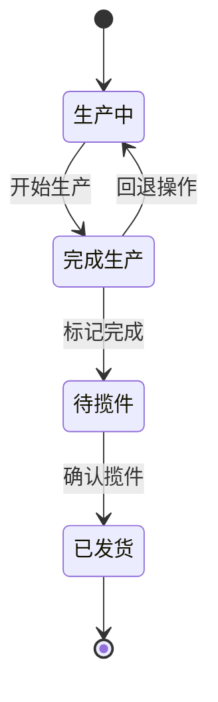
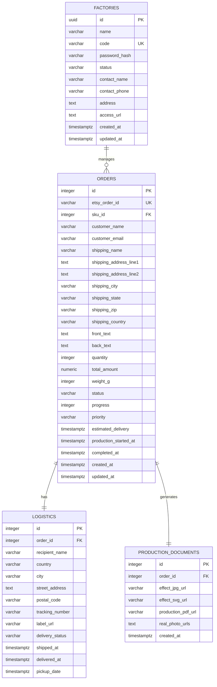
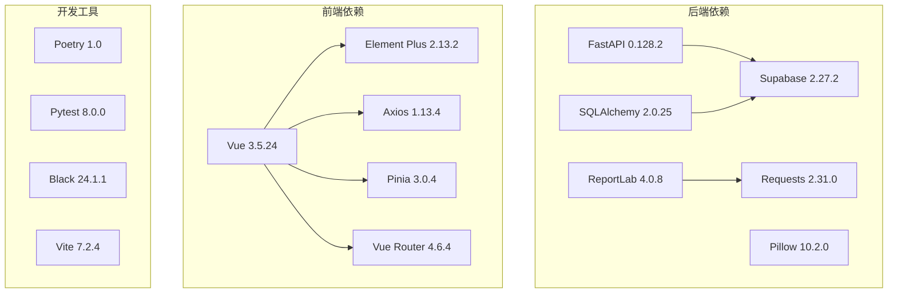

# 工厂管理系统

<cite>
**本文档引用的文件**
- [backend/pyproject.toml](file://backend/pyproject.toml)
- [backend/src/api/main.py](file://backend/src/api/main.py)
- [backend/src/models/order.py](file://backend/src/models/order.py)
- [backend/src/config/settings.py](file://backend/src/config/settings.py)
- [backend/src/services/database_service.py](file://backend/src/services/database_service.py)
- [backend/src/services/effect_image_service.py](file://backend/src/services/effect_image_service.py)
- [backend/src/services/pdf_service.py](file://backend/src/services/pdf_service.py)
- [backend/src/services/shipping_service.py](file://backend/src/services/shipping_service.py)
- [backend/scripts/create_factories_table.sql](file://backend/scripts/create_factories_table.sql)
- [backend/scripts/create_tables_sql.md](file://backend/scripts/create_tables_sql.md)
- [docs/openapi.yaml](file://docs/openapi.yaml)
- [frontend/package.json](file://frontend/package.json)
- [frontend/src/views/FactoryWorkshop/FactoryWorkshop.vue](file://frontend/src/views/FactoryWorkshop/FactoryWorkshop.vue)
- [frontend/src/stores/adminStore.js](file://frontend/src/stores/adminStore.js)
- [frontend/src/utils/api.js](file://frontend/src/utils/api.js)
</cite>

## 目录
1. [项目概述](#项目概述)
2. [项目结构](#项目结构)
3. [核心组件](#核心组件)
4. [架构概览](#架构概览)
5. [详细组件分析](#详细组件分析)
6. [依赖关系分析](#依赖关系分析)
7. [性能考虑](#性能考虑)
8. [故障排除指南](#故障排除指南)
9. [结论](#结论)

## 项目概述

工厂管理系统是一个基于ETSY订单自动化的完整解决方案，专为不锈钢宠物牌生产而设计。该系统集成了订单管理、效果图生成、PDF文档生成、物流集成和工厂协作平台等多个功能模块。

### 主要功能特性

- **订单自动化处理**：自动读取和处理ETSY订单，支持多店铺多工厂管理
- **智能效果图生成**：基于SVG技术的个性化定制产品效果图生成
- **生产文档管理**：完整的生产文档PDF生成和管理
- **物流集成**：4PX物流API集成，支持面单生成和跟踪
- **工厂协作平台**：多工厂访问控制和生产协作
- **多租户架构**：支持多个店铺和工厂的独立管理

## 项目结构



**图表来源**
- [backend/src/api/main.py:1-800](file://backend/src/api/main.py#L1-L800)
- [frontend/src/views/FactoryWorkshop/FactoryWorkshop.vue:1-996](file://frontend/src/views/FactoryWorkshop/FactoryWorkshop.vue#L1-L996)

**章节来源**
- [backend/pyproject.toml:1-69](file://backend/pyproject.toml#L1-L69)
- [backend/src/api/main.py:1-800](file://backend/src/api/main.py#L1-L800)

## 核心组件

### 后端服务架构

系统采用模块化设计，主要包含以下核心组件：

#### API 层
- **FastAPI 应用**：提供RESTful API接口
- **路由管理**：组织和管理各种API端点
- **中间件**：CORS配置和请求处理

#### 服务层
- **数据库服务**：Supabase集成和数据操作
- **效果图像服务**：SVG效果图生成和处理
- **PDF服务**：生产文档PDF生成
- **物流服务**：4PX API集成和物流管理
- **邮件服务**：订单确认邮件发送

#### 数据模型层
- **订单模型**：订单数据结构定义
- **工厂模型**：工厂信息管理
- **用户模型**：多租户用户权限管理

**章节来源**
- [backend/src/api/main.py:1-800](file://backend/src/api/main.py#L1-L800)
- [backend/src/models/order.py:1-356](file://backend/src/models/order.py#L1-L356)
- [backend/src/services/database_service.py:1-117](file://backend/src/services/database_service.py#L1-L117)

## 架构概览



**图表来源**
- [backend/src/api/main.py:381-484](file://backend/src/api/main.py#L381-L484)
- [backend/src/services/effect_image_service.py:77-129](file://backend/src/services/effect_image_service.py#L77-L129)
- [backend/src/services/pdf_service.py:532-536](file://backend/src/services/pdf_service.py#L532-L536)

系统采用分层架构设计，确保了良好的可维护性和扩展性。每个组件都有明确的职责分工，通过标准化的接口进行通信。

## 详细组件分析

### 工厂协作平台

工厂协作平台是系统的核心用户界面，提供了完整的工厂生产管理功能。

#### 登录认证机制



**图表来源**
- [frontend/src/views/FactoryWorkshop/FactoryWorkshop.vue:1-52](file://frontend/src/views/FactoryWorkshop/FactoryWorkshop.vue#L1-L52)

#### 生产文档管理

平台提供三个主要的工作区域：

1. **生产文档区域**：展示待生产的订单，支持PDF和SVG文件下载
2. **揽件确认区域**：用于核对生产文档和物流信息
3. **已完成区域**：展示已完成的订单记录

#### 订单状态管理



**图表来源**
- [frontend/src/views/FactoryWorkshop/FactoryWorkshop.vue:753-778](file://frontend/src/views/FactoryWorkshop/FactoryWorkshop.vue#L753-L778)

**章节来源**
- [frontend/src/views/FactoryWorkshop/FactoryWorkshop.vue:1-996](file://frontend/src/views/FactoryWorkshop/FactoryWorkshop.vue#L1-L996)

### 数据库设计

系统采用关系型数据库设计，支持多租户和多工厂管理。

#### 核心数据表结构



**图表来源**
- [backend/src/models/order.py:23-182](file://backend/src/models/order.py#L23-L182)
- [backend/scripts/create_factories_table.sql:1-54](file://backend/scripts/create_factories_table.sql#L1-L54)

**章节来源**
- [backend/src/models/order.py:1-356](file://backend/src/models/order.py#L1-L356)
- [backend/scripts/create_factories_table.sql:1-54](file://backend/scripts/create_factories_table.sql#L1-L54)

### API 接口设计

系统提供完整的RESTful API接口，支持所有核心功能。

#### 主要API端点

| 功能模块 | 端点 | 方法 | 描述 |
|---------|------|------|------|
| 效果图生成 | `/api/effect-image/generate` | POST | 生成SVG效果图 |
| PDF生成 | `/api/pdf/generate-and-upload` | POST | 生成并上传生产文档PDF |
| 物流管理 | `/api/shipping/create-order` | POST | 创建4PX物流订单 |
| 订单状态 | `/api/order/update-status` | POST | 更新订单状态 |
| 字体服务 | `/fonts/{font_filename}` | GET | 获取字体文件 |

**章节来源**
- [docs/openapi.yaml:1-892](file://docs/openapi.yaml#L1-L892)
- [backend/src/api/main.py:241-771](file://backend/src/api/main.py#L241-L771)

## 依赖关系分析

### 技术栈依赖



**图表来源**
- [backend/pyproject.toml:8-48](file://backend/pyproject.toml#L8-L48)
- [frontend/package.json:11-29](file://frontend/package.json#L11-L29)

### 数据流处理

```mermaid
flowchart LR
A[ETSY订单] --> B[邮件解析]
B --> C[订单入库]
C --> D[效果图像生成]
D --> E[PDF文档生成]
E --> F[物流订单创建]
F --> G[面单打印]
G --> H[订单完成]
I[工厂协作] --> J[生产文档审核]
J --> K[揽件确认]
K --> L[订单发货]
M[Supabase存储] <- --> D
M <- --> E
N[4PX API] <- --> F
```

**图表来源**
- [backend/src/api/main.py:381-484](file://backend/src/api/main.py#L381-L484)
- [backend/src/services/shipping_service.py:306-393](file://backend/src/services/shipping_service.py#L306-L393)

**章节来源**
- [backend/pyproject.toml:1-69](file://backend/pyproject.toml#L1-L69)
- [frontend/package.json:1-31](file://frontend/package.json#L1-L31)

## 性能考虑

### 系统性能优化

1. **缓存策略**：字体文件和生成的图片采用缓存机制
2. **异步处理**：PDF生成和邮件发送采用异步方式
3. **数据库优化**：合理的索引设计和查询优化
4. **资源管理**：图片和PDF文件的存储和清理机制

### 扩展性设计

- **微服务架构**：各功能模块相对独立，便于扩展
- **插件机制**：支持新的字体和模板类型
- **多租户支持**：支持多个店铺和工厂的独立管理
- **API版本控制**：确保向后兼容性

## 故障排除指南

### 常见问题及解决方案

#### 数据库连接问题
- **症状**：API调用失败，数据库操作异常
- **解决方案**：检查Supabase连接配置，验证网络连通性

#### 字体加载失败
- **症状**：效果图生成时字体缺失
- **解决方案**：确认字体文件存在，检查文件权限

#### 物流API调用失败
- **症状**：4PX物流订单创建失败
- **解决方案**：检查API密钥配置，验证网络连接

#### 文件上传失败
- **症状**：SVG或PDF文件无法上传到存储
- **解决方案**：检查存储空间，验证文件格式

**章节来源**
- [backend/src/config/settings.py:37-62](file://backend/src/config/settings.py#L37-L62)
- [backend/src/services/database_service.py:86-113](file://backend/src/services/database_service.py#L86-L113)

## 结论

工厂管理系统是一个功能完整、架构清晰的工业自动化解决方案。系统通过模块化设计实现了订单管理、生产控制、物流集成和工厂协作的全面自动化。

### 主要优势

1. **完整的功能覆盖**：从订单接收到产品发货的全流程管理
2. **灵活的架构设计**：支持多租户和多工厂管理
3. **用户友好的界面**：直观的操作界面和工作流程
4. **可靠的系统集成**：与4PX物流和Supabase的稳定集成

### 发展建议

1. **监控和日志**：增强系统的监控和日志记录能力
2. **自动化测试**：建立完善的自动化测试体系
3. **性能优化**：持续优化系统性能和响应速度
4. **安全加固**：加强系统的安全防护措施

该系统为不锈钢宠物牌生产提供了高效、可靠的数字化解决方案，能够显著提升生产效率和管理水平。