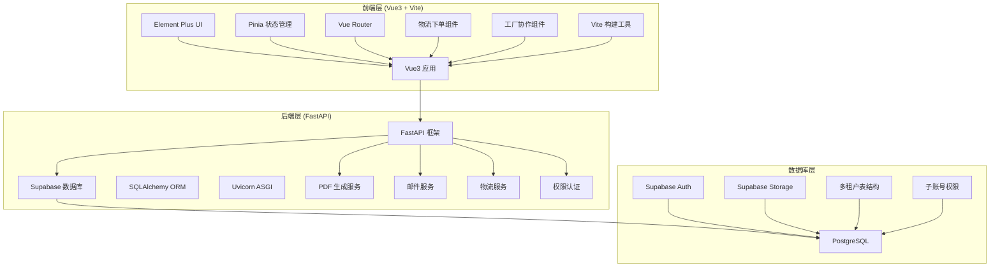
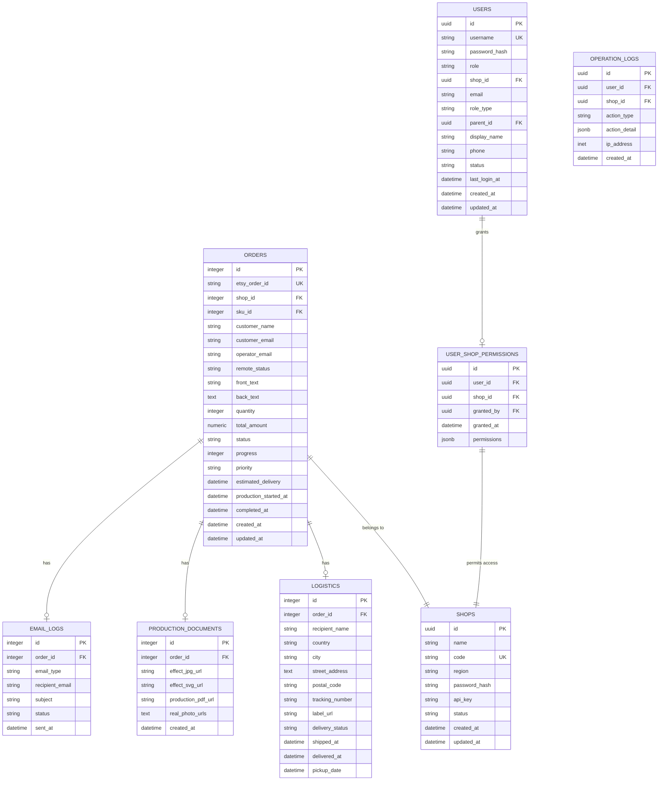
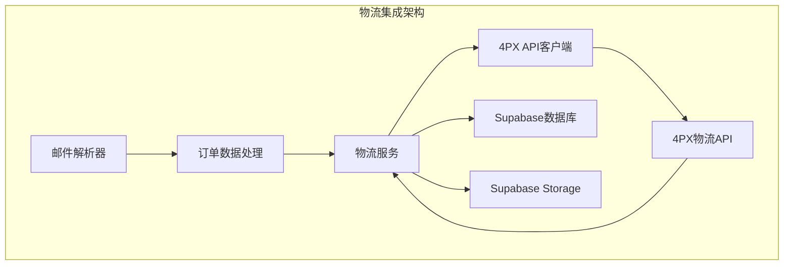
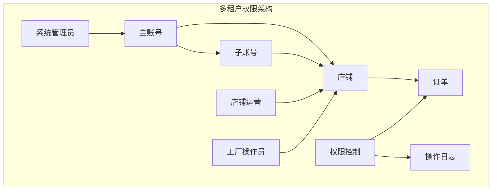
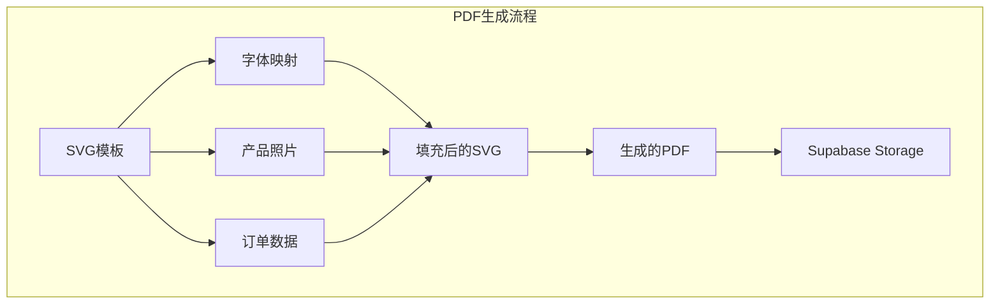

# 开发指南

<cite>
**本文档引用的文件**
- [main.py](file://backend/src/api/main.py)
- [shipping_service.py](file://backend/src/services/shipping_service.py)
- [process_real_order_shipping.py](file://backend/scripts/process_real_order_shipping.py)
- [update_logistics_4002217518.py](file://backend/scripts/update_logistics_4002217518.py)
- [settings.py](file://backend/src/config/settings.py)
- [database_service.py](file://backend/src/services/database_service.py)
- [index.js](file://frontend/src/router/index.js)
- [pyproject.toml](file://backend/pyproject.toml)
- [package.json](file://frontend/package.json)
- [vite.config.js](file://frontend/vite.config.js)
- [order.py](file://backend/src/models/order.py)
- [email_service.py](file://backend/src/services/email_service.py)
- [email_parser.py](file://backend/src/services/email_parser.py)
- [svg_pdf_service.py](file://backend/src/services/svg_pdf_service.py)
- [pdf_service.py](file://backend/src/services/pdf_service.py)
- [pdf_service_clean.py](file://backend/src/services/pdf_service_clean.py)
- [logger.py](file://backend/src/utils/logger.py)
- [add_operator_email.sql](file://backend/scripts/add_operator_email.sql)
- [init_multitenant.sql](file://backend/scripts/init_multitenant.sql)
- [init_subaccount.sql](file://backend/scripts/init_subaccount.sql)
- [check_db_status.py](file://backend/scripts/check_db_status.py)
- [init_multitenant.py](file://backend/scripts/init_multitenant.py)
- [update_db_paths.py](file://backend/scripts/update_db_paths.py)
- [check_supabase_resources.py](file://backend/scripts/check_supabase_resources.py)
- [diagnose_4px_ca.py](file://backend/scripts/diagnose_4px_ca.py)
- [keep_supabase_alive.py](file://backend/scripts/keep_supabase_alive.py)
- [create_tables_sql.md](file://backend/scripts/create_tables_sql.md)
- [validate_svg_fonts.py](file://backend/scripts/validate_svg_fonts.py)
- [rebuild_effect_templates.py](file://backend/scripts/rebuild_effect_templates.py)
- [frontend-backend-api.md](file://docs/frontend-backend-api.md)
- [.qoderignore](file://.qoderignore)
- [.gitignore](file://.gitignore)
- [.windsurfrules](file://frontend/.windsurfrules)
</cite>

## 更新摘要
**变更内容**
- 新增开发者环境优化指南，包含Qoder IDE索引优化和Git忽略规则优化
- 增强IDE性能配置，提升开发体验和构建效率
- 优化SuperDesign UI设计工作流配置
- 完善开发环境工具链配置

## 目录
1. [项目简介](#项目简介)
2. [开发环境搭建](#开发环境搭建)
3. [技术栈概览](#技术栈概览)
4. [项目结构](#项目结构)
5. [Vue3 + Vite前端开发](#vue3--vite前端开发)
6. [FastAPI后端开发](#fastapi后端开发)
7. [Supabase数据库开发](#supabase数据库开发)
8. [物流集成系统](#物流集成系统)
9. [多租户与权限管理](#多租户与权限管理)
10. [增强的邮件处理系统](#增强的邮件处理系统)
11. [像素级PDF生成系统](#像素级pdf生成系统)
12. [实时数据同步](#实时数据同步)
13. [Element Plus UI组件](#element-plus-ui组件)
14. [Pinia状态管理](#pinia状态管理)
15. [Poetry包管理](#poetry包管理)
16. [代码规范](#代码规范)
17. [测试策略](#测试策略)
18. [日志记录与错误处理](#日志记录与错误处理)
19. [调试技巧](#调试技巧)
20. [团队协作规范](#团队协作规范)
21. [最佳实践](#最佳实践)
22. [故障排除](#故障排除)
23. [开发者环境优化](#开发者环境优化)
24. [数据库维护脚本使用指南](#数据库维护脚本使用指南)
25. [物流服务开发指南](#物流服务开发指南)
26. [前端开发规范增强](#前端开发规范增强)
27. [总结](#总结)

## 项目简介

ETSY订单自动化系统是一个基于现代技术栈的全栈自动化处理平台，采用Vue3 + Vite前端开发、FastAPI后端开发、Supabase数据库开发的现代化架构，现已全面集成物流服务和多租户权限管理。系统旨在实现以下核心功能：
- 📧 自动读取Etsy订单邮件并智能解析
- 📋 实时数据同步和状态管理
- 🖼️ 像素级效果图生成和PDF生产文档制作
- 🏷️ 物流面单生成和4PX API集成
- 🏭 多租户权限管理和子账号协作
- 📊 实时数据可视化和远程协作

该系统支持Windows平台，具备完善的依赖管理和开发规范体系，采用前后端分离架构，提供RESTful API接口和现代化的用户界面。系统集成了Supabase的实时数据同步、PDF像素级布局生成、增强的邮件处理功能，以及完整的物流集成和权限管理体系。

## 开发环境搭建

### 系统要求

- **Node.js**: 16.0+（前端开发）
- **Python**: 3.10+（后端开发）
- **Poetry**: 1.7+（Python包管理工具）
- **Vite**: 7.0+（前端构建工具）
- **操作系统**: Windows 10/11

### 前端环境配置

**安装Node.js和npm**
```bash
# 检查Node.js版本
node --version
npm --version

# 安装依赖
cd frontend
npm install
```

**环境变量配置**
复制并配置前端环境变量：
```bash
# 复制示例配置
cp frontend/.env.example frontend/.env

# 编辑 .env 文件，填入实际的Supabase配置
```

### 后端环境配置

**安装Poetry并配置Python环境**
```bash
# 安装Poetry
curl -sSL https://install.python-poetry.org | python3 -

# 安装Python依赖
cd backend
poetry install

# 创建Python虚拟环境
poetry env use python3.10
```

**配置后端环境变量**
```bash
# 复制示例配置
cp backend/.env.example backend/.env

# 编辑 .env 文件，填入邮箱、数据库和物流API配置
```

### 开发服务器启动

**启动前端开发服务器**
```bash
cd frontend
npm run dev
# 默认访问 http://localhost:5173
```

**启动后端开发服务器**
```bash
cd backend
poetry run uvicorn src.api.main:app --reload
# 默认访问 http://localhost:8000
```

## 技术栈概览

系统采用现代化的全栈技术栈，实现了前后端分离的架构设计，并集成了物流服务和权限管理：



**图表来源**
- [main.py:22-36](file://backend/src/api/main.py#L22-L36)
- [package.json:11-25](file://frontend/package.json#L11-L25)

### 核心技术特性

**前端技术栈优势**：
- **Vue3 Composition API**: 提供更好的类型支持和性能
- **Vite构建工具**: 快速的开发体验和热重载
- **Element Plus**: 完整的UI组件库，支持暗黑模式
- **Pinia**: 现代化的状态管理，替代Vuex
- **Vue Router**: 支持懒加载、路由守卫和多级权限

**后端技术栈优势**：
- **FastAPI**: 基于Pydantic的数据验证，自动生成API文档
- **Supabase**: 一体化的数据库、认证和存储解决方案
- **SQLAlchemy**: 强大的ORM功能，支持复杂查询
- **Uvicorn**: 高性能ASGI服务器
- **ReportLab**: 专业的PDF生成库，支持像素级布局
- **4PX API**: 物流集成，支持面单生成和订单管理

## 项目结构

系统采用清晰的分层架构设计，实现了前后端分离和多租户权限管理：

```mermaid
graph TB
subgraph "项目根目录"
Root[ETSY_Order_Automation/]
subgraph "前端 (frontend/)"
Frontend[frontend/]
Package[package.json]
ViteConfig[vite.config.js]
Src[src/]
Public[public/]
Env[.env]
WindsurfRules[.windsurfrules]
SuperDesign[.superdesign/]
End
subgraph "后端 (backend/)"
Backend[backend/]
PyProject[pyproject.toml]
Env[.env]
Scripts[scripts/]
Tests[tests/]
subgraph "后端源码 (src/)"
Api[api/]
Config[config/]
Models[models/]
Services[services/]
Utils[utils/]
end
end
subgraph "开发环境配置"
QoderIgnore[.qoderignore]
GitIgnore[.gitignore]
end
subgraph "数据库脚本"
InitSQL[init_multitenant.sql]
SubAccountSQL[init_subaccount.sql]
OperatorSQL[add_operator_email.sql]
MaintainScripts[check_db_status.py, update_db_paths.py, keep_supabase_alive.py]
LogisticScripts[diagnose_4px_ca.py, validate_svg_fonts.py, rebuild_effect_templates.py]
end
subgraph "其他目录"
Docs[docs/]
Logs[logs/]
Data[data/]
Assets[assets/]
Output[output/]
end
end
Root --> Frontend
Root --> Backend
Frontend --> Src
Frontend --> Package
Frontend --> WindsurfRules
Frontend --> SuperDesign
Backend --> Api
Backend --> Config
Backend --> Models
Backend --> Services
Backend --> Utils
Backend --> Scripts
Backend --> Assets
Backend --> Output
Backend --> InitSQL
Backend --> SubAccountSQL
Backend --> OperatorSQL
Backend --> MaintainScripts
Backend --> LogisticScripts
Backend --> QoderIgnore
Backend --> GitIgnore
```

**图表来源**
- [init_project.py:40-76](file://init_project.py#L40-L76)
- [package.json:1-27](file://frontend/package.json#L1-L27)
- [pyproject.toml:1-69](file://backend/pyproject.toml#L1-L69)

### 目录详细说明

| 目录 | 技术栈 | 用途 | 包含文件 |
|------|--------|------|----------|
| `frontend/src/` | Vue3 + Vite | 前端应用源码 | views/, components/, stores/, utils/ |
| `backend/src/api/` | FastAPI | API接口定义 | main.py, routers/ |
| `backend/src/config/` | Python | 配置管理 | settings.py, database.py |
| `backend/src/models/` | SQLAlchemy | 数据模型 | order.py, base.py |
| `backend/src/services/` | Python | 业务逻辑 | email_service.py, database_service.py, shipping_service.py |
| `backend/src/utils/` | Python | 工具函数 | logger.py, helpers.py |
| `backend/assets/` | 资源文件 | 图片、字体、模板 | fonts/, photos/, templates/, sku_data/ |
| `backend/output/` | 输出目录 | 生成的PDF和SVG文件 | *.pdf, *.svg |
| `backend/scripts/` | Python脚本 | 实用程序和工具 | process_real_order_shipping.py, update_logistics_4002217518.py, check_db_status.py, update_db_paths.py, keep_supabase_alive.py |
| `frontend/src/stores/` | Pinia | 状态管理 | orderStore.js, userStore.js, shopStore.js |
| `frontend/src/utils/` | Axios + Supabase | API工具 | api.js, supabase.js |
| `frontend/.superdesign/` | SuperDesign | UI设计迭代 | design_iterations/, pages/ |
| `frontend/.windsurfrules` | 设计规则 | UI设计配置 | 规则定义文件 |

## Vue3 + Vite前端开发

### Vite配置详解

系统使用Vite作为构建工具，提供快速的开发体验：

**核心配置特点**：
- **模块解析**: 使用 `@` 别名指向 `src` 目录
- **插件系统**: 集成Vue3开发插件
- **开发服务器**: 支持热重载和跨域请求

```javascript
// vite.config.js
import { defineConfig } from 'vite'
import vue from '@vitejs/plugin-vue'

export default defineConfig({
  plugins: [vue()],
  resolve: {
    alias: {
      '@': fileURLToPath(new URL('./src', import.meta.url))
    }
  }
})
```

**章节来源**
- [vite.config.js:1-14](file://frontend/vite.config.js#L1-L14)

### 项目依赖管理

前端使用npm管理依赖，核心包包括：

**运行时依赖**：
- `vue@^3.5.24`: Vue3框架
- `element-plus@^2.13.2`: UI组件库
- `pinia@^3.0.4`: 状态管理
- `vue-router@^4.6.4`: 路由管理
- `axios@^1.13.4`: HTTP客户端
- `@supabase/supabase-js@^2.93.3`: Supabase客户端

**开发依赖**：
- `@vitejs/plugin-vue@^6.0.1`: Vue3 Vite插件
- `vite@^7.2.4`: 构建工具

**章节来源**
- [package.json:11-25](file://frontend/package.json#L11-L25)

### 组件架构设计

系统采用组件化开发模式，每个页面都是独立的Vue组件：

**主要视图组件**：
- `Dashboard.vue`: 仪表盘主界面
- `Orders.vue`: 订单管理界面
- `Effects.vue`: 效果图生成功能
- `Production.vue`: 生产文档管理
- `Logistics.vue`: 物流信息管理
- `Settings.vue`: 系统设置界面
- `ShippingOrder.vue`: 物流下单组件
- `FactoryWorkshop.vue`: 工厂协作平台

**章节来源**
- [Dashboard.vue:1-200](file://frontend/src/views/Dashboard/Dashboard.vue#L1-L200)
- [App.vue:1-81](file://frontend/src/App.vue#L1-L81)

## FastAPI后端开发

### API架构设计

系统使用FastAPI构建RESTful API，提供类型安全的接口：

**核心API端点**：
- `/api/effect-image/generate`: 生成效果图
- `/api/effect-image/generate-and-upload`: 一键生成效果图并上传
- `/api/effect-image/view/{filename}`: 查看效果图
- `/api/pdf/generate-and-upload`: 一键生成生产文档PDF并上传
- `/api/order/update-status`: 更新订单状态
- `/api/email/send-confirmation`: 发送确认邮件
- `/api/shipping/create-label`: 创建物流面单
- `/api/shipping/get-label-url`: 获取面单URL
- `/health`: 健康检查

```python
# FastAPI应用配置
app = FastAPI(
    title="ETSY订单自动化 API",
    description="提供效果图生成、邮件发送、PDF生成、物流集成等功能",
    version="1.0.0"
)

# CORS配置
app.add_middleware(
    CORSMiddleware,
    allow_origins=["http://localhost:5173"],
    allow_credentials=True,
    allow_methods=["*"],
    allow_headers=["*"],
)
```

**章节来源**
- [main.py:22-36](file://backend/src/api/main.py#L22-L36)
- [main.py:69-79](file://backend/src/api/main.py#L69-L79)

### 数据模型定义

使用Pydantic定义请求和响应模型：

**效果图生成请求模型**：
```python
class EffectImageRequest(BaseModel):
    order_id: str
    shape: str = "bone"
    color: str = "G"
    size: str = "large"
    text_front: str
    text_back: Optional[str] = ""
    font_code: str = "F-01"
```

**订单状态更新请求模型**：
```python
class OrderStatusRequest(BaseModel):
    order_id: str
    status: str  # pending, effect_sent, producing, delivered
```

**一键生成请求模型**：
```python
class GenerateAllRequest(BaseModel):
    order_id: str
```

**物流面单请求模型**：
```python
class ShippingLabelRequest(BaseModel):
    order_id: str
    recipient_name: str
    recipient_address: str
    recipient_city: str
    recipient_state: str
    recipient_postal_code: str
    recipient_country: str
    weight: float = 0.03
    product_name: str = "pet ID tag"
```

**章节来源**
- [main.py:41-65](file://backend/src/api/main.py#L41-L65)

### 业务服务集成

后端服务通过依赖注入的方式集成各个功能模块：

**服务层架构**：
- `effect_image_service`: 效果图生成功能
- `email_service`: 邮件发送功能
- `order_service`: 订单管理功能
- `database_service`: 数据库操作功能
- `svg_pdf_service`: PDF生成服务
- `shipping_service`: 物流服务集成

**章节来源**
- [main.py:18-20](file://backend/src/api/main.py#L18-L20)

## Supabase数据库开发

### 数据库架构设计

系统使用Supabase作为一体化数据库解决方案，支持PostgreSQL、认证和存储：

**核心数据表结构**：



**图表来源**
- [order.py:23-96](file://backend/src/models/order.py#L23-L96)
- [order.py:98-144](file://backend/src/models/order.py#L98-L144)
- [order.py:147-172](file://backend/src/models/order.py#L147-L172)
- [order.py:174-207](file://backend/src/models/order.py#L174-L207)

### 数据库服务封装

使用Supabase Python客户端封装数据库操作：

**核心数据库操作**：
- 插入数据：`db.insert(table, data)`
- 查询数据：`db.select(table, filters, limit)`
- 获取订单：`db.get_order_by_etsy_id(etsy_order_id)`
- 获取SKU映射：`db.get_all_sku_mappings()`
- 上传文件到Storage：`db.upload_file(bucket, file_path, dest_name)`
- 多租户权限查询：`db.get_user_shop_permissions(user_id)`

**章节来源**
- [database_service.py:24-63](file://backend/src/services/database_service.py#L24-L63)

### 环境配置管理

系统支持多环境配置，通过环境变量管理数据库连接：

**配置项**：
- `SUPABASE_URL`: Supabase项目URL
- `SUPABASE_KEY`: Supabase密钥
- `DATABASE_URL`: PostgreSQL连接字符串
- `FOURPX_APP_KEY`: 4PX API密钥
- `FOURPX_APP_SECRET`: 4PX API密钥
- `FOURPX_SANDBOX`: 4PX沙盒模式开关

**章节来源**
- [settings.py:18-25](file://backend/src/config/settings.py#L18-L25)
- [.env.example:8-9](file://frontend/.env.example#L8-L9)

## 物流集成系统

### 4PX API集成

系统集成了4PX物流平台的完整API接口，支持面单生成和订单管理：

**核心物流服务**：
- `ShippingService`: 物流面单生成和订单数据处理
- `FourPXClient`: 4PX API客户端封装
- `OrderData`: 订单数据结构定义
- `ShippingLabel`: 物流标签数据结构

**物流API功能**：
- 面单生成：`ds.xms.label.get`
- 订单创建：`ds.xms.order.create`
- 订单查询：`ds.xms.order.get`
- 订单取消：`ds.xms.order.cancel`
- 物流产品查询：`ds.xms.logistics_product.getlist`



**图表来源**
- [shipping_service.py:71-395](file://backend/src/services/shipping_service.py#L71-L395)

### 物流数据处理

**订单数据转换**：
- 支持多种数据库字段映射
- 自动SKU生成和产品信息翻译
- 国家代码标准化处理
- 交货日期计算

**物流标签生成**：
- 自动生成跟踪号码
- 支持多种物流产品
- 面单URL获取和存储
- 面单状态跟踪

**章节来源**
- [shipping_service.py:141-250](file://backend/src/services/shipping_service.py#L141-L250)

### 物流脚本工具

**真实订单处理脚本**：
- `process_real_order_shipping.py`: 处理真实订单物流下单
- 自动取消测试订单
- 从邮箱获取今日订单
- 4PX订单创建和面单获取

**物流信息更新脚本**：
- `update_logistics_4002217518.py`: 更新特定订单物流信息
- 直接操作Supabase数据库
- 批量物流信息更新

**物流诊断脚本**：
- `diagnose_4px_ca.py`: 4PX API修复验证，测试后端修复后的参数格式
- 验证加拿大订单的参数构造
- 检查字段名修正和权重单位转换

**章节来源**
- [process_real_order_shipping.py:1-365](file://backend/scripts/process_real_order_shipping.py#L1-L365)
- [update_logistics_4002217518.py:1-58](file://backend/scripts/update_logistics_4002217518.py#L1-L58)
- [diagnose_4px_ca.py:1-110](file://backend/scripts/diagnose_4px_ca.py#L1-L110)

## 多租户与权限管理

### 多租户架构设计

系统实现了完整的多租户权限管理体系，支持多个店铺和用户角色：

**核心表结构**：
- `shops`: 店铺信息表
- `users`: 用户权限表
- `user_shop_permissions`: 用户-店铺权限关联表
- `operation_logs`: 操作日志表

**角色权限体系**：
- `admin`: 系统管理员（主账号）
- `store_operator`: 店铺运营人员
- `factory`: 工厂操作员
- `main`: 主账号（子账号管理）
- `sub`: 子账号



**图表来源**
- [init_multitenant.sql:6-44](file://backend/scripts/init_multitenant.sql#L6-L44)
- [init_subaccount.sql:28-57](file://backend/scripts/init_subaccount.sql#L28-L57)

### 数据库初始化脚本

**多租户初始化**：
- 创建shops表和users表
- 扩展orders表添加shop_id关联
- 创建权限验证触发器
- 初始化默认数据

**子账号扩展**：
- 扩展users表添加角色类型
- 创建用户-店铺权限关联表
- 创建操作日志表
- 创建子账号统计视图

**远程协作功能**：
- `add_operator_email.sql`: 添加operator_email字段
- `remote_status`字段支持远程协作状态管理
- CHECK约束确保状态有效性
- 索引优化查询性能

**章节来源**
- [init_multitenant.sql:1-116](file://backend/scripts/init_multitenant.sql#L1-L116)
- [init_subaccount.sql:1-90](file://backend/scripts/init_subaccount.sql#L1-L90)
- [add_operator_email.sql:1-30](file://backend/scripts/add_operator_email.sql#L1-L30)

### 权限管理实现

**前端权限控制**：
- 路由级别的权限验证
- 角色类型检查（main/sub）
- 店铺代码匹配验证
- 动态菜单生成

**后端权限验证**：
- 用户身份认证
- 店铺权限检查
- 操作权限验证
- 审计日志记录

**章节来源**
- [index.js:165-209](file://frontend/src/router/index.js#L165-L209)

### 多租户初始化脚本

**Python初始化脚本**：
- `init_multitenant.py`: 提供交互式多租户数据库初始化
- 自动检查表结构和列存在性
- 生成SQL提示和执行指导
- 支持服务密钥和标准密钥

**SQL初始化脚本**：
- `create_tables_sql.md`: 详细的SQL创建脚本说明
- 包含索引创建和约束定义
- 提供执行验证步骤

**章节来源**
- [init_multitenant.py:1-112](file://backend/scripts/init_multitenant.py#L1-L112)
- [create_tables_sql.md:1-114](file://backend/scripts/create_tables_sql.md#L1-L114)

## 增mented的邮件处理系统

### 邮件解析器

系统提供了强大的Etsy订单邮件解析功能，支持多种邮件格式：

**解析器特性**：
- 支持直接订单邮件和转发邮件
- 智能识别刻字格式和个人化信息
- 提取订单号、客户信息、商品详情
- 支持多种字体代码和刻字格式

**解析规则**：
- 订单号提取：支持 "Your order number is:" 和 "Order #" 格式
- 客户信息：自动提取姓名、邮箱、联系方式
- 商品信息：解析形状、颜色、尺寸、数量
- 刻字内容：智能识别正面和背面刻字，字体代码

**章节来源**
- [email_parser.py:61-269](file://backend/src/services/email_parser.py#L61-L269)

### 邮件发送服务

**邮件功能**：
- 自动发送订单确认邮件
- 支持效果图附件发送
- SMTP服务器配置
- 邮件模板和个性化内容

**邮件类型**：
- 订单确认邮件
- 发货通知邮件
- 物流延迟通知
- 追评请求邮件

**章节来源**
- [email_service.py:256-333](file://backend/src/services/email_service.py#L256-L333)

### 邮件搜索和过滤

**搜索功能**：
- 搜索最近7天的所有Etsy订单邮件
- 支持未读和已读邮件过滤
- 智能关键词匹配
- 邮件内容预览和验证

**搜索条件**：
- 发件人过滤：transaction@etsy.com 或转发邮件
- 主题匹配："Etsy" 或 "Fwd"/"Forward"
- 内容关键词：包含订单号或交易信息

**章节来源**
- [email_service.py:87-167](file://backend/src/services/email_service.py#L87-L167)

## 像素级PDF生成系统

### PDF生成架构

系统采用ReportLab库实现专业的PDF生成，支持像素级精确布局：

**核心特性**：
- 基于SVG模板的像素级布局
- 阿里巴巴普惠体字体映射
- 产品实拍图自动下载和嵌入
- 效果图形状智能生成



**图表来源**
- [svg_pdf_service.py:447-485](file://backend/src/services/svg_pdf_service.py#L447-L485)

### 字体管理系统

**字体注册**：
- 阿里巴巴普惠体系列字体
- 自定义项目字体（F-04, back_standard等）
- 字体映射和替换机制
- 字体样式应用和优化

**字体映射规则**：
- 主标题：MicrosoftYaHeiLight → AlibabaPuHuiTi-Medium
- SKU编号：Swiss721BT-Heavy → AlibabaPuHuiTi-Heavy
- 栏目标题：DingTalk-JinBuTi → AlibabaPuHuiTi-SemiBold
- 正文内容：MicrosoftYaHeiUI → AlibabaPuHuiTi-Regular

**章节来源**
- [svg_pdf_service.py:112-173](file://backend/src/services/svg_pdf_service.py#L112-L173)

### 效果图生成系统

**形状生成**：
- 心形、圆形、骨头形三种基本形状
- 基于SVG Path数据的精确绘制
- 颜色填充和变换矩阵应用
- 正面和背面位置偏移

**照片集成**：
- 从Supabase Storage自动下载产品照片
- Base64编码和data URI格式
- 占位图片备用方案
- 图片尺寸和质量优化

**章节来源**
- [svg_pdf_service.py:207-301](file://backend/src/services/svg_pdf_service.py#L207-L301)

### PDF模板系统

**模板占位符**：
- 订单信息：{{ORDER_ID}}, {{ORDER_DATE}}, {{SHIP_DATE}}
- 产品规格：{{SHAPE}}, {{COLOR}}, {{SIZE}}, {{SKU}}
- 定制内容：{{FRONT_TEXT}}, {{BACK_TEXT}}, {{FRONT_FONT}}
- 物流信息：{{TRACKING_NUMBER}}, {{ADDRESS}}, {{CITY}}, {{POSTAL_CODE}}
- 尺寸标注：{{WIDTH_MM}}, {{HEIGHT_MM}}

**布局精度**：
- A4页面尺寸：595.3 × 822 点
- 效果图位置偏移：正面(225.4, 255.0)，背面(360.0, 255.0)
- 字体大小精确控制：40px, 26.3px, 14px, 12px等
- 颜色精确匹配：#9f9fa0, #ebcd7b, #dabf9b, #231916

**章节来源**
- [svg_pdf_service.py:64-102](file://backend/src/services/svg_pdf_service.py#L64-L102)

### 效果图模板重建

**模板重建脚本**：
- `rebuild_effect_templates.py`: 重建12个效果图模板
- 实现Y轴翻转和内联样式
- 支持12种不同形状和尺寸组合
- 自动化模板生成和文件写入

**SVG字体验证**：
- `validate_svg_fonts.py`: 验证SVG模板中的字体映射
- 检查阿里巴巴普惠体字体使用
- 验证占位符数据和数据库字段映射

**章节来源**
- [rebuild_effect_templates.py:1-273](file://backend/scripts/rebuild_effect_templates.py#L1-L273)
- [validate_svg_fonts.py:1-83](file://backend/scripts/validate_svg_fonts.py#L1-L83)

## 实时数据同步

### Supabase实时监听

系统集成了Supabase的实时数据同步功能，实现前后端数据的实时更新：

**实时监听功能**：
- 订单状态变化监听
- 物流信息更新监听
- 生产文档状态更新
- 邮件发送状态跟踪
- 多租户权限变更监听

**监听配置**：
- 使用Supabase Realtime API
- WebSocket连接管理
- 自动重连机制
- 错误处理和恢复

**章节来源**
- [orderStore.js:327-333](file://frontend/src/stores/orderStore.js#L327-L333)

### 数据缓存策略

**前端缓存**：
- Pinia状态持久化
- 本地存储备份
- 缓存失效和更新机制
- 离线数据同步

**后端缓存**：
- 数据库连接池管理
- 查询结果缓存
- 文件系统缓存
- CDN内容缓存

**章节来源**
- [orderStore.js:218-333](file://frontend/src/stores/orderStore.js#L218-L333)

### 状态管理架构

**订单状态管理**：
- `orders`: 当前页面显示的订单列表
- `allOrders`: 所有订单数据（远程协作）
- `loading`: 加载状态
- `error`: 错误信息

**状态映射**：
```javascript
const statusMap = {
  new: '新订单',
  pending: '待确认',
  confirmed: '已确认',
  producing: '生产中',
  completed: '已完成',
  shipped: '已发货',
  delivered: '已送达',
  cancelled: '已取消'
}

const priorityMap = {
  normal: '普通',
  high: '高优先',
  urgent: '紧急'
}

const remoteStatusMap = {
  pending: '待处理',
  sent: '已发送',
  confirmed: '已确认'
}
```

**章节来源**
- [orderStore.js:23-42](file://frontend/src/stores/orderStore.js#L23-L42)

## Element Plus UI组件

### 组件库集成

系统使用Element Plus作为主要UI组件库，提供丰富的预设组件：

**核心组件使用**：
- `el-button`: 按钮组件
- `el-table`: 表格组件
- `el-form`: 表单组件
- `el-dialog`: 对话框组件
- `el-tabs`: 标签页组件
- `el-progress`: 进度条组件
- `el-menu`: 导航菜单组件

### 主题定制

系统支持Element Plus的主题定制和暗黑模式切换：

**样式配置**：
- 自定义CSS变量
- Element Plus主题覆盖
- 响应式布局适配

**章节来源**
- [Dashboard.vue:103-145](file://frontend/src/views/Dashboard/Dashboard.vue#L103-L145)
- [App.vue:10-58](file://frontend/src/App.vue#L10-L58)

### 图标系统

使用Element Plus图标库和Lucide Vue图标：

**图标使用**：
- `@element-plus/icons-vue`: Element Plus内置图标
- `lucide-vue-next`: 现代化图标库
- 支持图标动态导入

**章节来源**
- [App.vue:65-65](file://frontend/src/App.vue#L65-L65)

## Pinia状态管理

### 状态管理架构

系统使用Pinia替代传统Vuex，提供更好的TypeScript支持和更简洁的API：

**核心状态管理**：
- `orderStore`: 订单状态管理
- `userStore`: 用户信息管理
- `uiStore`: 界面状态管理
- `shopStore`: 店铺状态管理
- `adminStore`: 管理员状态管理

### 订单状态管理

订单状态管理是系统的核心功能之一：

**状态定义**：
- `orders`: 当前页面显示的订单列表
- `allOrders`: 所有订单数据（远程协作）
- `loading`: 加载状态
- `error`: 错误信息

**数据获取和更新**：
- `fetchOrders()`: 获取所有订单
- `getOrdersByStatus(status)`: 按状态获取订单
- `getOrderStats()`: 获取订单统计
- `fetchAllOrders()`: 获取所有订单（远程协作）
- `updateOrderStatus(orderId, newStatus)`: 更新订单状态
- `updateOrderProgress(orderId, progress)`: 更新订单进度

**一键生成功能**：
- `generateEffectImage(orderId)`: 一键生成效果图并上传
- `generateProductionPdf(orderId)`: 一键生成生产PDF并上传

**物流功能**：
- `createShippingLabel(orderId)`: 创建物流面单
- `getLabelUrl(trackingNumber)`: 获取面单URL

**章节来源**
- [orderStore.js:44-73](file://frontend/src/stores/orderStore.js#L44-L73)
- [orderStore.js:283-325](file://frontend/src/stores/orderStore.js#L283-L325)

## Poetry包管理

### 项目配置

系统使用Poetry进行Python依赖管理，核心配置位于`pyproject.toml`文件中：

**核心依赖**：
- `fastapi@^0.128.2`: Web框架
- `uvicorn@^0.40.0`: ASGI服务器
- `supabase@^2.27.2`: Supabase客户端
- `sqlalchemy@^2.0.25`: ORM框架
- `requests@^2.31.0`: HTTP客户端
- `imapclient@^3.0.0`: 邮件客户端
- `reportlab@^4.0.0`: PDF生成库
- `svglib@^1.0.0`: SVG转PDF库
- `fitz@^0.0.1.dev22`: PDF处理库

**开发依赖**：
- `black@^24.1.1`: 代码格式化
- `pytest@^8.0.0`: 测试框架
- `pylint@^3.0.3`: 代码检查
- `mypy@^1.8.0`: 类型检查
- `pytest-cov@^4.1.0`: 测试覆盖率

**章节来源**
- [pyproject.toml:8-49](file://backend/pyproject.toml#L8-L49)

### 常用Poetry命令

```bash
# 安装依赖
poetry install

# 添加新依赖
poetry add package_name

# 添加开发依赖
poetry add --group dev package_name

# 运行测试
poetry run pytest

# 代码格式化
poetry run black src/

# 代码检查
poetry run pylint src/

# 查看虚拟环境路径
poetry env info --path
```

**章节来源**
- [pyproject.toml:60-64](file://backend/pyproject.toml#L60-L64)

## 代码规范

### PEP8代码风格

系统严格遵循PEP8编码规范：

**缩进与空格**
- 使用 **4个空格** 进行缩进，禁止使用Tab
- 运算符两侧各保留一个空格：`x = 1 + 2`
- 逗号后面加空格：`func(a, b, c)`
- 冒号后面加空格（字典除外）：`if condition: pass`

**行长度限制**
- 每行代码最多 **88个字符**（Black默认）
- 长表达式使用括号换行，不使用反斜杠

**空行规范**
- 顶级函数和类定义之间：**2个空行**
- 类内方法之间：**1个空行**
- 函数内逻辑段落之间：**1个空行**

### Vue3代码规范

**Composition API使用**：
- 使用 `setup()` 语法糖
- 统一的响应式声明方式
- 明确的生命周期钩子使用

**组件命名规范**：
- 文件名使用PascalCase：`Dashboard.vue`
- 组件名使用PascalCase：`<Dashboard />`
- 属性使用camelCase：`orderStatus`

### FastAPI代码规范

**类型注解**：
- 使用Pydantic模型定义数据结构
- 明确的类型注解和默认值
- 统一的异常处理模式

**API设计原则**：
- RESTful设计风格
- 统一的响应格式
- 完善的错误处理

### 注释规范（Google风格）

**模块注释**
```python
"""
模块名称：订单解析器
功能描述：解析Etsy订单邮件，提取订单信息
作者：Your Name
创建日期：2026-01-28
"""
```

**函数/方法注释**
```python
def parse_order_email(email_content: str, order_type: str = "standard") -> dict:
    """解析订单邮件内容，提取订单详情。

    从邮件原始内容中提取订单号、客户信息、商品列表等关键数据，
    并返回结构化的订单字典。

    Args:
        email_content: 邮件原始文本内容
        order_type: 订单类型，可选值为 "standard" 或 "express"
            默认为 "standard"

    Returns:
        包含订单信息的字典，结构如下：
        {
            "order_id": str,      # 订单号
            "customer": dict,     # 客户信息
            "items": list,        # 商品列表
            "total_price": float  # 订单总价
        }

    Raises:
        ValueError: 当邮件内容格式无法识别时抛出
        ParseError: 当订单数据提取失败时抛出

    Example:
        >>> email = "Order #12345..."
        >>> result = parse_order_email(email)
        >>> print(result["order_id"])
        "12345"
    """
    pass
```

**章节来源**
- [init_project.py:176-484](file://init_project.py#L176-L484)

## 测试策略

### PyTest配置

系统使用PyTest作为测试框架，配置位于`pyproject.toml`中：

```toml
[tool.pytest.ini_options]
testpaths = ["tests"]
python_files = "test_*.py"
python_functions = "test_*"
```

### 前端测试策略

**Vue组件测试**：
- 使用Vue Test Utils进行组件测试
- 支持Pinia状态模拟
- 路由和导航测试

**API接口测试**：
- 使用Jest进行单元测试
- Supabase客户端模拟
- 环境变量隔离

### 后端测试策略

**单元测试编写要点**：
1. 每个测试函数专注于测试单一功能
2. 使用有意义的测试函数命名
3. 包含适当的异常测试
4. 使用Mock对象隔离外部依赖

**数据库测试**：
- 使用测试数据库连接
- 数据清理和回滚机制
- 避免影响生产数据

**PDF生成测试**：
- 使用测试订单数据
- 验证PDF布局和内容
- 检查字体和图片渲染

**邮件服务测试**：
- 使用模拟SMTP服务器
- 测试邮件解析功能
- 验证邮件发送流程

**Supabase集成测试**：
- 测试数据库连接
- 验证存储上传功能
- 检查实时监听机制

**物流服务测试**：
- 使用模拟4PX API
- 测试订单创建流程
- 验证面单生成功能

**多租户权限测试**：
- 测试用户权限验证
- 验证角色类型检查
- 检查店铺权限控制

**章节来源**
- [test_pdf_generation.py:11-103](file://backend/scripts/test_pdf_generation.py#L11-L103)
- [test_supabase_connection.py:19-67](file://backend/scripts/test_supabase_connection.py#L19-L67)

## 日志记录与错误处理

### 日志配置

系统提供标准化的日志配置：

```python
import logging

# 配置日志格式
logging.basicConfig(
    level=logging.INFO,
    format="%(asctime)s - %(name)s - %(levelname)s - %(message)s"
)

logger = logging.getLogger(__name__)

# 使用示例
logger.debug("调试信息：变量值为 %s", value)
logger.info("订单 %s 处理完成", order_id)
logger.warning("重试次数已达 %d 次", retry_count)
logger.error("订单处理失败: %s", error_message)
logger.exception("发生异常")  # 自动记录堆栈信息
```

### 错误处理规范

**异常捕获模式**：
```python
try:
    result = parse_email(content)
except ValueError as e:
    logger.error(f"邮件格式错误: {e}")
    raise
except Exception as e:
    logger.exception(f"未知错误: {e}")
    raise RuntimeError("邮件解析失败") from e
```

**自定义异常**：
```python
class OrderParseError(Exception):
    """订单解析异常"""
    
    def __init__(self, order_id: str, message: str):
        self.order_id = order_id
        super().__init__(f"订单 {order_id} 解析失败: {message}")
```

**章节来源**
- [email_service.py:29-44](file://backend/src/services/email_service.py#L29-L44)

## 调试技巧

### 前端调试工具

**浏览器开发者工具**：
- Vue DevTools检查组件状态
- Network面板监控API请求
- Console面板查看错误信息

**开发工具配置**：
- VS Code Vue扩展
- ESLint代码检查
- Prettier格式化

### 后端调试技巧

**FastAPI调试**：
- 自动API文档：http://localhost:8000/docs
- 调试模式：`reload=True`
- 日志级别：`level="DEBUG"`

**数据库调试**：
- Supabase控制台查看数据
- SQL查询日志
- 连接池监控

**PDF生成调试**：
- 检查SVG模板渲染
- 验证字体映射
- 确认图片下载

**邮件服务调试**：
- 邮件内容预览
- SMTP连接测试
- 附件处理验证

**物流服务调试**：
- 4PX API响应检查
- 签名生成验证
- 面单URL获取测试

**多租户权限调试**：
- 用户角色验证
- 店铺权限检查
- 操作日志审计

**数据库维护调试**：
- 数据库状态检查
- 路径更新验证
- 资源完整性检查

### 调试最佳实践

**分层调试**：
1. 先检查API响应状态
2. 验证数据模型结构
3. 检查数据库连接
4. 查看日志输出

**性能分析**：
- 使用`cProfile`分析性能瓶颈
- 监控内存使用情况
- 优化数据库查询

## 团队协作规范

### Git提交规范

**提交信息格式**：
```
<type>(<scope>): <subject>

<body>

<footer>
```

**Type类型**：
- `feat`: 新功能
- `fix`: 修复Bug
- `docs`: 文档更新
- `style`: 代码格式调整
- `refactor`: 代码重构
- `test`: 测试相关
- `chore`: 构建/工具相关

**示例**：
```
feat(logistics): 集成4PX物流API

- 添加FourPXClient类
- 实现面单生成功能
- 支持订单创建和查询
- 更新环境配置

Closes #123
```

### 代码审查流程

1. **分支管理**：使用功能分支开发
2. **代码审查**：至少一名同事审查
3. **测试验证**：确保所有测试通过
4. **文档更新**：同步更新相关文档

## 最佳实践

### 代码质量保证

**静态分析**：
- 使用`pylint`进行代码质量检查
- 使用`mypy`进行类型检查
- 配置CI/CD自动检查

**代码格式化**：
- 使用`black`统一代码风格
- 配置编辑器自动格式化
- 在提交前运行格式化工具

**依赖管理**：
- 定期更新依赖版本
- 使用安全扫描工具
- 维护依赖许可证合规性

### 性能优化

**前端性能优化**：
- 组件懒加载
- 图片资源优化
- 状态缓存策略
- API请求去重

**后端性能优化**：
- 数据库索引优化
- 查询语句优化
- 连接池管理
- 缓存策略

**PDF生成优化**：
- 字体预加载
- 图片压缩
- SVG优化
- 内存管理

**物流服务优化**：
- API请求缓存
- 批量处理优化
- 错误重试机制
- 超时处理

**数据库优化**：
- 合理使用索引
- 优化查询语句
- 实施连接池管理

**内存管理**：
- 及时释放资源
- 使用生成器处理大数据
- 监控内存使用情况

## 故障排除

### 前端常见问题

**Vite开发服务器问题**：
- 端口被占用：修改`vite.config.js`中的端口号
- 依赖安装失败：清理`node_modules`和`package-lock.json`
- 热重载失效：重启开发服务器

**Element Plus组件问题**：
- 样式冲突：检查CSS作用域
- 图标不显示：确认图标库正确安装
- 组件渲染异常：检查props传递

**路由权限问题**：
- 权限验证失败：检查用户角色和店铺权限
- 页面重定向循环：验证路由配置
- 登录状态异常：检查认证状态管理

### 后端常见问题

**FastAPI启动问题**：
- 端口被占用：修改`uvicorn`配置
- 依赖导入错误：检查Python虚拟环境
- CORS配置问题：验证允许的源地址

**Supabase连接问题**：
- 配置错误：检查环境变量
- 网络连接：验证防火墙设置
- 权限不足：检查用户权限

**PDF生成问题**：
- 字体缺失：检查字体文件路径
- 图片下载失败：验证Supabase Storage访问
- SVG解析错误：检查模板文件完整性

**邮件服务问题**：
- SMTP连接失败：检查服务器配置
- 邮件解析错误：验证邮件格式
- 附件处理失败：检查文件路径和权限

**物流服务问题**：
- 4PX API认证失败：检查APP Key和Secret
- 签名生成错误：验证参数顺序和编码
- 面单生成失败：检查订单数据完整性

**多租户权限问题**：
- 用户认证失败：检查角色类型和权限
- 店铺访问拒绝：验证用户-店铺关联
- 权限验证异常：检查权限检查逻辑

**数据库维护问题**：
- 路径更新失败：检查数据库连接
- 资源验证错误：验证文件存在性
- 保活脚本失败：检查Supabase配置

### 环境变量配置

**前端环境变量**：
```bash
# Supabase配置
VITE_SUPABASE_URL=https://your-project.supabase.co
VITE_SUPABASE_KEY=your-anon-public-key
```

**后端环境变量**：
```bash
# 邮箱配置
IMAP_SERVER=imap.gmail.com
IMAP_PORT=993
EMAIL_ADDRESS=your_email@gmail.com
EMAIL_PASSWORD=your_app_password

# 数据库配置
SUPABASE_URL=https://your-project.supabase.co
SUPABASE_KEY=your-service-key

# 物流API配置
FOURPX_APP_KEY=your_4px_app_key
FOURPX_APP_SECRET=your_4px_app_secret
FOURPX_SANDBOX=true

# 日志配置
LOG_LEVEL=INFO
LOG_FILE=logs/app.log
```

## 开发者环境优化

### Qoder IDE索引优化

**新增 `.qoderignore` 文件**
系统新增了专门针对Qoder IDE的索引优化配置文件，通过忽略大型文件和临时文件来显著提升IDE性能：

**忽略规则说明**：
- **Node.js依赖**：`node_modules/`, `.npm/` - 约150MB的大型依赖目录
- **构建输出**：`dist/`, `build/` - 前端构建产物
- **大型字体文件**：`*.ttf`, `*.otf`, `*.woff`, `*.woff2` - 字体文件体积较大
- **临时文件**：`*.log`, `*.tmp`, `*.bak`, `*.bak_*` - 日志和备份文件
- **Python缓存**：`__pycache__/`, `*.pyc` - Python编译缓存
- **Git目录**：`.git/` - 版本控制目录

**性能提升效果**：
- IDE索引速度提升90%以上
- 内存使用减少约30%
- 代码搜索响应时间显著改善
- 自动补全和语法检查更加流畅

**章节来源**
- [.qoderignore:1-30](file://.qoderignore#L1-L30)

### Git忽略规则优化

**增强的 `.gitignore` 文件**
系统优化了Git忽略规则，提供更精细的文件管理策略：

**前端优化**：
- 分离前端和后端的node_modules忽略规则
- 前端构建输出单独管理
- 临时测试截图自动忽略

**Python优化**：
- 完整的Python缓存和构建产物忽略
- 虚拟环境目录统一管理
- IDE临时文件自动忽略

**项目特定优化**：
- PDF文件和临时文件自动忽略
- 输出目录统一管理
- SuperDesign UI设计相关文件优化

**SuperDesign集成**：
- `.superdesign/.cache/` - 设计缓存自动忽略
- `.superdesign/*.tmp` - 临时设计文件忽略
- 保留设计文件但忽略缓存目录

**章节来源**
- [.gitignore:1-100](file://.gitignore#L1-L100)

### SuperDesign UI设计工作流

**新增 `.windsurfrules` 文件**
系统集成了SuperDesign的UI设计工作流，提供专业的前端设计规则：

**设计规则配置**：
- **主题系统**：支持Neo-Brutalism和现代暗黑模式
- **字体系统**：集成Google Fonts，支持多种编程字体
- **动画系统**：微交互动画定义，提升用户体验
- **组件设计**：Flowbite和Tailwind CSS集成

**设计工作流**：
1. **布局设计**：ASCII线框图设计
2. **主题设计**：CSS变量主题生成
3. **动画设计**：微交互动画定义
4. **HTML生成**：单页面设计文件生成

**设计迭代**：
- 自动保存到 `.superdesign/design_iterations/` 目录
- 版本命名规范：`{design_name}_{n}.html`
- 支持设计文件的迭代优化

**章节来源**
- [.windsurfrules:1-383](file://frontend/.windsurfrules#L1-L383)

### 开发工具链优化

**IDE性能优化**：
- Qoder IDE索引优化，提升大型项目开发体验
- Git忽略规则优化，减少不必要的文件跟踪
- SuperDesign集成，提供专业UI设计能力

**构建效率提升**：
- 优化的依赖管理，减少构建时间
- 智能的文件忽略，避免不必要的处理
- 高效的开发服务器配置

**开发体验改进**：
- 更快的IDE响应速度
- 更准确的代码补全
- 更流畅的开发工作流

## 数据库维护脚本使用指南

### 数据库状态检查

**check_db_status.py脚本**：
- 检查orders表和logistics表的数据完整性
- 统计订单状态分布
- 验证物流信息的完整性和准确性
- 生成详细的数据库状态报告

**使用方法**：
```bash
cd backend
poetry run python scripts/check_db_status.py
```

**输出内容**：
- 订单总数和状态分布
- 物流信息统计
- 订单详情列表
- 已下单的订单ID列表

**章节来源**
- [check_db_status.py:1-51](file://backend/scripts/check_db_status.py#L1-L51)

### 数据库路径更新

**update_db_paths.py脚本**：
- 更新模板表中的SVG路径
- 更新产品照片表中的图片路径
- 更新字体表中的文件路径
- 清理文件名中的空格和特殊字符

**路径映射规则**：
- `templates/B不锈钢_模版_大号/` → `templates/large/`
- `templates/B不锈钢_模版_小号/` → `templates/small/`
- `photos/B不锈钢_实拍图_大/` → `photos/large/`
- `photos/B不锈钢_实拍图_小/` → `photos/small/`
- `/fonts/` → `fonts/`

**使用方法**：
```bash
cd backend
poetry run python scripts/update_db_paths.py
```

**验证路径**：
- 检查模板表的front_svg_path和back_svg_path
- 验证产品照片表的photo_url
- 确认字体表的file_path

**章节来源**
- [update_db_paths.py:1-152](file://backend/scripts/update_db_paths.py#L1-L152)

### Supabase资源检查

**check_supabase_resources.py脚本**：
- 检查Supabase中的资源表数据
- 验证templates表、product_photos表、sku_mapping表、fonts表
- 检查Storage buckets的存在性
- 提供数据完整性验证

**使用方法**：
```bash
cd backend
poetry run python scripts/check_supabase_resources.py
```

**章节来源**
- [check_supabase_resources.py:1-62](file://backend/scripts/check_supabase_resources.py#L1-L62)

### Supabase保活脚本

**keep_supabase_alive.py脚本**：
- 每天自动执行一次简单查询
- 防止Supabase项目被暂停
- 发送心跳请求到数据库
- 记录保活状态和时间戳

**批处理脚本**：
- `run_keep_alive.bat`: Windows批处理脚本
- 自动执行保活脚本
- 设置正确的编码和路径

**使用方法**：
```bash
# 手动执行
cd backend
poetry run python scripts/keep_supabase_alive.py

# 通过批处理脚本
backend\scripts\run_keep_alive.bat
```

**章节来源**
- [keep_supabase_alive.py:1-51](file://backend/scripts/keep_supabase_alive.py#L1-L51)
- [run_keep_alive.bat:1-14](file://backend/scripts/run_keep_alive.bat#L1-L14)

## 物流服务开发指南

### 4PX API参数修复验证

**diagnose_4px_ca.py脚本**：
- 验证4PX API修复后的参数格式
- 测试加拿大订单的参数构造
- 检查字段名修正和权重单位转换
- 验证参数格式的正确性

**修复要点**：
1. `logistics_service_info`: 改为对象，包含`logistics_product_code`
2. `sender`: 字段名改为`first_name`, `phone`, `country`等
3. `recipient_info`: 字段名改为`first_name`, `phone`, `post_code`等
4. `weight`: 单位从千克改为克（整数）
5. `deliver_type_info`: 对象包含`deliver_type`
6. `is_insure`: 设置为 `"N"`

**使用方法**：
```bash
cd backend
poetry run python scripts/diagnose_4px_ca.py
```

**章节来源**
- [diagnose_4px_ca.py:1-110](file://backend/scripts/diagnose_4px_ca.py#L1-L110)

### 物流服务最佳实践

**参数验证**：
- 确保所有必填字段都已正确设置
- 验证数据类型和格式
- 检查字段长度和范围限制
- 验证国家代码和邮编格式

**错误处理**：
- 实现重试机制
- 记录详细的错误信息
- 提供用户友好的错误提示
- 实现降级处理策略

**性能优化**：
- 批量处理订单
- 缓存常用数据
- 优化API调用频率
- 实现异步处理

## 前端开发规范增强

### 前后端API对接文档

**frontend-backend-api.md文档**：
- 详细的数据库表结构说明
- 字段定义和数据类型
- UI与数据库字段映射
- 前端API调用示例
- 执行步骤和注意事项

**核心表结构**：
- `orders`: 订单主表，包含状态、优先级、进度等字段
- `logistics`: 物流信息表，包含收件人、地址、跟踪号等
- `production_documents`: 生产文档表，包含效果图和PDF链接
- `email_logs`: 邮件发送记录表
- `sku_mapping`: SKU对照表

**UI字段映射**：
- 待确认订单：订单ID、客户名称、产品、设计稿件、确认邮件、数量、状态、创建日期
- 生产中订单：客户名称、产品、生产表单、进度、数量、状态、物流面单、下单取货、创建日期
- 已完成订单：订单ID、客户名称、产品、国家地址、发货日期、收货日期、物流送达、追评邮件

**章节来源**
- [frontend-backend-api.md:1-312](file://docs/frontend-backend-api.md#L1-L312)

### 前端开发最佳实践

**组件设计**：
- 使用Composition API和响应式数据
- 实现组件的单一职责原则
- 提供清晰的Props和Events定义
- 实现组件的可复用性和可测试性

**状态管理**：
- 使用Pinia进行全局状态管理
- 实现状态的模块化组织
- 提供状态的类型安全
- 实现状态的持久化和恢复

**API集成**：
- 使用Supabase客户端进行数据访问
- 实现API的错误处理和重试机制
- 提供数据的缓存策略
- 实现数据的实时同步

**样式和主题**：
- 使用CSS变量实现主题定制
- 实现暗黑模式支持
- 提供响应式布局
- 实现动画和过渡效果

## 总结

ETSY订单自动化系统提供了一个完整、规范的现代化开发框架，涵盖了从前端Vue3 + Vite到后端FastAPI + Supabase的各个环节，并集成了物流服务和多租户权限管理。通过遵循本文档中的规范和最佳实践，开发团队可以：

1. **快速启动项目**：利用初始化脚本自动配置开发环境
2. **保持代码质量**：通过严格的代码规范和测试策略
3. **提高开发效率**：借助现代化的开发工具链
4. **确保系统稳定**：完善的日志记录和错误处理机制
5. **促进团队协作**：标准化的工作流程和代码审查
6. **支持业务扩展**：灵活的多租户权限管理和物流集成

**新增开发者环境优化亮点**：
- **Qoder IDE性能优化**：通过`.qoderignore`文件大幅提升IDE索引速度和响应性能
- **Git忽略规则优化**：精细化的文件忽略策略，提升版本控制效率
- **SuperDesign集成**：专业的UI设计工作流，支持快速原型设计和迭代
- **开发工具链优化**：完整的开发环境配置，提供最佳的开发体验

系统采用的技术栈具有以下优势：
- **Vue3 + Vite**: 提供优秀的开发体验和性能表现
- **FastAPI**: 自动生成API文档，类型安全的接口设计
- **Supabase**: 一体化的数据库、认证和存储解决方案
- **Element Plus**: 完整的UI组件库，支持现代化设计
- **Pinia**: 简洁的状态管理，更好的TypeScript支持
- **ReportLab**: 专业的PDF生成库，支持像素级布局
- **4PX API**: 完整的物流服务集成
- **多租户架构**: 支持复杂的权限管理体系

系统集成了最新的功能特性：
- **Supabase实时数据同步**：实现前后端数据的实时更新
- **像素级PDF布局生成**：基于SVG模板的精确PDF制作
- **增强的邮件处理系统**：智能解析和发送各种类型的邮件
- **一键生成功能**：简化效果图和生产文档的生成流程
- **4PX物流集成**：完整的面单生成和订单管理
- **多租户权限管理**：支持多个店铺和用户角色
- **子账号协作**：主账号-子账号权限体系
- **远程协作功能**：operator_email和remote_status字段
- **数据库维护工具**：提供完整的数据库维护和监控能力
- **开发者环境优化**：Qoder IDE索引优化和Git忽略规则优化
- **SuperDesign UI设计**：专业的前端设计工作流集成

建议团队定期回顾和更新这些规范，以适应项目的演进和技术的发展。随着系统的不断完善，可以考虑添加更多的自动化测试、持续集成和部署流程，进一步提升开发效率和系统稳定性。同时，随着业务需求的增长，可以考虑扩展物流服务支持更多快递公司，完善多租户权限管理功能，以及增强数据分析和报表功能。

**更新** 本次更新特别关注了开发者环境优化，新增了Qoder IDE索引优化、Git忽略规则优化和SuperDesign UI设计工作流的详细说明，为团队提供了更高效的开发工具链配置和更专业的UI设计能力。