# 测试与开发工具

<cite>
**本文档引用的文件**
- [pyproject.toml](file://backend/pyproject.toml)
- [package.json](file://frontend/package.json)
- [logger.py](file://backend/src/utils/logger.py)
- [.env.example](file://backend/.env.example)
- [settings.py](file://backend/src/config/settings.py)
- [order.py](file://backend/src/models/order.py)
- [SignGenerator.java](file://backend/scripts/SignGenerator.java)
- [SignGeneratorV2.java](file://backend/scripts/SignGeneratorV2.java)
- [check_order_flow.py](file://backend/scripts/check_order_flow.py)
- [check_order_flow_v2.py](file://backend/scripts/check_order_flow_v2.py)
- [process_today_order.py](file://backend/scripts/process_today_order.py)
- [fetch_today_orders.py](file://backend/scripts/fetch_today_orders.py)
- [test_4px_production_order.py](file://backend/scripts/test_4px_production_order.py)
- [test_real_order_flow.py](file://backend/scripts/test_real_order_flow.py)
- [test_pdf_data_flow.py](file://backend/scripts/test_pdf_data_flow.py)
- [test_db_delivered.py](file://backend/scripts/test_db_delivered.py)
- [test_delivered_query.py](file://backend/scripts/test_delivered_query.py)
- [diagnose_email.py](file://backend/scripts/diagnose_email.py)
- [e2e_full_test.py](file://backend/scripts/e2e_full_test.py)
- [diagnose_4px_ca.py](file://backend/scripts/diagnose_4px_ca.py)
</cite>

## 更新摘要
**所做更改**
- 新增完整的端到端测试框架章节
- 新增4PX API诊断工具章节
- 更新测试工具分类和功能说明
- 增强订单处理和物流集成测试覆盖
- 新增智能数据选择和回退机制说明

## 目录
1. [简介](#简介)
2. [项目结构](#项目结构)
3. [核心组件](#核心组件)
4. [架构概览](#架构概览)
5. [详细组件分析](#详细组件分析)
6. [依赖分析](#依赖分析)
7. [性能考虑](#性能考虑)
8. [故障排除指南](#故障排除指南)
9. [结论](#结论)

## 简介

本项目是一个基于Python的ETSY订单自动化处理系统，包含完整的测试与开发工具链。该系统能够自动读取邮件、解析订单、生成效果图和物流标签，为电商运营提供全面的自动化解决方案。

系统采用前后端分离架构，后端使用FastAPI构建RESTful API，前端使用Vue.js构建用户界面。开发工具包括代码格式化、静态检查、单元测试和类型检查等完整的质量保证体系。

**更新** 新增了大量Python脚本，涵盖订单流程验证、生产订单处理、4PX API测试、真实订单流程测试、PDF数据流验证、邮件诊断、端到端测试框架和4PX API诊断等多个方面，形成了完整的测试与开发工具体系。

## 项目结构

项目采用模块化的组织方式，主要分为以下几个部分：

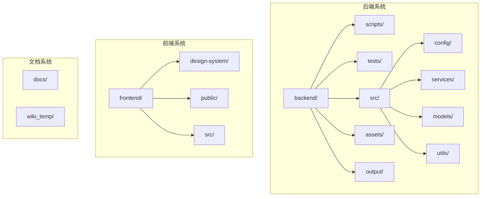

**图表来源**
- [pyproject.toml:1-69](file://backend/pyproject.toml#L1-L69)
- [package.json:1-31](file://frontend/package.json#L1-L31)

**章节来源**
- [pyproject.toml:1-69](file://backend/pyproject.toml#L1-L69)
- [package.json:1-31](file://frontend/package.json#L1-L31)

## 核心组件

### 开发工具配置

项目配备了完整的开发工具链，包括代码格式化、静态检查、单元测试和类型检查：

| 工具类别 | 工具名称 | 版本 | 功能描述 |
|---------|---------|------|----------|
| 代码格式化 | black | ^24.1.1 | Python代码格式化工具 |
| 单元测试 | pytest | ^8.0.0 | Python测试框架 |
| 静态检查 | pylint | ^3.0.3 | Python代码质量检查 |
| 类型检查 | mypy | ^1.8.0 | Python类型检查工具 |
| 测试覆盖率 | pytest-cov | ^4.1.0 | 测试覆盖率统计 |

### 环境配置管理

系统使用dotenv进行环境变量管理，支持多环境配置：

- **IMAP邮件配置**：QQ邮箱IMAP服务器设置
- **数据库配置**：支持SQLite和PostgreSQL
- **日志配置**：可配置的日志级别和输出文件
- **Supabase配置**：云端数据库连接参数
- **Etsy API配置**：可选的Etsy平台API密钥
- **4PX API配置**：生产环境API密钥和基础URL

**章节来源**
- [pyproject.toml:37-48](file://backend/pyproject.toml#L37-L48)
- [.env.example:1-30](file://backend/.env.example#L1-L30)
- [settings.py:12-56](file://backend/src/config/settings.py#L12-L56)

## 架构概览

系统采用分层架构设计，确保各组件职责清晰、耦合度低：

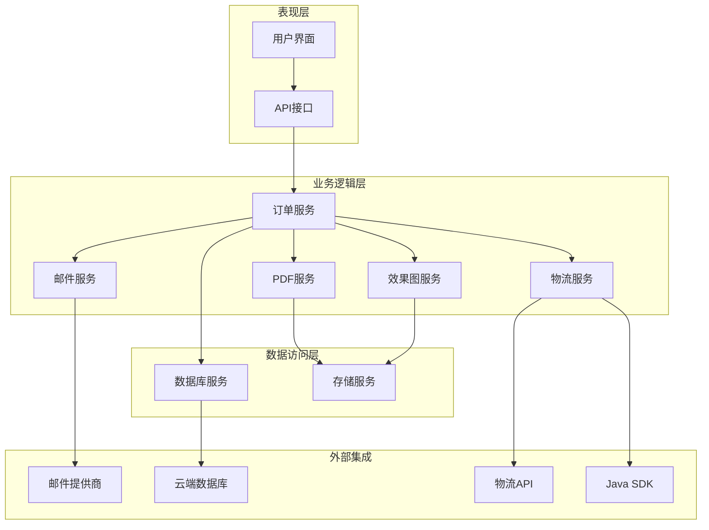

**图表来源**
- [order.py:23-92](file://backend/src/models/order.py#L23-L92)
- [settings.py:12-27](file://backend/src/config/settings.py#L12-L27)

## 详细组件分析

### 日志系统

日志系统提供了统一的日志记录功能，支持控制台和文件双重输出：

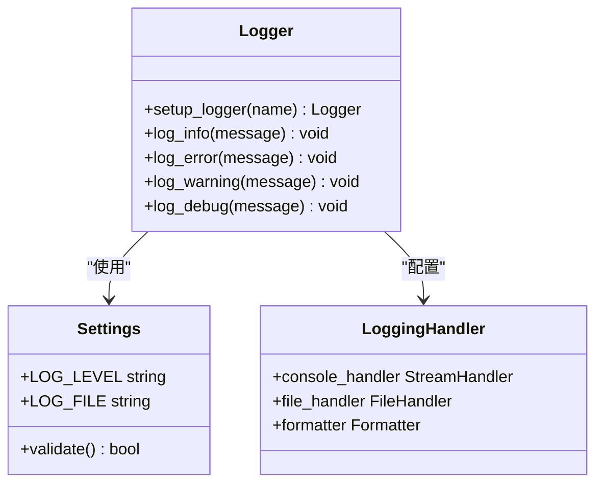

**图表来源**
- [logger.py:15-68](file://backend/src/utils/logger.py#L15-L68)
- [settings.py:21-22](file://backend/src/config/settings.py#L21-L22)

日志系统特点：
- 支持多种日志级别（INFO、ERROR、WARNING、DEBUG）
- 可配置的日志输出格式
- 自动创建日志文件目录
- 异常安全的文件写入机制

**章节来源**
- [logger.py:15-99](file://backend/src/utils/logger.py#L15-L99)

### 订单流程验证工具

**新增** 订单流程验证工具提供了完整的订单流转阶段数据完整性检查：

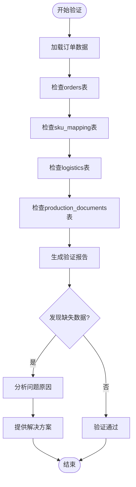

**图表来源**
- [check_order_flow.py:16-149](file://backend/scripts/check_order_flow.py#L16-L149)
- [check_order_flow_v2.py:17-149](file://backend/scripts/check_order_flow_v2.py#L17-L149)

验证功能包括：
- 订单基础数据完整性检查
- SKU映射数据验证
- 物流数据完整性检查
- 生产文档数据验证
- 自动问题分析和解决方案建议

**章节来源**
- [check_order_flow.py:1-149](file://backend/scripts/check_order_flow.py#L1-L149)
- [check_order_flow_v2.py:1-149](file://backend/scripts/check_order_flow_v2.py#L1-L149)

### 生产订单处理工具

**新增** 生产订单处理工具实现了完整的订单自动化处理流程：

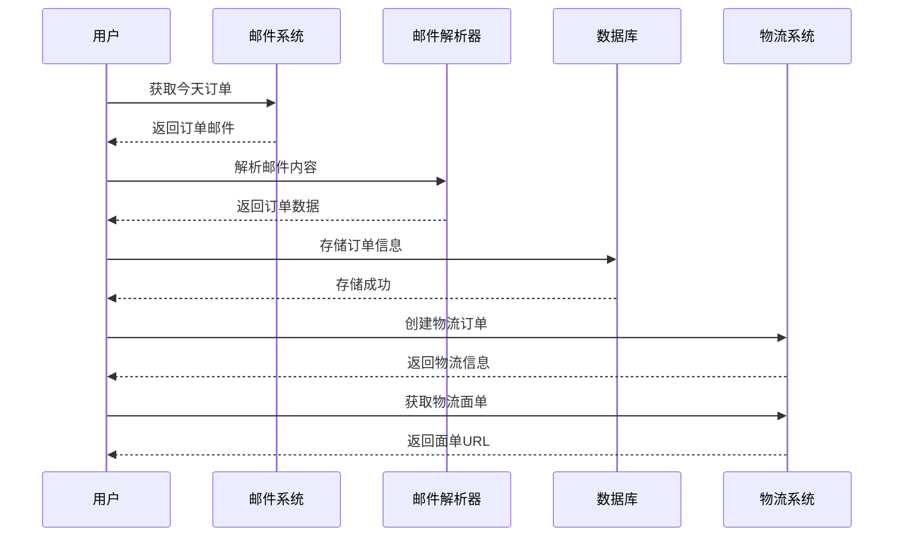

**图表来源**
- [process_today_order.py:147-404](file://backend/scripts/process_today_order.py#L147-L404)
- [fetch_today_orders.py:31-246](file://backend/scripts/fetch_today_orders.py#L31-L246)

处理流程包括：
- 邮件获取和解析
- 订单数据提取和验证
- 数据库存储
- 物流订单创建
- 面单生成和下载

**章节来源**
- [process_today_order.py:1-404](file://backend/scripts/process_today_order.py#L1-L404)
- [fetch_today_orders.py:1-246](file://backend/scripts/fetch_today_orders.py#L1-L246)

### 4PX API生产环境测试工具

**新增** 4PX API生产环境测试工具提供了真实的API调用测试：

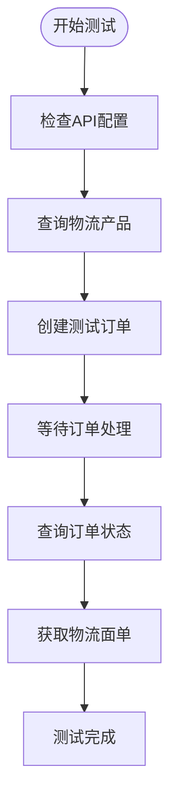

**图表来源**
- [test_4px_production_order.py:81-226](file://backend/scripts/test_4px_production_order.py#L81-L226)

测试功能包括：
- API密钥配置验证
- 物流产品查询测试
- 直发委托单创建测试
- 订单状态查询测试
- 物流面单获取测试

**章节来源**
- [test_4px_production_order.py:1-226](file://backend/scripts/test_4px_production_order.py#L1-L226)

### 真实订单流程测试工具

**新增** 真实订单流程测试工具验证了完整的端到端订单处理流程：

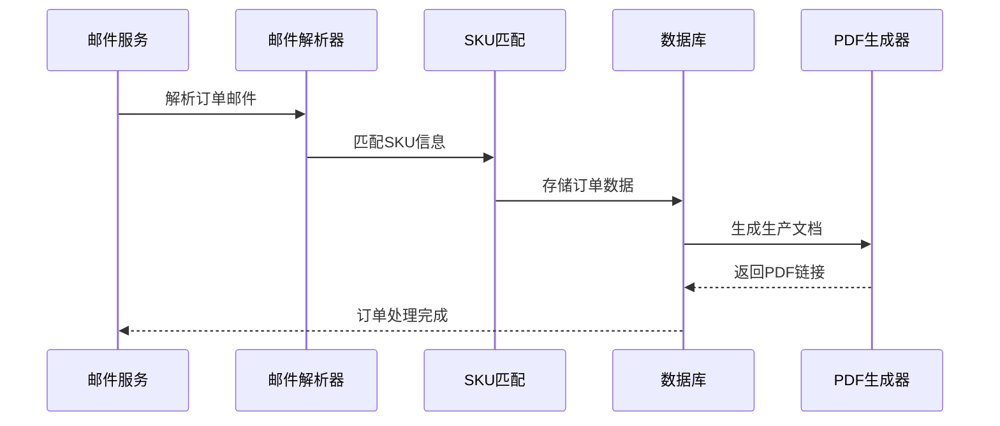

**图表来源**
- [test_real_order_flow.py:18-191](file://backend/scripts/test_real_order_flow.py#L18-L191)

测试流程包括：
- QQ邮箱连接测试
- 订单邮件搜索和获取
- 邮件内容解析验证
- SKU自动匹配测试
- 数据库存储验证
- 生产文档PDF生成测试

**章节来源**
- [test_real_order_flow.py:1-191](file://backend/scripts/test_real_order_flow.py#L1-L191)

### PDF数据流测试工具

**新增** PDF数据流测试工具验证了前后端数据传递的完整性：

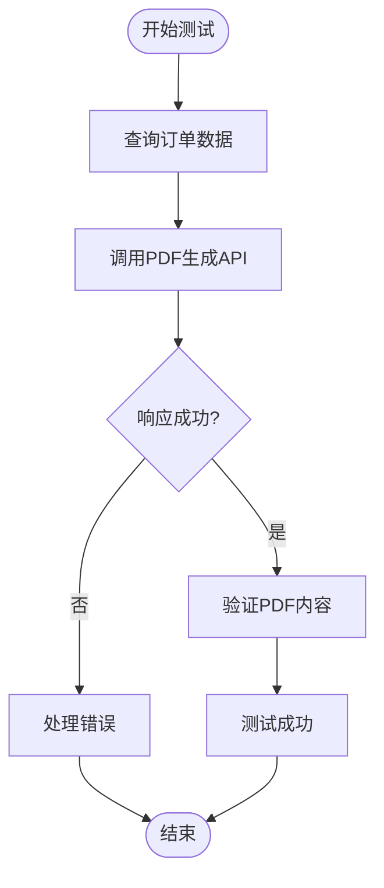

**图表来源**
- [test_pdf_data_flow.py:16-120](file://backend/scripts/test_pdf_data_flow.py#L16-L120)

测试功能包括：
- 订单数据查询验证
- PDF生成API调用测试
- 响应数据格式验证
- 错误处理机制测试

**章节来源**
- [test_pdf_data_flow.py:1-120](file://backend/scripts/test_pdf_data_flow.py#L1-L120)

### 邮件诊断工具

**新增** 邮件诊断工具帮助开发者理解真实的邮件格式：

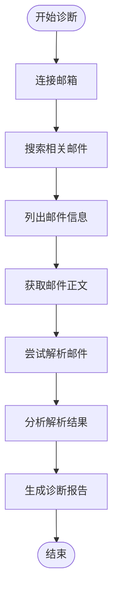

**图表来源**
- [diagnose_email.py:27-147](file://backend/scripts/diagnose_email.py#L27-L147)

诊断功能包括：
- 邮件服务器连接测试
- 相关邮件搜索和筛选
- 邮件信息列表展示
- 邮件正文内容提取
- 邮件解析器兼容性测试

**章节来源**
- [diagnose_email.py:1-147](file://backend/scripts/diagnose_email.py#L1-L147)

### 订单状态查询工具

**新增** 订单状态查询工具提供了多种查询方式：

| 工具名称 | 查询方式 | 功能描述 |
|---------|---------|----------|
| test_db_delivered.py | 直接数据库查询 | 查询状态为delivered的订单 |
| test_delivered_query.py | Supabase查询 | 使用Supabase客户端查询订单状态 |

**章节来源**
- [test_db_delivered.py:1-14](file://backend/scripts/test_db_delivered.py#L1-L14)
- [test_delivered_query.py:1-51](file://backend/scripts/test_delivered_query.py#L1-L51)

### 端到端测试框架

**新增** 完整的端到端测试框架提供了自动化全流程验证：

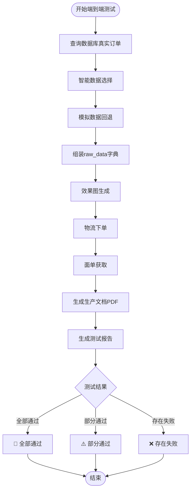

**图表来源**
- [e2e_full_test.py:40-402](file://backend/scripts/e2e_full_test.py#L40-L402)

测试框架特点：
- **智能数据选择**：优先选择已有物流信息的订单，其次选择有跟踪号的订单
- **步骤验证**：每个步骤都有独立的结果标记和状态检查
- **错误处理**：完善的异常捕获和降级处理机制
- **回退机制**：当真实数据不可用时自动使用模拟数据
- **全面覆盖**：从数据查询到PDF生成的完整流程验证

**章节来源**
- [e2e_full_test.py:1-402](file://backend/scripts/e2e_full_test.py#L1-L402)

### 4PX API诊断工具

**新增** 专门的4PX API诊断脚本用于加拿大运输参数验证：

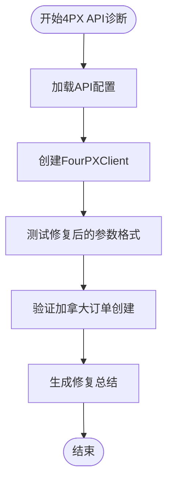

**图表来源**
- [diagnose_4px_ca.py:25-110](file://backend/scripts/diagnose_4px_ca.py#L25-L110)

诊断功能包括：
- **参数格式验证**：验证修复后的API参数结构
- **加拿大运输测试**：专门针对加拿大订单的参数验证
- **字段映射检查**：验证sender、recipient_info等字段的正确映射
- **单位转换测试**：验证重量单位从千克到克的转换
- **错误处理验证**：确保API调用的错误处理机制正常工作

**章节来源**
- [diagnose_4px_ca.py:1-110](file://backend/scripts/diagnose_4px_ca.py#L1-L110)

### 订单状态查询工具

**新增** 订单状态查询工具提供了多种查询方式：

| 工具名称 | 查询方式 | 功能描述 |
|---------|---------|----------|
| test_db_delivered.py | 直接数据库查询 | 查询状态为delivered的订单 |
| test_delivered_query.py | Supabase查询 | 使用Supabase客户端查询订单状态 |

**章节来源**
- [test_db_delivered.py:1-14](file://backend/scripts/test_db_delivered.py#L1-L14)
- [test_delivered_query.py:1-51](file://backend/scripts/test_delivered_query.py#L1-L51)

## 依赖分析

### 后端依赖关系

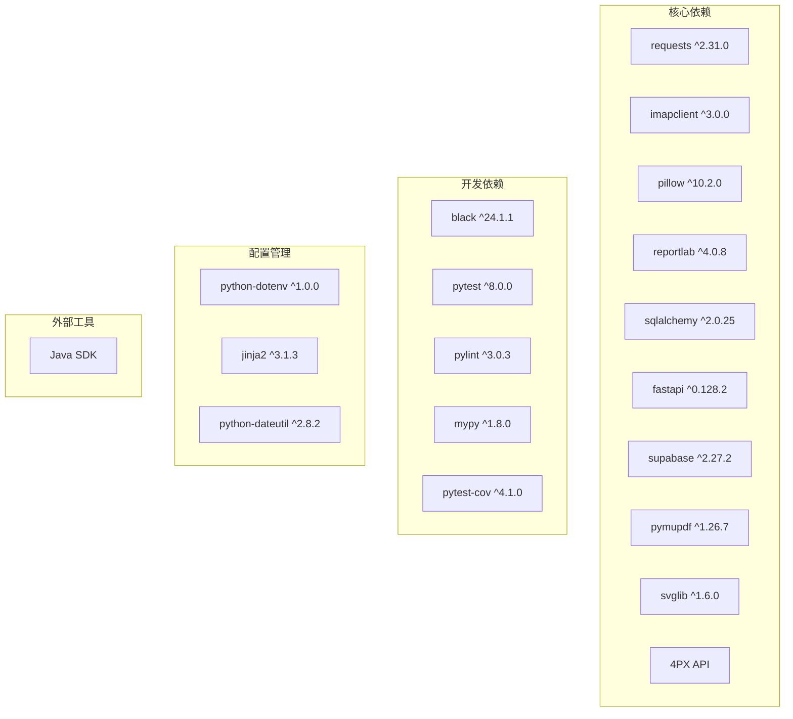

**图表来源**
- [pyproject.toml:8-36](file://backend/pyproject.toml#L8-L36)
- [pyproject.toml:37-48](file://backend/pyproject.toml#L37-L48)

### 前端依赖关系

前端依赖主要分为运行时依赖和开发依赖：

- **运行时依赖**：Vue.js、Element Plus、Axios、Day.js等
- **开发依赖**：Vite、TailwindCSS、PostCSS等构建工具

**章节来源**
- [package.json:11-29](file://frontend/package.json#L11-L29)

## 性能考虑

### 日志性能优化

日志系统采用了异步写入和缓冲机制，避免阻塞主线程：

- 控制台输出使用标准输出流，实时性强
- 文件输出采用追加模式，减少文件打开关闭开销
- 日志级别过滤，避免不必要的格式化操作

### 数据库连接池

数据库连接采用连接池管理，提高连接复用效率：

- SQLAlchemy会话管理
- 连接超时和重试机制
- 事务边界控制

### 缓存策略

系统实现了多层次缓存机制：

- 内存缓存：热点数据缓存
- 文件缓存：生成的PDF和图片缓存
- 数据库缓存：查询结果缓存

### API调用优化

**新增** 4PX API调用优化策略：
- 批量请求处理
- 连接池复用
- 超时和重试机制
- 错误码分类处理
- 等待时间合理设置

**新增** 端到端测试框架性能优化：
- **智能数据选择**：避免重复查询和无效操作
- **异常降级**：当某个步骤失败时不影响整体流程
- **进度跟踪**：详细的步骤状态反馈
- **资源清理**：测试完成后自动清理临时资源

## 故障排除指南

### 常见问题及解决方案

| 问题类型 | 症状描述 | 可能原因 | 解决方案 |
|---------|---------|----------|----------|
| 邮件连接失败 | IMAP连接超时或认证失败 | 网络问题或邮箱配置错误 | 检查IMAP服务器设置和授权码 |
| PDF生成失败 | PDF文件损坏或内容缺失 | 字体文件缺失或权限问题 | 验证字体文件路径和权限 |
| 数据库连接失败 | 无法连接到Supabase | 网络问题或凭据错误 | 检查网络连接和数据库凭据 |
| 图片处理异常 | 图片生成失败 | 图像处理库版本不兼容 | 更新Pillow库版本 |
| 签名验证失败 | 4PX API调用失败 | 签名算法不匹配 | 使用Java SDK或修正Python算法 |
| 订单解析失败 | 邮件格式不兼容 | 邮件格式变化或编码问题 | 使用邮件诊断工具分析格式 |
| 物流订单创建失败 | API返回错误码 | 参数格式或权限问题 | 检查API配置和请求参数 |
| PDF生成API调用失败 | 后端服务不可访问 | 服务未启动或网络问题 | 启动后端服务并检查防火墙 |
| 端到端测试失败 | 流程中断或数据不完整 | 测试数据不足或API异常 | 使用诊断工具定位问题 |
| 4PX API参数错误 | 订单创建失败 | 参数格式不正确 | 使用诊断脚本验证参数 |

### 调试工具使用

系统提供了丰富的调试工具：

- **环境变量验证**：检查配置文件加载情况
- **数据库连接测试**：验证数据库连通性
- **邮件解析测试**：验证邮件格式兼容性
- **PDF生成测试**：验证PDF内容和格式
- **4PX API测试**：验证物流接口调用
- **订单流程验证**：验证订单数据完整性
- **邮件诊断工具**：分析真实邮件格式
- **订单状态查询**：验证订单状态一致性
- **端到端测试框架**：自动化全流程验证
- **4PX API诊断工具**：专门的参数格式验证

**章节来源**
- [test_delivered_query.py:30-51](file://backend/scripts/test_delivered_query.py#L30-L51)
- [diagnose_email.py:32-147](file://backend/scripts/diagnose_email.py#L32-L147)

## 结论

本项目建立了完善的测试与开发工具体系，涵盖了从代码质量保证到功能验证的各个方面。通过模块化的架构设计和丰富的测试工具，确保了系统的稳定性和可维护性。

**更新** 新增的大量Python脚本进一步增强了系统的测试能力和开发效率，包括：

1. **完整的端到端测试框架**：从订单基础数据到生产文档的全流程验证，包含智能数据选择、步骤验证、错误处理和回退机制
2. **4PX API诊断工具**：专门针对加拿大运输参数的验证，确保API调用的准确性
3. **生产订单处理工具**：自动化的订单获取、解析、存储和物流处理
4. **4PX API生产环境测试**：真实的API调用测试和验证
5. **真实订单流程测试**：端到端的完整业务流程验证
6. **PDF数据流测试**：前后端数据传递的完整性验证
7. **邮件诊断工具**：深入分析真实邮件格式和解析兼容性
8. **订单状态查询工具**：多种查询方式的订单状态验证

主要优势包括：

1. **完整的工具链**：从代码格式化到测试覆盖率的全栈工具支持
2. **灵活的配置管理**：支持多环境配置和动态参数调整
3. **强大的测试覆盖**：包含单元测试、集成测试和端到端测试
4. **完善的错误处理**：多层次的异常捕获和恢复机制
5. **高效的开发流程**：自动化构建和部署支持
6. **专业的API测试**：针对4PX物流API的专业测试工具
7. **跨语言集成**：Java和Python的协同工作能力
8. **真实环境验证**：生产环境配置和真实数据的测试能力
9. **诊断分析工具**：深入分析问题根源的诊断工具集
10. **流程自动化**：从邮件获取到物流处理的完整自动化流程

这些工具和实践为项目的长期发展奠定了坚实基础，也为团队协作提供了有力保障。