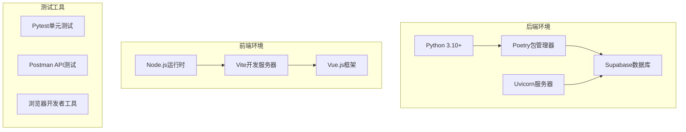
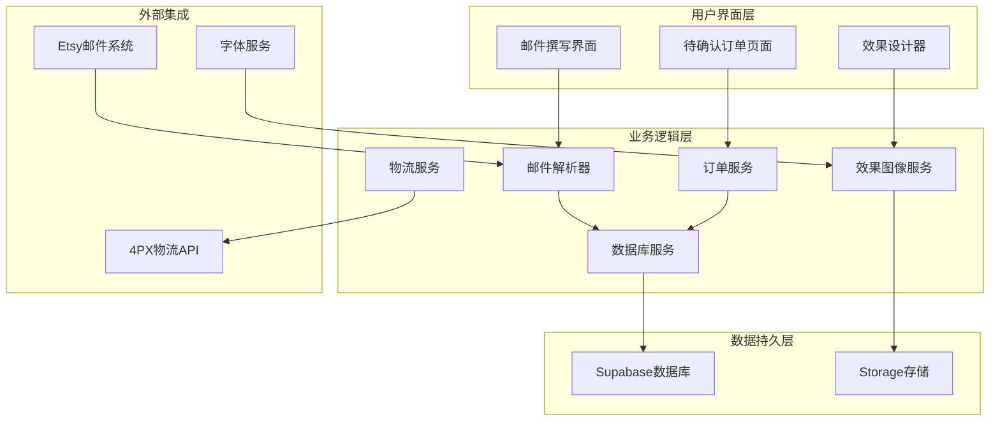
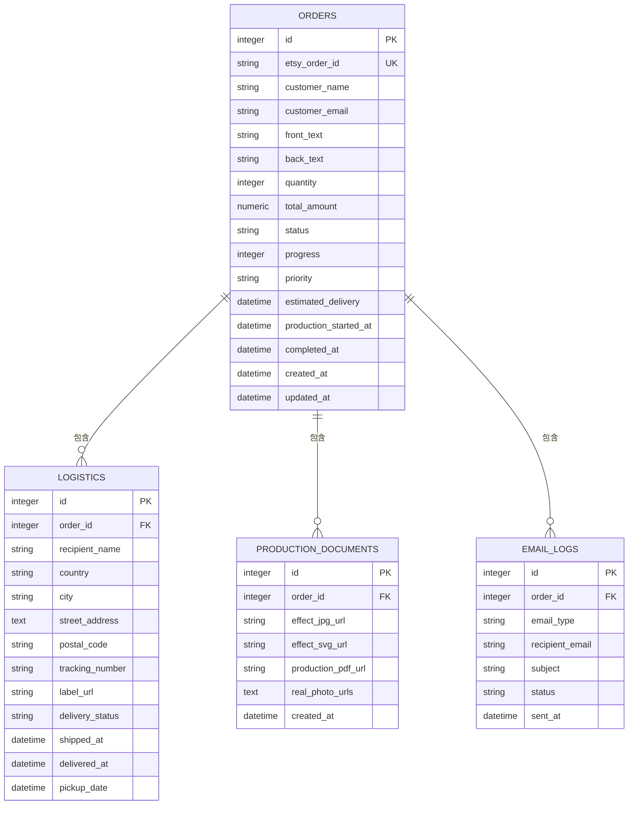
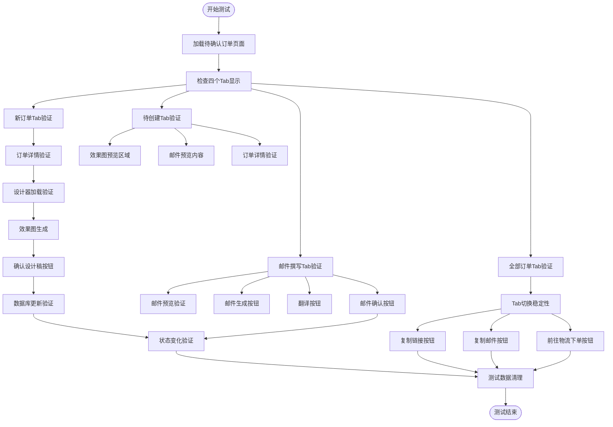
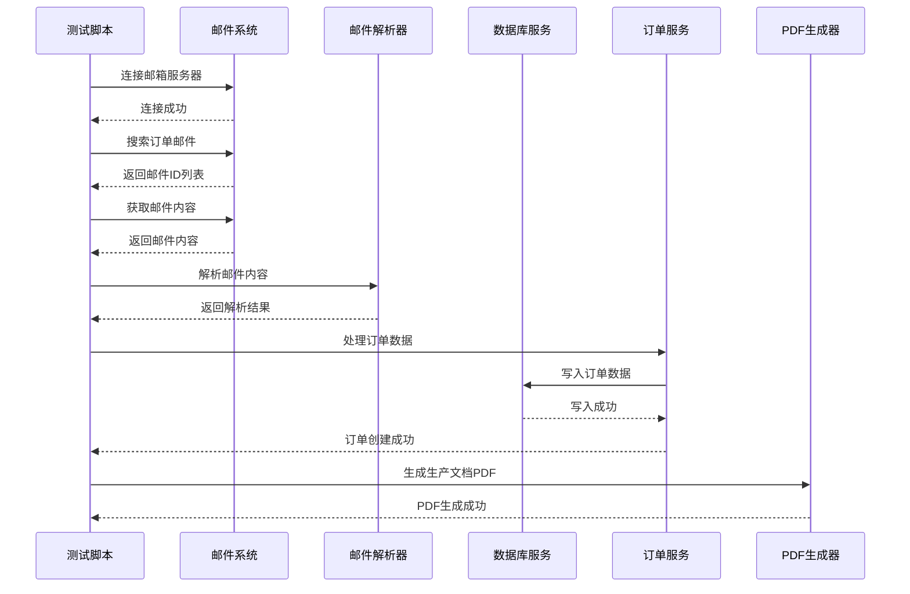
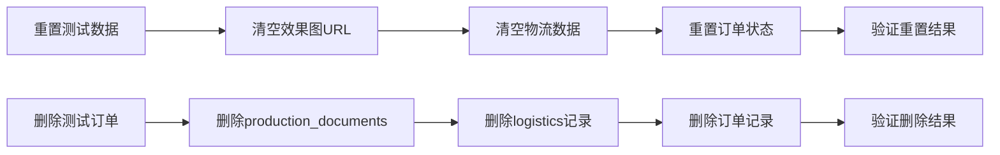
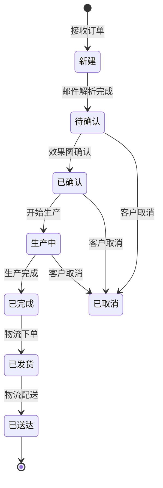

# 待确认订单测试文档

<cite>
**本文档引用的文件**
- [order.py](file://backend/src/models/order.py)
- [order_service.py](file://backend/src/services/order_service.py)
- [email_parser.py](file://backend/src/services/email_parser.py)
- [database_service.py](file://backend/src/services/database_service.py)
- [e2e_full_test.py](file://backend/scripts/e2e_full_test.py)
- [test_real_order_flow.py](file://backend/scripts/test_real_order_flow.py)
- [reset_orders_for_test.py](file://backend/scripts/reset_orders_for_test.py)
- [delete_test_orders.py](file://backend/scripts/delete_test_orders.py)
- [02_待确认订单_v3.html](file://frontend/public/02_待确认订单_v3.html)
- [designer_script.js](file://backend/tests/designer_script.js)
- [回归测试_订单端到端流程.md](file://docs/回归测试_订单端到端流程.md)
- [pyproject.toml](file://backend/pyproject.toml)
</cite>

## 目录
1. [项目概述](#项目概述)
2. [测试环境准备](#测试环境准备)
3. [核心组件架构](#核心组件架构)
4. [待确认订单流程测试](#待确认订单流程测试)
5. [端到端测试流程](#端到端测试流程)
6. [数据模型分析](#数据模型分析)
7. [测试用例设计](#测试用例设计)
8. [故障排除指南](#故障排除指南)
9. [性能考虑](#性能考虑)
10. [总结](#总结)

## 项目概述

ETSY订单自动化系统是一个完整的订单处理平台，专门用于处理Etsy平台的定制珠宝订单。该系统实现了从邮件接收、订单解析、效果图生成到物流下单的完整自动化流程。

### 系统特点

- **全自动化处理**：从Etsy订单邮件自动解析到生产文档生成
- **多语言支持**：支持中文和英文邮件模板
- **实时效果**：动态生成定制化效果图
- **状态管理**：完整的订单生命周期跟踪
- **多渠道集成**：支持多种物流服务集成

## 测试环境准备

### 环境要求

**图表来源**
- [pyproject.toml:1-69](file://backend/pyproject.toml#L1-L69)

### 依赖安装

系统使用Poetry进行依赖管理，核心依赖包括：

- **核心库**：requests、imapclient、pillow、reportlab、sqlalchemy
- **开发工具**：pytest、black、pylint、mypy
- **数据库**：supabase、fastapi、uvicorn

**章节来源**
- [pyproject.toml:8-36](file://backend/pyproject.toml#L8-L36)

## 核心组件架构

### 系统架构图

**图表来源**
- [order_service.py:91-145](file://backend/src/services/order_service.py#L91-L145)
- [email_parser.py:56-312](file://backend/src/services/email_parser.py#L56-L312)

### 数据模型关系

**图表来源**
- [order.py:23-234](file://backend/src/models/order.py#L23-L234)

**章节来源**
- [order.py:23-96](file://backend/src/models/order.py#L23-L96)

## 待确认订单流程测试

### 流程图

**图表来源**
- [回归测试_订单端到端流程.md:12-44](file://docs/回归测试_订单端到端流程.md#L12-L44)

### 关键测试点

| 测试类别 | 验证点 | 预期结果 |
|---------|--------|----------|
| 页面显示 | 四个Tab正确显示 | 新订单、邮件撰写、待创建、全部 |
| 订单数据 | 订单列表正确加载 | 订单状态、效果图列显示正确 |
| 功能交互 | 按钮点击响应 | 无JavaScript错误，功能正常 |
| 数据同步 | Tab间数据一致性 | 订单详情字段完全一致 |
| 状态流转 | 订单状态变化 | 从新订单到待创建的正确流转 |

**章节来源**
- [回归测试_订单端到端流程.md:8-44](file://docs/回归测试_订单端到端流程.md#L8-L44)

## 端到端测试流程

### 测试脚本架构

**图表来源**
- [test_real_order_flow.py:12-191](file://backend/scripts/test_real_order_flow.py#L12-L191)

### 测试数据准备

系统提供了专门的测试数据重置脚本：

**图表来源**
- [reset_orders_for_test.py:25-77](file://backend/scripts/reset_orders_for_test.py#L25-L77)

**章节来源**
- [reset_orders_for_test.py:1-77](file://backend/scripts/reset_orders_for_test.py#L1-L77)
- [delete_test_orders.py:1-67](file://backend/scripts/delete_test_orders.py#L1-L67)

## 数据模型分析

### 订单状态管理

系统实现了完整的订单状态生命周期管理：

**图表来源**
- [order.py:27-41](file://backend/src/models/order.py#L27-L41)

### 数据库约束

系统使用SQLAlchemy定义了严格的数据约束：

| 约束类型 | 约束条件 | 验证规则 |
|---------|----------|----------|
| 进度范围 | 0-100 | CheckConstraint('progress >= 0 AND progress <= 100') |
| 优先级枚举 | normal/high/urgent | CheckConstraint("priority IN ('normal', 'high', 'urgent')") |
| 物流状态枚举 | pending/shipped/in_transit/delivered/failed | CheckConstraint("delivery_status IN ('pending', 'shipped', 'in_transit', 'delivered', 'failed')") |

**章节来源**
- [order.py:82-138](file://backend/src/models/order.py#L82-L138)

## 测试用例设计

### 核心测试场景

基于回归测试文档，设计以下核心测试场景：

#### 1. 环境准备测试

验证系统启动和配置正确性：

- 后端服务启动：`poetry run uvicorn src.api.main:app --reload`
- 前端服务启动：`npm run dev`
- Supabase连接验证
- 环境变量配置检查

#### 2. 页面功能测试

验证待确认订单页面的核心功能：

- **Tab切换稳定性**：四个Tab间多次切换无错误
- **订单列表显示**：正确显示各状态订单
- **订单详情同步**：右侧详情与选中订单同步
- **按钮功能验证**：确认设计稿、复制链接、复制邮件等功能

#### 3. 数据一致性测试

验证跨Tab数据一致性：

- **字段一致性**：国家、客户、SKU、形状、尺寸、正背面文字
- **效果图URL一致性**：各Tab中效果图显示一致
- **实拍图一致性**：各Tab中实拍图显示一致

#### 4. 状态流转测试

验证订单状态正确流转：

- **新订单 → 邮件撰写**：效果图确认后状态变化
- **邮件撰写 → 待创建**：邮件确认后状态变化
- **数据更新验证**：数据库字段正确更新

**章节来源**
- [回归测试_订单端到端流程.md:12-44](file://docs/回归测试_订单端到端流程.md#L12-L44)

## 故障排除指南

### 常见问题及解决方案

#### 1. 数据库连接问题

**症状**：系统启动时报数据库连接错误

**解决方案**：
- 检查`.env`文件中的数据库连接字符串
- 验证Supabase服务状态
- 确认网络连接正常

#### 2. 邮件解析失败

**症状**：订单邮件无法正确解析

**解决方案**：
- 检查邮件格式是否符合预期
- 验证邮箱服务器连接
- 查看邮件内容编码问题

#### 3. 效果图生成异常

**症状**：设计器无法生成效果图

**解决方案**：
- 检查字体文件是否存在
- 验证SVG生成权限
- 确认存储空间充足

#### 4. PDF生成失败

**症状**：生产文档PDF无法生成

**解决方案**：
- 检查模板文件完整性
- 验证图像资源可用性
- 查看PDF生成日志

**章节来源**
- [e2e_full_test.py:145-150](file://backend/scripts/e2e_full_test.py#L145-L150)

### 调试工具使用

#### 1. 浏览器开发者工具

- **Network面板**：监控API请求和响应
- **Console面板**：查看JavaScript错误
- **Elements面板**：检查DOM结构

#### 2. 后端日志

- **Uvicorn日志**：查看服务器运行状态
- **数据库日志**：监控SQL执行情况
- **邮件服务日志**：跟踪邮件处理过程

## 性能考虑

### 系统性能指标

| 性能指标 | 目标值 | 测试方法 |
|---------|--------|----------|
| 页面加载时间 | < 3秒 | 浏览器性能面板 |
| API响应时间 | < 2秒 | Postman测试 |
| 数据库查询时间 | < 1秒 | SQL执行计划 |
| PDF生成时间 | < 5秒 | 性能测试脚本 |

### 优化建议

1. **缓存策略**：实现常用数据的缓存机制
2. **异步处理**：将耗时操作改为异步执行
3. **数据库优化**：添加必要的索引和查询优化
4. **前端优化**：实现懒加载和资源压缩

## 总结

待确认订单测试文档涵盖了ETSY订单自动化系统的完整测试方案。通过系统化的测试流程和严格的验证标准，确保了系统的稳定性和可靠性。

### 关键成果

- **全面的功能覆盖**：验证了从邮件解析到PDF生成的完整流程
- **严格的质量保证**：建立了完善的测试用例和验证标准
- **高效的故障定位**：提供了详细的故障排除指南和调试工具
- **持续的改进机制**：建立了回归测试和性能监控体系

### 后续改进建议

1. **自动化测试**：增加更多的自动化测试用例
2. **监控告警**：建立系统运行监控和告警机制
3. **性能优化**：持续优化系统性能和用户体验
4. **文档完善**：不断完善技术文档和用户手册

通过本测试文档的实施，可以确保ETSY订单自动化系统在各种使用场景下都能稳定可靠地运行，为用户提供优质的订单处理体验。