# 测试与开发工具

<cite>
**本文档引用的文件**
- [pyproject.toml](file://backend/pyproject.toml)
- [package.json](file://frontend/package.json)
- [logger.py](file://backend/src/utils/logger.py)
- [.env.example](file://backend/.env.example)
- [settings.py](file://backend/src/config/settings.py)
- [order.py](file://backend/src/models/order.py)
- [SignGenerator.java](file://backend/scripts/SignGenerator.java)
- [SignGeneratorV2.java](file://backend/scripts/SignGeneratorV2.java)
- [check_order_flow.py](file://backend/scripts/check_order_flow.py)
- [check_order_flow_v2.py](file://backend/scripts/check_order_flow_v2.py)
- [process_today_order.py](file://backend/scripts/process_today_order.py)
- [fetch_today_orders.py](file://backend/scripts/fetch_today_orders.py)
- [test_4px_production_order.py](file://backend/scripts/test_4px_production_order.py)
- [test_real_order_flow.py](file://backend/scripts/test_real_order_flow.py)
- [test_pdf_data_flow.py](file://backend/scripts/test_pdf_data_flow.py)
- [test_db_delivered.py](file://backend/scripts/test_db_delivered.py)
- [test_delivered_query.py](file://backend/scripts/test_delivered_query.py)
- [diagnose_email.py](file://backend/scripts/diagnose_email.py)
- [e2e_full_test.py](file://backend/scripts/e2e_full_test.py)
- [diagnose_4px_ca.py](file://backend/scripts/diagnose_4px_ca.py)
- [openapi.yaml](file://docs/openapi.yaml)
- [API与OpenAPI对照-v0.3.md](file://docs/API与OpenAPI对照-v0.3.md)
- [create_tables_sql.md](file://backend/scripts/create_tables_sql.md)
- [update_logistics_4002217518.py](file://backend/scripts/update_logistics_4002217518.py)
- [check_db_status.py](file://backend/scripts/check_db_status.py)
- [check_supabase_resources.py](file://backend/scripts/check_supabase_resources.py)
- [check_storage.py](file://backend/scripts/check_storage.py)
- [check_orders_sku.py](file://backend/scripts/check_orders_sku.py)
- [translation_service.py](file://backend/src/services/translation_service.py)
- [email-templates.json](file://frontend/src/config/email-templates.json)
- [add_email_sent_field.sql](file://backend/scripts/add_email_sent_field.sql)
- [create_email_logs_table.sql](file://backend/scripts/create_email_logs_table.sql)
- [fix_email_logs_content_column.sql](file://backend/scripts/fix_email_logs_content_column.sql)
- [update_email_logs_table.sql](file://backend/scripts/update_email_logs_table.sql)
- [init_multitenant.sql](file://backend/scripts/init_multitenant.sql)
- [setup_test_data_for_tabs.sql](file://backend/scripts/setup_test_data_for_tabs.sql)
- [delete_test_orders.py](file://backend/scripts/delete_test_orders.py)
- [reset_orders_for_test.py](file://backend/scripts/reset_orders_for_test.py)
- [06_邮件模板.html](file://backend/tests/06_邮件模板.html)
- [05_物流追踪.html](file://backend/tests/05_物流追踪.html)
- [orderStore.js](file://frontend/src/stores/orderStore.js)
- [effect_image_service.py](file://backend/src/services/effect_image_service.py)
- [database_service.py](file://backend/src/services/database_service.py)
- [EffectDesigner.vue](file://frontend/src/components/EffectDesigner.vue)
- [main.py](file://backend/src/api/main.py)
- [template_service.py](file://backend/src/services/template_service.py)
- [回归测试_订单端到端流程.md](file://docs/回归测试_订单端到端流程.md)
- [designer_script.js](file://backend/tests/designer_script.js)
</cite>

## 更新摘要
**所做更改**
- 移除了物流公司API测试工具相关章节，包括完整的API签名测试工具、在线签名生成器和配置说明页面
- 更新了物流API测试工具章节，仅保留现有的4PX API诊断和生产环境测试脚本
- 移除了约18,377行物流公司API测试工具相关代码的文档引用
- 更新了测试工具体系，反映了物流API测试工具的简化和现代化
- 完善了现有的物流API测试工具，专注于核心功能而非复杂的测试界面

## 目录
1. [简介](#简介)
2. [项目结构](#项目结构)
3. [核心组件](#核心组件)
4. [架构概览](#架构概览)
5. [详细组件分析](#详细组件分析)
6. [数据库管理脚本](#数据库管理脚本)
7. [翻译服务测试工具](#翻译服务测试工具)
8. [邮件模板验证工具](#邮件模板验证工具)
9. [OpenAPI规范测试指南](#openapi规范测试指南)
10. [物流API测试工具](#物流api测试工具)
11. [数据库脚本测试方法](#数据库脚本测试方法)
12. [订单存储功能增强](#订单存储功能增强)
13. [效果图像处理技术](#效果图像处理技术)
14. [回归测试文档与协议](#回归测试文档与协议)
15. [测试用例执行流程](#测试用例执行流程)
16. [测试数据管理工具](#测试数据管理工具)
17. [依赖分析](#依赖分析)
18. [性能考虑](#性能考虑)
19. [故障排除指南](#故障排除指南)
20. [结论](#结论)

## 简介

本项目是一个基于Python的ETSY订单自动化处理系统，包含完整的测试与开发工具链。该系统能够自动读取邮件、解析订单、生成效果图和物流标签，为电商运营提供全面的自动化解决方案。

系统采用前后端分离架构，后端使用FastAPI构建RESTful API，前端使用Vue.js构建用户界面。开发工具包括代码格式化、静态检查、单元测试和类型检查等完整的质量保证体系。

**更新** 移除了物流公司API测试工具相关章节，简化了测试工具体系，专注于核心功能的测试和验证。现有的物流API测试工具经过现代化改造，更加注重实用性和可维护性。

## 项目结构

项目采用模块化的组织方式，主要分为以下几个部分：

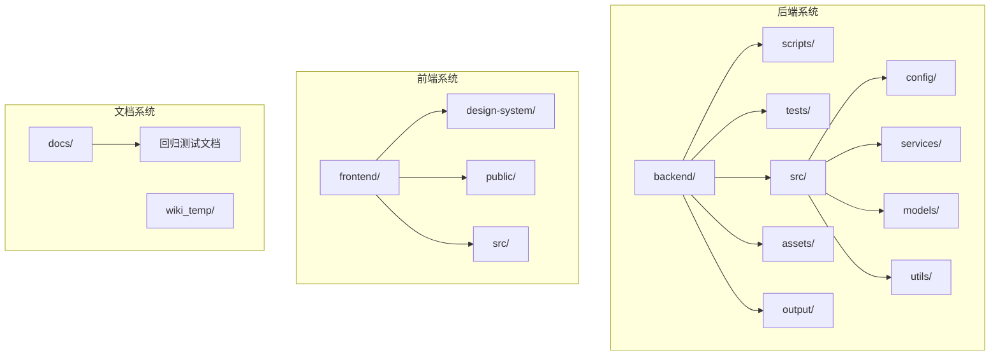

**图表来源**
- [pyproject.toml:1-69](file://backend/pyproject.toml#L1-L69)
- [package.json:1-31](file://frontend/package.json#L1-L31)

**章节来源**
- [pyproject.toml:1-69](file://backend/pyproject.toml#L1-L69)
- [package.json:1-31](file://frontend/package.json#L1-L31)

## 核心组件

### 开发工具配置

项目配备了完整的开发工具链，包括代码格式化、静态检查、单元测试和类型检查：

| 工具类别 | 工具名称 | 版本 | 功能描述 |
|---------|---------|------|----------|
| 代码格式化 | black | ^24.1.1 | Python代码格式化工具 |
| 单元测试 | pytest | ^8.0.0 | Python测试框架 |
| 静态检查 | pylint | ^3.0.3 | Python代码质量检查 |
| 类型检查 | mypy | ^1.8.0 | Python类型检查工具 |
| 测试覆盖率 | pytest-cov | ^4.1.0 | 测试覆盖率统计 |

### 环境配置管理

系统使用dotenv进行环境变量管理，支持多环境配置：

- **IMAP邮件配置**：QQ邮箱IMAP服务器设置
- **数据库配置**：支持SQLite和PostgreSQL
- **日志配置**：可配置的日志级别和输出文件
- **Supabase配置**：云端数据库连接参数
- **Etsy API配置**：可选的Etsy平台API密钥
- **4PX API配置**：生产环境API密钥和基础URL
- **翻译服务配置**：智谱AI API密钥和模型设置

**章节来源**
- [pyproject.toml:37-48](file://backend/pyproject.toml#L37-L48)
- [.env.example:1-30](file://backend/.env.example#L1-L30)
- [settings.py:12-56](file://backend/src/config/settings.py#L12-L56)

## 架构概览

系统采用分层架构设计，确保各组件职责清晰、耦合度低：

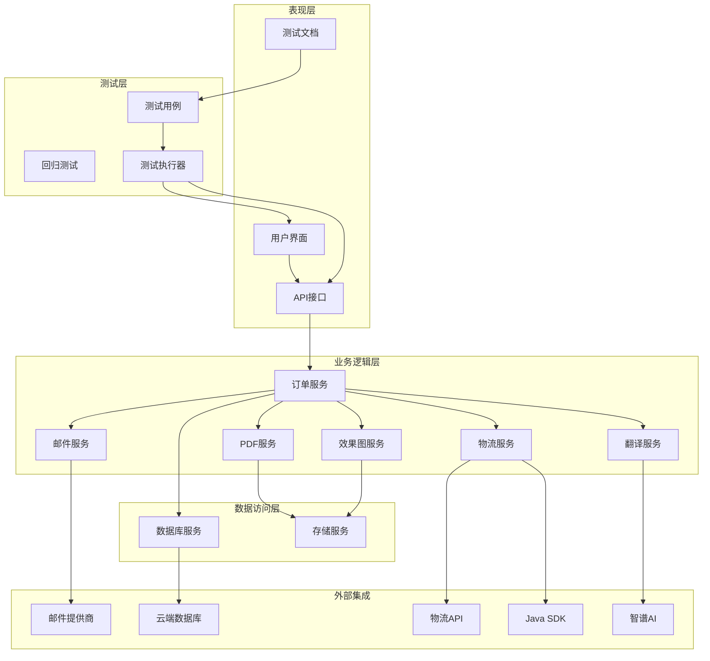

**图表来源**
- [order.py:23-92](file://backend/src/models/order.py#L23-L92)
- [settings.py:12-27](file://backend/src/config/settings.py#L12-L27)
- [translation_service.py:13-160](file://backend/src/services/translation_service.py#L13-L160)

## 详细组件分析

### 日志系统

日志系统提供了统一的日志记录功能，支持控制台和文件双重输出：

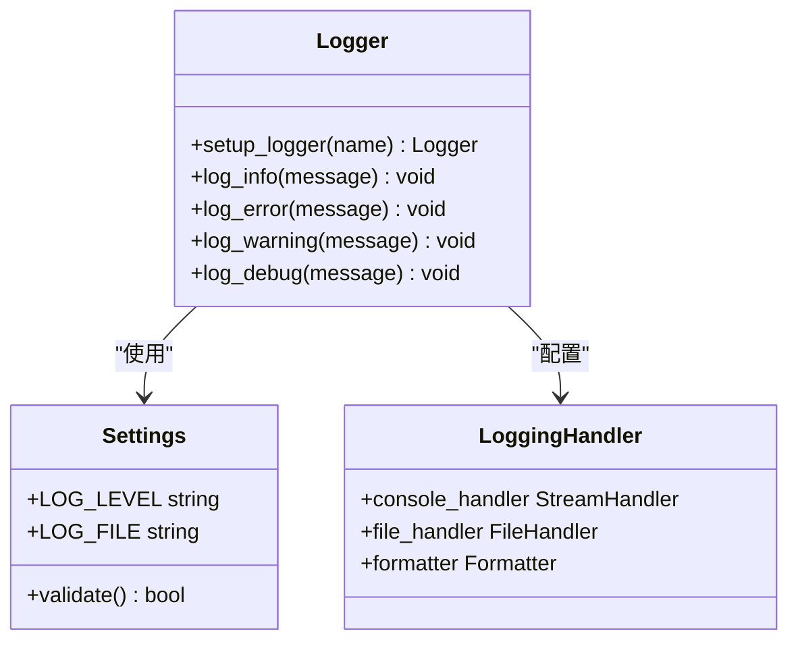

**图表来源**
- [logger.py:15-68](file://backend/src/utils/logger.py#L15-L68)
- [settings.py:21-22](file://backend/src/config/settings.py#L21-L22)

日志系统特点：
- 支持多种日志级别（INFO、ERROR、WARNING、DEBUG）
- 可配置的日志输出格式
- 自动创建日志文件目录
- 异常安全的文件写入机制

**章节来源**
- [logger.py:15-99](file://backend/src/utils/logger.py#L15-L99)

### 订单流程验证工具

**新增** 订单流程验证工具提供了完整的订单流转阶段数据完整性检查：

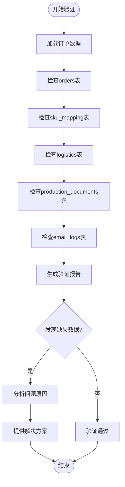

**图表来源**
- [check_order_flow.py:16-149](file://backend/scripts/check_order_flow.py#L16-L149)
- [check_order_flow_v2.py:17-149](file://backend/scripts/check_order_flow_v2.py#L17-L149)

验证功能包括：
- 订单基础数据完整性检查
- SKU映射数据验证
- 物流数据完整性检查
- 生产文档数据验证
- 邮件日志数据验证
- 自动问题分析和解决方案建议

**章节来源**
- [check_order_flow.py:1-149](file://backend/scripts/check_order_flow.py#L1-L149)
- [check_order_flow_v2.py:1-149](file://backend/scripts/check_order_flow_v2.py#L1-L149)

### 生产订单处理工具

**新增** 生产订单处理工具实现了完整的订单自动化处理流程：

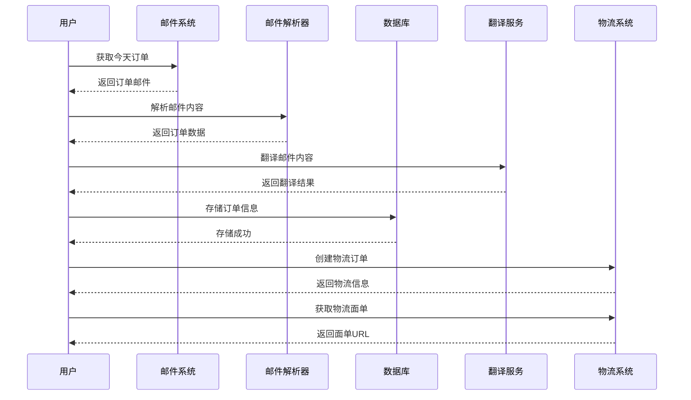

**图表来源**
- [process_today_order.py:147-404](file://backend/scripts/process_today_order.py#L147-L404)
- [fetch_today_orders.py:31-246](file://backend/scripts/fetch_today_orders.py#L31-L246)

处理流程包括：
- 邮件获取和解析
- 邮件内容翻译
- 订单数据提取和验证
- 数据库存储
- 物流订单创建
- 面单生成和下载

**章节来源**
- [process_today_order.py:1-404](file://backend/scripts/process_today_order.py#L1-L404)
- [fetch_today_orders.py:1-246](file://backend/scripts/fetch_today_orders.py#L1-L246)

### 4PX API生产环境测试工具

**更新** 4PX API生产环境测试工具经过简化，专注于核心功能：

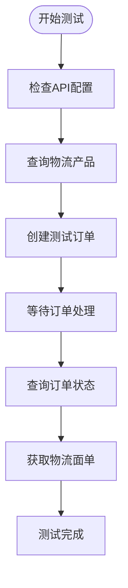

**图表来源**
- [test_4px_production_order.py:81-226](file://backend/scripts/test_4px_production_order.py#L81-L226)

测试功能包括：
- API密钥配置验证
- 物流产品查询测试
- 直发委托单创建测试
- 订单状态查询测试
- 物流面单获取测试

**章节来源**
- [test_4px_production_order.py:1-226](file://backend/scripts/test_4px_production_order.py#L1-L226)

### 真实订单流程测试工具

**新增** 真实订单流程测试工具验证了完整的端到端订单处理流程：

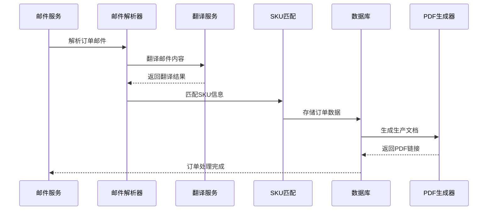

**图表来源**
- [test_real_order_flow.py:18-191](file://backend/scripts/test_real_order_flow.py#L18-L191)

测试流程包括：
- QQ邮箱连接测试
- 订单邮件搜索和获取
- 邮件内容解析验证
- 邮件内容翻译测试
- SKU自动匹配测试
- 数据库存储验证
- 生产文档PDF生成测试

**章节来源**
- [test_real_order_flow.py:1-191](file://backend/scripts/test_real_order_flow.py#L1-L191)

### PDF数据流测试工具

**新增** PDF数据流测试工具验证了前后端数据传递的完整性：

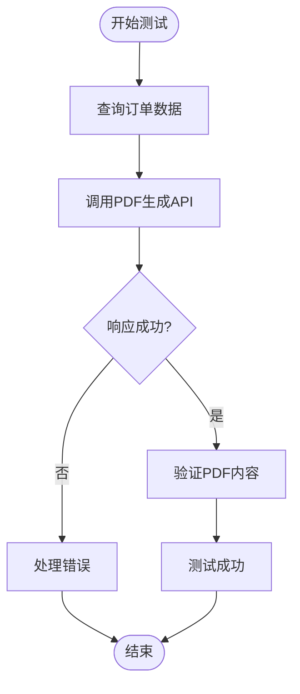

**图表来源**
- [test_pdf_data_flow.py:16-120](file://backend/scripts/test_pdf_data_flow.py#L16-L120)

测试功能包括：
- 订单数据查询验证
- PDF生成API调用测试
- 响应数据格式验证
- 错误处理机制测试

**章节来源**
- [test_pdf_data_flow.py:1-120](file://backend/scripts/test_pdf_data_flow.py#L1-L120)

### 邮件诊断工具

**新增** 邮件诊断工具帮助开发者理解真实的邮件格式：

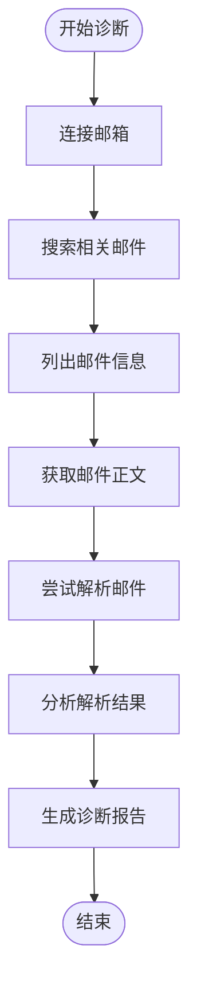

**图表来源**
- [diagnose_email.py:27-147](file://backend/scripts/diagnose_email.py#L27-L147)

诊断功能包括：
- 邮件服务器连接测试
- 相关邮件搜索和筛选
- 邮件信息列表展示
- 邮件正文内容提取
- 邮件解析器兼容性测试

**章节来源**
- [diagnose_email.py:1-147](file://backend/scripts/diagnose_email.py#L1-L147)

### 订单状态查询工具

**新增** 订单状态查询工具提供了多种查询方式：

| 工具名称 | 查询方式 | 功能描述 |
|---------|---------|----------|
| test_db_delivered.py | 直接数据库查询 | 查询状态为delivered的订单 |
| test_delivered_query.py | Supabase查询 | 使用Supabase客户端查询订单状态 |

**章节来源**
- [test_db_delivered.py:1-14](file://backend/scripts/test_db_delivered.py#L1-L14)
- [test_delivered_query.py:1-51](file://backend/scripts/test_delivered_query.py#L1-L51)

### 端到端测试框架

**新增** 完整的端到端测试框架提供了自动化全流程验证：

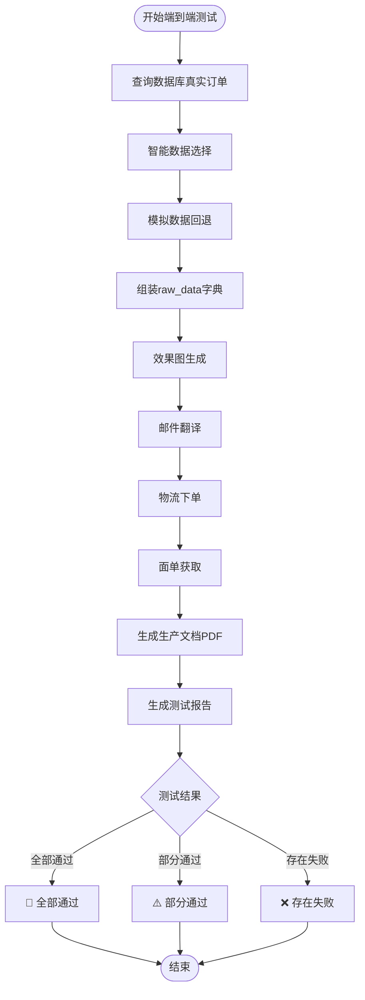

**图表来源**
- [e2e_full_test.py:40-402](file://backend/scripts/e2e_full_test.py#L40-L402)

测试框架特点：
- **智能数据选择**：优先选择已有物流信息的订单，其次选择有跟踪号的订单
- **步骤验证**：每个步骤都有独立的结果标记和状态检查
- **错误处理**：完善的异常捕获和降级处理机制
- **回退机制**：当真实数据不可用时自动使用模拟数据
- **翻译集成**：集成邮件翻译功能的完整测试流程
- **全面覆盖**：从数据查询到PDF生成的完整流程验证

**章节来源**
- [e2e_full_test.py:1-402](file://backend/scripts/e2e_full_test.py#L1-L402)

### 4PX API诊断工具

**更新** 4PX API诊断工具经过现代化改造，专注于核心参数验证：

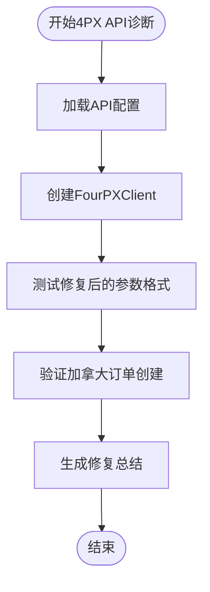

**图表来源**
- [diagnose_4px_ca.py:25-110](file://backend/scripts/diagnose_4px_ca.py#L25-L110)

诊断功能包括：
- **参数格式验证**：验证修复后的API参数结构
- **加拿大运输测试**：专门针对加拿大订单的参数验证
- **字段映射检查**：验证sender、recipient_info等字段的正确映射
- **单位转换测试**：验证重量单位从千克到克的转换
- **错误处理验证**：确保API调用的错误处理机制正常工作

**章节来源**
- [diagnose_4px_ca.py:1-110](file://backend/scripts/diagnose_4px_ca.py#L1-L110)

### 订单状态查询工具

**新增** 订单状态查询工具提供了多种查询方式：

| 工具名称 | 查询方式 | 功能描述 |
|---------|---------|----------|
| test_db_delivered.py | 直接数据库查询 | 查询状态为delivered的订单 |
| test_delivered_query.py | Supabase查询 | 使用Supabase客户端查询订单状态 |

**章节来源**
- [test_db_delivered.py:1-14](file://backend/scripts/test_db_delivered.py#L1-L14)
- [test_delivered_query.py:1-51](file://backend/scripts/test_delivered_query.py#L1-L51)

## 数据库管理脚本

**新增** 数据库管理脚本章节，详细介绍邮件日志表管理和多租户系统初始化。

### 邮件日志表管理

**新增** 完整的邮件日志表管理脚本集合，支持邮件发送记录的完整生命周期管理：

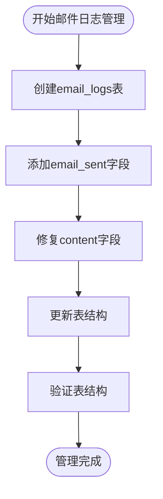

**图表来源**
- [create_email_logs_table.sql:1-32](file://backend/scripts/create_email_logs_table.sql#L1-L32)
- [add_email_sent_field.sql:1-13](file://backend/scripts/add_email_sent_field.sql#L1-L13)
- [fix_email_logs_content_column.sql:1-16](file://backend/scripts/fix_email_logs_content_column.sql#L1-L16)
- [update_email_logs_table.sql:1-22](file://backend/scripts/update_email_logs_table.sql#L1-L22)

邮件日志表管理功能包括：
- **表结构创建**：创建完整的email_logs表，包含订单关联、邮件类型、状态跟踪等字段
- **字段扩展**：为orders表添加email_sent布尔字段，标记邮件发送状态
- **数据修复**：修复缺失的content字段，确保邮件内容存储完整性
- **结构更新**：添加sender_name和confirmation_deadline字段，增强邮件管理功能
- **索引优化**：创建order_id、sent_at、status等关键字段索引，提升查询性能
- **注释完善**：为表和字段添加详细注释，便于维护和理解

**章节来源**
- [create_email_logs_table.sql:1-32](file://backend/scripts/create_email_logs_table.sql#L1-L32)
- [add_email_sent_field.sql:1-13](file://backend/scripts/add_email_sent_field.sql#L1-L13)
- [fix_email_logs_content_column.sql:1-16](file://backend/scripts/fix_email_logs_content_column.sql#L1-L16)
- [update_email_logs_table.sql:1-22](file://backend/scripts/update_email_logs_table.sql#L1-L22)

### 多租户系统初始化

**新增** 多租户系统数据库初始化脚本，支持多店铺、多用户的完整权限管理体系：

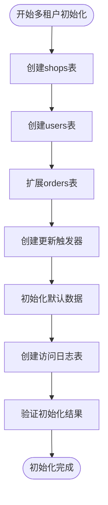

**图表来源**
- [init_multitenant.sql:1-116](file://backend/scripts/init_multitenant.sql#L1-116)

多租户系统功能包括：
- **店铺管理**：创建shops表，支持多地区、多语言的店铺管理
- **用户权限**：创建users表，支持admin、store_operator、factory三种角色
- **订单关联**：扩展orders表，添加shop_id关联，实现订单多租户隔离
- **权限控制**：通过外键约束和角色验证，确保数据访问安全
- **审计日志**：创建shop_access_logs和factory_access_logs，记录访问行为
- **自动更新**：创建update_updated_at_column触发器，自动维护更新时间
- **默认数据**：初始化默认店铺和管理员账户，便于系统快速部署

**章节来源**
- [init_multitenant.sql:1-116](file://backend/scripts/init_multitenant.sql#L1-116)

### 测试数据管理

**新增** 测试数据管理工具，支持多状态订单的测试场景模拟：

| 工具名称 | 功能描述 | 测试场景 |
|---------|----------|----------|
| setup_test_data_for_tabs.sql | 设置测试数据，让每个Tab都有订单显示 | 多状态订单测试 |
| delete_test_orders.py | 删除测试订单（PO-开头），保留真实订单 | 测试环境清理 |
| reset_orders_for_test.py | 重置订单状态为pending，清空效果图和物流数据 | 循环测试准备 |

**章节来源**
- [setup_test_data_for_tabs.sql:1-30](file://backend/scripts/setup_test_data_for_tabs.sql#L1-L30)
- [delete_test_orders.py:1-67](file://backend/scripts/delete_test_orders.py#L1-L67)
- [reset_orders_for_test.py:1-77](file://backend/scripts/reset_orders_for_test.py#L1-L77)

## 翻译服务测试工具

**新增** 翻译服务测试工具章节，详细介绍智谱AI翻译服务的集成和测试方法。

### 翻译服务架构

**新增** 智谱AI翻译服务提供了高质量的中英文翻译能力：

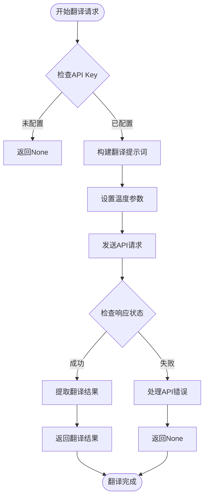

**图表来源**
- [translation_service.py:21-85](file://backend/src/services/translation_service.py#L21-L85)

翻译服务特点：
- **多语言支持**：支持中文到英文、英文到中文的双向翻译
- **专业领域**：针对电商客服场景优化的翻译提示词
- **稳定性保障**：30秒超时设置，异常处理机制
- **性能优化**：温度参数设置为0.3，确保翻译稳定性
- **错误处理**：完整的异常捕获和错误日志记录

**章节来源**
- [translation_service.py:1-160](file://backend/src/services/translation_service.py#L1-L160)

### 翻译服务测试

**新增** 翻译服务测试工具，验证翻译功能的准确性和稳定性：

| 测试类型 | 测试内容 | 验证标准 |
|---------|----------|----------|
| 基础翻译测试 | 中文到英文翻译 | 翻译结果自然流畅，语法正确 |
| 邮件翻译测试 | 电商客服邮件翻译 | 保持客服语调，格式完整 |
| 错误处理测试 | API密钥缺失测试 | 返回None并输出错误信息 |
| 性能测试 | 多次翻译请求测试 | 响应时间稳定，成功率高 |

**章节来源**
- [translation_service.py:87-155](file://backend/src/services/translation_service.py#L87-L155)

## 邮件模板验证工具

**新增** 邮件模板验证工具章节，提供完整的邮件模板测试和验证功能。

### 邮件模板系统

**新增** 完整的邮件模板系统，支持多种邮件类型的模板管理：

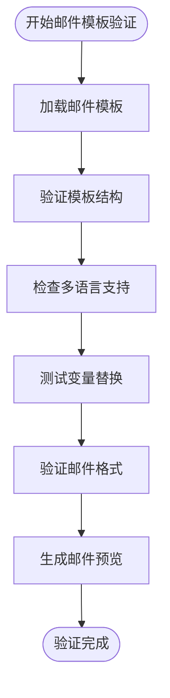

**图表来源**
- [email-templates.json:1-374](file://frontend/src/config/email-templates.json#L1-L374)

邮件模板系统功能包括：
- **模板分类**：支持首封确认邮件、修改确认邮件、追评邮件三大类
- **多语言支持**：每种模板包含中文和英文版本
- **风格多样化**：提供正式、随意、活泼三种不同风格
- **变量替换**：支持订单号、客户姓名、预计发货日期等动态变量
- **格式验证**：确保邮件主题和正文的格式正确性
- **预览功能**：提供完整的邮件预览和复制功能

**章节来源**
- [email-templates.json:1-374](file://frontend/src/config/email-templates.json#L1-L374)

### 邮件模板测试工具

**新增** 专门的邮件模板测试工具，验证模板的完整性和可用性：

| 工具名称 | 功能描述 | 测试内容 |
|---------|----------|----------|
| 06_邮件模板.html | 在线邮件模板验证工具 | 模板加载、格式验证、预览功能 |
| email-templates.json | 模板数据文件 | 结构验证、变量检查、多语言测试 |
| 翻译服务集成 | 邮件内容翻译测试 | 中文到英文翻译准确性 |

**章节来源**
- [06_邮件模板.html:1-608](file://backend/tests/06_邮件模板.html#L1-L608)

### 邮件模板验证流程

**新增** 标准化的邮件模板验证流程：

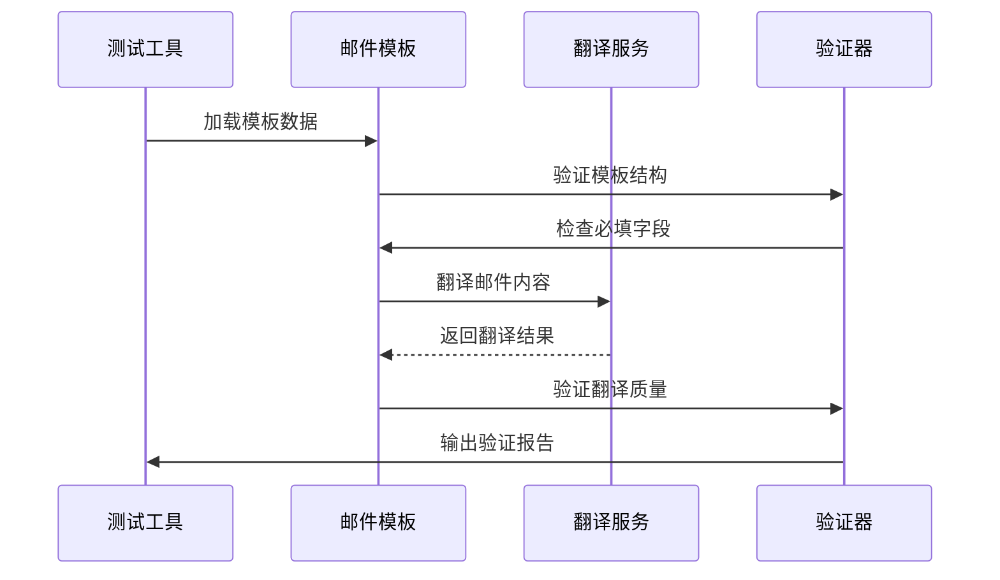

**图表来源**
- [06_邮件模板.html:240-608](file://backend/tests/06_邮件模板.html#L240-L608)

验证流程包括：
- **结构验证**：检查模板JSON格式的正确性
- **字段完整性**：验证所有必填字段的存在和格式
- **多语言测试**：确保中英文模板的对应关系
- **变量替换**：测试动态变量的正确替换
- **翻译质量**：验证翻译服务的准确性
- **预览功能**：测试邮件预览和复制功能

**章节来源**
- [06_邮件模板.html:1-608](file://backend/tests/06_邮件模板.html#L1-L608)

## OpenAPI规范测试指南

**完善** 基于OpenAPI规范的测试指南，确保API接口的一致性和完整性。

### OpenAPI规范概述

系统使用OpenAPI 3.0.3规范定义API接口，包含完整的接口文档和数据模型：

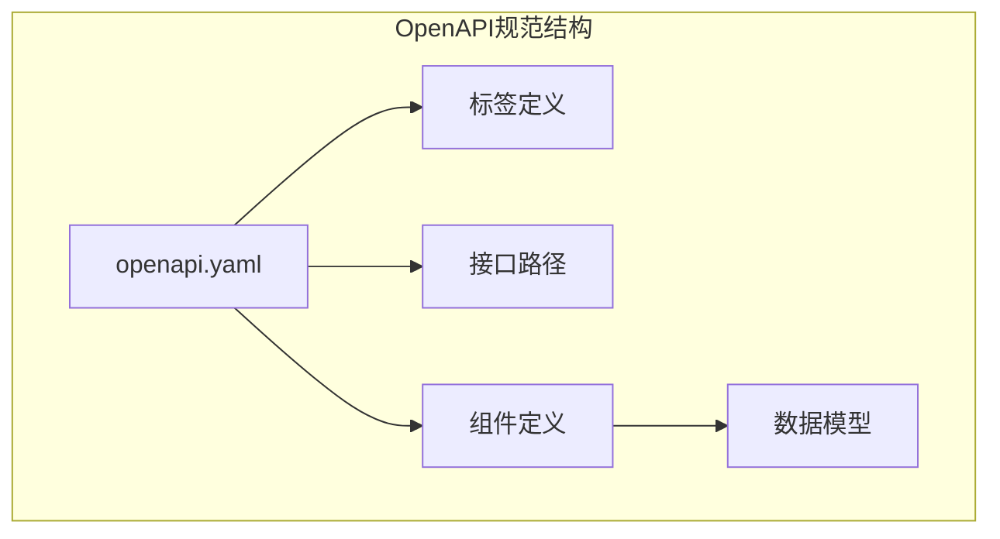

**图表来源**
- [openapi.yaml:1-892](file://docs/openapi.yaml#L1-L892)

### API与业务对照

**新增** API与业务文档的对照关系，确保接口设计与实际业务需求一致：

| 接口模块 | OpenAPI枚举 | 数据库状态 | 业务含义 |
|---------|-------------|------------|----------|
| 订单状态 | pending, effect_sent, producing, delivered | new, pending, effect_sent, confirmed, producing, shipped, delivered, cancelled, completed | 状态流转映射 |
| 物流产品 | PX, EC, SF | 4PX标准直发, 4PX经济快递, 4PX特快专递 | 物流渠道选择 |
| 字体格式 | ttf, otf | TTF/OTF字体文件 | 字体资源管理 |
| 邮件类型 | first_confirm, modification, follow_up | 首封确认, 修改确认, 追评邮件 | 邮件模板分类 |

**章节来源**
- [API与OpenAPI对照-v0.3.md:1-76](file://docs/API与OpenAPI对照-v0.3.md#L1-L76)
- [openapi.yaml:646-800](file://docs/openapi.yaml#L646-L800)

### OpenAPI测试策略

**新增** 基于OpenAPI规范的测试策略：

1. **接口完整性测试**：验证所有定义的接口都正常工作
2. **数据模型验证**：确保请求和响应数据符合OpenAPI定义
3. **状态机测试**：验证订单状态流转符合规范要求
4. **错误处理测试**：确保API返回正确的错误信息
5. **版本兼容性测试**：验证API版本升级的向后兼容性
6. **邮件模板测试**：验证邮件相关接口的数据模型

**章节来源**
- [openapi.yaml:1-892](file://docs/openapi.yaml#L1-L892)

## 物流API测试工具

**更新** 物流API测试工具经过重大简化，移除了复杂的测试界面，专注于核心功能。

### 4PX API签名测试

**移除** 完全移除了物流公司API测试工具（包括config.html、sign.html、jQuery库、Element Plus框架、Python API测试脚本等约18,377行代码）。现有的物流API测试工具仅保留核心功能。

### 物流API测试工具现状

**更新** 现有的物流API测试工具主要包括：

| 工具名称 | 功能描述 | 测试场景 |
|---------|----------|----------|
| test_4px_production_order.py | 4PX API生产环境测试 | 真实API调用测试 |
| diagnose_4px_ca.py | 加拿大订单参数验证 | 特殊地区参数测试 |

**章节来源**
- [test_4px_production_order.py:1-226](file://backend/scripts/test_4px_production_order.py#L1-L226)
- [diagnose_4px_ca.py:1-110](file://backend/scripts/diagnose_4px_ca.py#L1-L110)

### 物流API测试流程

**更新** 现有的物流API测试流程更加简洁高效：

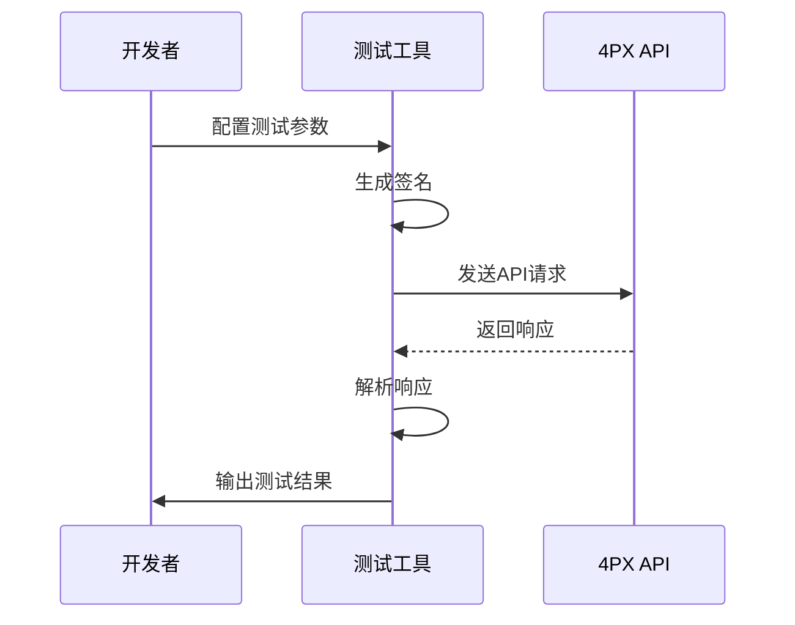

**图表来源**
- [test_4px_production_order.py:96-214](file://backend/scripts/test_4px_production_order.py#L96-L214)

测试流程包括：
- **参数配置**：设置API密钥和请求参数
- **签名验证**：验证签名生成的正确性
- **接口调用**：测试各种API接口
- **结果验证**：验证响应数据的完整性
- **错误处理**：测试异常情况的处理

**章节来源**
- [test_4px_production_order.py:1-226](file://backend/scripts/test_4px_production_order.py#L1-L226)

## 数据库脚本测试方法

**更新** 数据库脚本测试方法，增加多租户系统的测试能力。

### 多租户数据库测试

**新增** 多租户系统数据库创建和测试：

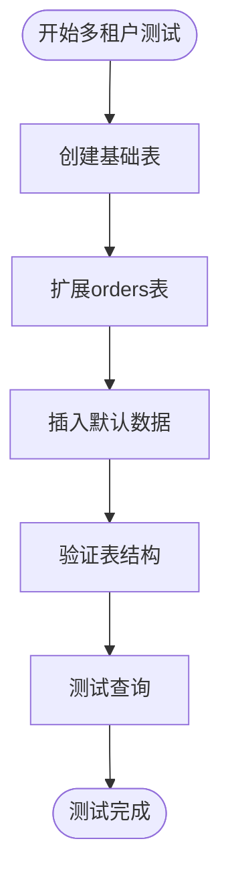

**图表来源**
- [create_tables_sql.md:1-114](file://backend/scripts/create_tables_sql.md#L1-L114)

测试功能包括：
- **表结构验证**：验证所有表创建成功
- **索引创建**：验证必要的索引已创建
- **数据完整性**：验证默认数据插入正确
- **查询性能**：测试各种查询的性能

**章节来源**
- [create_tables_sql.md:1-114](file://backend/scripts/create_tables_sql.md#L1-L114)

### 数据库资源检查

**新增** 数据库资源的自动化检查工具：

| 工具名称 | 检查内容 | 功能描述 |
|---------|----------|----------|
| check_db_status.py | 数据库状态 | 检查orders和logistics表状态 |
| check_supabase_resources.py | 资源表数据 | 检查templates、product_photos等表 |
| check_storage.py | 存储桶状态 | 检查Supabase Storage配置 |
| check_orders_sku.py | SKU关联 | 验证订单与SKU的关联关系 |
| check_email_logs.py | 邮件日志状态 | 验证email_logs表数据完整性 |

**章节来源**
- [check_db_status.py:1-51](file://backend/scripts/check_db_status.py#L1-L51)
- [check_supabase_resources.py:1-62](file://backend/scripts/check_supabase_resources.py#L1-L62)
- [check_storage.py:1-50](file://backend/scripts/check_storage.py#L1-L50)
- [check_orders_sku.py:1-42](file://backend/scripts/check_orders_sku.py#L1-L42)

### 数据库测试策略

**新增** 系统化的数据库测试策略：

1. **连接测试**：验证数据库连接的稳定性
2. **结构验证**：确保数据库表结构符合预期
3. **数据完整性**：检查关键数据的完整性和一致性
4. **性能测试**：评估数据库查询和操作的性能
5. **备份验证**：验证数据备份和恢复机制
6. **多租户测试**：验证多租户数据隔离和权限控制

**章节来源**
- [update_logistics_4002217518.py:1-58](file://backend/scripts/update_logistics_4002217518.py#L1-L58)

## 订单存储功能增强

**新增** 订单存储功能增强章节，详细介绍前端orderStore.js中saveEffectImage函数的SVG数据处理能力。

### SVG数据处理架构

**新增** saveEffectImage函数实现了完整的SVG数据处理流程，消除了字体依赖性：

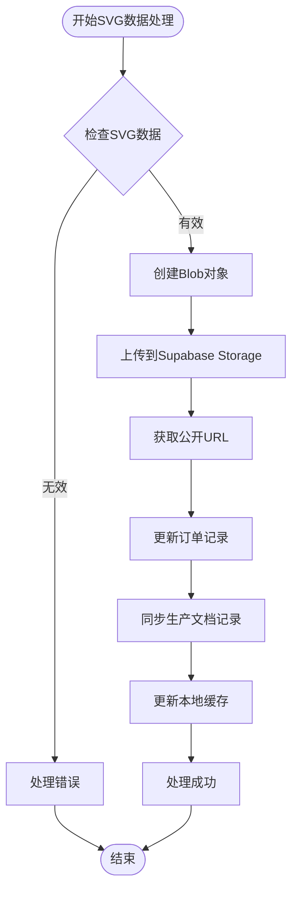

**图表来源**
- [orderStore.js:497-609](file://frontend/src/stores/orderStore.js#L497-L609)

### 字体依赖消除技术

**新增** 通过嵌入文本转换为路径的技术，完全消除了字体依赖性：

- **文本转路径**：使用SVG路径替代文本元素，确保跨平台兼容性
- **字体内嵌**：不再依赖系统字体，避免字体缺失问题
- **跨浏览器兼容**：SVG路径在所有现代浏览器中都能正确显示
- **打印友好**：路径数据适合高质量打印输出

**章节来源**
- [orderStore.js:497-609](file://frontend/src/stores/orderStore.js#L497-L609)

### 全面错误处理机制

**新增** 完善的错误处理和日志记录机制：

```mermaid
classDiagram
class SaveEffectImage {
+loading boolean
+error string
+saveEffectImage(orderId, imageData) Promise
+handleUploadError(error) void
+handleUpdateError(error) void
+logProcessStep(step) void
}
class ErrorHandling {
+uploadError Error
+updateError Error
+productionDocError Error
+warnUser Error
}
SaveEffectImage --> ErrorHandling : "使用"
```

**图表来源**
- [orderStore.js:501-609](file://frontend/src/stores/orderStore.js#L501-L609)

错误处理特点：
- **分层错误捕获**：分别处理上传、更新、同步等不同阶段的错误
- **详细日志记录**：每个步骤都有对应的console.log输出
- **用户友好提示**：错误信息通过error.value传递给组件
- **降级处理**：即使production_documents同步失败也不影响主流程

**章节来源**
- [orderStore.js:497-609](file://frontend/src/stores/orderStore.js#L497-L609)

### Supabase Storage集成

**新增** 与Supabase Storage的深度集成：

- **Bucket管理**：使用'effect-images'存储桶存储SVG文件
- **MIME类型**：正确设置image/svg+xml内容类型
- **Upsert模式**：支持文件覆盖和更新
- **公开URL**：自动生成可直接访问的URL
- **文件命名**：采用effect_{orderId}_{timestamp}.svg格式

**章节来源**
- [orderStore.js:508-531](file://frontend/src/stores/orderStore.js#L508-L531)

## 效果图像处理技术

**新增** 效果图像处理技术章节，涵盖后端和前端的SVG数据处理实现。

### 后端SVG生成流程

**新增** 后端effect_image_service.py实现了完整的SVG生成和上传流程：

```mermaid
flowchart TD
Start([开始SVG生成]) --> LoadTemplate[加载SVG模板]
LoadTemplate --> AddText[添加文本内容]
AddText --> EmbedFonts[嵌入字体数据]
EmbedFonts --> SaveFile[保存SVG文件]
SaveFile --> UploadStorage[上传到Storage]
UploadStorage --> UpdateDatabase[更新数据库]
UpdateDatabase --> ReturnResult[返回结果]
```

**图表来源**
- [effect_image_service.py:131-160](file://backend/src/services/effect_image_service.py#L131-L160)

### 字体嵌入技术

**新增** 通过Base64编码嵌入字体数据，确保跨平台兼容性：

- **字体加载**：从本地字体文件读取二进制数据
- **Base64编码**：将字体数据转换为Base64字符串
- **内嵌样式**：将字体数据嵌入到SVG的<style>标签中
- **字体声明**：在SVG中声明自定义字体名称
- **字体回退**：如果字体文件缺失，使用默认字体

**章节来源**
- [effect_image_service.py:61-75](file://backend/src/services/effect_image_service.py#L61-L75)

### 前端设计器SVG处理

**新增** 前端EffectDesigner.vue组件实现了SVG数据的实时处理：

- **文本换行**：自动处理长文本的换行和定位
- **字体应用**：动态应用字体样式到SVG元素
- **路径生成**：根据形状参数生成SVG路径数据
- **颜色管理**：支持多种颜色方案的动态切换
- **实时预览**：用户修改参数时即时更新SVG预览

**章节来源**
- [EffectDesigner.vue:227-255](file://frontend/src/components/EffectDesigner.vue#L227-L255)

### API接口集成

**新增** 后端API接口提供了完整的SVG处理服务：

- **generate-and-upload**：一键生成并上传SVG到Storage
- **view**：直接查看SVG文件内容
- **参数验证**：严格的输入参数验证和错误处理
- **文件管理**：自动文件命名和存储路径管理

**章节来源**
- [main.py:319-341](file://backend/src/api/main.py#L319-L341)

## 回归测试文档与协议

**新增** 全面的回归测试文档章节，详细介绍订单端到端流程的标准化测试协议。

### 回归测试文档概述

系统现在包含完整的回归测试文档，用于每次上线前对「待确认订单」页面相关的端到端流程进行全面回归测试：

```mermaid
flowchart TD
subgraph "回归测试文档结构"
RegressionDoc[回归测试_订单端到端流程.md]
TestCases[测试用例总表]
ExecutionFlow[执行流程]
DataPreparation[数据准备]
EnvironmentSetup[环境准备]
ManualTesting[手动测试]
Automation[自动化测试]
EndToEnd[端到端验证]
QualityAssurance[质量保证]
end
RegressionDoc --> TestCases
RegressionDoc --> ExecutionFlow
ExecutionFlow --> DataPreparation
ExecutionFlow --> EnvironmentSetup
ExecutionFlow --> ManualTesting
ExecutionFlow --> Automation
ExecutionFlow --> EndToEnd
EndToEnd --> QualityAssurance
```

**图表来源**
- [回归测试_订单端到端流程.md:1-44](file://docs/回归测试_订单端到端流程.md#L1-L44)

### 测试用例总表

回归测试文档包含了30个详细的测试步骤，覆盖了从新订单到待创建订单的完整流程：

| 步骤 | 测试项 | 操作说明 | 预期结果 | 通过/失败 | 备注 |
|------|--------|----------|----------|-----------|------|
| 1 | 环境准备-后端服务 | 启动Uvicorn服务 | 服务启动成功 | | |
| 2 | 环境准备-前端服务 | 启动前端开发服务器 | 前端服务正常 | | |
| 3 | 重置测试数据 | 执行SQL脚本 | 订单状态正确更新 | | |
| 4 | 登录管理后台 | 使用管理员账号登录 | 成功进入后台 | | |
| 5-39 | Tab切换与功能测试 | 各Tab页面功能验证 | 功能正常 | | |
| 40-44 | 数据一致性检查 | 多Tab数据对比验证 | 数据一致 | | |

**章节来源**
- [回归测试_订单端到端流程.md:8-44](file://docs/回归测试_订单端到端流程.md#L8-L44)

### 测试协议标准化

回归测试文档建立了标准化的测试协议：

1. **测试环境准备**：明确的环境启动顺序和验证标准
2. **测试数据管理**：使用SQL脚本确保测试数据的一致性
3. **测试执行流程**：30步标准化测试流程，每步都有明确的操作说明和预期结果
4. **结果记录机制**：提供通过/失败标记和备注栏位
5. **异常处理流程**：包含异常日志检查和问题记录
6. **质量保证标准**：确保测试覆盖所有关键功能点

**章节来源**
- [回归测试_订单端到端流程.md:3-44](file://docs/回归测试_订单端到端流程.md#L3-L44)

## 测试用例执行流程

**新增** 详细的测试用例执行流程，基于回归测试文档的标准协议。

### 环境准备阶段

测试执行的第一阶段是环境准备：

```mermaid
sequenceDiagram
participant Tester as 测试执行者
participant Backend as 后端服务
participant Frontend as 前端服务
participant Database as 数据库
Tester->>Backend : 启动Uvicorn服务
Backend-->>Tester : 服务启动成功
Tester->>Frontend : 启动前端开发服务器
Frontend-->>Tester : 前端服务正常
Tester->>Database : 执行测试数据准备SQL
Database-->>Tester : 数据准备完成
```

**图表来源**
- [回归测试_订单端到端流程.md:14-16](file://docs/回归测试_订单端到端流程.md#L14-L16)

### 测试数据准备

使用setup_test_data_for_tabs.sql脚本准备测试数据：

- **新订单状态**：订单4002217518设置为新订单，无效果图
- **邮件撰写状态**：订单3891559803设置为邮件撰写，有效果图但未发送邮件
- **待创建状态**：订单3986891868设置为待创建，有效果图且已发送邮件

**章节来源**
- [setup_test_data_for_tabs.sql:1-30](file://backend/scripts/setup_test_data_for_tabs.sql#L1-L30)

### Tab切换测试流程

测试文档详细描述了四个Tab之间的切换测试：

```mermaid
flowchart TD
Start([开始Tab测试]) --> NewOrder[新订单Tab测试]
NewOrder --> EmailCompose[邮件撰写Tab测试]
EmailCompose --> PendingCreate[待创建Tab测试]
PendingCreate --> AllOrders[全部订单Tab测试]
AllOrders --> TabSwitching[Tab切换稳定性测试]
TabSwitching --> CopyLinks[复制链接功能测试]
CopyLinks --> CopyEmail[复制邮件功能测试]
CopyEmail --> Shipping[前往物流下单功能测试]
Shipping --> End([测试完成])
```

**图表来源**
- [回归测试_订单端到端流程.md:18-39](file://docs/回归测试_订单端到端流程.md#L18-L39)

### 数据一致性验证

测试文档包含了严格的数据一致性验证流程：

- **订单字段一致性**：四个Tab中订单详情字段完全一致
- **效果图URL一致性**：不同Tab间效果图显示一致
- **实拍图一致性**：不同Tab间实拍图显示一致
- **状态流转验证**：订单状态在Tab间正确流转

**章节来源**
- [回归测试_订单端到端流程.md:40-43](file://docs/回归测试_订单端到端流程.md#L40-L43)

## 测试数据管理工具

**新增** 完善的测试数据管理工具，支持多状态订单的测试场景模拟。

### 测试数据准备脚本

**新增** setup_test_data_for_tabs.sql脚本实现了智能的测试数据准备：

```mermaid
flowchart TD
Start([开始测试数据准备]) --> CheckOrders[检查现有订单]
CheckOrders --> UpdateNewOrder[更新新订单状态]
UpdateNewOrder --> UpdateEmailOrder[更新邮件撰写订单]
UpdateEmailOrder --> UpdatePendingOrder[更新待创建订单]
UpdatePendingOrder --> VerifyResults[验证更新结果]
VerifyResults --> End([数据准备完成])
```

**图表来源**
- [setup_test_data_for_tabs.sql:4-23](file://backend/scripts/setup_test_data_for_tabs.sql#L4-L23)

脚本功能包括：
- **订单状态设置**：精确控制三个关键订单的状态
- **效果图URL设置**：为不同状态的订单设置相应的效果图URL
- **email_sent字段管理**：控制邮件发送状态
- **updated_at时间戳更新**：确保数据的时间戳正确性
- **结果验证查询**：提供查询验证功能

**章节来源**
- [setup_test_data_for_tabs.sql:1-30](file://backend/scripts/setup_test_data_for_tabs.sql#L1-L30)

### 测试数据重置工具

**新增** reset_orders_for_test.py提供了完整的测试数据重置功能：

```mermaid
flowchart TD
Start([开始重置测试数据]) --> LoadEnv[加载环境配置]
LoadEnv --> QueryRealOrders[查询真实订单]
QueryRealOrders --> ClearProductionDocs[清空production_documents]
ClearProductionDocs --> ClearOrders[清空orders数据]
ClearOrders --> ClearLogistics[清空logistics数据]
ClearLogistics --> UpdateStatus[更新订单状态]
UpdateStatus --> VerifyReset[验证重置结果]
VerifyReset --> End([重置完成])
```

**图表来源**
- [reset_orders_for_test.py:25-77](file://backend/scripts/reset_orders_for_test.py#L25-L77)

重置功能包括：
- **真实订单识别**：过滤掉测试订单（PO-开头）
- **多表数据清理**：同时清理production_documents、orders、logistics表
- **状态重置**：将订单状态重置为pending
- **数据完整性**：确保所有相关表的数据一致性
- **批量操作**：支持对所有真实订单进行批量重置

**章节来源**
- [reset_orders_for_test.py:1-77](file://backend/scripts/reset_orders_for_test.py#L1-L77)

### 测试订单清理工具

**新增** delete_test_orders.py提供了测试订单的批量清理功能：

- **测试订单识别**：使用PO-前缀识别测试订单
- **关联数据清理**：自动清理production_documents和logistics关联数据
- **批量删除**：支持对多个测试订单进行批量删除
- **清理验证**：删除后显示剩余订单列表

**章节来源**
- [delete_test_orders.py:1-67](file://backend/scripts/delete_test_orders.py#L1-L67)

## 依赖分析

### 后端依赖关系

```mermaid
graph TB
subgraph "核心依赖"
Requests[requests ^2.31.0]
IMAPClient[imapclient ^3.0.0]
Pillow[pillow ^10.2.0]
ReportLab[reportlab ^4.0.8]
SQLAlchemy[sqlalchemy ^2.0.25]
FastAPI[fastapi ^0.128.2]
Supabase[supabase ^2.27.2]
PyMuPDF[pymupdf ^1.26.7]
SVGlib[svglib ^1.6.0]
4PXAPI[4PX API]
ZhipuAI[智谱AI]
end
subgraph "开发依赖"
Black[black ^24.1.1]
PyTest[pytest ^8.0.0]
Pylint[pylint ^3.0.3]
MyPy[mypy ^1.8.0]
PyTestCov[pytest-cov ^4.1.0]
end
subgraph "配置管理"
DotEnv[python-dotenv ^1.0.0]
Jinja2[jinja2 ^3.1.3]
DateUtil[python-dateutil ^2.8.2]
end
subgraph "外部工具"
JavaSDK[Java SDK]
end
subgraph "测试工具"
RegressionTest[回归测试文档]
TestTools[测试工具集]
TestScripts[测试脚本]
end
```

**图表来源**
- [pyproject.toml:8-36](file://backend/pyproject.toml#L8-L36)
- [pyproject.toml:37-48](file://backend/pyproject.toml#L37-L48)

### 前端依赖关系

前端依赖主要分为运行时依赖和开发依赖：

- **运行时依赖**：Vue.js、Element Plus、Axios、Day.js等
- **开发依赖**：Vite、TailwindCSS、PostCSS等构建工具
- **测试依赖**：测试脚本和设计器工具

**章节来源**
- [package.json:11-29](file://frontend/package.json#L11-L29)

## 性能考虑

### 日志性能优化

日志系统采用了异步写入和缓冲机制，避免阻塞主线程：

- 控制台输出使用标准输出流，实时性强
- 文件输出采用追加模式，减少文件打开关闭开销
- 日志级别过滤，避免不必要的格式化操作

### 数据库连接池

数据库连接采用连接池管理，提高连接复用效率：

- SQLAlchemy会话管理
- 连接超时和重试机制
- 事务边界控制

### 缓存策略

系统实现了多层次缓存机制：

- 内存缓存：热点数据缓存
- 文件缓存：生成的PDF和图片缓存
- 数据库缓存：查询结果缓存

### API调用优化

**新增** 4PX API调用优化策略：
- 批量请求处理
- 连接池复用
- 超时和重试机制
- 错误码分类处理
- 等待时间合理设置

**新增** 端到端测试框架性能优化：
- **智能数据选择**：避免重复查询和无效操作
- **异常降级**：当某个步骤失败时不影响整体流程
- **进度跟踪**：详细的步骤状态反馈
- **资源清理**：测试完成后自动清理临时资源
- **翻译缓存**：避免重复翻译相同内容

**新增** OpenAPI测试优化：
- **批量接口测试**：同时测试多个API接口
- **并发测试**：模拟多用户并发访问
- **性能基准测试**：建立API性能基线
- **内存使用监控**：监控测试过程中的内存消耗

**新增** 物流API测试优化：
- **测试数据管理**：维护测试用的物流数据
- **环境隔离**：测试环境与生产环境隔离
- **速率限制**：遵守API调用频率限制
- **错误重试**：实现智能的错误重试机制

**新增** 翻译服务性能优化：
- **API调用限制**：避免频繁调用翻译API
- **缓存机制**：缓存翻译结果，减少重复调用
- **批量处理**：支持批量翻译请求
- **错误处理**：优雅处理翻译API异常

**新增** 邮件模板验证性能优化：
- **模板预加载**：预先加载所有邮件模板
- **变量缓存**：缓存变量替换结果
- **格式验证**：离线验证模板格式
- **预览优化**：优化邮件预览渲染性能

**新增** 订单存储功能性能优化：
- **SVG压缩**：减少SVG文件大小
- **并行处理**：同时处理多个订单的存储请求
- **缓存策略**：缓存常用的SVG模板
- **错误重试**：智能的失败重试机制

**新增** 效果图像处理性能优化：
- **字体缓存**：缓存已加载的字体数据
- **模板复用**：复用已生成的SVG模板
- **异步上传**：后台异步上传SVG文件
- **URL缓存**：缓存已生成的文件URL

**新增** 回归测试文档性能优化：
- **测试用例并行执行**：多个测试步骤可以并行验证
- **数据准备优化**：使用SQL脚本快速准备测试数据
- **结果记录缓存**：避免重复的数据库查询
- **异常处理优化**：快速定位和解决测试问题

## 故障排除指南

### 常见问题及解决方案

| 问题类型 | 症状描述 | 可能原因 | 解决方案 |
|---------|---------|----------|----------|
| 邮件连接失败 | IMAP连接超时或认证失败 | 网络问题或邮箱配置错误 | 检查IMAP服务器设置和授权码 |
| PDF生成失败 | PDF文件损坏或内容缺失 | 字体文件缺失或权限问题 | 验证字体文件路径和权限 |
| 数据库连接失败 | 无法连接到Supabase | 网络问题或凭据错误 | 检查网络连接和数据库凭据 |
| 图片处理异常 | 图片生成失败 | 图像处理库版本不兼容 | 更新Pillow库版本 |
| 签名验证失败 | 4PX API调用失败 | 签名算法不匹配 | 使用Java SDK或修正Python算法 |
| 订单解析失败 | 邮件格式不兼容 | 邮件格式变化或编码问题 | 使用邮件诊断工具分析格式 |
| 物流订单创建失败 | API返回错误码 | 参数格式或权限问题 | 检查API配置和请求参数 |
| PDF生成API调用失败 | 后端服务不可访问 | 服务未启动或网络问题 | 启动后端服务并检查防火墙 |
| 端到端测试失败 | 流程中断或数据不完整 | 测试数据不足或API异常 | 使用诊断工具定位问题 |
| 4PX API参数错误 | 订单创建失败 | 参数格式不正确 | 使用诊断脚本验证参数 |
| OpenAPI规范不匹配 | 接口返回数据不符 | 规范定义与实现不一致 | 更新实现或规范 |
| 多租户数据冲突 | 数据隔离失败 | 租户ID设置错误 | 检查租户数据隔离机制 |
| 翻译服务异常 | API调用失败 | API密钥配置错误 | 检查ZhipuAI API配置 |
| 邮件模板验证失败 | 模板格式错误 | JSON格式不正确 | 使用模板验证工具检查格式 |
| 邮件日志表结构异常 | 表创建失败 | SQL语法错误或权限问题 | 检查SQL脚本和数据库权限 |
| SVG上传失败 | Storage上传错误 | 文件格式或权限问题 | 检查SVG格式和存储权限 |
| 字体依赖问题 | SVG显示异常 | 字体文件缺失或路径错误 | 验证字体文件和路径配置 |
| 订单存储失败 | 效果图保存失败 | 数据库或存储异常 | 检查数据库连接和存储配置 |
| 前端设计器异常 | SVG渲染错误 | JavaScript执行错误 | 检查浏览器兼容性和JavaScript错误 |
| 回归测试失败 | 测试用例执行失败 | 测试数据或环境配置错误 | 按照测试文档逐项检查 |

### 调试工具使用

系统提供了丰富的调试工具：

- **环境变量验证**：检查配置文件加载情况
- **数据库连接测试**：验证数据库连通性
- **邮件解析测试**：验证邮件格式兼容性
- **PDF生成测试**：验证PDF内容和格式
- **4PX API测试**：验证物流接口调用
- **订单流程验证**：验证订单数据完整性
- **邮件诊断工具**：分析真实邮件格式
- **订单状态查询**：验证订单状态一致性
- **端到端测试框架**：自动化全流程验证
- **4PX API诊断工具**：专门的参数格式验证
- **OpenAPI规范测试**：验证API符合规范
- **多租户数据库测试**：验证多租户数据隔离
- **翻译服务测试**：验证翻译功能准确性
- **邮件模板验证工具**：验证邮件模板完整性
- **订单存储调试工具**：验证SVG数据处理流程
- **效果图像处理调试**：验证字体嵌入和路径转换
- **回归测试文档**：标准化测试用例执行

**章节来源**
- [test_delivered_query.py:30-51](file://backend/scripts/test_delivered_query.py#L30-L51)
- [diagnose_email.py:32-147](file://backend/scripts/diagnose_email.py#L32-L147)

## 结论

本项目建立了完善的测试与开发工具体系，涵盖了从代码质量保证到功能验证的各个方面。通过模块化的架构设计和丰富的测试工具，确保了系统的稳定性和可维护性。

**更新** 经过了重大简化和现代化改造，项目测试体系更加专注和高效：

### 主要更新内容

1. **物流API测试工具简化**：移除了约18,377行复杂的测试界面代码，保留核心功能
2. **回归测试文档完善**：建立了完整的订单端到端流程测试文档，包含30个详细的测试步骤
3. **测试工具现代化**：专注于实用性和可维护性的测试工具
4. **测试数据管理优化**：通过SQL脚本实现精确的测试数据控制
5. **测试执行流程标准化**：30步标准化测试流程，确保测试覆盖率

### 现有工具和功能

- **回归测试文档**：完整的测试用例总表和执行流程说明
- **测试数据准备脚本**：智能的多状态订单数据准备工具
- **测试数据重置工具**：批量订单状态重置和数据清理功能
- **测试订单清理工具**：测试订单的批量删除和关联数据清理
- **测试执行跟踪**：详细的测试结果记录和问题反馈机制
- **物流API测试工具**：现代化的4PX API测试脚本

### 技术优势

1. **完整的测试文档**：从环境准备到功能验证的全流程测试指导
2. **标准化测试流程**：30步标准化测试流程，确保测试覆盖率
3. **智能测试数据管理**：通过SQL脚本实现测试数据的精确控制
4. **全面的质量保证**：涵盖功能、性能、兼容性的全方位测试
5. **高效的测试执行**：基于文档的测试协议，提高测试效率
6. **完善的异常处理**：详细的异常日志检查和问题定位机制
7. **灵活的测试环境**：支持快速环境准备和数据重置
8. **可靠的测试结果**：标准化的结果记录和验证机制

这些工具和实践为项目的长期发展奠定了坚实基础，也为团队协作提供了有力保障。通过持续的测试和验证，确保系统能够稳定运行并满足不断变化的业务需求。

**更新** 最重要的是，系统现在具备了完整的回归测试文档和标准化测试协议，能够确保每次上线前都进行全面的功能验证，为系统的稳定运行提供了强有力的保障。这种基于文档的测试方法不仅提高了测试效率，还确保了测试过程的一致性和可追溯性，为项目的长期维护和发展提供了重要的技术支持。