# 管理面板功能增强

<cite>
**本文档引用的文件**
- [backend/src/api/main.py](file://backend/src/api/main.py)
- [backend/src/models/order.py](file://backend/src/models/order.py)
- [backend/src/services/order_service.py](file://backend/src/services/order_service.py)
- [backend/src/services/database_service.py](file://backend/src/services/database_service.py)
- [backend/src/config/settings.py](file://backend/src/config/settings.py)
- [backend/scripts/init_multitenant.sql](file://backend/scripts/init_multitenant.sql)
- [backend/scripts/create_factories_table.sql](file://backend/scripts/create_factories_table.sql)
- [backend/scripts/check_order_flow.py](file://backend/scripts/check_order_flow.py)
- [backend/scripts/update_status_to_chinese.py](file://backend/scripts/update_status_to_chinese.py)
- [backend/scripts/fix_status_constraint.py](file://backend/scripts/fix_status_constraint.py)
- [backend/scripts/check_status_values.py](file://backend/scripts/check_status_values.py)
- [backend/scripts/check_db_status.py](file://backend/scripts/check_db_status.py)
- [frontend/src/views/Admin/AdminDashboard.vue](file://frontend/src/views/Admin/AdminDashboard.vue)
- [frontend/src/views/Admin/AdminOrders.vue](file://frontend/src/views/Admin/AdminOrders.vue)
- [frontend/src/views/Admin/AdminEffects.vue](file://frontend/src/views/Admin/AdminEffects.vue)
- [frontend/src/views/Admin/OrdersPending.vue](file://frontend/src/views/Admin/OrdersPending.vue)
- [frontend/src/stores/adminStore.js](file://frontend/src/stores/adminStore.js)
- [frontend/src/stores/shopStore.js](file://frontend/src/stores/shopStore.js)
- [frontend/src/stores/orderStore.js](file://frontend/src/stores/orderStore.js)
- [frontend/src/layouts/AdminLayout.vue](file://frontend/src/layouts/AdminLayout.vue)
- [frontend/src/router/index.js](file://frontend/src/router/index.js)
- [frontend/src/views/Admin/AdminLogin.vue](file://frontend/src/views/Admin/AdminLogin.vue)
- [docs/openapi.yaml](file://docs/openapi.yaml)
- [docs/API与OpenAPI对照-v0.3.md](file://docs/API与OpenAPI对照-v0.3.md)
- [docs/开发文档-页面状态按钮-v1.0.md](file://docs/开发文档-页面状态按钮-v1.0.md)
</cite>

## 更新摘要
**变更内容**
- OrdersPending.vue从127行扩展到2333行，实现四状态工作流管理
- 新增四种订单状态：新订单、客户修改、待回复、待创建
- 实现两步确认系统：效果图确认和邮件发送确认
- 增强订单管理功能，包括客户修改处理和邮件重发机制
- 更新管理员布局系统中的订单统计功能，支持中文状态值
- **新增**：在发送邮件前自动保存最新的设计器生成效果图像到Supabase存储，确保客户收到最新视觉预览
- **新增**：增强了订单数据自动刷新机制，保证effect_image_url的时效性

## 目录
1. [简介](#简介)
2. [项目结构](#项目结构)
3. [核心组件](#核心组件)
4. [架构概览](#架构概览)
5. [详细组件分析](#详细组件分析)
6. [管理员布局系统](#管理员布局系统)
7. [权限管理](#权限管理)
8. [依赖关系分析](#依赖关系分析)
9. [性能考虑](#性能考虑)
10. [故障排除指南](#故障排除指南)
11. [结论](#结论)

## 简介

Etsy订单自动化系统是一个完整的电商订单管理解决方案，专注于为Etsy卖家提供从订单接收、效果图生成、邮件发送到物流配送的全流程自动化管理。该系统采用前后端分离架构，后端基于FastAPI构建RESTful API服务，前端使用Vue.js框架开发管理界面。

系统的核心功能包括：
- **四状态工作流管理**：从新订单到已完成的完整流程跟踪，支持新订单、客户修改、待回复、待创建四种状态
- **智能效果图生成**：基于订单信息自动生成定制化产品效果图
- **多渠道邮件营销**：预设邮件模板和个性化内容生成，支持AI辅助邮件生成
- **物流集成**：与4PX物流平台深度集成，支持自动下单和跟踪
- **多租户管理**：支持多个店铺和运营团队的独立管理
- **实时数据可视化**：仪表盘提供关键业务指标的实时监控
- **管理员布局系统**：提供实时的操作员和商店上下文显示功能
- **两步确认系统**：效果图确认和邮件发送的双重确认机制
- **自动存储集成**：在发送邮件前自动保存最新的设计器生成效果图像到Supabase存储
- **数据刷新机制**：增强的订单数据自动刷新，确保effect_image_url的时效性

## 项目结构

该项目采用清晰的分层架构设计，主要分为三个核心层次：

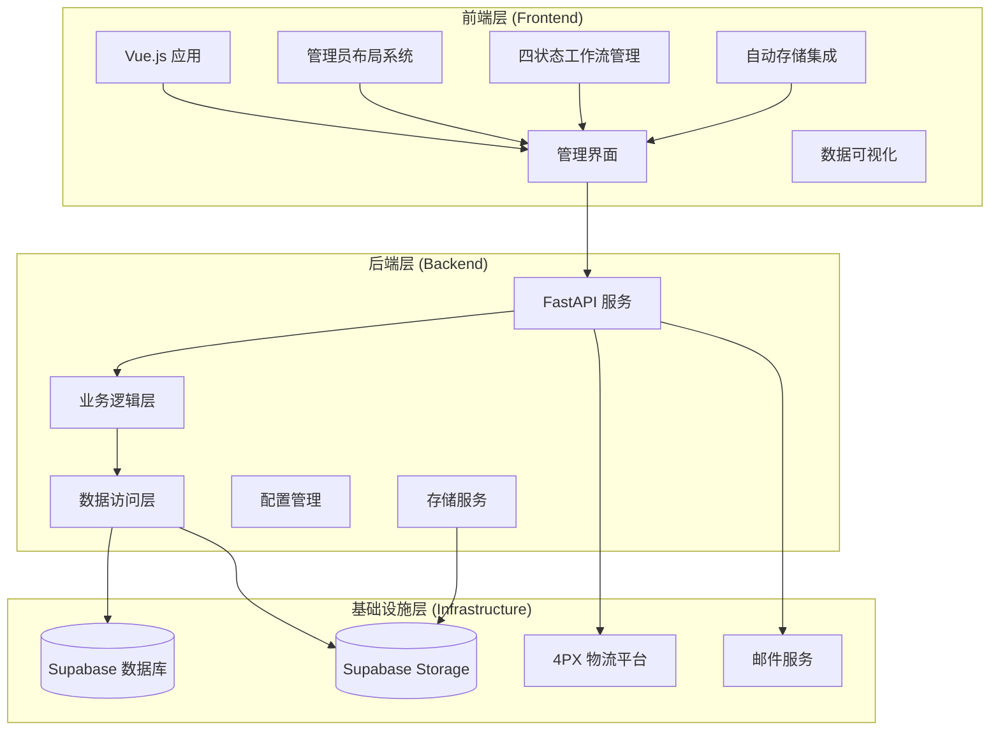

**图表来源**
- [backend/src/api/main.py:38-42](file://backend/src/api/main.py#L38-L42)
- [frontend/src/views/Admin/AdminDashboard.vue:1-460](file://frontend/src/views/Admin/AdminDashboard.vue#L1-L460)
- [frontend/src/layouts/AdminLayout.vue:1-286](file://frontend/src/layouts/AdminLayout.vue#L1-L286)

### 后端架构特点

后端采用模块化设计，每个功能模块都有明确的职责分工：

- **API层**：处理HTTP请求和响应，实现RESTful接口
- **服务层**：封装业务逻辑，协调不同模块间的交互
- **数据访问层**：抽象数据库操作，提供统一的数据访问接口
- **配置层**：管理应用配置和环境变量
- **存储服务层**：专门处理Supabase存储的上传和管理

### 前端架构特点

前端采用组件化开发模式，主要组件包括：

- **管理视图**：提供订单管理、效果管理、工厂管理等功能界面
- **管理员布局**：提供统一的管理界面布局和操作员上下文显示
- **状态管理**：使用Pinia进行全局状态管理
- **路由系统**：基于Vue Router实现页面导航
- **UI组件**：基于Element Plus构建用户界面
- **四状态工作流**：专门的订单管理组件支持四种状态的完整工作流
- **自动存储集成**：实时处理设计器生成的效果图并自动保存到存储

**章节来源**
- [backend/src/api/main.py:1-800](file://backend/src/api/main.py#L1-L800)
- [frontend/src/views/Admin/AdminDashboard.vue:1-460](file://frontend/src/views/Admin/AdminDashboard.vue#L1-L460)
- [frontend/src/layouts/AdminLayout.vue:1-286](file://frontend/src/layouts/AdminLayout.vue#L1-L286)

## 核心组件

### 订单管理系统

订单系统是整个自动化流程的核心，负责管理从订单创建到完成的完整生命周期。

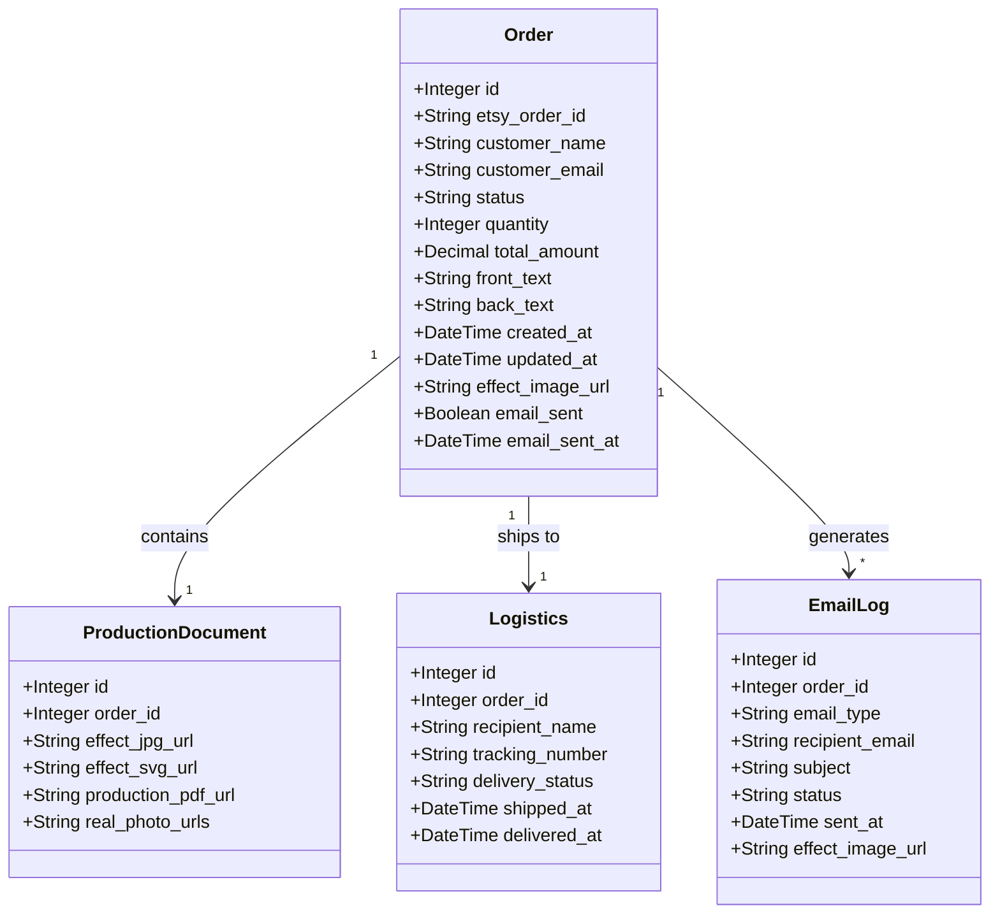

**图表来源**
- [backend/src/models/order.py:23-102](file://backend/src/models/order.py#L23-L102)

### 四状态工作流管理

系统实现了完整的四状态工作流管理，支持订单状态的完整生命周期：

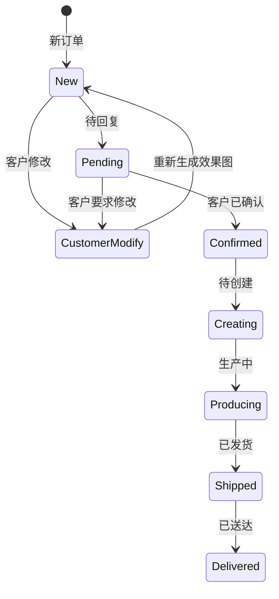

**图表来源**
- [frontend/src/views/Admin/OrdersPending.vue:61-66](file://frontend/src/views/Admin/OrdersPending.vue#L61-L66)
- [frontend/src/stores/orderStore.js:31-38](file://frontend/src/stores/orderStore.js#L31-L38)

### 多租户架构

系统支持多店铺、多运营团队的管理模式，通过租户隔离确保数据安全和权限控制。

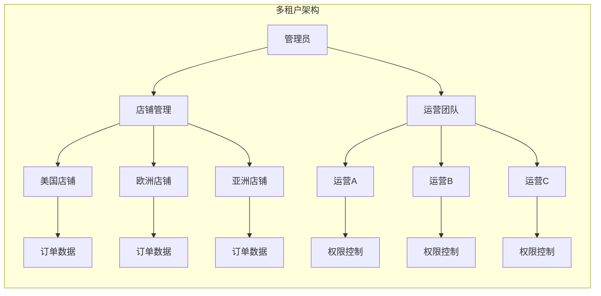

**图表来源**
- [backend/scripts/init_multitenant.sql:6-54](file://backend/scripts/init_multitenant.sql#L6-L54)

### 物流集成系统

系统与4PX物流平台深度集成，实现自动化的物流下单和跟踪功能。

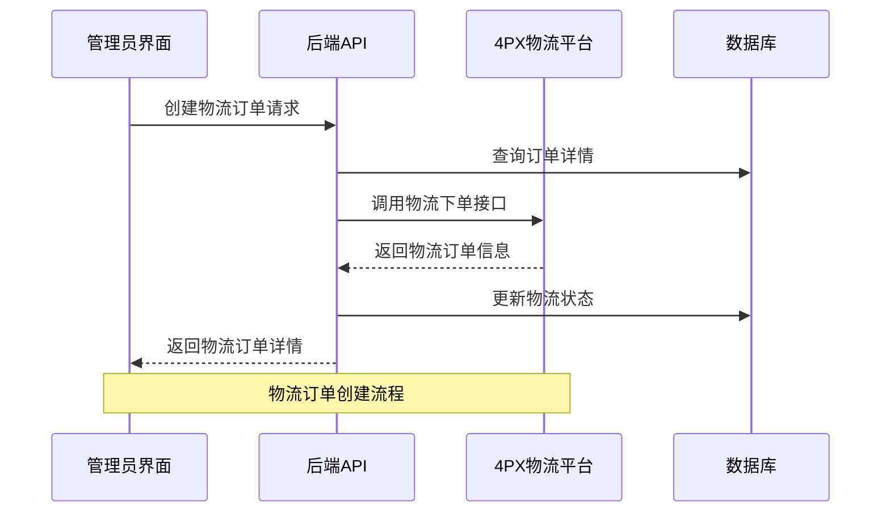

**图表来源**
- [backend/src/api/main.py:488-727](file://backend/src/api/main.py#L488-L727)

### 自动存储集成系统

系统实现了自动存储集成，确保在发送邮件前自动保存最新的设计器生成效果图像：

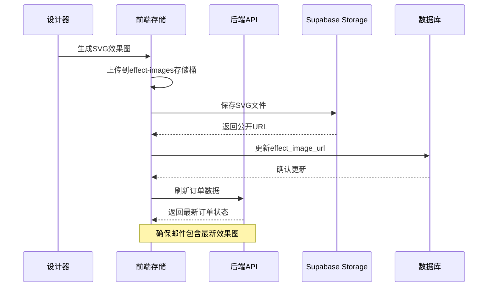

**图表来源**
- [frontend/src/stores/orderStore.js:615-728](file://frontend/src/stores/orderStore.js#L615-L728)
- [backend/src/services/effect_image_service.py:77-129](file://backend/src/services/effect_image_service.py#L77-L129)

**章节来源**
- [backend/src/models/order.py:1-356](file://backend/src/models/order.py#L1-L356)
- [backend/scripts/init_multitenant.sql:1-116](file://backend/scripts/init_multitenant.sql#L1-L116)

## 架构概览

系统采用现代化的微服务架构，各组件之间通过清晰的接口进行通信。

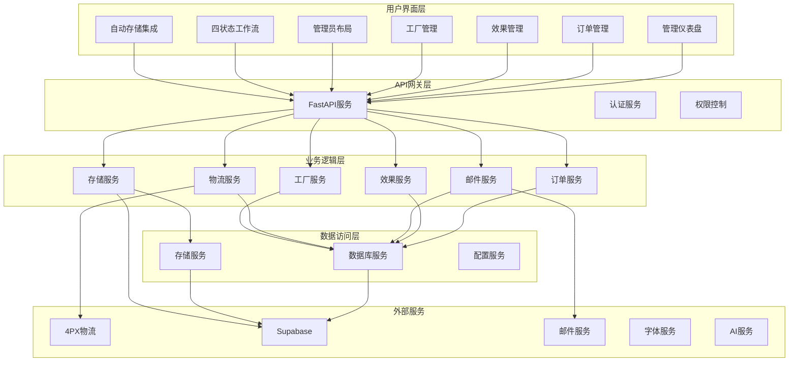

**图表来源**
- [backend/src/api/main.py:1-800](file://backend/src/api/main.py#L1-L800)
- [frontend/src/views/Admin/AdminDashboard.vue:1-460](file://frontend/src/views/Admin/AdminDashboard.vue#L1-L460)
- [frontend/src/layouts/AdminLayout.vue:1-286](file://frontend/src/layouts/AdminLayout.vue#L1-L286)

### 数据流架构

系统内部的数据流遵循标准化的处理流程：

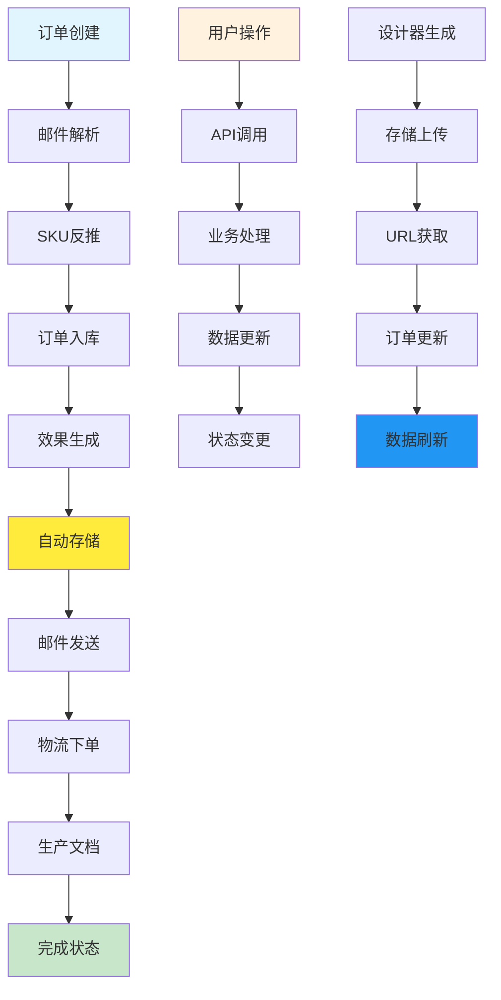

**图表来源**
- [backend/src/services/order_service.py:91-145](file://backend/src/services/order_service.py#L91-L145)
- [backend/src/api/main.py:304-320](file://backend/src/api/main.py#L304-L320)
- [frontend/src/stores/orderStore.js:615-728](file://frontend/src/stores/orderStore.js#L615-L728)

**章节来源**
- [backend/src/api/main.py:1-800](file://backend/src/api/main.py#L1-L800)
- [docs/openapi.yaml:1-200](file://docs/openapi.yaml#L1-L200)

## 详细组件分析

### 管理仪表盘组件

管理仪表盘是系统的核心界面，提供全面的业务概览和实时数据监控。

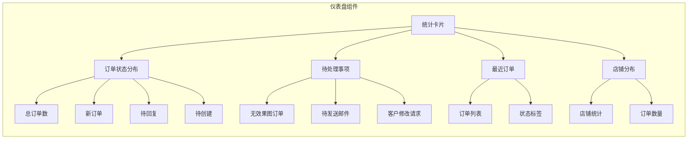

**图表来源**
- [frontend/src/views/Admin/AdminDashboard.vue:28-214](file://frontend/src/views/Admin/AdminDashboard.vue#L28-L214)

#### 统计数据展示

仪表盘提供多层次的统计数据展示，包括：

- **时间范围切换**：支持今日、本周、本月三种时间维度
- **订单状态统计**：实时显示各类订单的数量和占比
- **待处理事项**：突出显示需要立即处理的任务
- **快捷操作入口**：提供常用功能的快速访问

#### 数据可视化

系统采用现代化的数据可视化技术：

- **响应式布局**：适配不同屏幕尺寸的设备
- **交互式图表**：支持鼠标悬停和点击交互
- **实时更新**：数据变化时自动刷新显示
- **状态指示**：通过颜色和图标直观显示状态

**章节来源**
- [frontend/src/views/Admin/AdminDashboard.vue:1-460](file://frontend/src/views/Admin/AdminDashboard.vue#L1-L460)

### 四状态工作流管理组件

OrdersPending.vue是系统的核心组件，实现了完整的四状态工作流管理。


**图表来源**
- [frontend/src/views/Admin/OrdersPending.vue:61-66](file://frontend/src/views/Admin/OrdersPending.vue#L61-L66)

#### 四状态工作流架构

系统实现了完整的四状态工作流，每个状态都有特定的功能和操作：

- **新订单状态**：生成效果图，准备发送首封确认邮件
- **客户修改状态**：处理客户提出的修改要求，重新生成效果图
- **待回复状态**：等待客户确认，支持邮件重发和状态跟踪
- **待创建状态**：客户已确认，准备创建物流订单

#### 两步确认系统

系统实现了双重确认机制：

- **效果图确认**：设计师确认效果图质量
- **邮件发送确认**：确认邮件内容和发送状态

#### 订单状态管理

系统支持完整的订单状态流转：

- **状态枚举定义**：明确定义所有可能的订单状态
- **状态转换规则**：严格的业务规则确保状态转换的合法性
- **状态历史记录**：完整记录订单状态的变化轨迹
- **状态查询优化**：通过索引和缓存提高状态查询效率

#### 订单筛选功能

提供灵活的订单筛选和搜索功能：

- **多维度过滤**：支持按状态、店铺、时间等多种条件过滤
- **实时搜索**：支持关键词实时搜索和高亮显示
- **批量操作**：支持对多个订单执行批量状态更新
- **导出功能**：支持将筛选结果导出为Excel格式

#### 自动存储集成

**新增功能**：系统在发送邮件前自动保存最新的设计器生成效果图像：

- **实时存储上传**：设计器生成的SVG效果图自动上传到Supabase Storage
- **URL自动获取**：上传完成后自动获取公开访问URL
- **订单数据更新**：将最新URL写入orders表的effect_image_url字段
- **数据刷新机制**：确保前端显示的订单数据包含最新的效果图URL
- **错误处理**：如果存储上传失败，系统会记录错误并允许手动重试

**章节来源**
- [frontend/src/views/Admin/OrdersPending.vue:1-2333](file://frontend/src/views/Admin/OrdersPending.vue#L1-L2333)
- [frontend/src/views/Admin/AdminOrders.vue:1-113](file://frontend/src/views/Admin/AdminOrders.vue#L1-L113)
- [backend/src/models/order.py:1-356](file://backend/src/models/order.py#L1-L356)
- [frontend/src/stores/orderStore.js:615-728](file://frontend/src/stores/orderStore.js#L615-L728)

### 效果管理组件

效果管理组件负责效果图的生成、管理和分发。

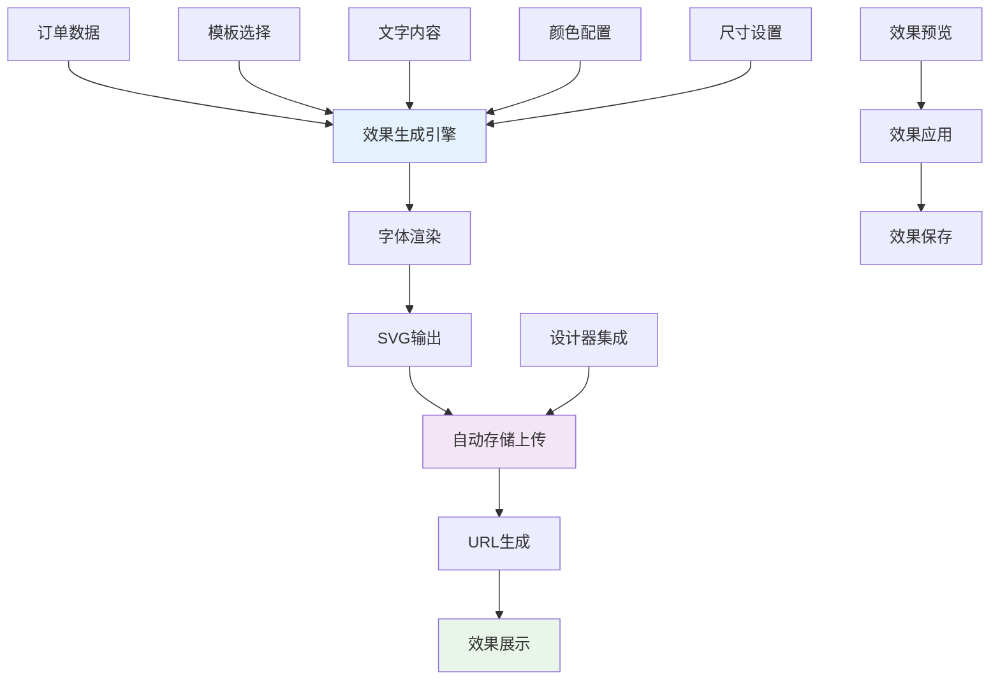

**图表来源**
- [backend/src/api/main.py:241-286](file://backend/src/api/main.py#L241-L286)

#### 效果生成流程

系统提供完整的效果图生成流程：

- **参数配置**：支持形状、颜色、尺寸、字体等多种自定义参数
- **实时预览**：生成过程中的实时预览功能
- **质量控制**：自动的质量检查和优化
- **版本管理**：支持多版本效果的管理和比较

#### 邮件模板系统

集成强大的邮件模板管理功能：

- **模板分类**：按业务场景分类管理邮件模板
- **变量替换**：支持动态变量的自动替换
- **预览功能**：生成邮件预览效果
- **批量发送**：支持批量邮件的自动化发送
- **AI辅助生成**：支持AI生成邮件内容

#### 自动存储集成

**新增功能**：效果管理组件与自动存储系统深度集成：

- **SVG文件上传**：生成的SVG效果图自动上传到Supabase Storage
- **URL同步更新**：上传完成后自动更新数据库中的URL字段
- **生产文档同步**：同时更新production_documents表的相关字段
- **版本控制**：支持多版本效果图的存储和管理

**章节来源**
- [frontend/src/views/Admin/AdminEffects.vue:1-200](file://frontend/src/views/Admin/AdminEffects.vue#L1-L200)
- [backend/src/api/main.py:149-181](file://backend/src/api/main.py#L149-L181)
- [backend/src/services/effect_image_service.py:77-129](file://backend/src/services/effect_image_service.py#L77-L129)

### 工厂管理组件

工厂管理组件提供工厂资源的统一管理和调度。

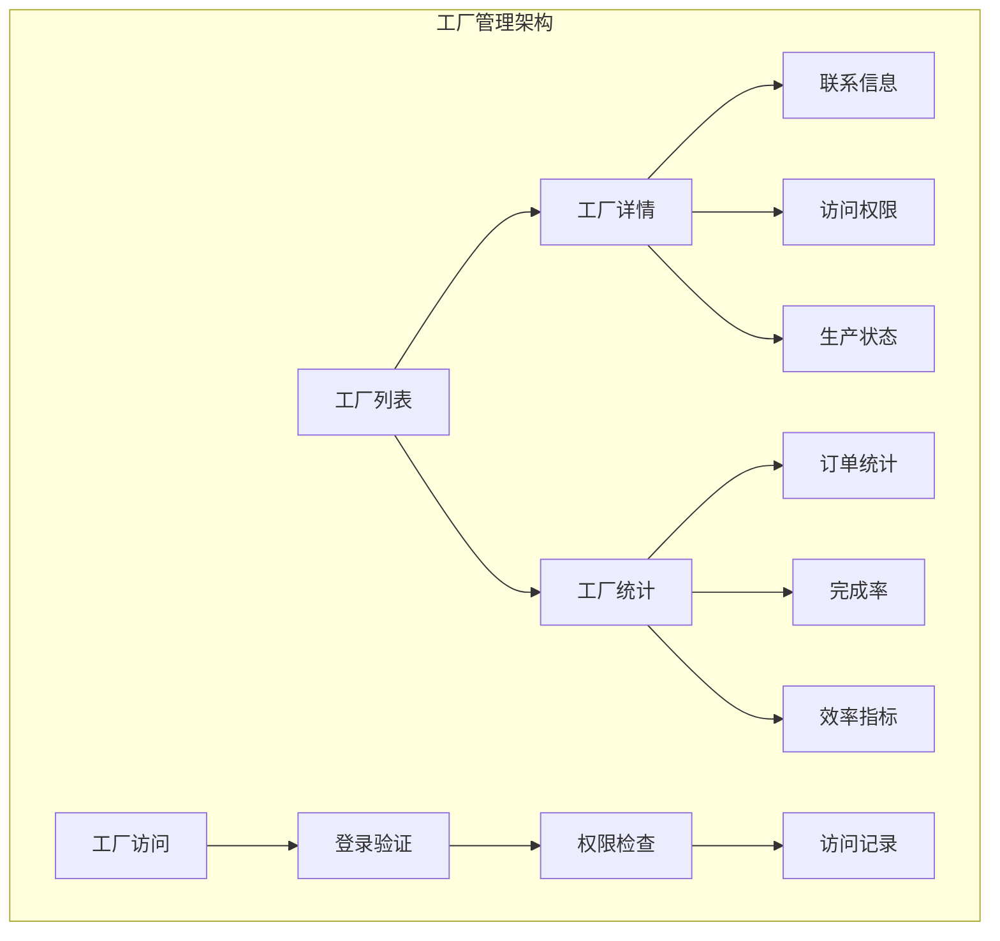

**图表来源**
- [backend/scripts/create_factories_table.sql:8-20](file://backend/scripts/create_factories_table.sql#L8-L20)

#### 工厂权限控制

实施严格的工厂访问权限控制：

- **身份验证**：基于密码和令牌的身份验证机制
- **访问控制**：基于角色的权限访问控制
- **操作审计**：完整的访问和操作记录
- **安全策略**：启用行级安全策略保护数据

#### 生产调度管理

提供高效的生产调度和管理功能：

- **订单分配**：智能的订单分配算法
- **进度跟踪**：实时的生产进度跟踪
- **质量监控**：生产质量的全程监控
- **效率分析**：生产效率的统计分析

**章节来源**
- [backend/scripts/create_factories_table.sql:1-54](file://backend/scripts/create_factories_table.sql#L1-L54)

## 管理员布局系统

管理员布局系统是系统的重要组成部分，为管理员提供了统一的界面布局和实时的操作员上下文显示功能。

### 布局架构

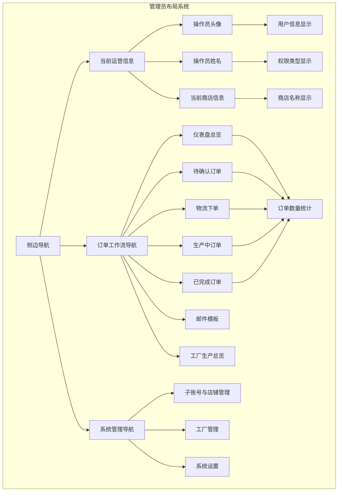

**图表来源**
- [frontend/src/layouts/AdminLayout.vue:25-42](file://frontend/src/layouts/AdminLayout.vue#L25-L42)
- [frontend/src/layouts/AdminLayout.vue:44-152](file://frontend/src/layouts/AdminLayout.vue#L44-L152)
- [frontend/src/layouts/AdminLayout.vue:154-199](file://frontend/src/layouts/AdminLayout.vue#L154-L199)

### 实时操作员上下文显示

管理员布局系统提供了实时的操作员和商店信息显示功能：

- **操作员信息展示**：显示当前登录操作员的头像、姓名和权限类型
- **商店信息展示**：显示当前操作员所属的商店名称和代码
- **权限类型标识**：通过不同的视觉元素区分主账号和子账号
- **实时状态更新**：当操作员切换商店或权限发生变化时自动更新显示

#### 操作员信息区域

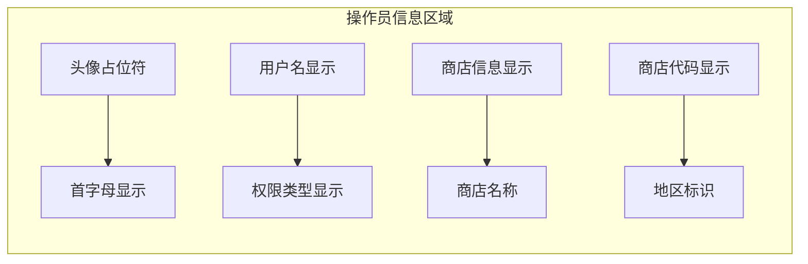

**图表来源**
- [frontend/src/layouts/AdminLayout.vue:25-42](file://frontend/src/layouts/AdminLayout.vue#L25-L42)

#### 订单工作流导航

管理员布局系统包含7项核心工作流导航，所有账号都可访问：

- **仪表盘总览**：系统概览和关键指标展示
- **待确认订单**：包含无效果图和待发送邮件的订单
- **物流下单**：处理订单的物流下单功能
- **生产中订单**：跟踪正在生产的订单
- **已完成订单**：查看已完成的订单
- **邮件模板**：管理邮件模板
- **工厂生产总览**：查看工厂生产情况

#### 系统管理导航

系统管理功能仅对主账号可见，包含：

- **子账号与店铺管理**：管理子账号和分配的店铺权限
- **工厂管理**：管理工厂资源和生产设施
- **系统设置**：系统级别的配置和设置

### 订单数量统计集成

管理员布局系统集成了实时的订单数量统计功能，现已更新为支持中文状态值：

- **新订单统计**：显示新订单和客户修改的订单数量
- **待回复统计**：显示等待客户确认的订单数量
- **待创建统计**：显示客户已确认但未创建物流单的订单数量
- **生产中统计**：显示正在生产的订单数量
- **自动更新机制**：页面加载时自动获取最新的统计数据

**更新** 订单统计功能已更新为使用中文状态值，确保统计准确性：

```javascript
// 更新后的中文状态值统计逻辑
orderCounts.value.new = data.filter(o => ['新订单', '客户修改'].includes(o.status)).length
orderCounts.value.waiting = data.filter(o => o.status === '待回复').length
orderCounts.value.pending = data.filter(o => o.status === '待创建').length
orderCounts.value.producing = data.filter(o => o.status === '生产中').length
orderCounts.value.completed = data.filter(o => o.status === '已送达').length
```

**章节来源**
- [frontend/src/layouts/AdminLayout.vue:1-286](file://frontend/src/layouts/AdminLayout.vue#L1-L286)
- [frontend/src/stores/adminStore.js:1-377](file://frontend/src/stores/adminStore.js#L1-L377)

## 权限管理

系统采用基于角色的权限控制系统，支持主账号和子账号的差异化权限管理。

### 角色类型定义

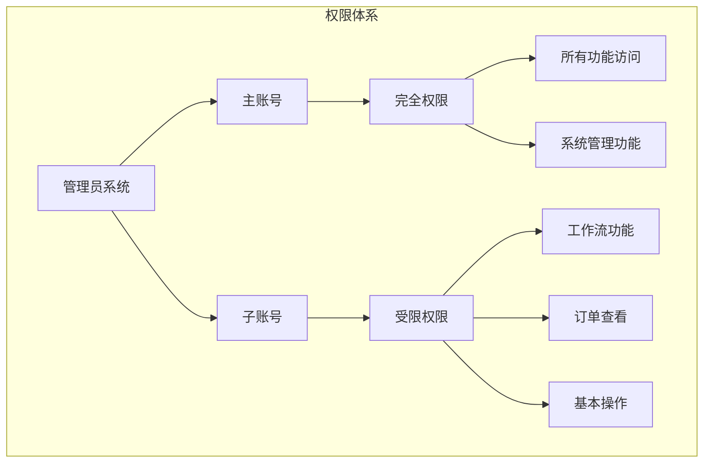

**图表来源**
- [frontend/src/stores/adminStore.js:25-70](file://frontend/src/stores/adminStore.js#L25-L70)
- [frontend/src/router/index.js:211-219](file://frontend/src/router/index.js#L211-L219)

#### 主账号权限

主账号拥有系统的完全访问权限：

- **所有功能访问**：可以访问系统的所有功能模块
- **系统管理功能**：包括子账号管理、工厂管理、系统设置等
- **数据管理权限**：可以管理所有店铺和订单数据
- **配置修改权限**：可以修改系统配置和参数

#### 子账号权限

子账号拥有受限的权限访问：

- **工作流功能**：可以访问订单管理的工作流功能
- **订单查看权限**：只能查看分配给其权限的订单
- **基本操作权限**：可以执行基本的订单操作
- **受限管理权限**：无法访问系统管理功能

### 权限验证机制

系统通过路由守卫实现权限验证：

- **登录状态检查**：每次页面跳转时检查管理员登录状态
- **权限级别验证**：对于需要主账号权限的页面进行额外验证
- **自动重定向**：权限不足时自动重定向到适当的页面
- **会话管理**：支持24小时的会话有效期管理

**章节来源**
- [frontend/src/stores/adminStore.js:17-78](file://frontend/src/stores/adminStore.js#L17-L78)
- [frontend/src/router/index.js:200-223](file://frontend/src/router/index.js#L200-L223)

## 依赖关系分析

系统采用模块化设计，各组件之间的依赖关系清晰明确。

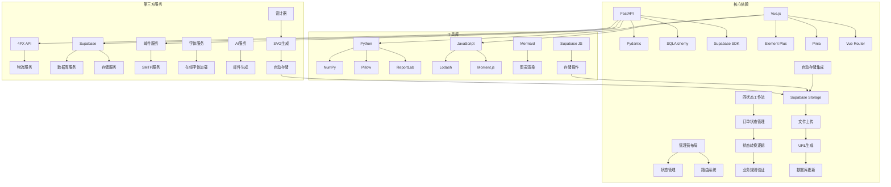

**图表来源**
- [backend/src/api/main.py:7-26](file://backend/src/api/main.py#L7-L26)
- [frontend/src/stores/adminStore.js:1-377](file://frontend/src/stores/adminStore.js#L1-L377)
- [frontend/src/layouts/AdminLayout.vue:230-238](file://frontend/src/layouts/AdminLayout.vue#L230-L238)

### 数据库依赖

系统使用PostgreSQL作为主要数据库，配合Supabase提供完整的数据库服务。

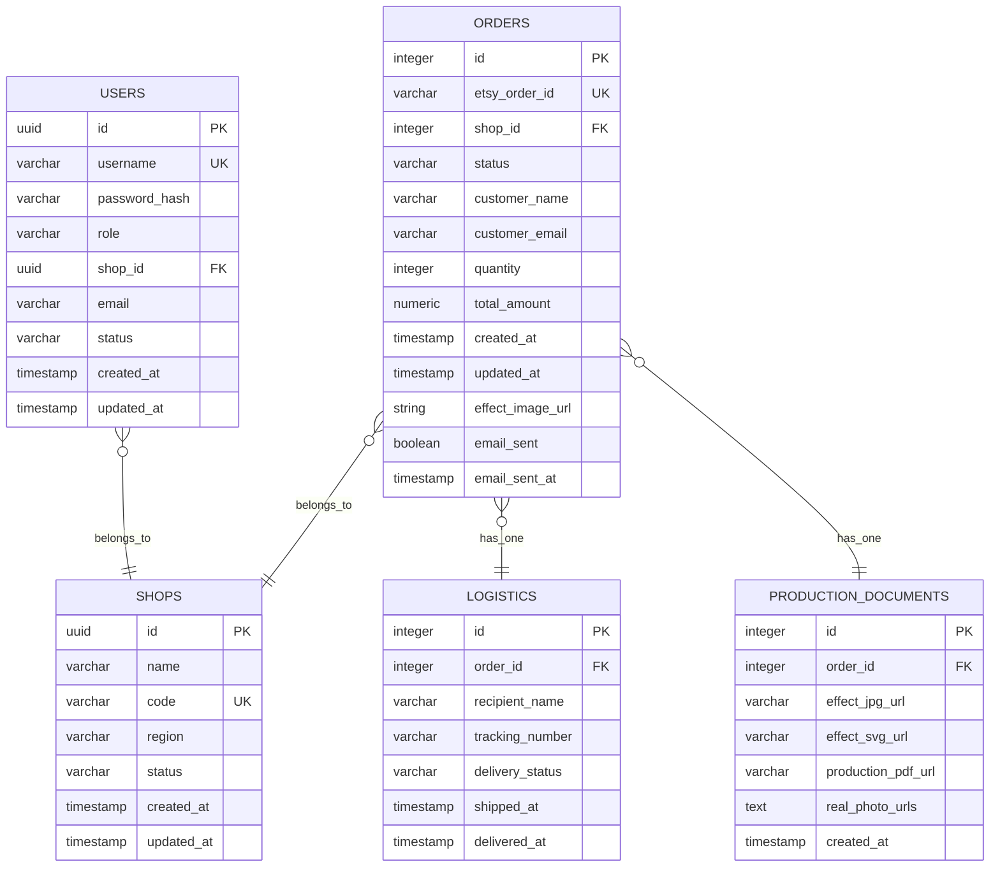

**图表来源**
- [backend/src/models/order.py:43-102](file://backend/src/models/order.py#L43-L102)
- [backend/scripts/init_multitenant.sql:6-54](file://backend/scripts/init_multitenant.sql#L6-L54)

### 外部服务集成

系统集成了多个外部服务以提供完整的功能：

- **4PX物流服务**：提供国际物流运输能力
- **Supabase存储服务**：提供对象存储和数据库服务
- **邮件服务**：提供邮件发送和模板管理功能
- **字体服务**：提供自定义字体的在线加载
- **AI服务**：提供邮件内容的AI生成能力
- **设计器服务**：提供SVG效果图的生成和编辑功能

**章节来源**
- [backend/src/services/database_service.py:1-117](file://backend/src/services/database_service.py#L1-L117)
- [backend/src/config/settings.py:1-65](file://backend/src/config/settings.py#L1-L65)

## 性能考虑

系统在设计时充分考虑了性能优化，采用多种技术和策略提升整体性能。

### 缓存策略

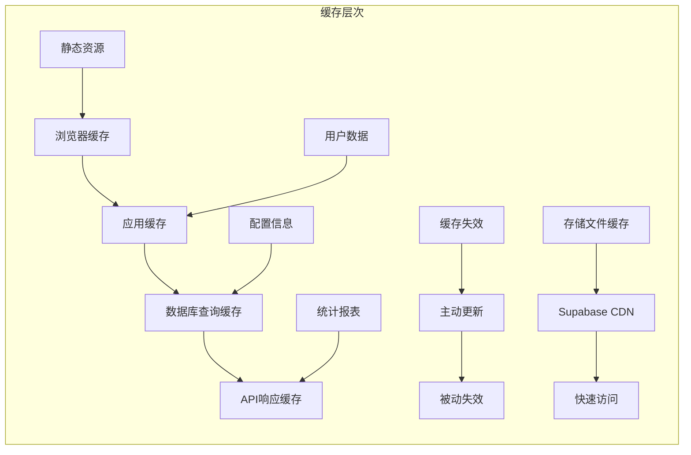

#### 数据库性能优化

- **索引优化**：为常用查询字段建立合适的索引
- **查询优化**：使用JOIN查询减少数据库往返次数
- **连接池**：使用连接池管理数据库连接
- **批量操作**：支持批量数据的高效处理

#### 前端性能优化

- **组件懒加载**：按需加载大型组件和模块
- **资源压缩**：自动压缩CSS、JavaScript和图片资源
- **CDN加速**：静态资源通过CDN进行分发
- **内存管理**：及时清理不再使用的组件和数据

### 并发处理

系统采用异步处理机制应对高并发场景：

- **异步任务队列**：使用Celery处理耗时任务
- **消息中间件**：使用Redis作为消息队列
- **负载均衡**：支持多实例部署和负载均衡
- **限流控制**：防止系统被突发流量压垮

### 自动存储性能优化

**新增优化**：自动存储集成的性能优化：

- **文件上传优化**：使用Supabase的CDN加速存储文件访问
- **URL缓存**：缓存已生成的存储URL，避免重复获取
- **批量上传**：支持多个文件的批量上传和处理
- **错误重试**：自动重试失败的存储操作
- **存储桶管理**：合理组织存储桶结构，优化文件访问性能

## 故障排除指南

### 常见问题诊断

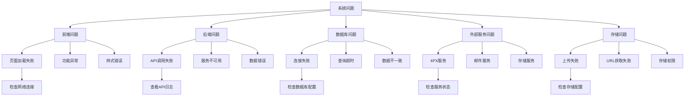

#### 日志分析

系统提供了完善的日志记录机制：

- **后端日志**：详细的API调用和错误日志
- **前端日志**：用户操作和界面错误日志
- **数据库日志**：SQL查询和性能日志
- **系统日志**：服务器运行状态和资源使用情况
- **存储日志**：文件上传和访问日志

#### 性能监控

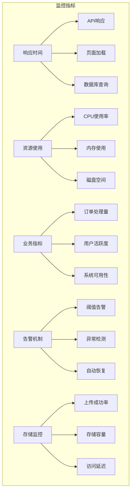

**章节来源**
- [backend/src/api/main.py:183-193](file://backend/src/api/main.py#L183-L193)
- [backend/scripts/check_order_flow.py:1-149](file://backend/scripts/check_order_flow.py#L1-L149)

## 结论

Etsy订单自动化系统是一个功能完整、架构清晰的电商管理解决方案。通过采用现代化的技术栈和设计理念，系统实现了从订单管理到物流配送的全流程自动化。

### 主要优势

- **完整的四状态工作流**：涵盖电商运营的所有关键环节，支持新订单、客户修改、待回复、待创建四种状态
- **两步确认系统**：确保效果图质量和邮件发送的准确性
- **良好的扩展性**：模块化设计支持功能的灵活扩展
- **优秀的用户体验**：直观的界面设计和流畅的操作体验
- **可靠的系统稳定性**：完善的错误处理和监控机制
- **强大的权限控制**：基于角色的权限管理确保数据安全
- **实时上下文显示**：管理员布局提供实时的操作员和商店信息
- **中文状态管理**：支持中文订单状态的完整生命周期管理
- **自动存储集成**：在发送邮件前自动保存最新的设计器生成效果图像
- **数据刷新机制**：增强的订单数据自动刷新，确保effect_image_url的时效性

### 技术亮点

- **多租户架构**：支持多店铺、多运营团队的独立管理
- **实时数据同步**：通过WebSocket实现实时状态更新
- **智能工作流**：基于业务规则的自动化流程控制
- **开放API设计**：提供完整的RESTful API接口
- **管理员布局系统**：提供统一的界面布局和实时上下文显示
- **权限分级管理**：支持主账号和子账号的差异化权限控制
- **中文状态值支持**：数据库和前端均支持中文状态值的完整管理
- **AI辅助功能**：支持AI生成邮件内容，提升工作效率
- **自动存储优化**：Supabase存储的自动集成和性能优化
- **实时数据刷新**：确保前端显示的订单数据始终是最新的

### 发展建议

随着业务的发展，建议重点关注以下方面：

- **AI集成**：引入机器学习算法优化订单处理和预测
- **移动端支持**：开发移动应用提升移动端用户体验
- **国际化扩展**：支持多语言和多货币的国际化需求
- **数据分析**：增强商业智能和数据分析功能
- **用户体验优化**：持续改进管理员布局的交互体验
- **状态管理完善**：继续完善中文状态值的管理和显示
- **工作流优化**：根据实际使用情况优化四状态工作流的效率
- **存储性能优化**：持续优化自动存储系统的性能和可靠性
- **数据一致性保障**：加强订单数据和存储数据的一致性检查机制

该系统为Etsy卖家提供了一个强大而灵活的管理工具，能够显著提升运营效率和客户满意度。管理员布局系统的引入进一步增强了系统的易用性和实用性，为管理员提供了更好的操作体验和上下文感知能力。四状态工作流管理的实现使得订单处理更加规范和高效，两步确认系统的引入确保了业务流程的准确性和可靠性。中文状态值的支持使得系统更加符合中文用户的使用习惯，提升了系统的本地化程度和用户体验。自动存储集成功能的加入确保了客户总是收到最新、最准确的视觉预览，大大提升了客户满意度和转化率。数据刷新机制的增强进一步保证了系统数据的实时性和准确性，为业务决策提供了可靠的数据支持。