# 订单处理工作流增强

<cite>
**本文档引用的文件**
- [README.md](file://README.md)
- [pyproject.toml](file://backend/pyproject.toml)
- [settings.py](file://backend/src/config/settings.py)
- [order.py](file://backend/src/models/order.py)
- [order_service.py](file://backend/src/services/order_service.py)
- [database_service.py](file://backend/src/services/database_service.py)
- [email_service.py](file://backend/src/services/email_service.py)
- [effect_image_service.py](file://backend/src/services/effect_image_service.py)
- [pdf_service.py](file://backend/src/services/pdf_service.py)
- [main.py](file://backend/src/api/main.py)
- [orderStore.js](file://frontend/src/stores/orderStore.js)
- [EffectDesigner.vue](file://frontend/src/components/EffectDesigner.vue)
- [OrdersPending.vue](file://frontend/src/views/Admin/OrdersPending.vue)
- [email-templates.json](file://frontend/src/config/email-templates.json)
- [ai_service.py](file://backend/src/services/ai_service.py)
- [check_order_flow.py](file://backend/scripts/check_order_flow.py)
- [开发文档-订单与生产文档-v0.1.md](file://docs/开发文档-订单与生产文档-v0.1.md)
- [开发文档-页面状态按钮-v1.0.md](file://docs/开发文档-页面状态按钮-v1.0.md)
- [API对接文档.md](file://backend/src/直发API对接文档.md)
- [update_status_to_chinese.py](file://backend/scripts/update_status_to_chinese.py)
- [fix_status_constraint.py](file://backend/scripts/fix_status_constraint.py)
- [check_status_values.py](file://backend/scripts/check_status_values.py)
</cite>

## 更新摘要
**变更内容**
- 更新了订单状态系统从英文迁移到中文的实现细节
- 新增了前端OrdersPending.vue五标签页布局设计的详细说明
- 完善了状态映射系统更新为中文状态值的技术实现
- 增强了订单处理工作流的中文状态管理能力
- 新增了状态约束和数据迁移的完整流程说明

## 目录
1. [项目概述](#项目概述)
2. [系统架构](#系统架构)
3. [核心组件分析](#核心组件分析)
4. [订单处理流程](#订单处理流程)
5. [数据模型设计](#数据模型设计)
6. [前端集成方案](#前端集成方案)
7. [性能优化策略](#性能优化策略)
8. [故障排除指南](#故障排除指南)
9. [总结](#总结)

## 项目概述

ETSY订单自动化系统是一个完整的订单处理工作流增强项目，旨在实现从邮件解析到生产文档生成的全流程自动化。该系统基于Python后端和Vue3前端技术栈，集成了邮件处理、订单管理、效果图生成、物流集成和PDF文档生成功能。

### 主要功能特性

- **智能邮件解析**：自动读取和解析Etsy订单邮件，提取关键订单信息
- **订单生命周期管理**：完整的订单状态流转和进度跟踪，现已支持中文状态管理
- **可视化设计工具**：内置SVG设计器，支持定制化产品效果预览
- **多渠道物流集成**：支持4PX递四方物流API，实现一键物流下单
- **自动化文档生成**：生成符合生产要求的PDF文档
- **实时数据同步**：前后端数据实时同步和状态更新
- **多店铺支持**：支持多店铺运营和订单管理
- **智能邮件模板**：提供多种邮件模板和翻译功能
- **AI邮件生成**：集成AI服务，支持智能邮件内容生成
- **中文状态管理**：完整的中文订单状态体系，支持中英混合约束

## 系统架构

系统采用分层架构设计，包含前端界面层、API服务层、业务逻辑层和数据持久化层。

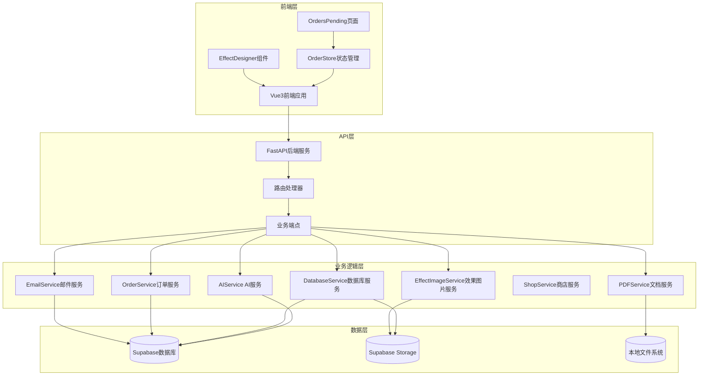

**图表来源**
- [main.py:1-800](file://backend/src/api/main.py#L1-L800)
- [orderStore.js:1-800](file://frontend/src/stores/orderStore.js#L1-L800)
- [OrdersPending.vue:1-2059](file://frontend/src/views/Admin/OrdersPending.vue#L1-L2059)

## 核心组件分析

### 数据模型层

系统采用SQLAlchemy ORM设计，定义了完整的订单生态系统数据模型。

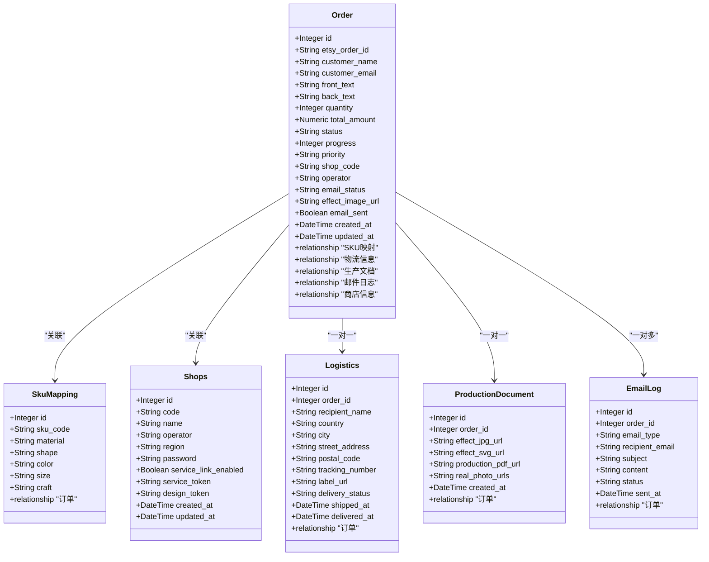

**图表来源**
- [order.py:23-244](file://backend/src/models/order.py#L23-L244)

### 服务层架构

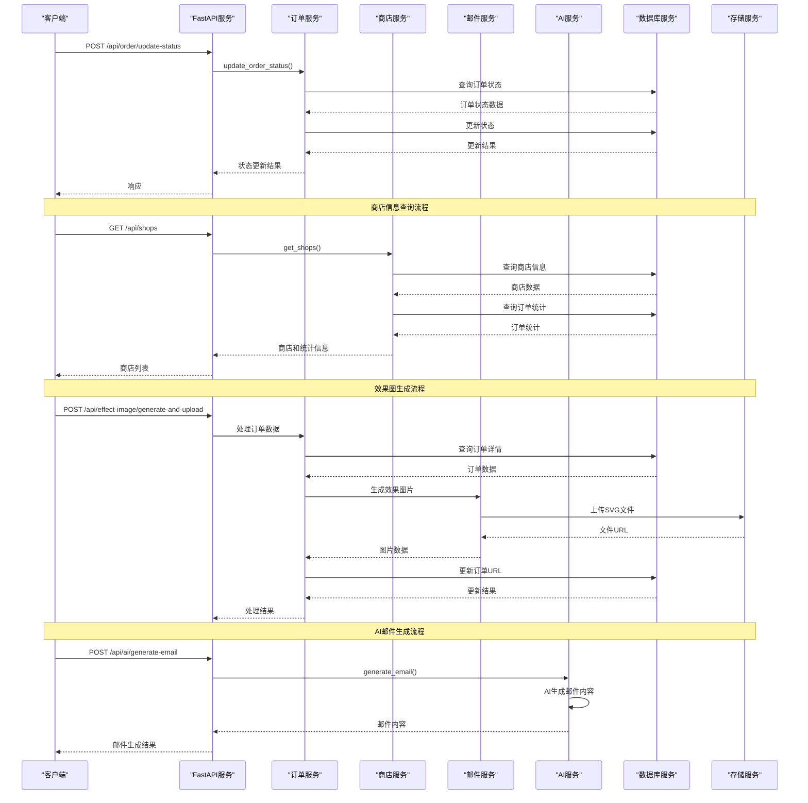

**图表来源**
- [main.py:304-320](file://backend/src/api/main.py#L304-L320)
- [order_service.py:91-145](file://backend/src/services/order_service.py#L91-L145)
- [orderStore.js:44-147](file://frontend/src/stores/orderStore.js#L44-L147)
- [ai_service.py:70-116](file://backend/src/services/ai_service.py#L70-L116)

**章节来源**
- [order.py:1-356](file://backend/src/models/order.py#L1-L356)
- [order_service.py:1-145](file://backend/src/services/order_service.py#L1-L145)
- [database_service.py:1-117](file://backend/src/services/database_service.py#L1-L117)

## 订单处理流程

系统实现了完整的订单生命周期管理，从邮件接收到底稿确认的全流程自动化。

### 订单状态流转


### 状态转换脚本实现

**更新** 系统已实现完整的中文状态转换流程，支持中英混合约束。

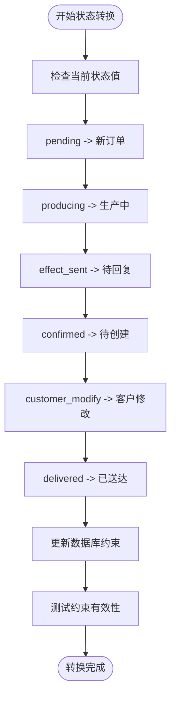

**图表来源**
- [update_status_to_chinese.py:1-36](file://backend/scripts/update_status_to_chinese.py#L1-L36)
- [fix_status_constraint.py:1-54](file://backend/scripts/fix_status_constraint.py#L1-L54)

### 邮件解析流程

```mermaid
flowchart TD
Start([接收邮件]) --> ParseSubject["解析邮件主题"]
ParseSubject --> CheckSender{"检查发件人"}
CheckSender --> |transaction@etsy.com| CheckContent["检查邮件内容"]
CheckSender --> |转发邮件| CheckForward["检查转发标记"]
CheckContent --> ExtractOrder["提取订单信息"]
CheckForward --> ExtractOrder
ExtractOrder --> ValidateData["验证数据完整性"]
ValidateData --> DataValid{"数据有效?"}
DataValid --> |是| CreateOrder["创建订单记录"]
DataValid --> |否| SkipOrder["跳过订单"]
CreateOrder --> UpdateStatus["更新订单状态"]
UpdateStatus --> End([完成])
SkipOrder --> End
```

**图表来源**
- [email_service.py:87-185](file://backend/src/services/email_service.py#L87-L185)

**章节来源**
- [email_service.py:1-200](file://backend/src/services/email_service.py#L1-L200)
- [order_service.py:91-145](file://backend/src/services/order_service.py#L91-L145)
- [update_status_to_chinese.py:1-36](file://backend/scripts/update_status_to_chinese.py#L1-L36)

## 数据模型设计

系统采用关系型数据库设计，确保数据的一致性和完整性。

### 数据库表结构

| 表名 | 描述 | 主要字段 |
|------|------|----------|
| orders | 订单主表 | id, etsy_order_id, status, customer_name, shop_id, created_at |
| shops | 商店信息表 | id, code, name, operator, region, service_token |
| logistics | 物流信息表 | order_id, tracking_number, delivery_status, shipped_at |
| production_documents | 生产文档表 | order_id, effect_svg_url, production_pdf_url, created_at |
| email_logs | 邮件日志表 | order_id, email_type, status, sent_at |
| sku_mapping | SKU对照表 | sku_code, shape, color, size, craft |

### 约束和索引

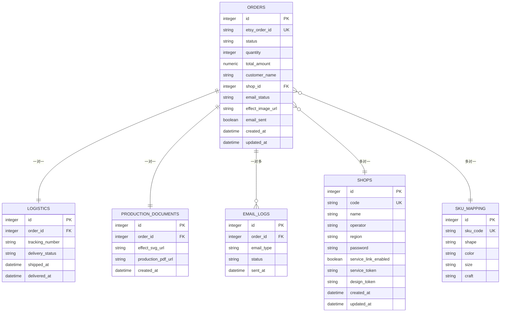

**图表来源**
- [order.py:43-244](file://backend/src/models/order.py#L43-L244)

### 状态约束设计

**更新** 数据库状态约束现已支持中英混合模式，确保数据完整性。

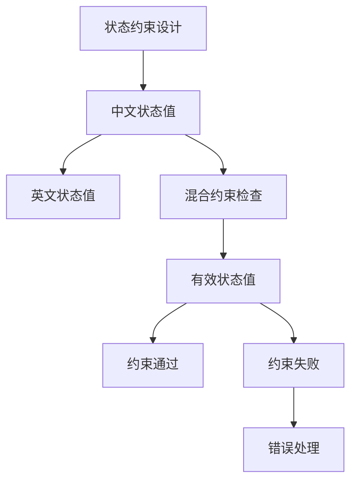

**图表来源**
- [fix_status_constraint.py:16-54](file://backend/scripts/fix_status_constraint.py#L16-L54)

**章节来源**
- [order.py:1-356](file://backend/src/models/order.py#L1-L356)
- [fix_status_constraint.py:1-54](file://backend/scripts/fix_status_constraint.py#L1-L54)

## 前端集成方案

前端采用Vue3 + Pinia的状态管理模式，提供了完整的订单管理界面。

### 状态管理架构

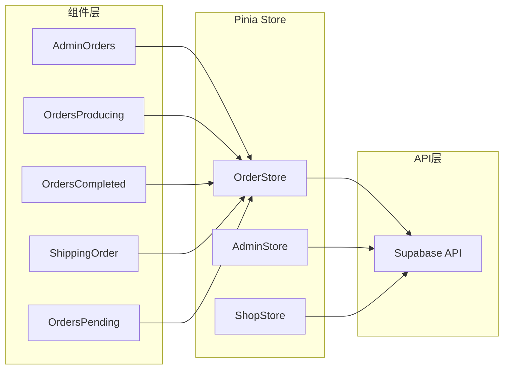

**图表来源**
- [orderStore.js:23-800](file://frontend/src/stores/orderStore.js#L23-L800)
- [OrdersPending.vue:576-2059](file://frontend/src/views/Admin/OrdersPending.vue#L576-L2059)

### 设计器组件

前端集成了专业的SVG设计器组件，支持实时预览和参数调整。

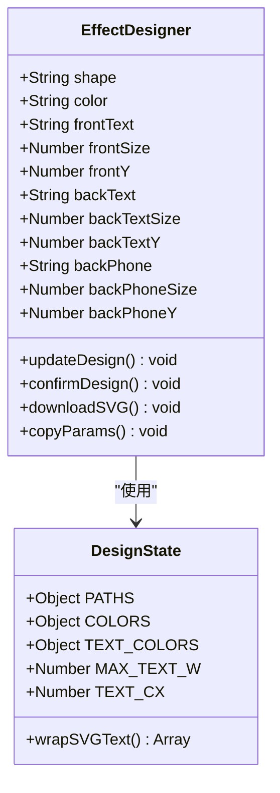

**图表来源**
- [EffectDesigner.vue:1-200](file://frontend/src/components/EffectDesigner.vue#L1-L200)

### OrdersPending页面重构

**更新** OrdersPending.vue经过重大重构，采用新的Tab式布局设计，引入了5个主要标签页和首封邮件功能。

#### 新的Tab式布局设计

页面采用三栏布局设计，左侧为订单列表，中间为设计器或邮件撰写区域，右侧为订单详情和操作面板。

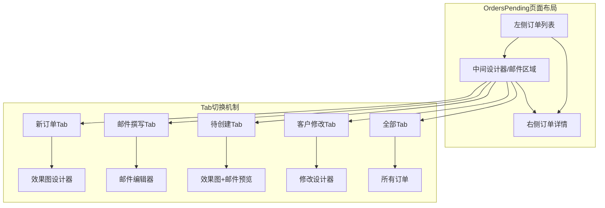

**图表来源**
- [OrdersPending.vue:104-201](file://frontend/src/views/Admin/OrdersPending.vue#L104-L201)

#### 五标签页布局实现

**新增** OrdersPending.vue实现了完整的五标签页布局，每个标签页都有特定的功能和用途。

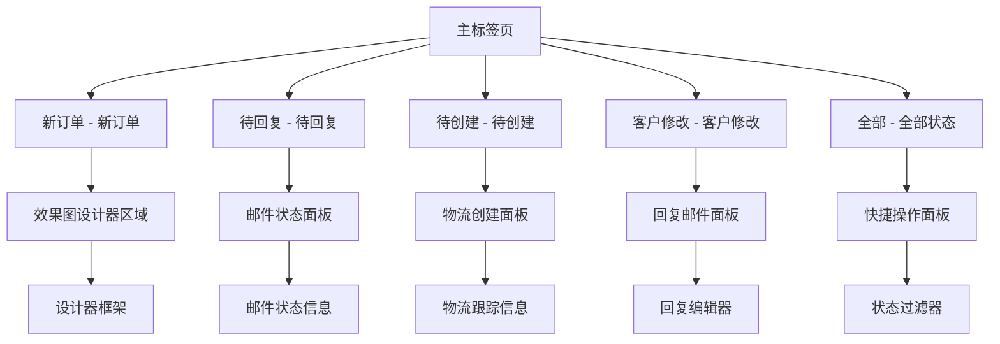

**图表来源**
- [OrdersPending.vue:30-38](file://frontend/src/views/Admin/OrdersPending.vue#L30-L38)
- [OrdersPending.vue:104-201](file://frontend/src/views/Admin/OrdersPending.vue#L104-L201)

#### 首封邮件功能

**新增** OrdersPending.vue引入了专门的首封邮件区域，支持模板选择、落款设置和AI生成。

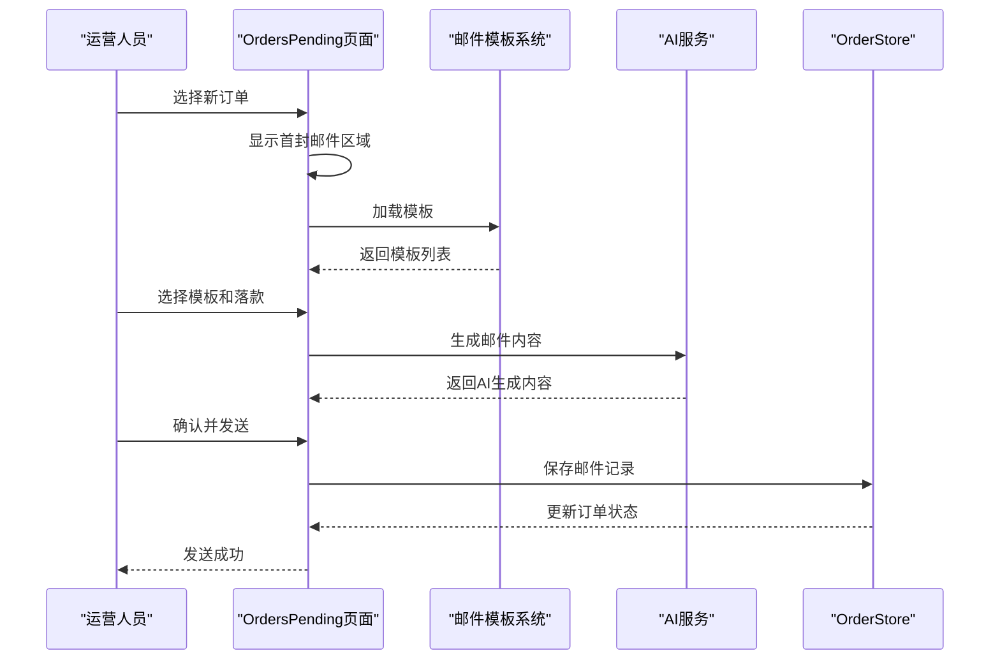

**图表来源**
- [OrdersPending.vue:764-945](file://frontend/src/views/Admin/OrdersPending.vue#L764-L945)
- [ai_service.py:70-116](file://backend/src/services/ai_service.py#L70-L116)

#### 商店信息支持

**新增** orderStore.js增强了商店信息支持，实现了更完善的数据关联查询。

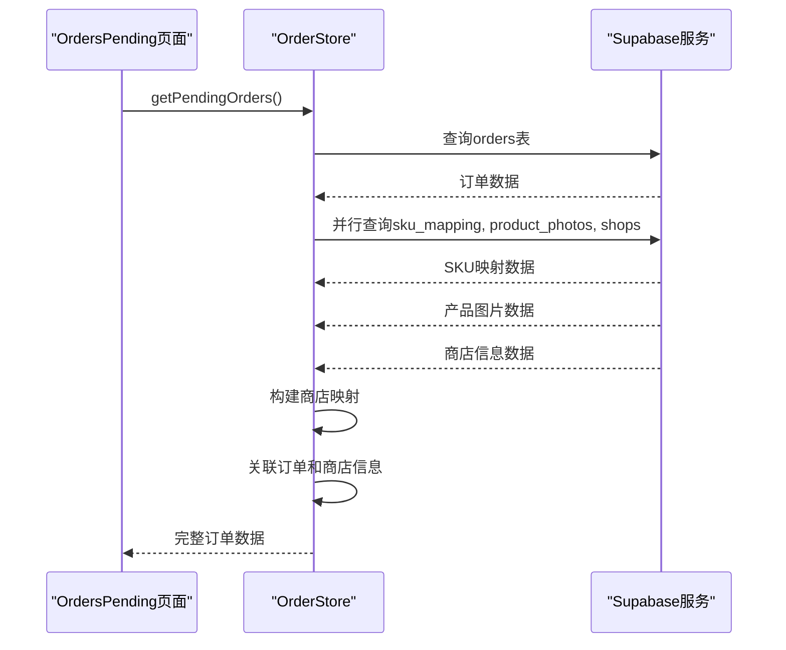

**图表来源**
- [orderStore.js:44-147](file://frontend/src/stores/orderStore.js#L44-L147)

#### 增强的邮件生成流程

**更新** OrdersPending.vue实现了更智能的邮件生成流程，支持多种场景和风格。

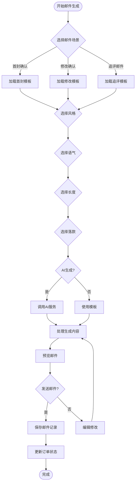

**图表来源**
- [OrdersPending.vue:1478-1599](file://frontend/src/views/Admin/OrdersPending.vue#L1478-L1599)
- [email-templates.json:1-374](file://frontend/src/config/email-templates.json#L1-L374)

#### 状态映射系统

**更新** 前端状态映射系统已更新为中文状态值，支持完整的中文订单状态管理。

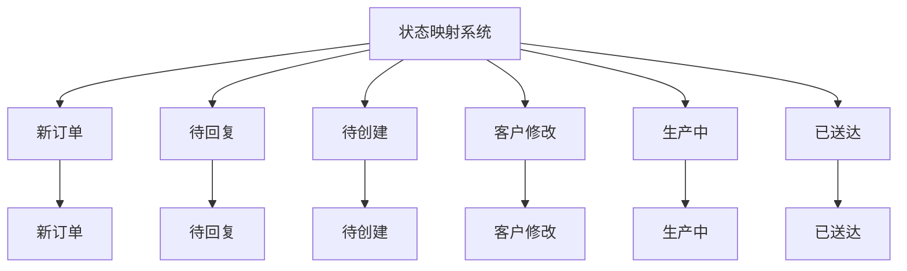

**图表来源**
- [orderStore.js:30-44](file://frontend/src/stores/orderStore.js#L30-L44)

**章节来源**
- [orderStore.js:1-800](file://frontend/src/stores/orderStore.js#L1-L800)
- [EffectDesigner.vue:1-200](file://frontend/src/components/EffectDesigner.vue#L1-L200)
- [OrdersPending.vue:1-2059](file://frontend/src/views/Admin/OrdersPending.vue#L1-L2059)

## 性能优化策略

系统采用了多项性能优化措施，确保在高并发场景下的稳定运行。

### 缓存策略

- **字体文件缓存**：效果图片服务对字体文件进行内存缓存，避免重复读取
- **数据库连接池**：使用SQLAlchemy连接池管理数据库连接
- **文件上传缓存**：Supabase Storage上传结果进行缓存
- **商店信息缓存**：orderStore.js对商店信息进行本地缓存
- **邮件模板缓存**：前端对邮件模板进行本地缓存
- **状态映射缓存**：前端对状态映射进行本地缓存

### 异步处理

- **PDF生成异步化**：生产文档生成采用异步处理，不阻塞主流程
- **邮件处理队列**：邮件解析采用队列机制，支持批量处理
- **图片上传异步化**：效果图片上传完成后异步更新数据库
- **并行查询优化**：使用Promise.all并行查询多个数据源
- **AI生成异步化**：AI邮件生成采用异步处理，避免阻塞UI
- **状态转换异步化**：数据库状态转换采用异步处理

### 数据库优化

- **索引优化**：为常用查询字段建立索引
- **查询优化**：使用JOIN查询减少数据库往返次数
- **事务管理**：合理使用数据库事务确保数据一致性
- **数据关联优化**：通过orderStore.js实现高效的数据关联
- **约束优化**：中英混合约束确保数据完整性

## 故障排除指南

### 常见问题诊断

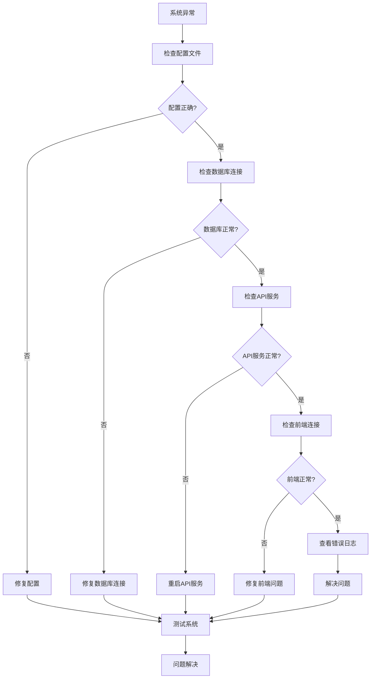

### 错误处理机制

系统实现了完善的错误处理机制：

- **邮件解析错误**：自动重试机制，支持手动重试
- **数据库连接错误**：连接池自动恢复，超时自动重连
- **文件上传错误**：支持断点续传和重试机制
- **API调用错误**：统一的异常处理和错误码映射
- **商店信息加载错误**：提供降级方案和错误提示
- **AI服务错误**：自动降级到模板生成
- **状态转换错误**：提供回滚机制和错误恢复
- **中文状态映射错误**：提供默认值和兼容处理

### 状态转换故障排除

**新增** 针对中文状态转换的故障排除流程。

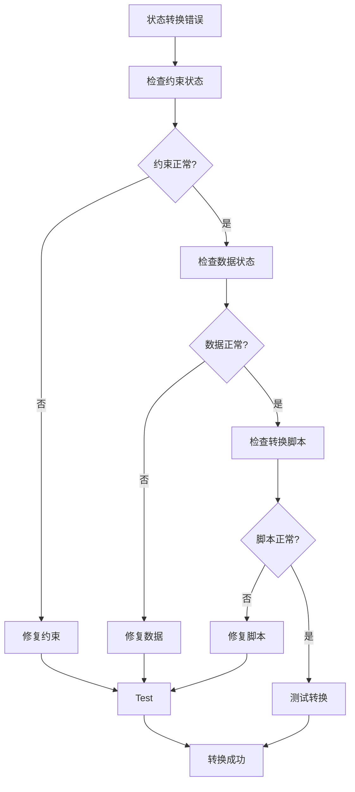

**章节来源**
- [check_order_flow.py:1-149](file://backend/scripts/check_order_flow.py#L1-L149)
- [fix_status_constraint.py:1-54](file://backend/scripts/fix_status_constraint.py#L1-L54)
- [check_status_values.py:1-36](file://backend/scripts/check_status_values.py#L1-L36)

## 总结

ETSY订单自动化系统通过模块化的架构设计和完善的错误处理机制，实现了从邮件解析到生产文档生成的全流程自动化。系统具有以下优势：

1. **完整的功能覆盖**：涵盖订单管理、邮件处理、设计工具、物流集成和文档生成
2. **良好的扩展性**：模块化设计支持功能扩展和定制化需求
3. **稳定的性能表现**：采用多种优化策略确保系统在高并发场景下的稳定性
4. **完善的监控机制**：提供全面的日志记录和错误处理能力
5. **现代化的用户界面**：OrdersPending.vue采用新的Tab式布局设计，提升用户体验
6. **多店铺支持**：orderStore.js增强了商店信息支持，实现更完善的数据管理
7. **智能邮件系统**：新增首封邮件功能和AI邮件生成功能，提升邮件处理效率
8. **增强的工作流**：改进的订单处理工作流，支持更复杂的业务场景
9. **中文状态管理**：完整的中文订单状态体系，支持中英混合约束
10. **状态转换安全**：提供完整的状态转换流程和错误恢复机制

该系统为电商订单处理提供了标准化的解决方案，能够显著提高运营效率并降低人工成本。通过持续的功能迭代和性能优化，系统将继续为企业提供可靠的技术支撑。

**更新** 最新的版本增强了订单处理的智能化程度，特别是在多店铺管理和邮件模板系统方面有了显著改进，为用户提供更加便捷和高效的订单处理体验。新增的AI邮件生成功能和首封邮件区域进一步提升了系统的自动化水平。中文状态管理系统的实现为国际化运营提供了更好的支持，而完整的状态转换流程确保了数据的一致性和完整性。