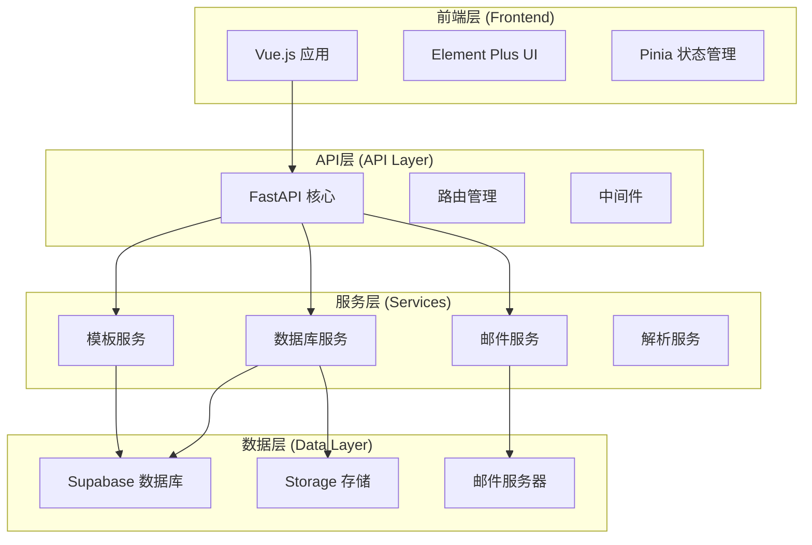
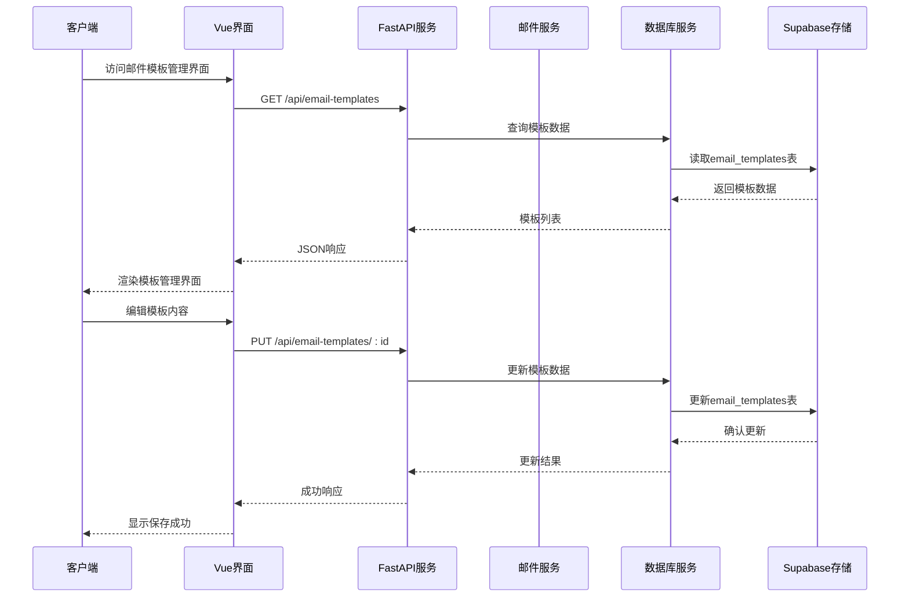
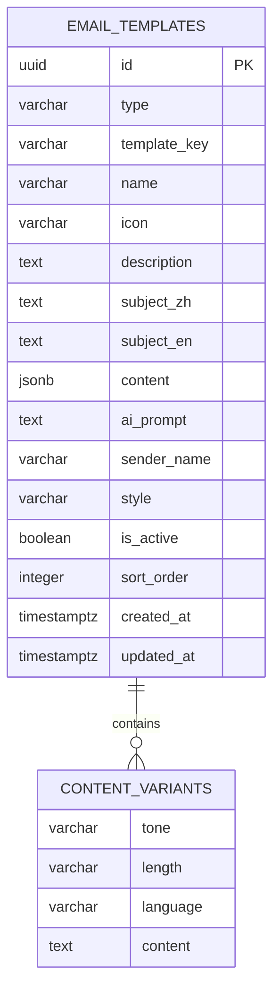
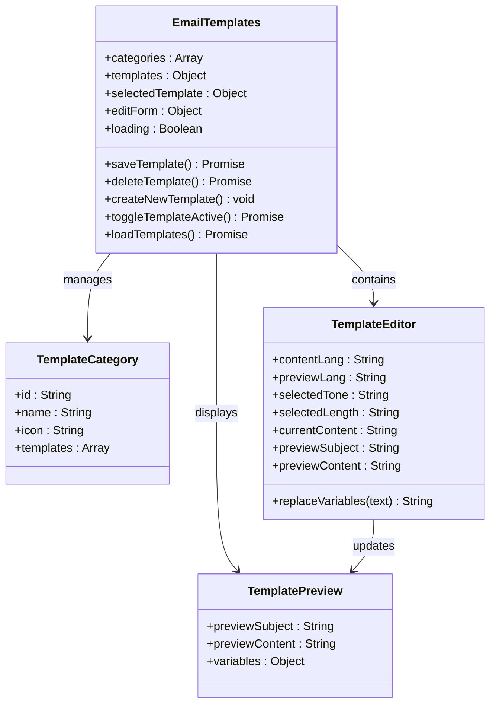
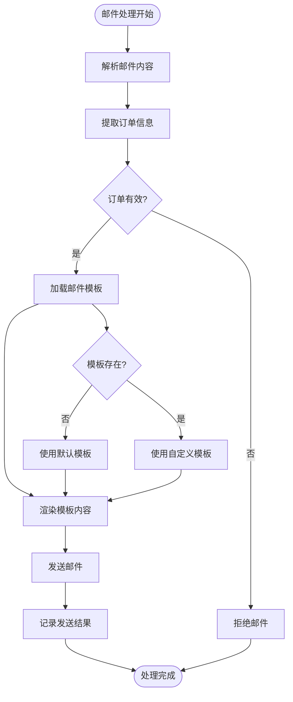
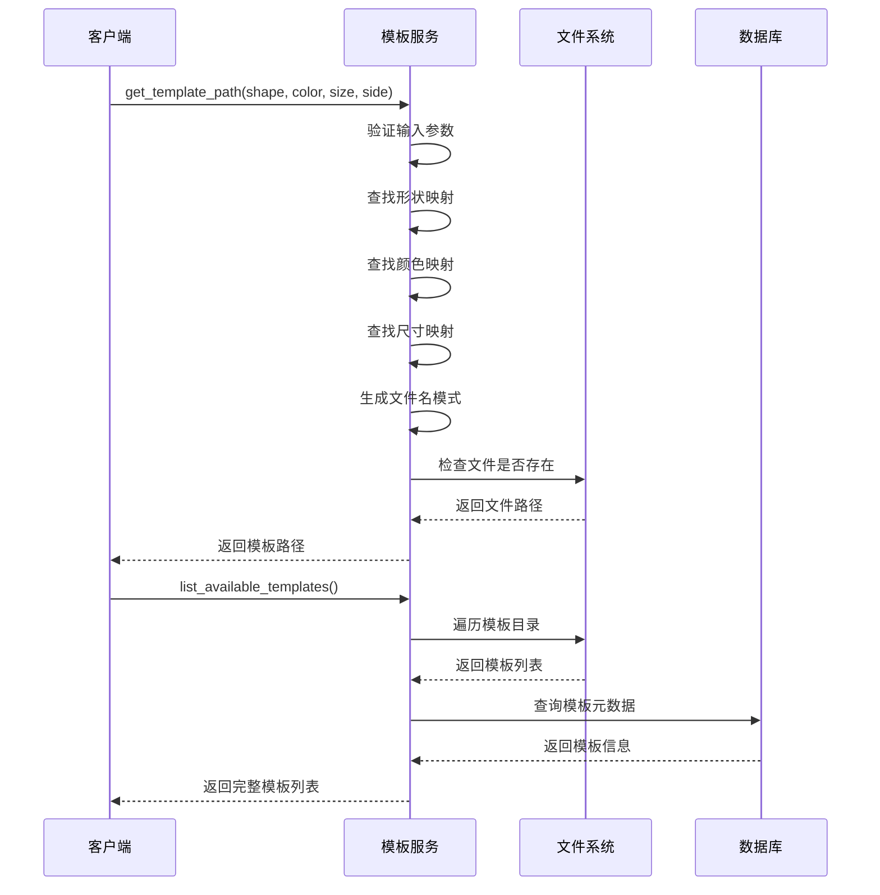
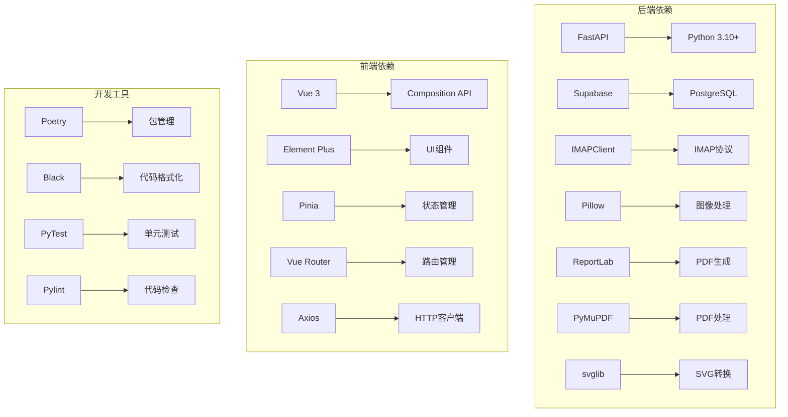

# 邮件模板管理系统

<cite>
**本文档引用的文件**
- [email_service.py](file://backend/src/services/email_service.py)
- [template_service.py](file://backend/src/services/template_service.py)
- [EmailTemplates.vue](file://frontend/src/views/Admin/EmailTemplates.vue)
- [main.py](file://backend/src/api/main.py)
- [email-templates.json](file://frontend/src/config/email-templates.json)
- [settings.py](file://backend/src/config/settings.py)
- [create_email_templates_table.sql](file://backend/scripts/create_email_templates_table.sql)
- [service_link_routes.py](file://backend/src/api/service_link_routes.py)
- [database_service.py](file://backend/src/services/database_service.py)
- [email_parser.py](file://backend/src/services/email_parser.py)
- [pyproject.toml](file://backend/pyproject.toml)
- [package.json](file://frontend/package.json)
</cite>

## 目录
1. [简介](#简介)
2. [项目结构](#项目结构)
3. [核心组件](#核心组件)
4. [架构概览](#架构概览)
5. [详细组件分析](#详细组件分析)
6. [依赖关系分析](#依赖关系分析)
7. [性能考虑](#性能考虑)
8. [故障排除指南](#故障排除指南)
9. [结论](#结论)

## 简介

邮件模板管理系统是一个完整的Etsy订单自动化解决方案的核心组成部分，专门用于管理和维护各种类型的邮件模板。该系统支持多种邮件类型（首封确认、修改确认、追评邮件），提供多语气（正式、随和、活泼）、多长度（简短、标准、详细）和多语言（中英）的模板变体，为电商运营提供了高度灵活和专业的邮件营销能力。

系统采用前后端分离架构，后端基于FastAPI提供RESTful API，前端使用Vue.js构建用户界面，支持实时预览和批量管理功能。

## 项目结构

该项目采用清晰的分层架构，主要分为三个层次：

**图表来源**
- [main.py:37-42](file://backend/src/api/main.py#L37-L42)
- [EmailTemplates.vue:465-467](file://frontend/src/views/Admin/EmailTemplates.vue#L465-L467)

**章节来源**
- [main.py:1-800](file://backend/src/api/main.py#L1-L800)
- [pyproject.toml:1-69](file://backend/pyproject.toml#L1-L69)
- [package.json:1-31](file://frontend/package.json#L1-L31)

## 核心组件

### 邮件模板管理界面

邮件模板管理界面是系统的核心用户交互组件，提供了完整的模板生命周期管理功能：

- **模板分类管理**：支持首封确认、修改确认、追评邮件三大类别
- **多变体支持**：每种模板支持正式、随和、活泼三种语气，以及简短、标准、详细三种长度
- **实时预览**：提供中英文双语预览功能，支持变量替换演示
- **批量操作**：支持模板的创建、编辑、删除和启用/禁用操作
- **排序管理**：支持模板的排序权重设置

### 邮件服务系统

邮件服务系统负责处理所有邮件相关的操作，包括：

- **邮件解析**：自动解析Etsy订单邮件，提取订单信息
- **邮件发送**：支持多种邮件格式的发送
- **IMAP集成**：与邮件服务器集成，支持邮件搜索和过滤
- **模板渲染**：将模板内容与订单数据动态组合

### 模板服务系统

模板服务系统提供模板的加载、管理和检索功能：

- **模板映射**：将产品属性映射到对应的SVG模板文件
- **模板检索**：根据形状、颜色、尺寸等属性查找模板
- **模板验证**：确保模板文件的存在性和有效性
- **模板列表**：提供所有可用模板的列表和统计信息

**章节来源**
- [EmailTemplates.vue:1-858](file://frontend/src/views/Admin/EmailTemplates.vue#L1-L858)
- [email_service.py:29-352](file://backend/src/services/email_service.py#L29-L352)
- [template_service.py:10-120](file://backend/src/services/template_service.py#L10-L120)

## 架构概览

系统采用现代化的微服务架构，各组件职责清晰，耦合度低：

**图表来源**
- [main.py:183-192](file://backend/src/api/main.py#L183-L192)
- [EmailTemplates.vue:670-694](file://frontend/src/views/Admin/EmailTemplates.vue#L670-L694)

系统架构的关键特点：

- **前后端分离**：Vue.js前端与FastAPI后端完全解耦
- **数据库抽象**：通过数据库服务层统一管理数据访问
- **存储集成**：与Supabase Storage无缝集成，支持文件上传和管理
- **配置管理**：集中化的环境配置管理

**章节来源**
- [main.py:1-800](file://backend/src/api/main.py#L1-L800)
- [database_service.py:10-117](file://backend/src/services/database_service.py#L10-L117)

## 详细组件分析

### 邮件模板数据模型

系统使用复杂的JSONB数据结构来存储模板内容，支持多维度的模板变体：

**图表来源**
- [create_email_templates_table.sql:16-34](file://backend/scripts/create_email_templates_table.sql#L16-L34)

模板内容结构支持：
- **语气变体**：formal/casual/lively
- **长度变体**：short/standard/detailed  
- **语言变体**：en/zh
- **动态变量**：{firstName}, {orderId}, {effectImageUrl}, {senderName}, {confirmationDeadline}

### 邮件模板管理界面组件

**图表来源**
- [EmailTemplates.vue:472-500](file://frontend/src/views/Admin/EmailTemplates.vue#L472-L500)
- [EmailTemplates.vue:514-536](file://frontend/src/views/Admin/EmailTemplates.vue#L514-L536)

### 邮件服务核心功能

邮件服务系统实现了完整的邮件处理流程：

**图表来源**
- [email_service.py:275-352](file://backend/src/services/email_service.py#L275-L352)
- [email_parser.py:61-294](file://backend/src/services/email_parser.py#L61-L294)

**章节来源**
- [email_service.py:1-352](file://backend/src/services/email_service.py#L1-L352)
- [email_parser.py:1-312](file://backend/src/services/email_parser.py#L1-L312)

### 模板服务工作流程

模板服务负责将产品属性映射到具体的SVG模板文件：

**图表来源**
- [template_service.py:52-96](file://backend/src/services/template_service.py#L52-L96)
- [template_service.py:104-117](file://backend/src/services/template_service.py#L104-L117)

**章节来源**
- [template_service.py:1-120](file://backend/src/services/template_service.py#L1-L120)

## 依赖关系分析

系统使用了丰富的第三方库来实现各种功能：

**图表来源**
- [pyproject.toml:8-36](file://backend/pyproject.toml#L8-L36)
- [package.json:11-29](file://frontend/package.json#L11-L29)

**章节来源**
- [pyproject.toml:1-69](file://backend/pyproject.toml#L1-L69)
- [package.json:1-31](file://frontend/package.json#L1-L31)

## 性能考虑

系统在设计时充分考虑了性能优化：

### 数据库优化
- **索引策略**：为常用查询字段建立适当的索引
- **查询优化**：使用LIMIT和WHERE条件限制查询范围
- **连接池**：复用数据库连接，减少连接开销

### 缓存机制
- **模板缓存**：模板文件内容缓存，避免重复读取
- **配置缓存**：环境配置缓存，减少磁盘访问
- **API响应缓存**：对静态数据使用缓存策略

### 异步处理
- **文件上传**：异步处理文件上传和存储
- **邮件发送**：异步发送邮件，避免阻塞主线程
- **批量操作**：支持批量模板操作的异步处理

## 故障排除指南

### 常见问题及解决方案

**1. 邮件模板无法加载**
- 检查模板文件是否存在
- 验证模板文件权限设置
- 确认模板路径配置正确

**2. 邮件发送失败**
- 验证SMTP服务器配置
- 检查邮箱认证信息
- 确认网络连接状态

**3. 数据库连接问题**
- 验证Supabase配置信息
- 检查网络防火墙设置
- 确认API密钥有效性

**4. 前端界面异常**
- 检查浏览器控制台错误
- 验证API端点可达性
- 确认CORS配置正确

### 调试工具

系统提供了完善的调试和监控功能：

- **日志系统**：详细的系统日志记录
- **错误处理**：统一的异常处理机制
- **健康检查**：API健康状态监控
- **性能监控**：关键操作的性能指标

**章节来源**
- [settings.py:37-62](file://backend/src/config/settings.py#L37-L62)
- [main.py:189-192](file://backend/src/api/main.py#L189-L192)

## 结论

邮件模板管理系统是一个功能完整、架构清晰的现代化应用系统。它成功地将复杂的邮件模板管理需求转化为易用的用户界面，同时保持了强大的技术能力和良好的扩展性。

系统的主要优势包括：

1. **高度可配置**：支持多维度的模板变体，满足不同场景需求
2. **用户体验优秀**：直观的界面设计和实时预览功能
3. **技术架构先进**：采用现代的前后端分离架构
4. **可扩展性强**：模块化设计便于功能扩展和维护
5. **可靠性高**：完善的错误处理和监控机制

该系统为电商运营提供了强有力的邮件营销支持，通过标准化的模板管理和自动化的工作流程，显著提高了运营效率和客户服务质量。