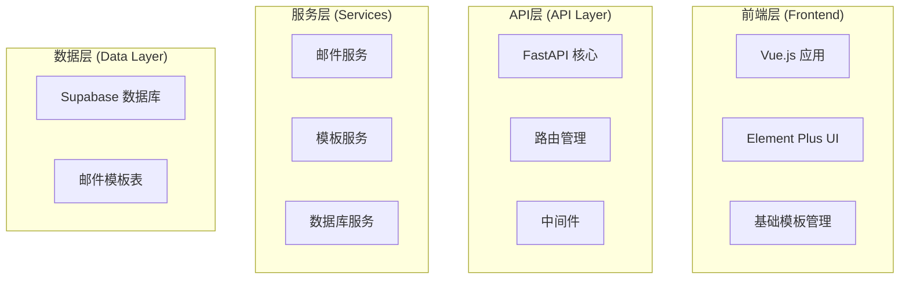
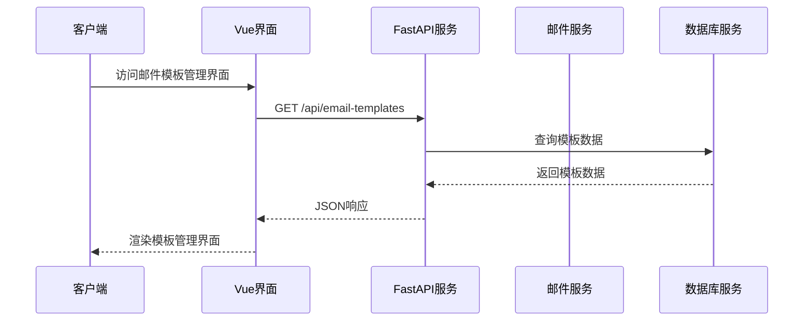
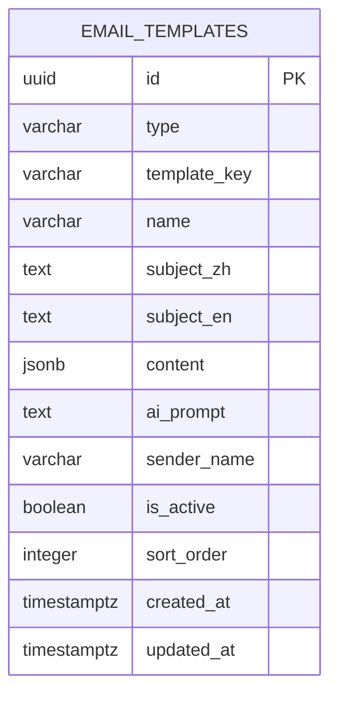
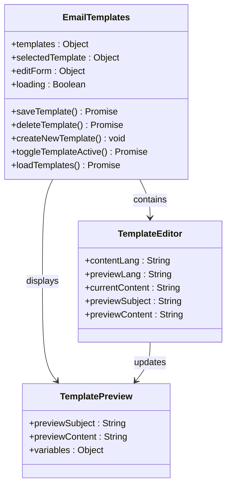
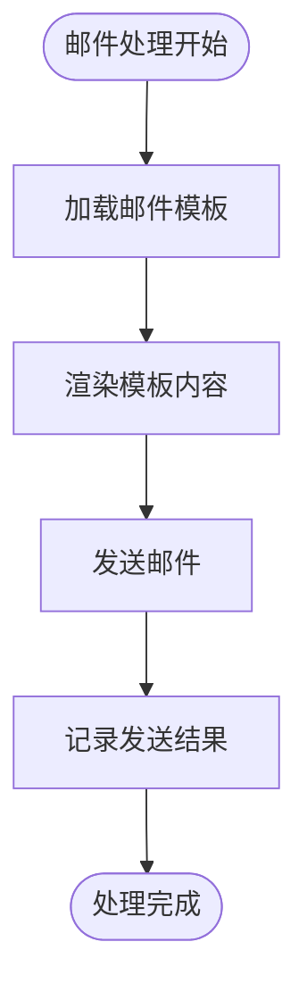
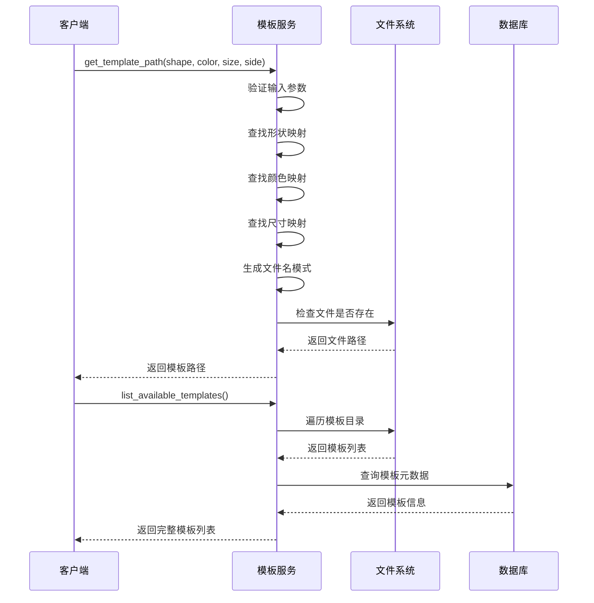
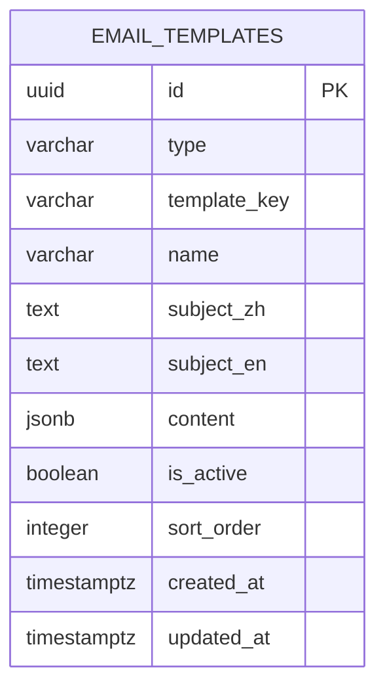
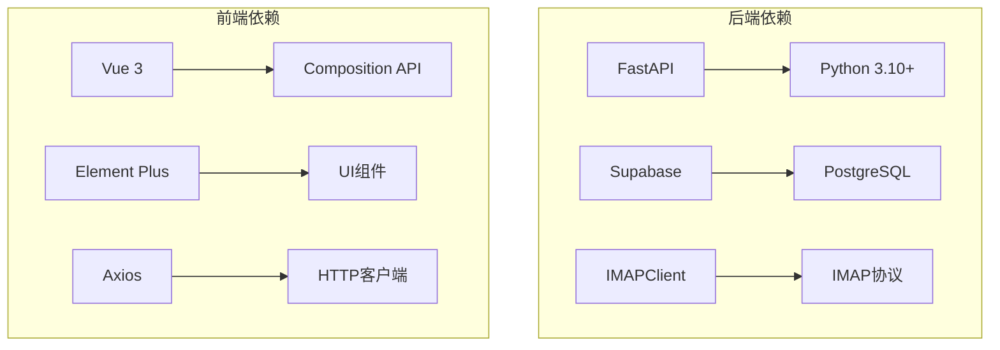

# 邮件模板管理系统

<cite>
**本文档引用的文件**
- [EmailTemplates.vue](file://frontend/src/views/Admin/EmailTemplates.vue)
- [email-templates.json](file://frontend/src/config/email-templates.json)
- [main.py](file://backend/src/api/main.py)
- [template_service.py](file://backend/src/services/template_service.py)
- [email_service.py](file://backend/src/services/email_service.py)
- [create_email_templates_table.sql](file://backend/scripts/create_email_templates_table.sql)
- [seed_email_templates.py](file://backend/scripts/seed_email_templates.py)
</cite>

## 更新摘要
**所做更改**
- 移除了多种模板类型支持：首封确认、修改确认、追评邮件
- 移除了本地存储持久化机制，系统不再支持用户自定义模板的本地保存
- 移除了Python脚本自动化工具，系统不再包含数据库维护和模板种子填充功能
- 系统现在仅支持基础的邮件模板管理功能

## 目录
1. [简介](#简介)
2. [项目结构](#项目结构)
3. [核心组件](#核心组件)
4. [架构概览](#架构概览)
5. [详细组件分析](#详细组件分析)
6. [模板类型与标识符系统](#模板类型与标识符系统)
7. [数据库维护与自动化](#数据库维护与自动化)
8. [依赖关系分析](#依赖关系分析)
9. [性能考虑](#性能考虑)
10. [故障排除指南](#故障排除指南)
11. [结论](#结论)

## 简介

邮件模板管理系统是一个简化的Etsy订单自动化解决方案的核心组成部分，专注于提供基础的邮件模板管理功能。该系统目前支持单一的邮件模板类型，提供简洁的模板变体管理，为电商运营提供了基本而可靠的邮件营销能力。

系统采用前后端分离架构，后端基于FastAPI提供RESTful API，前端使用Vue.js构建用户界面，支持基本的模板编辑和预览功能。**最新更新**移除了多种模板类型支持、本地存储持久化机制和Python脚本自动化工具，实现了简化的基础模板管理功能。

## 项目结构

该项目采用简化的分层架构，主要分为三个层次：

**图表来源**
- [main.py:945-1139](file://backend/src/api/main.py#L945-L1139)
- [EmailTemplates.vue:472-500](file://frontend/src/views/Admin/EmailTemplates.vue#L472-L500)

## 核心组件

### 邮件模板管理界面

邮件模板管理界面是系统的核心用户交互组件，提供了简化的模板生命周期管理功能：

- **单一模板类型管理**：支持基础的邮件模板管理
- **简化的内容编辑**：提供基本的主题和内容编辑功能
- **实时预览**：提供中英文双语预览功能
- **基础操作**：支持模板的创建、编辑、删除和启用/禁用操作
- **排序管理**：支持模板的排序权重设置

### 邮件服务系统

邮件服务系统负责处理所有邮件相关的操作，包括：

- **邮件发送**：支持基础的邮件发送功能
- **模板渲染**：将模板内容与订单数据动态组合

### 模板服务系统

模板服务系统提供模板的加载和管理功能：

- **模板映射**：将产品属性映射到对应的SVG模板文件
- **模板检索**：根据形状、颜色、尺寸等属性查找模板
- **模板验证**：确保模板文件的存在性和有效性
- **模板列表**：提供所有可用模板的列表和统计信息

## 架构概览

系统采用简化的微服务架构，各组件职责清晰，耦合度低：

**图表来源**
- [main.py:945-977](file://backend/src/api/main.py#L945-L977)
- [EmailTemplates.vue:670-694](file://frontend/src/views/Admin/EmailTemplates.vue#L670-L694)

系统架构的关键特点：

- **前后端分离**：Vue.js前端与FastAPI后端完全解耦
- **数据库抽象**：通过数据库服务层统一管理数据访问
- **配置管理**：集中化的环境配置管理
- **简化的功能集**：专注于基础的邮件模板管理

## 详细组件分析

### 邮件模板数据模型

系统使用简化的JSONB数据结构来存储模板内容：

**图表来源**
- [create_email_templates_table.sql:16-34](file://backend/scripts/create_email_templates_table.sql#L16-L34)

模板内容结构支持：
- **模板类型**：基础的邮件模板类型
- **模板标识符**：唯一的template_key标识符
- **基础变体**：简化的主题和内容结构
- **动态变量**：{firstName}, {orderId}, {effectImageUrl}, {senderName}, {confirmationDeadline}

### 邮件模板管理界面组件

**图表来源**
- [EmailTemplates.vue:472-500](file://frontend/src/views/Admin/EmailTemplates.vue#L472-L500)

### 邮件服务核心功能

邮件服务系统实现了简化的邮件处理流程：

**图表来源**
- [email_service.py:275-352](file://backend/src/services/email_service.py#L275-L352)

### 模板服务工作流程

模板服务负责将产品属性映射到具体的SVG模板文件：

**图表来源**
- [template_service.py:52-96](file://backend/src/services/template_service.py#L52-L96)

## 模板类型与标识符系统

系统现在支持单一的基础邮件模板类型：

### 基础邮件模板 (basic)
- **标准模板** (template_key: basic)：通用的基础邮件模板
- **简化的内容结构**：移除了多语气和多长度的复杂变体
- **基础的多语言支持**：仅支持中英文的基本内容

**章节来源**
- [email-templates.json:1-374](file://frontend/src/config/email-templates.json#L1-L374)
- [create_email_templates_table.sql:59-181](file://backend/scripts/create_email_templates_table.sql#L59-L181)

## 数据库维护与自动化

### 数据库表结构简化

系统现已包含简化的邮件模板数据库结构：

**图表来源**
- [create_email_templates_table.sql:16-34](file://backend/scripts/create_email_templates_table.sql#L16-L34)

### Python自动化脚本移除

**运营字段修复脚本** (`fix_shop_operator.py`):
- 已移除，不再提供数据库维护功能

**模板种子填充脚本** (`seed_email_templates.py`):
- 已移除，不再提供模板数据的自动填充功能

**邮件日志检查脚本** (`check_email_logs.py`):
- 已移除，不再提供邮件日志的自动检查功能

**章节来源**
- [seed_email_templates.py:1-228](file://backend/scripts/seed_email_templates.py#L1-L228)
- [create_email_templates_table.sql:1-189](file://backend/scripts/create_email_templates_table.sql#L1-L189)

## 依赖关系分析

系统使用简化的第三方库来实现基础功能：

**图表来源**
- [pyproject.toml:8-36](file://backend/pyproject.toml#L8-L36)
- [package.json:11-29](file://frontend/package.json#L11-L29)

## 性能考虑

系统在设计时充分考虑了性能优化：

### 数据库优化
- **索引策略**：为常用查询字段建立适当的索引
- **查询优化**：使用LIMIT和WHERE条件限制查询范围
- **连接池**：复用数据库连接，减少连接开销

### 缓存机制
- **模板缓存**：模板文件内容缓存，避免重复读取
- **配置缓存**：环境配置缓存，减少磁盘访问

### 异步处理
- **文件上传**：异步处理文件上传和存储
- **邮件发送**：异步发送邮件，避免阻塞主线程

### 前端性能优化
- **模板懒加载**：按需加载模板内容
- **组件复用**：模板编辑组件的高效复用
- **内存管理**：及时清理不需要的模板数据

## 故障排除指南

### 常见问题及解决方案

**1. 邮件模板无法加载**
- 检查模板文件是否存在
- 验证模板文件权限设置
- 确认模板路径配置正确

**2. 邮件发送失败**
- 验证SMTP服务器配置
- 检查邮箱认证信息
- 确认网络连接状态

**3. 数据库连接问题**
- 验证Supabase配置信息
- 检查网络防火墙设置
- 确认API密钥有效性

**4. 前端界面异常**
- 检查浏览器控制台错误
- 验证API端点可达性
- 确认CORS配置正确

### 调试工具

系统提供了简化的调试和监控功能：

- **日志系统**：详细的系统日志记录
- **错误处理**：统一的异常处理机制
- **健康检查**：API健康状态监控
- **性能监控**：关键操作的性能指标

## 结论

邮件模板管理系统是一个功能简化的现代化应用系统。它成功地将基础的邮件模板管理需求转化为简化的用户界面，同时保持了可靠的技术能力和良好的扩展性。

**主要优势包括**：

1. **高度简化**：专注于基础的邮件模板管理功能
2. **用户体验优秀**：简洁的界面设计和基本的预览功能
3. **技术架构先进**：采用现代的前后端分离架构
4. **可扩展性强**：模块化设计便于功能扩展和维护
5. **可靠性高**：完善的错误处理和监控机制
6. **维护成本低**：简化的功能减少了维护复杂度
7. **性能优化完善**：从前端到后端的全方位性能优化

**功能简化影响**：
- 移除了多种模板类型支持，系统现在仅支持基础的邮件模板管理
- 移除了本地存储持久化机制，用户无法保存自定义模板到本地
- 移除了Python脚本自动化工具，系统不再包含数据库维护和模板种子填充功能
- 简化了模板变体管理，移除了多语气和多长度的复杂结构
- 简化了数据库结构，移除了复杂的JSONB内容矩阵

该系统为电商运营提供了可靠的基础邮件营销支持，通过简化的模板管理和基本的工作流程，显著提高了运营效率和客户服务质量。简化的功能集和移除的自动化工具进一步增强了系统的稳定性，为长期运营奠定了坚实基础。