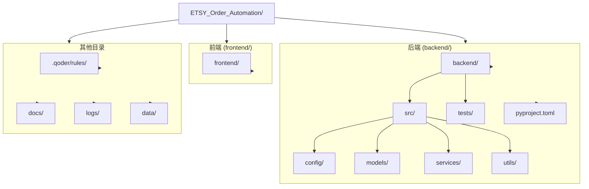

# 快速开始

<cite>
**本文引用的文件**
- [init_project.py](file://init_project.py)
</cite>

## 目录
1. [简介](#简介)
2. [项目结构](#项目结构)
3. [环境要求](#环境要求)
4. [安装步骤](#安装步骤)
5. [基本使用方法](#基本使用方法)
6. [虚拟环境管理](#虚拟环境管理)
7. [配置说明](#配置说明)
8. [常见问题排查](#常见问题排查)
9. [总结](#总结)

## 简介

ETSY订单自动化系统是一个基于Python的完整订单处理解决方案，专为Etsy卖家设计。该系统能够自动读取Etsy订单邮件、智能解析订单数据、自动生成效果图和物流标签，大幅提升订单处理效率。

本项目采用现代化的开发架构，包含：
- **Python 3.10+** - 现代Python版本支持
- **Poetry包管理** - 专业的Python包管理和虚拟环境管理
- **模块化架构** - 清晰的代码组织结构
- **完整开发规范** - 标准化的代码风格和开发流程

## 项目结构

项目采用标准的Python项目结构，便于维护和扩展：



**图表来源**
- [init_project.py](file://init_project.py#L40-L76)

**章节来源**
- [init_project.py](file://init_project.py#L40-L76)
- [init_project.py](file://init_project.py#L573-L591)

## 环境要求

### 系统要求

- **Python**: 3.10+ (强烈推荐3.10及以上版本)
- **操作系统**: Windows 10/11 (Windows专用版本)
- **Poetry**: 1.7+ (Python包管理工具)
- **磁盘空间**: 至少500MB可用空间

### Python版本兼容性

系统明确要求Python 3.10+，这是由于：
- 使用了Python 3.10的新特性
- 现代化语法糖支持
- 最佳实践的性能优化

**章节来源**
- [init_project.py](file://init_project.py#L505-L510)

## 安装步骤

### 步骤1：安装Poetry包管理工具

#### 方式一：使用官方安装脚本（推荐）

```powershell
# 在PowerShell中执行
(Invoke-WebRequest -Uri https://install.python-poetry.org -UseBasicParsing).Content | python -
```

#### 方式二：使用pip安装

```powershell
pip install poetry
```

#### 验证安装

```powershell
poetry --version
```

**章节来源**
- [init_project.py](file://init_project.py#L511-L531)
- [init_project.py](file://init_project.py#L526-L529)

### 步骤2：初始化项目结构

#### 方法A：使用初始化脚本（推荐）

```powershell
# 以管理员身份运行PowerShell
python init_project.py
```

#### 方法B：手动创建目录结构

```powershell
# 创建基础目录
mkdir backend, frontend, .qoder\rules, docs, logs, data

# 创建Python包初始化文件
echo '"""Package initialization."""' > backend\src\__init__.py
echo '"""Package initialization."""' > backend\src\config\__init__.py
echo '"""Package initialization."""' > backend\src\models\__init__.py
echo '"""Package initialization."""' > backend\src\services\__init__.py
echo '"""Package initialization."""' > backend\src\utils\__init__.py
echo '"""Package initialization."""' > backend\tests\__init__.py
```

**章节来源**
- [init_project.py](file://init_project.py#L873-L921)

### 步骤3：安装项目依赖

```powershell
# 进入后端目录
cd D:\ETSY_Order_Automation\backend

# 安装依赖（Poetry会自动创建虚拟环境）
poetry install
```

**章节来源**
- [init_project.py](file://init_project.py#L533-L542)

## 基本使用方法

### 启动开发环境

#### 方式一：激活虚拟环境Shell

```powershell
# 激活虚拟环境
poetry shell
```

#### 方式二：在虚拟环境中直接执行命令

```powershell
# 无需激活虚拟环境，直接执行
poetry run python your_script.py
```

### 验证安装

```powershell
# 验证核心依赖是否正确安装
poetry run python -c "import requests; print('✅ 安装成功')"
```

**章节来源**
- [init_project.py](file://init_project.py#L543-L552)
- [init_project.py](file://init_project.py#L842-L858)

## 虚拟环境管理

### 查看虚拟环境信息

```powershell
# 查看虚拟环境路径
poetry env info --path

# 查看当前使用的Python解释器
poetry run which python
```

### 管理依赖

```powershell
# 添加生产依赖
poetry add package_name

# 添加开发依赖
poetry add --group dev package_name

# 移除依赖
poetry remove package_name
```

### 依赖版本管理

系统预配置了稳定的依赖版本组合：
- **requests**: ^2.31.0 (HTTP请求)
- **imapclient**: ^3.0.0 (邮件读取)
- **pillow**: ^10.2.0 (图像处理)
- **sqlalchemy**: ^2.0.25 (数据库ORM)

**章节来源**
- [init_project.py](file://init_project.py#L594-L617)

## 配置说明

### 环境变量配置

#### 复制配置文件

```powershell
# 复制示例配置文件
cp backend\.env.example backend\.env
```

#### 主要配置项

```ini
# 邮箱配置
IMAP_SERVER=imap.gmail.com
IMAP_PORT=993
EMAIL_ADDRESS=your_email@gmail.com
EMAIL_PASSWORD=your_app_password

# 数据库配置
DATABASE_URL=sqlite:///./data/orders.db

# 日志配置
LOG_LEVEL=INFO
LOG_FILE=../logs/app.log
```

### 项目配置文件

#### pyproject.toml配置要点

- **Python版本**: `^3.10` (严格要求3.10+)
- **开发工具**: Black、Pytest、Pylint、Mypy
- **测试配置**: 自动发现测试文件
- **构建系统**: Poetry Core

**章节来源**
- [init_project.py](file://init_project.py#L654-L692)
- [init_project.py](file://init_project.py#L78-L174)

## 常见问题排查

### 权限问题

**问题**: 脚本无法创建目录或文件
**解决**: 以管理员身份运行PowerShell
```powershell
# 右键点击PowerShell选择"以管理员身份运行"
python init_project.py
```

### Python版本不兼容

**问题**: Poetry安装失败或依赖冲突
**解决**: 确保使用Python 3.10+
```powershell
python --version
# 应该显示3.10.x或更高版本
```

### 网络连接问题

**问题**: Poetry无法下载依赖
**解决**: 配置代理或使用国内镜像源
```powershell
# 设置PyPI镜像源
poetry config repositories.pypi https://pypi.tuna.tsinghua.edu.cn/simple/
poetry config http-basic.pypi username password
```

### 磁盘空间不足

**问题**: 依赖安装过程中断
**解决**: 确保有足够的磁盘空间
- 建议至少500MB可用空间
- 清理临时文件和缓存

**章节来源**
- [init_project.py](file://init_project.py#L16-L27)
- [init_project.py](file://init_project.py#L878-L885)

## 总结

ETSY订单自动化系统提供了完整的项目初始化和开发环境搭建方案。通过Poetry包管理工具，开发者可以轻松管理Python依赖和虚拟环境，确保开发环境的一致性和可重复性。

### 关键优势

1. **自动化初始化**: 一键创建完整项目结构
2. **标准化配置**: 预配置的最佳实践设置
3. **完善的开发工具链**: 集成代码格式化、测试、检查工具
4. **清晰的项目结构**: 便于团队协作和长期维护

### 下一步建议

1. **阅读开发规范**: 详细学习`.qoder/rules/code-standard.md`
2. **配置邮箱连接**: 设置真实的Etsy订单邮箱参数
3. **数据库初始化**: 配置并初始化订单数据库
4. **功能开发**: 基于现有架构添加具体业务逻辑

通过遵循本指南，开发者可以在几分钟内完成环境搭建并开始ETSY订单自动化系统的开发工作。