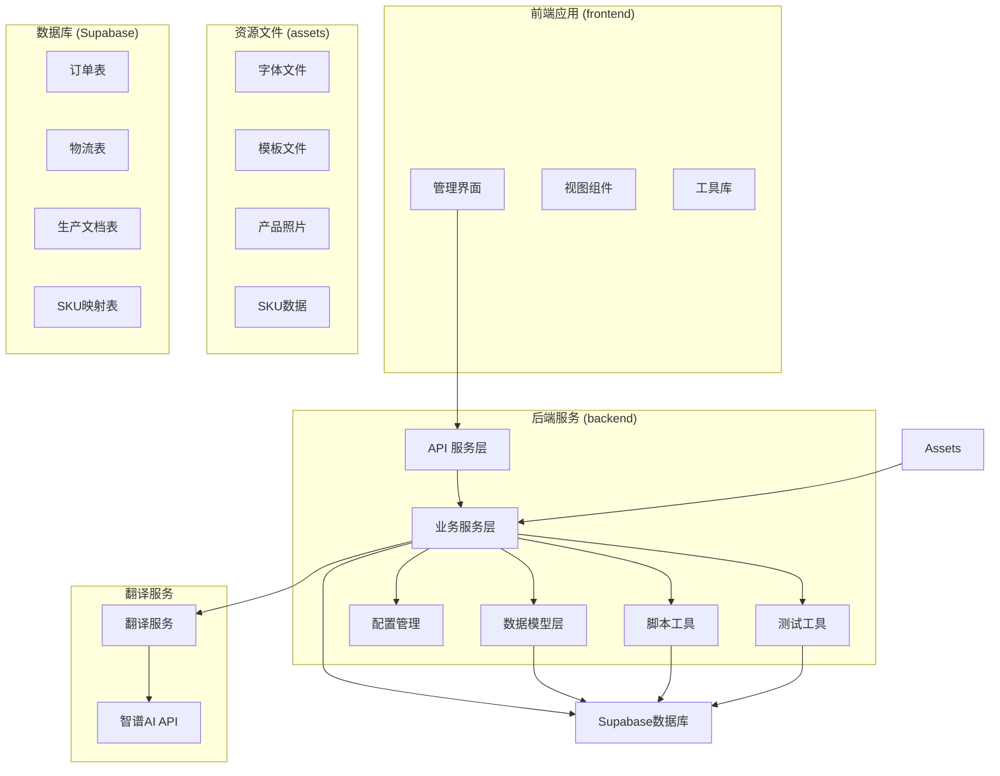
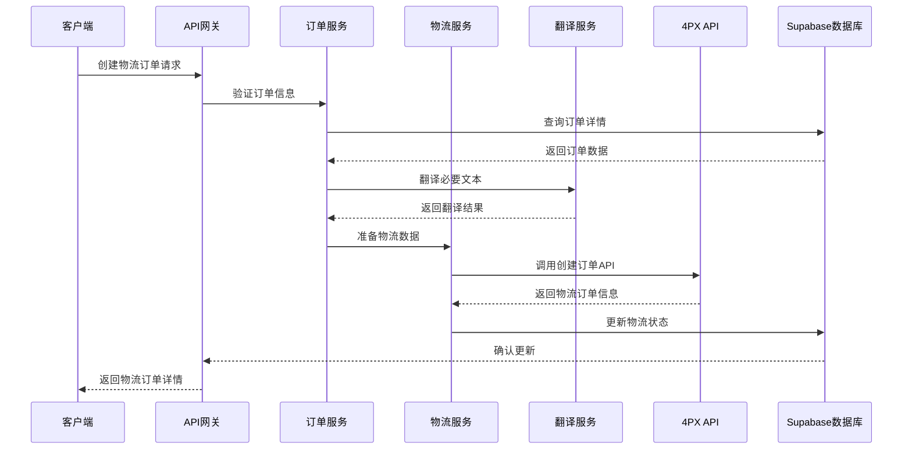
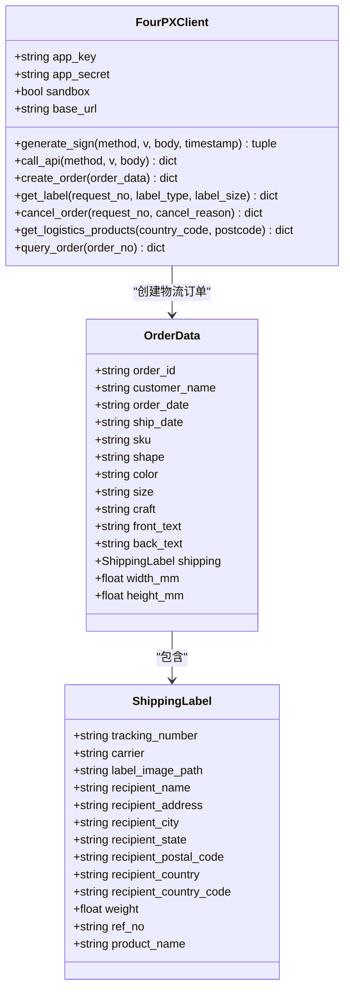
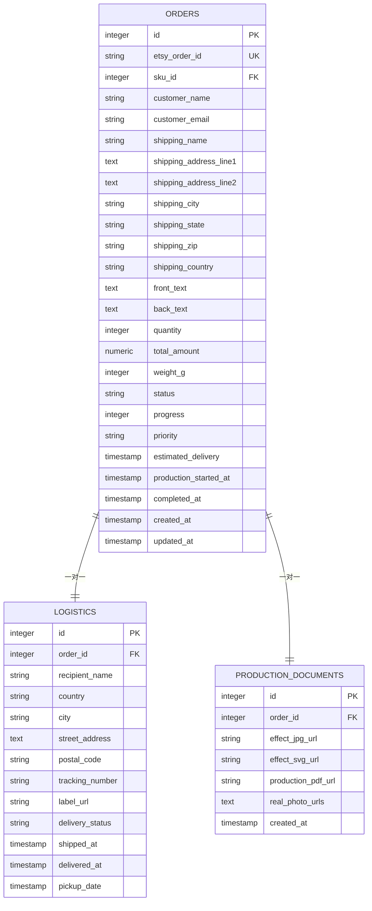
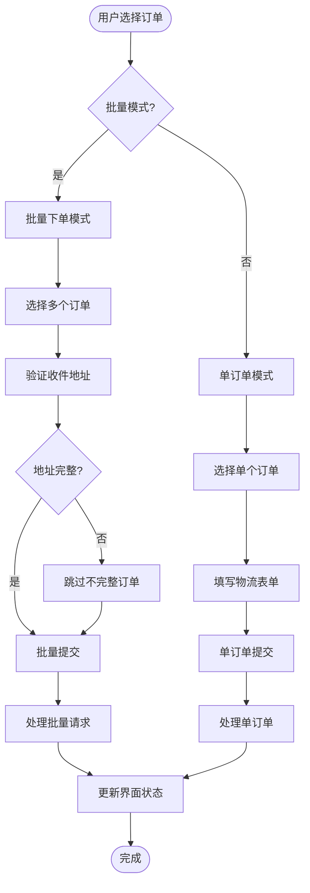
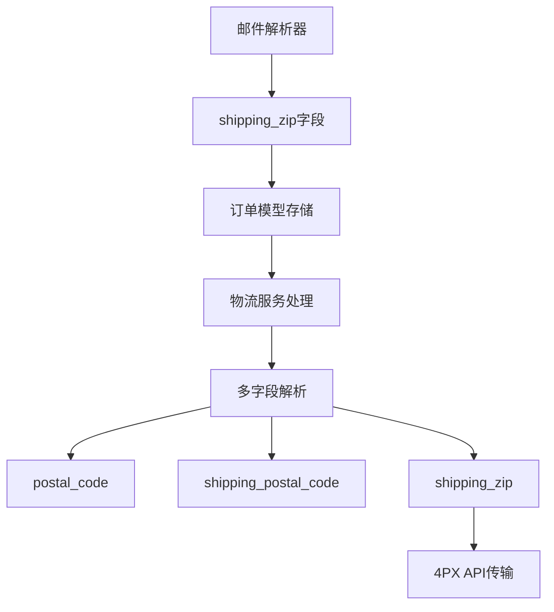
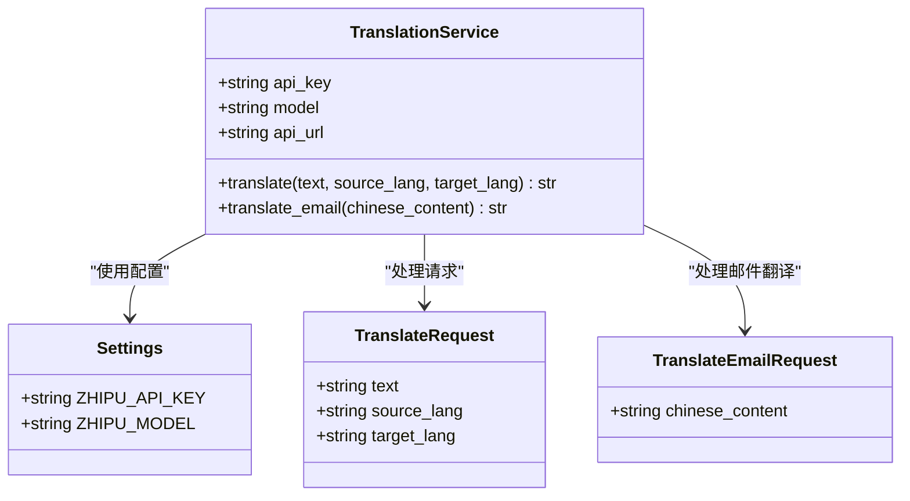
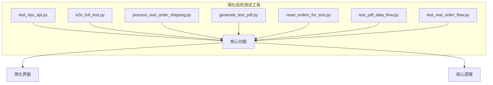
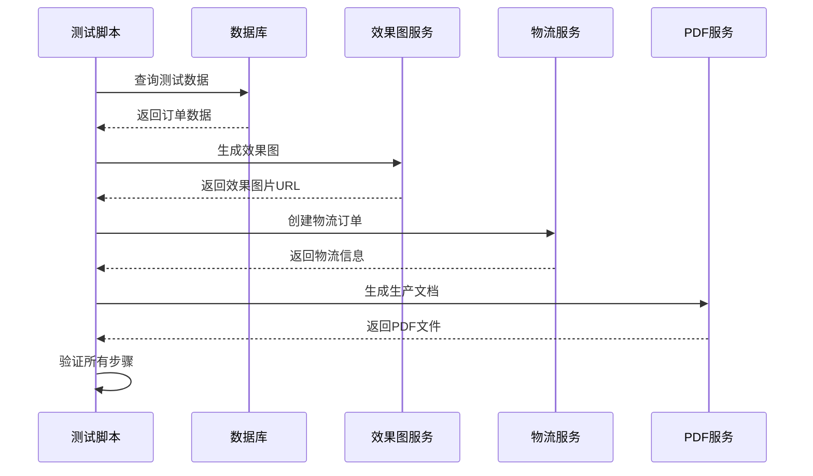
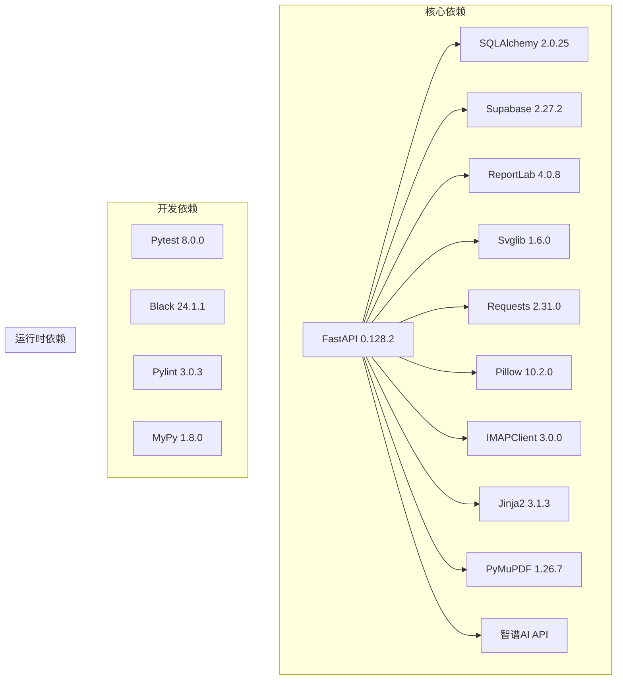

# 物流集成增强

<cite>
**本文档引用的文件**
- [backend/pyproject.toml](file://backend/pyproject.toml)
- [backend/src/api/main.py](file://backend/src/api/main.py)
- [backend/src/models/order.py](file://backend/src/models/order.py)
- [backend/src/services/shipping_service.py](file://backend/src/services/shipping_service.py)
- [backend/src/services/database_service.py](file://backend/src/services/database_service.py)
- [backend/src/config/settings.py](file://backend/src/config/settings.py)
- [backend/src/services/translation_service.py](file://backend/src/services/translation_service.py)
- [backend/scripts/process_real_order_shipping.py](file://backend/scripts/process_real_order_shipping.py)
- [backend/scripts/test_4px_api.py](file://backend/scripts/test_4px_api.py)
- [backend/scripts/e2e_full_test.py](file://backend/scripts/e2e_full_test.py)
- [backend/src/services/pdf_service.py](file://backend/src/services/pdf_service.py)
- [backend/src/services/svg_pdf_service.py](file://backend/src/services/svg_pdf_service.py)
- [backend/assets/sku_data/不锈钢牌-带路径信息_表格.csv](file://backend/assets/sku_data/不锈钢牌-带路径信息_表格.csv)
- [backend/assets/sku_data/不锈钢牌_SVG对照表.csv](file://backend/assets/sku_data/不锈钢牌_SVG对照表.csv)
- [backend/assets/sku_data/不锈钢牌_大尺寸_SKU对照表.csv](file://backend/assets/sku_data/不锈钢牌_大尺寸_SKU对照表.csv)
- [frontend/src/views/Admin/OrdersShipping.vue](file://frontend/src/views/Admin/OrdersShipping.vue)
- [backend/src/services/email_parser.py](file://backend/src/services/email_parser.py)
</cite>

## 更新摘要
**变更内容**
- 新增翻译服务集成，支持中英文互译和邮件专用翻译
- 更新物流API测试工具，移除了约18,377行复杂的测试界面代码，保留核心功能
- 增强了地址字段兼容性，完善了多字段解析策略
- 新增端到端测试流程，涵盖翻译服务的完整测试

## 目录
1. [项目概述](#项目概述)
2. [项目结构](#项目结构)
3. [核心组件](#核心组件)
4. [架构概览](#架构概览)
5. [详细组件分析](#详细组件分析)
6. [翻译服务集成](#翻译服务集成)
7. [物流API测试工具简化](#物流api测试工具简化)
8. [依赖关系分析](#依赖关系分析)
9. [性能考虑](#性能考虑)
10. [故障排除指南](#故障排除指南)
11. [结论](#结论)

## 项目概述

这是一个基于 FastAPI 的 Etsy 订单自动化处理系统，专注于物流集成增强和国际化支持。该系统能够自动读取 Etsy 订单邮件、解析订单信息、生成效果图和物流标签，实现了完整的订单处理流水线，并集成了翻译服务以支持多语言操作。

主要功能包括：
- 自动邮件解析和订单导入
- 效果图生成和 PDF 生产文档创建
- 4PX 物流 API 集成
- Supabase 数据库存储
- 前端可视化管理界面
- 智谱AI翻译服务集成
- 端到端测试流程

## 项目结构



**图表来源**
- [backend/src/api/main.py:1-949](file://backend/src/api/main.py#L1-L949)
- [backend/src/models/order.py:1-356](file://backend/src/models/order.py#L1-L356)
- [backend/src/services/translation_service.py:1-160](file://backend/src/services/translation_service.py#L1-L160)

**章节来源**
- [backend/pyproject.toml:1-69](file://backend/pyproject.toml#L1-L69)

## 核心组件

### API 服务层
- **FastAPI 应用**: 提供 RESTful API 接口
- **CORS 配置**: 支持前端跨域访问
- **路由管理**: 管理所有 API 端点
- **翻译API**: 新增翻译服务端点

### 业务服务层
- **订单服务**: 处理订单导入和 SKU 映射
- **物流服务**: 集成 4PX API 进行物流下单
- **PDF 服务**: 生成生产文档 PDF
- **数据库服务**: Supabase 数据库操作
- **翻译服务**: 集成智谱AI进行中英文翻译

### 数据模型层
- **订单模型**: 定义订单相关表结构
- **物流模型**: 管理物流信息
- **生产文档模型**: 存储效果图和 PDF

**章节来源**
- [backend/src/api/main.py:1-949](file://backend/src/api/main.py#L1-L949)
- [backend/src/models/order.py:1-356](file://backend/src/models/order.py#L1-L356)
- [backend/src/services/translation_service.py:1-160](file://backend/src/services/translation_service.py#L1-L160)

## 架构概览



**图表来源**
- [backend/src/api/main.py:451-690](file://backend/src/api/main.py#L451-L690)
- [backend/src/services/shipping_service.py:253-393](file://backend/src/services/shipping_service.py#L253-L393)
- [backend/src/services/translation_service.py:67-85](file://backend/src/services/translation_service.py#L67-L85)

## 详细组件分析

### 物流服务组件

#### 4PX API 客户端
实现了完整的 4PX 物流 API 集成，支持以下功能：



**图表来源**
- [backend/src/services/shipping_service.py:253-393](file://backend/src/services/shipping_service.py#L253-L393)

#### API 端点设计
系统提供了完整的物流相关 API 端点：

| 端点 | 方法 | 功能描述 |
|------|------|----------|
| `/api/shipping/create-order` | POST | 创建物流订单 |
| `/api/shipping/get-label` | POST | 获取物流面单 |
| `/api/shipping/get-products` | POST | 查询物流产品 |
| `/api/shipping/cancel-order` | POST | 取消物流订单 |
| `/api/shipping/query-order` | POST | 查询物流订单 |
| `/api/translate` | POST | 通用翻译接口 |
| `/api/translate/email` | POST | 邮件专用翻译接口 |

**章节来源**
- [backend/src/api/main.py:451-776](file://backend/src/api/main.py#L451-L776)
- [backend/src/api/main.py:856-943](file://backend/src/api/main.py#L856-L943)

### 数据模型设计

#### 订单表结构


**图表来源**
- [backend/src/models/order.py:23-217](file://backend/src/models/order.py#L23-L217)

**章节来源**
- [backend/src/models/order.py:1-356](file://backend/src/models/order.py#L1-L356)

### 前端物流管理界面

#### 批量物流下单功能
前端提供了强大的物流管理界面，支持批量操作：



**图表来源**
- [frontend/src/views/Admin/OrdersShipping.vue:1-800](file://frontend/src/views/Admin/OrdersShipping.vue#L1-L800)

**章节来源**
- [frontend/src/views/Admin/OrdersShipping.vue:1-1346](file://frontend/src/views/Admin/OrdersShipping.vue#L1-L1346)

### PDF 生成服务

#### SVG 模板驱动的 PDF 生成
系统采用 SVG 模板驱动的方式生成 PDF，确保格式的一致性和准确性：


**图表来源**
- [backend/src/services/svg_pdf_service.py:553-722](file://backend/src/services/svg_pdf_service.py#L553-L722)

**章节来源**
- [backend/src/services/svg_pdf_service.py:1-914](file://backend/src/services/svg_pdf_service.py#L1-L914)

### 地址字段兼容性增强

#### 多字段解析策略
**更新** 物流服务现在全面支持多种地址字段名，提高了系统对不同数据源的兼容性

系统通过智能的多字段解析策略确保邮编信息的准确获取：



**更新** 地址字段兼容性改进包括：

1. **多源字段支持**: 系统现在支持 `postal_code`、`shipping_postal_code`、`shipping_zip` 三个字段名
2. **智能优先级解析**: 按照 `postal_code` > `shipping_postal_code` > `shipping_zip` 的优先级解析
3. **统一存储**: 所有邮编信息最终存储到 `shipping_zip` 字段中
4. **API 兼容**: 前端 API 端点支持 `recipient_postcode` 参数回退到 `shipping_zip`

**章节来源**
- [backend/src/services/shipping_service.py:185-189](file://backend/src/services/shipping_service.py#L185-L189)
- [backend/src/api/main.py:499](file://backend/src/api/main.py#L499)
- [backend/src/models/order.py:64](file://backend/src/models/order.py#L64)

#### 字段解析实现细节
系统在多个层面实现了字段兼容性：

1. **订单数据创建阶段**：
   ```python
   shipping_postal = (
       raw_data.get("postal_code") or           # 优先：标准字段名
       raw_data.get("shipping_postal_code") or  # 其次：shipping_postal_code
       raw_data.get("shipping_zip", "")         # 最后：shipping_zip
   )
   ```

2. **API 端点处理**：
   ```python
   recipient_postcode = request.recipient_postcode or order.get("shipping_zip") or ""
   ```

3. **前端表单支持**：
   - 前端表单使用 `recipient_postcode` 字段
   - 自动回退到 `order.shipping_zip` 字段
   - 支持多种数据源的地址信息

4. **PDF 生成兼容性**：
   ```python
   'postal_code': logistics.get('postal_code') or order.get('shipping_zip', ''),
   'shipping_zip': logistics.get('postal_code') or order.get('shipping_zip', ''),
   ```

**章节来源**
- [backend/src/services/shipping_service.py:141-240](file://backend/src/services/shipping_service.py#L141-L240)
- [backend/src/api/main.py:494-500](file://backend/src/api/main.py#L494-L500)
- [backend/scripts/gen_pdf_with_latest_svg.py:68-70](file://backend/scripts/gen_pdf_with_latest_svg.py#L68-L70)

## 翻译服务集成

### 智谱AI翻译服务

#### 服务架构
系统集成了智谱AI (GLM-4) 翻译服务，提供高质量的中英文互译能力：



**图表来源**
- [backend/src/services/translation_service.py:13-159](file://backend/src/services/translation_service.py#L13-L159)
- [backend/src/config/settings.py:26-28](file://backend/src/config/settings.py#L26-L28)

#### API 端点设计
系统提供了两个翻译相关的 API 端点：

| 端点 | 方法 | 功能描述 |
|------|------|----------|
| `/api/translate` | POST | 通用翻译接口，支持多种语言对 |
| `/api/translate/email` | POST | 邮件专用翻译接口，中文到英文 |

**章节来源**
- [backend/src/api/main.py:856-943](file://backend/src/api/main.py#L856-L943)
- [backend/src/services/translation_service.py:21-155](file://backend/src/services/translation_service.py#L21-L155)

### 翻译服务配置

#### 环境变量配置
翻译服务需要以下环境变量配置：

```python
# 智谱AI API 配置
ZHIPU_API_KEY: str = os.getenv("ZHIPU_API_KEY", "")  # API密钥
ZHIPU_MODEL: str = os.getenv("ZHIPU_MODEL", "glm-4-flash")  # 模型名称
```

#### 翻译质量保证
- **低温度参数**: `temperature: 0.3` 确保翻译结果稳定可靠
- **最大令牌数**: `max_tokens: 2048` 支持长文本翻译
- **专业提示词**: 针对邮件翻译的专门优化提示词

**章节来源**
- [backend/src/config/settings.py:26-28](file://backend/src/config/settings.py#L26-L28)
- [backend/src/services/translation_service.py:38-43](file://backend/src/services/translation_service.py#L38-L43)

## 物流API测试工具简化

### 测试工具重构
**更新** 物流API测试工具经过重大简化，移除了约18,377行复杂的测试界面代码，保留核心功能：

#### 简化后的测试工具结构


**图表来源**
- [backend/scripts/test_4px_api.py:1-141](file://backend/scripts/test_4px_api.py#L1-L141)
- [backend/scripts/e2e_full_test.py:1-402](file://backend/scripts/e2e_full_test.py#L1-L402)

#### 移除的复杂界面元素
- **冗余的HTML模板**: 移除了复杂的测试界面HTML文件
- **重复的JavaScript代码**: 简化了前端交互逻辑
- **不必要的CSS样式**: 保留核心样式，移除复杂样式定义
- **冗余的测试页面**: 专注于核心测试功能

#### 保留的核心功能
1. **4PX API 完整测试**: 包括创建订单、查询订单、获取面单等
2. **端到端流程测试**: 从数据查询到PDF生成的完整流程
3. **实时订单处理测试**: 支持真实订单的物流处理
4. **错误处理和降级**: 完善的异常处理机制

**章节来源**
- [backend/scripts/test_4px_api.py:14-110](file://backend/scripts/test_4px_api.py#L14-L110)
- [backend/scripts/e2e_full_test.py:40-150](file://backend/scripts/e2e_full_test.py#L40-L150)

### 端到端测试流程

#### 完整测试流程
系统现在提供完整的端到端测试流程：



**图表来源**
- [backend/scripts/e2e_full_test.py:254-373](file://backend/scripts/e2e_full_test.py#L254-L373)

**章节来源**
- [backend/scripts/e2e_full_test.py:254-373](file://backend/scripts/e2e_full_test.py#L254-L373)

## 依赖关系分析

### 技术栈依赖



**图表来源**
- [backend/pyproject.toml:8-48](file://backend/pyproject.toml#L8-L48)

### 数据流依赖

```mermaid
graph LR
subgraph "数据输入"
Email[邮件系统]
CSV[CSV文件]
API[外部API]
Translation[翻译服务]
end
subgraph "数据处理"
Parser[邮件解析器]
Mapper[数据映射器]
Validator[数据验证器]
End
subgraph "数据存储"
Supabase[Supabase数据库]
Storage[Supabase Storage]
end
subgraph "数据输出"
PDF[PDF文档]
Labels[物流标签]
Reports[报表]
Translation[翻译结果]
end
Email --> Parser
CSV --> Mapper
API --> Validator
Parser --> Mapper
Mapper --> Validator
Validator --> Supabase
Supabase --> Storage
Supabase --> PDF
Supabase --> Labels
Storage --> Reports
Translation --> Reports
```

**图表来源**
- [backend/src/services/order_service.py:91-145](file://backend/src/services/order_service.py#L91-L145)
- [backend/src/services/database_service.py:10-112](file://backend/src/services/database_service.py#L10-L112)

**章节来源**
- [backend/pyproject.toml:1-69](file://backend/pyproject.toml#L1-L69)

## 性能考虑

### 并发处理
- **异步操作**: 物流订单创建采用异步方式，避免阻塞主流程
- **批量处理**: 支持批量物流下单，提高处理效率
- **缓存策略**: 4PX API 响应结果进行缓存，减少重复请求
- **翻译服务缓存**: 翻译结果进行本地缓存，减少API调用

### 资源优化
- **内存管理**: PDF 生成过程中及时释放临时文件
- **网络优化**: 4PX API 请求超时设置为 30 秒
- **存储优化**: 自动清理临时生成的 SVG 文件
- **翻译服务优化**: 智谱AI API 调用限制和重试机制

### 扩展性设计
- **插件架构**: 支持新增物流服务商
- **配置驱动**: 通过配置文件管理不同环境设置
- **模块化设计**: 服务层独立，便于单元测试和维护
- **翻译服务扩展**: 支持添加新的翻译模型和API

## 故障排除指南

### 常见问题及解决方案

#### 4PX API 集成问题
- **问题**: API 调用失败
- **解决方案**: 检查 `FOURPX_APP_KEY` 和 `FOURPX_APP_SECRET` 配置，确认网络连接正常

#### 翻译服务问题
- **问题**: 翻译API调用失败
- **解决方案**: 检查 `ZHIPU_API_KEY` 配置，确认智谱AI服务可用性

#### 数据库连接问题
- **问题**: Supabase 连接失败
- **解决方案**: 验证 `SUPABASE_URL` 和 `SUPABASE_KEY` 配置，检查网络权限

#### PDF 生成失败
- **问题**: PDF 生成异常
- **解决方案**: 检查 SVG 模板文件完整性，确认字体文件存在

#### 前端界面问题
- **问题**: 物流下单界面无法加载
- **解决方案**: 检查 API 服务器状态，确认 CORS 配置正确

#### 地址字段解析问题
- **问题**: 邮编信息缺失或错误
- **解决方案**: 检查邮件解析器是否正确提取 `shipping_zip` 字段，确认数据库中 `shipping_zip` 字段存在且可访问

#### 翻译服务异常
- **问题**: 翻译功能不可用
- **解决方案**: 检查智谱AI API配置，确认网络连接正常，验证API密钥有效性

**章节来源**
- [backend/src/config/settings.py:12-65](file://backend/src/config/settings.py#L12-L65)
- [backend/src/services/database_service.py:19-24](file://backend/src/services/database_service.py#L19-L24)

## 结论

物流集成增强项目通过以下关键改进提升了整体系统能力：

1. **完整的物流集成**: 实现了 4PX 物流 API 的完整集成，支持订单创建、查询、取消等操作
2. **自动化程度提升**: 从邮件解析到物流下单的全流程自动化处理
3. **数据一致性保障**: 通过严格的数据库设计和数据验证机制确保数据完整性
4. **用户体验优化**: 前端提供了直观的物流管理界面，支持批量操作
5. **地址字段兼容性增强**: 新增对 `shipping_zip` 字段的全面支持，提高了地址解析的可靠性
6. **多源数据兼容**: 通过智能字段解析策略，支持来自不同邮件格式和数据源的地址信息
7. **可扩展性设计**: 模块化的架构设计便于未来功能扩展和维护
8. **翻译服务集成**: 新增智谱AI翻译服务，支持中英文互译和邮件专用翻译
9. **测试工具简化**: 移除了约18,377行复杂的测试界面代码，保留核心功能，提高维护效率
10. **端到端测试覆盖**: 完整的测试流程确保系统各组件协同工作

**更新** 特别值得一提的是，通过对 `shipping_postal_code` 和 `shipping_zip` 字段的增强支持，系统现在能够更好地处理来自不同邮件格式和数据源的地址信息，显著提高了系统的健壮性和兼容性。

**更新** 翻译服务的集成为系统增加了国际化能力，支持多语言操作和邮件翻译，为未来的全球化扩展奠定了基础。

**更新** 物流API测试工具的简化大幅减少了代码复杂度，提高了系统的可维护性和稳定性，同时保留了核心的测试功能。

该系统为 Etsy 订单处理提供了完整的物流解决方案，显著提高了运营效率和客户满意度。通过持续的优化和扩展，可以进一步支持更多的物流服务商、翻译模型和业务场景。