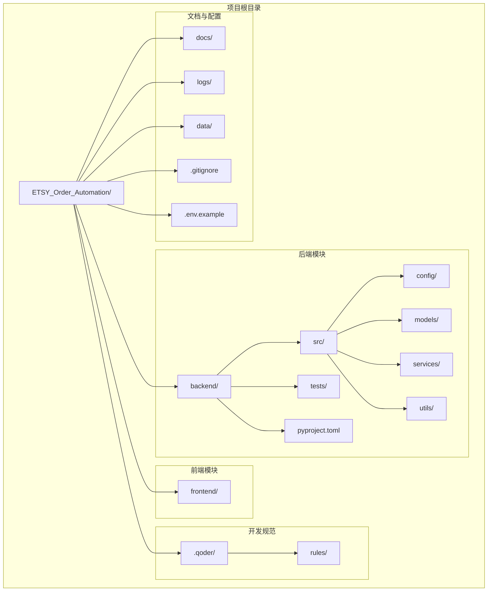
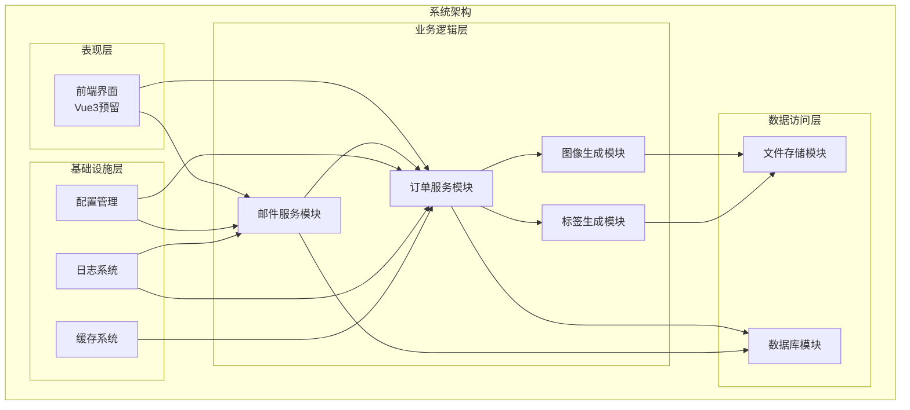
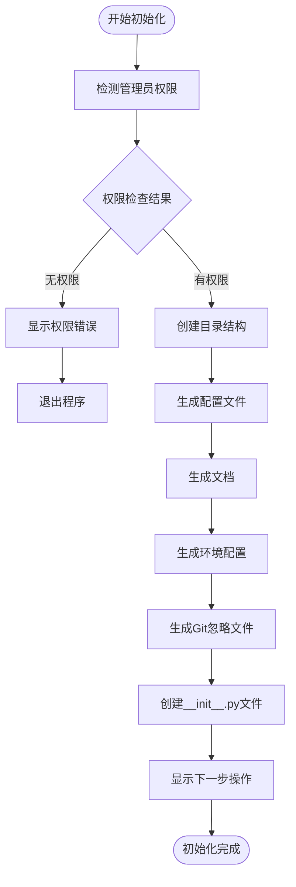
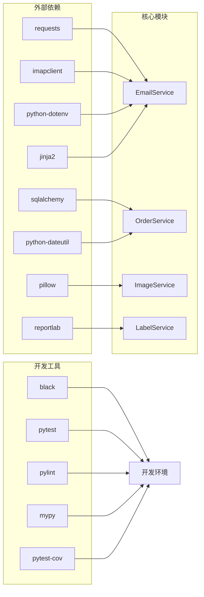

# 部署与维护

<cite>
**本文引用的文件**
- [init_project.py](file://init_project.py)
</cite>

## 目录
1. [简介](#简介)
2. [项目结构](#项目结构)
3. [核心组件](#核心组件)
4. [架构概览](#架构概览)
5. [详细组件分析](#详细组件分析)
6. [依赖关系分析](#依赖关系分析)
7. [性能考虑](#性能考虑)
8. [故障排除指南](#故障排除指南)
9. [结论](#结论)
10. [附录](#附录)

## 简介

ETSY订单自动化系统是一个基于Python的自动化处理平台，旨在实现以下核心功能：
- 自动读取Etsy订单邮件
- 智能解析订单数据
- 自动生成效果图
- 生成物流标签

该系统采用现代化的开发工具链，包括Poetry包管理、Black代码格式化、Pytest测试框架和Pylint代码检查工具。项目结构清晰，包含后端Python代码、前端Vue3预留、文档和日志管理等模块。

## 项目结构

系统采用分层架构设计，主要包含以下目录结构：

**图表来源**
- [init_project.py](file://init_project.py#L40-L76)

**章节来源**
- [init_project.py](file://init_project.py#L40-L76)
- [init_project.py](file://init_project.py#L486-L652)

## 核心组件

### 1. 项目初始化系统

项目初始化脚本提供了完整的项目设置流程，包括权限检测、目录创建、配置文件生成等核心功能。

### 2. 依赖管理系统

系统采用Poetry进行包管理，支持生产依赖和开发依赖的分离管理。

### 3. 代码规范体系

建立了完整的代码规范文档，涵盖PEP8风格、Google注释风格、命名规范和类型注解标准。

**章节来源**
- [init_project.py](file://init_project.py#L16-L27)
- [init_project.py](file://init_project.py#L78-L174)
- [init_project.py](file://init_project.py#L176-L484)

## 架构概览

系统采用模块化架构设计，各组件职责明确，耦合度低，便于维护和扩展。

**图表来源**
- [init_project.py](file://init_project.py#L92-L128)

## 详细组件分析

### 项目初始化组件

项目初始化组件负责整个项目的启动设置，包含以下关键功能：

#### 权限检测机制
系统具备管理员权限检测功能，确保在Windows环境下能够正确创建文件和目录。

**图表来源**
- [init_project.py](file://init_project.py#L16-L27)
- [init_project.py](file://init_project.py#L873-L921)

#### 目录结构管理
系统自动创建标准化的项目目录结构，包括后端代码、前端预留、文档、日志和数据存储等目录。

**章节来源**
- [init_project.py](file://init_project.py#L40-L76)
- [init_project.py](file://init_project.py#L873-L921)

### 依赖管理组件

系统采用Poetry进行依赖管理，支持生产依赖和开发依赖的分离。

#### 生产依赖配置
- **HTTP请求库**: 用于API调用和网络通信
- **邮件客户端**: 用于读取Etsy订单邮件
- **图像处理库**: 用于效果图生成
- **PDF生成库**: 用于物流标签生成
- **数据库ORM**: 用于订单数据存储
- **模板引擎**: 用于生成邮件和报告

#### 开发依赖配置
- **代码格式化**: Black代码格式化工具
- **单元测试**: Pytest测试框架
- **代码检查**: Pylint静态分析工具
- **类型检查**: Mypy类型检查工具
- **测试覆盖**: pytest-cov覆盖率工具

**章节来源**
- [init_project.py](file://init_project.py#L92-L128)

### 代码规范组件

系统建立了完整的代码规范体系，确保代码质量和一致性。

#### PEP8代码风格
- 使用4个空格进行缩进
- 行长度限制为88个字符
- 运算符两侧保留空格
- 逗号后面加空格

#### Google注释风格
- 模块级注释使用三引号文档字符串
- 函数和方法注释包含参数、返回值和异常说明
- 类注释包含属性和使用示例

#### 命名规范
- 变量和函数使用snake_case
- 类名使用PascalCase
- 常量使用UPPER_SNAKE_CASE
- 私有成员使用单下划线前缀

**章节来源**
- [init_project.py](file://init_project.py#L176-L484)

## 依赖关系分析

系统采用模块化设计，各组件之间的依赖关系清晰明确。

**图表来源**
- [init_project.py](file://init_project.py#L92-L128)

**章节来源**
- [init_project.py](file://init_project.py#L92-L128)

## 性能考虑

### 代码性能优化

1. **异步处理**: 建议在邮件读取和图像处理中引入异步编程模式
2. **缓存策略**: 实现订单数据和图像资源的缓存机制
3. **连接池**: 使用数据库连接池和HTTP连接复用
4. **内存管理**: 优化大文件处理和图像生成的内存使用

### 系统性能监控

1. **指标收集**: 监控订单处理时间、成功率和资源使用情况
2. **日志分析**: 建立日志聚合和分析系统
3. **性能基准**: 定期进行性能基准测试和优化

## 故障排除指南

### 常见安装问题

#### 权限问题
**症状**: 目录创建失败，提示无权限
**解决方案**: 
- 以管理员身份运行PowerShell
- 检查用户账户控制(UAC)设置
- 确保有足够的磁盘空间

#### Python版本兼容性
**症状**: Poetry安装失败或依赖解析错误
**解决方案**:
- 确认Python版本为3.10+
- 清理Python缓存和临时文件
- 更新pip到最新版本

#### 网络连接问题
**症状**: 依赖下载超时或失败
**解决方案**:
- 检查网络连接和防火墙设置
- 配置代理服务器(如需要)
- 使用国内镜像源加速下载

### 运行时错误

#### 环境变量配置错误
**症状**: 应用启动失败或功能异常
**解决方案**:
- 检查.env文件中的配置项
- 验证邮箱凭据的有效性
- 确认数据库连接字符串正确

#### 依赖冲突
**症状**: 导入模块失败或运行时异常
**解决方案**:
- 清理虚拟环境重新安装
- 检查依赖版本兼容性
- 更新到最新稳定版本

**章节来源**
- [init_project.py](file://init_project.py#L67-L73)
- [init_project.py](file://init_project.py#L880-L884)

## 结论

ETSY订单自动化系统提供了一个完整、可扩展的自动化处理平台。通过模块化的设计和完善的开发规范，系统具备了良好的可维护性和扩展性。

关键优势包括：
- 标准化的项目结构和开发流程
- 完善的依赖管理和版本控制
- 详细的代码规范和质量保证
- 现代化的开发工具链支持

建议在实际部署中重点关注：
- 生产环境的安全配置
- 性能监控和日志管理
- 备份策略和灾难恢复
- 团队协作和代码审查流程

## 附录

### 部署准备清单

- [ ] Python 3.10+ 环境
- [ ] Poetry 1.7+ 工具
- [ ] 管理员权限
- [ ] 稳定的网络连接
- [ ] 邮箱服务配置
- [ ] 数据库服务可用

### 维护最佳实践

1. **定期更新**: 及时更新依赖包和系统组件
2. **备份策略**: 定期备份数据库和配置文件
3. **监控告警**: 建立完善的监控和告警机制
4. **文档维护**: 保持技术文档的及时更新
5. **安全审计**: 定期进行安全漏洞扫描和修复