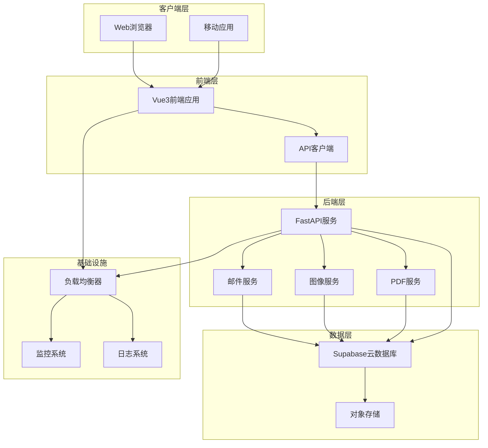

# 部署与维护

<cite>
**本文引用的文件**
- [pyproject.toml](file://backend/pyproject.toml)
- [package.json](file://frontend/package.json)
- [.env.example](file://backend/.env.example)
- [.env.example](file://frontend/.env.example)
- [main.py](file://backend/src/api/main.py)
- [settings.py](file://backend/src/config/settings.py)
- [logger.py](file://backend/src/utils/logger.py)
- [supabase.js](file://frontend/src/utils/supabase.js)
- [api.js](file://frontend/src/utils/api.js)
- [keep_supabase_alive.py](file://backend/scripts/keep_supabase_alive.py)
- [test_supabase_connection.py](file://backend/scripts/test_supabase_connection.py)
- [vite.config.js](file://frontend/vite.config.js)
- [frontend-backend-api.md](file://docs/frontend-backend-api.md)
</cite>

## 更新摘要
**所做更改**
- 新增前后端分离部署架构说明
- 新增Supabase云数据库配置和管理章节
- 新增环境变量管理最佳实践
- 新增健康检查和监控体系
- 新增日志管理和故障排除指南
- 更新部署流程以反映现代化运维要求

## 目录
1. [简介](#简介)
2. [部署架构概览](#部署架构概览)
3. [环境准备](#环境准备)
4. [后端部署](#后端部署)
5. [前端部署](#前端部署)
6. [Supabase数据库配置](#supabase数据库配置)
7. [环境变量管理](#环境变量管理)
8. [健康检查与监控](#健康检查与监控)
9. [日志管理](#日志管理)
10. [备份策略](#备份策略)
11. [故障排除指南](#故障排除指南)
12. [版本升级与维护](#版本升级与维护)
13. [运维最佳实践](#运维最佳实践)

## 简介

ETSY订单自动化系统采用现代化的前后端分离架构，基于FastAPI构建后端API服务，使用Vue3 + Vite构建前端界面，通过Supabase提供云数据库服务。该系统实现了完整的订单自动化处理流程，包括邮件解析、效果图生成、PDF生产文档创建和物流标签打印等功能。

系统支持多环境部署，具备完善的监控、日志和备份机制，适用于生产环境的稳定运行。

## 部署架构概览

系统采用微服务化的前后端分离架构，后端提供RESTful API服务，前端通过API与后端交互，所有数据通过Supabase云数据库进行持久化存储。



**图表来源**
- [main.py](file://backend/src/api/main.py#L22-L36)
- [supabase.js](file://frontend/src/utils/supabase.js#L1-L18)

## 环境准备

### 系统要求

- **操作系统**: Windows 10+/Linux/macOS
- **Python**: 3.10+
- **Node.js**: 16+
- **数据库**: Supabase PostgreSQL (云服务)
- **存储**: Supabase Storage (云存储)

### 依赖安装

#### 后端依赖
```bash
# 进入后端目录
cd backend

# 安装Poetry (如果未安装)
curl -sSL https://install.python-poetry.org | python3 -

# 安装Python依赖
poetry install

# 或使用pip
pip install -r requirements.txt
```

#### 前端依赖
```bash
# 进入前端目录
cd frontend

# 安装npm依赖
npm install
```

**章节来源**
- [pyproject.toml](file://backend/pyproject.toml#L8-L35)
- [package.json](file://frontend/package.json#L11-L25)

## 后端部署

### 开发环境部署

#### 1. 环境配置
```bash
# 复制环境配置文件
cp backend/.env.example backend/.env

# 编辑后端环境变量
vim backend/.env
```

#### 2. 启动开发服务器
```bash
# 进入后端目录
cd backend

# 启动FastAPI开发服务器
poetry run uvicorn src.api.main:app --host 0.0.0.0 --port 8000 --reload
```

#### 3. API端点测试
```bash
# 健康检查
curl http://localhost:8000/health

# 根路径检查
curl http://localhost:8000/

# 效果图生成接口
curl -X POST http://localhost:8000/api/effect-image/generate \
  -H "Content-Type: application/json" \
  -d '{
    "order_id": "TEST001",
    "shape": "bone",
    "color": "G",
    "size": "large",
    "text_front": "测试文字",
    "font_code": "F-01"
  }'
```

### 生产环境部署

#### 1. Docker部署 (推荐)
```dockerfile
# backend/Dockerfile
FROM python:3.10-slim

WORKDIR /app

# 复制依赖文件
COPY backend/pyproject.toml .
COPY backend/poetry.lock .

# 安装Poetry
RUN pip install poetry

# 安装Python依赖
RUN poetry install --no-dev

# 复制应用代码
COPY backend/ .

# 暴露端口
EXPOSE 8000

# 启动命令
CMD ["poetry", "run", "uvicorn", "src.api.main:app", "--host", "0.0.0.0", "--port", "8000"]
```

#### 2. Nginx反向代理配置
```nginx
server {
    listen 80;
    server_name your-domain.com;
    
    location / {
        proxy_pass http://localhost:8000;
        proxy_set_header Host $host;
        proxy_set_header X-Real-IP $remote_addr;
    }
    
    location /api/ {
        proxy_pass http://localhost:8000/api/;
        proxy_set_header Host $host;
        proxy_set_header X-Real-IP $remote_addr;
    }
}
```

**章节来源**
- [main.py](file://backend/src/api/main.py#L69-L78)
- [main.py](file://backend/src/api/main.py#L196-L201)

## 前端部署

### 开发环境部署

#### 1. 环境配置
```bash
# 复制环境配置文件
cp frontend/.env.example frontend/.env

# 编辑前端环境变量
vim frontend/.env
```

#### 2. 启动开发服务器
```bash
# 进入前端目录
cd frontend

# 启动Vite开发服务器
npm run dev
```

#### 3. 浏览器访问
```
http://localhost:5173
```

### 生产环境部署

#### 1. 构建静态文件
```bash
# 进入前端目录
cd frontend

# 构建生产版本
npm run build

# 输出文件位于 dist/ 目录
```

#### 2. 部署到Web服务器
```bash
# 使用Nginx部署
sudo cp -r frontend/dist/* /var/www/html/

# 或使用Apache
sudo cp -r frontend/dist/* /var/www/your-domain.com/
```

#### 3. Vite配置优化
```javascript
// frontend/vite.config.js
import { defineConfig } from 'vite'
import vue from '@vitejs/plugin-vue'

export default defineConfig({
  plugins: [vue()],
  build: {
    outDir: 'dist',
    assetsDir: 'static',
    rollupOptions: {
      output: {
        manualChunks: {
          vendor: ['vue', 'vue-router', 'pinia'],
          ui: ['element-plus', '@element-plus/icons-vue']
        }
      }
    }
  }
})
```

**章节来源**
- [vite.config.js](file://frontend/vite.config.js#L1-L14)
- [api.js](file://frontend/src/utils/api.js#L6-L103)

## Supabase数据库配置

### 数据库初始化

#### 1. 创建Supabase项目
- 访问 [Supabase官网](https://app.supabase.com/)
- 创建新项目并获取项目URL和密钥
- 在项目设置中启用所需的扩展

#### 2. 数据库表结构
系统使用以下核心表结构：

| 表名 | 描述 | 主要字段 |
|------|------|----------|
| orders | 订单主表 | etsy_order_id, customer_name, status, created_at |
| sku_mapping | SKU对照表 | sku_code, material, shape, color, size |
| production_documents | 生产文档表 | effect_svg_url, production_pdf_url, created_at |
| logistics | 物流信息表 | tracking_number, delivery_status, shipped_at |
| email_logs | 邮件发送记录 | email_type, recipient_email, status |

#### 3. 数据库连接配置
```python
# backend/src/config/settings.py
class Settings:
    SUPABASE_URL: str = os.getenv("SUPABASE_URL", "")
    SUPABASE_KEY: str = os.getenv("SUPABASE_KEY", "")
    
    @classmethod
    def validate_supabase(cls) -> bool:
        return bool(cls.SUPABASE_URL and cls.SUPABASE_KEY)
```

### Supabase保活机制

#### 1. 自动保活脚本
```python
# backend/scripts/keep_supabase_alive.py
import os
import schedule
import time
from datetime import datetime
from supabase import create_client

def ping_database():
    """向数据库发送心跳请求"""
    url = os.getenv("SUPABASE_URL")
    key = os.getenv("SUPABASE_KEY")
    
    try:
        supabase = create_client(url, key)
        response = supabase.table("orders").select("id").limit(1).execute()
        print(f"[{datetime.now()}] ✅ Supabase 保活成功")
        return True
    except Exception as e:
        print(f"[{datetime.now()}] ❌ Supabase 保活失败: {e}")
        return False

# 每小时执行一次
schedule.every().hour.do(ping_database)
```

#### 2. 连接测试
```python
# backend/scripts/test_supabase_connection.py
def test_connection():
    """测试Supabase连接"""
    url = os.getenv("SUPABASE_URL")
    key = os.getenv("SUPABASE_KEY")
    
    try:
        supabase = create_client(url, key)
        
        # 测试查询fonts表
        response = supabase.table("fonts").select("*").limit(3).execute()
        
        # 测试查询sku_mapping表
        response = supabase.table("sku_mapping").select("*").limit(3).execute()
        
        print("🎉 Supabase连接测试通过")
        return True
    except Exception as e:
        print(f"❌ 连接失败: {e}")
        return False
```

**章节来源**
- [settings.py](file://backend/src/config/settings.py#L18-L48)
- [keep_supabase_alive.py](file://backend/scripts/keep_supabase_alive.py#L18-L48)
- [test_supabase_connection.py](file://backend/scripts/test_supabase_connection.py#L19-L64)

## 环境变量管理

### 后端环境变量

#### 1. 配置文件结构
```env
# ========================================
# ETSY订单自动化系统 - 环境变量配置
# 复制此文件为 .env 并填入实际值
# ========================================

# ----- QQ邮箱IMAP配置 -----
IMAP_SERVER=imap.qq.com
IMAP_PORT=993
EMAIL_ADDRESS=your-email@qq.com
EMAIL_PASSWORD=your-auth-code

# ----- 数据库配置 -----
DATABASE_URL=sqlite:///./data/orders.db

# ----- 日志配置 -----
LOG_LEVEL=INFO
LOG_FILE=../logs/app.log

# ----- Supabase 数据库配置 -----
SUPABASE_URL=https://your-project.supabase.co
SUPABASE_KEY=your-anon-key

# ----- Etsy API配置 -----
ETSY_API_KEY=your_api_key
ETSY_API_SECRET=your_api_secret

# ----- 物流API配置 -----
SHIPPING_API_KEY=your_shipping_api_key
```

#### 2. 前端环境变量
```env
# ========================================
# 前端环境变量配置
# 复制此文件为 .env 并填入实际值
# ========================================

# ----- Supabase 配置 -----
VITE_SUPABASE_URL=https://your-project.supabase.co
VITE_SUPABASE_KEY=your-anon-public-key
```

### 环境变量验证

#### 1. 后端配置验证
```python
# backend/src/config/settings.py
@classmethod
def validate(cls) -> bool:
    errors = []
    if not cls.EMAIL_ADDRESS:
        errors.append("EMAIL_ADDRESS 未配置")
    if not cls.EMAIL_PASSWORD:
        errors.append("EMAIL_PASSWORD 未配置")
    if not cls.SUPABASE_URL:
        errors.append("SUPABASE_URL 未配置")
    if not cls.SUPABASE_KEY:
        errors.append("SUPABASE_KEY 未配置")
    return len(errors) == 0
```

#### 2. 前端配置验证
```javascript
// frontend/src/utils/supabase.js
const SUPABASE_URL = import.meta.env.VITE_SUPABASE_URL
const SUPABASE_KEY = import.meta.env.VITE_SUPABASE_KEY

if (!SUPABASE_URL || !SUPABASE_KEY) {
  console.error('⚠️ Supabase 配置缺失，请检查 .env 文件')
}
```

**章节来源**
- [.env.example](file://backend/.env.example#L1-L30)
- [.env.example](file://frontend/.env.example#L1-L10)
- [settings.py](file://backend/src/config/settings.py#L28-L44)

## 健康检查与监控

### 健康检查端点

#### 1. API健康检查
```python
# backend/src/api/main.py
@app.get("/health")
async def health_check():
    """健康检查"""
    return {"status": "ok"}
```

#### 2. 前端健康检查
```javascript
// frontend/src/utils/api.js
export async function healthCheck() {
  const response = await fetch(`${API_BASE_URL}/health`)
  return response.json()
}

// 使用示例
healthCheck().then(data => {
  if (data.status === 'ok') {
    console.log('✅ API服务正常')
  }
})
```

### 监控指标

#### 1. 性能监控
```python
# 后端性能监控中间件
from fastapi.middleware.tracing import TracingMiddleware

app.add_middleware(
    TracingMiddleware,
    service_name="etsy-order-automation"
)
```

#### 2. 错误监控
```python
# 异常处理和监控
from fastapi import HTTPException
import sentry_sdk

@app.exception_handler(Exception)
async def global_exception_handler(request, exc):
    sentry_sdk.capture_exception(exc)
    return JSONResponse(
        status_code=500,
        content={"detail": "Internal server error"}
    )
```

### 日志监控集成

#### 1. 结构化日志
```python
# backend/src/utils/logger.py
import json_logging
import sys

def setup_logger(name: str = "etsy_automation") -> logging.Logger:
    logger = logging.getLogger(name)
    
    # 结构化日志处理器
    class StructuredLogHandler(logging.Handler):
        def emit(self, record):
            log_entry = {
                "timestamp": datetime.utcnow().isoformat(),
                "level": record.levelname,
                "service": "etsy-order-automation",
                "message": record.getMessage(),
                "module": record.module,
                "function": record.funcName
            }
            print(json.dumps(log_entry))
    
    structured_handler = StructuredLogHandler()
    logger.addHandler(structured_handler)
    return logger
```

**章节来源**
- [main.py](file://backend/src/api/main.py#L75-L78)
- [api.js](file://frontend/src/utils/api.js#L96-L103)
- [logger.py](file://backend/src/utils/logger.py#L15-L64)

## 日志管理

### 日志配置

#### 1. 后端日志配置
```python
# backend/src/utils/logger.py
import logging
import sys
from pathlib import Path
from datetime import datetime

def setup_logger(name: str = "etsy_automation") -> logging.Logger:
    logger = logging.getLogger(name)
    
    # 避免重复添加处理器
    if logger.handlers:
        return logger
    
    # 设置日志级别
    log_level = getattr(logging, settings.LOG_LEVEL.upper(), logging.INFO)
    logger.setLevel(log_level)
    
    # 日志格式
    formatter = logging.Formatter(
        fmt="%(asctime)s | %(levelname)-8s | %(name)s | %(message)s",
        datefmt="%Y-%m-%d %H:%M:%S"
    )
    
    # 控制台处理器
    console_handler = logging.StreamHandler(sys.stdout)
    console_handler.setLevel(log_level)
    console_handler.setFormatter(formatter)
    logger.addHandler(console_handler)
    
    # 文件处理器
    try:
        log_file = Path(settings.LOG_FILE)
        log_file.parent.mkdir(parents=True, exist_ok=True)
        
        file_handler = logging.FileHandler(
            log_file, 
            mode="a", 
            encoding="utf-8"
        )
        file_handler.setLevel(log_level)
        file_handler.setFormatter(formatter)
        logger.addHandler(file_handler)
    except Exception as e:
        logger.warning(f"无法创建日志文件: {e}")
    
    return logger
```

#### 2. 日志轮转
```python
# 日志轮转配置
from logging.handlers import RotatingFileHandler

# 创建轮转文件处理器
file_handler = RotatingFileHandler(
    log_file, 
    maxBytes=10*1024*1024,  # 10MB
    backupCount=5
)
file_handler.setFormatter(formatter)
logger.addHandler(file_handler)
```

### 日志分析

#### 1. 日志聚合
```bash
# 使用logrotate进行日志轮转
# /etc/logrotate.d/etsy-order-automation

/var/log/etsy-order-automation/*.log {
    daily
    missingok
    rotate 52
    compress
    delaycompress
    notifempty
    create 644 www-data www-data
}
```

#### 2. 日志监控
```python
# 实时日志监控
import subprocess
import time

def monitor_logs():
    """实时监控日志文件"""
    process = subprocess.Popen(
        ['tail', '-f', 'logs/app.log'],
        stdout=subprocess.PIPE,
        stderr=subprocess.PIPE,
        universal_newlines=True
    )
    
    for line in iter(process.stdout.readline, ''):
        if 'ERROR' in line:
            # 发送告警通知
            send_alert(line)
        print(line.strip())
```

**章节来源**
- [logger.py](file://backend/src/utils/logger.py#L15-L64)

## 备份策略

### 数据备份

#### 1. Supabase数据库备份
```bash
# 使用pg_dump进行数据库备份
pg_dump -h your-supabase-url.supabase.co \
  -U postgres \
  -W \
  -d your-database-name \
  > backup_$(date +%Y%m%d_%H%M%S).sql

# 自动备份脚本
#!/bin/bash
# backup_supabase.sh

TIMESTAMP=$(date +%Y%m%d_%H%M%S)
BACKUP_FILE="supabase_backup_${TIMESTAMP}.sql"

pg_dump -h ${SUPABASE_HOST} \
  -U ${SUPABASE_USER} \
  -d ${SUPABASE_DB} \
  > ${BACKUP_FILE}

# 上传到云存储
aws s3 cp ${BACKUP_FILE} s3://your-backup-bucket/ --expires $(date -d "+7 days" -u)

echo "备份完成: ${BACKUP_FILE}"
```

#### 2. 文件备份
```python
# 备份生成的文件
import shutil
from datetime import datetime

def backup_generated_files():
    """备份生成的效果图和PDF文件"""
    timestamp = datetime.now().strftime("%Y%m%d_%H%M%S")
    backup_dir = f"backup_{timestamp}"
    
    # 复制输出目录
    shutil.copytree(
        "backend/output",
        f"backup/{backup_dir}/output"
    )
    
    # 复制资产文件
    shutil.copytree(
        "backend/assets",
        f"backup/{backup_dir}/assets"
    )
    
    return backup_dir
```

### 备份验证

#### 1. 备份完整性检查
```python
def verify_backup_integrity(backup_dir):
    """验证备份文件完整性"""
    try:
        # 检查关键文件是否存在
        required_files = [
            f"{backup_dir}/output/",
            f"{backup_dir}/assets/",
            f"{backup_dir}/logs/"
        ]
        
        for file_path in required_files:
            if not os.path.exists(file_path):
                return False, f"缺少文件: {file_path}"
        
        return True, "备份验证通过"
    except Exception as e:
        return False, f"验证失败: {str(e)}"
```

#### 2. 备份恢复测试
```python
def test_backup_restore(backup_dir):
    """测试备份恢复"""
    try:
        # 创建测试环境
        test_env = f"test_restore_{datetime.now().strftime('%Y%m%d_%H%M%S')}"
        os.makedirs(test_env)
        
        # 恢复备份
        shutil.copytree(f"{backup_dir}/output", f"{test_env}/output")
        
        # 验证恢复的数据
        restored_files = os.listdir(f"{test_env}/output")
        
        if len(restored_files) > 0:
            return True, f"恢复测试通过，找到 {len(restored_files)} 个文件"
        else:
            return False, "恢复测试失败，没有找到恢复的文件"
            
    except Exception as e:
        return False, f"恢复测试失败: {str(e)}"
```

**章节来源**
- [keep_supabase_alive.py](file://backend/scripts/keep_supabase_alive.py#L18-L48)

## 故障排除指南

### 常见部署问题

#### 1. 端口占用问题
**症状**: 服务启动失败，提示端口已被占用
**解决方案**:
```bash
# 检查端口占用
netstat -ano | findstr :8000

# 杀死占用进程
taskkill /PID <进程ID> /F

# 或者修改端口号
export PORT=8001
```

#### 2. 依赖安装失败
**症状**: Poetry安装依赖时报错
**解决方案**:
```bash
# 清理缓存
poetry cache clear pypi

# 更新pip
python -m pip install --upgrade pip

# 使用国内镜像源
poetry config repositories.test https://pypi.tuna.tsinghua.edu.cn/simple/
poetry config virtualenvs.prefer-active-python true
```

#### 3. 环境变量配置错误
**症状**: 应用启动但功能异常
**解决方案**:
```bash
# 验证环境变量
echo $SUPABASE_URL
echo $SUPABASE_KEY

# 检查.env文件权限
chmod 600 backend/.env
chmod 600 frontend/.env
```

### 数据库连接问题

#### 1. Supabase连接失败
**症状**: 数据库连接超时或认证失败
**诊断步骤**:
```bash
# 测试数据库连接
python backend/scripts/test_supabase_connection.py

# 检查网络连接
ping your-supabase-url.supabase.co

# 验证防火墙设置
telnet your-supabase-url.supabase.co 5432
```

#### 2. 数据库保活问题
**症状**: 项目长时间不活动被暂停
**解决方案**:
```bash
# 启用保活脚本
crontab -e

# 添加定时任务
0 */1 * * * /usr/bin/python3 /path/to/keep_supabase_alive.py

# 或使用Windows计划任务
# 每小时执行一次
```

### 前端问题

#### 1. API调用失败
**症状**: 前端无法连接后端API
**诊断方法**:
```javascript
// 检查API连接
fetch('http://localhost:8000/health')
  .then(response => response.json())
  .then(data => console.log('API状态:', data))
  .catch(error => console.error('连接失败:', error))

// 检查CORS配置
// 确保后端允许前端域名
```

#### 2. 环境变量加载失败
**症状**: Supabase配置缺失警告
**解决方案**:
```bash
# 检查Vite环境变量
echo $VITE_SUPABASE_URL
echo $VITE_SUPABASE_KEY

# 确保使用VITE_前缀
# Vite只暴露以VITE_开头的环境变量
```

### 性能问题

#### 1. 响应时间过长
**症状**: API响应缓慢
**优化方案**:
```python
# 启用Gzip压缩
from starlette.middleware.gzip import GZipMiddleware

app.add_middleware(GZipMiddleware, minimum_size=1000)

# 添加缓存中间件
from starlette.middleware.cache import CacheControlMiddleware

app.add_middleware(CacheControlMiddleware, cachecontrol="public, max-age=31536000")
```

#### 2. 内存泄漏
**症状**: 服务运行时间越长内存占用越高
**诊断方法**:
```python
import psutil
import os

def check_memory_usage():
    """检查内存使用情况"""
    process = psutil.Process(os.getpid())
    memory_info = process.memory_info()
    print(f"RSS: {memory_info.rss / 1024 / 1024:.2f} MB")
    print(f"VMS: {memory_info.vms / 1024 / 1024:.2f} MB")

# 定期监控内存使用
import threading
timer = threading.Timer(60.0, check_memory_usage)
timer.daemon = True
timer.start()
```

**章节来源**
- [main.py](file://backend/src/api/main.py#L29-L36)
- [supabase.js](file://frontend/src/utils/supabase.js#L7-L10)
- [test_supabase_connection.py](file://backend/scripts/test_supabase_connection.py#L29-L31)

## 版本升级与维护

### 依赖更新

#### 1. 后端依赖更新
```bash
# 更新Poetry依赖
poetry update

# 更新特定包
poetry update requests fastapi

# 检查安全漏洞
poetry run safety check
```

#### 2. 前端依赖更新
```bash
# 更新npm包
npm update

# 检查过时包
npm outdated

# 更新到最新版本
npm install package-name@latest
```

### 数据库迁移

#### 1. Supabase迁移
```sql
-- 示例: 添加新字段
ALTER TABLE orders 
ADD COLUMN IF NOT EXISTS priority VARCHAR(10) DEFAULT 'normal';

-- 示例: 修改字段类型
ALTER TABLE orders 
ALTER COLUMN estimated_delivery TYPE TIMESTAMP WITH TIME ZONE;

-- 示例: 创建索引
CREATE INDEX IF NOT EXISTS idx_orders_status_created_at 
ON orders(status, created_at DESC);
```

#### 2. 迁移脚本
```python
# 数据库迁移脚本
import os
from supabase import create_client

def migrate_database():
    """执行数据库迁移"""
    url = os.getenv("SUPABASE_URL")
    key = os.getenv("SUPABASE_KEY")
    
    supabase = create_client(url, key)
    
    # 执行迁移SQL
    migrations = [
        "ALTER TABLE orders ADD COLUMN priority VARCHAR(10) DEFAULT 'normal'",
        "CREATE INDEX IF NOT EXISTS idx_orders_status_created_at ON orders(status, created_at DESC)"
    ]
    
    for migration in migrations:
        try:
            supabase.rpc('execute_sql', {'sql': migration}).execute()
            print(f"✅ 迁移执行成功: {migration}")
        except Exception as e:
            print(f"❌ 迁移失败: {e}")

if __name__ == "__main__":
    migrate_database()
```

### 系统维护

#### 1. 定期维护任务
```bash
#!/bin/bash
# system_maintenance.sh

echo "开始系统维护..."

# 清理日志文件
find /var/log/etsy-order-automation -name "*.log" -mtime +7 -delete

# 清理临时文件
find /tmp -name "etsy-*" -mtime +1 -delete

# 更新系统
apt-get update && apt-get upgrade -y

# 重启服务
systemctl restart etsy-order-automation

echo "系统维护完成"
```

#### 2. 性能优化
```python
# 连接池配置
from sqlalchemy import create_engine
from sqlalchemy.pool import QueuePool

engine = create_engine(
    DATABASE_URL,
    poolclass=QueuePool,
    pool_size=10,
    max_overflow=20,
    pool_recycle=3600,
    pool_pre_ping=True
)

# 异步任务队列
import asyncio
from concurrent.futures import ThreadPoolExecutor

executor = ThreadPoolExecutor(max_workers=4)

async def async_task(func, *args):
    loop = asyncio.get_event_loop()
    return await loop.run_in_executor(executor, func, *args)
```

**章节来源**
- [pyproject.toml](file://backend/pyproject.toml#L37-L48)
- [package.json](file://frontend/package.json#L22-L25)

## 运维最佳实践

### 安全配置

#### 1. 环境变量安全
```bash
# 使用dotenv文件管理敏感信息
# .env.production
export SUPABASE_URL="https://your-production-url.supabase.co"
export SUPABASE_KEY="your-production-key"
export EMAIL_PASSWORD="your-secure-password"

# 设置文件权限
chmod 600 .env.production
chown root:root .env.production
```

#### 2. API安全
```python
# 添加API密钥验证
from fastapi.security import HTTPBearer

security = HTTPBearer()

@app.post("/api/secure-endpoint", dependencies=[Depends(security)])
async def secure_endpoint():
    # 需要有效令牌才能访问
    pass
```

### 监控告警

#### 1. 健康监控
```python
# 健康检查端点
@app.get("/health")
async def health_check():
    """综合健康检查"""
    checks = {
        "database": check_database_health(),
        "storage": check_storage_health(),
        "email": check_email_health(),
        "supabase": check_supabase_health()
    }
    
    overall_status = all(checks.values())
    
    return {
        "status": "healthy" if overall_status else "unhealthy",
        "checks": checks,
        "timestamp": datetime.utcnow().isoformat()
    }

def check_supabase_health():
    """检查Supabase连接"""
    try:
        supabase = create_client(SUPABASE_URL, SUPABASE_KEY)
        supabase.rpc('get_version').execute()
        return True
    except:
        return False
```

#### 2. 告警配置
```python
# Slack告警集成
import requests

def send_slack_alert(message):
    """发送Slack告警"""
    webhook_url = os.getenv("SLACK_WEBHOOK_URL")
    
    if webhook_url:
        payload = {
            "text": "⚠️ ETSY订单自动化系统告警",
            "attachments": [
                {
                    "color": "danger",
                    "fields": [
                        {
                            "title": "服务状态",
                            "value": message,
                            "short": False
                        }
                    ]
                }
            ]
        }
        
        requests.post(webhook_url, json=payload)
```

### 备份最佳实践

#### 1. 多层次备份
```python
# 多层次备份策略
class BackupManager:
    def __init__(self):
        self.backup_configs = {
            "daily": {"interval": "daily", "retention": 30},
            "weekly": {"interval": "weekly", "retention": 12},
            "monthly": {"interval": "monthly", "retention": 12}
        }
    
    def create_backup(self, backup_type):
        """创建指定类型的备份"""
        timestamp = datetime.now().strftime("%Y%m%d_%H%M%S")
        backup_name = f"{backup_type}_backup_{timestamp}"
        
        # 数据库备份
        self.backup_database(backup_name)
        
        # 文件备份
        self.backup_files(backup_name)
        
        # 配置备份
        self.backup_config(backup_name)
        
        return backup_name
```

#### 2. 备份验证
```python
def validate_backup(backup_path):
    """验证备份完整性"""
    validation_results = {
        "database": self.validate_database_backup(backup_path),
        "files": self.validate_file_backup(backup_path),
        "config": self.validate_config_backup(backup_path)
    }
    
    return all(validation_results.values()), validation_results
```

### 性能优化

#### 1. 缓存策略
```python
# Redis缓存配置
import redis
import json

redis_client = redis.Redis(
    host='localhost',
    port=6379,
    db=0,
    decode_responses=True
)

def get_cached_data(key):
    """获取缓存数据"""
    cached = redis_client.get(key)
    if cached:
        return json.loads(cached)
    return None

def set_cache_data(key, data, expire=3600):
    """设置缓存数据"""
    redis_client.setex(
        key,
        expire,
        json.dumps(data)
    )
```

#### 2. 异步处理
```python
# Celery异步任务
from celery import Celery

celery_app = Celery('etsy_tasks')

@celery_app.task(bind=True)
def process_order_async(self, order_id):
    """异步处理订单"""
    try:
        # 处理订单逻辑
        result = process_order(order_id)
        
        # 更新进度
        self.update_state(state='PROGRESS', meta={'status': 'processing'})
        
        return result
    except Exception as exc:
        # 处理异常
        self.update_state(state='FAILURE', meta={'status': 'failed'})
        raise exc
```

### 文档维护

#### 1. 技术文档更新
```markdown
# ETSY订单自动化系统运维手册

## 版本历史
- v1.0.0 (2026-01-01): 初始版本
- v1.1.0 (2026-02-01): 添加Supabase支持
- v1.2.0 (2026-02-15): 优化性能和监控

## 部署要求
- Python 3.10+
- Node.js 16+
- Supabase账户
- 2GB RAM (推荐4GB)

## 维护计划
- 每日: 健康检查和日志分析
- 每周: 数据库备份和依赖更新
- 每月: 性能优化和安全审计
```

#### 2. 变更日志
```markdown
# 变更日志

## 2026-02-15
### 新功能
- 添加Supabase云数据库支持
- 实现前后端分离架构
- 增强日志监控功能

### 修复
- 修正环境变量加载问题
- 优化API响应时间
- 改进错误处理机制

### 改进
- 更新依赖到最新版本
- 增强安全配置
- 优化数据库查询性能
```

**章节来源**
- [settings.py](file://backend/src/config/settings.py#L28-L44)
- [logger.py](file://backend/src/utils/logger.py#L15-L64)
- [frontend-backend-api.md](file://docs/frontend-backend-api.md#L280-L312)