# Git备份规则

<cite>
**本文引用的文件**
- [Git备份规则.md](file://docs/Git备份规则.md)
- [.gitignore](file://.gitignore)
- [.qoderignore](file://.qoderignore)
- [pyproject.toml](file://backend/pyproject.toml)
- [package.json](file://frontend/package.json)
- [openapi.yaml](file://docs/openapi.yaml)
- [开发文档-页面状态按钮-v1.0.md](file://docs/开发文档-页面状态按钮-v1.0.md)
- [API与OpenAPI对照-v0.3.md](file://docs/API与OpenAPI对照-v0.3.md)
- [order.py](file://backend/src/models/order.py)
- [order_service.py](file://backend/src/services/order_service.py)
- [fetch_new_order.py](file://backend/scripts/fetch_new_order.py)
- [process_today_order.py](file://backend/scripts/process_today_order.py)
- [main.js](file://frontend/src/main.js)
- [App.vue](file://frontend/src/App.vue)
</cite>

## 目录
1. [简介](#简介)
2. [项目结构](#项目结构)
3. [核心组件](#核心组件)
4. [架构概览](#架构概览)
5. [详细组件分析](#详细组件分析)
6. [依赖分析](#依赖分析)
7. [性能考虑](#性能考虑)
8. [故障排除指南](#故障排除指南)
9. [结论](#结论)

## 简介

本文档基于ETSY订单自动化系统的Git备份规则，提供了一套完整的版本控制和备份管理策略。该系统是一个前后端分离的订单自动化处理平台，主要功能包括自动读取邮件、解析订单、生成效果图和物流标签等。

系统采用现代化的技术栈，后端使用Python 3.10和FastAPI框架，前端使用Vue 3和Element Plus，数据库采用Supabase。整个项目遵循严格的Git工作流程和版本管理规范，确保代码质量和团队协作效率。

## 项目结构

ETSY订单自动化项目采用清晰的分层架构，主要包含以下核心目录：

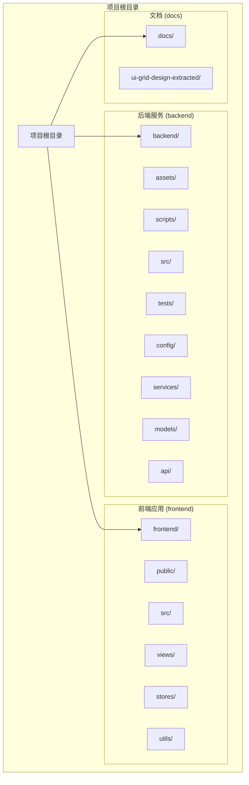

**图表来源**
- [Git备份规则.md:1-195](file://docs/Git备份规则.md#L1-L195)

### 目录组织原则

1. **按功能模块划分**：每个主要功能领域都有独立的目录结构
2. **前后端分离**：前端和后端代码完全隔离，便于独立开发和部署
3. **资源分类管理**：资产文件、脚本文件、测试文件等都有专门的存放位置
4. **文档标准化**：所有技术文档都集中在docs目录下统一管理

**章节来源**
- [Git备份规则.md:1-195](file://docs/Git备份规则.md#L1-L195)

## 核心组件

### 版本控制系统

系统采用Git作为主要的版本控制工具，遵循严格的分支管理和提交规范：

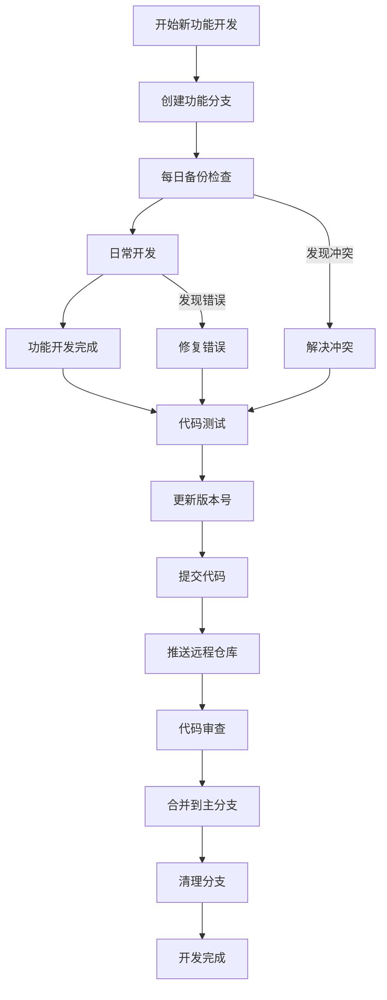

**图表来源**
- [Git备份规则.md:55-90](file://docs/Git备份规则.md#L55-L90)

### 版本号管理

系统采用统一的版本号格式，确保版本管理的一致性和可追溯性：

| 版本号组成部分 | 格式定义 | 示例 | 用途说明 |
|---------------|----------|------|----------|
| 大版本号 | V{大版本}.0 | V1.0、V2.0、V3.0 | 重大功能升级标识 |
| 小版本号 | {小版本}_{日期} | V1.05_20260327 | 功能迭代和日期标识 |
| 日期格式 | YYYYMMDD | 20260327 | 提交当天的具体日期 |

**章节来源**
- [Git备份规则.md:8-31](file://docs/Git备份规则.md#L8-L31)

### 备份时机策略

系统制定了明确的备份时机，确保代码安全和开发连续性：

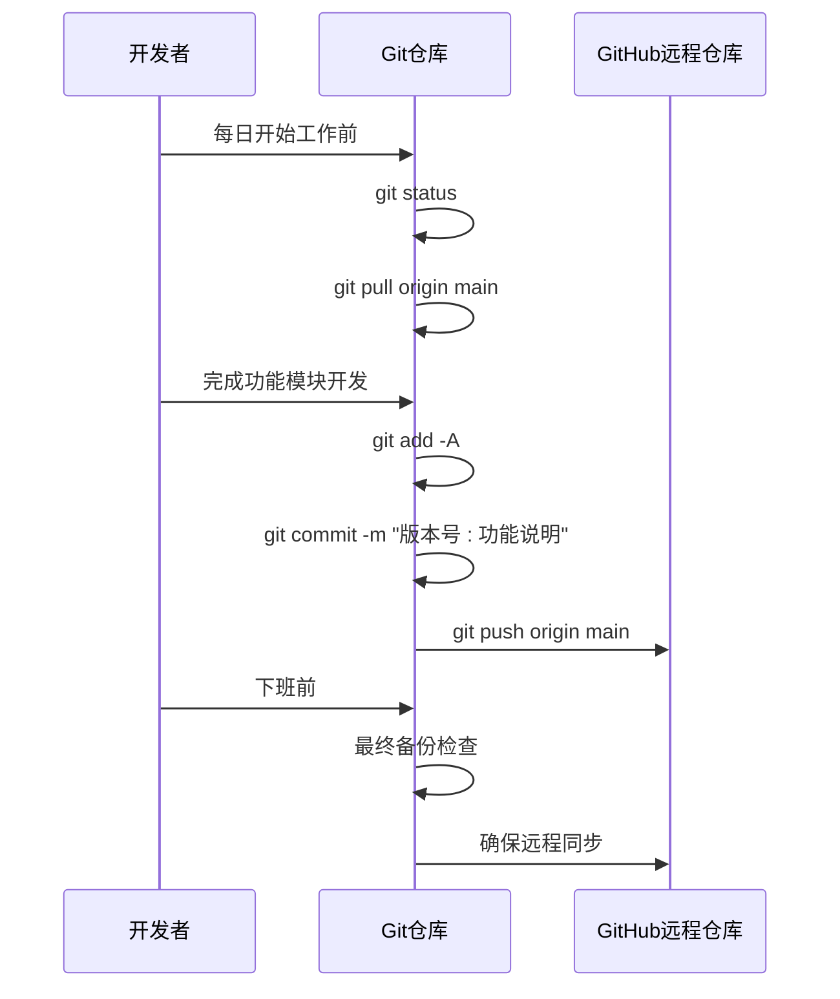

**图表来源**
- [Git备份规则.md:57-81](file://docs/Git备份规则.md#L57-L81)

**章节来源**
- [Git备份规则.md:34-51](file://docs/Git备份规则.md#L34-L51)

## 架构概览

### 技术栈架构

系统采用现代化的全栈技术架构，确保高性能和可扩展性：

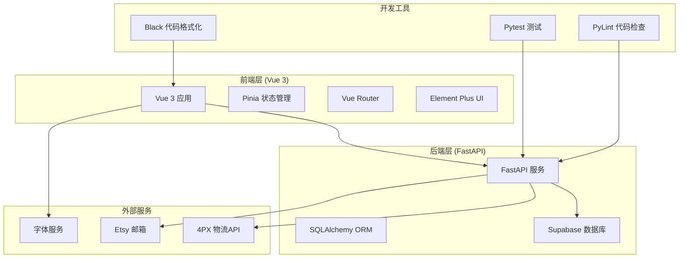

**图表来源**
- [pyproject.toml:1-69](file://backend/pyproject.toml#L1-L69)
- [package.json:1-31](file://frontend/package.json#L1-L31)

### 数据流架构

系统的核心数据流包括订单处理、效果图生成、邮件发送和物流管理等模块：

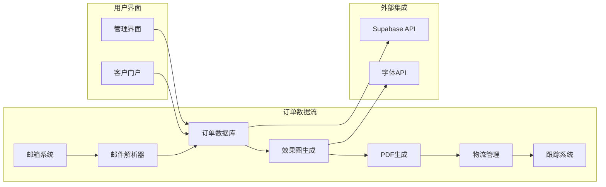

**图表来源**
- [order.py:23-102](file://backend/src/models/order.py#L23-L102)
- [order_service.py:91-145](file://backend/src/services/order_service.py#L91-L145)

**章节来源**
- [pyproject.toml:8-35](file://backend/pyproject.toml#L8-L35)
- [package.json:11-29](file://frontend/package.json#L11-L29)

## 详细组件分析

### 订单管理系统

订单管理系统是整个ETSY自动化系统的核心，负责处理从订单创建到完成的全流程：

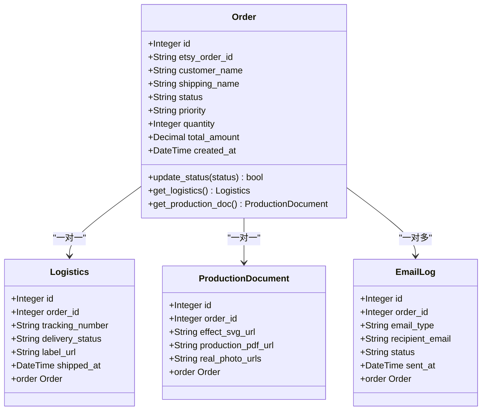

**图表来源**
- [order.py:23-244](file://backend/src/models/order.py#L23-L244)

#### 订单状态管理

系统采用严格的状态管理机制，确保订单处理流程的可控性和可追溯性：

| 状态值 | 含义 | 业务含义 | 快照规则 |
|--------|------|----------|----------|
| `new` | 新订单 | 刚抓取，尚未处理 | 不入正式文档 |
| `pending` | 待确认 | 等待客户确认效果图 | 不入正式文档 |
| `effect_sent` | 效果图已发送 | 已发客户，等待确认 | 不入正式文档 |
| `confirmed` | 已确认 | 客户已确认效果图，等待下物流 | 设计快照入文档 |
| `producing` | 生产中 | 已下物流，进入生产环节 | 生产文档入物流区块 |
| `shipped` | 已发货 | 物流已发出 | 物流区块入文档 |
| `delivered` | 已送达 | 客户签收 | 按归档处理 |
| `cancelled` | 已取消 | 订单取消 | 按归档处理 |

**章节来源**
- [order.py:27-41](file://backend/src/models/order.py#L27-L41)
- [开发文档-页面状态按钮-v1.0.md:9-24](file://docs/开发文档-页面状态按钮-v1.0.md#L9-L24)

### 邮件处理系统

邮件处理系统负责自动抓取和解析Etsy订单邮件，实现订单的自动化导入：

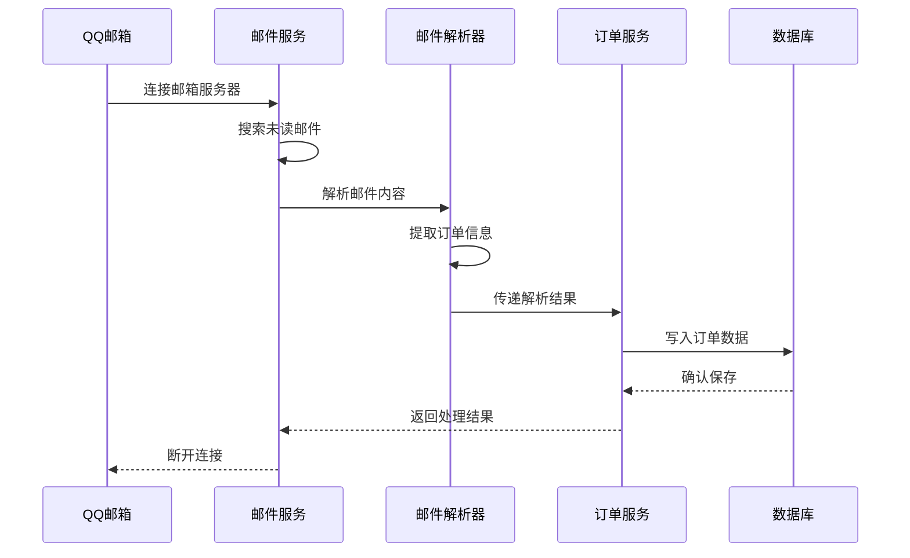

**图表来源**
- [fetch_new_order.py:39-125](file://backend/scripts/fetch_new_order.py#L39-L125)

#### 邮件解析流程

系统实现了完整的邮件解析流程，能够准确提取订单的关键信息：

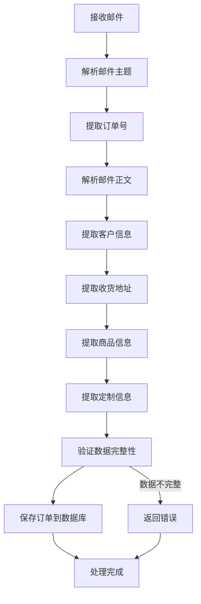

**图表来源**
- [process_today_order.py:45-144](file://backend/scripts/process_today_order.py#L45-L144)

**章节来源**
- [fetch_new_order.py:39-125](file://backend/scripts/fetch_new_order.py#L39-L125)
- [process_today_order.py:147-220](file://backend/scripts/process_today_order.py#L147-L220)

### 物流管理系统

物流管理系统集成了4PX物流API，实现订单的自动化物流处理：

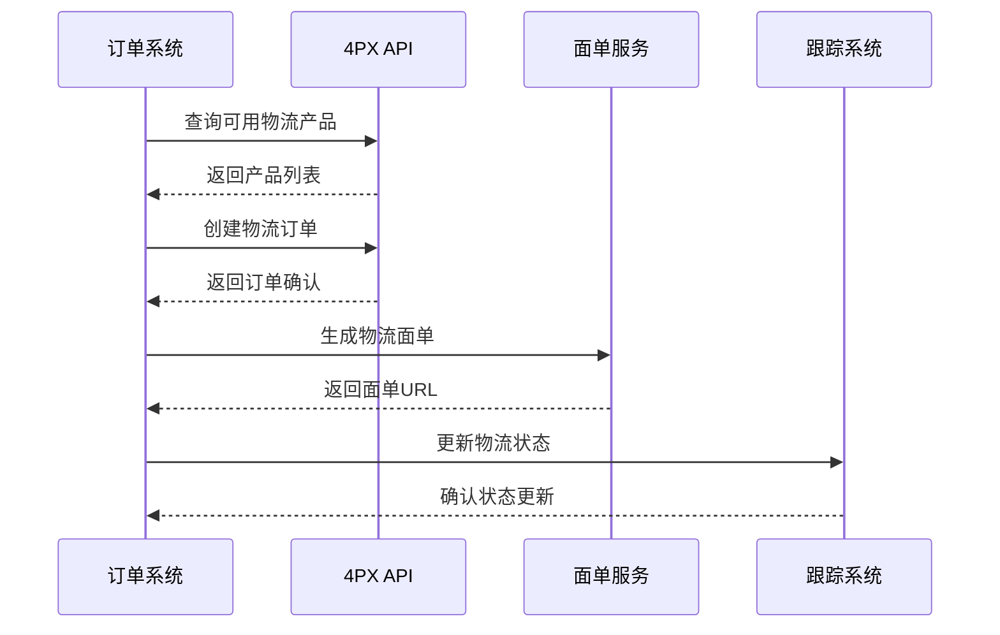

**图表来源**
- [process_today_order.py:249-358](file://backend/scripts/process_today_order.py#L249-L358)

#### 物流API集成

系统通过4PX API实现完整的物流管理功能：

| API方法 | 功能描述 | 请求参数 | 返回结果 |
|---------|----------|----------|----------|
| `ds.xms.logistics_product.getlist` | 查询可用物流产品 | 国家代码、邮编、运输方式 | 物流产品列表 |
| `ds.xms.order.create` | 创建物流订单 | 订单详细信息 | 订单确认信息 |
| `ds.xms.label.get` | 获取物流面单 | 追踪号码、面单类型 | 面单URL |

**章节来源**
- [process_today_order.py:222-247](file://backend/scripts/process_today_order.py#L222-L247)
- [process_today_order.py:249-358](file://backend/scripts/process_today_order.py#L249-L358)

### 前端应用架构

前端应用采用Vue 3 Composition API和Element Plus组件库，提供现代化的用户界面：

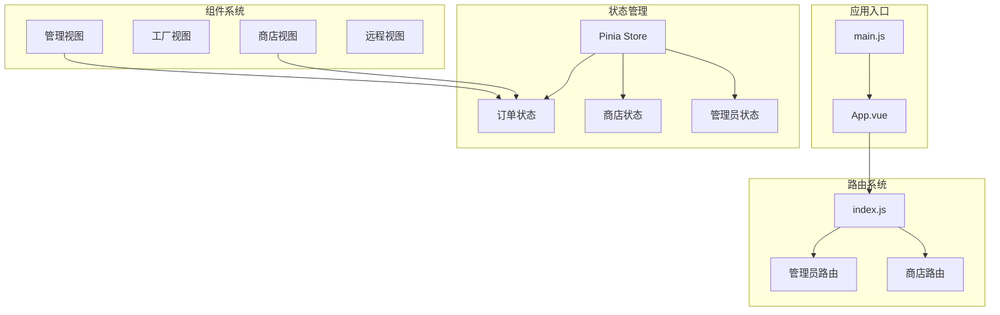

**图表来源**
- [main.js:1-24](file://frontend/src/main.js#L1-L24)
- [App.vue:1-15](file://frontend/src/App.vue#L1-L15)

**章节来源**
- [main.js:1-24](file://frontend/src/main.js#L1-L24)
- [App.vue:1-15](file://frontend/src/App.vue#L1-L15)

## 依赖分析

### 后端依赖管理

系统使用Poetry进行依赖管理，确保开发环境的一致性和可重现性：

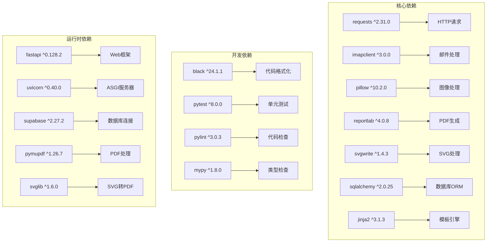

**图表来源**
- [pyproject.toml:8-48](file://backend/pyproject.toml#L8-L48)

### 前端依赖管理

前端使用npm包管理器，集成现代化的构建工具链：

```mermaid
graph TB
subgraph "核心依赖"
Vue[vue ^3.5.24] --> 响应式框架
VueRouter[vue-router ^4.6.4] --> 路由管理
Pinia[pinia ^3.0.4] --> 状态管理
ElementPlus[element-plus ^2.13.2] --> UI组件库
Axios[axios ^1.13.4] --> HTTP客户端
end
subgraph "开发工具"
Vite[vite ^7.2.4] --> 构建工具
TailwindCSS[tailwindcss ^4.2.1] --> CSS框架
PostCSS[autoprefixer ^10.4.27] --> CSS后处理器
PluginVue[@vitejs/plugin-vue ^6.0.1] --> Vue插件
end
subgraph "第三方库"
DayJS[dayjs ^1.11.19] --> 日期处理
Icons[lucide-vue-next ^0.563.0] --> 图标库
SupabaseJS[@supabase/supabase-js ^2.93.3] --> 数据库客户端
end
```

**图表来源**
- [package.json:11-29](file://frontend/package.json#L11-L29)

**章节来源**
- [pyproject.toml:1-69](file://backend/pyproject.toml#L1-L69)
- [package.json:1-31](file://frontend/package.json#L1-L31)

### 文件忽略配置

系统采用多层次的文件忽略策略，确保版本控制的整洁性和性能优化：

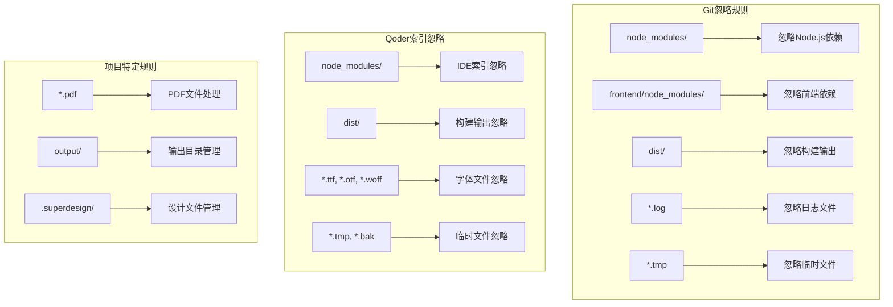

**图表来源**
- [.gitignore:1-100](file://.gitignore#L1-L100)
- [.qoderignore:1-30](file://.qoderignore#L1-L30)

**章节来源**
- [.gitignore:1-100](file://.gitignore#L1-L100)
- [.qoderignore:1-30](file://.qoderignore#L1-L30)

## 性能考虑

### 开发环境优化

系统通过合理的文件忽略配置和依赖管理，确保开发环境的高性能：

1. **IDE性能优化**：Qoder索引忽略大型依赖包和构建输出，提升IDE响应速度
2. **版本控制效率**：Git忽略规则减少不必要的文件跟踪，提高Git操作性能
3. **构建优化**：前端使用Vite进行快速开发构建，支持热重载和模块联邦

### 数据库性能

订单管理系统采用优化的数据库设计和查询策略：

1. **索引优化**：关键字段建立适当索引，提高查询性能
2. **连接池管理**：合理配置数据库连接池，避免连接泄漏
3. **事务管理**：使用事务确保数据一致性，同时避免长时间锁定

### API性能

后端API服务采用异步处理和缓存策略：

1. **异步处理**：长耗时任务使用异步处理，避免阻塞主线程
2. **缓存策略**：常用数据使用缓存，减少数据库访问
3. **并发控制**：合理控制并发请求，避免系统过载

## 故障排除指南

### 常见Git问题

#### 版本号冲突

当多个开发者同时修改版本号时可能出现冲突：

```bash
# 检查当前版本号
git log --oneline -10

# 如果需要修正版本号
git commit --amend -m "POD V1.06_20260328: 修正版本号"

# 强制推送（谨慎使用）
git push origin main --force-with-lease
```

#### 分支合并冲突

当功能分支与主分支产生冲突时：

```bash
# 拉取最新代码
git pull origin main

# 手动解决冲突文件
# 使用IDE或命令行编辑器解决冲突

# 添加解决后的文件
git add .

# 完成分支合并
git commit -m "解决合并冲突"

# 推送合并结果
git push origin feature_branch
```

#### 提交历史清理

当需要清理提交历史时：

```bash
# 查看提交历史
git log --oneline

# 软回退（保留工作区修改）
git reset --soft HEAD~1

# 硬回退（完全撤销）
git reset --hard HEAD~n

# 交互式变基（整理提交历史）
git rebase -i HEAD~n
```

**章节来源**
- [Git备份规则.md:142-170](file://docs/Git备份规则.md#L142-L170)

### 系统集成问题

#### 邮件解析失败

当邮件解析出现问题时：

1. **检查邮箱配置**：确认IMAP服务器设置和认证信息
2. **验证邮件格式**：确保Etsy邮件格式符合预期
3. **查看解析日志**：检查邮件解析器的错误输出

#### 物流API调用失败

当4PX API调用失败时：

1. **检查API密钥**：确认app_key和app_secret配置正确
2. **验证网络连接**：确保能够访问4PX API服务
3. **查看错误响应**：分析API返回的错误信息

#### 数据库连接问题

当数据库连接失败时：

1. **检查连接字符串**：确认DATABASE_URL配置正确
2. **验证网络连通性**：确保能够访问Supabase服务
3. **查看连接池状态**：监控数据库连接池使用情况

**章节来源**
- [fetch_new_order.py:13-34](file://backend/scripts/fetch_new_order.py#L13-L34)
- [process_today_order.py:222-247](file://backend/scripts/process_today_order.py#L222-L247)

## 结论

ETSY订单自动化系统的Git备份规则提供了一套完整的版本控制和项目管理方案。通过严格的版本号管理、明确的备份时机、规范的提交流程和完善的冲突处理机制，确保了项目的稳定发展和团队协作效率。

系统的技术架构采用了现代化的全栈技术栈，前后端分离的设计模式，以及完善的依赖管理体系，为项目的长期发展奠定了坚实基础。同时，通过合理的性能优化和故障排除策略，确保了系统的高效运行和稳定性。

这套Git备份规则不仅适用于当前项目，也可以作为其他类似项目的参考模板，帮助团队建立规范化的版本控制和项目管理流程。通过持续的实践和完善，相信ETSY订单自动化系统能够更好地服务于业务需求，提升运营效率和客户满意度。