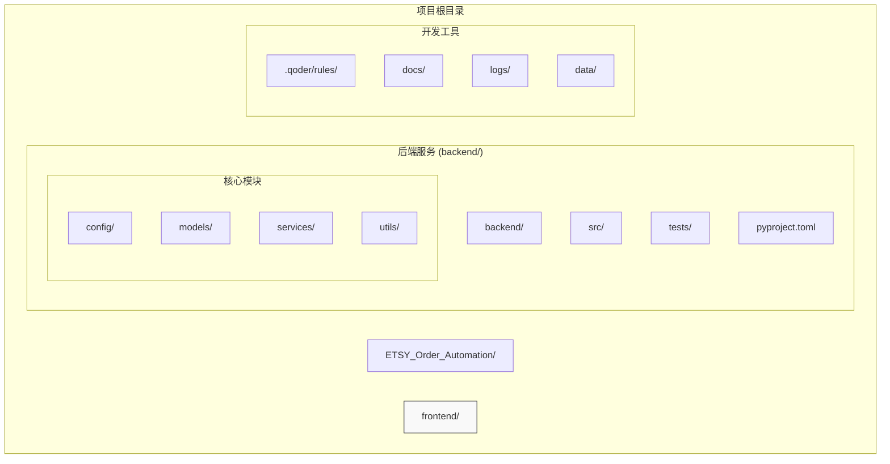
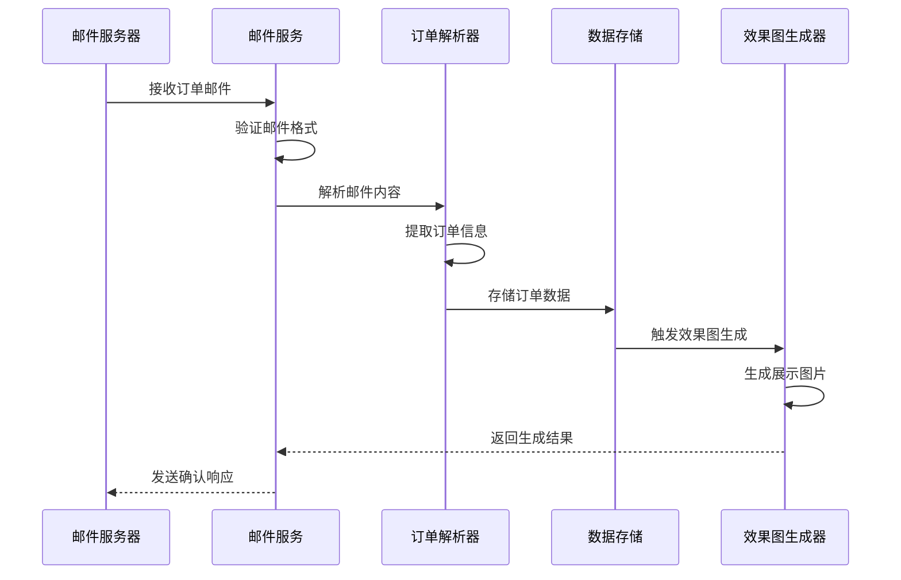
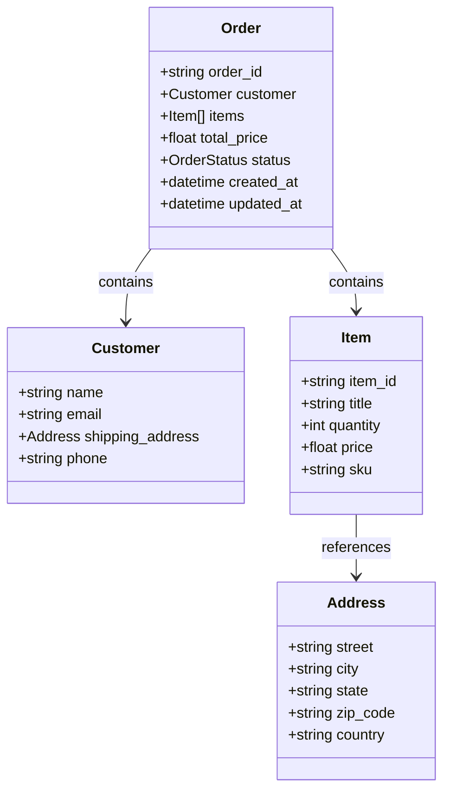
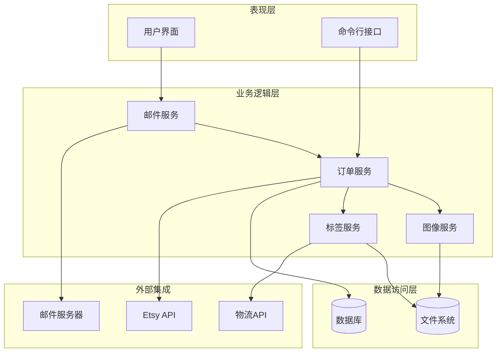
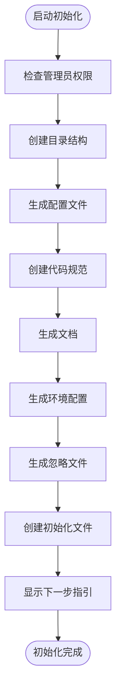
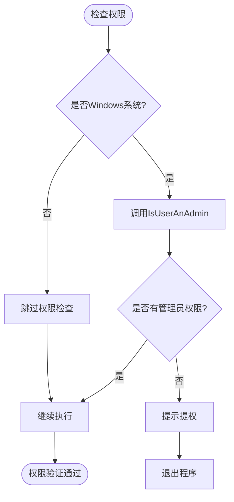
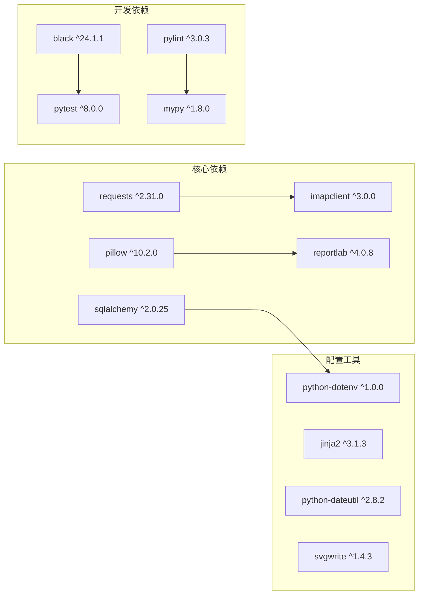
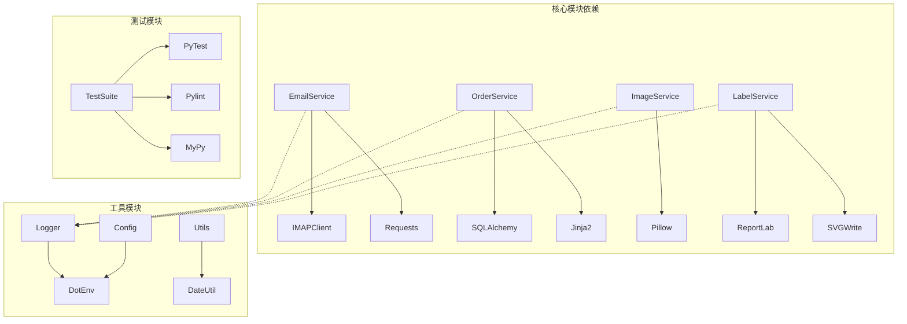

# 项目概述

<cite>
**本文档引用的文件**
- [init_project.py](file://init_project.py)
</cite>

## 目录
1. [引言](#引言)
2. [项目结构](#项目结构)
3. [核心组件](#核心组件)
4. [架构概览](#架构概览)
5. [详细组件分析](#详细组件分析)
6. [依赖关系分析](#依赖关系分析)
7. [性能考虑](#性能考虑)
8. [故障排除指南](#故障排除指南)
9. [结论](#结论)

## 引言

ETSY订单自动化系统是一个专为Etsy平台卖家设计的自动化订单处理解决方案。该系统旨在帮助卖家自动化处理从订单邮件接收、订单数据解析、效果图生成到物流标签制作的完整订单流程，从而显著提高运营效率并减少人工操作成本。

### 系统核心目标

- **自动化订单处理**：实现从邮件接收订单到最终发货的全流程自动化
- **多格式支持**：支持多种订单格式和数据源的统一处理
- **高效数据处理**：通过批处理和缓存机制提升处理速度
- **可扩展架构**：模块化设计便于功能扩展和维护

### 主要功能特性

系统具备以下核心功能模块：

- **邮件读取与解析**：自动从指定邮箱服务器读取Etsy订单邮件，提取订单关键信息
- **智能订单解析**：将非结构化的邮件内容转换为标准化的订单数据结构
- **效果图自动生成**：根据订单商品信息自动生成展示效果图
- **物流标签制作**：生成符合快递公司要求的物流标签
- **数据持久化**：将处理后的订单数据安全存储到数据库中
- **日志监控**：完整的操作日志记录和错误追踪

## 项目结构

基于初始化脚本的分析，系统采用清晰的分层架构设计：

**图表来源**
- [init_project.py](file://init_project.py#L40-L75)

### 目录结构详解

系统采用标准的Python项目结构，每个目录都有明确的职责分工：

- **backend/src/**：包含所有核心业务逻辑代码
- **backend/src/config/**：存放配置管理和环境变量设置
- **backend/src/models/**：定义数据模型和数据库映射
- **backend/src/services/**：实现具体的业务服务逻辑
- **backend/src/utils/**：提供通用工具函数和辅助功能
- **backend/tests/**：单元测试和集成测试文件
- **.qoder/rules/**：代码规范和开发标准文档
- **docs/**：项目技术文档和用户手册
- **logs/**：系统运行日志文件
- **data/**：应用数据存储目录

**章节来源**
- [init_project.py](file://init_project.py#L40-L75)
- [init_project.py](file://init_project.py#L576-L590)

## 核心组件

### 邮件处理服务

邮件处理是整个系统的核心入口点，负责从Etsy邮箱服务器获取订单通知并进行初步处理。

**图表来源**
- [init_project.py](file://init_project.py#L496-L499)

### 订单数据模型

系统采用标准化的数据模型来表示订单信息，确保不同来源的数据能够统一处理。

**图表来源**
- [init_project.py](file://init_project.py#L358-L363)

**章节来源**
- [init_project.py](file://init_project.py#L496-L499)
- [init_project.py](file://init_project.py#L358-L363)

## 架构概览

系统采用分层架构设计，确保各组件之间的松耦合和高内聚。

**图表来源**
- [init_project.py](file://init_project.py#L92-L127)

### 技术选型考虑

系统在技术选型上充分考虑了实用性、可维护性和扩展性：

- **Python 3.10+**：现代Python版本提供更好的性能和类型支持
- **Poetry包管理**：提供可靠的依赖管理和虚拟环境隔离
- **SQLAlchemy ORM**：支持多种数据库后端，便于数据迁移
- **Jinja2模板引擎**：灵活的文档和报告生成能力
- **ReportLab PDF库**：专业的PDF文档生成解决方案
- **Pillow图像处理**：强大的图像处理和格式转换能力

**章节来源**
- [init_project.py](file://init_project.py#L92-L127)
- [init_project.py](file://init_project.py#L116-L127)

## 详细组件分析

### 初始化系统

初始化脚本是整个项目的入口点，负责创建完整的项目结构和配置文件。

**图表来源**
- [init_project.py](file://init_project.py#L873-L916)

#### 权限管理系统

系统通过管理员权限检测确保能够在需要时创建必要的系统文件和目录。

**图表来源**
- [init_project.py](file://init_project.py#L16-L26)

### 依赖管理

系统使用Poetry进行依赖管理，确保开发环境的一致性和可重复性。

**图表来源**
- [init_project.py](file://init_project.py#L92-L127)

**章节来源**
- [init_project.py](file://init_project.py#L16-L26)
- [init_project.py](file://init_project.py#L92-L127)

## 依赖关系分析

系统采用模块化设计，各组件之间的依赖关系清晰明确。

**图表来源**
- [init_project.py](file://init_project.py#L92-L127)

### 代码规范体系

系统建立了完整的代码规范体系，确保代码质量和一致性。

| 规范类别 | 具体要求 | 示例 |
|---------|----------|------|
| 代码风格 | PEP8标准，88字符行长限制 | `def function_name():` |
| 命名规范 | snake_case变量，PascalCase类名 | `order_service`, `OrderParser` |
| 注释规范 | Google风格文档字符串 | `"""功能描述..."""` |
| 类型注解 | 使用typing模块进行类型标注 | `List[str], Optional[int]` |
| 错误处理 | 统一异常处理和日志记录 | `logger.error(message)` |

**章节来源**
- [init_project.py](file://init_project.py#L182-L472)

## 性能考虑

系统在设计时充分考虑了性能优化和资源管理：

### 内存管理
- 使用生成器模式处理大量订单数据
- 实施缓存策略减少重复计算
- 及时释放图像和PDF资源

### 并发处理
- 支持多线程订单处理
- 异步邮件监听机制
- 数据库连接池管理

### 存储优化
- 分页处理大型数据集
- 压缩图像和PDF文件
- 清理临时文件和缓存

## 故障排除指南

### 常见问题及解决方案

| 问题类型 | 症状描述 | 解决方案 |
|---------|----------|----------|
| 权限不足 | 目录创建失败 | 以管理员身份运行脚本 |
| 依赖安装失败 | Poetry安装报错 | 检查网络连接和Python版本 |
| 邮件连接失败 | IMAP认证错误 | 验证邮箱配置和应用密码 |
| 图像生成异常 | PIL库错误 | 检查图像文件格式和路径 |
| 数据库连接问题 | SQL异常 | 确认数据库URL和权限 |

### 调试建议

1. **启用详细日志**：设置日志级别为DEBUG获取更多调试信息
2. **单元测试**：运行测试套件验证各模块功能
3. **依赖检查**：使用`poetry check`验证依赖完整性
4. **环境验证**：确认Python版本和系统兼容性

**章节来源**
- [init_project.py](file://init_project.py#L880-L884)
- [init_project.py](file://init_project.py#L814-L870)

## 结论

ETSY订单自动化系统通过精心设计的架构和完善的组件体系，为Etsy卖家提供了一个强大而灵活的自动化解决方案。系统不仅具备完整的订单处理能力，还提供了良好的扩展性和维护性。

### 主要优势

- **模块化设计**：清晰的职责分离便于功能扩展
- **标准化流程**：统一的数据处理和存储标准
- **完善的工具链**：从开发到部署的完整工具支持
- **详细的文档**：全面的开发规范和技术文档

### 发展方向

系统为未来的功能扩展奠定了良好基础，可以轻松集成更多电商平台、支持更复杂的订单处理场景，并提供更丰富的报表和分析功能。

通过遵循既定的开发规范和架构原则，团队可以持续改进系统性能，增加新的功能特性，为Etsy卖家创造更大的价值。