# 项目概述

<cite>
**本文档引用的文件**
- [pyproject.toml](file://backend/pyproject.toml)
- [main.py](file://backend/src/api/main.py)
- [settings.py](file://backend/src/config/settings.py)
- [service_link_routes.py](file://backend/src/api/service_link_routes.py)
- [add_service_link_fields.sql](file://backend/scripts/add_service_link_fields.sql)
- [create_service_link_logs_table.sql](file://backend/scripts/create_service_link_logs_table.sql)
- [setup_service_link.py](file://backend/scripts/setup_service_link.py)
- [seed_test_shops.py](file://backend/scripts/seed_test_shops.py)
- [effect_image_service.py](file://backend/src/services/effect_image_service.py)
- [email_service.py](file://backend/src/services/email_service.py)
- [database_service.py](file://backend/src/services/database_service.py)
- [package.json](file://frontend/package.json)
- [main.js](file://frontend/src/main.js)
- [index.js](file://frontend/src/router/index.js)
- [orderStore.js](file://frontend/src/stores/orderStore.js)
- [api.js](file://frontend/src/utils/api.js)
- [supabase.js](file://frontend/src/utils/supabase.js)
- [vite.config.js](file://frontend/vite.config.js)
- [frontend-backend-api.md](file://docs/frontend-backend-api.md)
- [ServiceLink.vue](file://frontend/src/views/ServiceLink/ServiceLink.vue)
- [DesignLink.vue](file://frontend/src/views/DesignLink/DesignLink.vue)
</cite>

## 目录
1. [引言](#引言)
2. [FullStack架构概览](#fullstack架构概览)
3. [项目结构](#项目结构)
4. [核心组件](#核心组件)
5. [客服外链双链接系统](#客服外链双链接系统)
6. [前后端交互机制](#前后端交互机制)
7. [技术架构分析](#技术架构分析)
8. [数据库设计](#数据库设计)
9. [API接口文档](#api接口文档)
10. [前端组件架构](#前端组件架构)
11. [性能与扩展性](#性能与扩展性)
12. [部署与运维](#部署与运维)
13. [总结](#总结)

## 引言

ETSY订单自动化系统是一个现代化的全栈应用程序，专为Etsy平台卖家设计的自动化订单处理解决方案。该系统已经完成了从传统Python单体应用到包含Vue3前端、FastAPI后端、Supabase数据库的完整FullStack架构迁移，实现了从前端用户界面到后端API服务再到数据库存储的完整技术栈升级。

### 系统核心目标

- **全栈自动化处理**：实现从邮件接收、订单解析、效果图生成到物流标签制作的全流程自动化
- **现代化技术栈**：采用Vue3 + FastAPI + Supabase的现代FullStack架构
- **实时数据同步**：通过Supabase实现实时数据库同步和状态管理
- **用户友好界面**：提供直观的可视化仪表盘和订单管理界面
- **双链接客服系统**：提供沟通链接和服务链接的双重客服外链解决方案

### 主要功能特性

系统具备以下核心功能模块：

- **实时订单监控**：通过IMAP协议实时监控Etsy订单邮件
- **智能订单解析**：自动解析邮件内容并提取订单关键信息
- **动态效果图生成**：支持多种形状、颜色、尺寸的SVG效果图生成
- **订单状态管理**：完整的订单生命周期状态跟踪
- **实时数据同步**：通过Supabase实现前后端数据实时同步
- **多维度统计分析**：提供订单状态、进度、效率等多维度统计
- **客服外链双链接系统**：提供独立的沟通链接和设计链接，支持客服远程协作

## FullStack架构概览

系统采用现代化的FullStack架构设计，实现了前后端分离的微服务架构模式。

```mermaid
graph TB
subgraph "前端层 (Vue3)"
VueApp[Vue3 应用]
Router[路由系统]
Store[状态管理]
Components[组件库]
ServiceLink[客服沟通链接]
DesignLink[设计修改链接]
end
subgraph "API层 (FastAPI)"
FastAPI[FastAPI 服务]
APIServer[Uvicorn 服务器]
CORS[CORS 中间件]
ServiceRoutes[客服外链路由]
DesignRoutes[设计链接路由]
end
subgraph "数据层 (Supabase)"
SupabaseDB[Supabase 数据库]
Realtime[实时订阅]
Auth[认证系统]
ServiceLogs[客服外链日志]
end
subgraph "业务逻辑层"
EmailService[邮件服务]
EffectService[效果图服务]
OrderService[订单服务]
PDFService[PDF服务]
ServiceLinkService[客服外链服务]
DesignLinkService[设计链接服务]
end
subgraph "外部集成"
IMAP[IMAP 邮件服务器]
EtsyAPI[Etsy API]
ShippingAPI[物流API]
end
VueApp --> FastAPI
Router --> FastAPI
Store --> SupabaseDB
ServiceLink --> FastAPI
DesignLink --> FastAPI
FastAPI --> ServiceRoutes
FastAPI --> DesignRoutes
FastAPI --> EmailService
FastAPI --> EffectService
FastAPI --> OrderService
FastAPI --> PDFService
ServiceRoutes --> ServiceLinkService
DesignRoutes --> DesignLinkService
EmailService --> IMAP
EffectService --> SupabaseDB
OrderService --> SupabaseDB
PDFService --> SupabaseDB
ServiceLinkService --> ServiceLogs
DesignLinkService --> SupabaseDB
FastAPI --> SupabaseDB
SupabaseDB --> Realtime
SupabaseDB --> Auth
```

**图表来源**
- [main.py:22-36](file://backend/src/api/main.py#L22-L36)
- [package.json:11-21](file://frontend/package.json#L11-L21)
- [settings.py:18-19](file://backend/src/config/settings.py#L18-L19)
- [service_link_routes.py:17-17](file://backend/src/api/service_link_routes.py#L17-L17)

### 架构优势

- **前后端分离**：前端专注于用户体验，后端专注于业务逻辑
- **实时数据同步**：Supabase提供实时数据库和WebSocket支持
- **可扩展性**：模块化设计便于功能扩展和维护
- **开发效率**：现代化工具链提升开发和部署效率
- **双链接架构**：独立的沟通链接和设计链接，支持不同客服角色需求

## 项目结构

系统采用清晰的分层架构设计，每个目录都有明确的职责分工。

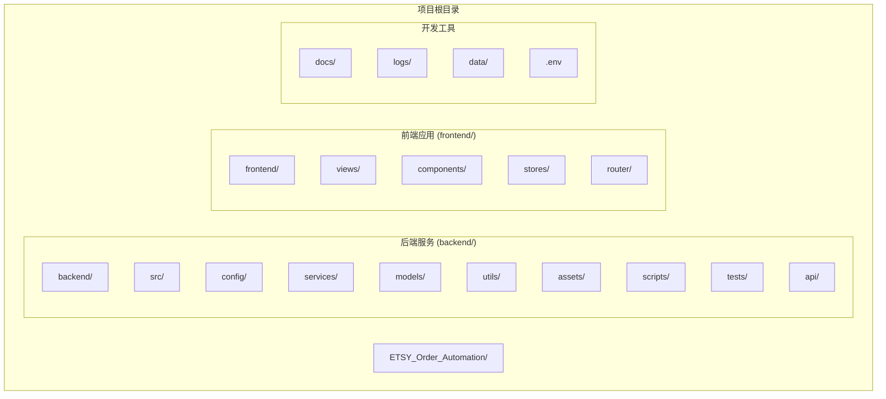

**图表来源**
- [pyproject.toml:8-35](file://backend/pyproject.toml#L8-L35)
- [package.json:1-26](file://frontend/package.json#L1-L26)

### 目录结构详解

- **backend/src/**：包含所有核心业务逻辑代码，包括API服务、配置管理、服务层和工具函数
- **frontend/src/**：Vue3前端应用，包含视图组件、状态管理、路由配置和工具函数
- **backend/assets/**：包含字体、模板、SKU数据等静态资源文件
- **backend/scripts/**：数据库迁移脚本和辅助工具脚本，包括客服外链相关脚本
- **frontend/src/stores/**：Pinia状态管理，包含订单状态管理和用户会话管理
- **docs/**：完整的前后端对接文档和API规范

**章节来源**
- [pyproject.toml:8-35](file://backend/pyproject.toml#L8-L35)
- [package.json:1-26](file://frontend/package.json#L1-L26)

## 核心组件

### FastAPI后端服务

FastAPI作为现代化的Python Web框架，提供了高性能的API服务。

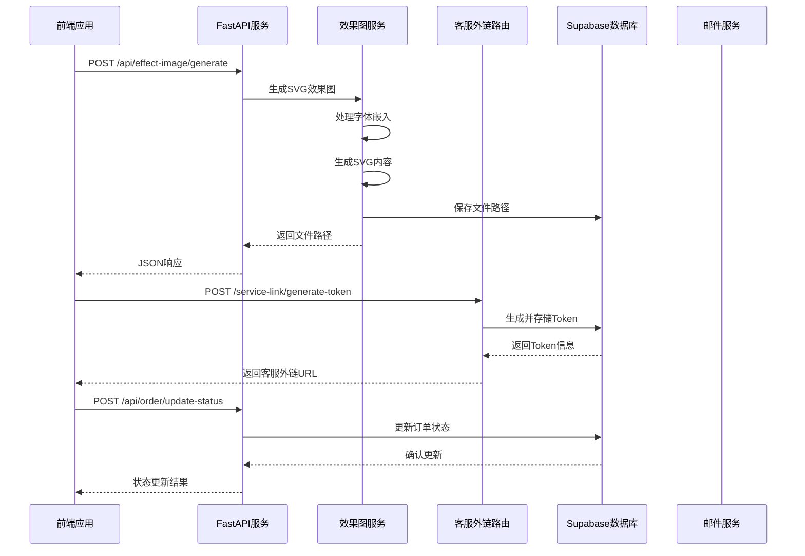

**图表来源**
- [main.py:81-126](file://backend/src/api/main.py#L81-L126)
- [main.py:144-159](file://backend/src/api/main.py#L144-L159)
- [service_link_routes.py:90-141](file://backend/src/api/service_link_routes.py#L90-L141)

### Vue3前端应用

Vue3作为现代前端框架，提供了响应式的数据绑定和组件化开发体验。

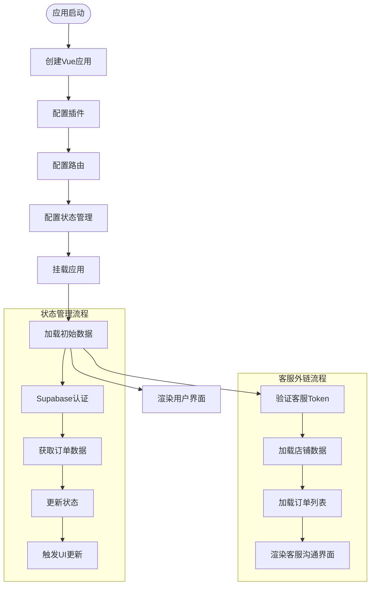

**图表来源**
- [main.js:1-22](file://frontend/src/main.js#L1-L22)
- [orderStore.js:45-73](file://frontend/src/stores/orderStore.js#L45-L73)
- [ServiceLink.vue:255-328](file://frontend/src/views/ServiceLink/ServiceLink.vue#L255-L328)

**章节来源**
- [main.py:22-36](file://backend/src/api/main.py#L22-L36)
- [main.js:1-22](file://frontend/src/main.js#L1-L22)

## 客服外链双链接系统

### 系统概述

客服外链双链接系统是ETSY订单自动化系统的重要组成部分，为客服团队提供了两个独立的外链入口，分别针对不同的客服工作场景：

- **沟通链接（Service Link）**：主要用于订单沟通、邮件发送、状态确认等基础客服操作
- **设计链接（Design Link）**：专门用于设计修改、效果图生成、客户反馈处理等高级客服操作

### 双链接架构设计

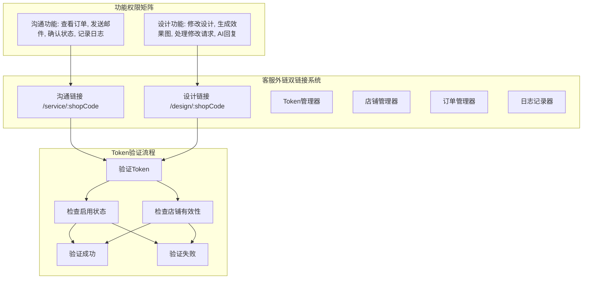

**图表来源**
- [service_link_routes.py:208-246](file://backend/src/api/service_link_routes.py#L208-L246)
- [service_link_routes.py:477-515](file://backend/src/api/service_link_routes.py#L477-L515)

### Token管理机制

系统采用安全的Token管理机制，确保客服外链的安全性和可控性：

#### Token生成流程

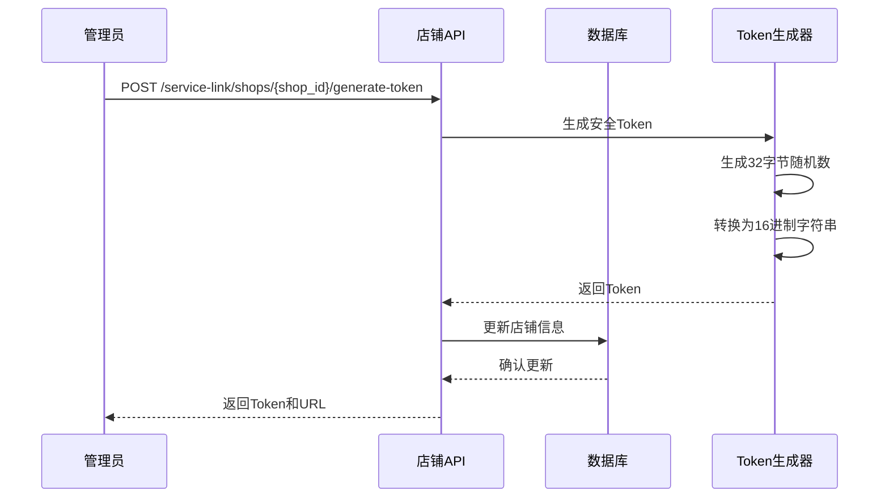

**图表来源**
- [service_link_routes.py:90-141](file://backend/src/api/service_link_routes.py#L90-L141)

#### Token验证机制

系统实现了多层次的Token验证机制：

1. **店铺代码验证**：检查shop_code是否存在且有效
2. **Token匹配验证**：验证传入的token与数据库中的token完全匹配
3. **启用状态验证**：检查店铺的外链是否处于启用状态
4. **时效性验证**：支持Token过期机制（可扩展）

### 功能对比与权限控制

| 功能特性 | 沟通链接 | 设计链接 | 权限级别 |
|---------|---------|---------|---------|
| 查看待确认订单 | ✅ | ✅ | 基础 |
| 发送确认邮件 | ✅ | ❌ | 基础 |
| 客户确认订单 | ✅ | ❌ | 基础 |
| 需修改订单处理 | ✅ | ❌ | 基础 |
| 修改设计内容 | ❌ | ✅ | 高级 |
| 生成效果图 | ❌ | ✅ | 高级 |
| AI智能回复 | ❌ | ✅ | 高级 |
| 处理修改请求 | ❌ | ✅ | 高级 |
| 访问设计器 | ❌ | ✅ | 高级 |
| 记录操作日志 | ✅ | ✅ | 基础 |

### 日志记录与审计

系统为客服外链操作提供了完整的日志记录功能：

#### 操作日志类型

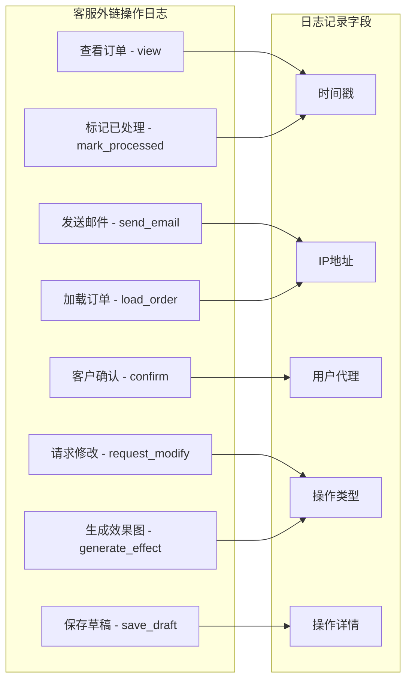

**图表来源**
- [create_service_link_logs_table.sql:13-17](file://backend/scripts/create_service_link_logs_table.sql#L13-L17)

**章节来源**
- [service_link_routes.py:280-329](file://backend/src/api/service_link_routes.py#L280-L329)
- [create_service_link_logs_table.sql:1-38](file://backend/scripts/create_service_link_logs_table.sql#L1-L38)

## 前后端交互机制

系统采用RESTful API设计，实现了前后端的标准化交互。

### API调用流程

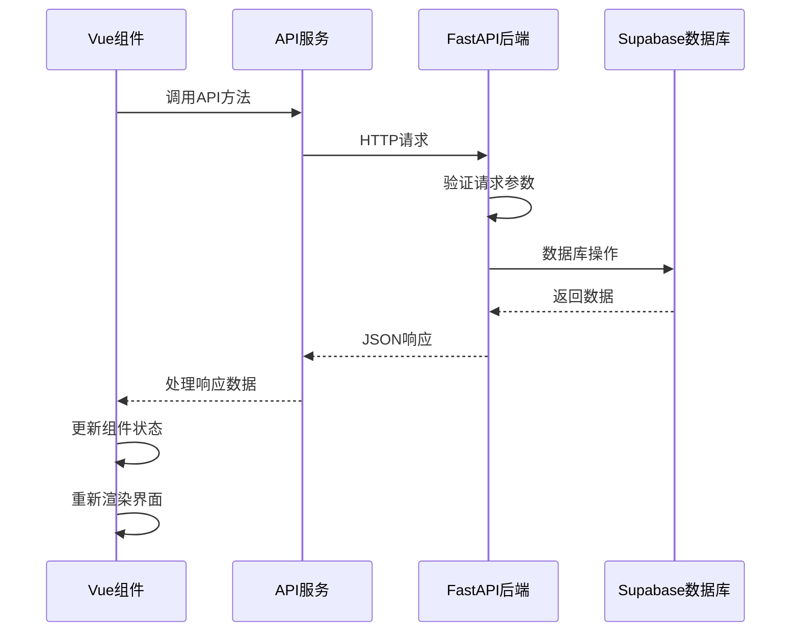

**图表来源**
- [api.js:20-35](file://frontend/src/utils/api.js#L20-L35)
- [main.py:81-126](file://backend/src/api/main.py#L81-L126)

### 实时数据同步

系统利用Supabase的实时订阅功能实现前后端数据的实时同步。

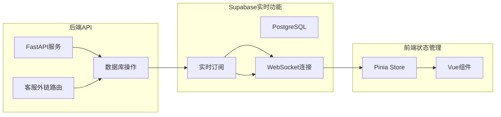

**图表来源**
- [orderStore.js:45-73](file://frontend/src/stores/orderStore.js#L45-L73)
- [supabase.js:1-18](file://frontend/src/utils/supabase.js#L1-L18)

**章节来源**
- [api.js:1-112](file://frontend/src/utils/api.js#L1-L112)
- [orderStore.js:1-362](file://frontend/src/stores/orderStore.js#L1-L362)

## 技术架构分析

### 后端技术栈

系统后端采用FastAPI框架，结合多种专业库实现完整的业务功能。

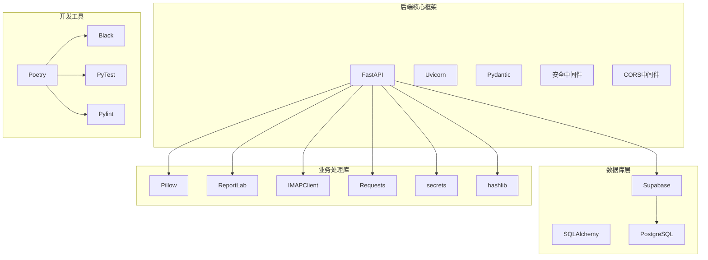

**图表来源**
- [pyproject.toml:8-35](file://backend/pyproject.toml#L8-L35)

### 前端技术栈

前端采用Vue3组合式API，结合现代化的构建工具链。

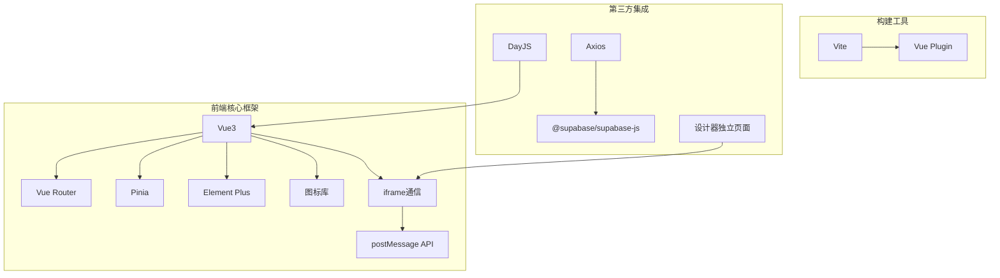

**图表来源**
- [package.json:11-21](file://frontend/package.json#L11-L21)
- [vite.config.js:1-14](file://frontend/vite.config.js#L1-L14)

**章节来源**
- [pyproject.toml:8-35](file://backend/pyproject.toml#L8-L35)
- [package.json:1-26](file://frontend/package.json#L1-L26)

## 数据库设计

系统采用Supabase作为数据库后端，提供了完整的PostgreSQL数据库服务。

### 核心数据表结构

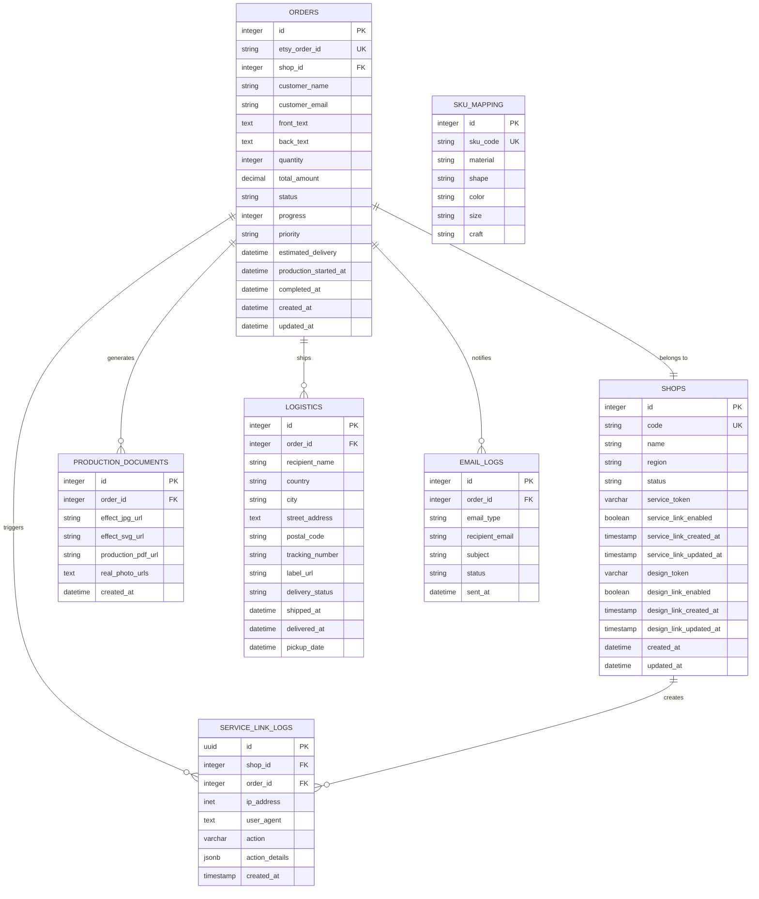

**图表来源**
- [frontend-backend-api.md:29-148](file://docs/frontend-backend-api.md#L29-L148)

### 数据库配置

系统通过Supabase提供的配置管理数据库连接和环境变量。

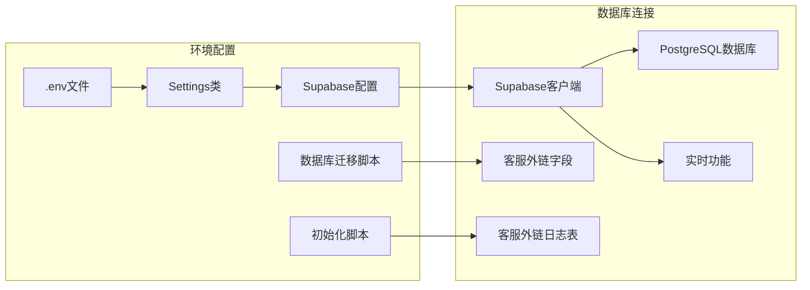

**图表来源**
- [settings.py:18-19](file://backend/src/config/settings.py#L18-L19)
- [supabase.js:4-5](file://frontend/src/utils/supabase.js#L4-L5)
- [add_service_link_fields.sql:1-32](file://backend/scripts/add_service_link_fields.sql#L1-L32)
- [create_service_link_logs_table.sql:1-38](file://backend/scripts/create_service_link_logs_table.sql#L1-L38)

**章节来源**
- [frontend-backend-api.md:9-312](file://docs/frontend-backend-api.md#L9-L312)
- [settings.py:12-56](file://backend/src/config/settings.py#L12-L56)

## API接口文档

系统提供完整的RESTful API接口，支持前后端的标准化交互。

### 效果图生成功能

| 接口 | 方法 | 描述 | 请求参数 | 响应数据 |
|------|------|------|----------|----------|
| `/api/effect-image/generate` | POST | 生成SVG效果图 | order_id, shape, color, size, text_front, text_back, font_code | front_svg, back_svg |
| `/api/effect-image/view/{filename}` | GET | 查看SVG效果图 | filename | SVG文件内容 |

### 订单状态管理

| 接口 | 方法 | 描述 | 请求参数 | 响应数据 |
|------|------|------|----------|----------|
| `/api/order/update-status` | POST | 更新订单状态 | order_id, status | success, order_id, new_status |
| `/health` | GET | 健康检查 | - | status |

### 邮件发送功能

| 接口 | 方法 | 描述 | 请求参数 | 响应数据 |
|------|------|------|----------|----------|
| `/api/email/send-confirmation` | POST | 发送确认邮件 | order_id, to_email, customer_name, product_info, effect_image_path | success, order_id, message |

### 客服外链Token管理

| 接口 | 方法 | 描述 | 请求参数 | 响应数据 |
|------|------|------|----------|----------|
| `/service-link/generate-token` | POST | 生成客服外链Token | shop_id, enabled | shop_id, shop_code, service_token, service_link_url |
| `/service-link/shops/{shop_id}/token` | GET | 获取客服外链信息 | shop_id | shop_id, shop_code, service_token, service_link_enabled |
| `/service-link/shops/{shop_id}/toggle` | POST | 启用/禁用客服外链 | shop_id, enabled | shop_id, shop_code, service_token, service_link_enabled |
| `/service-link/validate` | POST | 验证客服外链Token | shop_code, token | valid, shop_id, message |
| `/service-link/shops/{shop_id}/pending-orders` | GET | 获取待确认订单 | shop_id | 订单列表 |

### 设计链接Token管理

| 接口 | 方法 | 描述 | 请求参数 | 响应数据 |
|------|------|------|----------|----------|
| `/service-link/design-link/generate-token` | POST | 生成设计链接Token | shop_id, enabled | shop_id, shop_code, design_token, design_link_url |
| `/service-link/design-link/shops/{shop_id}/token` | GET | 获取设计链接信息 | shop_id | shop_id, shop_code, design_token, design_link_enabled |
| `/service-link/design-link/shops/{shop_id}/toggle` | POST | 启用/禁用设计链接 | shop_id, enabled | shop_id, shop_code, design_token, design_link_enabled |
| `/service-link/design-link/validate` | POST | 验证设计链接Token | shop_code, token | valid, shop_id, message |

### 操作日志记录

| 接口 | 方法 | 描述 | 请求参数 | 响应数据 |
|------|------|------|----------|----------|
| `/service-link/log-action` | POST | 记录客服操作日志 | shop_id, order_id, action, action_details | success, log_id |
| `/service-link/shops/{shop_id}/logs` | GET | 获取店铺操作日志 | shop_id, limit | 操作日志列表 |

**章节来源**
- [main.py:81-194](file://backend/src/api/main.py#L81-L194)
- [service_link_routes.py:90-516](file://backend/src/api/service_link_routes.py#L90-L516)

## 前端组件架构

### 路由系统

系统采用Vue Router实现多页面应用的路由管理。

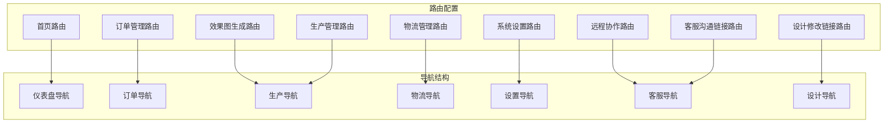

**图表来源**
- [index.js:3-46](file://frontend/src/router/index.js#L3-L46)
- [index.js:67-80](file://frontend/src/router/index.js#L67-L80)

### 状态管理模式

系统采用Pinia进行状态管理，实现了全局状态的集中管理。

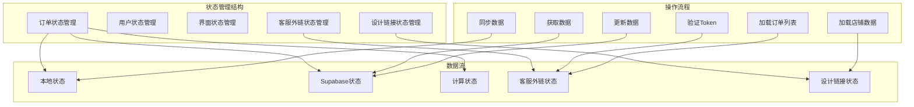

**图表来源**
- [orderStore.js:23-362](file://frontend/src/stores/orderStore.js#L23-L362)
- [ServiceLink.vue:255-328](file://frontend/src/views/ServiceLink/ServiceLink.vue#L255-L328)
- [DesignLink.vue:269-316](file://frontend/src/views/DesignLink/DesignLink.vue#L269-L316)

**章节来源**
- [index.js:1-59](file://frontend/src/router/index.js#L1-L59)
- [orderStore.js:1-362](file://frontend/src/stores/orderStore.js#L1-L362)

## 性能与扩展性

### 性能优化策略

系统在设计时充分考虑了性能优化和资源管理：

- **前端性能**：Vue3的响应式系统和组件懒加载机制
- **后端性能**：FastAPI的异步处理和Uvicorn的高性能服务器
- **数据库优化**：Supabase的连接池和查询优化
- **缓存策略**：字体文件的内存缓存和文件系统缓存
- **Token缓存**：客服外链Token的内存缓存机制

### 扩展性设计

系统采用模块化设计，便于功能扩展和维护：

- **插件化架构**：服务层采用插件化设计，便于添加新功能
- **配置驱动**：通过配置文件管理环境变量和行为参数
- **API标准化**：RESTful API设计便于第三方集成
- **数据库迁移**：Supabase的Schema管理支持数据库版本控制
- **双链接扩展**：客服外链系统支持更多链接类型的扩展

## 部署与运维

### 开发环境配置

系统支持多种部署方式，包括本地开发、容器化部署和云原生部署。

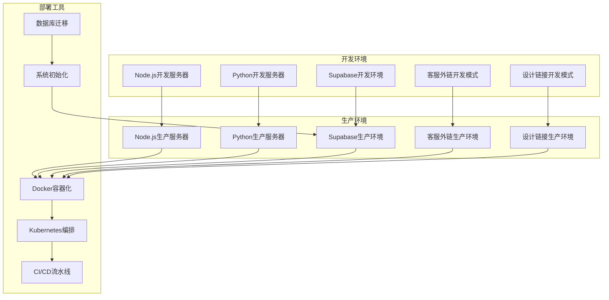

### 监控与日志

系统集成了完整的监控和日志系统：

- **前端监控**：Vue DevTools和浏览器开发者工具
- **后端监控**：FastAPI的内置监控和日志记录
- **数据库监控**：Supabase的性能监控和查询分析
- **错误追踪**：统一的错误处理和异常报告机制
- **客服外链监控**：专门的日志记录和审计功能

## 总结

ETSY订单自动化系统通过完整的FullStack架构迁移，成功实现了从前端用户界面到后端API服务再到数据库存储的现代化技术栈升级。系统不仅保持了原有的订单处理能力，还增加了实时数据同步、用户友好界面、模块化设计等现代化特性。

### 主要成就

- **技术栈升级**：从传统Python单体应用升级为现代化FullStack架构
- **实时数据同步**：通过Supabase实现前后端数据实时同步
- **用户界面优化**：Vue3提供了直观的可视化管理界面
- **API标准化**：完整的RESTful API接口规范
- **开发效率提升**：现代化工具链提升了开发和部署效率
- **双链接客服系统**：新增客服外链双链接系统，支持独立的沟通和设计功能

### 客服外链双链接系统特色

- **独立Token管理**：沟通链接和设计链接拥有独立的Token系统
- **权限分离**：不同的链接类型具有不同的功能权限
- **安全验证**：多层次的Token验证机制确保系统安全
- **操作审计**：完整的操作日志记录功能
- **灵活部署**：支持独立部署和集成部署两种模式

### 未来发展方向

系统为未来的功能扩展奠定了坚实基础，可以轻松集成更多电商平台、支持更复杂的订单处理场景，并提供更丰富的报表和分析功能。通过持续的技术迭代和功能完善，系统将继续为Etsy卖家创造更大的商业价值。

通过新增的客服外链双链接系统，ETSY订单自动化系统不仅提升了客服工作效率，还增强了系统的安全性和可维护性，为电商卖家提供了更加完善的自动化解决方案。