<docs>
# 项目概述

<cite>
**本文档引用的文件**
- [pyproject.toml](file://backend/pyproject.toml)
- [main.py](file://backend/src/api/main.py)
- [settings.py](file://backend/src/config/settings.py)
- [service_link_routes.py](file://backend/src/api/service_link_routes.py)
- [shipping_service.py](file://backend/src/services/shipping_service.py)
- [pdf_service.py](file://backend/src/services/pdf_service.py)
- [ai_service.py](file://backend/src/services/ai_service.py)
- [email_service.py](file://backend/src/services/email_service.py)
- [effect_image_service.py](file://backend/src/services/effect_image_service.py)
- [add_service_link_fields.sql](file://backend/scripts/add_service_link_fields.sql)
- [create_service_link_logs_table.sql](file://backend/scripts/create_service_link_logs_table.sql)
- [setup_service_link.py](file://backend/scripts/setup_service_link.py)
- [seed_test_shops.py](file://backend/scripts/seed_test_shops.py)
- [create_tables_sql.md](file://backend/scripts/create_tables_sql.md)
- [package.json](file://frontend/package.json)
- [main.js](file://frontend/src/main.js)
- [index.js](file://frontend/src/router/index.js)
- [orderStore.js](file://frontend/src/stores/orderStore.js)
- [api.js](file://frontend/src/utils/api.js)
- [supabase.js](file://frontend/src/utils/supabase.js)
- [vite.config.js](file://frontend/vite.config.js)
- [frontend-backend-api.md](file://docs/frontend-backend-api.md)
- [ServiceLink.vue](file://frontend/src/views/ServiceLink/ServiceLink.vue)
- [DesignLink.vue](file://frontend/src/views/DesignLink/DesignLink.vue)
</cite>

## 更新摘要
**所做更改**
- 更新了系统架构描述，反映从单点功能到完整业务流程自动化平台的升级
- 新增了物流配送自动化和AI智能服务模块的详细说明
- 扩展了客服外链双链接系统的功能特性
- 增强了全流程自动化的工作流描述
- 更新了技术架构图和API接口文档

## 目录
1. [引言](#引言)
2. [全流程自动化平台架构](#全流程自动化平台架构)
3. [项目结构](#项目结构)
4. [核心组件](#核心组件)
5. [客服外链双链接系统](#客服外链双链接系统)
6. [全流程业务流程](#全流程业务流程)
7. [前后端交互机制](#前后端交互机制)
8. [技术架构分析](#技术架构分析)
9. [数据库设计](#数据库设计)
10. [API接口文档](#api接口文档)
11. [前端组件架构](#前端组件架构)
12. [性能与扩展性](#性能与扩展性)
13. [部署与运维](#部署与运维)
14. [总结](#总结)

## 引言

ETSY订单自动化系统已成功升级为完整的业务流程自动化平台，实现了从订单接收、效果图生成、邮件发送到物流配送的全流程自动化处理。该系统采用里程碑式的V2.01_20260403架构升级，从传统的Python单体应用发展为包含Vue3前端、FastAPI后端、Supabase数据库的现代化FullStack架构。

### 系统核心目标

- **全流程自动化**：实现从邮件接收、订单解析、效果图生成到物流配送的完整业务流程自动化
- **智能化服务**：集成AI智能邮件生成、智能翻译、智能推荐等AI服务能力
- **双链接客服系统**：提供独立的沟通链接和设计链接，支持客服远程协作
- **实时数据同步**：通过Supabase实现前后端数据实时同步和状态管理
- **多租户架构**：支持多店铺、多角色的多租户业务模式

### 主要功能特性

系统现已具备以下核心功能模块：

- **智能订单监控**：通过IMAP协议实时监控Etsy订单邮件，自动解析订单信息
- **动态效果图生成**：支持多种形状、颜色、尺寸的SVG效果图生成和字体嵌入
- **AI智能邮件服务**：基于智谱AI的邮件内容生成，支持多场景邮件模板
- **物流配送自动化**：集成4PX物流API，实现订单创建、标签生成、状态跟踪
- **PDF生产文档生成**：自动生成符合工厂生产的PDF文档
- **实时订单状态管理**：完整的订单生命周期状态跟踪和管理
- **多维度统计分析**：提供订单状态、进度、效率等多维度统计和分析
- **双链接客服系统**：独立的沟通链接和设计链接，支持不同客服角色需求

## 全流程自动化平台架构

系统采用现代化的FullStack架构设计，实现了从前端用户界面到后端API服务再到数据库存储的完整技术栈升级。

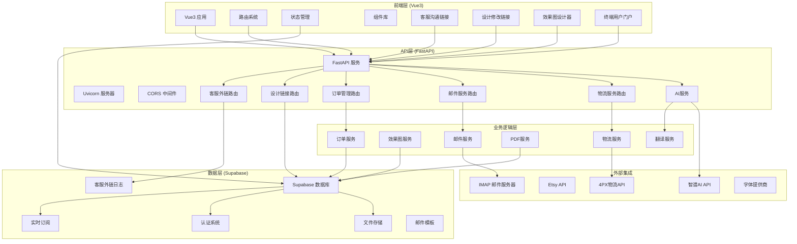
```mermaid
graph TB
subgraph "前端层 (Vue3)"
VueApp[Vue3 应用]
Router[路由系统]
Store[状态管理]
Components[组件库]
ServiceLink[客服沟通链接]
DesignLink[设计修改链接]
EffectDesigner[效果图设计器]
EndUserPortal[终端用户门户]
end
subgraph "API层 (FastAPI)"
FastAPI[FastAPI 服务]
APIServer[Uvicorn 服务器]
CORS[CORS 中间件]
ServiceRoutes[客服外链路由]
DesignRoutes[设计链接路由]
OrderRoutes[订单管理路由]
EmailRoutes[邮件服务路由]
ShippingRoutes[物流服务路由]
AIService[AI智能服务路由]
end
subgraph "业务逻辑层"
EmailService[邮件服务]
EffectService[效果图服务]
OrderService[订单服务]
PDFService[PDF服务]
ShippingService[物流服务]
AIService[AI服务]
TranslationService[翻译服务]
end
subgraph "数据层 (Supabase)"
SupabaseDB[Supabase 数据库]
Realtime[实时订阅]
Auth[认证系统]
Storage[文件存储]
ServiceLogs[客服外链日志]
EmailTemplates[邮件模板]
end
subgraph "外部集成"
IMAP[IMAP 邮件服务器]
EtsyAPI[Etsy API]
ShippingAPI[4PX物流API]
ZhipuAI[智谱AI API]
FontProvider[字体提供商]
end
VueApp --> FastAPI
Router --> FastAPI
Store --> SupabaseDB
ServiceLink --> FastAPI
DesignLink --> FastAPI
EffectDesigner --> FastAPI
EndUserPortal --> FastAPI
FastAPI --> ServiceRoutes
FastAPI --> DesignRoutes
FastAPI --> OrderRoutes
FastAPI --> EmailRoutes
FastAPI --> ShippingRoutes
FastAPI --> AIService
ServiceRoutes --> ServiceLogs
DesignRoutes --> SupabaseDB
OrderRoutes --> OrderService
EmailRoutes --> EmailService
ShippingRoutes --> ShippingService
AIService --> TranslationService
EmailService --> IMAP
EffectService --> SupabaseDB
OrderService --> SupabaseDB
PDFService --> SupabaseDB
ShippingService --> ShippingAPI
AIService --> ZhipuAI
SupabaseDB --> Realtime
SupabaseDB --> Auth
SupabaseDB --> Storage
```

**图表来源**
- [main.py:38-43](file://backend/src/api/main.py#L38-L43)
- [package.json:11-21](file://frontend/package.json#L11-L21)
- [settings.py:18-19](file://backend/src/config/settings.py#L18-L19)
- [service_link_routes.py:17-17](file://backend/src/api/service_link_routes.py#L17-L17)

### 架构优势

- **前后端分离**：前端专注于用户体验，后端专注于业务逻辑
- **实时数据同步**：Supabase提供实时数据库和WebSocket支持
- **模块化设计**：业务逻辑采用模块化架构，便于功能扩展和维护
- **AI智能集成**：深度集成AI服务能力，提供智能化客户服务
- **多租户支持**：支持多店铺、多角色的业务模式
- **可扩展性**：现代化工具链提升开发和部署效率

## 项目结构

系统采用清晰的分层架构设计，每个目录都有明确的职责分工。

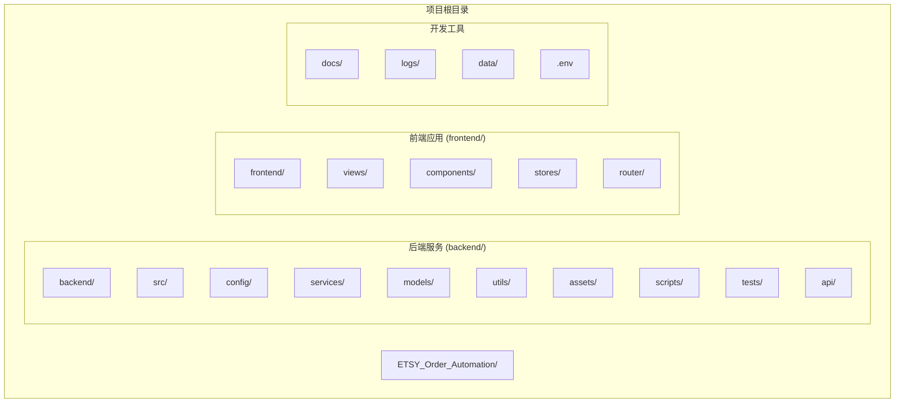
```mermaid
graph TB
subgraph "项目根目录"
Root[ETSY_Order_Automation/]
subgraph "后端服务 (backend/)"
Backend[backend/]
Src[src/]
Config[config/]
Services[services/]
Models[models/]
Utils[utils/]
Assets[assets/]
Scripts[scripts/]
Tests[tests/]
API[api/]
end
subgraph "前端应用 (frontend/)"
Frontend[frontend/]
Src[src/]
Views[views/]
Components[components/]
Stores[stores/]
Utils[utils/]
Router[router/]
end
subgraph "开发工具"
Docs[docs/]
Logs[logs/]
Data[data/]
Env[.env]
end
end
```

**图表来源**
- [pyproject.toml:8-35](file://backend/pyproject.toml#L8-L35)
- [package.json:1-26](file://frontend/package.json#L1-26)

### 目录结构详解

- **backend/src/**：包含所有核心业务逻辑代码，包括API服务、配置管理、服务层和工具函数
- **frontend/src/**：Vue3前端应用，包含视图组件、状态管理、路由配置和工具函数
- **backend/assets/**：包含字体、模板、SKU数据等静态资源文件
- **backend/scripts/**：数据库迁移脚本和辅助工具脚本，包括客服外链相关脚本
- **frontend/src/stores/**：Pinia状态管理，包含订单状态管理和用户会话管理
- **docs/**：完整的前后端对接文档和API规范

**章节来源**
- [pyproject.toml:8-35](file://backend/pyproject.toml#L8-L35)
- [package.json:1-26](file://frontend/package.json#L1-L26)

## 核心组件

### FastAPI后端服务

FastAPI作为现代化的Python Web框架，提供了高性能的API服务和完整的业务逻辑处理能力。

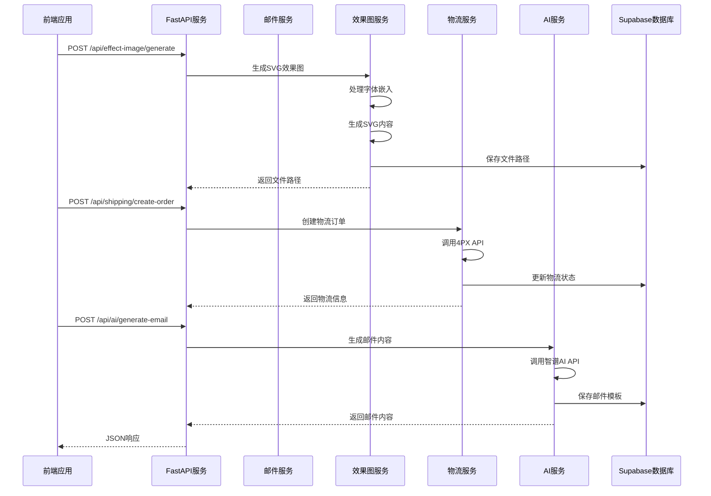
```mermaid
sequenceDiagram
participant Frontend as 前端应用
participant FastAPI as FastAPI服务
participant EmailService as 邮件服务
participant EffectService as 效果图服务
participant ShippingService as 物流服务
participant AIService as AI服务
participant Supabase as Supabase数据库
Frontend->>FastAPI : POST /api/effect-image/generate
FastAPI->>EffectService : 生成SVG效果图
EffectService->>EffectService : 处理字体嵌入
EffectService->>EffectService : 生成SVG内容
EffectService->>Supabase : 保存文件路径
EffectService-->>FastAPI : 返回文件路径
Frontend->>FastAPI : POST /api/shipping/create-order
FastAPI->>ShippingService : 创建物流订单
ShippingService->>ShippingService : 调用4PX API
ShippingService->>Supabase : 更新物流状态
ShippingService-->>FastAPI : 返回物流信息
Frontend->>FastAPI : POST /api/ai/generate-email
FastAPI->>AIService : 生成邮件内容
AIService->>AIService : 调用智谱AI API
AIService->>Supabase : 保存邮件模板
AIService-->>FastAPI : 返回邮件内容
FastAPI-->>Frontend : JSON响应
```

**图表来源**
- [main.py:81-126](file://backend/src/api/main.py#L81-L126)
- [main.py:144-159](file://backend/src/api/main.py#L144-L159)
- [service_link_routes.py:90-141](file://backend/src/api/service_link_routes.py#L90-L141)

### Vue3前端应用

Vue3作为现代前端框架，提供了响应式的数据绑定和组件化开发体验，支持双链接客服系统。

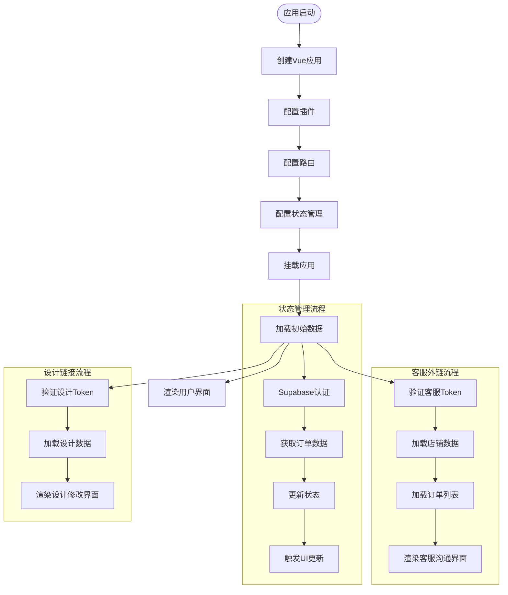
```mermaid
flowchart TD
Start([应用启动]) --> CreateApp[创建Vue应用]
CreateApp --> SetupPlugins[配置插件]
SetupPlugins --> SetupRouter[配置路由]
SetupRouter --> SetupStore[配置状态管理]
SetupStore --> MountApp[挂载应用]
MountApp --> LoadData[加载初始数据]
LoadData --> RenderUI[渲染用户界面]
subgraph "状态管理流程"
LoadData --> SupabaseAuth[Supabase认证]
SupabaseAuth --> FetchOrders[获取订单数据]
FetchOrders --> UpdateStore[更新状态]
UpdateStore --> TriggerRender[触发UI更新]
end
subgraph "客服外链流程"
LoadData --> ValidateToken[验证客服Token]
ValidateToken --> LoadShopData[加载店铺数据]
LoadShopData --> LoadOrders[加载订单列表]
LoadOrders --> RenderServiceLink[渲染客服沟通界面]
end
subgraph "设计链接流程"
LoadData --> ValidateDesignToken[验证设计Token]
ValidateDesignToken --> LoadDesignData[加载设计数据]
LoadDesignData --> RenderDesignLink[渲染设计修改界面]
end
```

**图表来源**
- [main.js:1-22](file://frontend/src/main.js#L1-L22)
- [orderStore.js:45-73](file://frontend/src/stores/orderStore.js#L45-L73)
- [ServiceLink.vue:255-328](file://frontend/src/views/ServiceLink/ServiceLink.vue#L255-L328)

**章节来源**
- [main.py:22-36](file://backend/src/api/main.py#L22-L36)
- [main.js:1-22](file://frontend/src/main.js#L1-L22)

## 客服外链双链接系统

### 系统概述

客服外链双链接系统是ETSY订单自动化系统的重要组成部分，为客服团队提供了两个独立的外链入口，分别针对不同的客服工作场景：

- **沟通链接（Service Link）**：主要用于订单沟通、邮件发送、状态确认等基础客服操作
- **设计链接（Design Link）**：专门用于设计修改、效果图生成、客户反馈处理等高级客服操作

### 双链接架构设计

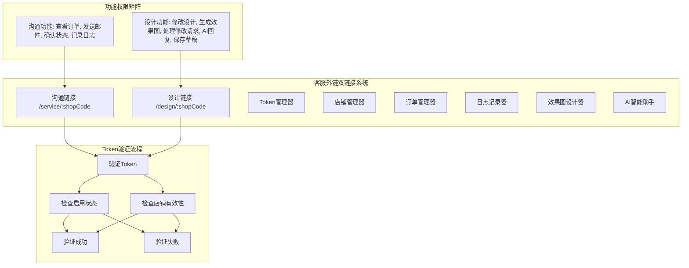
```mermaid
graph TB
subgraph "客服外链双链接系统"
ServiceLink[沟通链接 /service/:shopCode]
DesignLink[设计链接 /design/:shopCode]
TokenManager[Token管理器]
ShopManager[店铺管理器]
OrderManager[订单管理器]
LogManager[日志记录器]
EffectDesigner[效果图设计器]
AIAssistant[AI智能助手]
end
subgraph "Token验证流程"
ValidateToken[验证Token]
CheckEnabled[检查启用状态]
CheckShop[检查店铺有效性]
ValidateSuccess[验证成功]
ValidateFailed[验证失败]
end
subgraph "功能权限矩阵"
ServiceFeatures[沟通功能: 查看订单, 发送邮件, 确认状态, 记录日志]
DesignFeatures[设计功能: 修改设计, 生成效果图, 处理修改请求, AI回复, 保存草稿]
end
ServiceLink --> ValidateToken
DesignLink --> ValidateToken
ValidateToken --> CheckEnabled
ValidateToken --> CheckShop
CheckEnabled --> ValidateSuccess
CheckShop --> ValidateSuccess
CheckEnabled --> ValidateFailed
CheckShop --> ValidateFailed
ServiceFeatures --> ServiceLink
DesignFeatures --> DesignLink
```

**图表来源**
- [service_link_routes.py:208-246](file://backend/src/api/service_link_routes.py#L208-L246)
- [service_link_routes.py:477-515](file://backend/src/api/service_link_routes.py#L477-L515)

### Token管理机制

系统采用安全的Token管理机制，确保客服外链的安全性和可控性：

#### Token生成流程

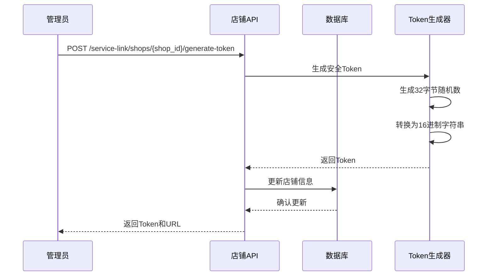
```mermaid
sequenceDiagram
participant Admin as 管理员
participant ShopAPI as 店铺API
participant DB as 数据库
participant TokenGen as Token生成器
Admin->>ShopAPI : POST /service-link/shops/{shop_id}/generate-token
ShopAPI->>TokenGen : 生成安全Token
TokenGen->>TokenGen : 生成32字节随机数
TokenGen->>TokenGen : 转换为16进制字符串
TokenGen-->>ShopAPI : 返回Token
ShopAPI->>DB : 更新店铺信息
DB-->>ShopAPI : 确认更新
ShopAPI-->>Admin : 返回Token和URL
```

**图表来源**
- [service_link_routes.py:90-141](file://backend/src/api/service_link_routes.py#L90-L141)

#### Token验证机制

系统实现了多层次的Token验证机制：

1. **店铺代码验证**：检查shop_code是否存在且有效
2. **Token匹配验证**：验证传入的token与数据库中的token完全匹配
3. **启用状态验证**：检查店铺的外链是否处于启用状态
4. **时效性验证**：支持Token过期机制（可扩展）

### 功能对比与权限控制

| 功能特性 | 沟通链接 | 设计链接 | 权限级别 |
|---------|---------|---------|---------|
| 查看待确认订单 | ✅ | ✅ | 基础 |
| 发送确认邮件 | ✅ | ❌ | 基础 |
| 客户确认订单 | ✅ | ❌ | 基础 |
| 需修改订单处理 | ✅ | ❌ | 基础 |
| 修改设计内容 | ❌ | ✅ | 高级 |
| 生成效果图 | ❌ | ✅ | 高级 |
| AI智能回复 | ❌ | ✅ | 高级 |
| 处理修改请求 | ❌ | ✅ | 高级 |
| 访问设计器 | ❌ | ✅ | 高级 |
| 保存草稿 | ❌ | ✅ | 高级 |
| 标记已处理 | ❌ | ✅ | 高级 |
| 记录操作日志 | ✅ | ✅ | 基础 |

### 日志记录与审计

系统为客服外链操作提供了完整的日志记录功能：

#### 操作日志类型

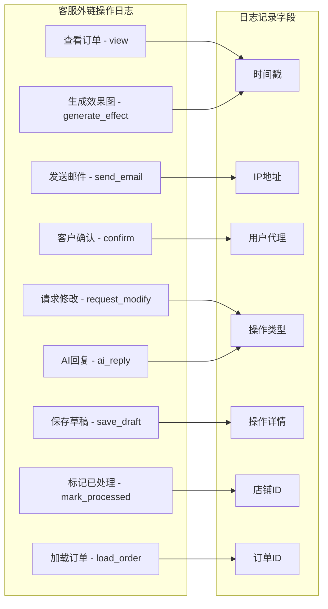
```mermaid
graph LR
subgraph "客服外链操作日志"
ViewOrder[查看订单 - view]
SendEmail[发送邮件 - send_email]
ConfirmOrder[客户确认 - confirm]
RequestModify[请求修改 - request_modify]
SaveDraft[保存草稿 - save_draft]
MarkProcessed[标记已处理 - mark_processed]
LoadOrder[加载订单 - load_order]
GenerateEffect[生成效果图 - generate_effect]
AIReply[AI回复 - ai_reply]
end
subgraph "日志记录字段"
Timestamp[时间戳]
IPAddress[IP地址]
UserAgent[用户代理]
Action[操作类型]
Details[操作详情]
ShopID[店铺ID]
OrderID[订单ID]
end
ViewOrder --> Timestamp
SendEmail --> IPAddress
ConfirmOrder --> UserAgent
RequestModify --> Action
SaveDraft --> Details
MarkProcessed --> ShopID
LoadOrder --> OrderID
GenerateEffect --> Timestamp
AIReply --> Action
```

**图表来源**
- [create_service_link_logs_table.sql:13-17](file://backend/scripts/create_service_link_logs_table.sql#L13-L17)

**章节来源**
- [service_link_routes.py:280-329](file://backend/src/api/service_link_routes.py#L280-L329)
- [create_service_link_logs_table.sql:1-38](file://backend/scripts/create_service_link_logs_table.sql#L1-L38)

## 全流程业务流程

### 订单自动化处理流程

系统实现了从订单接收到物流配送的完整自动化流程。

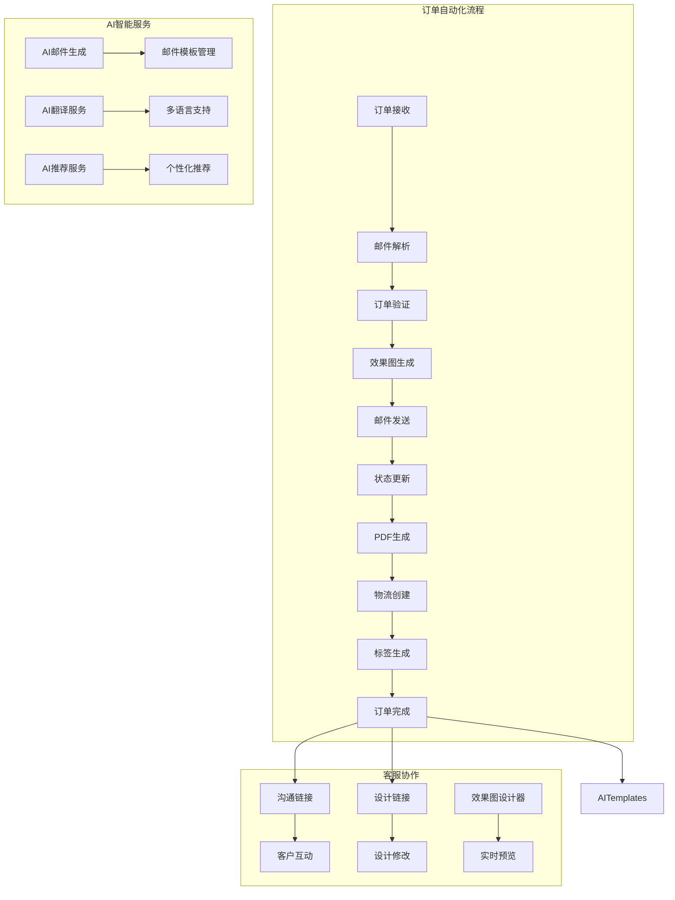
```mermaid
flowchart TD
subgraph "订单自动化流程"
OrderReceived[订单接收] --> EmailParsing[邮件解析]
EmailParsing --> OrderValidation[订单验证]
OrderValidation --> EffectGeneration[效果图生成]
EffectGeneration --> EmailSending[邮件发送]
EmailSending --> OrderStatusUpdate[状态更新]
OrderStatusUpdate --> PDFGeneration[PDF生成]
PDFGeneration --> ShippingCreation[物流创建]
ShippingCreation --> LabelGeneration[标签生成]
LabelGeneration --> OrderCompletion[订单完成]
end
subgraph "AI智能服务"
AIEmail[AI邮件生成] --> EmailTemplates[邮件模板管理]
AITranslation[AI翻译服务] --> MultiLanguage[多语言支持]
AIRecommendation[AI推荐服务] --> Personalization[个性化推荐]
end
subgraph "客服协作"
ServiceLink[沟通链接] --> CustomerInteraction[客户互动]
DesignLink[设计链接] --> DesignModification[设计修改]
EffectDesigner[效果图设计器] --> RealTimePreview[实时预览]
end
OrderCompletion --> AITemplates
OrderCompletion --> ServiceLink
OrderCompletion --> DesignLink
```

**图表来源**
- [main.py:489-728](file://backend/src/api/main.py#L489-L728)
- [email_service.py:87-185](file://backend/src/services/email_service.py#L87-L185)
- [effect_image_service.py:77-129](file://backend/src/services/effect_image_service.py#L77-L129)
- [shipping_service.py:306-393](file://backend/src/services/shipping_service.py#L306-L393)

### 物流配送自动化流程

系统集成了4PX物流API，实现了完整的物流配送自动化。

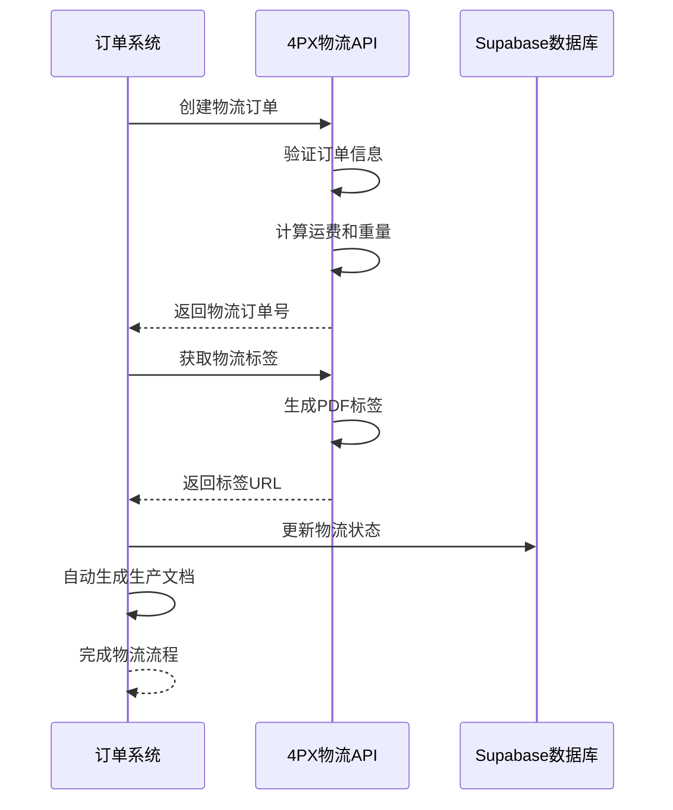
```mermaid
sequenceDiagram
participant OrderSystem as 订单系统
participant ShippingAPI as 4PX物流API
participant SupabaseDB as Supabase数据库
OrderSystem->>ShippingAPI : 创建物流订单
ShippingAPI->>ShippingAPI : 验证订单信息
ShippingAPI->>ShippingAPI : 计算运费和重量
ShippingAPI-->>OrderSystem : 返回物流订单号
OrderSystem->>ShippingAPI : 获取物流标签
ShippingAPI->>ShippingAPI : 生成PDF标签
ShippingAPI-->>OrderSystem : 返回标签URL
OrderSystem->>SupabaseDB : 更新物流状态
OrderSystem->>OrderSystem : 自动生成生产文档
OrderSystem-->>OrderSystem : 完成物流流程
```

**图表来源**
- [main.py:489-728](file://backend/src/api/main.py#L489-L728)
- [shipping_service.py:306-393](file://backend/src/services/shipping_service.py#L306-L393)

### AI智能服务集成

系统深度集成了AI服务能力，提供智能化客户服务。

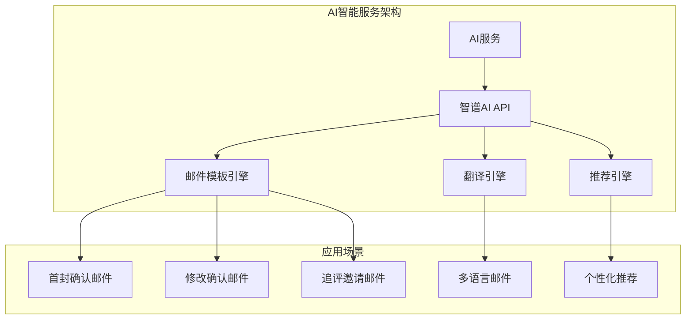
```mermaid
graph TB
subgraph "AI智能服务架构"
AIService[AI服务]
ZhipuAPI[智谱AI API]
TemplateEngine[邮件模板引擎]
TranslationEngine[翻译引擎]
RecommendationEngine[推荐引擎]
end
subgraph "应用场景"
FirstConfirm[首封确认邮件]
ModifyConfirm[修改确认邮件]
ReviewRequest[追评邀请邮件]
MultiLanguage[多语言邮件]
PersonalizedRecommendations[个性化推荐]
end
AIService --> ZhipuAPI
ZhipuAPI --> TemplateEngine
ZhipuAPI --> TranslationEngine
ZhipuAPI --> RecommendationEngine
TemplateEngine --> FirstConfirm
TemplateEngine --> ModifyConfirm
TemplateEngine --> ReviewRequest
TranslationEngine --> MultiLanguage
RecommendationEngine --> PersonalizedRecommendations
```

**图表来源**
- [ai_service.py:26-488](file://backend/src/services/ai_service.py#L26-L488)

**章节来源**
- [main.py:489-728](file://backend/src/api/main.py#L489-L728)
- [email_service.py:87-185](file://backend/src/services/email_service.py#L87-L185)
- [effect_image_service.py:77-129](file://backend/src/services/effect_image_service.py#L77-L129)
- [shipping_service.py:306-393](file://backend/src/services/shipping_service.py#L306-L393)
- [ai_service.py:26-488](file://backend/src/services/ai_service.py#L26-L488)

## 前后端交互机制

系统采用RESTful API设计，实现了前后端的标准化交互和实时数据同步。

### API调用流程

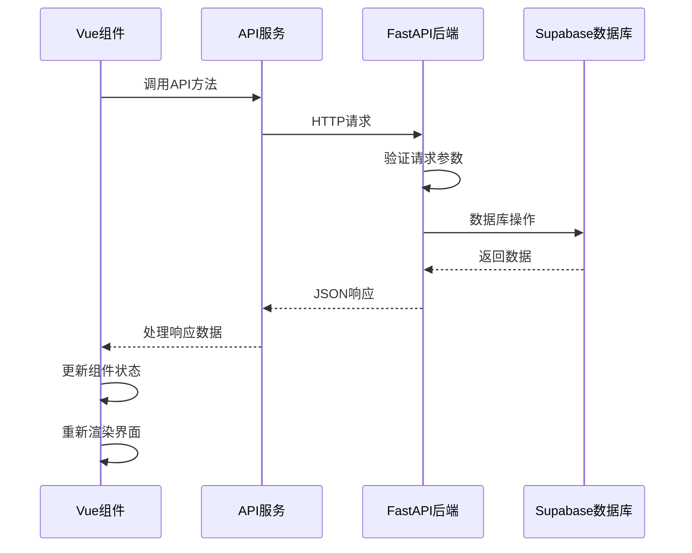
```mermaid
sequenceDiagram
participant VueComponent as Vue组件
participant ApiService as API服务
participant FastAPI as FastAPI后端
participant Supabase as Supabase数据库
VueComponent->>ApiService : 调用API方法
ApiService->>FastAPI : HTTP请求
FastAPI->>FastAPI : 验证请求参数
FastAPI->>Supabase : 数据库操作
Supabase-->>FastAPI : 返回数据
FastAPI-->>ApiService : JSON响应
ApiService-->>VueComponent : 处理响应数据
VueComponent->>VueComponent : 更新组件状态
VueComponent->>VueComponent : 重新渲染界面
```

**图表来源**
- [api.js:20-35](file://frontend/src/utils/api.js#L20-L35)
- [main.py:81-126](file://backend/src/api/main.py#L81-L126)

### 实时数据同步

系统利用Supabase的实时订阅功能实现前后端数据的实时同步。

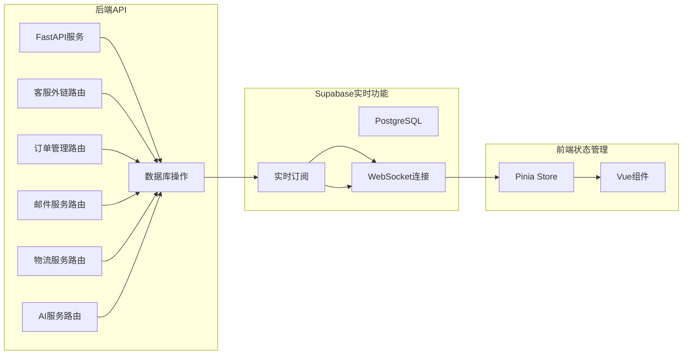
```mermaid
graph LR
subgraph "Supabase实时功能"
Realtime[实时订阅]
Postgres[PostgreSQL]
WebSocket[WebSocket连接]
end
subgraph "前端状态管理"
PiniaStore[Pinia Store]
VueComponents[Vue组件]
end
subgraph "后端API"
FastAPI[FastAPI服务]
Database[数据库操作]
ServiceLinkRoutes[客服外链路由]
OrderRoutes[订单管理路由]
EmailRoutes[邮件服务路由]
ShippingRoutes[物流服务路由]
AIService[AI服务路由]
end
Realtime --> WebSocket
WebSocket --> PiniaStore
PiniaStore --> VueComponents
FastAPI --> Database
Database --> Realtime
ServiceLinkRoutes --> Database
OrderRoutes --> Database
EmailRoutes --> Database
ShippingRoutes --> Database
AIService --> Database
Realtime --> WebSocket
```

**图表来源**
- [orderStore.js:45-73](file://frontend/src/stores/orderStore.js#L45-L73)
- [supabase.js:1-18](file://frontend/src/utils/supabase.js#L1-L18)

**章节来源**
- [api.js:1-112](file://frontend/src/utils/api.js#L1-L112)
- [orderStore.js:1-362](file://frontend/src/stores/orderStore.js#L1-L362)

## 技术架构分析

### 后端技术栈

系统后端采用FastAPI框架，结合多种专业库实现完整的业务功能。

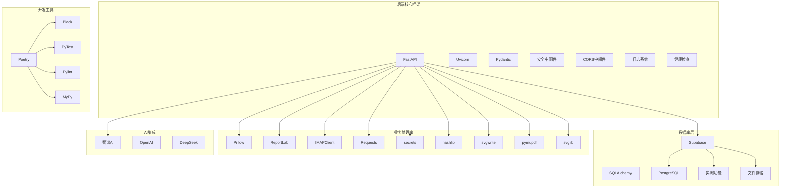
```mermaid
graph TB
subgraph "后端核心框架"
FastAPI[FastAPI]
Uvicorn[Uvicorn]
Pydantic[Pydantic]
Security[安全中间件]
CORS[CORS中间件]
Logging[日志系统]
HealthCheck[健康检查]
end
subgraph "数据库层"
Supabase[Supabase]
SQLAlchemy[SQLAlchemy]
Postgres[PostgreSQL]
Realtime[实时功能]
Storage[文件存储]
end
subgraph "业务处理库"
Pillow[Pillow]
ReportLab[ReportLab]
IMAPClient[IMAPClient]
Requests[Requests]
Secrets[secrets]
Hashlib[hashlib]
Svgwrite[svgwrite]
PyMuPDF[pymupdf]
Svglib[svglib]
end
subgraph "AI集成"
ZhipuAI[智谱AI]
OpenAI[OpenAI]
DeepSeek[DeepSeek]
end
subgraph "开发工具"
Poetry[Poetry]
Black[Black]
PyTest[PyTest]
Pylint[Pylint]
MyPy[MyPy]
end
FastAPI --> Supabase
FastAPI --> Pillow
FastAPI --> ReportLab
FastAPI --> IMAPClient
FastAPI --> Requests
FastAPI --> Secrets
FastAPI --> Hashlib
FastAPI --> Svgwrite
FastAPI --> PyMuPDF
FastAPI --> Svglib
FastAPI --> ZhipuAI
Supabase --> Postgres
Supabase --> Realtime
Supabase --> Storage
Poetry --> Black
Poetry --> PyTest
Poetry --> Pylint
Poetry --> MyPy
```

**图表来源**
- [pyproject.toml:8-35](file://backend/pyproject.toml#L8-L35)

### 前端技术栈

前端采用Vue3组合式API，结合现代化的构建工具链。

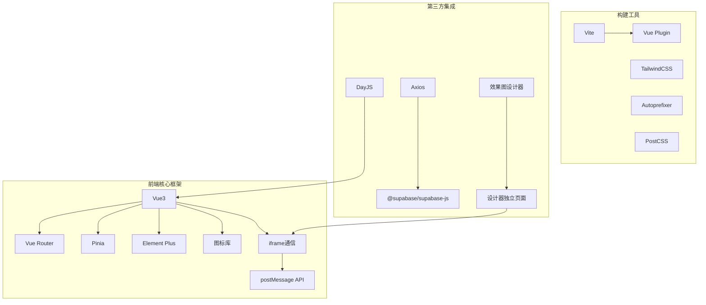
```mermaid
graph TB
subgraph "前端核心框架"
Vue3["Vue3"]
VueRouter["Vue Router"]
Pinia["Pinia"]
ElementPlus["Element Plus"]
Icons["图标库"]
Iframe["iframe通信"]
postMessage["postMessage API"]
end
subgraph "构建工具"
Vite["Vite"]
VuePlugin["Vue Plugin"]
TailwindCSS["TailwindCSS"]
Autoprefixer["Autoprefixer"]
PostCSS["PostCSS"]
end
subgraph "第三方集成"
Axios["Axios"]
DayJS["DayJS"]
SupabaseJS["@supabase/supabase-js"]
DesignStandalone["设计器独立页面"]
EffectDesigner["效果图设计器"]
end
Vue3 --> VueRouter
Vue3 --> Pinia
Vue3 --> ElementPlus
Vue3 --> Icons
Vue3 --> Iframe
Iframe --> postMessage
Vite --> VuePlugin
Axios --> SupabaseJS
DayJS --> Vue3
DesignStandalone --> Iframe
EffectDesigner --> DesignStandalone
```

**图表来源**
- [package.json:11-21](file://frontend/package.json#L11-L21)
- [vite.config.js:1-14](file://frontend/vite.config.js#L1-L14)

**章节来源**
- [pyproject.toml:8-35](file://backend/pyproject.toml#L8-L35)
- [package.json:1-26](file://frontend/package.json#L1-L26)

## 数据库设计

系统采用Supabase作为数据库后端，提供了完整的PostgreSQL数据库服务。

### 核心数据表结构

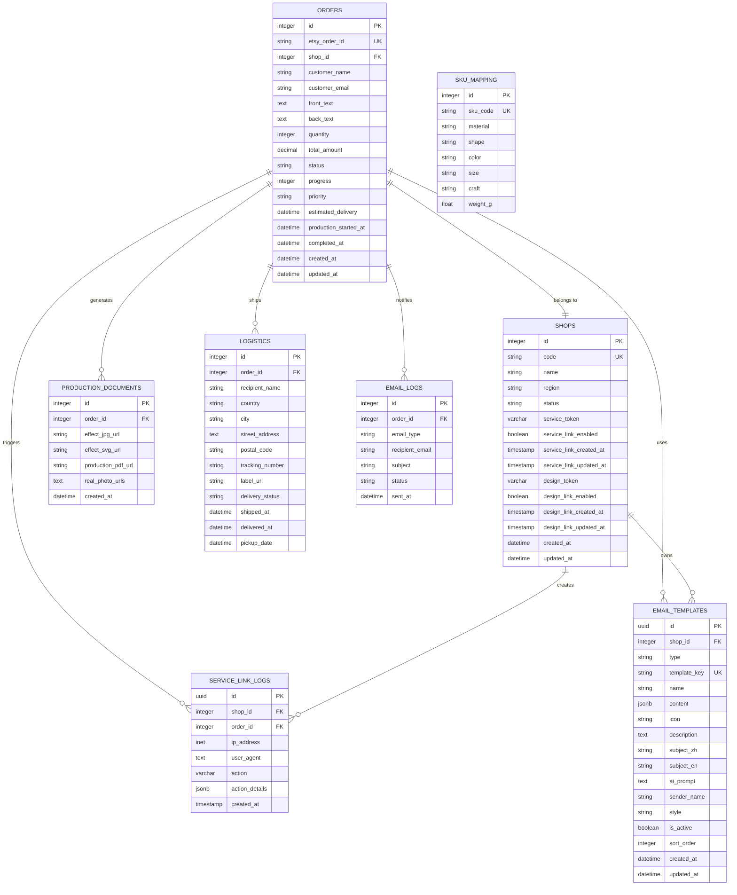
```mermaid
erDiagram
ORDERS {
integer id PK
string etsy_order_id UK
integer shop_id FK
string customer_name
string customer_email
text front_text
text back_text
integer quantity
decimal total_amount
string status
integer progress
string priority
datetime estimated_delivery
datetime production_started_at
datetime completed_at
datetime created_at
datetime updated_at
}
SHOPS {
integer id PK
string code UK
string name
string region
string status
varchar service_token
boolean service_link_enabled
timestamp service_link_created_at
timestamp service_link_updated_at
varchar design_token
boolean design_link_enabled
timestamp design_link_created_at
timestamp design_link_updated_at
datetime created_at
datetime updated_at
}
SKU_MAPPING {
integer id PK
string sku_code UK
string material
string shape
string color
string size
string craft
float weight_g
}
PRODUCTION_DOCUMENTS {
integer id PK
integer order_id FK
string effect_jpg_url
string effect_svg_url
string production_pdf_url
text real_photo_urls
datetime created_at
}
LOGISTICS {
integer id PK
integer order_id FK
string recipient_name
string country
string city
text street_address
string postal_code
string tracking_number
string label_url
string delivery_status
datetime shipped_at
datetime delivered_at
datetime pickup_date
}
SERVICE_LINK_LOGS {
uuid id PK
integer shop_id FK
integer order_id FK
inet ip_address
text user_agent
varchar action
jsonb action_details
timestamp created_at
}
EMAIL_TEMPLATES {
uuid id PK
integer shop_id FK
string type
string template_key UK
string name
jsonb content
string icon
text description
string subject_zh
string subject_en
text ai_prompt
string sender_name
string style
boolean is_active
integer sort_order
datetime created_at
datetime updated_at
}
EMAIL_LOGS {
integer id PK
integer order_id FK
string email_type
string recipient_email
string subject
string status
datetime sent_at
}
ORDERS ||--|| SHOPS : "belongs to"
ORDERS ||--o{ PRODUCTION_DOCUMENTS : "generates"
ORDERS ||--o{ LOGISTICS : "ships"
ORDERS ||--o{ EMAIL_LOGS : "notifies"
ORDERS ||--o{ SERVICE_LINK_LOGS : "triggers"
ORDERS ||--o{ EMAIL_TEMPLATES : "uses"
SHOPS ||--o{ SERVICE_LINK_LOGS : "creates"
SHOPS ||--o{ EMAIL_TEMPLATES : "owns"
```

**图表来源**
- [frontend-backend-api.md:29-148](file://docs/frontend-backend-api.md#L29-L148)

### 数据库配置

系统通过Supabase提供的配置管理数据库连接和环境变量。

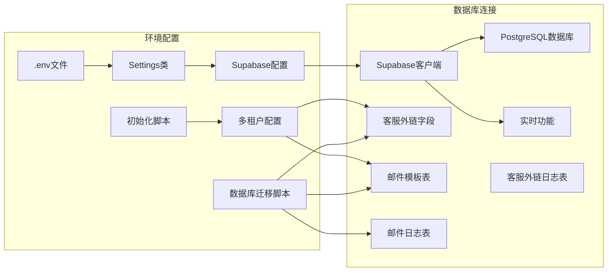
```mermaid
graph LR
subgraph "环境配置"
ENV[.env文件]
Settings[Settings类]
SupabaseConfig[Supabase配置]
MigrationScript[数据库迁移脚本]
InitScript[初始化脚本]
MultiTenant[多租户配置]
end
subgraph "数据库连接"
SupabaseClient[Supabase客户端]
PostgresDB[PostgreSQL数据库]
Realtime[实时功能]
ServiceLinkFields[客服外链字段]
ServiceLinkLogs[客服外链日志表]
EmailTemplates[邮件模板表]
EmailLogs[邮件日志表]
end
ENV --> Settings
Settings --> SupabaseConfig
SupabaseConfig --> SupabaseClient
SupabaseClient --> PostgresDB
SupabaseClient --> Realtime
MigrationScript --> ServiceLinkFields
MigrationScript --> EmailTemplates
MigrationScript --> EmailLogs
InitScript --> MultiTenant
MultiTenant --> ServiceLinkFields
MultiTenant --> EmailTemplates
```

**图表来源**
- [settings.py:18-19](file://backend/src/config/settings.py#L18-L19)
- [supabase.js:4-5](file://frontend/src/utils/supabase.js#L4-L5)
- [add_service_link_fields.sql:1-32](file://backend/scripts/add_service_link_fields.sql#L1-L32)
- [create_service_link_logs_table.sql:1-38](file://backend/scripts/create_service_link_logs_table.sql#L1-L38)
- [create_tables_sql.md:1-114](file://backend/scripts/create_tables_sql.md#L1-L114)

**章节来源**
- [frontend-backend-api.md:9-312](file://docs/frontend-backend-api.md#L9-L312)
- [settings.py:12-56](file://backend/src/config/settings.py#L12-L56)

## API接口文档

系统提供完整的RESTful API接口，支持前后端的标准化交互和完整的业务流程自动化。

### 效果图生成功能

| 接口 | 方法 | 描述 | 请求参数 | 响应数据 |
|------|------|------|----------|----------|
| `/api/effect-image/generate` | POST | 生成SVG效果图 | order_id, shape, color, size, text_front, text_back, font_code | front_svg, back_svg |
| `/api/effect-image/view/{filename}` | GET | 查看SVG效果图 | filename | SVG文件内容 |
| `/api/effect-image/generate-and-upload` | POST | 一键生成效果图并上传 | order_id | effect_image_url, effect_image_back_url |

### 订单状态管理

| 接口 | 方法 | 描述 | 请求参数 | 响应数据 |
|------|------|------|----------|----------|
| `/api/order/update-status` | POST | 更新订单状态 | order_id, status | success, order_id, new_status |
| `/health` | GET | 健康检查 | - | status |

### 邮件发送功能

| 接口 | 方法 | 描述 | 请求参数 | 响应数据 |
|------|------|------|----------|----------|
| `/api/email/send-confirmation` | POST | 发送确认邮件 | order_id, to_email, customer_name, product_info, effect_image_path | success, order_id, message |
| `/api/email/send-modify-confirm` | POST | 发送修改确认邮件 | order_id, to_email, customer_name, product_info, effect_image_path, modify_reason | success, order_id, message |
| `/api/email/send-review-request` | POST | 发送追评邀请邮件 | order_id, to_email, customer_name, product_info | success, order_id, message |

### AI智能服务

| 接口 | 方法 | 描述 | 请求参数 | 响应数据 |
|------|------|------|----------|----------|
| `/api/ai/generate-email` | POST | AI生成邮件内容 | scene, customer_name, product_name, front_text, back_text, shape, color, size, tone, sender_name, modify_reason | subject, body, scene, generated_by |

### 物流服务API

| 接口 | 方法 | 描述 | 请求参数 | 响应数据 |
|------|------|------|----------|----------|
| `/api/shipping/create-order` | POST | 创建物流订单 | order_id, logistics_product_code, recipient_name, recipient_phone, recipient_email, recipient_street, recipient_city, recipient_state, recipient_postcode, recipient_country, weight_kg, declare_value, declare_currency | success, message, data |
| `/api/shipping/get-label` | POST | 获取物流面单 | tracking_number, order_no | success, message, data |
| `/api/shipping/get-products` | POST | 查询物流产品 | country_code, postcode | success, data |
| `/api/shipping/cancel-order` | POST | 取消物流订单 | order_no, reason | success, message |
| `/api/shipping/query-order` | POST | 查询物流订单 | order_no | success, data |

### PDF生成服务

| 接口 | 方法 | 描述 | 请求参数 | 响应数据 |
|------|------|------|----------|----------|
| `/api/pdf/generate-and-upload` | POST | 一键生成生产文档PDF并上传 | order_id | success, order_id, production_pdf_url |

### 客服外链Token管理

| 接口 | 方法 | 描述 | 请求参数 | 响应数据 |
|------|------|------|----------|----------|
| `/service-link/generate-token` | POST | 生成客服外链Token | shop_id, enabled | shop_id, shop_code, service_token, service_link_url |
| `/service-link/shops/{shop_id}/token` | GET | 获取客服外链信息 | shop_id | shop_id, shop_code, service_token, service_link_enabled |
| `/service-link/shops/{shop_id}/toggle` | POST | 启用/禁用客服外链 | shop_id, enabled | shop_id, shop_code, service_token, service_link_enabled |
| `/service-link/validate` | POST | 验证客服外链Token | shop_code, token | valid, shop_id, message |
| `/service-link/shops/{shop_id}/pending-orders` | GET | 获取待确认订单 | shop_id | 订单列表 |
| `/service-link/log-action` | POST | 记录客服操作日志 | shop_id, order_id, action, action_details | success, log_id |
| `/service-link/shops/{shop_id}/logs` | GET | 获取店铺操作日志 | shop_id, limit | 操作日志列表 |

### 设计链接Token管理

| 接口 | 方法 | 描述 | 请求参数 | 响应数据 |
|------|------|------|----------|----------|
| `/service-link/design-link/generate-token` | POST | 生成设计链接Token | shop_id, enabled | shop_id, shop_code, design_token, design_link_url |
| `/service-link/design-link/shops/{shop_id}/token` | GET | 获取设计链接信息 | shop_id | shop_id, shop_code, design_token, design_link_enabled |
| `/service-link/design-link/shops/{shop_id}/toggle` | POST | 启用/禁用设计链接 | shop_id, enabled | shop_id, shop_code, design_token, design_link_enabled |
| `/service-link/design-link/validate` | POST | 验证设计链接Token | shop_code, token | valid, shop_id, message |

### 邮件模板管理

| 接口 | 方法 | 描述 | 请求参数 | 响应数据 |
|------|------|------|----------|----------|
| `/api/email/templates` | GET | 获取邮件模板列表 | shop_id, type, is_active | 邮件模板列表 |
| `/api/email/templates` | POST | 创建邮件模板 | type, template_key, name, content, subject_zh, subject_en, ai_prompt, sender_name, style, is_active, sort_order | 邮件模板 |
| `/api/email/templates/{template_id}` | PUT | 更新邮件模板 | template_id, name, description, subject_zh, subject_en, content, ai_prompt, sender_name, style, is_active, sort_order | 邮件模板 |
| `/api/email/templates/{template_id}` | DELETE | 删除邮件模板 | template_id | success, message |

**章节来源**
- [main.py:81-194](file://backend/src/api/main.py#L81-L194)
- [service_link_routes.py:90-516](file://backend/src/api/service_link_routes.py#L90-L516)
- [ai_service.py:70-115](file://backend/src/services/ai_service.py#L70-L115)
- [shipping_service.py:306-393](file://backend/src/services/shipping_service.py#L306-L393)
- [pdf_service.py:532-536](file://backend/src/services/pdf_service.py#L532-L536)

## 前端组件架构

### 路由系统

系统采用Vue Router实现多页面应用的路由管理，支持双链接客服系统。

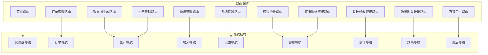
```mermaid
graph TB
subgraph "路由配置"
HomeRoute[首页路由]
OrdersRoute[订单管理路由]
EffectsRoute[效果图生成路由]
ProductionRoute[生产管理路由]
LogisticsRoute[物流管理路由]
SettingsRoute[系统设置路由]
RemoteRoute[远程协作路由]
ServiceLinkRoute[客服沟通链接路由]
DesignLinkRoute[设计修改链接路由]
EffectDesignerRoute[效果图设计器路由]
StorePortalRoute[店铺门户路由]
end
subgraph "导航结构"
DashboardNav[仪表盘导航]
OrdersNav[订单导航]
ProductionNav[生产导航]
LogisticsNav[物流导航]
SettingsNav[设置导航]
ServiceNav[客服导航]
DesignNav[设计导航]
EffectNav[效果导航]
StoreNav[商店导航]
end
HomeRoute --> DashboardNav
OrdersRoute --> OrdersNav
EffectsRoute --> ProductionNav
ProductionRoute --> ProductionNav
LogisticsRoute --> LogisticsNav
SettingsRoute --> SettingsNav
RemoteRoute --> ServiceNav
ServiceLinkRoute --> ServiceNav
DesignLinkRoute --> DesignNav
EffectDesignerRoute --> EffectNav
StorePortalRoute --> StoreNav
```

**图表来源**
- [index.js:3-46](file://frontend/src/router/index.js#L3-L46)
- [index.js:67-80](file://frontend/src/router/index.js#L67-L80)

### 状态管理模式

系统采用Pinia进行状态管理，实现了全局状态的集中管理和实时同步。

```mermaid
graph TB
subgraph "状态管理结构"
OrderStore[订单状态管理]
UserStore[用户状态管理]
UIStore[界面状态管理]
ServiceLinkStore[客服外链状态管理]
DesignLinkStore[设计链接状态管理]
EffectDesignerStore[效果图设计器状态管理]
StorePortalStore[店铺门户状态管理]
EmailTemplateStore[邮件模板状态管理]
end
subgraph "数据流"
LocalState[本地状态]
SupabaseState[Supabase状态]
ComputedState[计算状态]
ServiceLinkState[客服外链状态]
DesignLinkState[设计链接状态]
EffectDesignerState[效果图设计器状态]
StorePortalState[店铺门户状态]
EmailTemplateState[邮件模板状态]
end
subgraph "操作流程"
FetchData[获取数据]
UpdateData[更新数据]
SyncData[同步数据]
ValidateToken[验证Token]
LoadShopData[加载店铺数据]
LoadOrders[加载订单列表]
LoadEffectData[加载效果数据]
LoadStoreData[加载商店数据]
LoadTemplateData[加载模板数据]
end
OrderStore --> LocalState
OrderStore --> SupabaseState
OrderStore --> ComputedState
ServiceLinkStore --> ServiceLinkState
DesignLinkStore --> DesignLinkState
EffectDesignerStore --> EffectDesignerState
StorePortalStore --> StorePortalState
EmailTemplateStore --> EmailTemplateState
FetchData --> SupabaseState
UpdateData --> SupabaseState
SyncData --> LocalState
ValidateToken --> ServiceLinkState
LoadShopData --> DesignLinkState
LoadOrders --> ServiceLinkState
LoadEffectData --> EffectDesignerState
LoadStoreData --> StorePortalState
LoadTemplateData --> EmailTemplateState
```

**图表来源**
- [orderStore.js:23-362](file://frontend/src/stores/orderStore.js#L23-L362)
- [ServiceLink.vue:255-328](file://frontend/src/views/ServiceLink/ServiceLink.vue#L255-L328)
- [DesignLink.vue:269-316](file://frontend/src/views/DesignLink/DesignLink.vue#L269-L316)

**章节来源**
- [index.js:1-59](file://frontend/src/router/index.js#L1-L59)
- [orderStore.js:1-362](file://frontend/src/stores/orderStore.js#L1-L362)

## 性能与扩展性

### 性能优化策略

系统在设计时充分考虑了性能优化和资源管理：

- **前端性能**：Vue3的响应式系统和组件懒加载机制
- **后端性能**：FastAPI的异步处理和Uvicorn的高性能服务器
- **数据库优化**：Supabase的连接池和查询优化
- **缓存策略**：字体文件的内存缓存和文件系统缓存
- **Token缓存**：客服外链Token的内存缓存机制
- **AI服务缓存**：AI生成内容的缓存机制
- **文件存储优化**：Supabase Storage的CDN加速

### 扩展性设计

系统采用模块化设计，便于功能扩展和维护：

- **插件化架构**：服务层采用插件化设计，便于添加新功能
- **配置驱动**：通过配置文件管理环境变量和行为参数
- **API标准化**：RESTful API设计便于第三方集成
- **数据库迁移**：Supabase的Schema管理支持数据库版本控制
- **双链接扩展**：客服外链系统支持更多链接类型的扩展
- **AI服务扩展**：AI服务支持多种AI提供商的集成
- **多租户扩展**：支持更多店铺和用户的扩展

## 部署与运维

### 开发环境配置

系统支持多种部署方式，包括本地开发、容器化部署和云原生部署。

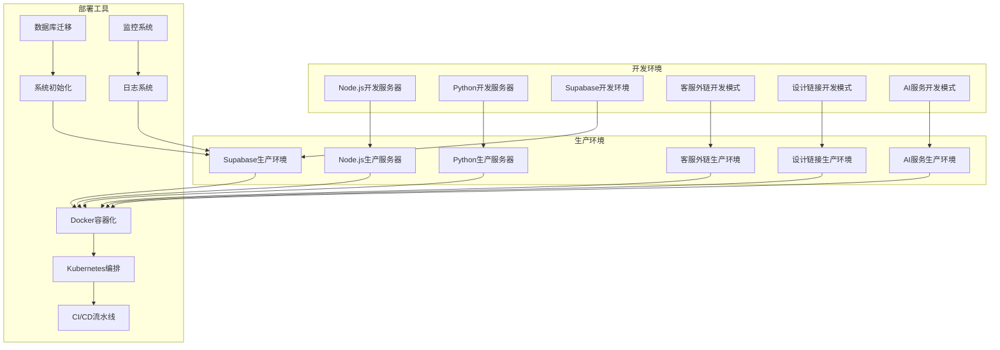
```mermaid
graph TB
subgraph "开发环境"
NodeDev[Node.js开发服务器]
PythonDev[Python开发服务器]
SupabaseDev[Supabase开发环境]
ServiceLinkDev[客服外链开发模式]
DesignLinkDev[设计链接开发模式]
AIDev[AI服务开发模式]
end
subgraph "生产环境"
NodeProd[Node.js生产服务器]
PythonProd[Python生产服务器]
SupabaseProd[Supabase生产环境]
ServiceLinkProd[客服外链生产环境]
DesignLinkProd[设计链接生产环境]
AIProd[AI服务生产环境]
end
subgraph "部署工具"
Docker[Docker容器化]
Kubernetes[Kubernetes编排]
CI_CD[CI/CD流水线]
Migration[数据库迁移]
Init[系统初始化]
Monitoring[监控系统]
Logging[日志系统]
end
NodeDev --> NodeProd
PythonDev --> PythonProd
SupabaseDev --> SupabaseProd
ServiceLinkDev --> ServiceLinkProd
DesignLinkDev --> DesignLinkProd
AIDev --> AIProd
NodeProd --> Docker
PythonProd --> Docker
SupabaseProd --> Docker
ServiceLinkProd --> Docker
DesignLinkProd --> Docker
AIProd --> Docker
Docker --> Kubernetes
Kubernetes --> CI_CD
Migration --> Init
Init --> SupabaseProd
Monitoring --> Logging
Logging --> SupabaseProd
```

### 监控与日志

系统集成了完整的监控和日志系统：

- **前端监控**：Vue DevTools和浏览器开发者工具
- **后端监控**：FastAPI的内置监控和日志记录
- **数据库监控**：Supabase的性能监控和查询分析
- **AI服务监控**：AI API调用的监控和错误追踪
- **客服外链监控**：专门的日志记录和审计功能
- **物流服务监控**：4PX API调用的监控和状态追踪
- **错误追踪**：统一的错误处理和异常报告机制

## 总结

ETSY订单自动化系统通过V2.01_20260403里程碑式的架构升级，成功实现了从单点功能到完整业务流程自动化平台的跨越。系统不仅保持了原有的订单处理能力，还大幅增强了AI智能服务、物流配送自动化、双链接客服系统等核心功能。

### 主要成就

- **全流程自动化**：从订单接收、效果图生成、邮件发送到物流配送的完整自动化流程
- **AI智能集成**：深度集成智谱AI，提供智能化邮件生成和客户服务
- **双链接客服系统**：独立的沟通链接和设计链接，支持不同客服角色需求
- **实时数据同步**：通过Supabase实现前后端数据实时同步
- **多租户架构**：支持多店铺、多角色的业务模式
- **模块化设计**：服务层采用模块化架构，便于功能扩展和维护
- **现代化技术栈**：Vue3 + FastAPI + Supabase的现代FullStack架构

### 系统特色

- **智能邮件服务**：基于AI的邮件内容生成，支持多场景邮件模板
- **物流自动化**：集成4PX物流API，实现订单创建、标签生成、状态跟踪
- **实时协作**：双链接系统支持客服远程协作和实时沟通
- **多语言支持**：AI翻译服务提供多语言邮件和客户服务
- **个性化推荐**：AI推荐服务提供个性化产品推荐和营销建议
- **安全验证**：多层次的Token验证机制确保系统安全

### 未来发展方向

系统为未来的功能扩展奠定了坚实基础，可以轻松集成更多电商平台、支持更复杂的订单处理场景，并提供更丰富的报表和分析功能。通过持续的技术迭代和功能完善，系统将继续为Etsy卖家创造更大的商业价值。

通过新增的AI智能服务和物流自动化功能，ETSY订单自动化系统不仅提升了客服工作效率，还增强了系统的智能化水平和自动化程度，为电商卖家提供了更加完善和智能化的自动化解决方案。