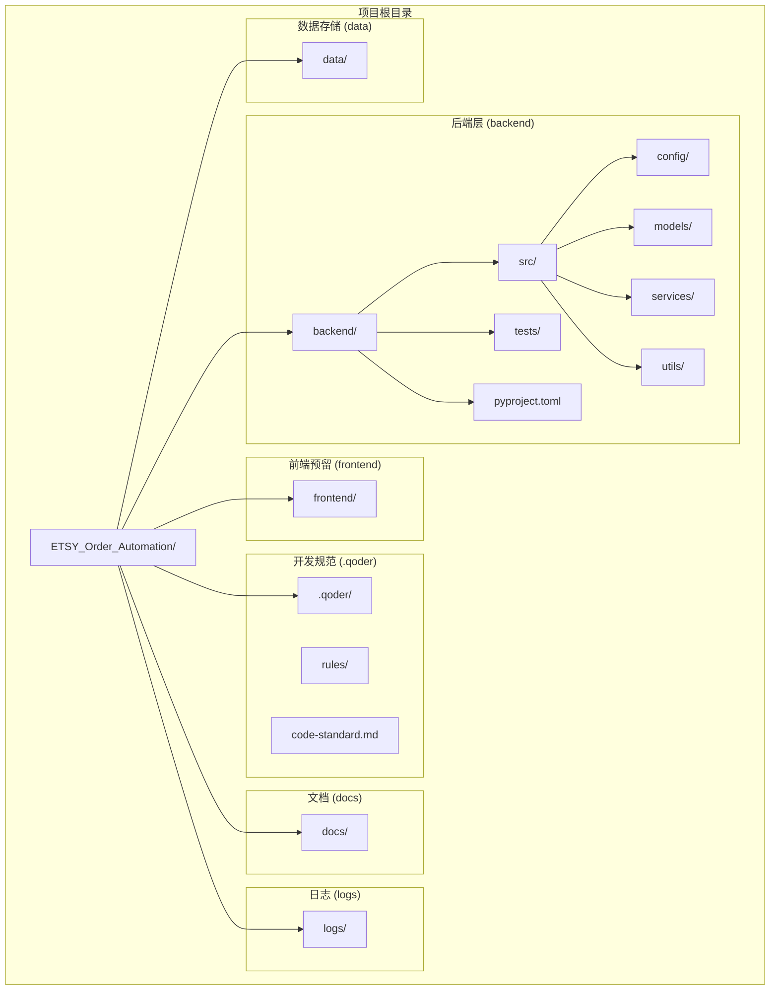
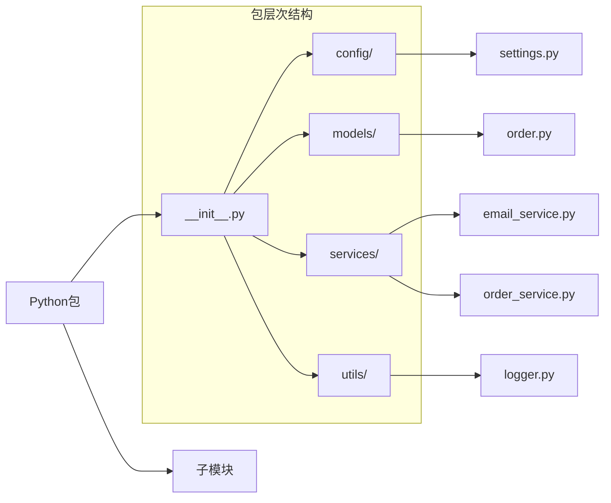
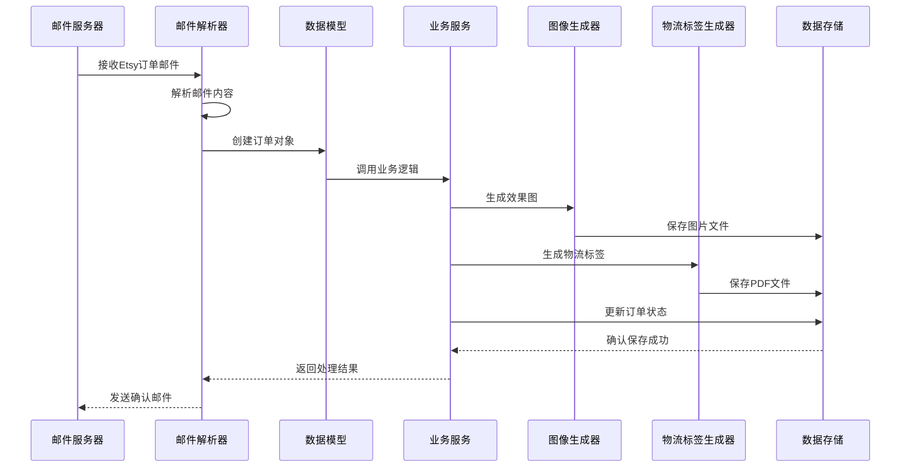
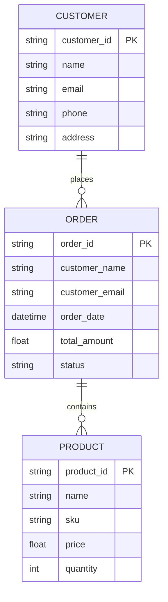
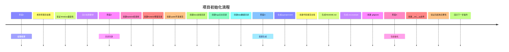

# 项目结构详解

<cite>
**本文档引用的文件**
- [init_project.py](file://init_project.py)
</cite>

## 目录
1. [项目概述](#项目概述)
2. [项目结构总览](#项目结构总览)
3. [核心目录详解](#核心目录详解)
4. [目录创建逻辑分析](#目录创建逻辑分析)
5. [文件组织原则](#文件组织原则)
6. [开发规范体系](#开发规范体系)
7. [数据流架构](#数据流架构)
8. [项目初始化流程](#项目初始化流程)
9. [最佳实践建议](#最佳实践建议)
10. [总结](#总结)

## 项目概述

ETSY订单自动化系统是一个基于Python的全栈项目，旨在实现Etsy订单的全流程自动化处理。该系统通过自动读取邮件、智能解析订单数据、自动生成效果图和物流标签，大幅提高电商运营效率。

**章节来源**
- [init_project.py](file://init_project.py#L1-L10)

## 项目结构总览

项目采用标准的分层架构设计，包含完整的前后端分离结构和完善的开发规范体系。



**图表来源**
- [init_project.py](file://init_project.py#L40-L75)

## 核心目录详解

### 后端目录结构 (backend/)

后端采用标准的Python项目结构，遵循分层架构设计原则：

#### 源代码目录 (src/)
- **作用**: 存放所有Python源代码文件
- **组织原则**: 按功能模块划分，保持单一职责
- **文件类型**: `.py` 源代码文件

#### 配置模块 (src/config/)
- **作用**: 系统配置管理和环境变量处理
- **包含**: 配置文件、数据库连接配置、API密钥管理
- **特点**: 支持多环境配置切换

#### 数据模型 (src/models/)
- **作用**: 定义数据结构和业务实体
- **包含**: 订单模型、用户模型、产品模型等
- **特点**: 使用SQLAlchemy ORM进行数据库映射

#### 业务服务 (src/services/)
- **作用**: 实现核心业务逻辑
- **包含**: 邮件解析服务、订单处理服务、图像生成服务
- **特点**: 高内聚低耦合的服务组件

#### 工具函数 (src/utils/)
- **作用**: 提供通用工具函数和辅助方法
- **包含**: 日志工具、加密解密、文件处理等
- **特点**: 可复用的工具函数集合

#### 测试目录 (tests/)
- **作用**: 存放单元测试和集成测试
- **组织原则**: 与源代码结构对应
- **特点**: 支持pytest测试框架

**章节来源**
- [init_project.py](file://init_project.py#L47-L53)

### 前端预留结构 (frontend/)

- **作用**: Vue3前端应用预留位置
- **特点**: 采用现代化前端技术栈
- **扩展性**: 支持独立部署和开发

### 开发规范目录 (.qoder/)

#### 规则库 (rules/)
- **作用**: 存放项目开发规范和最佳实践
- **包含**: 代码风格规范、Git提交规范、文档模板
- **特点**: 标准化的开发流程

#### 代码规范文档 (code-standard.md)
- **内容**: PEP8代码风格、Google注释规范、类型注解标准
- **用途**: 团队协作开发的统一标准

**章节来源**
- [init_project.py](file://init_project.py#L55-L56)

### 文档目录 (docs/)
- **作用**: 项目文档中心
- **包含**: 用户手册、API文档、部署指南
- **特点**: 结构化的文档管理体系

### 日志目录 (logs/)
- **作用**: 存放系统运行日志
- **管理**: 自动轮转和清理机制
- **监控**: 支持实时日志查看和分析

### 数据存储目录 (data/)
- **作用**: 存储应用数据和缓存
- **包含**: SQLite数据库文件、临时文件、导出数据
- **安全**: 数据备份和恢复机制

## 目录创建逻辑分析

项目初始化脚本采用模块化设计，每个功能模块负责特定的创建任务：


**图表来源**
- [init_project.py](file://init_project.py#L873-L921)

### 权限检测机制

系统首先检测当前运行权限，确保能够正常创建文件和目录：
- Windows系统使用`IsUserAnAdmin()`检测管理员权限
- 非Windows系统跳过权限检测
- 权限不足时提供明确的解决方案

### 目录创建策略

采用递归创建方式，支持以下特性：
- 自动跳过已存在的目录
- 统一的错误处理机制
- 详细的进度反馈

**章节来源**
- [init_project.py](file://init_project.py#L16-L75)

## 文件组织原则

### Python包结构

项目严格遵循Python包组织原则：



**图表来源**
- [init_project.py](file://init_project.py#L789-L812)

### 文件命名规范

- **模块文件**: 使用小写字母和下划线分隔 (`email_service.py`)
- **类文件**: 使用PascalCase命名 (`OrderParser.py`)
- **常量文件**: 使用全大写字母和下划线 (`CONSTANTS.py`)

### 包初始化文件

每个包都包含`__init__.py`文件，用于：
- 标识Python包
- 控制模块导入行为
- 提供包级别的初始化代码

**章节来源**
- [init_project.py](file://init_project.py#L794-L812)

## 开发规范体系

### 代码风格规范

项目采用PEP8标准，结合Black代码格式化工具：

#### 缩进和空格
- 使用4个空格进行缩进
- 运算符两侧保留空格
- 逗号后添加空格

#### 行长度限制
- 每行最多88个字符
- 长表达式使用括号换行

#### 空行规范
- 顶级函数和类之间2个空行
- 类内方法之间1个空行
- 函数内逻辑段落之间1个空行

### 命名规范

#### 变量和函数
- 使用snake_case命名法
- 示例: `order_id`, `parse_email_content()`

#### 类名
- 使用PascalCase命名法
- 示例: `OrderParser`, `EmailService`

#### 常量
- 使用UPPER_SNAKE_CASE命名法
- 示例: `MAX_RETRY_COUNT`, `DEFAULT_TIMEOUT`

### 注释规范

采用Google风格的文档字符串：

```python
def example_function(param1: str, param2: int = 10) -> bool:
    """示例函数说明。
    
    功能描述：演示如何编写符合规范的函数注释
    
    Args:
        param1: 第一个参数的说明
        param2: 第二个参数的说明，默认值为10
        
    Returns:
        返回值的说明
        
    Raises:
        ValueError: 当参数无效时抛出的异常
        TypeError: 当参数类型错误时抛出的异常
    """
    pass
```

### 类型注解规范

使用Python内置的typing模块：

```python
from typing import List, Dict, Optional, Union, Tuple

def process_order(
    order_id: str,
    items: List[Dict[str, Union[str, int, float]]],
    discount: Optional[float] = None
) -> Dict[str, Union[str, float]]:
    """处理订单并返回结果"""
    pass
```

**章节来源**
- [init_project.py](file://init_project.py#L176-L484)

## 数据流架构

### 系统数据流



### 数据存储架构



**图表来源**
- [init_project.py](file://init_project.py#L108-L114)

## 项目初始化流程

### 完整初始化步骤



### 初始化验证

系统提供完整的初始化验证机制：
- 目录创建成功检查
- 文件生成完整性验证
- 权限和路径正确性确认
- 最终状态报告

**章节来源**
- [init_project.py](file://init_project.py#L873-L921)

## 最佳实践建议

### 目录结构维护

1. **保持层级清晰**: 遵循现有目录结构，不要随意更改
2. **模块化设计**: 每个功能模块独立存放，便于维护
3. **版本控制**: 所有代码文件纳入Git管理
4. **文档同步**: 修改代码时同步更新相关文档

### 开发流程规范

1. **代码审查**: 所有代码变更必须经过审查
2. **测试覆盖**: 新功能必须包含相应的测试用例
3. **日志记录**: 关键操作必须有详细的日志记录
4. **错误处理**: 完善的异常处理和错误恢复机制

### 性能优化建议

1. **数据库优化**: 合理使用索引，避免N+1查询
2. **缓存策略**: 对频繁访问的数据使用缓存
3. **异步处理**: IO密集型操作使用异步处理
4. **资源管理**: 及时释放数据库连接和文件句柄

## 总结

ETSY订单自动化系统采用标准化的项目结构设计，具有以下特点：

### 架构优势

- **模块化设计**: 清晰的功能模块划分，便于维护和扩展
- **规范化管理**: 完善的开发规范和质量控制体系
- **可扩展性**: 支持前后端分离和微服务架构演进
- **易维护性**: 标准化的目录结构和文件组织原则

### 技术特色

- **Python后端**: 基于现代Python生态系统的稳定后端
- **Vue3前端**: 现代化的前端技术栈预留
- **开发规范**: 完整的代码规范和最佳实践体系
- **自动化工具**: 全面的项目初始化和配置管理

### 发展前景

该项目为Etsy订单处理提供了完整的自动化解决方案，通过标准化的架构设计和完善的开发规范，为后续的功能扩展和技术演进奠定了坚实基础。开发者可以在此基础上快速实现更多业务功能，满足不断变化的电商运营需求。