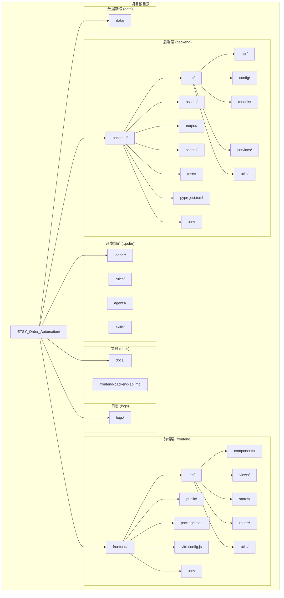
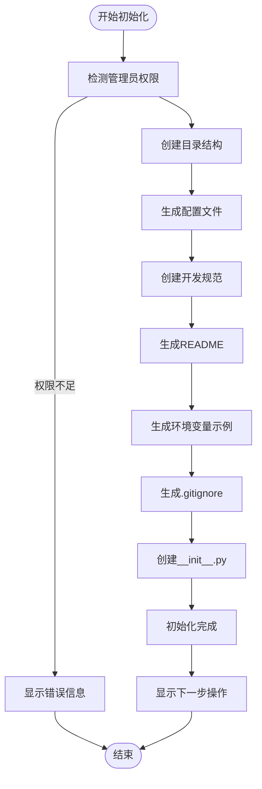
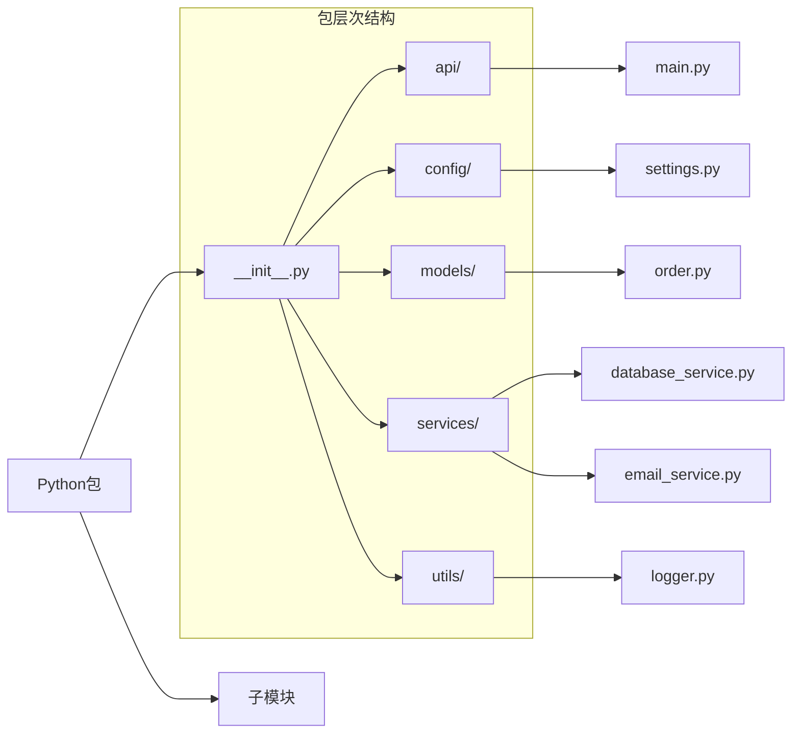
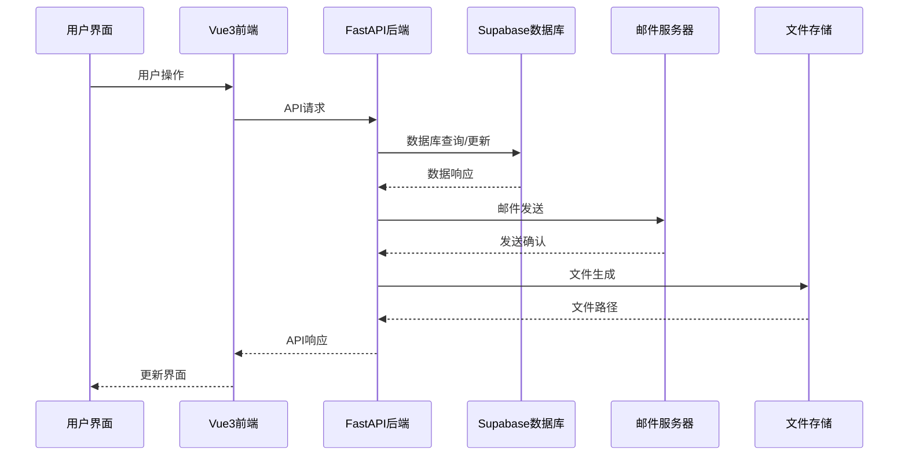
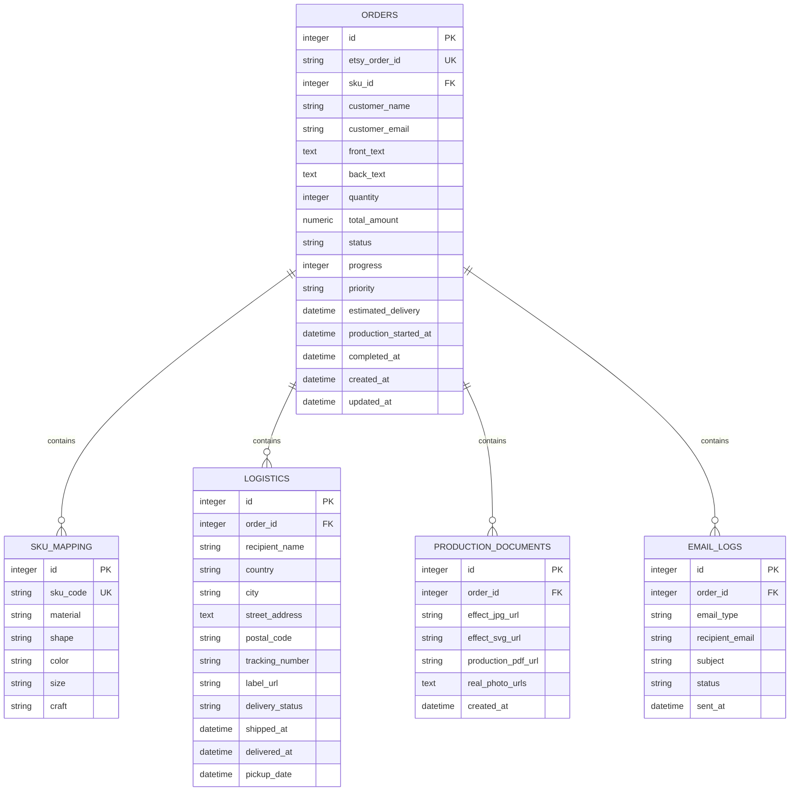
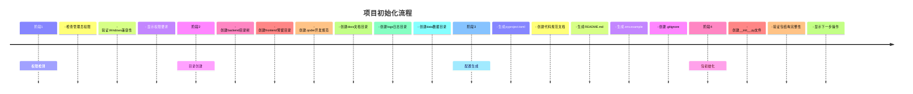

# 项目结构详解

<cite>
**本文档引用的文件**
- [pyproject.toml](file://backend/pyproject.toml)
- [package.json](file://frontend/package.json)
- [main.py](file://backend/src/api/main.py)
- [settings.py](file://backend/src/config/settings.py)
- [vite.config.js](file://frontend/vite.config.js)
- [.env.example](file://backend/.env.example)
- [.env.example](file://frontend/.env.example)
- [frontend-backend-api.md](file://docs/frontend-backend-api.md)
- [database_service.py](file://backend/src/services/database_service.py)
- [order.py](file://backend/src/models/order.py)
- [index.js](file://frontend/src/router/index.js)
- [orderStore.js](file://frontend/src/stores/orderStore.js)
</cite>

## 更新摘要
**所做更改**
- 更新了后端架构：从传统Python项目升级为FastAPI + Supabase的现代化后端
- 新增完整的Vue3前端架构：包含路由、状态管理、组件化开发
- 更新了数据库集成：从SQLite迁移到Supabase PostgreSQL
- 完善了开发工具链配置：Vite + Vue3 + Element Plus + Pinia
- 更新了API接口设计：RESTful API + CORS跨域支持
- 新增了完整的开发规范和文档体系

## 目录
1. [项目概述](#项目概述)
2. [项目结构总览](#项目结构总览)
3. [核心目录详解](#核心目录详解)
4. [目录创建逻辑分析](#目录创建逻辑分析)
5. [文件组织原则](#文件组织原则)
6. [开发规范体系](#开发规范体系)
7. [数据流架构](#数据流架构)
8. [项目初始化流程](#项目初始化流程)
9. [最佳实践建议](#最佳实践建议)
10. [总结](#总结)

## 项目概述

ETSY订单自动化系统是一个基于Python的全栈项目，现已升级为现代化的前后端分离架构。系统通过FastAPI后端服务和Vue3前端应用，实现Etsy订单的全流程自动化处理，包括自动读取邮件、智能解析订单数据、自动生成效果图和物流标签，大幅提高电商运营效率。

**章节来源**
- [pyproject.toml](file://backend/pyproject.toml#L1-L69)
- [package.json](file://frontend/package.json#L1-L27)

## 项目结构总览

项目采用现代化的分层架构设计，包含完整的前后端分离结构、Supabase数据库集成和完善的开发规范体系。



**图表来源**
- [pyproject.toml](file://backend/pyproject.toml#L1-L69)
- [package.json](file://frontend/package.json#L1-L27)

## 核心目录详解

### 后端目录结构 (backend/)

后端采用现代化的FastAPI架构，完全重构为基于Supabase的云原生服务。

#### 源代码目录 (src/)
- **作用**: 存放所有Python源代码文件
- **组织原则**: 按功能模块划分，保持单一职责
- **文件类型**: `.py` 源代码文件

#### API层 (src/api/)
- **作用**: FastAPI应用入口和路由定义
- **包含**: 主应用文件、路由控制器、请求模型
- **特点**: RESTful API设计，支持CORS跨域

#### 配置模块 (src/config/)
- **作用**: 系统配置管理和环境变量处理
- **包含**: 配置文件、数据库连接配置、API密钥管理
- **特点**: 支持多环境配置切换，Supabase集成

#### 数据模型 (src/models/)
- **作用**: 定义数据结构和业务实体
- **包含**: 订单模型、用户模型、产品模型等
- **特点**: SQLAlchemy ORM + Supabase数据库映射

#### 业务服务 (src/services/)
- **作用**: 实现核心业务逻辑
- **包含**: 邮件解析服务、订单处理服务、图像生成服务、数据库服务
- **特点**: 高内聚低耦合的服务组件，支持Supabase操作

#### 工具函数 (src/utils/)
- **作用**: 提供通用工具函数和辅助方法
- **包含**: 日志工具、加密解密、文件处理等
- **特点**: 可复用的工具函数集合

#### 资源目录 (assets/)
- **作用**: 存放静态资源文件
- **包含**: 字体文件、产品图片、模板文件
- **特点**: 结构化的资源管理

#### 输出目录 (output/)
- **作用**: 存放生成的PDF和SVG文件
- **管理**: 自动文件管理机制
- **监控**: 支持文件预览和下载

#### 脚本目录 (scripts/)
- **作用**: 存放各种处理脚本
- **包含**: PDF转换、SVG处理、数据库操作等脚本
- **特点**: 专用工具脚本集合

**章节来源**
- [pyproject.toml](file://backend/pyproject.toml#L8-L36)
- [settings.py](file://backend/src/config/settings.py#L12-L56)

### 前端目录结构 (frontend/)

Vue3前端应用采用现代化的组件化开发架构。

#### 源代码目录 (src/)
- **作用**: 存放所有Vue3源代码文件
- **组织原则**: 按功能模块划分，组件化开发
- **文件类型**: `.vue` 组件文件、`.js` JavaScript文件

#### 组件库 (src/components/)
- **作用**: 存放可复用的Vue组件
- **包含**: 公共组件、效果组件、物流组件、订单组件、生产组件
- **特点**: 模块化组件设计

#### 视图页面 (src/views/)
- **作用**: 存放页面级组件
- **包含**: 仪表盘、订单管理、效果图生成、生产文档、物流管理、系统设置、远程协作
- **特点**: 页面级组件，支持懒加载

#### 状态管理 (src/stores/)
- **作用**: 存放Pinia状态管理文件
- **包含**: 订单状态管理、用户状态管理等
- **特点**: 响应式状态管理

#### 路由配置 (src/router/)
- **作用**: 存放Vue Router配置
- **包含**: 路由定义、导航守卫
- **特点**: 支持动态路由和导航元信息

#### 工具函数 (src/utils/)
- **作用**: 存放前端工具函数
- **包含**: API调用、Supabase客户端、辅助函数
- **特点**: 可复用的前端工具集合

#### 公共资源 (public/)
- **作用**: 存放静态公共资源
- **包含**: Vite图标、其他静态文件
- **特点**: 构建时直接复制到输出目录

#### 包管理 (package.json)
- **作用**: 前端依赖管理
- **包含**: Vue3、Element Plus、Pinia、Vue Router等依赖
- **特点**: 现代化前端技术栈

#### 构建配置 (vite.config.js)
- **作用**: Vite构建工具配置
- **包含**: 插件配置、路径别名、开发服务器设置
- **特点**: 支持ES模块和TypeScript

**章节来源**
- [package.json](file://frontend/package.json#L11-L25)
- [index.js](file://frontend/src/router/index.js#L1-L59)
- [orderStore.js](file://frontend/src/stores/orderStore.js#L1-L362)

### 开发规范目录 (.qoder/)

#### 规则库 (rules/)
- **作用**: 存放项目开发规范和最佳实践
- **包含**: 代码风格规范、Git提交规范、文档模板
- **特点**: 标准化的开发流程

#### 代理系统 (agents/)
- **作用**: 存放AI代理相关文件
- **包含**: 设计规则、代理配置
- **特点**: AI驱动的开发辅助

#### 技能库 (skills/)
- **作用**: 存放开发技能和工具
- **包含**: 编程技能、设计技能
- **特点**: 支持多模态开发

### 文档目录 (docs/)
- **作用**: 项目文档中心
- **包含**: 前后端API对接文档、开发指南
- **特点**: 结构化的文档管理体系

### 日志目录 (logs/)
- **作用**: 存放系统运行日志
- **管理**: 自动轮转和清理机制
- **监控**: 支持实时日志查看和分析

### 数据存储目录 (data/)
- **作用**: 存储应用数据和缓存
- **包含**: SQLite数据库文件、临时文件、导出数据
- **安全**: 数据备份和恢复机制

## 目录创建逻辑分析

项目初始化脚本采用模块化设计，每个功能模块负责特定的创建任务：



**图表来源**
- [pyproject.toml](file://backend/pyproject.toml#L66-L69)

### 权限检测机制

系统首先检测当前运行权限，确保能够正常创建文件和目录：
- Windows系统使用`IsUserAnAdmin()`检测管理员权限
- 非Windows系统跳过权限检测
- 权限不足时提供明确的解决方案

### 目录创建策略

采用递归创建方式，支持以下特性：
- 自动跳过已存在的目录
- 统一的错误处理机制
- 详细的进度反馈

**章节来源**
- [pyproject.toml](file://backend/pyproject.toml#L1-L69)

## 文件组织原则

### Python包结构

项目严格遵循Python包组织原则：



**图表来源**
- [main.py](file://backend/src/api/main.py#L1-L201)
- [settings.py](file://backend/src/config/settings.py#L1-L56)

### 文件命名规范

- **模块文件**: 使用小写字母和下划针分隔 (`email_service.py`)
- **类文件**: 使用PascalCase命名 (`OrderParser.py`)
- **常量文件**: 使用全大写字母和下划线 (`CONSTANTS.py`)

### 包初始化文件

每个包都包含`__init__.py`文件，用于：
- 标识Python包
- 控制模块导入行为
- 提供包级别的初始化代码

**章节来源**
- [main.py](file://backend/src/api/main.py#L15-L16)

## 开发规范体系

### 代码风格规范

项目采用PEP8标准，结合Black代码格式化工具：

#### 缩进和空格
- 使用4个空格进行缩进
- 运算符两侧保留空格
- 逗号后添加空格

#### 行长度限制
- 每行最多88个字符
- 长表达式使用括号换行

#### 空行规范
- 顶级函数和类之间2个空行
- 类内方法之间1个空行
- 函数内逻辑段落之间1个空行

### 命名规范

#### 变量和函数
- 使用snake_case命名法
- 示例: `order_id`, `parse_email_content()`

#### 类名
- 使用PascalCase命名法
- 示例: `OrderParser`, `EmailService`

#### 常量
- 使用UPPER_SNAKE_CASE命名法
- 示例: `MAX_RETRY_COUNT`, `DEFAULT_TIMEOUT`

### 注释规范

采用Google风格的文档字符串：

```python
def example_function(param1: str, param2: int = 10) -> bool:
    """示例函数说明。
    
    功能描述：演示如何编写符合规范的函数注释
    
    Args:
        param1: 第一个参数的说明
        param2: 第二个参数的说明，默认值为10
        
    Returns:
        返回值的说明
        
    Raises:
        ValueError: 当参数无效时抛出的异常
        TypeError: 当参数类型错误时抛出的异常
    """
    pass
```

### 类型注解规范

使用Python内置的typing模块：

```python
from typing import List, Dict, Optional, Union, Tuple

def process_order(
    order_id: str,
    items: List[Dict[str, Union[str, int, float]]],
    discount: Optional[float] = None
) -> Dict[str, Union[str, float]]:
    """处理订单并返回结果"""
    pass
```

**章节来源**
- [pyproject.toml](file://backend/pyproject.toml#L50-L65)

## 数据流架构

### 系统数据流



### 数据存储架构



**图表来源**
- [order.py](file://backend/src/models/order.py#L23-L235)
- [frontend-backend-api.md](file://docs/frontend-backend-api.md#L9-L312)

## 项目初始化流程

### 完整初始化步骤



### 初始化验证

系统提供完整的初始化验证机制：
- 目录创建成功检查
- 文件生成完整性验证
- 权限和路径正确性确认
- 最终状态报告

**章节来源**
- [pyproject.toml](file://backend/pyproject.toml#L66-L69)

## 最佳实践建议

### 目录结构维护

1. **保持层级清晰**: 遵循现有目录结构，不要随意更改
2. **模块化设计**: 每个功能模块独立存放，便于维护
3. **版本控制**: 所有代码文件纳入Git管理
4. **文档同步**: 修改代码时同步更新相关文档

### 开发流程规范

1. **代码审查**: 所有代码变更必须经过审查
2. **测试覆盖**: 新功能必须包含相应的测试用例
3. **日志记录**: 关键操作必须有详细的日志记录
4. **错误处理**: 完善的异常处理和错误恢复机制

### 性能优化建议

1. **数据库优化**: 合理使用索引，避免N+1查询
2. **缓存策略**: 对频繁访问的数据使用缓存
3. **异步处理**: IO密集型操作使用异步处理
4. **资源管理**: 及时释放数据库连接和文件句柄

### 前后端协作

1. **API设计**: 遵循RESTful规范，保持接口一致性
2. **数据同步**: 使用Supabase实时监听功能
3. **错误处理**: 统一的错误响应格式
4. **性能监控**: 前后端性能指标监控

## 总结

ETSY订单自动化系统采用现代化的全栈架构设计，具有以下特点：

### 架构优势

- **模块化设计**: 清晰的功能模块划分，便于维护和扩展
- **云原生架构**: 基于Supabase的无服务器数据库服务
- **前后端分离**: Vue3前端 + FastAPI后端的现代化组合
- **规范化管理**: 完善的开发规范和质量控制体系
- **可扩展性**: 支持微服务架构演进和功能扩展
- **易维护性**: 标准化的目录结构和文件组织原则

### 技术特色

- **FastAPI后端**: 基于ASGI的高性能异步Web框架
- **Vue3前端**: 现代化的响应式前端框架，支持Composition API
- **Supabase数据库**: 云端PostgreSQL数据库，支持实时功能
- **Element Plus组件库**: 完整的企业级UI组件库
- **Pinia状态管理**: 原生响应式状态管理
- **Vite构建工具**: 快速的开发服务器和构建工具

### 开发体验

- **热重载**: Vite提供极速的热模块替换
- **TypeScript支持**: 完整的TypeScript开发体验
- **组件化开发**: Vue3单文件组件的现代化开发模式
- **响应式状态**: Pinia提供直观的状态管理
- **实时协作**: Supabase支持多用户实时协作

### 发展前景

该项目为Etsy订单处理提供了完整的现代化自动化解决方案，通过标准化的架构设计、完善的开发规范和现代化的技术栈，为后续的功能扩展和技术演进奠定了坚实基础。开发者可以在此基础上快速实现更多业务功能，满足不断变化的电商运营需求，同时享受现代化开发工具带来的高效开发体验。